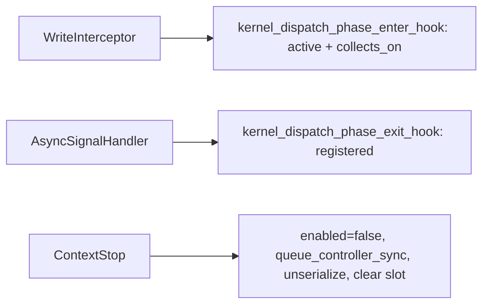

> **Base PR of the #8887 stack.** Same content as #8887; the head branch `users/vkale/remove-callbacks-spm--with-cursor-fixes`
> lives in `ROCm/rocm-systems` rather than a fork, so CodeQL can read the container
> registry secrets and the full CI matrix actually runs. #8887 keeps the review history
> and is now stacked on this branch.

## Motivation

The purpose of this PR is to isolate the SPM slice of the callback-removal effort (reference PRs #8730 / #8586) into a small, single-service change, per review guidance to land callback removal one service at a time. This is independent of the kernel replay feature in PR #7960 but it aids it.

### Underlying Problem

Dispatch SPM currently registers a `queue_callbacks_t` on every HSA queue. That hides “is this service active?” inside a per-queue map, makes enqueue and completion the same walk, and serializes every GPU while any SPM context is active.

This PR:

1. **Stops registering** SPM with that map. The write interceptor and async signal handler call explicit free functions instead (`spm::kernel_dispatch_phase_enter_hook`, `kernel_dispatch_phase_exit_hook`, `is_active_on_agent`).
2. **Routes completions by provenance** — enter iterates active contexts, exit iterates registered contexts so in-flight dispatches still complete after stop.
3. **Scopes SPM to GPU agents** via `rocprofiler_spm_dispatch_counting_service_set_agents`, with GPU drain on stop and per-agent serialization refcounting.

The per-queue callback registry remains for counters, thread trace, and PC sampling until those services land in their own PRs.

### Notes on Bigger Picture

Aids PR #7960 and the kernel replay work tracked under AIPROFSDK-68. This PR also helps other features that require removing the SPM per-queue callback registry, but does not depend on kernel replay landing first.

Sibling migrations: thread trace (#8790), counter collection (#8891), PC sampling (#8895).

## Technical Details

**Enter = active, exit = registered.** Exit self-filters via `packet_return_map` so in-flight dispatches complete after stop.

**Agent-scoped interception gate.** The write interceptor no longer asks "is this service active anywhere?" but "is it active on *this dispatch's* agent?". `no_real_consumers` and the `should_batch_packets` decision both evaluate `is_active_on_agent(queue.get_agent().get_rocp_agent()->id)` instead of `is_any_active()`. A context scoped to one GPU therefore no longer drags other GPUs' queues through interception or costs them packet batching. Introduced in `4bbc5a8`, it is the counterpart, on the interception side, of the per-agent serialization refcount in point 3 above.

Permalinks pin to `47a0139`, the current head.

### Hooks and call sites

- Declarations: [queue_hooks.hpp](https://github.com/ROCm/rocm-systems/blob/47a01391cabb6bfedad655b10d1743c41a9fb042/projects/rocprofiler-sdk/source/lib/rocprofiler-sdk/spm/queue_hooks.hpp)
- Enter: [queue_hooks.cpp#L42-L78](https://github.com/ROCm/rocm-systems/blob/47a01391cabb6bfedad655b10d1743c41a9fb042/projects/rocprofiler-sdk/source/lib/rocprofiler-sdk/spm/queue_hooks.cpp#L42-L78)
- Exit (registered / provenance): [queue_hooks.cpp#L80-L115](https://github.com/ROCm/rocm-systems/blob/47a01391cabb6bfedad655b10d1743c41a9fb042/projects/rocprofiler-sdk/source/lib/rocprofiler-sdk/spm/queue_hooks.cpp#L80-L115)
- `is_any_active`: [queue_hooks.cpp#L117-L121](https://github.com/ROCm/rocm-systems/blob/47a01391cabb6bfedad655b10d1743c41a9fb042/projects/rocprofiler-sdk/source/lib/rocprofiler-sdk/spm/queue_hooks.cpp#L117-L121)
- `is_active_on_agent` (agent-scoped gate): [queue_hooks.cpp#L123-L131](https://github.com/ROCm/rocm-systems/blob/47a01391cabb6bfedad655b10d1743c41a9fb042/projects/rocprofiler-sdk/source/lib/rocprofiler-sdk/spm/queue_hooks.cpp#L123-L131)
- `no_real_consumers` gate: [queue.cpp#L446-L450](https://github.com/ROCm/rocm-systems/blob/47a01391cabb6bfedad655b10d1743c41a9fb042/projects/rocprofiler-sdk/source/lib/rocprofiler-sdk/hsa/queue.cpp#L446-L450)
- Enter call site: [queue.cpp#L847-L858](https://github.com/ROCm/rocm-systems/blob/47a01391cabb6bfedad655b10d1743c41a9fb042/projects/rocprofiler-sdk/source/lib/rocprofiler-sdk/hsa/queue.cpp#L847-L858)
- Exit call site: [queue.cpp#L298-L303](https://github.com/ROCm/rocm-systems/blob/47a01391cabb6bfedad655b10d1743c41a9fb042/projects/rocprofiler-sdk/source/lib/rocprofiler-sdk/hsa/queue.cpp#L298-L303)
- Batching disabled while active: [queue.cpp#L1228-L1229](https://github.com/ROCm/rocm-systems/blob/47a01391cabb6bfedad655b10d1743c41a9fb042/projects/rocprofiler-sdk/source/lib/rocprofiler-sdk/hsa/queue.cpp#L1228-L1229)
- `start_context` (no `add_callback`): [core.cpp#L258-L276](https://github.com/ROCm/rocm-systems/blob/47a01391cabb6bfedad655b10d1743c41a9fb042/projects/rocprofiler-sdk/source/lib/rocprofiler-sdk/spm/core.cpp#L258-L276)
- Stop (`enabled` → drain → unserialize): [core.cpp#L283-L323](https://github.com/ROCm/rocm-systems/blob/47a01391cabb6bfedad655b10d1743c41a9fb042/projects/rocprofiler-sdk/source/lib/rocprofiler-sdk/spm/core.cpp#L283-L323)
- Stop services **before** active-slot CAS: [context.cpp#L655-L678](https://github.com/ROCm/rocm-systems/blob/47a01391cabb6bfedad655b10d1743c41a9fb042/projects/rocprofiler-sdk/source/lib/rocprofiler-sdk/context/context.cpp#L655-L678)
- Conflict uses `intersects`: [context.cpp#L537-L542](https://github.com/ROCm/rocm-systems/blob/47a01391cabb6bfedad655b10d1743c41a9fb042/projects/rocprofiler-sdk/source/lib/rocprofiler-sdk/context/context.cpp#L537-L542)
- `set_agents` API: [spm.h#L318-L338](https://github.com/ROCm/rocm-systems/blob/47a01391cabb6bfedad655b10d1743c41a9fb042/projects/rocprofiler-sdk/source/include/rocprofiler-sdk/experimental/spm.h#L318-L338)
- Producer tag: [client_ids.hpp#L50-L59](https://github.com/ROCm/rocm-systems/blob/47a01391cabb6bfedad655b10d1743c41a9fb042/projects/rocprofiler-sdk/source/lib/rocprofiler-sdk/hsa/queue_hooks/client_ids.hpp#L50-L59)
- `rocprofiler_spm_destroy_counter_config` null guard (`91089a0`): [service.cpp#L124-L131](https://github.com/ROCm/rocm-systems/blob/47a01391cabb6bfedad655b10d1743c41a9fb042/projects/rocprofiler-sdk/source/lib/rocprofiler-sdk/spm/service.cpp#L124-L131)

### Reviewer Guide

1. Confirm enter = active, exit = registered ([queue_hooks.cpp](https://github.com/ROCm/rocm-systems/blob/47a01391cabb6bfedad655b10d1743c41a9fb042/projects/rocprofiler-sdk/source/lib/rocprofiler-sdk/spm/queue_hooks.cpp)).
2. SPM-only runs still enter `WriteInterceptor`, and the gate is now per-agent ([queue.cpp#L446-L450](https://github.com/ROCm/rocm-systems/blob/47a01391cabb6bfedad655b10d1743c41a9fb042/projects/rocprofiler-sdk/source/lib/rocprofiler-sdk/hsa/queue.cpp#L446-L450)).
3. `start_context` does **not** call `add_callback` ([core.cpp#L258-L276](https://github.com/ROCm/rocm-systems/blob/47a01391cabb6bfedad655b10d1743c41a9fb042/projects/rocprofiler-sdk/source/lib/rocprofiler-sdk/spm/core.cpp#L258-L276)).
4. `context::stop_context` stops SPM **before** the active-slot CAS ([context.cpp#L655-L678](https://github.com/ROCm/rocm-systems/blob/47a01391cabb6bfedad655b10d1743c41a9fb042/projects/rocprofiler-sdk/source/lib/rocprofiler-sdk/context/context.cpp#L655-L678)).
5. `spm::stop_context` keeps `queue_controller_sync` ([core.cpp#L283-L323](https://github.com/ROCm/rocm-systems/blob/47a01391cabb6bfedad655b10d1743c41a9fb042/projects/rocprofiler-sdk/source/lib/rocprofiler-sdk/spm/core.cpp#L283-L323)) — drain bounds when completions arrive; provenance routing bounds delivery. The block comment there records why it was kept rather than removed.
6. In-flight regression: `spm_queue_hooks` test `stop_context_in_flight_completion_routes_via_hook_path` ([tests/core.cpp#L993](https://github.com/ROCm/rocm-systems/blob/47a01391cabb6bfedad655b10d1743c41a9fb042/projects/rocprofiler-sdk/source/lib/rocprofiler-sdk/spm/tests/core.cpp#L993)) — `packet_return_map` drains via `kernel_dispatch_phase_exit_hook` after stop.
7. Per-agent: `set_agents_restricts_collection` ([tests/core.cpp#L1139](https://github.com/ROCm/rocm-systems/blob/47a01391cabb6bfedad655b10d1743c41a9fb042/projects/rocprofiler-sdk/source/lib/rocprofiler-sdk/spm/tests/core.cpp#L1139)) and `disjoint_contexts_no_conflict` ([tests/core.cpp#L1221](https://github.com/ROCm/rocm-systems/blob/47a01391cabb6bfedad655b10d1743c41a9fb042/projects/rocprofiler-sdk/source/lib/rocprofiler-sdk/spm/tests/core.cpp#L1221)).
8. Gate-only unit test: [queue_hooks_test.cpp#L33-L36](https://github.com/ROCm/rocm-systems/blob/47a01391cabb6bfedad655b10d1743c41a9fb042/projects/rocprofiler-sdk/source/lib/rocprofiler-sdk/spm/tests/queue_hooks_test.cpp#L33-L36).

**Questions to Answer:** 

- In-flight SPM dispatch still gets `DISPATCH_END` / `kfd_stop` after stop? `packet_return_map` empty? 

- GPU-1-only SPM leave GPU-0 alone?

**Out of scope:** deleting `Queue::_callbacks`; other service migrations.

## Issue Tracking

JIRA ticket: AIPROFSDK-1018

Related JIRA ticket on kernel replay: AIPROFSDK-68. The kernel replay PR is #7960.

## Test Plan

- [is_any_active](https://github.com/ROCm/rocm-systems/blob/47a01391cabb6bfedad655b10d1743c41a9fb042/projects/rocprofiler-sdk/source/lib/rocprofiler-sdk/spm/tests/queue_hooks_test.cpp#L33-L36)
- In-flight + per-agent tests in [spm/tests/core.cpp](https://github.com/ROCm/rocm-systems/blob/47a01391cabb6bfedad655b10d1743c41a9fb042/projects/rocprofiler-sdk/source/lib/rocprofiler-sdk/spm/tests/core.cpp)
- Existing start/stop / sync / restart tests updated off callback iteration

## Test Result

Intended coverage listed above. Treat the Checks tab as source of truth for CI.

## Submission Checklist

- [x] Look over the contributing guidelines at https://github.com/ROCm/rocm-systems/blob/develop/CONTRIBUTING.md.
