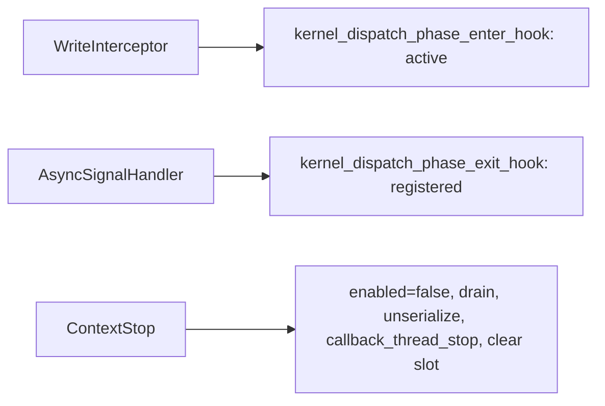

> **Base PR of the #8891 stack.** Same content as #8891; the head branch `users/vkale/remove-callbacks-counters--with-cursor-fixes`
> lives in `ROCm/rocm-systems` rather than a fork, so CodeQL can read the container
> registry secrets and the full CI matrix actually runs. #8891 keeps the review history
> and is now stacked on this branch.

## Motivation

The purpose of this PR is to isolate the counter-collection slice of the callback-removal effort (reference PRs #8730 / #8586) into a small, single-service change, per review guidance to land callback removal one service at a time. 

### Underlying Problem 

Dispatch counter collection currently registers a `queue_callbacks_t` on every HSA queue. That hides “is this service active?” inside a per-queue map, makes enqueue and completion the same walk, and serializes every GPU while any counter context is active.

This PR:

1. **Stops registering** counter collection with that map. The write interceptor and async signal handler call explicit free functions instead.
2. **Scopes collection to GPU agents** via `rocprofiler_dispatch_counting_service_set_agents`, so disjoint agent sets can be active together.

Public dispatch callback/record APIs are unchanged except for `set_agents`. Device counting is untouched. The per-queue callback map remains for unmigrated services.

### Notes on Bigger Picture 

Note the associated focused effort of the PR #8790 for migrating thread trace off the per-queue callback registry. 

The kernel replay feature PR #7960 is greatly enhanced by this PR. However, note this is independent of the kernel replay feature and can be used for other features in ROCprofiler-SDK.

## Technical Details

**Enter vs exit use different context sets.** Enter iterates **active** contexts; exit iterates **registered** contexts so in-flight dispatches still complete after stop.

**Agent-scoped interception gate.** The write interceptor no longer asks "is this service active anywhere?" but "is it active on *this dispatch's* agent?". `no_real_consumers` and the `should_batch_packets` decision both evaluate `is_active_on_agent(queue.get_agent().get_rocp_agent()->id)` instead of `is_any_active()`. A context scoped to one GPU therefore no longer drags other GPUs' queues through interception or costs them packet batching. Measured on two-GPU CI hardware by `tests.integration.execute.counter-collection-per-agent`: against a 7.72 ms baseline, an unrestricted context costs 4.53x while a context scoped to GPU-1 leaves GPU-0 at 1.00x (7.73 ms).

Architecture: [queue_callback_removal_architecture.md](https://github.com/ROCm/rocm-systems/blob/79a456af15c8ff70bea3814ab26fd606eaab856b/projects/rocprofiler-sdk/source/docs/conceptual/queue_hooks/queue_callback_removal_architecture.md). Permalinks pin to `79a456a`, the current head.

### Hooks and call sites

- Declarations: [queue_hooks.hpp](https://github.com/ROCm/rocm-systems/blob/79a456af15c8ff70bea3814ab26fd606eaab856b/projects/rocprofiler-sdk/source/lib/rocprofiler-sdk/counters/queue_hooks.hpp)
- Enter (`collects_on`, `COUNTERS_CLIENT_ID`): [queue_hooks.cpp#L45-L84](https://github.com/ROCm/rocm-systems/blob/79a456af15c8ff70bea3814ab26fd606eaab856b/projects/rocprofiler-sdk/source/lib/rocprofiler-sdk/counters/queue_hooks.cpp#L45-L84)
- Exit (provenance via `packet_return_map`): [queue_hooks.cpp#L86-L126](https://github.com/ROCm/rocm-systems/blob/79a456af15c8ff70bea3814ab26fd606eaab856b/projects/rocprofiler-sdk/source/lib/rocprofiler-sdk/counters/queue_hooks.cpp#L86-L126)
- `is_any_active`: [queue_hooks.cpp#L128-L132](https://github.com/ROCm/rocm-systems/blob/79a456af15c8ff70bea3814ab26fd606eaab856b/projects/rocprofiler-sdk/source/lib/rocprofiler-sdk/counters/queue_hooks.cpp#L128-L132)
- `is_active_on_agent` (agent-scoped gate): [queue_hooks.cpp#L134-L142](https://github.com/ROCm/rocm-systems/blob/79a456af15c8ff70bea3814ab26fd606eaab856b/projects/rocprofiler-sdk/source/lib/rocprofiler-sdk/counters/queue_hooks.cpp#L134-L142)
- `no_real_consumers` gate: [queue.cpp#L448-L452](https://github.com/ROCm/rocm-systems/blob/79a456af15c8ff70bea3814ab26fd606eaab856b/projects/rocprofiler-sdk/source/lib/rocprofiler-sdk/hsa/queue.cpp#L448-L452)
- Enter call site: [queue.cpp#L849-L860](https://github.com/ROCm/rocm-systems/blob/79a456af15c8ff70bea3814ab26fd606eaab856b/projects/rocprofiler-sdk/source/lib/rocprofiler-sdk/hsa/queue.cpp#L849-L860)
- Exit call site: [queue.cpp#L298-L303](https://github.com/ROCm/rocm-systems/blob/79a456af15c8ff70bea3814ab26fd606eaab856b/projects/rocprofiler-sdk/source/lib/rocprofiler-sdk/hsa/queue.cpp#L298-L303)
- Batching disabled while active: [queue.cpp#L1230-L1231](https://github.com/ROCm/rocm-systems/blob/79a456af15c8ff70bea3814ab26fd606eaab856b/projects/rocprofiler-sdk/source/lib/rocprofiler-sdk/hsa/queue.cpp#L1230-L1231)
- `start_context` (no `add_callback`): [core.cpp#L148-L172](https://github.com/ROCm/rocm-systems/blob/79a456af15c8ff70bea3814ab26fd606eaab856b/projects/rocprofiler-sdk/source/lib/rocprofiler-sdk/counters/core.cpp#L148-L172)
- Stop order (`enabled` → drain → unserialize → callback thread): [core.cpp#L174-L211](https://github.com/ROCm/rocm-systems/blob/79a456af15c8ff70bea3814ab26fd606eaab856b/projects/rocprofiler-sdk/source/lib/rocprofiler-sdk/counters/core.cpp#L174-L211)
- Stop services **before** active-slot CAS: [context.cpp#L655-L676](https://github.com/ROCm/rocm-systems/blob/79a456af15c8ff70bea3814ab26fd606eaab856b/projects/rocprofiler-sdk/source/lib/rocprofiler-sdk/context/context.cpp#L655-L676)
- Producer tags: [client_ids.hpp#L50-L59](https://github.com/ROCm/rocm-systems/blob/79a456af15c8ff70bea3814ab26fd606eaab856b/projects/rocprofiler-sdk/source/lib/rocprofiler-sdk/hsa/queue_hooks/client_ids.hpp#L50-L59)

### Per-agent scoping

- API: [dispatch_counting_service.h#L148-L185](https://github.com/ROCm/rocm-systems/blob/79a456af15c8ff70bea3814ab26fd606eaab856b/projects/rocprofiler-sdk/source/include/rocprofiler-sdk/dispatch_counting_service.h#L148-L185)
- `collects_on` / `intersects`: [context.hpp#L82-L110](https://github.com/ROCm/rocm-systems/blob/79a456af15c8ff70bea3814ab26fd606eaab856b/projects/rocprofiler-sdk/source/lib/rocprofiler-sdk/context/context.hpp#L82-L110)
- Conflict uses `intersects`: [context.cpp#L532-L536](https://github.com/ROCm/rocm-systems/blob/79a456af15c8ff70bea3814ab26fd606eaab856b/projects/rocprofiler-sdk/source/lib/rocprofiler-sdk/context/context.cpp#L532-L536)
- `set_agents` locked while active: [core.cpp#L213-L249](https://github.com/ROCm/rocm-systems/blob/79a456af15c8ff70bea3814ab26fd606eaab856b/projects/rocprofiler-sdk/source/lib/rocprofiler-sdk/counters/core.cpp#L213-L249)
- Serialization refcount: [queue_controller.hpp#L155-L183](https://github.com/ROCm/rocm-systems/blob/79a456af15c8ff70bea3814ab26fd606eaab856b/projects/rocprofiler-sdk/source/lib/rocprofiler-sdk/hsa/queue_controller.hpp#L155-L183)

### Callback-thread refcount

`callback_thread_start` / `callback_thread_stop` now take a mutex across both the refcount transition and the `start()` / `exit()` call ([sample_processing.cpp#L171-L213](https://github.com/ROCm/rocm-systems/blob/79a456af15c8ff70bea3814ab26fd606eaab856b/projects/rocprofiler-sdk/source/lib/rocprofiler-sdk/counters/sample_processing.cpp#L171-L213)). The refcount itself is required by this PR — two dispatch-counting contexts with disjoint agent sets can now be active at once, so stopping either one must not kill the shared consumer thread — but an atomic counter alone does not order the teardown decision against a concurrent start: a stop that decremented to zero could be overtaken by a start that incremented back to one and found the consumer still valid, so `start()` no-opped and the stop then joined the thread underneath it, leaving a non-zero count with no consumer. Nothing is dropped in that state (`consumer_thread_t::add()` consumes inline when the thread is gone) but the work moves onto the HSA async signal handler, which is what this consumer exists to keep free. The `> 0` test additionally keeps an unbalanced stop from driving the count negative. The mutex is held via `static_object` so a late finalizer cannot lock it after this translation unit's statics are gone, which is the teardown hazard `78d6079` fixed for the context stopping set.

Model-checked with CBMC 5.95.1: the property "a non-zero refcount implies a live consumer thread" is violated by the previous code on a two-thread interleaving and holds for this version sequentially, with two threads and with three, alongside "the count never goes negative" and "no thread is left running at zero".

## Reviewer Guide

1. Confirm enter = `get_active_contexts`, exit = `get_registered_contexts` ([queue_hooks.cpp](https://github.com/ROCm/rocm-systems/blob/79a456af15c8ff70bea3814ab26fd606eaab856b/projects/rocprofiler-sdk/source/lib/rocprofiler-sdk/counters/queue_hooks.cpp)).
2. Counters-only runs still enter `WriteInterceptor`, and the gate is now per-agent ([queue.cpp#L448-L452](https://github.com/ROCm/rocm-systems/blob/79a456af15c8ff70bea3814ab26fd606eaab856b/projects/rocprofiler-sdk/source/lib/rocprofiler-sdk/hsa/queue.cpp#L448-L452)).
3. `start_context` does **not** call `add_callback` ([core.cpp#L148-L172](https://github.com/ROCm/rocm-systems/blob/79a456af15c8ff70bea3814ab26fd606eaab856b/projects/rocprofiler-sdk/source/lib/rocprofiler-sdk/counters/core.cpp#L148-L172)).
4. `context::stop_context` stops counters **before** the active-slot CAS ([context.cpp#L655-L676](https://github.com/ROCm/rocm-systems/blob/79a456af15c8ff70bea3814ab26fd606eaab856b/projects/rocprofiler-sdk/source/lib/rocprofiler-sdk/context/context.cpp#L655-L676)).
5. `counters::stop_context` drains before teardown ([core.cpp#L174-L211](https://github.com/ROCm/rocm-systems/blob/79a456af15c8ff70bea3814ab26fd606eaab856b/projects/rocprofiler-sdk/source/lib/rocprofiler-sdk/counters/core.cpp#L174-L211)).
6. `collects_on` filters **before** `queue_cb` ([queue_hooks.cpp#L64-L68](https://github.com/ROCm/rocm-systems/blob/79a456af15c8ff70bea3814ab26fd606eaab856b/projects/rocprofiler-sdk/source/lib/rocprofiler-sdk/counters/queue_hooks.cpp#L64-L68)).
7. In-flight regression: [queue_hooks_test.cpp#L254-L395](https://github.com/ROCm/rocm-systems/blob/79a456af15c8ff70bea3814ab26fd606eaab856b/projects/rocprofiler-sdk/source/lib/rocprofiler-sdk/counters/tests/queue_hooks_test.cpp#L254-L395) — map drops by one per completion **and** every dispatch reaches the record callback after stop.
8. Per-agent: [per_agent_scoping_test.cpp](https://github.com/ROCm/rocm-systems/blob/79a456af15c8ff70bea3814ab26fd606eaab856b/projects/rocprofiler-sdk/source/lib/rocprofiler-sdk/counters/tests/per_agent_scoping_test.cpp), integration [per_agent_scoping_app.cpp](https://github.com/ROCm/rocm-systems/blob/79a456af15c8ff70bea3814ab26fd606eaab856b/projects/rocprofiler-sdk/tests/counter-collection-per-agent/per_agent_scoping_app.cpp).
9. Callback-thread refcount is taken under a mutex together with `start()` / `exit()` ([sample_processing.cpp#L198-L213](https://github.com/ROCm/rocm-systems/blob/79a456af15c8ff70bea3814ab26fd606eaab856b/projects/rocprofiler-sdk/source/lib/rocprofiler-sdk/counters/sample_processing.cpp#L198-L213)).

**Answer:** In-flight record after stop? GPU-1-only context leave GPU-0 alone? `packet_return_map` empty with every record delivered?

**Out of scope:** deleting `Queue::_callbacks`; migrating other services; device-counting.

## Issue Tracking
JIRA ticket: 
AIPROFSDK-1017

## Test Plan

- [is_any_active](https://github.com/ROCm/rocm-systems/blob/79a456af15c8ff70bea3814ab26fd606eaab856b/projects/rocprofiler-sdk/source/lib/rocprofiler-sdk/counters/tests/queue_hooks_test.cpp#L172-L175); [stop-while-in-flight](https://github.com/ROCm/rocm-systems/blob/79a456af15c8ff70bea3814ab26fd606eaab856b/projects/rocprofiler-sdk/source/lib/rocprofiler-sdk/counters/tests/queue_hooks_test.cpp#L254-L395)
- Per-agent unit + multi-GPU integration (links above)
- Start/stop tests assert `enabled`, not `iterate_callbacks` ([core.cpp](https://github.com/ROCm/rocm-systems/blob/79a456af15c8ff70bea3814ab26fd606eaab856b/projects/rocprofiler-sdk/source/lib/rocprofiler-sdk/counters/tests/core.cpp))

## Test Result

Intended coverage listed above. Treat the Checks tab as source of truth for CI.

## Submission Checklist

- [x] Look over the contributing guidelines at https://github.com/ROCm/rocm-systems/blob/develop/CONTRIBUTING.md.
