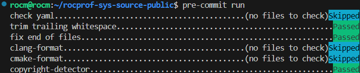

<head>
  <meta charset="UTF-8">
  <meta name="description" content="Contributing to rocprofiler-systems">
  <meta name="keywords" content="ROCm, contributing, rocprofiler-systems">
</head>

# Contributing to rocprofiler-systems #

ROCm Systems Profiler (rocprofiler-systems), formerly Omnitrace, is a comprehensive profiling and tracing tool for parallel applications written in C, C++, Fortran, HIP, OpenCL, and Python which execute on the CPU or CPU+GPU.

We welcome contributions to rocprofiler-systems.  Please follow these details to help ensure your contributions will be successfully accepted.

## Table of Contents ##

1. [Issue Discussion](#issue-discussion)
2. [Acceptance Criteria](#acceptance-criteria)
3. [Pull Request Guidelines](#pull-request-guidelines)
4. [Coding Style](#coding-style)
5. [Code License](#code-license)
6. [References](#references)

## Issue Discussion ##

Please use the GitHub Issues tab to notify us of issues.

* Use your best judgement for issue creation. Search [existing issues](https://github.com/ROCm/rocprofiler-systems/issues) to make sure your issue isn't already listed
* If your issue is already listed, upvote the issue and comment or post to provide additional details, such as how you reproduced this issue.
* If you're not sure if your issue is the same, err on the side of caution and file your issue. You can add a comment to include the issue number (and link) for the similar issue. If we evaluate your issue as being the same as the existing issue, we'll close the duplicate.
* If your issue doesn't exist, use the issue template to file a new issue.
* When filing an issue, be sure to provide as much information as possible, including script output so we can collect information about your configuration. This helps reduce the time required to reproduce your issue.
* Check your issue regularly, as we may require additional information to successfully reproduce the issue.
* You may also open an issue to ask questions to the maintainers about whether a proposed change meets the acceptance criteria, or to discuss an idea pertaining to the library.

## Acceptance Criteria ##

* Contributions should align with the project's goals and maintainability.
* Code should be well-documented and include tests where applicable.
* Ensure that your changes do not break existing functionality.
* Each commit is to be digitally signed. For more details see: [About commit signature verification - GitHub Docs](https://docs.github.com/en/authentication/managing-commit-signature-verification/about-commit-signature-verification).

### Exceptions ###

* If you believe your contribution does not fit the guidelines but is still valuable, please discuss it with the maintainers before submitting.

## Pull Request Guidelines ##

By creating a pull request, you agree to the statements made in the [code license](#code-license) section. Your pull request should target the default branch. Our current default branch is the **amd-staging** branch, which serves as our integration branch.

### Process ###

* Fork the repository and create your branch from `amd-staging`.
* If you've added code that should be tested, add tests.
* Ensure the test suite passes.
* Make sure your code conforms to the format. Use clang-format-18 and/or cmake-format.
* Use clear and descriptive commit messages.
* Submit your PR and work with the reviewer or maintainer to get your PR approved
* Once approved, the PR is brought onto internal CI systems and may be merged into the component during our release cycle, as coordinated by the maintainer.

### Setting Up the Development Environment ###

* It is recommended to [fork](https://github.com/ROCm/rocprofiler-systems/fork) the repository.
* Clone your forked repository: `git clone https://github.com/ROCm/<yourgithub-id>/rocprofiler-systems.git`
* Navigate to the project directory: `cd rocprofiler-systems`
* Set the original repository URL as the remote upstream using `git remote add upstream https://github.com/ROCm/rocprofiler-systems` (or `git remote set-url upstream https://github.com/ROCm/rocprofiler-systems`)
* Verify if origin and upstream points correctly with `git remote -v`.
* Start a new branch for your work: `git checkout -b topic-<yourFeatureName>`
* Build the project as outlined in [ROCm documentation](https://github.com/ROCm/rocprofiler-systems/blob/a03770c0606c23fda5e2c83782f2d188eb8522f5/docs/install/install.rst#building-and-installing-rocm-systems-profiler).

### Running Tests ###

* To run the test suite, use the following command: `make test`
* Ensure all tests pass before submitting a pull request.
* If the project was built with option `-D ROCPROFSYS_BUILD_TESTING=ON`, then the tests are built with it. Individual tests groups can be run using command: `ctest -R <test-name> -V --output-on-failure`. Command `ctest --print-labels` will list all the test names which can be passed to -R as test-name.

## Coding Style ##

* Adhere to the coding style used in the project. This includes naming conventions, indentation, and commenting practices.
* Follow the existing directory structure and organization of the codebase.
* Group related files together and maintain a logical hierarchy.
* Use `clang-format-18` and `cmake-format` formatters to ensure consistency.

### Using pre-commit hooks ###

Our project supports optional [*pre-commit hooks*](https://pre-commit.com/#introduction) which developers can leverage to verify formatting before publishing their code. Once enabled, any commits you propose to the repository will be automatically checked for formatting. Initial setup is as follows:

```shell
pip install pre-commit  # or: apt-get install pre-commit
cd rocprofiler-systems
pre-commit install
```

**Note:** pre-commit version **3.0.0 or higher** is required.

Now, when you commit code to the repository you should see something like this:



Please see the [pre-commit documentation](https://pre-commit.com/#quick-start) for additional information.

## Code License ##

All code contributed to this project will be licensed under the license identified in the [License](LICENSE). Your contribution will be accepted under the same license.

## References ##

1. [ROCm Systems Profiler Documentation](https://rocm.docs.amd.com/projects/rocprofiler-systems/en/latest/index.html)
2. [ROCm Systems Profiler README](README.md)
