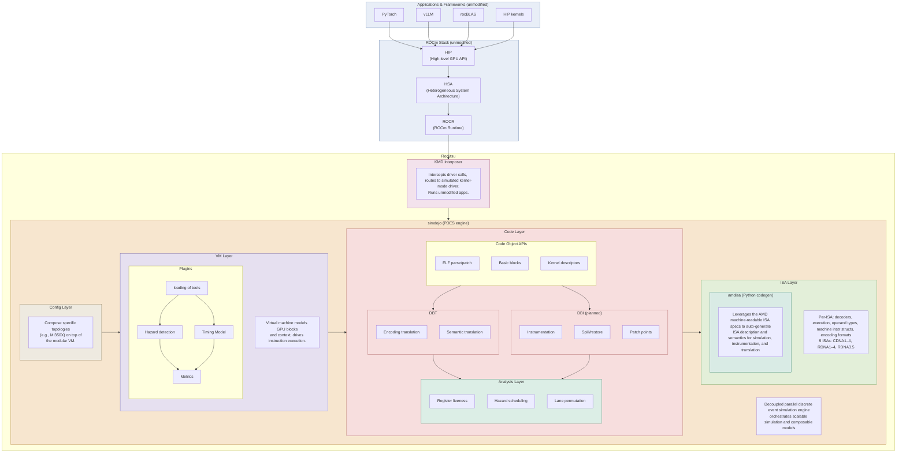
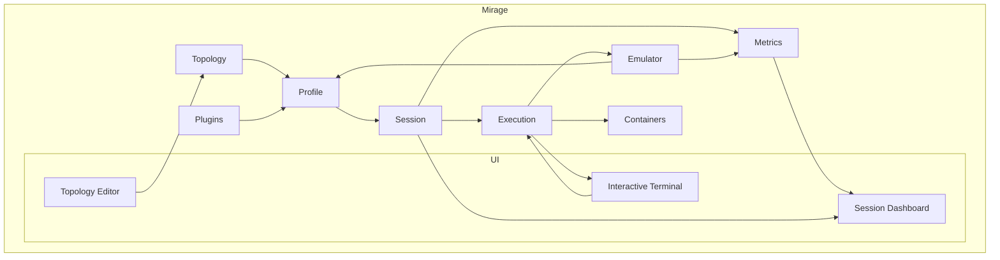

# ROCM Emulation

[work board](https://github.com/orgs/ROCm/projects/164)

## Components

- [Rocjitsu](emulation/rocjitsu/) — JIT-based AMD GPU emulator. The core engine that interprets/translates AMDGPU ISA and models GPU blocks so unmodified ROCm apps can run without a physical GPU.
  - [KMD Interposer](emulation/rocjitsu/lib/rocjitsu/src/rocjitsu/kmd/) — Intercepts kernel-mode driver calls and routes them to the simulated KMD. Per-OS backends in [linux/](emulation/rocjitsu/lib/rocjitsu/src/rocjitsu/kmd/linux/) and [windows/](emulation/rocjitsu/lib/rocjitsu/src/rocjitsu/kmd/windows/).
  - [Config Layer](emulation/rocjitsu/lib/rocjitsu/src/rocjitsu/config/) — Loads and composes topology/profile configs (e.g. MI350X) on top of the modular VM. See [config_loader.cpp](emulation/rocjitsu/lib/rocjitsu/src/rocjitsu/config/config_loader.cpp) and [checkpoint.cpp](emulation/rocjitsu/lib/rocjitsu/src/rocjitsu/config/checkpoint.cpp).
  - [VM Layer](emulation/rocjitsu/lib/rocjitsu/src/rocjitsu/vm/) — Virtual machine modeling GPU blocks, SoC, and thread context; drives instruction execution. Plugin harness via [execution_plugin.h](emulation/rocjitsu/lib/rocjitsu/src/rocjitsu/vm/execution_plugin.h). Per-arch backends in [amdgpu/](emulation/rocjitsu/lib/rocjitsu/src/rocjitsu/vm/amdgpu/) and [risc_v/](emulation/rocjitsu/lib/rocjitsu/src/rocjitsu/vm/risc_v/). Design notes: [DESIGN.md](emulation/rocjitsu/lib/rocjitsu/src/rocjitsu/vm/DESIGN.md).
  - [Code Layer](emulation/rocjitsu/lib/rocjitsu/src/rocjitsu/code/) — Code object APIs: ELF parse/patch, basic blocks, kernel descriptors, executables. See [amdgpu_code_object.cpp](emulation/rocjitsu/lib/rocjitsu/src/rocjitsu/code/amdgpu_code_object.cpp), [basic_block.cpp](emulation/rocjitsu/lib/rocjitsu/src/rocjitsu/code/basic_block.cpp), [executable.cpp](emulation/rocjitsu/lib/rocjitsu/src/rocjitsu/code/executable.cpp).
    - [DBT](emulation/rocjitsu/lib/rocjitsu/src/rocjitsu/code/dbt/) — Dynamic binary translation: encoding and semantic translation.
    - [Patch / DBI](emulation/rocjitsu/lib/rocjitsu/src/rocjitsu/code/patch/) — Patch points and (planned) instrumentation, spill/restore.
  - [Analysis Layer](emulation/rocjitsu/lib/rocjitsu/src/rocjitsu/analysis/) — Register liveness, def-use chains, hazard scheduling, lane permutation. See [liveness.cpp](emulation/rocjitsu/lib/rocjitsu/src/rocjitsu/analysis/liveness.cpp) and [def_use_chain.cpp](emulation/rocjitsu/lib/rocjitsu/src/rocjitsu/analysis/def_use_chain.cpp).
  - [ISA Layer](emulation/rocjitsu/lib/rocjitsu/src/rocjitsu/isa/) — Per-ISA decoders, operand types, machine instruction structs, encoding formats (CDNA1–4, RDNA1–4, RDNA3.5). Entry points: [decoder.cpp](emulation/rocjitsu/lib/rocjitsu/src/rocjitsu/isa/decoder.cpp), [rj_decode.cpp](emulation/rocjitsu/lib/rocjitsu/src/rocjitsu/isa/rj_decode.cpp); per-arch tables in [arch/](emulation/rocjitsu/lib/rocjitsu/src/rocjitsu/isa/arch/).
  - [simdojo](emulation/rocjitsu/lib/simdojo/) — Decoupled parallel discrete-event simulation engine that orchestrates composable models. See [DESIGN.md](emulation/rocjitsu/lib/simdojo/DESIGN.md) and [src/](emulation/rocjitsu/lib/simdojo/src/) ([simulation.cpp](emulation/rocjitsu/lib/simdojo/src/simulation.cpp), [topology.cpp](emulation/rocjitsu/lib/simdojo/src/topology.cpp), [component.cpp](emulation/rocjitsu/lib/simdojo/src/component.cpp)).
  - [amdisa](emulation/rocjitsu/lib/python/amdisa/) — Python codegen that consumes AMD machine-readable ISA specs to auto-generate decoders, semantics, encoding/legalization tables, and cross-ISA translators. Key modules: [parser.py](emulation/rocjitsu/lib/python/amdisa/parser.py), [semantics.py](emulation/rocjitsu/lib/python/amdisa/semantics.py), [encoding_translator_codegen.py](emulation/rocjitsu/lib/python/amdisa/encoding_translator_codegen.py), [legalization_codegen.py](emulation/rocjitsu/lib/python/amdisa/legalization_codegen.py), [cross_isa.py](emulation/rocjitsu/lib/python/amdisa/cross_isa.py), [codegen/](emulation/rocjitsu/lib/python/amdisa/codegen/).
  - [rocjitsu_vllm](emulation/rocjitsu/lib/python/rocjitsu_vllm/) — Python integration glue for running vLLM on top of rocjitsu.
  - [configs](emulation/rocjitsu/configs/), [schemas](emulation/rocjitsu/schemas/), [scripts](emulation/rocjitsu/scripts/), [tests](emulation/rocjitsu/tests/) — Topology/profile configs, schema definitions, build/dev scripts, and test suites.
- **Mirage** — iOS-simulator-inspired UX and CLI that drives rocjitsu (topology editor, session dashboard, interactive terminal). Code lives in a separate repository; see the [Mirage](#mirage) section below for the architecture.

## Rocjitsu

The heart and core of the emulation effort.

##

## Mirage
An IOS simulator inspired UX and CLI to make it easy to use rocjitsu.

### Server

Hosts the UI server
Written in Rust
Designed to be idomorphics so can be started and stopped whenever.
All state is stored to disc.

| term | definition |
| --- | --- |
| profile | a config |
| session | a booted running profile |
| execution | running a program on a session |
| workload | a profile + execution |

### Dashboard

A react dashboard.

#### Topology Editor

Allows creating custom gpus

### Session

view session state + metrics.
start executions

#### Executions

Interactive terminals for sessions