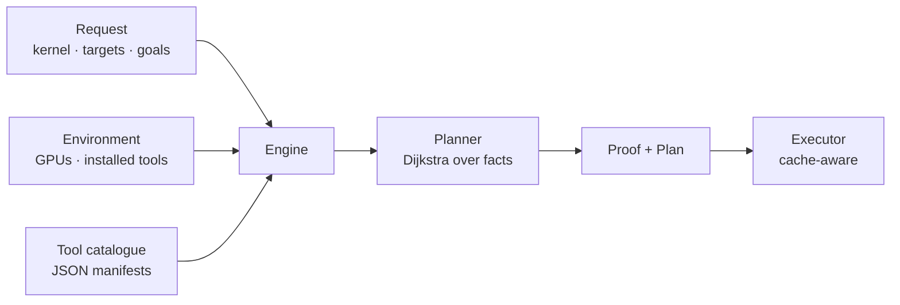

# Bedroc: composable kernel-correctness planning

Bedroc turns a high-level question — *“prove this kernel has no data
hazards on MI350”* — into a concrete, optimal plan and a proof. It does
this by combining two things:

1. **What you ask for** — a kernel, the target GPUs, and the properties
   to establish (the *request*).
2. **What the machine offers** — which GPUs are physically present and
   which emulators/tools are installed (the *environment*).

A path-planner ([`mirage_solver`](../solver)) searches the space of
correctness tools for the cheapest sequence of steps that establishes
every requested property, skipping work whose result is already cached.

The set of tools is **entirely data-defined**: every tool is a JSON
*manifest*. Nothing about a specific tool is hardcoded in Rust, so you
extend Bedroc by dropping a new `.json` file into a tools directory — no
recompilation required.



## Concepts

| Term | Meaning |
| --- | --- |
| **Fact** | A string predicate about the kernel, e.g. `compiled:gfx950`, `no_hazards:gfx950`. Facts are *monotone*: once true, they stay true. |
| **Goal** | A fact you want to be true at the end, derived from a requested property + target. |
| **Step** | One concrete tool invocation: it `requires` some facts and `produces` others at a `cost`. |
| **Manifest** | The JSON template that, expanded per target, yields steps. |
| **Plan** | The cheapest ordered list of steps reaching every goal. |
| **Proof** | The plan plus a per-goal verdict (proven / unsupported) and the list of available vs. unavailable tools. |

### Fact naming convention

Facts use a `predicate:target` shape. The `target` part is always a
canonical `gfxNNN` architecture (see [Targets](#targets)). In a manifest
template you write `${target}`; the engine substitutes it once per
requested target. Source-level facts that are not target-specific omit
the suffix (e.g. `source:hip`).

Examples: `source:hip`, `compiled:gfx950`, `no_hazards:gfx950`,
`correct_output:gfx950`, `no_races:gfx950`, `fp_correct:gfx950`.

## The request

A request has four parts:

- **source** — path to the kernel (used for cache fingerprinting).
- **source-kind** — one of:
  - `hip` (also `cpp`, `c++`) — HIP C++ source → starts with `source:hip`.
  - `asm` (also `assembly`, `s`) — AMDGPU assembly → starts with `source:asm`.
  - `codeobject` (also `co`, `hsaco`, `prebuilt`) — already compiled →
    starts with `compiled:<gfx>` for every target (no compile step).
- **targets** — one or more architectures (see below).
- **goals** — one or more properties to prove.

### Targets

You may pass marketing names or `gfx` targets directly. Known aliases:

| Name(s) | gfx |
| --- | --- |
| `mi300`, `mi300x`, `mi300a`, `mi308`, `mi308x`, `mi325`, `mi325x` | `gfx942` |
| `mi350`, `mi350x`, `mi355`, `mi355x` | `gfx950` |
| `mi400`, `mi450`, `mi450x` | `gfx1250` |
| anything `gfxNNN` | passed through verbatim |

Unknown names pass through unchanged, so the catalogue can still be
exercised against architectures not yet in the table.

### Goals

| Property (CLI `--prove`) | Aliases | Fact predicate |
| --- | --- | --- |
| `no-data-hazards` | `hazards`, `waitcheck` | `no_hazards` |
| `correct-output` | `correct`, `output` | `correct_output` |
| `no-data-races` | `races`, `ldssan`, `consan` | `no_races` |
| `fp-correct` | `fp`, `fpsan`, `numeric` | `fp_correct` |

## Tool manifests

A tool is a single JSON file. This is the complete schema:

```json
{
  "schema_version": 1,
  "id": "waitcheck",
  "name": "Static Wait Check / Hazard Detector",
  "description": "Static final-ISA analysis that flags missing waitcnt and hazards.",
  "category": "analyze",
  "cost": 15,
  "cacheable": true,
  "requires": ["compiled:${target}"],
  "produces": ["no_hazards:${target}"],
  "per_target": true,
  "needs_tools": [],
  "needs_gpu": false,
  "command": null
}
```

| Field | Type | Required | Meaning |
| --- | --- | --- | --- |
| `schema_version` | int | yes | Must equal the current schema version (`1`). |
| `id` | string | yes | Stable unique identifier. |
| `name` | string | yes | Human-readable name. |
| `description` | string | yes | What the tool proves and how. |
| `category` | string | yes | Display grouping: `compile`, `analyze`, `emulate`, `reference`, … |
| `cost` | int | yes | Relative cost; the planner minimizes total cost. |
| `cacheable` | bool | no (default `false`) | If `true`, results may be cached and reused. |
| `requires` | string[] | no (default `[]`) | Precondition fact templates. |
| `produces` | string[] | yes | Effect fact templates (must be non-empty). |
| `per_target` | bool | no (default `false`) | If `true`, the manifest is expanded once per requested target with `${target}` substituted. Must reference `${target}` somewhere. |
| `needs_tools` | string[] | no (default `[]`) | Names of emulators/tools that must be installed for this tool to be usable (e.g. `rocjitsu`). |
| `needs_gpu` | bool | no (default `false`) | If `true`, a physical GPU must be present. |
| `command` | object \| null | no | Optional real invocation `{ "program": "...", "args": ["--target", "${target}"] }`. Unused by the default simulated executor; lets a deployment wire a real command with no code change. |

Validation rejects manifests with the wrong `schema_version`, an empty
`id`, no `produces`, a duplicate `id`, or `per_target: true` without any
`${target}` reference.

### Built-in catalogue

The crate embeds a starter catalogue (ordinary manifests, embedded with
`include_str!` — identical in form to anything you add):

| id | proves | requires | needs |
| --- | --- | --- | --- |
| `compile-hip` | `compiled:${target}` | `source:hip` | — |
| `compile-asm` | `compiled:${target}` | `source:asm` | — |
| `waitcheck` | `no_hazards:${target}` | `compiled:${target}` | — |
| `rocjitsu-emulate` | `emulated:${target}`, `correct_output:${target}` | `compiled:${target}` | `rocjitsu` |
| `ldssan` | `no_races:${target}` | `emulated:${target}` | `rocjitsu` |
| `fpsan` | `fp_correct:${target}` | `source:hip`, `compiled:${target}` | — |
| `reference-run` | `correct_output:${target}` | `compiled:${target}` | `rocjitsu`, GPU |

Two tools (`rocjitsu-emulate` and `reference-run`) deliberately produce
the same `correct_output` fact via different routes; that redundancy is
what differential fuzzing exploits.

## Adding a tool

1. Create a JSON file following the schema above, e.g.
   `my-checker.json`.
2. Put it in either:
   - the per-user directory `<MIRAGE_CONFIG>/bedroc/tools/`
     (run `mirage paths` to find `<MIRAGE_CONFIG>`), **or**
   - any directory you pass with `--tools-dir <dir>` (CLI) /
     `tools_dir` query param (API).
3. Run `mirage bedroc tools -l` to confirm it loaded and whether it is
   usable in the current environment.

That’s it — the planner picks the tool up automatically. To make it
participate in a proof, ensure its `produces` facts match a goal (or
feed a tool that does) and its `requires` facts are reachable from the
source kind.

**Worked example.** Suppose you have a sanitizer `bankcheck` that proves
the absence of LDS bank conflicts on an emulated kernel:

```json
{
  "schema_version": 1,
  "id": "bankcheck",
  "name": "LDS Bank-Conflict Checker",
  "description": "Detects shared-memory bank conflicts on an emulated kernel.",
  "category": "analyze",
  "cost": 120,
  "cacheable": true,
  "requires": ["emulated:${target}"],
  "produces": ["no_bank_conflicts:${target}"],
  "per_target": true,
  "needs_tools": ["rocjitsu"]
}
```

Drop it in the tools directory and the planner will route
`source → compile → rocjitsu-emulate → bankcheck` whenever a goal needs
`no_bank_conflicts`. (To expose it as a first-class `--prove` keyword,
add a `GoalKind`; otherwise it is reachable as a dependency of other
goals.)

## CLI

```text
mirage bedroc tools [-l] [--tools-dir DIR]
mirage bedroc plan  --source FILE --source-kind hip --target mi350 --prove no-data-hazards [--target ...] [--prove ...] [--tools-dir DIR]
mirage bedroc run   <same flags as plan> [--no-cache]
mirage bedroc fuzz  [--iterations N] [--seed N] [--tools-dir DIR]
```

Examples:

```sh
# What tools exist and can they run here?
mirage bedroc tools -l

# Plan a hazard + correctness proof for two targets:
mirage bedroc plan --source kernel.hip \
  --target mi350 --target gfx942 \
  --prove no-data-hazards --prove correct-output

# Plan and (simulate) execute, reusing the on-disk cache:
mirage bedroc run --source kernel.hip --target mi350 --prove correct-output

# Differentially fuzz the catalogue (distinct routes must agree):
mirage bedroc fuzz --iterations 500 --seed 7
```

All subcommands accept `--json` for machine-readable output. `run`
exits non-zero if any requested goal is unproven.

The result cache lives at `<MIRAGE_CACHE>/bedroc/cache.json`; user
manifests are read from `<MIRAGE_CONFIG>/bedroc/tools/`.

## HTTP API

The daemon mounts the same capability under `/api/bedroc`:

| Method & path | Body | Returns |
| --- | --- | --- |
| `GET /api/bedroc/tools` | — | Catalogue with an `available` flag per tool. |
| `POST /api/bedroc/plan` | `{ source, source_kind, targets, goals }` | A `Proof`. |
| `POST /api/bedroc/run` | same as plan | `{ proof, execution }`. |
| `POST /api/bedroc/fuzz` | `{ iterations, seed }` | A fuzz summary. |

The web dashboard exposes all of this on the **Bedroc** page.

## How planning works (internals)

- Each manifest is expanded into concrete `Step`s (one per target when
  `per_target`). Steps unusable in the current environment (missing
  tool or GPU) are dropped, and the reason is recorded for the proof’s
  *unavailable tools* list.
- The initial `State` is the set of source facts plus environment facts.
- The planner runs Dijkstra over the monotone fact-set lattice, where
  applying a step adds its `produces` facts. A reachability pre-pass
  prunes states that can never satisfy the goal.
- `plan_with_cache` consults the on-disk cache: a cacheable step whose
  inputs already have a stored result contributes zero cost.
- `enumerate_plans` (used by the fuzzer) yields *distinct* plans
  cheapest-first, which lets differential fuzzing compare independent
  routes that should establish the same fact.

See the crate docs in [`solver/src/lib.rs`](../solver/src/lib.rs) and
[`bedroc/src/lib.rs`](../bedroc/src/lib.rs) for the API surface.
