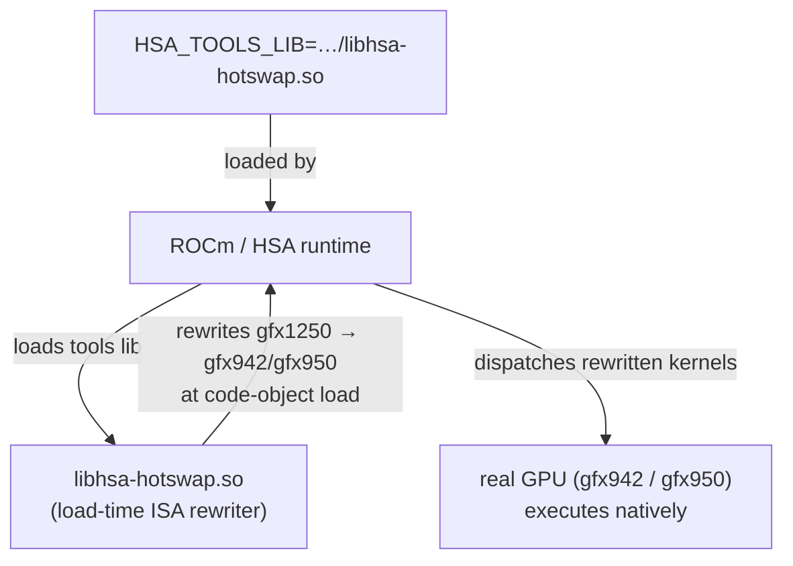

# HotSwap

HotSwap is a **load-time ISA rewriter** for AMD GPUs. It lets a workload built
for one GPU architecture run on a different physical GPU by rewriting device
code as it is loaded — for example running a `gfx1250` (RDNA-class) workload on
a `gfx942` (MI300) or `gfx950` (MI350) host GPU.

Unlike [`rocjitsu`](../rocjitsu/) — which is a *software* simulator that decodes
the ISA in an event-driven core — HotSwap runs on **real hardware** and only
rewrites the parts of the program that the host GPU cannot execute natively.
Because the rewrite happens once, at code-object load time, it is much faster
than a full simulator while still letting you exercise code for an architecture
you don't physically have.

HotSwap plugs into the ROCm runtime as an **HSA tools library**. The ROCm
runtime (HSA) loads it automatically when you point the `HSA_TOOLS_LIB`
environment variable at it:

```sh
HSA_TOOLS_LIB=/path/to/libhsa-hotswap.so ./my-rocm-app
```

`mirage` automates this for you: create a profile that uses the `hotswap`
emulator, and mirage discovers the installed `libhsa-hotswap.so` and injects
`HSA_TOOLS_LIB` into every command it runs under that profile.

## Status

HotSwap is **not bundled with mirage**. mirage will *find* and *use* an existing
HotSwap install, but it does not build or ship one for you. You install HotSwap
yourself (see below), and mirage locates it automatically.

## Usage with mirage

Once `libhsa-hotswap.so` is installed somewhere mirage can find it (see
[Where mirage looks](#where-mirage-looks)):

```sh
# Create a profile that uses HotSwap, then run under it:
mirage profile create rdna --emulator hotswap
mirage run --profile rdna -- ./my-rocm-app --flag
```

If mirage can't find `libhsa-hotswap.so`, `mirage profile create --emulator
hotswap` fails with guidance describing exactly which locations were searched
and how to make the library discoverable. mirage also logs the same guidance
at run time and falls back to running the workload unemulated.

### Where mirage looks

mirage searches for `libhsa-hotswap.so` in the following locations, in order
(the first match wins):

1. Any directory on `$LD_LIBRARY_PATH`.
2. ../../../rocjitsu/build/lib/rocjitsu/src/rocjitsu/kmd/ rel to the `mirage` binary. 
3. `$ROCM_HOME` / `$ROCM_PATH` — the ROCm install root (`<root>/lib`).
4. in `../lib` rel to the `mirage` binary.
5. Standard system / ROCm library directories: `/opt/rocm/lib`,
   `/usr/local/lib`, `/usr/lib`, `/usr/lib/x86_64-linux-gnu`.

## Installation

HotSwap ships as a single shared library, `libhsa-hotswap.so`. You can either
install a prebuilt copy or build it from source.

### Install a prebuilt library

Place `libhsa-hotswap.so` in any location from
[Where mirage looks](#where-mirage-looks). The simplest options:

```sh
# Option A: install into your ROCm tree (visible to all ROCm tooling).
sudo cp libhsa-hotswap.so "${ROCM_PATH:-/opt/rocm}/lib/"

# Option B: drop it into the mirage cache (visible only to mirage).
mkdir -p "${XDG_CACHE_HOME:-$HOME/.cache}/mirage/emulator/hotswap"
cp libhsa-hotswap.so \
   "${XDG_CACHE_HOME:-$HOME/.cache}/mirage/emulator/hotswap/"

# Option C: point an env var at it directly.
export HOTSWAP_LIB=/abs/path/to/libhsa-hotswap.so
```

Verify with `mirage profile create test --emulator hotswap` — it succeeds once
mirage can find the library, and prints install guidance otherwise.

### Build from source

HotSwap lives in a fork of `llvm-project` that carries the ISA-rewriter runtime:

- Source: <https://github.com/martin-luecke/llvm-project> on the `hotswap`
  branch (being upstreamed into the `amd-staging` branch of
  <https://github.com/ROCm/llvm-project>).
- Reference commit at time of writing:
  <https://github.com/ROCm/llvm-project/tree/a48e8a9cc3c2a7131ffdd7d9d3a8371890d3a68b>
- Reference build recipe:
  <https://github.com/ROCm/aise/blob/mluecke/hotswap-transformers-ut/docker/huggingface_ut_hotswap.ubuntu.amd.Dockerfile>

The [`scripts/build-and-package.sh`](scripts/build-and-package.sh) helper
wraps the checkout, build, and packaging steps so you end up with a
`libhsa-hotswap.so` ready to install:

```sh
# Build from the default upstream source into ./target/lib/:
./scripts/build-and-package.sh

# Or build from a local checkout into a custom output directory:
./scripts/build-and-package.sh --src /path/to/llvm-project --out ./dist
```

The script **builds and packages only** — it deliberately does not install the
result. Choose an install location from
[Where mirage looks](#where-mirage-looks) and copy the produced
`target/lib/libhsa-hotswap.so` there yourself.

Run `./scripts/build-and-package.sh --help` for all options.

## How it works (under the hood)



mirage's only job is discovery + wiring: it finds `libhsa-hotswap.so` and sets
`HSA_TOOLS_LIB` for the workload. The rewriting itself is entirely inside the
HotSwap library and the ROCm runtime.

## See also

- [`../rocjitsu/`](../rocjitsu/) — the software GPU simulator backend.
- [`../README.md`](../README.md) — the mirage CLI/dashboard overview.
- [HotSwap Design & Brainstorming Hub][confluence] (internal).

[confluence]: https://amd.atlassian.net/wiki/spaces/MLSE/pages/1620425029/HotSwap+Design+Brainstorming+Hub
