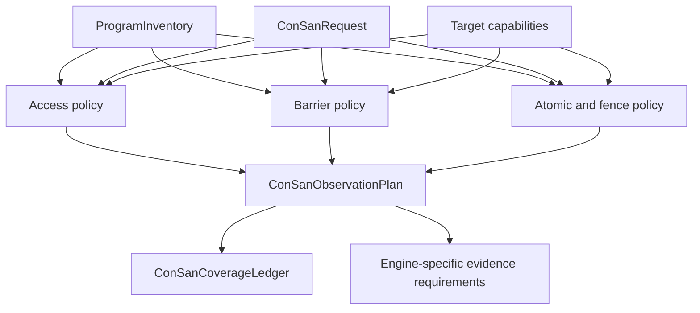
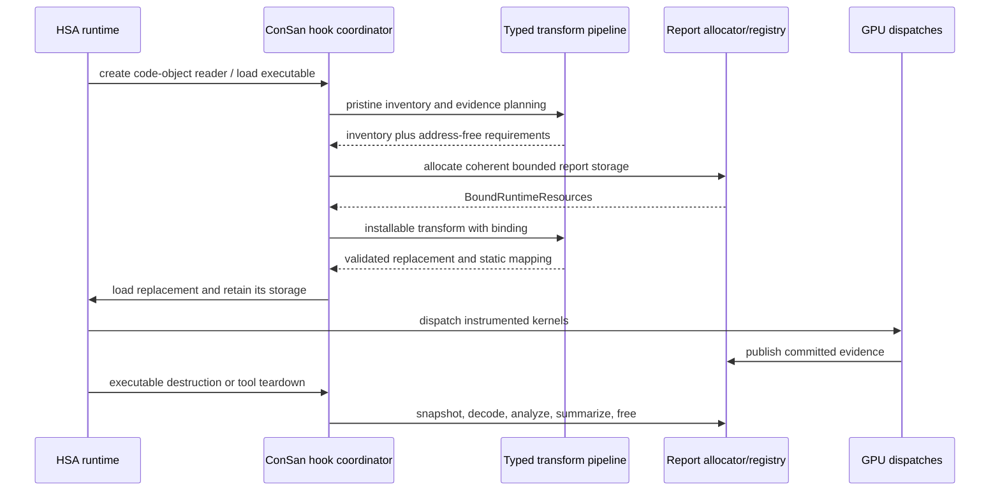
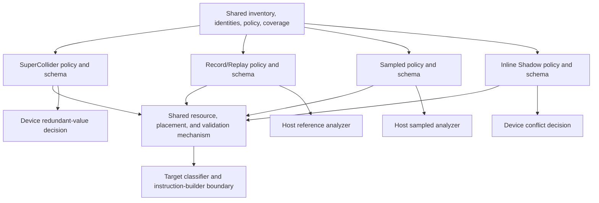

# ConSan design

ConSan is RocJitsu's binary sanitizer for concurrency errors in AMD GPU local
data share (LDS). It operates on the final native code object, discovers memory
and synchronization behavior, chooses observations according to one of four
engines, and installs a validated replacement code object through an HSA tool.

This document describes the implemented production design and its remaining
migration seam. The design is deliberately organized around target-independent
semantic contracts. Target-specific code is restricted to facts and mechanics
that genuinely differ between GPU instruction sets or kernel ABIs.

[PRODUCTION_DESIGN.md](PRODUCTION_DESIGN.md) records the reasoning and the
incremental migration plan that produced these boundaries.
[CAPABILITIES.md](CAPABILITIES.md) is the detailed target/engine capability
matrix. [FLAVORS.md](FLAVORS.md) compares the four engines operationally, and
[SPILLING.md](SPILLING.md) covers register ownership and spilling in depth.

## Terms used by the design

A **code object** is the AMD ELF image containing native GPU instructions,
kernel descriptors, symbols, and resource metadata. A **kernel** is a GPU entry
point. A **dispatch** is one launch of a kernel. It contains workgroups, which
in turn contain waves of lanes executing under an `EXEC` execution mask.

**LDS** is memory shared by the waves in a workgroup. A native DS instruction
addresses LDS directly. A **group-FLAT** instruction uses a generic address but
has been classified as definitely or possibly addressing LDS. A **site** is an
original instruction location considered by ConSan. One physical instruction
can represent several **semantic sites**, for example the two ranges accessed
by a two-address DS instruction.

An **inventory** is an immutable description of the pristine code object:
kernels, sites, access ranges, operand facts, synchronization sequences,
ownership, and explicit analysis exclusions. An **observation plan** records
the target-independent decision to admit, exclude, or reject each semantic
site, plus the probes required for admitted sites. **Lowering** turns those
probe intents into native instructions. **Placement** assigns the instructions
to inline space or code caves and fixes branches. A transformation is
**transactional** when it either returns a complete validated replacement or
leaves the original image untouched.

**Evidence** is device-produced information used to support a concurrency
conclusion: access records, barrier and atomic records, sampled windows, shadow
state, mismatch markers, or diagnostics. A **runtime binding** supplies the
actual memory and lifetime needed to carry that evidence. A clean execution is
not automatically a proof of race freedom: coverage gaps, sampling, overflow,
or missing dynamic evidence can make the result incomplete.

The HSA **hook** is the library loaded through `HSA_TOOLS_LIB`. It intercepts
code-object loading and executable lifetime events, runs ConSan, owns automatic
report storage, and interprets evidence. A **kernarg** region is the
dispatch-specific storage containing explicit and implicit kernel arguments;
when instrumentation extends or copies it, the hook preserves its ABI and
lifetime.

## Design at a glance

ConSan separates semantic decisions from machine-code mechanics and runtime
lifetime management:

```mermaid
flowchart LR
  Env[Environment and API inputs] --> Parse[Configuration parser]
  Parse --> Request[Typed requests and policies]
  ELF[Pristine code object] --> Inventory[Program inventory]
  Target[Target profile] --> Inventory
  Request --> Policy[Engine policy]
  Target --> Policy
  Inventory --> Policy
  Policy --> Plan[Observation plan and coverage ledger]
  Plan --> Evidence[Evidence requirements]
  Plan --> Resources[Resource planning]
  Runtime[Runtime capabilities] --> Resources
  Runtime --> Bind[Runtime binding]
  Evidence --> Bind
  Target --> Lower[Target lowering]
  Resources --> Lower
  Bind --> Lower
  Plan --> Lower
  Lower --> Place[Transactional placement and validation]
  Place --> Replacement[Validated replacement and static mapping]
  Replacement --> Coordinator[HSA runtime coordinator]
  Bind --> Coordinator
  Coordinator --> Device[Instrumented dispatches]
  Device --> Reports[Committed evidence]
  Reports --> Analyze[Evidence decoding and engine analysis]
  Plan --> Analyze
  Analyze --> Verdict[Coverage-aware verdict and diagnostics]
```



The arrows express dependency direction. Engine policy sees semantic facts and
capabilities, not registers or branch encodings. A target lowerer receives an
already-decided probe intent; it cannot reinterpret whether a site matters.
The HSA coordinator owns allocations and executable lifetimes; it does not
choose sanitizer semantics.

Today, every named contract in the upper half of the graph exists. Most native
emission and placement still run inside an explicitly isolated compatibility
lowering path. The former `LegacyConSanLowering` wrapper type has been deleted;
the remaining free operations name the ordinary transform, pristine MOI
inventory, runtime-bound retry, and temporary hook-test publication directly.
This path is still a migration boundary, not the intended final mechanism
layer, and must shrink component by component.

## The four engines

The public mode selects one of four ways to observe the same inventoried
program. Record/Replay, Sampled, and Inline Shadow are Memory-Ordering
Instrumentation (MOI) engines. SuperCollider is a complementary perturbation
and redundant-value-checking engine.

| Engine | Device responsibility | Host responsibility | Meaning of a clean run |
| --- | --- | --- | --- |
| Record/Replay | Publish bounded access and synchronization records with stable dispatch, workgroup, owner, site, and epoch identity. | Validate snapshots and replay conflicts using the reference ordering model. | Meaningful only when required sites and dynamic evidence are complete and no capacity was lost. |
| Sampled | Deterministically select dynamic instances and publish bounded watchpoints, causal windows, and synchronization metadata. | Join and scan retained causal evidence. | Statistical; absence of a report is not a proof that no race occurred. |
| Inline Shadow | Maintain exact-shadow cells and bounded ordering tables, and emit conflicts on the device. | Validate and attribute already-produced diagnostics and loss summaries. | Exact only for admitted forms within declared table and diagnostic capacity. |
| SuperCollider | Delay selected operations and redundantly issue admitted LDS/group-FLAT accesses, detecting value instability. | Collect mismatch markers and coverage. | Shows no mismatch was observed for admitted probes; it is not the MOI happens-before model. |

All four engines consume the same stable site identities, program inventory,
target capability vocabulary, access ranges, and synchronization vocabulary.
They deliberately do not share an evidence schema or make identical claims.
Record/Replay is the semantic reference engine and the first integration target
for host-oriented DBI work.

Loading the hook activates ConSan and selects Record/Replay by default.
`RJ_CONSAN_MODE` selects `record-replay`, `sampled`, `inline-shadow`, or
`supercollider`. `RJ_CONSAN_POLICY=strict` rejects an incomplete or unsupported
transform and requires the expected evidence; it does not turn a race report
itself into a loader error.

## Core contracts and internal interfaces

The core interfaces are value types and pure planning functions. They expose
meaning and explicit failure states instead of a mutable options/result object
that every phase edits.

### Configuration contracts

The hook parser produces six independent inputs:

| Contract | Owns | Must not own |
| --- | --- | --- |
| `ConSanRequest` | Selected flavor/engine, semantic domains, provenance and evidence policy, supported expert controls. | Concrete registers, addresses, layouts, patch geometry, or fault mutation. |
| `TransformPolicy` | Image growth, placement work, and transformation ceilings. | Sanitizer semantics or runtime failure policy. |
| `RuntimePolicy` | Activation, install behavior, fail-open/fail-closed behavior, and process lifetime/capacity policy. | Which sites are semantically relevant. |
| `ConSanDebugOverrides` | Narrow diagnostic and focused-test controls. | Supported product behavior. |
| `MutationRequest` | Validation-only fault injection and perturbation. | Ordinary observation policy. |
| `BoundRuntimeResources` | Concrete report addresses, sizes, scope, generation, and dispatch binding. | Capacity policy or allocation strategy. |

`RuntimeCapabilities` separately records facts discovered from the physical HSA
agent or simulator backend: memory visibility, atomics/coherence, allocation
limits, and executable/dispatch binding facilities. Architecture identity is
not a substitute for these runtime facts.

`validate_consan_configuration` validates the complete static request.
`validate_runtime_capabilities` validates the selected backend and the
requirements of an evidence schema. Environment spellings remain at the hook
edge; transformation code receives typed values.

### Target profile

`ConSanTargetProfile` is the one authoritative immutable row of architectural
facts for a supported target. It records product and encoding families, wave
sizes, register and accumulator allocation rules, identity sources, wait and
call forms, address and segment limits, branch reach, and available semantic
forms. `ConSanKernelTargetProfile` adds descriptor-selected facts such as wave
size without mutating the target-wide row.

The five rows live together in `kConSanTargetProfiles`. Lookup by target or
architecture goes through `consan_target_profile`; per-kernel validation goes
through `consan_kernel_target_profile`. Engine code must query the profile or a
capability disposition rather than infer behavior from a `gfx*` name.

### Program inventory

`ProgramInventory` owns immutable facts about the pristine image. Its stable
`ConSanCodeObjectId` combines image size and fingerprints so artifacts from two
images cannot be accidentally composed. `PhysicalSiteId` adds an original text
offset. `SemanticSiteId` adds a domain and ordinal.

The inventory records:

- code containers, kernel/function ownership, descriptor and execution facts;
- normalized access kinds, byte ranges, address spaces, provenance confidence,
  and exact decoder operand facts;
- barriers, atomics, fences, their logical sequences, scopes, memory roles,
  dynamic-result requirements, and execution-owner proofs; and
- typed exclusions and analysis limitations rather than silently dropping
  relevant instructions.

`ProgramInventoryBuilder` is the only construction interface. Published
`ProgramInventory` values are read-only and share immutable storage. The
current compatibility lowerer still performs much of the underlying decode and
analysis; the contract prevents later policy and lowering from rewriting the
facts it produces.

The inventory is also the sole owner of the parsed target, semantic
architecture, kernel-metadata trust state, malformed-note count, and the fact
that architecture-dependent classification began. Its code-object identity is
the sole owner of the pristine byte count and fingerprint as well.
`ConSanResult` no longer duplicates those facts, so retry, policy, lowering,
and the runtime coordinator cannot observe inconsistent identities.

### Engine policy and observation plan

Policy is split by semantic domain:

- `plan_consan_access_observation` decides access applicability and emits
  access probe intents.
- `plan_consan_barrier_observation` qualifies barrier sequences and emits the
  required before/after observations.
- `plan_consan_atomic_fence_observation` qualifies ordered atomics and
  associated ordinary-memory fence sequences, including operations whose
  success can only be known after the guest instruction.

Each function consumes a `ProgramInventory` plus a narrow request and returns
typed decisions and target-neutral `ConSanProbeIntent` values. A decision is
`NotApplicable`, `Unsupported`, or `Admitted`, with a machine-readable reason.
Probe intents describe the semantic action, before/after position, execution
mask policy, dynamic-result requirement, and associated sites. They contain no
selected registers, code addresses, or encoded instructions.

The current MOI emitters still consume a temporary operand-shaped
`ConSanMoiCandidate`, but that value is now only a projection of an admitted
access intent and its matching normalized inventory site. The former second
support classifier, alias canonicalizer, and post-hoc intent filter have been
deleted. Consequently policy is the only component that can decide whether an
access becomes a lowering candidate.

`ConSanObservationPlan` combines the domain decisions and intents.
`ConSanCoverageLedger` keeps policy separate from mechanism: for each admitted
intent it records whether lowering instrumented it, excluded it for a typed
reason, or failed. Lowering may report inability to implement a request, but it
may not revise the policy answer.



### Evidence requirements and runtime binding

Evidence planning converts the observation plan into one of four typed,
address-free schemas:

- `ConSanRecordReplayEvidenceRequirements`;
- `ConSanSampledEvidenceRequirements`;
- `ConSanInlineShadowEvidenceRequirements`; or
- `ConSanSuperColliderEvidenceRequirements`.

These variants state the schema version, required regions, bounded capacities,
delivery scope, and runtime capability requirements. They do not contain a
report address. The four `plan_consan_*_evidence` functions own their capacity
arithmetic and validate overflow. Only after that planning succeeds does the
runtime coordinator allocate storage and create `BoundRuntimeResources`.

This separation supports the HSA hook's two-pass MOI flow: first inventory and
plan the exact automatic report size, then bind an allocation and perform the
installable transform. It also keeps an offline inventory/planning operation
possible without inventing a device address.

### Resource, lowering, and placement interfaces

`ConSanRegisterRequest` describes a contiguous temporary-register need at a
site, including register class, size, alignment, forbidden registers, current
descriptor allocation, architecture limit, and spill policy.
`plan_consan_registers` combines that request with liveness and returns a
read-only `ConSanRegisterPlan`: explicit, dead, fresh, spill-backed, or
unsupported, plus the descriptor growth required.

Native probe lowering uses the shared `instrumentation_builder.h` facade. That
facade dispatches individual operations to the narrow target builders:

```text
cdna3_instrumentation_builder.h
cdna4_instrumentation_builder.h
rdna3_instrumentation_builder.h
rdna4_instrumentation_builder.h
gfx1250_instrumentation_builder.h
```

Shared `instruction_sequence`, liveness, spill management, trampoline routing,
kernel text layout, and code-object patching implement algorithms that are not
sanitizer semantics. Target builders return exact instruction words or reject
an unrepresentable operation. They do not see an engine options object.

Placement is all-or-nothing. It may use inline padding, local caves, appended
caves, dense dispatchers, branch islands, or relays. It updates code and kernel
resource metadata together, reparses and validates the result, and publishes
replacement bytes only after final validation.

Most of this mechanism is currently reached through compatibility lowering
inside `TransformResult` construction. That implementation is the sole place
allowed to adapt typed inputs back to one fresh `ConSanOptions` and invoke
`try_patch_consan`; there is no longer a public legacy-lowering object or raw
production result entry point.

### Transformation result

`transform_consan` is the ordinary entry point.
`transform_consan_with_mutation` is the separate validation-only entry point
for fault and perturbation composition. Both return `TransformResult`.

Each `TransformResult` records every stage exactly once:

1. configuration;
2. target and runtime capabilities;
3. program inventory;
4. observation plan;
5. evidence requirements;
6. runtime binding;
7. legacy lowering;
8. final validation; and
9. completion.

A stage is `Completed`, `Deferred`, `NotApplicable`, `Unsupported`, or
`Invalid`. The result carries the pristine image identity, inventory,
observation plan, coverage ledger, optional evidence requirements, structured
issues, warnings, and validated replacement bytes. Runtime conflicts do not
belong in this static result.

`TransformResult::install_action` derives loader behavior from the static
outcome and fail-closed policy. The HSA coordinator consumes the split result
directly for outcome, diagnostics, replacement storage, and installation. A
read-only `legacy_mechanism()` view temporarily exposes patch geometry and
lowering telemetry that have not yet acquired narrower production owners; it
is not a second source of control-plane truth.

Automatic MOI report sizing also stays inside this boundary. The pristine
inventory pass returns `TransformResult`, and the retry accepts that typed
result plus the bound runtime resources. Only the named typed retry operation
can unwrap the temporary mechanism state needed by the prototype retry.

## Runtime component and lifecycle

The HSA hook is a coordinator around the transformation core:



The coordinator owns:

- parsing and the load-only default activation rule;
- per-object and process transformation/report ceilings;
- code-object reader snapshots and replacement storage lifetime;
- report allocation, generation, executable association, and cleanup;
- kernel-object mapping plus required private/group-segment growth;
- dispatch packet or kernarg adjustments required by installed probes;
- evidence snapshotting, host Record/Replay or Sampled analysis, and diagnostic
  rendering; and
- fail-open, fail-closed, load-original, load-replacement, and reject actions.

The report protocol is versioned and bounded. Device publishers use commit
state and generation/dispatch identity so the host can distinguish committed,
torn, stale, malformed, and overflowed data. Registries retain storage until
the executable can no longer dispatch it. Cleanup remains correct on transform,
allocation, load, and executable-destruction failures.

This HSA implementation is an adapter boundary for future DBI integration.
Semantic inventory, planning, target lowering, evidence schemas, and analysis
must not depend on HSA interposition details.

## Shared code and architecture-specific code

The supported targets are gfx942 (CDNA3), gfx950 (CDNA4), gfx1100 (RDNA3),
gfx1201 (RDNA4), and gfx1250 (CDNA5). ConSan patches native code for the target
that will execute it; it never translates a kernel from one GPU ISA to another.

### Shared across all targets

The following concepts and algorithms have one implementation:

- configuration contracts and validation;
- code-object/site identity and physical-alias canonicalization;
- normalized access ranges, ownership, provenance, and synchronization
  vocabulary;
- access, barrier, atomic, and fence policy;
- observation-plan and coverage-ledger state transitions;
- engine-specific evidence schemas, capacity arithmetic, host decoding,
  Record/Replay and Sampled models, and trust/completeness rules;
- resource-search strategy, transactional placement strategy, and diagnostics;
  and
- runtime allocation/lifetime state machines above a narrow backend adapter.

Shared does not mean emitted instruction bytes are identical. It means the
semantic algorithm has already made its decision before a target boundary is
crossed.

### Architecture-specific boundaries

Target-specific code is justified in four places:

1. **Profile data:** wave sizes, register/accumulator allocation, identity
   sources, waits, call and branch forms, address limits, cluster facilities,
   and semantic-form availability.
2. **Classification:** raw opcodes and operands, offset scaling, instruction
   width, cache/order/scope fields, and exact native forms are normalized into
   shared inventory facts.
3. **Kernel ABI and resource mechanics:** descriptor fields, preloaded/system
   SGPRs, scratch/private conventions, dynamic stack, group-segment growth,
   VGPR bank mode, and identity capture.
4. **Emission:** exact instruction encodings, wait sequences, EXEC/VCC
   preservation, spills, calls, branches, fixups, and target-only state
   transitions.

The resulting ownership is:

| Target | Shared semantic path | Target boundary supplies |
| --- | --- | --- |
| gfx942 / CDNA3 | All four engines and common inventory/policy/evidence models. | gfx9 CDNA3 decode/encode and waits, wave64 descriptor and AccVGPR rules, identity and scratch ABI. |
| gfx950 / CDNA4 | The same path, including physical-GPU differential testing. | CDNA4 decode/encode/cache/wait details, wave64 descriptor and AccVGPR rules, native transpose/large-LDS mechanics. |
| gfx1100 / RDNA3 | The same four engines. | gfx11 encodings, wave32/wave64 profile, preload/identity, unified vector-register and scratch rules. |
| gfx1201 / RDNA4 | The same four engines. | gfx12 RDNA4 forms and split waits, TTMP/preload/identity, VSCRATCH, unified vector-register rules. |
| gfx1250 / CDNA5 | The same four engines. | gfx12 CDNA5 ABI, `HW_ID1`/cluster identity, selectable VGPR bank, wider LDS facilities, `s_call_i64`, cluster barriers, and ordered LDS atomics. |

gfx1201 and gfx1250 intentionally share much of the gfx12 encoding machinery
but not their ABI or capability rows. gfx942 and gfx950 share semantic
algorithms but retain distinct generated encoders. Target-exclusive facilities
such as gfx1250 clusters enter the shared policy as capability data and
normalized forms; they do not create a forked gfx1250 engine.

Every target conditional should identify the differing ISA or ABI fact, say
which targets share it, and have a focused builder/classifier test plus a device
contract when observable in execution. An engine-plus-target conditional is a
design warning unless the semantic facility itself exists only on that target.

## Engine-to-component relationships



The engines share site admission vocabulary but differ after the observation
plan:

- Record/Replay and Sampled require host processing and retained event state.
- Inline Shadow intentionally performs the conflict decision on the device and
  retains bounded diagnostics and ordering tables.
- SuperCollider observes instability rather than implementing the MOI
  happens-before model.
- Validation-only mutation is a separate client of inventory and transactional
  patching. Ordinary engine policy must not branch on fault controls.

These are deliberate non-unifications. A common base class that obscured the
different evidence and trust contracts would make the design less precise.

## Source layout

Paths below are relative to `emulation/rocjitsu/`.

| Area | Primary files |
| --- | --- |
| Typed request, runtime, target, inventory, plan, and result contracts | `lib/rocjitsu/src/rocjitsu/code/patch/consan/consan_request_contract.h.inc`, `consan_capability_contract.h`, `consan_program_inventory.h.inc`, `consan_observation_plan.h.inc`, `consan_pipeline.{h,cpp}` |
| Shared semantic policy | `consan_access_policy.cpp`, `consan_barrier_policy.cpp`, `consan_atomic_fence_policy.cpp` |
| Evidence schemas and host models | `consan_moi_abi.h`, `consan_moi_report_layout.h.inc`, `consan_moi_report_plan.cpp`, `consan_moi_model.cpp` |
| Resource planning | `consan_resource.{h,cpp}`, shared liveness and `code/patch/spill_manager.*` |
| Current compatibility lowering | `consan_legacy_lowering.h`, `consan.cpp` plus `consan_*.inc`, `consan_moi.cpp` plus `consan_moi_*.inc` |
| Target-native emission | `code/patch/instrumentation_builder.h` and `{cdna3,cdna4,rdna3,rdna4,gfx1250}_instrumentation_builder.h` |
| Shared patch mechanism | `code/patch/instruction_sequence.*`, `trampoline_builder.*`, `kernel_text_layout.*`, `code_object_patcher.*`, `spill_manager.*` |
| HSA runtime adapter | `lib/rocjitsu/src/rocjitsu/hooks/consan/rj_hsa_dbi_hook_config.cpp`, `rj_hsa_dbi_hook_moi_report.cpp`, `rj_hsa_dbi_hooks.cpp` |
| Host/unit tests | `tests/patch/consan/`, architecture builder tests under `tests/patch/`, and runtime contract tests under `tests/dbi/consan/` |
| Checked-in device contracts | `tests/dbi/consan/device/`, registered by `tests/consan/CMakeLists.txt` |

`consan.h` and `consan_moi.h` remain compatibility umbrellas while the old
implementation is split. They are not invitations to add unrelated state to a
global result or options type.

## Invariants and failure model

The following rules hold across every component:

- The pristine code-object identity is carried across inventory, observation,
  coverage, stage records, and final mapping. Artifacts from different images
  cannot be composed.
- Policy never depends on selected registers, report addresses, or patch
  geometry. Lowering never silently changes applicability.
- Unsupported instructions, ambiguous provenance, unqualified sequences,
  placement failures, resource exhaustion, runtime capability gaps, torn
  evidence, and capacity loss remain typed and visible.
- Instrumentation preserves guest-visible registers, `EXEC`, `VCC`, special
  state, waits, control flow, descriptors, and memory-order behavior except for
  the observation itself. Validation-only mutation is explicitly separate.
- A replacement is not exposed until its ELF structure, instructions, branch
  targets, resource metadata, and expected patch set validate.
- Static transformation success and runtime race verdict are different values.
  `TransformResult` makes no race-free claim.
- Evidence is bounded. Overflow or undercoverage weakens the verdict instead
  of being presented as a clean result.
- Report and replacement storage outlive every executable and dispatch that can
  reference them, including concurrent loads and failure cleanup.

Every named type carries a generous type-level comment explaining its semantic
concept, invariants, ownership/lifetime, invalid states, and
non-responsibilities. Every reasonably testable type-owned behavior has a
focused host unit test. Device-only behavior uses side-by-side correct and
incorrect workloads: the correct workload must preserve results and emit no
diagnostic; the incorrect workload must emit the expected diagnostic.

## Remaining migration boundary

The architecture above is intentionally usable before the prototype lowerer is
fully dismantled. The current state is:

- typed configuration, target/runtime capabilities, immutable inventory,
  semantic policy, observation plans, coverage, evidence requirements, stage
  results, and loader action are public production contracts;
- target profiles and target instruction builders are explicit and tested;
- the HSA hook enters the typed pipeline for ordinary and mutation transforms;
  but
- shared decode/inventory construction, resource planning, per-engine native
  lowering, placement, and some lifecycle presentation still project through
  the compatibility `ConSanResult` mechanism record.

The next extraction order follows dependency direction:

1. extract shared decode and inventory construction from the prototype
   translation units;
3. separate shared resource planning from engine evidence semantics, beginning
   with Record/Replay;
4. move target lowering behind explicit intent/resource interfaces; and
5. isolate transactional placement, final validation, evidence decoding, and
   verdict rendering as independently testable components.

Each cutover is per component, never a big switch. Old and new implementations
may coexist only behind a narrow comparison seam, and every step must preserve
host tests, checked-in device contracts on all supported targets, physical
gfx950 coverage, and the end-to-end validation ledgers. A test may change only
when review shows that it encoded an accidental prototype trait rather than the
behavioral contract.
