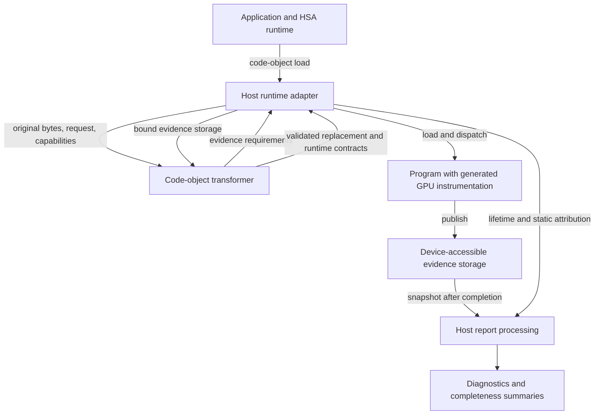

# ConSan design

ConSan adds concurrency checking to native AMDGPU programs at load time. It
rewrites compiled code objects, runs the resulting instrumentation alongside
the program on the GPU, and interprets the evidence on the host. Its primary
access model covers LDS/shared memory, including supported FLAT accesses whose
group-memory provenance can be reconstructed. Selected atomics and fences also
contribute synchronization information. Ordinary global-memory accesses are
not generally race-checked.

The system has three cooperating parts:

- **The code-object transformer** turns an original executable image into a
  validated replacement. It recovers program structure, decides which
  operations to observe, and fits instrumentation into already allocated
  machine code.
- **The generated GPU instrumentation** observes the running program. In the
  default mode it publishes bounded access and synchronization evidence. In
  SuperCollider mode it compares redundant memory observations and records
  value instability.
- **The host runtime adapter** connects both to HSA. It supplies runtime
  capabilities and evidence allocations to the transformer, installs the
  replacement, tracks its lifetime and dispatch requirements, and collects
  and analyzes its evidence.



This structure is shared by both modes; they differ in what the GPU observes
and what analysis remains for the host.

The transformer and runtime adapter are separate C++ components. The GPU part
is native instruction sequences emitted by the transformer, rather than a
separately launched analysis kernel. Report processing belongs to the runtime
adapter but consumes a report format shared with the transformer and generated
code. These shared contracts are what connect load-time decisions to runtime
observations.

The following sections expand each part in that order. [MODES.md](MODES.md)
compares detector behavior, [CAPABILITIES.md](CAPABILITIES.md) specifies admitted
targets and instruction forms, and [USAGE.md](USAGE.md) describes how to run the
system. The design here concerns the implementation's structure and the
responsibilities at its boundaries.

## Code-object transformer

The transformer is a library under `lib/rocjitsu/src/rocjitsu/code/patch/consan/`.
Its input is native code-object bytes plus typed configuration and runtime
facts. Its output is a `TransformResult`: an installation outcome, replacement
bytes when successful, static coverage, and the runtime contracts needed to
execute and interpret the replacement. The library owns no HSA executable,
queue, or report allocation.

Internally, the transformation has the following data flow:

```text
Original code object
        |
        v
Program analysis ---------> ProgramInventory
                                    |
                                    v
                            Observation policy
                                    |
                                    v
                            ObservationPlan / ProbeIntents
                               |                 |
                               v                 v
                       Evidence planning    Native lowering
                               |                 ^
                               v                 |
                      EvidenceRequirements       |
                               |                 |
                        runtime allocation ------+
                        and resource binding     |
                                                 v
                                      Candidate replacement
                                                 |
                                                 v
                                        Final validation
                                                 |
                                                 v
                                         TransformResult
```

Program facts, semantic choices, and implementation choices have distinct
representations. An LDS store can be recognized by analysis, admitted by
policy, and then rejected because no safe register or placement plan exists.
Keeping those steps separate lets the result explain the missing coverage
without changing what the original instruction meant.

### Transaction coordinator

[`consan_pipeline.cpp`](../../lib/rocjitsu/src/rocjitsu/code/patch/consan/consan_pipeline.cpp)
owns the public transaction. It validates configuration, invokes analysis and
lowering, obtains evidence requirements, validates their binding, and publishes
one coherent result. `consan.cpp` and `consan_composition.cpp` coordinate the
native lowering stages underneath it.

The input contracts separate concerns that have different owners:

| Contract | Information supplied |
| --- | --- |
| `Request` | Selected detector and requested observations. |
| `TransformPolicy` | Image-growth and instrumentation-count limits. |
| `RuntimePolicy` | Activation, load-failure policy, and process memory budgets. |
| `RuntimeCapabilities` | Facilities available from the runtime and device. |
| `BoundRuntimeResources` | Concrete report addresses, layouts, and allocation scope. |
| `MutationRequest` | Optional deliberate program changes used for validation. |
| `DebugOverrides` | Expert overrides of normal planning. |

Automatic evidence allocation splits the transaction in two. This resolves a
circular dependency: the library must inspect the program to know the report
size, but it must know the report address before emitting probes.

1. `prepare_automatic_transform` analyzes the program and plans evidence. It
   returns either a completed result or a `DeferredBinding` containing the
   address-free requirements and retained transaction state.
2. The runtime allocates and initializes exactly that layout.
3. `resume_automatic_transform` checks the supplied resources against the
   requirements and finishes lowering and validation. Allocation failure ends
   the transaction through `cancel_automatic_transform`.

The deferred value owns the request and input identity. The coordinator also
owns the resume strategy: default ConSan can reuse its immutable inventory;
other paths can lower again from the input. The caller supplies resources,
without deciding how to reconstruct the internal transformation. Caller-owned
buffers use the same binding boundary.

### Program analysis: recovering a usable program model

Analysis combines the existing rocJITsu ELF parser, ISA decoder, and
control-flow analysis with ConSan's access and synchronization analyses.
[`consan_program_analysis.cpp`](../../lib/rocjitsu/src/rocjitsu/code/patch/consan/consan_program_analysis.cpp)
constructs the program inventory; [`consan_sync_analysis.cpp`](../../lib/rocjitsu/src/rocjitsu/code/patch/consan/consan_sync_analysis.cpp)
constructs synchronization relationships and execution ownership.

The analysis is structured around three related views of the program:

**Code containers and instruction sites.** The parser identifies executable
sections, kernel descriptors, kernels, and helper functions. Decoding turns
instructions into normalized `ProgramSite` records. A site can have both an
access facet and a synchronization facet, as an LDS atomic does. Multiple
symbols can describe the same physical instruction, so physical identity is
kept separately from the container through which it was decoded.

**Access semantics and address provenance.** Native LDS instructions expose
address-space meaning directly. FLAT instructions need pointer-flow analysis
through supported register operations, private spills, and calls. The inventory
records the inferred address space, provenance, confidence, operands, and
logical byte ranges. A dual-range instruction has two logical ranges even
though it occupies one physical site. Local uniformity analysis additionally
identifies cases in which participating lanes have the same address or store
value.

**Execution ownership and synchronization.** Control flow establishes which
kernel entries can reach a site, including sites in shared helpers. Those
kernel owners determine which descriptors and calling contexts must support a
probe. Synchronization analysis builds `SyncEvent` and `SyncSequence` records:
individual machine operations are associated into supported barrier,
atomic/cache, and ordinary-memory/fence sequences. This is where a multi-
instruction synchronization pattern becomes a semantic unit for later policy.
Analysis builds the synchronization detail required by the request; ordinary
SuperCollider instrumentation does not need the default detector's full
synchronization inventory.

`ProgramInventory` publishes these facts through an immutable view backed by
one authoritative site arena. Typed container, site, and event IDs connect the
views. Downstream consumers retain references to those identities instead of
making independent copies of instruction meaning. This matters especially for
shared functions: the emitter, descriptor planner, validator, and report
attribution must agree on which original instruction and kernel owners a probe
belongs to.

### Observation policy: choosing what the detector needs

[`consan_observation_policy.cpp`](../../lib/rocjitsu/src/rocjitsu/code/patch/consan/consan_observation_policy.cpp)
assembles three policy products: access observations, barrier observations,
and atomic/fence observations. Each policy consumes normalized inventory facts
and the selected mode's requirements. It resolves physical aliases and records
whether a semantic site is not applicable, unsupported, or admitted.

Admitted sites produce `ProbeIntent` values. An intent specifies the observation,
its original instruction, whether it belongs before or after the guest
operation, its lane-mask semantics, and any dynamic address or result that must
be captured. It can cover several semantic events at one insertion point. It
does not yet specify registers, emitted instructions, or a branch destination.

The resulting `ObservationPlan` drives both evidence sizing and native lowering.
The `CoverageLedger` carries that plan forward and records what happened to each
intent: instrumentation, resource rejection, or placement rejection. Successful
lowering also supplies the mapping from original sites to emitted code and
report slots. The runtime later uses this mapping to attribute observations to
the program. It does not infer attribution from patch names or final offsets.

This boundary makes semantic coverage independent of implementation difficulty.
Resource planning can fail to realize an intent, but cannot reclassify its
source operation as irrelevant.

### Evidence planning: defining the producer/consumer interface

The evidence planner converts observation intents into an exact report
requirement. Default ConSan needs capacity for access ranges and synchronization
state; SuperCollider normally needs a fixed mismatch marker. The result is an
`EvidenceRequirements` variant with capacities, region offsets, alignment,
initialization, and required runtime capabilities, but no allocation address.

For default ConSan, the planner assigns bounded storage to static access ranges.
It can reduce the requested number of banks to fit a report ceiling while
preserving the ranges and reserved synchronization slots. Once planning has
produced a complete layout, allocation must honor it exactly. The runtime
allocator cannot silently choose a smaller buffer.

The shared contract is exposed through
[`consan_report.h`](../../lib/rocjitsu/src/rocjitsu/code/patch/consan/consan_report.h).
`consan_evidence_planning.cpp` derives requirements from intents;
`consan_report_plan.cpp` turns capacities into ABI geometry. The same geometry
is consumed by code emission, buffer initialization, and host decoding. This
keeps the producer and consumer from independently inventing report layouts.

### Native lowering: realizing the observation plan

Lowering turns intents into executable instrumentation while preserving the
surrounding program's machine state. Default ConSan's main coordinator is
[`consan_instrumentation.cpp`](../../lib/rocjitsu/src/rocjitsu/code/patch/consan/consan_instrumentation.cpp).
It projects admitted accesses into candidates, plans resources, emits access
and synchronization probes, installs required entry prologues, and commits text
changes. SuperCollider has its own access lowering under `supercollider/`, using
shared resource and rewriting facilities.

#### Resource planning

The resource planner answers where instrumentation can keep its state.
`ResourceProblem` ties the original image and inventory to the intended probes.
`ResourcePlanningState` retains decoded control flow, ownership, liveness, and
reservations while the planner explores register assignments.

There are two different demands. **Persistent state**—such as dispatch identity,
wave identity, and barrier epoch—must survive between instrumented sites.
**Transient scratch state** is needed only while a probe runs, including saved
execution masks and condition registers. Persistent assignments must be valid
for the relevant execution owners; transient assignments can use locally dead
registers or save and restore live ones.

The selected `OperatingPoint` describes the overall state arrangement, and
`CandidateResourcePlan` values describe the resources for individual probes.
The coordinator can refine these choices and replan against the same analysis.
Available mechanisms include dead registers, descriptor-backed register growth,
and private-memory spilling. A shared helper's plan must be compatible with
all of its kernel owners, not merely the symbol containing the instruction.

Resource choices also produce effects outside the instruction stream. More
registers or private storage can require descriptor changes. Dynamic private
frames can additionally require dispatch-packet adjustments. These effects
travel with the replacement and become part of validation and the runtime
contract. [SPILLING.md](SPILLING.md) expands this component's allocation and ABI
mechanics.

#### Probe construction

Mode-specific probe builders combine an intent, its resource plan, target
operations, and bound report geometry into an instruction sequence. The default
path is coordinated by `consan_probe_lowering.cpp`, with separate emitters for
accesses, atomics, synchronization, report records, and causal-window checks.
Shared helpers implement state preservation, native memory operations, and
relocation of the original guest instruction.

An access probe must preserve the original operation while using its address
and, where required, its result. A synchronization probe must attach evidence
to the correct access windows. Entry prologues establish the persistent state
that these probes share. Thus access, synchronization, and entry instrumentation
are planned together even though their instruction builders are separate.

The builders produce both code and declared effects: resource use, descriptor
requirements, intent identities, and runtime mappings. Those products allow
later stages to place and validate the code without repeating mode policy.

#### Placement and image construction

Placement decides how generated sequences enter the original control flow.
Depending on the path, it uses local space, trampolines and reachable branch
routes, or staged text fragments committed through whole-text relocation.
`consan_placement.cpp` provides local placement checks;
`consan_text_relocation.cpp` owns the transaction for staged text programs.

A `TextFragment` can describe code before and after a preserved guest operation
without committing to its final location. The text transaction resolves the
combined layout, relocates guest instructions and branches, and updates the
associated mappings. Descriptor mutation is coordinated with those changes,
using `consan_descriptor_growth.cpp` and the underlying `CodeObjectPatcher`.
This separation lets a mode describe its probe while the rewriting machinery
handles how it fits into an ELF image.

All changes remain private candidate state until accepted. Instruction bytes,
descriptors, relocation information, coverage, and runtime mappings must be
committed consistently; failure cannot leave an installable half-patched
image.

### Final validation and publication

[`consan_final_validation.cpp`](../../lib/rocjitsu/src/rocjitsu/code/patch/consan/consan_final_validation.cpp)
reparses the original and candidate images and checks the encoded result. It
checks ELF and symbol identity, instruction decoding and patch byte accounting,
relocated control flow, resource and descriptor changes, entry ABI effects,
and the declared semantics of supported mutations. Mode-specific validation
and target-native checks support this pass.

This is a separate stage because successful code generation only establishes
that the lowerer produced a candidate. Validation checks whether that candidate
actually satisfies the transformation's contracts. It is an engineering check
of the replacement and its declared effects, not a proof of the detector's
concurrency model.

Only a successfully validated replacement becomes `ModifiedValid`.
`Unchanged`, `Unsupported`, and `Invalid` carry no installable replacement.
The public result also carries `DispatchRequirements`, reduced by kernel name,
so the runtime can bind descriptor/private-memory requirements to loaded
symbols. Installation policy maps the typed outcome to load replacement, load
original, or reject; it cannot make failed validation installable.

### Target services beneath analysis and lowering

Target knowledge is shared infrastructure for the preceding stages. Each
admitted GPU target has a `TargetProfile` describing its architectural facts,
plus operation providers for analysis, emission, validation, and mutation.
Providers live under
[`targets/`](../../lib/rocjitsu/src/rocjitsu/code/patch/consan/targets/), grouped by
architecture or by a genuinely shared architecture subset.

Analysis uses these services to normalize native instruction forms. Lowering
uses them and rocJITsu instruction builders to realize the chosen mechanism.
Validation uses them to check native encodings and effects. The mode decides
what evidence is required; the target layer supplies how the architecture can
produce it. Target profiles contain neither report allocations nor per-kernel
planning state.

ConSan rewrites for the input's exact target. It does not translate code between
GPU architectures. Adding a target therefore involves a profile and providers,
followed by qualification of the same semantic contracts; adding a detector
involves policy, evidence, and lowering that consume those target services.

### Deliberate mutations and composition

Fault injection and SuperCollider perturbation are optional branches of the
transformation pipeline used to exercise the detector. Their selection and
mutation code consumes the same program identities and synchronization
inventory.

For a composed fault-and-instrumentation transformation, the mutation is
applied and validated first. The resulting program is then inventoried and
instrumented, so probes describe the operations the GPU will actually execute.
`consan_composition.cpp` carries provenance and descriptor identities across
those image revisions and combines their effects. The final result remains one
transaction relative to the original input. These validation paths explain why
the coordinator supports multiple lowering stages even though an ordinary run
selects one detector.

## Generated GPU instrumentation

The generated code executes inside the application's kernels and helper
functions. It shares their execution masks, registers, and private-memory ABI,
which is why the transformer's ownership and resource analyses are prerequisites.
The two modes use that machinery to implement different device/host protocols.

### Default detector: bounded access evidence

The default detector divides work between dynamic observation on
the device and comparison on the host. Its main pieces are entry-state setup,
access publication, and synchronization publication. All three use the report
layout established during transformation.

An access record, or **watchpoint**, describes an observed byte range and access
kind with compact wave and epoch information. A **causal window** supplies its
execution context and publication state. A **bank** is one reserved slot in a
static range's table that can retain such an observation. Synchronization
metadata associates ordering information with these windows. Together they
form a bounded collection of representatives rather than a dynamic event log.

#### Identity and barrier epochs

Entry prologues establish the identity needed by later probes. Dispatch and
workgroup identity separate executions that use unrelated LDS; wave identity
lets the reader distinguish potentially conflicting participants; barrier
epochs separate recognized synchronization phases inside a dispatch.

These runtime identities differ from the transformer's execution owners.
A static execution owner is a kernel that can reach a site. A dynamic owner is
a compact wave identifier recorded by an executing probe. Static ownership
controls resource compatibility and attribution; dynamic ownership contributes
to conflict detection.

Two more identities belong to report lifetime. An allocation generation rejects
records from another allocation lifetime. A host report epoch is the interval
between quiescent checkpoints and allows the runtime to recycle storage. It is
separate from the per-wave barrier epoch and does not reset a running kernel's
synchronization phases.

There are bounds on this identity scheme. The normal dispatch identity is a
64-bit fingerprint of queue pointer and queue-local dispatch ID; a scalar-
pressure fallback uses a weaker literal identity. The default wave identity is
derived from entry work-item x and wave size, so waves distinguished only by
y/z can alias. The expert hardware-owner path has narrower applicability.
The packed barrier epoch saturates at 1023, after which later phases share an
epoch. That saturation currently neither publishes an exhaustion counter nor
invalidates the trust verdict; host checkpoints cannot repair it within a
dispatch.

#### Selection and retention

Access probes first select workgroups, then select active-lane accesses by the
starting four-byte LDS cell. When resources permit, a uniform workgroup gate
runs before the shared access body; other resource arrangements perform the
same selection inside the body. Static sites remain instrumented even when a
particular execution is not selected.

For each selected logical range, the probe hashes dispatch/workgroup identity
and wave owner into that range's bank table. It claims the selected bank and
publishes an immutable representative through the report's publication
protocol. A locally proven uniform address can also retain the participating
lane mask, allowing the host to diagnose collisions within one instruction.

The bank hash does not include the access address, barrier epoch, or loop
iteration. An occupied bank is not searched around or replaced: the first
successful publication wins. A matching window leaves its representative
unchanged, while a different window identity increments saturation. The
repeated-window comparison does not compare every access field, so not every
discarded observation increments that counter.

This organization bounds storage by the static inventory and planned bank
count, independent of loop trip count and dispatch count. It also explains why
removing selection with the `max` preset does not record a complete execution.
A loop can retain its first address and miss a later racing address at the same
site, and two wave owners can collide despite unused banks elsewhere.

#### Synchronization publication

Barrier and atomic probes supply context for the retained accesses. Qualified
barrier sequences advance persistent per-wave epochs; barrier-only owners can
still maintain that state without publishing access windows. Atomic/fence
lowering uses static control-flow associations to find the access windows to
which ordering information belongs.

Release metadata belongs with accesses before a synchronization edge; acquire
metadata belongs with accesses after it. Since the later access may not yet
have published its window, the protocol also has pending-acquire storage. The
host decoder joins this deferred metadata to the eventual access only after
checking its identity. This connects two independently executing kinds of
probe without treating hashed slot order as program order.

The device emitters and host decoder share this attachment contract through
the report model. Dropped or malformed synchronization evidence disables host
ordering suppression where the report cannot establish its integrity.

#### Heuristics and their failure directions

The division between bounded device evidence and host comparison sets the
model's limits. Selection and first-publication retention can omit conflicting
pairs. FLAT provenance reconstruction can omit LDS accesses or admit accesses
whose address space was inferred incorrectly; the default likely-group policy
also admits a narrow `lds_load_at`/`lds_store_at` helper-name heuristic.
Compact identities can alias, and bounded barrier epochs can merge phases.

Atomic metadata records roles and object identity, but not a general
happens-before graph or the dynamic reads-from relation. Matching metadata can
therefore suppress a conflict without establishing that an acquire observed
the corresponding release. Conversely, synchronization outside the recognized
model can leave an actually ordered pair as a diagnostic. These are limits of
the observation model, distinct from corrupted or incomplete report storage.

A clean, complete report means that the selected evidence passed the relevant
coverage and integrity checks and exposed no conflict under this model. It does
not establish race freedom or validate every inference used by the model.

### SuperCollider: redundant observations

SuperCollider uses the same native rewriting infrastructure for a different
protocol. Its probes preserve an LDS/group-FLAT access, insert a delay, and
repeat a load or read back a store. They compare the observations and publish
a mismatch to a sticky marker. The comparison occurs on the device, so the host
collects a result rather than reconstructing pairs of conflicting accesses.

The implementation under
[`supercollider/`](../../lib/rocjitsu/src/rocjitsu/code/patch/consan/supercollider/)
owns redundant-access lowering, perturbation, marker planning, and its final
validation support. It consumes the common inventory, resource, placement, and
target facilities. The runtime has a corresponding marker registry using the
shared allocation/lifetime mechanics.

A mismatch is value-instability evidence: it does not identify a racing peer,
and a legal interleaving can also change a value. Same-value races can remain
invisible. The ordinary marker is non-trapping; expert trap behavior and
synchronization perturbations are separate controls. ConSan report checkpoints
do not clear SuperCollider's lifetime-sticky marker.

## Host runtime adapter

The runtime adapter lives under `lib/rocjitsu/src/rocjitsu/hooks/consan/`.
[`rj_hsa_dbi_hooks.cpp`](../../lib/rocjitsu/src/rocjitsu/hooks/consan/rj_hsa_dbi_hooks.cpp)
installs the HSA interception layer and coordinates its registries.
`rj_hsa_dbi_hook_config.cpp` translates environment settings into the typed
requests and policies used by the library.

Its internal structure follows the lifetime of an instrumented executable:

```text
Reader tracking and load interception
                |
                +--> transformation and evidence allocation
                |
                v
Executable ownership and symbol binding
                |
                v
Dispatch adjustment and completion tracking
                |
                v
Quiescent checkpoint / executable retirement
                |
                v
Snapshot -> decode -> analyze -> assess trust and render
```

### Loading and binding

Reader interception makes original code-object bytes available at executable
load. A bounded kernel-name precheck can skip excluded objects. For selected
objects, the hook runs waitcheck on the original image, queries runtime
capabilities, and invokes the transformer. Waitcheck shares the interception
point but has its own result model; its diagnostics do not prevent ConSan from
continuing to instrument a suspect program.

The hook fulfills deferred evidence requirements using HSA-accessible memory.
An allocation initially belongs to a reader/load generation and is guarded
against an unsuccessful load. Successful installation binds it to the
executable. The hook also retains replacement image bytes for the executable's
lifetime: HSA introspection and tools can refer to that storage after the
temporary replacement reader has been destroyed.

The transformer returns dispatch requirements by kernel name. Symbol
interception binds these names to loaded kernel objects in the dispatch
registry. This is the bridge from static kernel identity to the opaque handles
seen in actual HSA packets.

### Dispatch adjustment and completion tracking

The queue interceptor recognizes instrumented kernels and applies their
private/group-segment requirements to dispatch packets. Fixed descriptor
minima and dynamic private-frame additions are combined with the launch's
requirements. This completes the resource contract established during
lowering; changing code and descriptors alone is insufficient when a launch
also specifies memory sizes.

The same interception records instrumented dispatch completion signals. The
`ReportEpochRegistry` observes intercepted waits and determines when all
tracked writers have completed. An ordered barrier completion signal can
represent earlier signal-less dispatches on the same queue. Submission and
recycling share a gate, so a new writer cannot appear between the quiescence
check and a report reset.

### Evidence lifetime and checkpoints

[`rj_hsa_dbi_hook_report.cpp`](../../lib/rocjitsu/src/rocjitsu/hooks/consan/rj_hsa_dbi_hook_report.cpp)
owns the default report registry: allocation, executable binding, static
metadata, completed summaries, and retirement. Shared registry helpers provide
allocation and lifetime mechanics for both reports and SuperCollider markers.

A checkpoint recycles report storage after a proven quiescent interval. The
normal policy analyzes every interval. Selective policies can analyze only
chosen epochs or application-defined windows. A selected checkpoint snapshots
and validates every live report, processes the snapshots, and then resets the
allocations. An unselected checkpoint validates headers and layouts before
resetting without analyzing the evidence. Failure leaves the report state and
logical epoch unchanged, allowing a retry.

Reset preserves the allocation address and generation embedded in generated
code while clearing epoch-local evidence and ordering state. Host summaries
accumulate results from selected intervals; device storage holds only the
current interval. Executable destruction retires its reports and releases its
owned resources. Explicit checkpoint/window APIs cover runtimes whose
completion or semantic boundaries cannot be inferred by interception.

### Report processing

[`rj_hsa_dbi_report_pipeline.cpp`](../../lib/rocjitsu/src/rocjitsu/hooks/consan/rj_hsa_dbi_report_pipeline.cpp)
connects small components with different responsibilities:

| Component | Input and responsibility | Output |
| --- | --- | --- |
| Snapshot | Quiescent allocation; copy through the appropriate fine/coarse-grained memory path. | Host-owned bytes or a copy failure. |
| Report decoder | Snapshot, expected generation and layout; validate the envelope. | Decoded report and structural status. |
| Evidence decoder | Report records and static mappings; check publication state, decode access/sync facts, join deferred metadata. | Attributed evidence and integrity counters. |
| Conflict analyzer | Decoded access evidence and synchronization completeness. | Conflict counts and bounded examples. |
| Trust evaluation | Accumulated evidence/lifecycle counters and record requirements. | Dynamic completeness and diagnostic presence. |
| Renderer | Decoded evidence, analysis, and summaries. | Human-readable evidence, summaries, and details. |

Snapshotting isolates the analysis from HSA memory ownership. The decoder and
analyzer can therefore operate on ordinary host data and be tested without a
live GPU. Static attribution supplies the original site information that was
carried through the coverage ledger during transformation.

#### Host conflict and ordering model

The conflict analyzer first checks exact-lane groups for conflicting ordinary
writes within one instruction. A separate pairwise scan considers records in
the same generation, dispatch, workgroup/cluster, and barrier epoch. Complete,
disjoint static kernel-owner sets exclude a pair. Otherwise overlapping byte
ranges from different compact wave owners can conflict according to access
kind; two reads and two atomic accesses do not conflict with each other.

When synchronization evidence is complete, a matching release/acquire
association can suppress a candidate. Both records must describe the same
atomic address and width, cover at least the workgroup in scope, and remain in
the same epoch. A failed compare-exchange cannot supply release semantics.
The device's attachment contract supplies the before/after relationship; the
host cannot recover it from bank positions. The approximation's limits are
explained with the [device evidence model](#heuristics-and-their-failure-directions).

The main scan is quadratic in retained record count. Limiting diagnostic
examples bounds output storage, not comparison work. Consequently report
geometry and checkpoint selection affect host cost as well as device storage
and publication cost.

Trust evaluation answers a separate question: whether the run produced usable
evidence for the selected analysis. Allocation/cleanup failures, dropped
windows, unusable snapshots, malformed or unsupported synchronization, and
missing required records can make dynamic completeness false. Expected
selection misses and bank saturation do not by themselves do so. Static
coverage is reported independently, and a conflict can coexist with incomplete
evidence. Keeping these results separate prevents an empty or unusable report
from being presented as a clean execution.

### Transform memory accounting

The adapter's ownership registries also enforce process budgets. Concurrent
transformation storage, retained replacement bytes, retained replacement growth,
and report allocations have different lifetimes and are accounted separately.
A transform reservation is acquired before semantic inventory and released
when transient image owners are gone. Replacement-image charges transfer to
executable lifetime; full-image and growth charges are admitted together.

The transform estimate models major ELF/parser storage rather than total RSS.
It accounts for the images simultaneously retained during incremental
patching, composite patching, and final validation, and reserves the largest
phase estimate. The phase model is coupled to the parser's exported storage
bound in
[`rj_hsa_dbi_transform_memory.h`](../../lib/rocjitsu/src/rocjitsu/hooks/consan/rj_hsa_dbi_transform_memory.h);
allocator overhead and unrelated process memory are outside that model.

This accounting follows actual ownership: a failed replacement load releases
local storage before refunding its charge, while hook unload does not pretend
that live executable storage has disappeared. The controls are documented in
[EXPERT_CONTROLS.md](EXPERT_CONTROLS.md#shared-controls).

## How the structure maps to the source tree

The logical stages above map to six compiled library components in
[`code/patch/consan/CMakeLists.txt`](../../lib/rocjitsu/src/rocjitsu/code/patch/consan/CMakeLists.txt).
Dependencies are layered: contracts support targets; targets support analysis;
analysis supports transformation; validation uses analysis and transformation;
orchestration coordinates transformation and validation.

| Compiled component | Role in this design |
| --- | --- |
| `rocjitsu_consan_contracts` | Shared identities, semantic vocabulary, classifiers, and observation policy. |
| `rocjitsu_consan_targets` | Native target profiles and operation providers. |
| `rocjitsu_consan_analysis` | Program inventory, synchronization analysis, ownership, and fault selection. |
| `rocjitsu_consan_transform` | Evidence/resource planning, probe generation, placement, and image mutation. |
| `rocjitsu_consan_validation` | Independent validation of the candidate artifact. |
| `rocjitsu_consan_orchestration` | Public transactions and composition of lowering stages. |

The HSA adapter is outside this library graph. Most library names live in
`rocjitsu::consan`, and runtime adapter names in `rocjitsu::consan::hook`.
Some implementation files include `.inc` fragments; the compiled component
and its API establish ownership, rather than the filename suffix.

Tests follow the same boundaries. `tests/patch/consan/` exercises inventory,
policy, resource planning, lowering, composition, and validation.
`tests/dbt/consan_report_test.cpp` and `tests/dbt/hsa_hooks_unit_test.cpp` exercise
report interpretation and runtime integration. Device and end-to-end tests
under `tests/dbi/` connect the generated producer to the runtime consumer.
Current physical qualification and performance results belong in the
[validation](validation/VALIDATION.md) and [benchmark](benchmark/BENCHMARK.md)
ledgers, with their source, binary, and configuration provenance.
