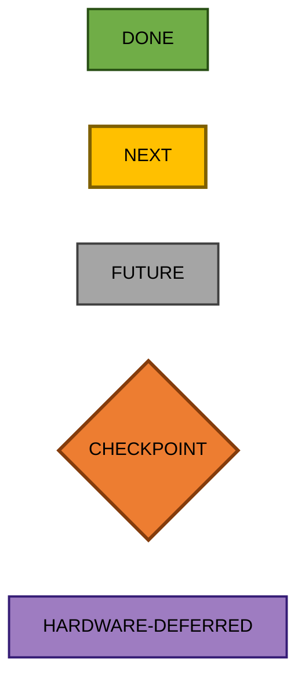
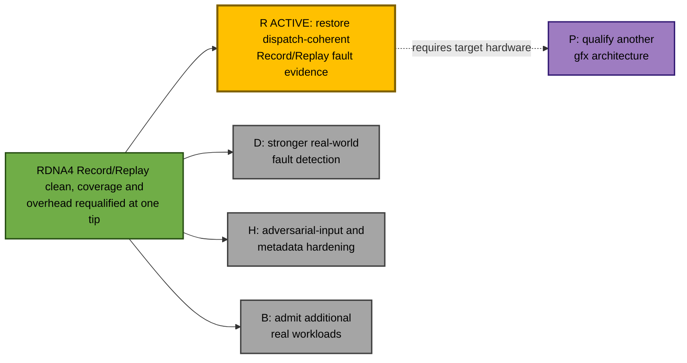
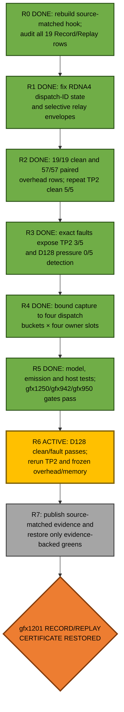
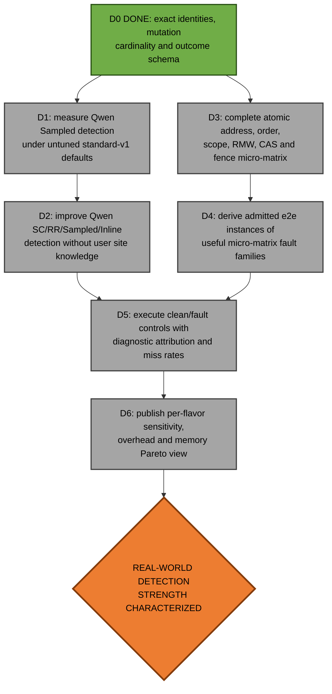
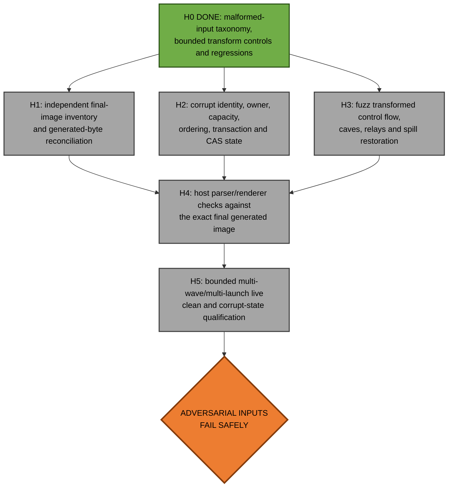
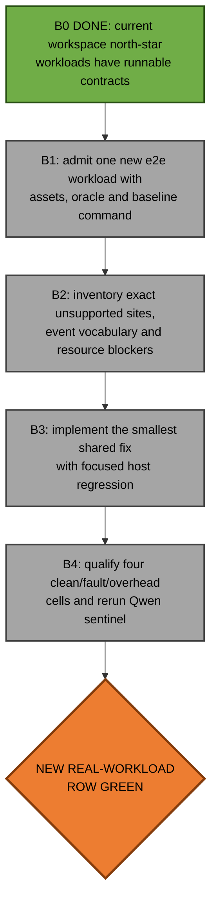
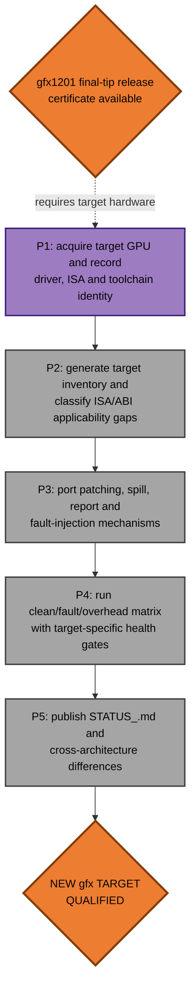

# ConSan future work

[STATUS_RDNA4.md](STATUS_RDNA4.md) records the gfx1201 north-star matrix.  The
2026-07-22 Record/Replay audit repaired clean-input regressions exposed after
the gfx1250-focused work: hardware dispatch identity is now used on RDNA4, and
RDNA4 relay sizing no longer applies a large-object envelope indiscriminately.
All 19 clean and paired-overhead rows pass at one source-matched tip.  The same
audit corrected two overstated fault claims: TP2 detects its exact drop in 3/5
trials and D128 pressure in 0/5.  The bounded 4-dispatch × 4-owner candidate
now restores D128-pressure detection to 5/5 while remaining clean in 5/5
trials.  TP2 cannot be rerun in the current workspace because its IREE test
suite and build are absent, so source-matched TP2 and overhead/memory evidence
remain the active release-certificate gap.

Prioritize demonstrable end-to-end LLM value over isolated-kernel breadth. Do
not reopen a completed cell merely to accumulate more worklog. If new evidence
finds a regression, update `STATUS_RDNA4.md` immediately and make that repair
the highest-priority runnable node.

Every solid edge means a real prerequisite: `A --> B` means finish `A` before
attempting `B`. Dashed edges denote unavailable-hardware dependencies.

## Status legend

## Program overview

The four RDNA4 tracks are technically independent.  `R` is front-loaded
because new evidence invalidated two Record/Replay greens.  Work on `D`, `H`,
or `B` should rerun the highest-value affected e2e sentinel immediately.

## R: restore the Record/Replay release certificate

This track preserves the corrected generation semantics shared with gfx1250.
It must not regain RDNA4 detections by comparing different dispatches, hiding
an expert knob in ordinary operation, or enabling unbounded dynamic append.

Automatic layouts deliberately expand each logical range from the historical
single 64-byte record to a four hardware-dispatch × four canonical-owner grid
of 72-byte records: 1,152 bytes per range, an 18× static access-storage
increase.  The 128 MiB per-buffer ceiling therefore rejects some inventories
that previously fit; planner boundary tests pin that tradeoff.  A reversible
64-bit dispatch claim owns each outer bucket.  A different dispatch colliding
with that bucket, a different workgroup reusing a dispatch/owner slot, an owner
outside the bounded set, or an unrepresentable/in-flight claim emits typed
Record/Replay saturation and makes dynamic evidence incomplete.  Direct
size-derived caller layouts remain 1 × 1, but now apply the same exact
dispatch/workgroup reuse qualification.  This is a bounded observation policy,
not an exhaustive trace or a workload-specific control.

D128-pressure validates the intended behavior on physical gfx1201: five clean
trials are complete and false-positive-free, and all five exact-drop trials
diagnose the fault while the oracle fails.  Acceptance still requires TP2 plus
paired overhead and memory on a clean committed tree with a hook rebuilt from
exactly that tree.  Run no more than four GPU jobs in parallel.

## D: stronger fault detection

The green table permits honest qualified misses. This track asks the harder
question: how many real concurrency faults can each flavor actually diagnose,
especially on the end-to-end model rather than only on a micro-test?

`D1` is important because the retained Qwen Sampled detection rate belongs to
the explicit stride-256 fault experiment, while ordinary clean use now selects
`standard-v1` stride 16,384 automatically. Characterize the default before
deciding whether a different automatic policy is warranted. An experimental
multi-trial sweep may expose controls internally; the ordinary user contract
must not require tuning them.

Flavor contracts remain distinct: SuperCollider is a redundant-access
perturbation/check engine; Record/Replay observes its named bounded snapshot;
Sampled makes a statistical claim; Inline should attribute deterministic
causal or shadow-state diagnostics. Do not make a weak flavor look strong by
silently changing its memory or trial budget.

## H: adversarial-input hardening

ConSan is used on programs already suspected of synchronization mistakes.
Ill-formed final images, inconsistent metadata, failed publication, or a bad
injected mutation must fail with a bounded, typed outcome rather than hang,
crash, corrupt output silently, or reset the GPU.

This preserves the useful intent of the former Inline final-image DAG without
making it a retroactive prerequisite of the already-qualified workload cells.
See [MALFORMED_INPUT.md](MALFORMED_INPUT.md) for the normative taxonomy.

## B: additional real workloads and vocabulary

Do not resume the historical reject list or the abandoned 410-site
SuperCollider relay objective in the abstract. Broaden coverage only when a
concrete admitted real workload demonstrates the need.

An isolated kernel may be the shortest reproducer for `B3`, but it does not
become a status-table row unless it is independently valuable. New vocabulary
must retain typed exclusions for unsupported forms rather than weakening the
denominator or passing through silently.

## P: another gfx architecture

Do not infer architectural portability from gfx1201 host tests. Reuse the
validation scripts and experiment schema, but re-establish applicability,
final-byte mutation identities, clean correctness, diagnostics, performance,
memory, and device health on the target hardware.

## Maintenance rules

- Keep `STATUS_RDNA4.md` concise and evidence-backed; it is a result ledger,
  not a worklog.
- Update affected Mermaid node colors in the same commit as implementation or
  evidence changes.
- Use a new empty artifact directory after source, hook, manifest, or failed
  preparation changes; never mix provenance.
- Do not use coverage-limiting or workload-specific tuning for ordinary
  acceptance. Expert fault-campaign controls must be disclosed separately.
- Commit after each bounded node or coherent sibling group.
- Do not run more than four GPU jobs in parallel.
- Do not work on another architecture without suitable hardware.
