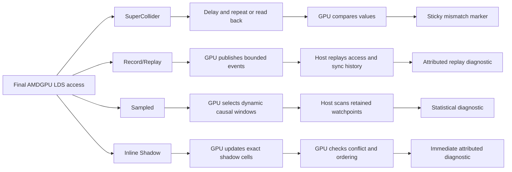
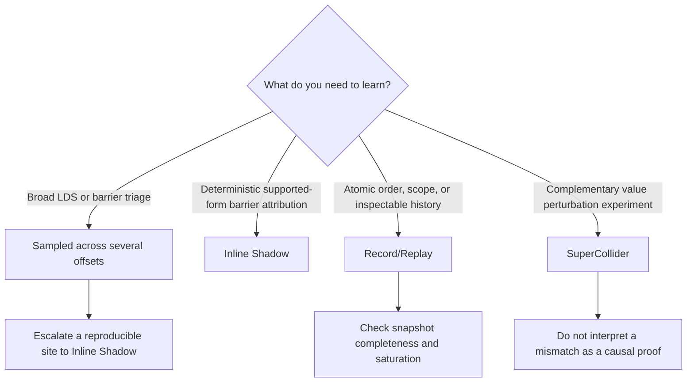

# Which concurrency instrumentation works on real gfx1201 AMDGPU kernels?

GPU software is producing more kernel code than ever, and an increasing share
of it is difficult to validate by source inspection alone:

- kernel generators emit large families of shape- and target-specialized code;
- learned agents write or tune assembly directly;
- performance libraries use inline assembly that bypasses much of the normal
  compiler pipeline; and
- LLVM and other lowering tools can themselves introduce a defect after the
  source has been reviewed.

Much of this code can **appear** correct. A data race may need an uncommon wave
schedule to change the output, while normal tests repeatedly observe the
expected result. Source-based analysis is also a poor fit when the interesting
program exists only as generated or hand-written final machine code.

RocJITsu gives us a common intervention point: it can inspect and rewrite the
final AMDGPU code object that will actually execute. We implemented
proof-of-concept ConSan probes using four different instrumentation styles, ran
them on physical gfx1201 across real kernels, injected reviewed concurrency
defects, and measured both GPU cost and detection yield. The study answers the
question that matters before investing in a larger sanitizer implementation:
**which instrumentation style works best on real-world AMDGPU kernels?**

This document is written for compiler engineers and GPU kernel authors. No
prior knowledge of ConSan is assumed.

## Result in one minute

The short answer is:

- use **Sampled** (`RJ_CONSAN_MODE=sampled`) for ordinary barrier/LDS triage,
  and sweep more than one `RJ_CONSAN_MOI_RUNTIME_SAMPLE_OFFSET` when confidence
  matters;
- use **Inline Shadow** (`RJ_CONSAN_MODE=inline-shadow`) when deterministic
  barrier/LDS attribution matters more than overhead;
- use **Record/Replay** (`RJ_CONSAN_MODE=record-replay`) as an expert
  synchronization tool, especially for atomic order or scope investigations;
  and
- do not treat **SuperCollider** (`RJ_CONSAN_MODE=supercollider`) as an ordinary
  race detector. It remains a complementary experimental value-perturbation
  probe.

This is the empirical recommendation from five physical-gfx1201 workloads. It
is not yet the public configuration default: loading ConSan without selecting a
mode currently chooses Record/Replay. The recommendation still needs to be
encoded as an explicit supported-mode policy.

The complete generated measurements are in
[GFX1201_EMPIRICAL_RESULTS.md](GFX1201_EMPIRICAL_RESULTS.md). This document
explains what the modes do, how to interpret those measurements, and why they
lead to the recommendation above. [USAGE.md](USAGE.md) gives complete commands
and settings.

## What kind of bug is ConSan looking for?

ConSan currently focuses on AMD **LDS** (HIP `__shared__` memory) and the
synchronization that orders LDS accesses. It recognizes native DS instructions
and compiler-generated group-flat accesses proven or conservatively inferred to
refer to LDS. Selected global atomics and fences can contribute ordering
evidence, but ConSan is not a general global-memory race detector.

Consider a wave32 kernel with two waves in one workgroup:

```cpp
__global__ __launch_bounds__(64) void missing_barrier(float *out) {
  __shared__ float tile[32];
  unsigned tid = threadIdx.x;

  if (tid < 32)
    tile[tid] = produce(tid);       // wave 0 writes LDS

  // Missing __syncthreads(). Wave 1 may run before wave 0 finishes.
  if (tid >= 32)
    out[tid] = consume(tile[tid - 32]); // wave 1 reads the same LDS bytes
}
```

This example is launched as one 64-thread workgroup: wave 0 is threads 0-31
and wave 1 is threads 32-63.

The corresponding correct handoff has a workgroup barrier:

```cpp
  if (tid < 32)
    tile[tid] = produce(tid);
  __syncthreads();
  if (tid >= 32)
    out[tid] = consume(tile[tid - 32]);
```

Record/Replay, Sampled, and Inline Shadow form the **Memory-Ordering
Instrumentation (MOI)** family. They share one access and synchronization
model, then make different trade-offs about where the model runs and how much
evidence it retains. At the level used by these engines, an LDS conflict
requires:

1. overlapping byte ranges;
2. different execution owners, normally different resident waves;
3. at least one write; and
4. no supported barrier or release/acquire relation ordering the accesses.

MOI divides LDS into four-byte shadow cells while preserving byte provenance
inside the cell, so disjoint byte accesses are not intentionally collapsed into
one conflict. Each access also carries an owner and an epoch. A workgroup
barrier advances the synchronization epoch; supported release/acquire atomics
can add a causal relation between owners.

SuperCollider does not use this conflict model. It asks a different and weaker
question: did a value at one address change while the instrumented wave was
delayed?

## Four instrumentation styles

ConSan patches final AMDGPU machine code when a code object is loaded. The
original access remains in place; the selected mode adds a probe around it.
The probes use the real runtime LDS size and automatically allocated registers
and report storage.

Conceptually, the four paths look like this:



The pseudocode below describes the semantic shape of each probe, not its ABI or
literal emitted instruction sequence. Real probes operate under AMDGPU EXEC
masks, normalize vector addresses into byte ranges, preserve guest state, and
use bounded concurrent publication protocols.

### SuperCollider: repeat the observation

SuperCollider implements the delay-and-redundant-observation technique from
Stephenson et al., ["SuperCollider: Scalable and Effective Data Race Detection
for CUDA"](https://research.nvidia.com/publication/2026-06_supercollider-scalable-and-effective-data-race-detection-cuda)
(PLDI 2026). ConSan's AMD final-ISA rewriting, reporting, and current semantic
contract are its own. The empirical result below applies to this ConSan
implementation and corpus, not to the technique in general.

For a load, SuperCollider delays the wave, repeats the load into scratch
registers, and compares the two values:

```cpp
T original = lds_load<T>(address);  // original guest operation
delay_wave();
T repeated = lds_load<T>(address);  // injected observation
if (original != repeated)
  store(sticky_mismatch, mismatch_marker);
```

For a store, it reads the address back after the delay and compares the result
with the stored value:

```cpp
lds_store<T>(address, value);       // original guest operation
delay_wave();
T observed = lds_load<T>(address);  // injected readback
if (observed != value)
  store(sticky_mismatch, mismatch_marker);
```

This is cheap in state: ordinary mode needs only a sticky mismatch marker. It
can expose a competing write that lands inside the delay window, but it cannot
identify the peer access or establish a missing happens-before edge. It also
misses same-value writes, races outside the delay window, and races that do not
change the observed value. Conversely, a legal write that becomes visible
between the two observations can change the value without proving a race.

In this study SuperCollider diagnosed **0/150** reached faults, including 0/30
for a D128 barrier fault whose independent result oracle failed in every trial.
Its small report state did not translate into useful race-detection evidence.

### Record/Replay: retain events, analyze them on the host

Record/Replay makes the device publish access and synchronization records. A
simplified access record is:

```cpp
struct AccessRecord {
  DispatchId dispatch;
  uint3 workgroup;
  unsigned wave;
  unsigned instruction_offset;
  unsigned lds_byte_offset;
  unsigned byte_count;
  AccessKind kind;       // read, write, atomic
  unsigned epoch;
  LaneMask lanes;
};

publish_to_bounded_slot(current_access_record());
```

Barriers, selected atomics, and fences publish their own ordering records. Once
the kernel is finished, the host replays the retained snapshot through the MOI
shadow and ordering model:

```cpp
for (Event event : retained_events_in_order) {
  if (event.is_barrier())
    advance_workgroup_epochs(event);
  else if (event.is_release_or_acquire())
    update_causal_state(event);
  else if (event.is_access()) {
    for (ShadowCell &cell : shadow.cells_for(event.byte_range)) {
      if (conflicts(cell.prior, event) &&
          !causally_ordered(cell.prior, event))
        report(cell.prior, event);
      cell.update(event);
    }
  }
}
```

The main advantage is inspectability: the useful decision is made by a host
model that can report both accesses and the synchronization reasoning. It was
the only mode to diagnose the two Stream-K atomic weakening cases in this
study, finding all **60/60** order/scope faults even though none changed the
workload output.

The snapshot is bounded, however. Ordinary automatic recording retains the
first visible evidence for a finite set of dispatch, owner, site, and address
slots rather than an exhaustive dynamic trace. Saturation, dispatch collisions,
and missing history are explicit incomplete outcomes, not clean results.
Record/Replay was admitted on only two of five workloads here, and its unique
atomic evidence came with very high Stream-K cost.

### Sampled: retain selected causal windows

Sampled has two separate selectors. The ordinary static selector admits every
supported site at patch time. An expert may change that selector to remove
sites and reduce work, but doing so narrows declared coverage:

```cpp
bool instrument_site =
    static_site % static_stride == static_offset;  // patch-time decision
```

At every instrumented site, a runtime selector deterministically retains only
some dynamic instances. It mixes enough identity to vary between launches,
workgroups, waves, epochs, accesses, sites, and addresses:

```cpp
RuntimeIdentity identity = {
    .dispatch = dispatch_id,
    .workgroup = workgroup_id,
    .wave_owner = resident_wave_owner,
    .epoch = current_epoch,
    .access_sequence = persistent_per_wave_sequence,
    .site = static_site,
    .address = lds_byte_address,
};

bool selected = hash(identity) % runtime_sample_stride ==
                runtime_sample_offset;

if (selected) {
  Window &window = claim_bounded_window(dispatch_id,
                                        workgroup_id,
                                        epoch);
  window.publish_watchpoint(current_access());
  window.publish_relevant_barrier_or_atomic_metadata();
  window.commit();
}
```

The host scans committed windows using a lower-volume form of the same
access/owner/epoch reasoning. A diagnosis means the selected evidence contained
an unordered conflicting pair. No diagnosis means only that this run did not
retain such a pair.

This mode had the broadest admission and the smallest MOI report state in the
study. Its detection rate was strongly workload-dependent: **21/32** on llama,
**8/32** on D128, **1/32** on compiled softmax, and zero on the FP8 and
Stream-K faults. Multiple offsets are therefore part of a serious Sampled
investigation.

The final campaigns kept the ordinary complete static selector and swept 32
predeclared `RJ_CONSAN_MOI_RUNTIME_SAMPLE_OFFSET` values. The current
implementation pays fixed work before that runtime predicate can skip evidence
publication: every admitted static site remains patched and each dynamic access
enters the dispatcher. A large **runtime** stride therefore should not be
assumed to reduce execution cost in proportion to retained evidence. A large
**static** stride can reduce work, but it also removes sites and narrows declared
coverage, so it cannot support the ordinary complete-coverage claim.

### Inline Shadow: check the shadow on the GPU

Inline Shadow keeps device-visible shadow state for four-byte LDS cells. Each
slot carries the previous access kind, owner, epoch, instruction identity,
dispatch identity, and byte provenance. The actual update is a versioned
concurrent protocol; its semantic core is approximately:

```cpp
ShadowAccess current = {
    .kind = access_kind,
    .owner = resident_wave_owner,
    .epoch = current_epoch,
    .instruction = pc_offset,
    .bytes = bytes_touched_in_this_cell,
};

ShadowAccess prior = versioned_exchange(shadow[cell], current);
if (overlaps(prior.bytes, current.bytes) &&
    different_owners(prior, current) &&
    at_least_one_write(prior, current) &&
    !ordered_by_barrier_or_atomic(prior, current)) {
  publish_bounded_diagnostic(prior, current);
}
```

The conflict is decided during the GPU access, so the report already contains
an attributed diagnostic. This makes Inline Shadow the strongest deterministic
barrier/LDS mode in the current implementation: it diagnosed **90/90** admitted
barrier faults across llama, D128, and compiled softmax, including softmax
faults that did not change the output.

The trade-off is device work and state. Exact-shadow banks, synchronization
state, atomic update loops, and diagnostic buffers add code and memory. Inline
Shadow used 2.70-48.02 MiB of report storage across its admitted rows. The
fixed 48.02 MiB shadow dominated tiny workloads such as softmax, and Inline
Shadow has the largest engine-specific implementation surface. Unsupported
instruction or ordering forms remain outside its claim; "exact" means exact
for admitted forms and retained capacity, not universal.

## What was tested

The physical-gfx1201 corpus covers five real kernels from four independent
source families:

| Workload | Why it is useful |
| --- | --- |
| RDNA4 FP8 production matmul | Dense WMMA computation with high-rate LDS staging and barriers. |
| llama.cpp quantized matvec | Production quantized code with an independent CPU oracle. |
| hip-moi D128 attention block | Owned HIP kernel with a deterministic LDS barrier handoff. |
| hip-moi Stream-K arrival counter | Atomic order/scope coordination whose output can remain correct under a real defect. |
| PyTorch/Triton compiled softmax | Generated final ISA with LDS reduction barriers. |

Every admitted run used the real kernel, its normal launch path, and an
independent correctness oracle. Faults were exact final-ISA barrier drops or
atomic order/scope weakenings selected before the final campaigns.

Performance ratios below use **GPU timestamps**, not CPU wall time. Repeatable
workloads retained ten paired rounds and at least 250 ms of aggregate device
work per row. Stream-K could execute only one instrumented dispatch per fresh
process before exhausting ordinary evidence capacity; those ratios are valid
single-dispatch measurements, not steady-state throughput estimates.

Detection results use 30 deterministic trials or 32 predeclared Sampled
offsets per applicable pair. Across the final campaigns, all 522 attempted
trials were admitted and reached. The generated report distinguishes runtime
reach evidence from reviewed final-ISA proof.

## Results

### Admission and GPU cost

An engine was timed only when the clean workload passed its oracle, complete
instrumentation and evidence checks, report-capacity checks, and device-health
checks. Rejection is therefore a result, not a missing measurement.

Sampled was the only mode admitted on all five workloads. Inline Shadow was
admitted on three, SuperCollider on four, and Record/Replay on two. The
rejections matter as much as the ratios: a low cost on one admitted kernel does
not make a mode generally usable when another production object cannot be
instrumented completely.

On the four repeatable workloads, Sampled's median GPU slowdown ranged from
1.04x to 4.72x. Inline Shadow and SuperCollider were competitive on some
admitted rows, while Record/Replay had fewer admitted rows. All three admitted
Stream-K modes were hundreds of times slower in the constrained one-dispatch
measurement, so none established practical Stream-K throughput. The generated
[performance table](GFX1201_EMPIRICAL_RESULTS.md#performance) owns the exact
per-workload ratios, absolute GPU times, confidence intervals, and rejection
reasons.

### Fault detection

Attributed ConSan diagnostics and independent oracle failures are separate
outcomes. A detector can expose a real race before it changes the result, while
an incorrect result without an attributed sanitizer diagnostic is not a
detection. The generated
[detection table](GFX1201_EMPIRICAL_RESULTS.md#detection) owns the exact trial
counts and confidence intervals. Its important interpretations are:

- Inline Shadow was deterministic for every barrier fault it admitted:
  **90/90**.
- Record/Replay supplied unique atomic synchronization evidence: **60/60**
  Stream-K diagnoses with **0/60** output-oracle failures.
- Sampled found barrier faults in three different source families, but its
  yield varied from 3.1% to 65.6% and it supplied no atomic order/scope
  evidence here.
- SuperCollider produced **0/150** diagnoses across its applicable cases.
- Every clean admitted campaign produced zero unexpected diagnostics. The
  Record/Replay softmax run that emitted clean diagnostics was rejected before
  entering these results.

### State and implementation cost

The two ConSan production directories contain 81,531 lines in total: 57,888
lines in the shared analysis, placement, ABI, hook, configuration, and report
paths, and 23,643 lines in engine-dedicated files. Shared machinery therefore
dominates the maintenance floor even though the modes still have materially
different engine-specific surfaces.

SuperCollider retains only a sticky marker but carries target-specific emitter
code. Sampled retained the least MOI report state in this corpus, while
Record/Replay retained tens of MiB and depends on a replay ABI and host model.
Inline Shadow retained 2.70-48.02 MiB and owns the largest device emitter/model
surface. The generated
[structural table](GFX1201_EMPIRICAL_RESULTS.md#structural-cost) and
[complexity inventory](GFX1201_EMPIRICAL_RESULTS.md#mechanical-complexity-inventory)
own the exact per-workload state, code-growth, and source-inventory values.

No accepted row spilled registers, and no compared SGPR, VGPR, LDS,
private-segment, or spill-count metadata field changed. That does not mean the
instrumentation used no registers: ConSan can use liveness-proven dead
registers or grow descriptor allocations without changing the retained
kernel-metadata fields. Object growth and exact compared-field denominators are
reported in the generated results.

## Recommendation for compiler and kernel work

The recommendation uses a Pareto argument across admission, detection value,
GPU cost, retained state, and implementation complexity. A costly mode remains
worth supporting when it uniquely detects a high-value class; a cheap mode is
not retained as an ordinary detector when it produces no actionable evidence.
The reusable decision rule is specified in
[EMPIRICAL_METHODOLOGY.md](EMPIRICAL_METHODOLOGY.md#recommendation-rule).

The choice depends on the question being debugged:



### Sampled should be the ordinary gfx1201 barrier/LDS triage mode

Sampled is the only mode that admitted the entire corpus. On the four
repeatable workloads it cost 1.04x to 4.72x, retained little report state, and
found barrier faults in native llama, owned HIP, and generated Triton code.

A clean Sampled run is inconclusive. A useful workflow is to run a bounded set
of offsets, preserve the offset with every artifact, and escalate a stable
manifestation to Inline Shadow. The supported claim should be limited to
barrier/LDS triage: both atomic weakening cases were 0/32 and Stream-K cost was
not practical.

### Inline Shadow should be the deterministic barrier/LDS option

Inline Shadow provides the strongest current attribution and found all 90
admitted barrier faults. It is appropriate when a kernel author has a bounded
reproducer and needs a deterministic pair of conflicting sites rather than a
statistical signal. Its clean-coverage gate must still pass, and its memory,
code-size, and implementation cost make it a poor default for broad sweeps.

### Record/Replay should be an expert synchronization mode

Record/Replay is the only mode in this study that exposed atomic order and
scope defects. That unique capability justifies keeping it for synchronization
work and for cases where an inspectable event history is valuable. Its FP8,
llama, and softmax admission failures, 4.14x D128 cost, and 703.19x constrained
Stream-K result rule it out as the ordinary gfx1201 mode.

### SuperCollider should leave the ordinary race-detection surface

SuperCollider is conceptually simple and uses little report state, but the
final corpus found no fault it could diagnose. Keep it only as an explicitly
experimental perturbation/value-instability probe while deciding whether its
complementary signal justifies the target-specific emitter surface.

## What this study does not establish

- The result is specific to physical gfx1201 and does not set policy for
  gfx942, gfx950, gfx1100, or gfx1250.
- Five workloads and six exact fault cases do not cover every LDS access shape
  or global-memory concurrency pattern.
- The FP8 Sampled miss is weak evidence because the dropped barrier changed
  neither the output nor the detector result in 32 trials.
- A supported mode can still miss a race because execution did not manifest
  it, bounded evidence was not retained, diagnostics saturated, or the access
  form was outside the typed capability contract.
- The Stream-K ratios describe one constrained dispatch, not long-running
  application throughput.
- A clean sanitizer run never proves that a kernel is race-free. Coverage,
  evidence completeness, saturation, the correctness oracle, and the selected
  mode all remain part of the interpretation.

The normative instruction and synchronization forms are listed in
[CAPABILITIES.md](CAPABILITIES.md). General implementation details and current
limitations are in [DESIGN.md](DESIGN.md), and commands are in
[USAGE.md](USAGE.md). [FLAVORS.md](FLAVORS.md) provides the detailed
phase-by-phase engine comparison.

## Evidence and reproduction

The final report is generated rather than manually transcribed. It verifies
the common RocJITsu, hook, toolchain, runtime, device, workload-binary, source,
fault-specification, and complexity-source identities before accepting a row.
The target-neutral admission, timing, detection, provenance, and recommendation
contract is in [EMPIRICAL_METHODOLOGY.md](EMPIRICAL_METHODOLOGY.md).

The frozen identities are:

| Component | Identity |
| --- | --- |
| RocJITsu campaign code | `2a4af5a44ad555d594b45a8d34d45f6983322e64` |
| Frozen empirical report checkpoint | `b9e5623205ae1c639346c20e10ee77f913c9efca` |
| ConSan hook SHA-256 | `b72109fb27a9f2edd49dac504e3469b536613dae2b34eb8b5be7961a180a6a6d` |
| Fault specification SHA-256 | `ac56252db119e9625fa9d7f90d7014a3c492c082e9e128f175d95dff2addada2` |
| [rdna4_matmul](https://github.com/kuhar/sanitizer-strategy) | `03431b8af28be2c3cad828bec77dfe8836d4a555` |
| hip-moi timing harness | `72a675dd671d2ef2e8592c858427d8f9a71bb300` |
| rocjitsu-test-corpus / llama timing harness | `a4c21378d144b4f49a53e6084306c0d3c40240bb` |
| PyTorch / HIP / Triton | PyTorch `2.14.0a0+rocm7.15.0a20260721`; HIP `7.15.0`; Triton `3.8.0` |

The eleven final artifact roots occupy approximately 1.2 GiB under
the study workspace's `artifacts/` directory. They contain raw samples, code
objects, provenance, campaign summaries, and device-health observations. They
are local workspace evidence; no durable shared archive existed when this
study was frozen. They must remain intact through landing and any decision
based on this study. Before the workspace is cleaned, copy all eleven roots
without renaming to a durable project-selected store. The generated Markdown
remains readable without them, but the exact samples cannot be independently
re-verified after the roots are removed.

From the study workspace, regenerate or verify the report with:

```sh
python3 rocm-systems/emulation/rocjitsu/tests/dbi/consan/consan_empirical_report.py \
  --artifact-base artifacts \
  --output rocm-systems/emulation/rocjitsu/docs/consan/GFX1201_EMPIRICAL_RESULTS.md

python3 rocm-systems/emulation/rocjitsu/tests/dbi/consan/consan_empirical_report.py \
  --artifact-base artifacts \
  --check rocm-systems/emulation/rocjitsu/docs/consan/GFX1201_EMPIRICAL_RESULTS.md
```

The manifest
`emulation/rocjitsu/tests/dbi/consan/consan_empirical_gfx1201.json` names every
accepted artifact and the exact validation contract. New measurements belong
in new artifact roots; they must not overwrite or merge with this frozen set.

## What should happen next

- Encode the gfx1201 supported-mode and semantic-family policy in the public
  configuration, capability documentation, and qualification tests.
- Make Stream-K evidence scale across repeated dispatches before claiming
  ordinary throughput or broad atomic support.
- Repair the FP8, llama, softmax, and Stream-K admission gaps before broadening
  the corresponding modes.
- Remove SuperCollider from ordinary race detection, retaining an experimental
  path only if its complementary value signal remains useful.
- Copy all eleven frozen artifact roots, without renaming, to a durable
  project-selected store before cleaning the study workspace.
