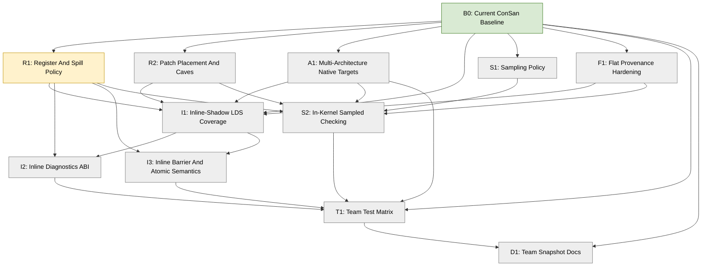

# ConSan Near-Future Plan

This plan starts from the current ConSan prototype state and intentionally
omits completed-session history. Use it as the forward DAG for the next phase
of rocJITsu DBI sanitizer work.

`DESIGN.md` describes what exists now and where that differs from the intended
architecture. This file describes the open lines of work from here.

## Status Legend

- `DONE`: baseline work already exists and is committed.
- `ACTIVE`: recommended current focus.
- `TODO`: not started in this plan.
- `PARTIAL`: useful committed subset exists, with remaining work listed.
- `BLOCKED`: cannot proceed without external state or a design decision.

Project rules:

- Commit at least once per meaningful 30-60 minute work slice.
- Update this file and the Mermaid DAG whenever a node changes status.
- Do not create `SESSION*.md` files.
- Test frequently. Use focused rocJITsu tests first, then hip-moi and IREE.
- Keep GPU test parallelism around `-j8`.
- Use the workspace TheRock ROCm build for ROCm runtime tests.
- Keep hip-moi as a semantic reference, not as public ConSan terminology.
- Start spilling work from Kunwar Grover's
  `origin/users/Groverkss/text-relocation-land` branch. It is confirmed to
  contain initial VGPR-only spilling support. Add minimal ConSan-local SGPR
  spilling only if a current probe truly needs it before shared rocJITsu
  spilling exists.
- Keep spill/cave code prototype-shaped. Broader rocJITsu spilling work may
  replace ConSan-local integration.

## Current Baseline

ConSan currently has two public top-level flavors:

```sh
RJ_CONSAN_FLAVOR=supercollider
RJ_CONSAN_FLAVOR=moi
```

MOI has three engines:

```sh
RJ_CONSAN_MOI_ENGINE=record_replay
RJ_CONSAN_MOI_ENGINE=inline_shadow
RJ_CONSAN_MOI_ENGINE=sampled
```

The useful committed baseline is:

- HSA-tools interception of final native code objects, currently implemented
  and tested on RDNA4 / `gfx1201`.
- SuperCollider-style redundant LDS/likely-group-flat check/trap probes.
- SuperCollider marker-buffer mode for non-trapping mismatch smoke tests.
- MOI report-buffer ABI and HSA-tool-owned auto report buffers.
- MOI `record_replay` dynamic access records, barrier records, host replay,
  sampled reference helpers, and narrow atomic ordering records.
- MOI `sampled` direct sampled watchpoint publication and host-side sampled
  conflict scanning.
- MOI `inline_shadow` direct exact-shadow publication for native dword LDS
  loads/stores, compact inline diagnostics, barrier epoch increments, and a
  narrow one-slot atomic ordering prototype.
- `hw_id` owner-source experiments for owner/epoch prologue initialization.
- Focused rocJITsu HIP GPU tests and IREE RDNA4 / `gfx1201` TileAndFuse smoke
  coverage.
- Intended architecture set: `gfx942`, `gfx950`, `gfx1201`, and `gfx1250`.
  The current gfx1201 focus is incidental to local hardware availability.

## DAG Overview



## Recommended Execution Order

1. `R1`: settle how ConSan obtains scratch SGPR/VGPRs without relying on
   caller-chosen registers forever. Start from Kunwar's confirmed VGPR spilling
   support in `text-relocation-land`.
2. `A1`: separate current gfx1201 implementation details from the intended
   native target set: `gfx942`, `gfx950`, `gfx1201`, and `gfx1250`.
3. `I1`: expand inline-shadow beyond native dword LDS so it can cover the IREE
   and hip-moi-style sites that matter.
4. `I2` and `I3`: make inline-shadow diagnostics and ordering semantics
   credible enough for team-facing use.
5. `S1` and `S2`: turn sampled from static-site publication into a real
   low-overhead sanitizer option.
6. `F1`: harden flat/generic LDS classification as coverage expands.
7. `T1` and `D1`: keep the external snapshot honest as the feature set grows.

The most important design dependency is `R1`. Current ConSan works by manually
selecting owner, epoch, scratch VGPRs, and sometimes explicit SGPR pairs. That
is acceptable for a prototype, but it is the main reason broader instrumentation
coverage is risky.

## R1: Register And Spill Policy - ACTIVE

Goal: replace ad hoc explicit scratch-register selection with a documented,
testable policy that can support larger DBI probes.

Current state:

- SuperCollider probes have conservative liveness/free-register selection and
  fallback descriptor VGPR growth.
- MOI probes often require explicit knobs such as `RJ_CONSAN_TMP_VGPR`,
  `RJ_CONSAN_MOI_EXEC_SAVE_SGPR`, `RJ_CONSAN_MOI_OWNER_VGPR`,
  `RJ_CONSAN_MOI_EPOCH_VGPR`, and `RJ_CONSAN_MOI_OWNER_SGPR`.
- ConSan can grow descriptor SGPR/VGPR allocation for selected explicit regs,
  but it does not prove those regs are dead and does not spill live values.
- The repo has `SpillManager`.
- Kunwar's `origin/users/Groverkss/text-relocation-land` branch is confirmed to
  contain initial VGPR-only spilling support and related text-relocation
  mechanics.
- SGPR spilling is not assumed to exist there. If ConSan needs it before shared
  support lands, implement the smallest SGPR spill/fill path required by the
  immediate probe shape.

Dependencies:

- `origin/users/Groverkss/text-relocation-land` is the first implementation
  reference for R1.
- `origin/users/Groverkss/dbt-tooling` remains useful context for earlier DBT
  utilities.

Work:

- Audit current ConSan register consumers by probe kind.
- Document which probe kinds can use liveness-free registers today and which
  still rely on explicit user knobs.
- Read `text-relocation-land`'s VGPR spilling implementation and identify the
  smallest reusable pieces for ConSan.
- Determine whether existing `SpillManager` plus Kunwar's VGPR spill/fill path
  is sufficient for first automatic scratch selection.
- Decide whether ConSan can continue avoiding SGPR spilling in the short term.
  If not, add a minimal isolated SGPR spill/fill prototype and document exactly
  which probes use it.
- Add an internal `ConSanScratchPlan` style abstraction if it reduces repeated
  manual register plumbing.
- Keep descriptor growth as fallback, not as proof of register availability.
- Keep the integration replaceable by future shared rocJITsu spilling work.
- Add tests that reject overlapping explicit owner/epoch/scratch choices.
- Add tests for automatic allocation once it exists.

Done criteria:

- A future ConSan probe author can request scratch resources through one policy
  path instead of open-coding env-var register choices.
- Existing explicit knobs still work for targeted debugging.
- At least one MOI inline-shadow recipe can run without hand-picking every
  register except where spilling is still intentionally unsupported.
- The docs clearly state whether ConSan is using Kunwar-style VGPR spilling,
  ConSan-local SGPR spilling, or still falling back to explicit registers for a
  given probe family.

Tests:

```sh
cmake --build emulation/rocjitsu/build --target rocjitsu_tests rocjitsu_dbi_hooks -j8

ROCM_PATH=/path/to/rocm HIP_PATH=/path/to/rocm \
LD_LIBRARY_PATH=/path/to/rocm/lib \
emulation/rocjitsu/build/tests/rocjitsu_tests \
  '--gtest_filter=ConSan.*:ConSanMoi.*:InstructionBuilder.*'
```

## A1: Multi-Architecture Native Targets - TODO

Goal: make ConSan's current gfx1201 focus an implementation detail, not an
implicit design limit.

Current state:

- Local development and GPU validation use RDNA4 / `gfx1201`.
- Many probe builders and tests are RDNA4-specific, especially VFLAT, barrier,
  `HW_ID1`, and owner-source code.
- The intended native target set is `gfx942`, `gfx950`, `gfx1201`, and
  `gfx1250`.
- ConSan should instrument native code for the running GPU. It should not rely
  on rocJITsu translation between architectures for sanitizer correctness.

Work:

- Inventory every architecture-specific encoder and decode assumption used by
  ConSan.
- Split current implementation notes into `gfx1201` specifics versus truly
  architecture-independent ConSan concepts.
- Add architecture capability checks for probe families: native DS, flat/VFLAT,
  barriers, atomics, `HW_ID` owner source, and TTMP launch payload reads.
- Decide the first non-gfx1201 bring-up target from `gfx942`, `gfx950`, and
  `gfx1250` based on available hardware, code-object samples, and ISA encoder
  readiness.
- Keep tests explicit about whether they require local hardware, only
  code-object patching, or synthetic instruction encoding.

Done criteria:

- `DESIGN.md` and `USAGE.md` name which ConSan features are available per
  target architecture.
- Probe selection fails clearly when a target ISA lacks an implemented encoder
  rather than silently assuming RDNA4.
- At least one non-gfx1201 code-object or synthetic patch test exercises the
  architecture dispatch path.

## R2: Patch Placement And Caves - TODO

Goal: make patch placement robust enough that coverage growth is not blocked by
small inline space or local-cave fragility.

Current state:

- SuperCollider supports inline padding, local NOP caves, and appended `.text`
  caves for selected cases.
- MOI record/replay and inline-shadow also use trampoline placement, including
  appended caves for compact IREE TileAndFuse kernels.
- Placement is conservative and still duplicated across probe families.

Work:

- Compare current `trampoline_builder`, `kernel_text_layout`, and
  `code_object_patcher` behavior against Kunwar's DBT branches.
- Identify which cave-placement utilities should become shared DBI
  infrastructure instead of ConSan-local logic.
- Add placement tests for multiple probes in one code object when text grows.
- Keep offset mapping explicit when composing native DS and flat/VFLAT passes.

Done criteria:

- Probe families use a shared placement API for inline/local/appended caves.
- Composed patches either share a valid mapping or fail loudly before emitting
  stale offsets.

## I1: Inline-Shadow LDS Coverage - TODO

Goal: make `RJ_CONSAN_MOI_ENGINE=inline_shadow` cover the LDS forms that matter
for IREE and hip-moi-style workloads.

Current state:

- Exact-shadow publication is live for native dword LDS loads/stores.
- It records one 4-byte LDS cell per probe.
- It can emit compact diagnostics for prior non-empty, different-owner,
  same-epoch conflicts, suppressing read/read pairs.
- It does not cover native B64/B128/two-address/d16 forms or likely-group flat
  accesses.

Work:

- Extend exact-shadow cell-range handling to multi-cell native DS forms:
  `ds_load/store_b64`, `ds_load/store_b128`, and two-address loads.
- Decide whether d16 forms should publish one rounded 4-byte cell first, or
  carry byte masks into the inline predicate.
- Add likely-group flat/VFLAT inline-shadow support only after `F1` clarifies
  provenance and address normalization.
- Keep native DS coverage ahead of flat coverage for IREE.

Done criteria:

- Inline-shadow can instrument representative IREE TileAndFuse native DS sites
  without limiting to one dword access.
- Race controls exercise at least one multi-cell access.

Tests:

- Focused rocJITsu inline-shadow HIP controls.
- IREE TileAndFuse RDNA4 matmul subset with
  `RJ_CONSAN_MOI_ENGINE=inline_shadow`.

## I2: Inline Diagnostics ABI - TODO

Goal: make inline-shadow diagnostics useful to a teammate, not just a test
guard.

Current state:

- The first inline diagnostic writes `diagnostic_count=1` and overwrites the
  first diagnostic slot.
- It records backend, kind, generation, epoch, owners, instruction offsets, and
  access kinds.
- It does not yet fill LDS byte range, lane mask, or multiple diagnostics.

Work:

- Fill LDS byte offset and byte count in inline diagnostics.
- Record enough lane or EXEC information to understand whether a conflict was
  wave-wide or lane-narrow.
- Convert the one-slot overwrite into bounded append or first-N capture.
- Preserve the current simple failure guards:
  `RJ_CONSAN_MOI_REQUIRE_DIAGNOSTICS=1` and
  `RJ_CONSAN_MOI_FORBID_DIAGNOSTICS=1`.

Done criteria:

- A failing inline-shadow run prints a diagnostic that names at least access
  kinds, owner ids, epoch, instruction offsets, and LDS byte range.
- Overflow is visible and does not silently look like "no races."

## I3: Inline Barrier And Atomic Semantics - TODO

Goal: make inline-shadow ordering semantics match the record/replay oracle well
enough for LDS MVP use.

Current state:

- Barrier patching can increment a configured epoch VGPR after supported
  RDNA4 32-bit barriers.
- Inline atomic ordering has a one-slot address-scoped release/acquire
  prototype for a narrow no-SADDR `flat_atomic*` subset.
- Record/replay host semantics are still the reference model.

Work:

- Compare inline barrier epochs against host replay on more than one barrier in
  one kernel.
- Handle repeated barriers without epoch overflow surprising the predicate.
- Expand atomic tests before expanding atomic instruction coverage.
- Keep global memory out of scope for this MVP; atomics matter only as ordering
  events for LDS.

Done criteria:

- Barrier-ordered LDS access controls are clean under inline-shadow.
- Same-address atomic handoff controls are clean; wrong-address controls still
  report.
- Behavior is documented as LDS ordering support, not global-memory checking.

## S1: Sampling Policy - TODO

Goal: turn sampled mode from static-site throttling into a real low-overhead
sanitizer option.

Current state:

- `RJ_CONSAN_MOI_ENGINE=sampled` writes compact sampled entries directly from
  DBI probes.
- `RJ_CONSAN_MOI_SAMPLE_STRIDE` and `RJ_CONSAN_MOI_SAMPLE_OFFSET` select static
  candidate sites deterministically.
- Direct sampled entries use generation zero and are checked host-side at
  teardown.

Work:

- Decide the first runtime sampling mechanism: counter, lane condition,
  hardware-derived seed, or host-configured deterministic sequence.
- Keep a deterministic mode for reproducible tests.
- Add generation updates so old sampled entries can be consumed or ignored
  intentionally.
- Document that sampled is lower-fidelity: a clean run is not proof of no race.

Done criteria:

- A run can reduce sampled probe overhead without recompiling or changing which
  static sites are patchable.
- The test suite has deterministic sampled controls.

## S2: In-Kernel Sampled Checking - TODO

Goal: let sampled mode report conflicts without waiting for host teardown.

Current state:

- Direct sampled probes publish entries.
- Host teardown scans the sampled table and reports sampled conflicts.
- There is no in-kernel sampled conflict checker.

Work:

- Choose a minimal sampled table policy: one slot per site, hashed LDS cell, or
  small set-associative table.
- Add an in-kernel check against at least one prior sampled entry.
- Emit diagnostics through the shared MOI diagnostic ABI where practical.
- Preserve host-side sampled replay as a test oracle.

Done criteria:

- A known sampled race can produce a GPU-side or immediate diagnostic without
  relying solely on teardown scanning.

## F1: Flat Provenance Hardening - TODO

Goal: make likely-group flat/VFLAT instrumentation defensible as coverage grows.

Current state:

- Flat/VFLAT support is necessary for hip-moi-style compiled helper code.
- `Group` and `MaybeGroup` provenance are instrumentable.
- The tracker follows `src_shared_base` and related pointer construction
  patterns, but `MaybeGroup` is still heuristic.

Work:

- Audit IREE and hip-moi flat sites separately; do not assume they have the
  same provenance quality.
- Add a strict mode that instruments only `Group`, not `MaybeGroup`, if useful
  for team demos.
- Improve address normalization for flat LDS pointers before enabling
  inline-shadow flat coverage.
- Add logs that make skipped flat sites understandable.

Done criteria:

- Docs and logs make clear when a flat access is strongly known group memory
  versus a heuristic `MaybeGroup`.
- Inline-shadow flat work has a concrete address-normalization contract.

## T1: Team Test Matrix - TODO

Goal: maintain a small but meaningful ConSan test corpus that can run in a
developer session and a broader corpus for confidence.

Current state:

- Focused rocJITsu unit and HIP GPU tests cover the main prototype pieces.
- IREE TileAndFuse RDNA4 / `gfx1201` matmul smoke has passed for
  SuperCollider, MOI record/replay, sampled, and inline-shadow configurations.
- The broader IREE e2e inventory has been used as compatibility coverage for
  SuperCollider.
- No equivalent `gfx942`, `gfx950`, or `gfx1250` ConSan test tier exists yet.

Work:

- Define three tiers:
  - `tier0`: fast unit and focused HIP controls.
  - `tier1`: IREE TileAndFuse and selected e2e LDS-heavy tests.
  - `tier2`: broader IREE e2e inventory.
- Add exact commands to `TUTORIAL.md` or `USAGE.md`.
- Keep `ctest -j8` as the GPU default.
- Add a short test-results table that can be updated per snapshot.
- Add per-architecture rows for `gfx942`, `gfx950`, `gfx1201`, and `gfx1250`,
  distinguishing live-GPU runs from synthetic/code-object-only coverage.

Done criteria:

- A teammate can run one command per tier and know what a pass means.

## D1: Team Snapshot Docs - TODO

Goal: keep documentation aligned with the current team-facing snapshot.

Current state:

- `TUTORIAL.md` introduces both top-level flavors.
- `DESIGN.md` explains current behavior and intentional gaps.
- `USAGE.md` remains the detailed env-var runbook.

Work:

- Keep `README.md` as the landing page.
- Move command-heavy details into `TUTORIAL.md` and `USAGE.md`.
- Keep `DESIGN.md` present-facing and avoid work-log language.
- Keep `PLAN.md` future-facing and avoid closed-session archaeology.

Done criteria:

- New readers can answer:
  - which flavor should I run?
  - what evidence proves DBI happened?
  - what is implemented versus aspirational?
  - what is the next engineering work?

## External Branch References

Kunwar Grover (`@Groverkss`) has DBT/DBI work on origin that should guide the
next spilling and text-relocation work:

- `origin/users/Groverkss/text-relocation-land`
  - Primary branch for ConSan's next spilling work.
  - Confirmed to contain initial VGPR-only spilling support.
  - Look for kernel-local text relocation, appended/near code placement,
    sidecar metadata, kernarg extension, virtual LDS ideas, liveness-related
    refinements, and spill/fill implementation details.
  - Do not assume SGPR spilling is present. Add only minimal ConSan-local SGPR
    support if the current probe work truly needs it.
- `origin/users/Groverkss/dbt-tooling`
  - Earlier/smaller DBT tooling branch.
  - Look for reusable translation/HSA-tool scaffolding, ELF code-cave
    placement, and the ancestor of current rocJITsu DBT utilities.
- `origin/users/Groverkss/dbt_interposer`
  - Broader interposer branch.
  - Look here if ConSan needs lower-level HSA/KFD interception patterns beyond
    the current HSA-tools path.

Do not rebuild those mechanisms blindly inside ConSan if a reusable DBT
primitive already exists or can be factored out. Also do not over-engineer a
parallel ConSan spilling framework: current ConSan spill code may be replaced by
shared rocJITsu infrastructure.
