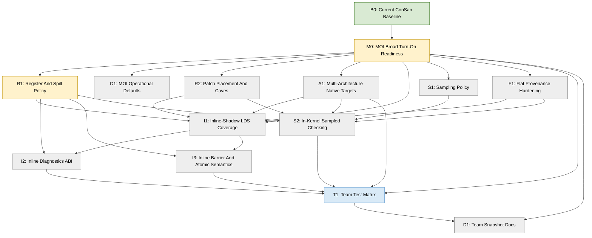

# ConSan Near-Future Plan

This plan starts from the current ConSan prototype state and intentionally
omits completed-session history. Use it as the forward DAG for the next phase
of rocJITsu DBI sanitizer work.

`DESIGN.md` describes what exists now and where that differs from the intended
architecture. This file describes the open lines of work from here.

## Status Legend

- `DONE`: baseline work already exists and is committed.
- `ACTIVE`: recommended current focus.
- `TODO`: not started in this plan.
- `PARTIAL`: useful committed subset exists, with remaining work listed.
- `BLOCKED`: cannot proceed without external state or a design decision.

Project rules:

- Commit at least once per meaningful 30-60 minute work slice.
- Update this file and the Mermaid DAG whenever a node changes status.
- Do not create `SESSION*.md` files.
- Test frequently. Use focused rocJITsu tests first, then hip-moi and IREE.
- Keep GPU test parallelism around `-j8`.
- Use the workspace TheRock ROCm build for ROCm runtime tests.
- Keep hip-moi as a semantic reference, not as public ConSan terminology.
- Start spilling work from Kunwar Grover's
  `origin/users/Groverkss/text-relocation-land` branch. It contains a reusable
  VGPR allocation/spill-frame pattern and a CDNA3 save/restore emitter. Add
  RDNA4 emission for ConSan's local target, and add minimal ConSan-local SGPR
  spilling only if a current probe truly needs it before shared rocJITsu
  spilling exists.
- Keep spill/cave code prototype-shaped. Broader rocJITsu spilling work may
  replace ConSan-local integration.

## Current Baseline

ConSan currently has two public top-level flavors:

```sh
RJ_CONSAN_FLAVOR=supercollider
RJ_CONSAN_FLAVOR=moi
```

MOI has three engines:

```sh
RJ_CONSAN_MOI_ENGINE=record_replay
RJ_CONSAN_MOI_ENGINE=inline_shadow
RJ_CONSAN_MOI_ENGINE=sampled
```

The useful committed baseline is:

- HSA-tools interception of final native code objects, currently implemented
  and tested on RDNA4 / `gfx1201`.
- SuperCollider-style redundant LDS/likely-group-flat check/trap probes.
- SuperCollider marker-buffer mode for non-trapping mismatch smoke tests.
- MOI report-buffer ABI and HSA-tool-owned auto report buffers.
- MOI `record_replay` dynamic access records, barrier records, host replay,
  sampled reference helpers, and narrow atomic ordering records.
- MOI `sampled` direct sampled watchpoint publication and host-side sampled
  conflict scanning.
- MOI `inline_shadow` direct exact-shadow publication for native dword LDS
  loads/stores, compact inline diagnostics, barrier epoch increments, and a
  narrow one-slot atomic ordering prototype.
- `hw_id` owner-source experiments for owner/epoch prologue initialization.
- Focused rocJITsu HIP GPU tests and IREE RDNA4 / `gfx1201` TileAndFuse smoke
  coverage.
- Intended architecture set: `gfx942`, `gfx950`, `gfx1201`, and `gfx1250`.
  The current gfx1201 focus is incidental to local hardware availability.

## DAG Overview



## Recommended Execution Order

1. `M0`: keep the explicit checklist of why MOI is not yet a broad
   turn-on-everything mode, and update it as each blocker closes.
2. `R1`: settle how ConSan obtains scratch SGPR/VGPRs without relying on
   caller-chosen registers forever. Start from Kunwar's confirmed VGPR spilling
   support in `text-relocation-land`.
3. `O1`: remove prototype command-line burden: report-buffer sizing, default
   per-engine resource profiles, and clear unsupported/overflow failures.
4. `A1`: separate current gfx1201 implementation details from the intended
   native target set: `gfx942`, `gfx950`, `gfx1201`, and `gfx1250`.
5. `I1`: expand inline-shadow beyond native dword LDS so it can cover the IREE
   and hip-moi-style sites that matter.
6. `I2` and `I3`: make inline-shadow diagnostics and ordering semantics
   credible enough for team-facing use.
7. `S1` and `S2`: turn sampled from static-site publication into a real
   low-overhead sanitizer option.
8. `F1`: harden flat/generic LDS classification as coverage expands.
9. `T1` and `D1`: keep the external snapshot honest as the feature set grows.

The most important design dependency is `R1`. Current ConSan works by manually
selecting owner, epoch, scratch VGPRs, and sometimes explicit SGPR pairs. That
is acceptable for a prototype, but it is the main reason broader instrumentation
coverage is risky.

## M0: MOI Broad Turn-On Readiness - ACTIVE

Goal: remove the remaining reasons why MOI cannot be run over the same broad
test corpus as SuperCollider with only a top-level flavor and engine choice.

Target operator experience:

```sh
HSA_TOOLS_LIB=/path/to/librocjitsu_dbi_hooks.so \
RJ_CONSAN_FLAVOR=moi \
RJ_CONSAN_MOI_ENGINE=record_replay|inline_shadow|sampled \
ctest ...
```

Engine choice should stay explicit. The work here is to eliminate the extra
per-test prototype knobs that currently make MOI feel like a collection of
targeted experiments.

Current state:

- `record_replay` and `sampled` have passed broad local IREE e2e compatibility
  sweeps with explicit prototype resource knobs.
- `inline_shadow` has passed targeted IREE TileAndFuse tests, but a broader
  local IREE sweep exposed a timeout/hang, so it is not yet a blanket mode.
- hip-moi and rocjitsu-test-corpus coverage have historically been run more
  thoroughly under SuperCollider than under all MOI engines.
- MOI still needs explicit report-buffer sizing and, for several paths,
  manually selected scratch/owner/epoch registers.

The primary technical dependency for broad MOI operation is `R1`. The other
gaps below still matter, but broad runs with hand-picked register numbers do not
establish that instrumentation is safe for arbitrary kernels. ConSan first
needs to acquire, preserve, and account for its temporary and persistent
register state automatically.

Blocking reasons to close:

- Scratch register allocation and spilling are not automatic enough.
- Owner and epoch state are not automatically placed for arbitrary kernels.
- HSA-tool-owned report buffers do not yet have robust per-engine default
  capacities and overflow reporting.
- MOI has engine-specific recipes instead of stable profiles.
- `inline_shadow` instruction coverage is narrower than `record_replay` and
  `sampled`.
- Patch placement is not yet stress-tested for broad multi-probe MOI growth.
- Flat/generic LDS provenance is still partly heuristic.
- Barrier and atomic ordering are present but narrow.
- Inline diagnostics are basic first-conflict records.
- Sampled mode lacks runtime sampling/generation policy and in-kernel checking.
- Non-gfx1201 architecture dispatch is not validated.
- The test matrix does not yet require MOI parity with SuperCollider.

Work:

- Keep this section synchronized with `DESIGN.md`'s "MOI Broad Enablement Gap".
- As each blocker moves to a dedicated implementation node, record that
  dependency here instead of leaving it implicit.
- Define a standard MOI command profile for each engine. Explicit debug knobs
  may remain, but should not be required for ordinary corpus runs.
- Treat a broad corpus hang, timeout, or silent no-record run as a product bug,
  not just a test inconvenience.

Done criteria:

- `record_replay`, `sampled`, and `inline_shadow` each have one documented
  standard run recipe.
- Those recipes avoid hand-picking registers for ordinary corpus runs.
- The standard recipes pass focused rocJITsu tests, hip-moi controls, selected
  IREE LDS-heavy tests, and the broader IREE e2e compatibility tier on
  `gfx1201`.
- Unsupported code objects fail or skip with clear logs; they do not hang and
  do not look like successful instrumentation.
- `DESIGN.md`, `USAGE.md`, `TUTORIAL.md`, and local testing notes agree on the
  readiness level of each MOI engine.

## R1: Register And Spill Policy - ACTIVE

Goal: give every ConSan probe a documented, testable way to acquire temporary
registers and persistent sanitizer state without relying on caller-chosen
register numbers or clobbering application state.

Current state:

- SuperCollider probes have conservative liveness/free-register selection and
  fallback descriptor VGPR growth.
- MOI probes often require explicit knobs such as `RJ_CONSAN_TMP_VGPR`,
  `RJ_CONSAN_MOI_EXEC_SAVE_SGPR`, `RJ_CONSAN_MOI_OWNER_VGPR`,
  `RJ_CONSAN_MOI_EPOCH_VGPR`, and `RJ_CONSAN_MOI_OWNER_SGPR`.
- ConSan can grow descriptor SGPR/VGPR allocation for selected explicit regs,
  but it does not prove those regs are dead and does not spill live values.
- The patch layer already has `SpillManager`. It allocates stable per-lane
  private-memory offsets and computes the enlarged private segment, but it does
  not choose victim registers, emit save/restore instructions, or patch a
  ConSan kernel descriptor by itself.
- Kunwar's `origin/users/Groverkss/text-relocation-land` branch has a more
  complete VGPR-only pattern:
  - `code/dbt/semantic_scratch.*` prefers a liveness-dead aligned VGPR window,
    then borrows an allowed live window and assigns transient private-memory
    spill slots;
  - `code/dbt/semantic/cdna3_scratch.*` emits target-specific
    `flat_scratch` dword save/restore sequences and waits;
  - `TranslationContext` separates persistent spill storage from a reusable
    per-instruction spill frame and feeds VGPR, SGPR, and private-segment
    high-water marks back into descriptor translation;
  - `BinaryTranslator` computes kernel-scoped CFG liveness, relocates expanded
    kernel text, and commits descriptor growth only after lowering succeeds.
- Kunwar's concrete spill emitter is CDNA3-only. ConSan's first live target is
  RDNA4 / `gfx1201`, so R1 needs an RDNA4 spill/fill encoder and wait policy,
  not a direct copy of that emitter.
- Kunwar's branch has no general SGPR spill stack. It uses liveness-proven or
  descriptor-backed SGPRs where possible and has special-purpose scalar
  preservation only for specific lowerings.
- ConSan currently instruments both kernel ranges and separately discovered
  functions. Private spill storage is descriptor-owned, so the first spill
  implementation must remain kernel-scoped; a shared function may only use it
  after every owning kernel and call path is known and updated.

Current MOI resource demand, before any future probe simplification:

| Probe family | Ephemeral VGPR window | Other state |
| --- | ---: | --- |
| Record/replay access | 3 static-site; 8 dynamic | Dynamic append also needs an EXEC-save SGPR pair. |
| Sampled access | 5 | No persistent owner/epoch requirement in the current direct publication path. |
| Inline shadow | 7 basic; 9 with rich diagnostics | Persistent owner and optional epoch VGPRs; diagnostic paths can use up to four temporary SGPR pairs. |
| Barrier record / inline barrier | 6 for a record | Record mode needs an EXEC-save SGPR pair; inline mode updates persistent epoch state. |
| Atomic record / inline atomic | 3 record; 5 inline | Inline mode needs owner/epoch and scalar save state. |

The distinction between ephemeral and persistent state is important. A
site-local spill lease can safely borrow a live VGPR around one probe, but it
cannot hold owner or epoch state across the kernel. Persistent state needs a
dedicated descriptor-backed register or a private-memory representation that
is materialized at each probe.

Dependencies:

- `origin/users/Groverkss/text-relocation-land` is the first implementation
  reference for allocation policy, spill frames, save/restore emission,
  descriptor feedback, and kernel-local relocation.
- `origin/users/Groverkss/dbt-tooling` remains useful context for earlier DBT
  utilities.
- Existing `LivenessAnalysis`, `SpillManager`, `CodeObjectPatcher`, and kernel
  descriptor helpers are the local primitives to extend or share.
- `R2` owns the general placement cleanup. R1 may use the existing appended
  cave path for its first forced-spill probe, but must account for the larger
  save/probe/restore sequence in placement and branch-range checks.

Allocation policy:

- Plan resources per kernel before mutating code-object bytes. A plan must name
  each register window, forbidden operand/state ranges, preservation strategy,
  private-memory offsets, descriptor changes, and placement size.
- Keep explicit environment-selected registers as debug overrides. Validate
  them through the same planner instead of bypassing safety checks.
- For ephemeral VGPR windows, try in this order:
  1. a liveness-dead window inside the existing allocation;
  2. a fresh descriptor-backed window above every guest register reference;
  3. an allowed live window saved and restored through per-lane private memory;
  4. a visible unsupported/failure result when none is legal.
- Treat descriptor growth as resource allocation, not as proof that an
  existing guest register is dead.
- For owner/epoch state, prefer dedicated registers above all guest references.
  If the register file has no persistent window, store the state in persistent
  per-lane private slots and load/store it around probes; never borrow a
  site-local live register across unrelated instructions.
- For temporary SGPRs, first use kernel-scoped liveness and safe
  descriptor-backed growth. Do not build general SGPR spilling speculatively.
  If real parity tests still require it, add only the smallest save/fill path
  needed by the blocking probe and account explicitly for EXEC, VCC, SCC, and
  lane-selection constraints.
- Initially skip spill-backed function candidates whose owning kernel set is
  ambiguous. Log the reason instead of patching a descriptor-incompatible
  shared function.

Implementation stages:

1. **R1a - shared planning.** Add a per-kernel resource context and a
   `ConSanScratchPlan`-style result. Build kernel-scoped liveness once, map each
   selected MOI site to its kernel, centralize forbidden ranges, and report
   whether each resource is explicit, dead, descriptor-grown, or spilled.
2. **R1b - automatic non-spilling allocation.** Move record/replay and sampled
   access probes onto the planner first, then barrier/atomic probes. Add
   persistent owner/epoch allocation for inline shadow. Ordinary runs should no
   longer require register environment variables when a dead or fresh window
   exists.
3. **R1c - RDNA4 VGPR spilling.** Share or adapt Kunwar's scratch request,
   lease, and transient-frame model; use `SpillManager` for per-kernel offsets;
   add RDNA4 `scratch_store`/`scratch_load` emission and required waits; wrap a
   probe with save/original-access/instrumentation/restore; and raise
   `private_segment_fixed_size` plus the descriptor private-segment enable bit
   transactionally.
4. **R1d - persistent-state fallback.** Materialize owner/epoch from persistent
   private slots when no whole-kernel VGPRs are available. Make barrier epoch
   updates use the same representation. Decide from measured corpus failures,
   not anticipation, whether a minimal SGPR spill path is necessary.
5. **R1e - parity rollout.** Enable forced-spill tests, then remove manual
   register recipes from record/replay and sampled broad runs. Advance inline
   shadow only after its owner/epoch and scalar-state paths are automatic.

Correctness requirements:

- Save before the borrowed value can be clobbered and restore before every
  fallthrough/return edge from the probe.
- Preserve original memory-access behavior and required EXEC/VCC/SCC state.
- Model scratch load/store wait-counter effects; do not reuse a victim before
  its save completes or return to guest code before its restore completes.
- Update only descriptors for kernels that can execute the spill-backed probe,
  including private-segment size and enablement.
- Reject unencodable scratch offsets, private-segment overflow, missing flat
  scratch initialization, ambiguous shared-function ownership, and placement
  failure with a specific diagnostic.
- Commit code bytes, placement, and descriptors as one transaction so a failed
  plan cannot leave a partially modified code object.
- Keep the integration replaceable by shared rocJITsu scratch infrastructure;
  factor generally useful allocator/emitter pieces instead of cloning them
  inside each ConSan engine.

Done criteria:

- A future ConSan probe author can request scratch resources through one policy
  path instead of open-coding env-var register choices.
- Existing explicit knobs still work for targeted debugging.
- Record/replay and sampled standard recipes run without hand-picking registers
  on the broad `gfx1201` compatibility tier, including a test that forces the
  VGPR spill tier.
- Inline shadow runs its targeted tier without hand-picked scratch, owner,
  epoch, or SGPR registers before it is promoted to the broad tier.
- Spill-backed probes preserve a deliberately live victim value and produce the
  same application result as an uninstrumented control.
- Descriptor tests prove that only owning kernels receive the required VGPR,
  SGPR, and private-segment changes.
- Allocation and spill failures are distinguishable from "no race found" and
  from "no supported site found" in logs and guards.
- The docs clearly state whether ConSan is using Kunwar-style VGPR spilling,
  ConSan-local SGPR spilling, or still falling back to explicit registers for a
  given probe family.

Validation order:

- Unit-test allocation precedence, alignment, forbidden ranges, transient and
  persistent slot separation, offset limits, descriptor growth, and rollback.
- Add instruction-builder/decode tests for RDNA4 spill/fill encodings and wait
  sequences.
- Add synthetic patch-shape tests for dead, fresh, forced-spill, and failure
  plans, including multi-kernel and shared-function code objects.
- Add a focused HIP test whose victim VGPR is live across the instrumented LDS
  access and verify both the application output and ConSan report.
- Run focused rocJITsu tests, hip-moi controls, IREE TileAndFuse, and then the
  broad IREE e2e tier for each engine. Keep GPU test parallelism around `8` and
  use timeouts for inline-shadow triage.

Focused build and unit-test entry point:

```sh
cmake --build emulation/rocjitsu/build --target rocjitsu_tests rocjitsu_dbi_hooks

ROCM_PATH=/path/to/rocm HIP_PATH=/path/to/rocm \
LD_LIBRARY_PATH=/path/to/rocm/lib \
emulation/rocjitsu/build/tests/rocjitsu_tests \
  '--gtest_filter=ConSan.*:ConSanMoi.*:InstructionBuilder.*:SpillManager.*:LivenessAnalysis.*'
```

## O1: MOI Operational Defaults - TODO

Goal: make MOI command lines stable and short enough for routine use.

Current state:

- Broad MOI tests often pass explicit `RJ_CONSAN_MOI_AUTO_REPORT_BUFFER_SIZE`.
- `record_replay`, `sampled`, and `inline_shadow` require different practical
  buffer sizes.
- Some guards are useful for proving instrumentation happened:
  `RJ_CONSAN_REQUIRE_PATCH=1`, `RJ_CONSAN_MOI_REQUIRE_RECORDS=1`,
  `RJ_CONSAN_MOI_REQUIRE_DIAGNOSTICS=1`, and
  `RJ_CONSAN_MOI_FORBID_DIAGNOSTICS=1`.
- The current broad inline-shadow IREE sweep can timeout/hang, so standard
  recipes also need failure containment.

Work:

- Add per-engine default auto-buffer sizing when
  `RJ_CONSAN_FLAVOR=moi` is selected and the user did not provide a report
  buffer.
- Prefer capacity estimates derived from candidate counts where practical.
- Make buffer overflow visible in logs, guards, and diagnostics.
- Define standard engine profiles:
  - `record_replay`: reference/debug, host replay enabled, enough records for
    ordinary compatibility sweeps.
  - `sampled`: low-overhead profile with deterministic sampling knobs only when
    the user asks for reproducibility.
  - `inline_shadow`: exact profile with automatic owner/epoch/scratch once R1
    is ready.
- Keep explicit env overrides for debugging.
- Separate "prove instrumentation happened" guards from ordinary compatibility
  runs so teammates know when to use each.
- Add timeout/hang triage notes to local testing until the underlying
  inline-shadow broad issue is fixed.

Done criteria:

- A teammate can run each MOI engine with `RJ_CONSAN_FLAVOR=moi` plus
  `RJ_CONSAN_MOI_ENGINE=...` and no buffer-size knob for ordinary tests.
- Default buffer sizes are conservative enough for tier0 and tier1.
- Overflows are reported as overflows.
- Guarded demo recipes remain available but are clearly optional.

## A1: Multi-Architecture Native Targets - TODO

Goal: make ConSan's current gfx1201 focus an implementation detail, not an
implicit design limit.

Current state:

- Local development and GPU validation use RDNA4 / `gfx1201`.
- Many probe builders and tests are RDNA4-specific, especially VFLAT, barrier,
  `HW_ID1`, and owner-source code.
- The intended native target set is `gfx942`, `gfx950`, `gfx1201`, and
  `gfx1250`.
- ConSan should instrument native code for the running GPU. It should not rely
  on rocJITsu translation between architectures for sanitizer correctness.

Work:

- Inventory every architecture-specific encoder and decode assumption used by
  ConSan.
- Split current implementation notes into `gfx1201` specifics versus truly
  architecture-independent ConSan concepts.
- Add architecture capability checks for probe families: native DS, flat/VFLAT,
  barriers, atomics, `HW_ID` owner source, and TTMP launch payload reads.
- Decide the first non-gfx1201 bring-up target from `gfx942`, `gfx950`, and
  `gfx1250` based on available hardware, code-object samples, and ISA encoder
  readiness.
- Keep tests explicit about whether they require local hardware, only
  code-object patching, or synthetic instruction encoding.

Done criteria:

- `DESIGN.md` and `USAGE.md` name which ConSan features are available per
  target architecture.
- Probe selection fails clearly when a target ISA lacks an implemented encoder
  rather than silently assuming RDNA4.
- At least one non-gfx1201 code-object or synthetic patch test exercises the
  architecture dispatch path.

## R2: Patch Placement And Caves - TODO

Goal: make patch placement robust enough that coverage growth is not blocked by
small inline space or local-cave fragility.

Current state:

- SuperCollider supports inline padding, local NOP caves, and appended `.text`
  caves for selected cases.
- MOI record/replay and inline-shadow also use trampoline placement, including
  appended caves for compact IREE TileAndFuse kernels.
- Placement is conservative and still duplicated across probe families.

Work:

- Compare current `trampoline_builder`, `kernel_text_layout`, and
  `code_object_patcher` behavior against Kunwar's DBT branches.
- Identify which cave-placement utilities should become shared DBI
  infrastructure instead of ConSan-local logic.
- Add placement tests for multiple probes in one code object when text grows.
- Keep offset mapping explicit when composing native DS and flat/VFLAT passes.

Done criteria:

- Probe families use a shared placement API for inline/local/appended caves.
- Composed patches either share a valid mapping or fail loudly before emitting
  stale offsets.

## I1: Inline-Shadow LDS Coverage - TODO

Goal: make `RJ_CONSAN_MOI_ENGINE=inline_shadow` cover the LDS forms that matter
for IREE and hip-moi-style workloads.

Current state:

- Exact-shadow publication is live for native dword LDS loads/stores.
- It records one 4-byte LDS cell per probe.
- It can emit compact diagnostics for prior non-empty, different-owner,
  same-epoch conflicts, suppressing read/read pairs.
- It does not cover native B64/B128/two-address/d16 forms or likely-group flat
  accesses.

Work:

- Extend exact-shadow cell-range handling to multi-cell native DS forms:
  `ds_load/store_b64`, `ds_load/store_b128`, and two-address loads.
- Decide whether d16 forms should publish one rounded 4-byte cell first, or
  carry byte masks into the inline predicate.
- Add likely-group flat/VFLAT inline-shadow support only after `F1` clarifies
  provenance and address normalization.
- Keep native DS coverage ahead of flat coverage for IREE.

Done criteria:

- Inline-shadow can instrument representative IREE TileAndFuse native DS sites
  without limiting to one dword access.
- Race controls exercise at least one multi-cell access.

Tests:

- Focused rocJITsu inline-shadow HIP controls.
- IREE TileAndFuse RDNA4 matmul subset with
  `RJ_CONSAN_MOI_ENGINE=inline_shadow`.

## I2: Inline Diagnostics ABI - TODO

Goal: make inline-shadow diagnostics useful to a teammate, not just a test
guard.

Current state:

- The first inline diagnostic writes `diagnostic_count=1` and overwrites the
  first diagnostic slot.
- It records backend, kind, generation, epoch, owners, instruction offsets, and
  access kinds.
- It does not yet fill LDS byte range, lane mask, or multiple diagnostics.

Work:

- Fill LDS byte offset and byte count in inline diagnostics.
- Record enough lane or EXEC information to understand whether a conflict was
  wave-wide or lane-narrow.
- Convert the one-slot overwrite into bounded append or first-N capture.
- Preserve the current simple failure guards:
  `RJ_CONSAN_MOI_REQUIRE_DIAGNOSTICS=1` and
  `RJ_CONSAN_MOI_FORBID_DIAGNOSTICS=1`.

Done criteria:

- A failing inline-shadow run prints a diagnostic that names at least access
  kinds, owner ids, epoch, instruction offsets, and LDS byte range.
- Overflow is visible and does not silently look like "no races."

## I3: Inline Barrier And Atomic Semantics - TODO

Goal: make inline-shadow ordering semantics match the record/replay oracle well
enough for LDS MVP use.

Current state:

- Barrier patching can increment a configured epoch VGPR after supported
  RDNA4 32-bit barriers.
- Inline atomic ordering has a one-slot address-scoped release/acquire
  prototype for a narrow no-SADDR `flat_atomic*` subset.
- Record/replay host semantics are still the reference model.

Work:

- Compare inline barrier epochs against host replay on more than one barrier in
  one kernel.
- Handle repeated barriers without epoch overflow surprising the predicate.
- Expand atomic tests before expanding atomic instruction coverage.
- Keep global memory out of scope for this MVP; atomics matter only as ordering
  events for LDS.

Done criteria:

- Barrier-ordered LDS access controls are clean under inline-shadow.
- Same-address atomic handoff controls are clean; wrong-address controls still
  report.
- Behavior is documented as LDS ordering support, not global-memory checking.

## S1: Sampling Policy - TODO

Goal: turn sampled mode from static-site throttling into a real low-overhead
sanitizer option.

Current state:

- `RJ_CONSAN_MOI_ENGINE=sampled` writes compact sampled entries directly from
  DBI probes.
- `RJ_CONSAN_MOI_SAMPLE_STRIDE` and `RJ_CONSAN_MOI_SAMPLE_OFFSET` select static
  candidate sites deterministically.
- Direct sampled entries use generation zero and are checked host-side at
  teardown.

Work:

- Decide the first runtime sampling mechanism: counter, lane condition,
  hardware-derived seed, or host-configured deterministic sequence.
- Keep a deterministic mode for reproducible tests.
- Add generation updates so old sampled entries can be consumed or ignored
  intentionally.
- Document that sampled is lower-fidelity: a clean run is not proof of no race.

Done criteria:

- A run can reduce sampled probe overhead without recompiling or changing which
  static sites are patchable.
- The test suite has deterministic sampled controls.

## S2: In-Kernel Sampled Checking - TODO

Goal: let sampled mode report conflicts without waiting for host teardown.

Current state:

- Direct sampled probes publish entries.
- Host teardown scans the sampled table and reports sampled conflicts.
- There is no in-kernel sampled conflict checker.

Work:

- Choose a minimal sampled table policy: one slot per site, hashed LDS cell, or
  small set-associative table.
- Add an in-kernel check against at least one prior sampled entry.
- Emit diagnostics through the shared MOI diagnostic ABI where practical.
- Preserve host-side sampled replay as a test oracle.

Done criteria:

- A known sampled race can produce a GPU-side or immediate diagnostic without
  relying solely on teardown scanning.

## F1: Flat Provenance Hardening - TODO

Goal: make likely-group flat/VFLAT instrumentation defensible as coverage grows.

Current state:

- Flat/VFLAT support is necessary for hip-moi-style compiled helper code.
- `Group` and `MaybeGroup` provenance are instrumentable.
- The tracker follows `src_shared_base` and related pointer construction
  patterns, but `MaybeGroup` is still heuristic.

Work:

- Audit IREE and hip-moi flat sites separately; do not assume they have the
  same provenance quality.
- Add a strict mode that instruments only `Group`, not `MaybeGroup`, if useful
  for team demos.
- Improve address normalization for flat LDS pointers before enabling
  inline-shadow flat coverage.
- Add logs that make skipped flat sites understandable.

Done criteria:

- Docs and logs make clear when a flat access is strongly known group memory
  versus a heuristic `MaybeGroup`.
- Inline-shadow flat work has a concrete address-normalization contract.

## T1: Team Test Matrix - PARTIAL

Goal: maintain a small but meaningful ConSan test corpus that can run in a
developer session and a broader corpus for confidence.

Current state:

- Focused rocJITsu unit and HIP GPU tests cover the main prototype pieces.
- IREE TileAndFuse RDNA4 / `gfx1201` matmul smoke has passed for
  SuperCollider, MOI record/replay, sampled, and inline-shadow configurations.
- The broader IREE e2e inventory has been used as compatibility coverage for
  SuperCollider.
- The broader local IREE e2e inventory has also passed MOI `record_replay` and
  `sampled` compatibility sweeps with explicit prototype resource knobs.
- A broader local IREE e2e `inline_shadow` sweep is not yet clean: targeted
  TileAndFuse tests pass, but a broad run exposed a timeout/hang. Treat that as
  an open MOI broad-readiness bug.
- hip-moi has been valuable as semantic control coverage, but MOI runs are not
  yet documented as thoroughly as SuperCollider runs.
- No equivalent `gfx942`, `gfx950`, or `gfx1250` ConSan test tier exists yet.

Work:

- Define three tiers:
  - `tier0`: fast unit and focused HIP controls.
  - `tier1`: IREE TileAndFuse and selected e2e LDS-heavy tests.
  - `tier2`: broader IREE e2e inventory.
- Add exact commands to `TUTORIAL.md` or `USAGE.md`.
- Keep `ctest -j8` as the GPU default.
- Add a short test-results table that can be updated per snapshot.
- Require MOI test rows for every SuperCollider row where the engine should be
  able to run. If an engine intentionally cannot run that row yet, record the
  blocker instead of leaving the row absent.
- Add per-architecture rows for `gfx942`, `gfx950`, `gfx1201`, and `gfx1250`,
  distinguishing live-GPU runs from synthetic/code-object-only coverage.

Done criteria:

- A teammate can run one command per tier and know what a pass means.
- MOI no longer has only smoke/targeted coverage where SuperCollider has broad
  compatibility coverage.

## D1: Team Snapshot Docs - TODO

Goal: keep documentation aligned with the current team-facing snapshot.

Current state:

- `TUTORIAL.md` introduces both top-level flavors.
- `DESIGN.md` explains current behavior and intentional gaps.
- `USAGE.md` remains the detailed env-var runbook.

Work:

- Keep `README.md` as the landing page.
- Move command-heavy details into `TUTORIAL.md` and `USAGE.md`.
- Keep `DESIGN.md` present-facing and avoid work-log language.
- Keep `PLAN.md` future-facing and avoid closed-session archaeology.

Done criteria:

- New readers can answer:
  - which flavor should I run?
  - what evidence proves DBI happened?
  - what is implemented versus aspirational?
  - what is the next engineering work?

## External Branch References

Kunwar Grover (`@Groverkss`) has DBT/DBI work on origin that should guide the
next spilling and text-relocation work:

- `origin/users/Groverkss/text-relocation-land`
  - Primary branch for ConSan's next spilling work.
  - Its reusable pattern is split across `semantic_scratch.*`,
    `semantic/cdna3_scratch.*`, `TranslationContext`, kernel-scoped liveness,
    descriptor feedback, and kernel text relocation.
  - The current concrete save/restore emitter is CDNA3-only and the allocator
    is VGPR-only. R1 must provide RDNA4 emission for local validation and should
    not claim general SGPR spilling.
  - Kernarg extension, virtual LDS, and sidecars are useful examples of
    persistent state and transactional descriptor/text updates, but they are
    not prerequisites for the first ConSan VGPR spill probe.
- `origin/users/Groverkss/dbt-tooling`
  - Earlier/smaller DBT tooling branch.
  - Look for reusable translation/HSA-tool scaffolding, ELF code-cave
    placement, and the ancestor of current rocJITsu DBT utilities.
- `origin/users/Groverkss/dbt_interposer`
  - Broader interposer branch.
  - Look here if ConSan needs lower-level HSA/KFD interception patterns beyond
    the current HSA-tools path.

Do not rebuild those mechanisms blindly inside ConSan if a reusable DBT
primitive already exists or can be factored out. Also do not over-engineer a
parallel ConSan spilling framework: current ConSan spill code may be replaced by
shared rocJITsu infrastructure.
