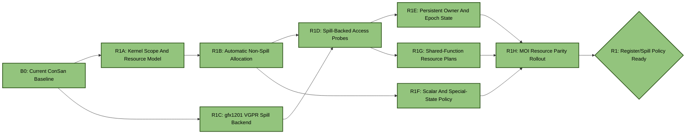
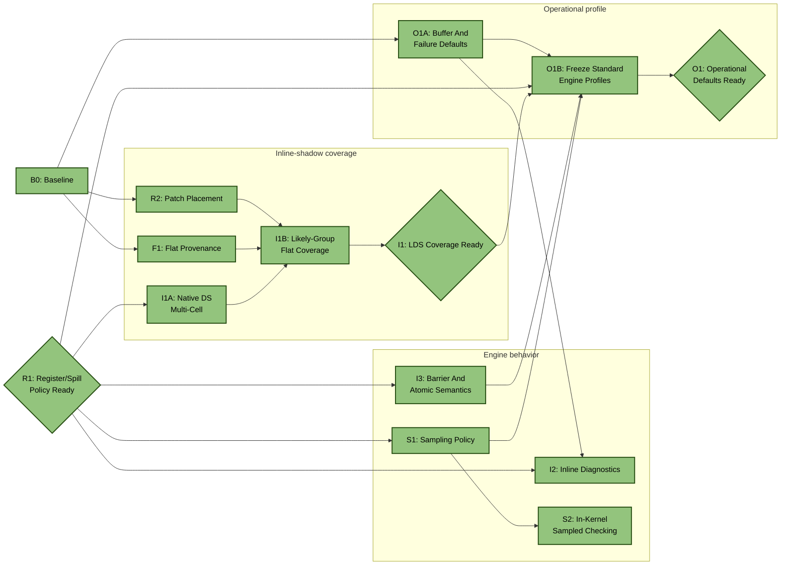
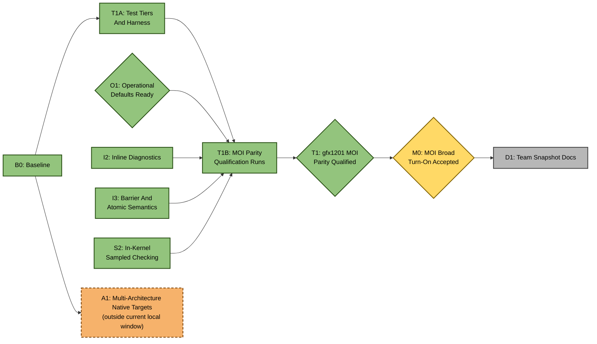
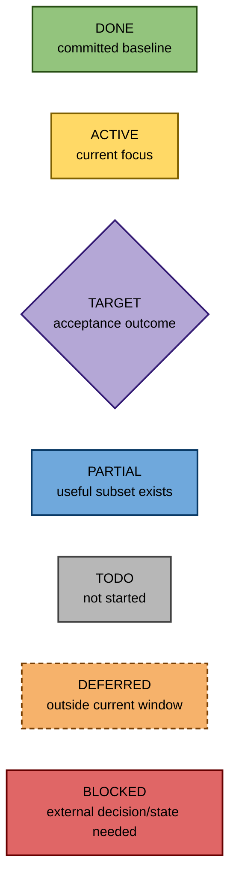

# ConSan Near-Future Plan

This plan starts from the current ConSan prototype state and intentionally
omits completed-session history. Use it as the forward DAG for the next phase
of rocJITsu DBI sanitizer work.

[DESIGN.md](DESIGN.md) describes what exists now and where that differs from
the intended architecture. [SPILLING.md](SPILLING.md) documents the R1 resource
path as a deliverable in its own right. This file describes the open lines of
work from here.

## Status Legend

- `DONE`: baseline work already exists and is committed.
- `ACTIVE`: recommended current focus.
- `TARGET`: current program outcome, reached only through its incoming edges.
- `TODO`: not started in this plan.
- `PARTIAL`: useful committed subset exists, with remaining work listed.
- `DEFERRED`: intentionally outside the current execution window.
- `BLOCKED`: cannot proceed without external state or a design decision.

Project rules:

- Commit at least once per meaningful 30-60 minute work slice.
- Update this file and the Mermaid DAG whenever a node changes status.
- Do not create `SESSION*.md` files.
- Test frequently. Use focused rocJITsu tests first, then hip-moi and IREE.
- Keep GPU test parallelism around `-j8`.
- Use the workspace TheRock ROCm build for ROCm runtime tests.
- Keep hip-moi as a semantic reference, not as public ConSan terminology.
- Start spilling work from Kunwar Grover's
  `origin/users/Groverkss/text-relocation-land` branch. It contains a reusable
  VGPR allocation/spill-frame pattern and a CDNA3 save/restore emitter. Add
  RDNA4 emission for ConSan's local target, and add minimal ConSan-local SGPR
  spilling only if a current probe truly needs it before shared rocJITsu
  spilling exists.
- Keep spill/cave code prototype-shaped. Broader rocJITsu spilling work may
  replace ConSan-local integration.

## Current Baseline

ConSan currently has two public top-level flavors:

```sh
RJ_CONSAN_FLAVOR=supercollider
RJ_CONSAN_FLAVOR=moi
```

MOI has three engines:

```sh
RJ_CONSAN_MOI_ENGINE=record_replay
RJ_CONSAN_MOI_ENGINE=inline_shadow
RJ_CONSAN_MOI_ENGINE=sampled
```

The useful committed baseline is:

- HSA-tools interception of final native code objects, currently implemented
  and tested on RDNA4 / `gfx1201`.
- SuperCollider-style redundant LDS/likely-group-flat check/trap probes.
- SuperCollider marker-buffer mode for non-trapping mismatch smoke tests.
- MOI report-buffer ABI and HSA-tool-owned auto report buffers.
- MOI `record_replay` dynamic access records, barrier records, host replay,
  sampled reference helpers, and narrow atomic ordering records.
- MOI `sampled` direct sampled watchpoint publication and host-side sampled
  conflict scanning.
- MOI `inline_shadow` direct exact-shadow publication for native dword LDS
  loads/stores, compact inline diagnostics, barrier epoch increments, and a
  narrow one-slot atomic ordering prototype.
- `hw_id` owner-source experiments for owner/epoch prologue initialization.
- Focused rocJITsu HIP GPU tests and IREE RDNA4 / `gfx1201` TileAndFuse smoke
  coverage.
- Intended architecture set: `gfx942`, `gfx950`, `gfx1201`, and `gfx1250`.
  The current gfx1201 focus is incidental to local hardware availability.

## DAG Overview

The DAG is drawn in three panels to avoid long arrows crossing unrelated
tracks. Repeated boundary nodes such as `B0`, `R1`, `O1`, `I2`, `I3`, and `S2`
refer to the same work item, not duplicate work. The union of the three panels
is the project DAG, and every solid arrow retains the prerequisite meaning
defined below.

### R1 resource path



### Feature closure after R1



### Qualification, acceptance, and deferred target breadth



### Color legend



## Recommended Execution Order

Every arrow is a hard execution prerequisite: `A --> B` means the remaining
scope of `B` should not start until `A` is complete. An arrow does not mean
"contains", "is related to", or merely "would be nice to do first". Diamonds
are completion or acceptance milestones; work flows into them, never out of
them as though the milestone created its prerequisites.

The current autonomous priority order within that DAG is:

1. `R1` is complete: access, barrier, and atomic probes use the common
   resource policy, and the gfx1201 profiles have been qualified without
   register-number configuration.
2. Advance `I1A`, `I2`, `I3`, and `S1` as independent feature
   branches. `I1B` additionally waits for `F1`, and `S2` waits for `S1`.
3. `R2`, `F1`, and `T1A` are already ready from the baseline and can be
   taken in bounded slices when they unblock the main path. Freeze profiles in
   `O1B` only after the engine behavior and automatic resource choices named
   by its incoming edges are stable.
4. Run `T1B` only when the standard profiles, placement, diagnostics, ordering,
   and sampled checking paths are ready. Passing it reaches the `T1` parity
   milestone and permits the final `M0` broad-turn-on acceptance review.
5. Refresh the durable team snapshot in `D1` after `M0` is accepted.

`A1` remains in the full project DAG, but it is intentionally outside the
current local execution window while only `gfx1201` hardware is available. Its
only incoming edge is the existing baseline; it neither gates nor is gated by
the gfx1201 `M0` path.

The most important design dependency, `R1`, is now complete. Direct-kernel and
shared-helper access, barrier, and atomic probes have automatic ephemeral,
persistent, scalar, and spill-backed resources. Subsequent nodes build feature
coverage and operational behavior on that boundary.

## M0: MOI Broad Turn-On Readiness - TARGET

Goal: remove the remaining reasons why MOI cannot be run over the same broad
test corpus as SuperCollider with only a top-level flavor and engine choice.

Position in the DAG: `M0` is the acceptance milestone at the end of the
gfx1201 readiness path, not an umbrella parent at its beginning. The
implementation and qualification work below must converge at `T1` before this
milestone can be accepted. `A1` tracks later native-target breadth separately
and is not part of this local acceptance gate.

Target operator experience:

```sh
HSA_TOOLS_LIB=/path/to/librocjitsu_dbi_hooks.so \
RJ_CONSAN_FLAVOR=moi \
RJ_CONSAN_MOI_ENGINE=record_replay|inline_shadow|sampled \
ctest ...
```

Engine choice should stay explicit. The work here is to eliminate the extra
per-test prototype knobs that currently make MOI feel like a collection of
targeted experiments.

Current state:

- `record_replay`, `sampled`, and `inline_shadow` have each passed the 209-test
  local IREE e2e compatibility sweep without register-number configuration.
- Guarded TileAndFuse plus scan/softmax regressions pass under every engine,
  but `inline_shadow` still has narrower instruction and diagnostic coverage.
- The independent hip-moi semantic control suite passes 189/189; broader
  ConSan feature/non-vacuity qualification remains in `T1`.
- Per-engine report buffers now have lazy defaults and visible overflow;
  stable engine profiles are still pending.

The primary technical dependency for broad MOI operation, `R1`, is complete.
The other gaps below still matter: a clean compatibility run proves
non-corruption for patched supported sites, not full instruction coverage or
diagnostic quality.

Blocking reasons to close:

- HSA-tool-owned report buffers do not yet have robust per-engine default
  capacities and overflow reporting.
- MOI has engine-specific recipes instead of stable profiles.
- `inline_shadow` instruction coverage is narrower than `record_replay` and
  `sampled`.
- Patch placement is not yet stress-tested for broad multi-probe MOI growth.
- Flat/generic LDS provenance is still partly heuristic.
- Barrier and atomic ordering are present but narrow.
- Inline diagnostics are bounded first-N records with range, owner, epoch,
  instruction, and current conflict-lane evidence.
- Sampled mode lacks runtime sampling/generation policy and in-kernel checking.
- The test matrix does not yet require MOI parity with SuperCollider.

Non-gfx1201 architecture dispatch remains an important project gap, but it is
tracked by the deliberately deferred `A1` branch rather than being presented
as a blocker for gfx1201 `M0` acceptance.

Work:

- Keep this section synchronized with `DESIGN.md`'s "MOI Broad Enablement Gap".
- As each blocker moves to a dedicated implementation node, record that
  dependency here instead of leaving it implicit.
- Accept `O1`'s standard MOI command profile for each engine. Explicit debug
  knobs may remain, but should not be required for ordinary corpus runs.
- Treat a broad corpus hang, timeout, or silent no-record run as a product bug,
  not just a test inconvenience.

Done criteria:

- `record_replay`, `sampled`, and `inline_shadow` each have one documented
  standard run recipe.
- Those recipes avoid hand-picking registers for ordinary corpus runs.
- The standard recipes pass focused rocJITsu tests, hip-moi controls, selected
  IREE LDS-heavy tests, and the broader IREE e2e compatibility tier on
  `gfx1201`.
- Unsupported code objects fail or skip with clear logs; they do not hang and
  do not look like successful instrumentation.
- `DESIGN.md`, `USAGE.md`, `TUTORIAL.md`, and local testing notes agree on the
  readiness level of each MOI engine.

## R1: Register And Spill Policy - DONE

Goal: give every ConSan probe a documented, testable way to acquire temporary
registers and persistent sanitizer state without relying on caller-chosen
register numbers or clobbering application state.

Landed state:

- MOI access, barrier, and atomic probes request scratch through one owner-aware
  planner: explicit debug override, liveness-dead window, fresh
  descriptor-backed growth, spill-preserved live window, or typed unsupported
  result.
- Inline owner/epoch state is automatically placed in dedicated VGPRs or a
  derived-owner/private-epoch representation. Scalar windows are automatic and
  preserve EXEC, VCC, and SCC; general SGPR spilling remains deliberately out
  of scope and full pressure fails closed.
- Reachable shared functions use the union of owner liveness and one compatible
  register/private layout. All owning descriptors change; unrelated
  descriptors do not.
- The gfx1201 backend emits address-free B32 scratch save/fill sequences,
  updates descriptors and metadata, and raises AQL dispatch private size even
  for kernels compiled with zero private bytes.
- Bounded summaries report explicit, dead, descriptor-growth, spill, and
  unsupported plans, site kind and typed reason, owner names, and
  planned/emitted spill bytes.
- Kunwar Grover's `origin/users/Groverkss/text-relocation-land` branch supplied
  the allocator/spill-frame direction and the `SpillManager` starting point.
  ConSan added the gfx1201 emitter, owner analysis, descriptor/dispatch
  transaction, and tests; [SPILLING.md](SPILLING.md) records the boundary.
- Qualification is 172/172 focused synthetic/unit tests, 29/29 live rocJITsu
  tests, 189/189 hip-moi controls, guarded TileAndFuse and scan/softmax tests,
  and 209/209 broad IREE compatibility under each MOI engine.

Current MOI resource demand, before any future probe simplification:

| Probe family | Ephemeral VGPR window | Other state |
| --- | ---: | --- |
| Record/replay access | 3 static-site; 6 dynamic | Dynamic append uses an EXEC-save pair, a VCC-save pair, and one SCC snapshot SGPR. |
| Sampled access | 5 | No persistent owner/epoch requirement in the current direct publication path. |
| Inline shadow | 7 | Persistent owner and optional epoch VGPRs; diagnostic paths use four EXEC-save pairs, one VCC-save pair, and one SCC snapshot SGPR. |
| Barrier record / inline barrier | 6 for a record | Record mode uses the five-SGPR EXEC/VCC/SCC window; inline mode updates persistent epoch state. |
| Atomic record / inline atomic | 3 | Inline acquire uses the eleven-SGPR nested EXEC/VCC/SCC window and owner/epoch state. |

The distinction between ephemeral and persistent state is important. A
site-local spill lease can safely borrow a live VGPR around one probe, but it
cannot hold owner or epoch state across the kernel. Persistent state needs a
dedicated descriptor-backed register or a private-memory representation that
is materialized at each probe.

Minimum spilling capability required for the current gfx1201 parity push:

- Spill only ordinary contiguous VGPR windows used as ephemeral probe scratch.
  The current windows are 3, 5, 6, 7, 8, or 9 dwords wide.
- Use address-free gfx1201 `scratch_store_b32` / `scratch_load_b32` first. They
  are 96-bit VSCRATCH instructions with a signed 24-bit immediate and need no
  address VGPR, kernarg payload, or new SGPR. Wider B64/B96/B128 forms are an
  optimization after the dword path is proven.
- Save under the original EXEC mask, preserve the original instruction, and
  restore the same active lanes before returning. Use `s_wait_storecnt 0` and
  `s_wait_loadcnt 0` according to the gfx1201 counter model.
- Append spill slots above each owning kernel's existing
  `private_segment_fixed_size`, set the descriptor private-segment enable bit,
  and reject a last dword offset outside the signed 24-bit positive range.
- Start with candidates directly owned by a kernel descriptor and the current
  appended-cave placement path. Shared functions and scalar preservation are
  separate nodes below.

The first spill slice does not require AccVGPR spilling, arbitrary whole-live-
set preservation, general SGPR spilling, kernarg extension, sidecars, virtual
LDS, cross-ISA translation, or any `A1` work.

Dependencies:

- `origin/users/Groverkss/text-relocation-land` is the first implementation
  reference for allocation policy, spill frames, save/restore emission,
  descriptor feedback, and kernel-local relocation.
- `origin/users/Groverkss/dbt-tooling` remains useful context for earlier DBT
  utilities.
- Existing `LivenessAnalysis`, `SpillManager`, `CodeObjectPatcher`, and kernel
  descriptor helpers are the local primitives to extend or share.
- `R2` owns the general placement cleanup. R1 may use the existing appended
  cave path for its first forced-spill probe, but must account for the larger
  save/probe/restore sequence in placement and branch-range checks.

Reuse boundary:

| Component | R1 action | Reason |
| --- | --- | --- |
| Mainline `LivenessAnalysis` | Reuse; port Kunwar's aligned-run and filtered-snapshot refinements as isolated changes. | The kernel-scoped dataflow and SGPR/VGPR queries already exist locally. |
| Mainline DBT kernel-scope/call-edge helpers | Factor into shared analysis code or expose a narrow API. | They already compute reachable per-kernel blocks and context-sensitive call/return liveness edges; ConSan currently does not use them. |
| Kunwar `SemanticScratchRequest`, lease, failure, and victim-selection policy | Adapt into a DBT/DBI-neutral allocator. | The policy is useful, but the current code is coupled to DBT `TranslationContext`. |
| Mainline `SpillManager` | Reuse for stable per-register dword slots in the first backend. | It already handles aligned growth, capacity, rollback, and descriptor high-water accounting. Emit B32 operations so slot contiguity is not assumed. |
| Kunwar `SemanticSpillFrame` | Defer unless persistent or simultaneous anonymous ranges require it. | Reusing stable B32 slots is a smaller first integration; transient-frame reuse and wide operations can follow without blocking correctness. |
| Kunwar `Cdna3ScratchEmitter` | Use as an interface and testing pattern only. | Its encodings, offset limit, and wait instruction are wrong for gfx1201. |
| Mainline `CodeObjectPatcher` and descriptor helpers | Reuse and extend narrowly for per-kernel private size/enablement. | ConSan already commits modified text transactionally through a private patcher copy. |
| Kunwar binary-translator, kernarg, sidecar, virtual-LDS, and broad relocation changes | Do not import for R1. | They solve translation or persistent-runtime-payload problems not needed by the first ConSan spill path. |

Do not cherry-pick Kunwar's branch wholesale. Its useful scratch work is part of
a much larger DBT commit. Port or factor the small allocator/liveness pieces,
write the gfx1201 emitter locally, and keep each change independently testable.

Allocation policy:

- Plan resources per kernel before mutating code-object bytes. A plan must name
  each register window, forbidden operand/state ranges, preservation strategy,
  private-memory offsets, descriptor changes, and placement size.
- Keep explicit environment-selected registers as debug overrides. Validate
  them through the same planner instead of bypassing safety checks.
- For ephemeral VGPR windows, try in this order:
  1. a liveness-dead window inside the existing allocation;
  2. a fresh descriptor-backed window above every guest register reference;
  3. an allowed live window saved and restored through per-lane private memory;
  4. a visible unsupported/failure result when none is legal.
- Treat descriptor growth as resource allocation, not as proof that an
  existing guest register is dead.
- For owner/epoch state, prefer dedicated registers above all guest references.
  If the register file has no persistent window, store the state in persistent
  per-lane private slots and load/store it around probes; never borrow a
  site-local live register across unrelated instructions.
- For temporary SGPRs, first use kernel-scoped liveness and safe
  descriptor-backed growth. Do not build general SGPR spilling speculatively.
  If real parity tests still require it, add only the smallest save/fill path
  needed by the blocking probe and account explicitly for EXEC, VCC, SCC, and
  lane-selection constraints.
- Initially skip spill-backed function candidates whose owning kernel set is
  ambiguous. Log the reason instead of patching a descriptor-incompatible
  shared function.

R1 is split below into independently completable nodes. `R1A` unlocks `R1B`,
while the ISA-local `R1C` backend can be built directly from the baseline.
`R1B` and `R1C` converge at the completed `R1D` spill-backed vertical slice.
Persistent state (`R1E`) and shared functions (`R1G`) require that slice;
scalar allocation (`R1F`) needs only the resource model and non-spill
allocator. `R1H` integrates the completed paths, and only then is the `R1`
milestone reached. This ordering is also encoded literally in the DAG.

Correctness requirements:

- Save before the borrowed value can be clobbered and restore before every
  fallthrough/return edge from the probe.
- Preserve original memory-access behavior and required EXEC/VCC/SCC state.
- Model scratch load/store wait-counter effects; do not reuse a victim before
  its save completes or return to guest code before its restore completes.
- Update only descriptors for kernels that can execute the spill-backed probe,
  including private-segment size and enablement.
- Reject unencodable scratch offsets, private-segment overflow, missing flat
  scratch initialization, ambiguous shared-function ownership, and placement
  failure with a specific diagnostic.
- Commit code bytes, placement, and descriptors as one transaction so a failed
  plan cannot leave a partially modified code object.
- Keep the integration replaceable by shared rocJITsu scratch infrastructure;
  factor generally useful allocator/emitter pieces instead of cloning them
  inside each ConSan engine.

Done criteria:

- A future ConSan probe author can request scratch resources through one policy
  path instead of open-coding env-var register choices.
- Existing explicit knobs still work for targeted debugging.
- Record/replay and sampled standard recipes run without hand-picking registers
  on the broad `gfx1201` compatibility tier, including a test that forces the
  VGPR spill tier.
- Inline shadow runs its targeted tier without hand-picked scratch, owner,
  epoch, or SGPR registers before it is promoted to the broad tier.
- Spill-backed probes preserve a deliberately live victim value and produce the
  same application result as an uninstrumented control.
- Descriptor tests prove that only owning kernels receive the required VGPR,
  SGPR, and private-segment changes.
- Allocation and spill failures are distinguishable from "no race found" and
  from "no supported site found" in logs and guards.
- The docs clearly state whether ConSan is using Kunwar-style VGPR spilling,
  ConSan-local SGPR spilling, or still falling back to explicit registers for a
  given probe family.

Validation order:

- Unit-test allocation precedence, alignment, forbidden ranges, transient and
  persistent slot separation, offset limits, descriptor growth, and rollback.
- Add instruction-builder/decode tests for RDNA4 spill/fill encodings and wait
  sequences.
- Add synthetic patch-shape tests for dead, fresh, forced-spill, and failure
  plans, including multi-kernel and shared-function code objects.
- Add a focused HIP test whose victim VGPR is live across the instrumented LDS
  access and verify both the application output and ConSan report.
- Run focused rocJITsu tests, hip-moi controls, IREE TileAndFuse, and then the
  broad IREE e2e tier for each engine. Keep GPU test parallelism around `8` and
  use timeouts for inline-shadow triage.

Focused build and unit-test entry point:

```sh
cmake --build emulation/rocjitsu/build --target rocjitsu_tests rocjitsu_dbi_hooks

ROCM_PATH=/path/to/rocm HIP_PATH=/path/to/rocm \
LD_LIBRARY_PATH=/path/to/rocm/lib \
emulation/rocjitsu/build/tests/rocjitsu_tests \
  '--gtest_filter=ConSan.*:ConSanMoi.*:InstructionBuilder.*:SpillManager.*:LivenessAnalysis.*'
```

## R1A: Kernel Scope And Resource Model - DONE

Goal: give ConSan a read-only, per-kernel analysis model that can answer which
descriptor owns a site, which registers are live there, and which resource
changes a proposed probe would require before any bytes are modified.

Work:

- Extract or expose the current DBT helpers for reachable kernel blocks and
  scoped call/return liveness edges instead of rebuilding a weaker ConSan-only
  CFG walk.
- Decode the code object once and construct one `LivenessAnalysis` per kernel
  scope. Port Kunwar's aligned VGPR-run query and filtered instruction snapshot
  option as small independent liveness changes.
- Map each direct kernel candidate to its instruction, kernel descriptor,
  descriptor VGPR/SGPR allocation, maximum referenced registers, original
  private size, and reachable function set.
- Introduce a resource-plan result that distinguishes explicit override,
  liveness-dead, descriptor-grown, spill-required, and unsupported outcomes.
  Include forbidden register ranges, required descriptor counts, spill width,
  and a reason code.
- Keep planning read-only. Probe construction and ELF mutation must consume a
  completed plan rather than recomputing ownership or register choices.
- Record all kernel owners for function blocks, but do not automatically patch
  shared-function candidates until `R1G`.

Done criteria:

- Synthetic single-kernel, multi-kernel, direct-call, and shared-helper tests
  produce the expected kernel scopes and instruction-level liveness.
- A direct MOI candidate receives exactly one owning descriptor and a typed
  resource outcome without changing the input ELF.
- An ambiguous or unreachable function candidate is reported explicitly.
- Existing DBT liveness and relocation tests remain unchanged in behavior.

## R1B: Automatic Non-Spill Allocation - DONE

Goal: eliminate manual scratch-register choices whenever a probe can use dead
or genuinely new descriptor-backed registers.

Work:

- Adapt Kunwar's scratch request/lease/victim policy into a DBT/DBI-neutral
  allocator. Keep register count, alignment, forbidden set, allocation source,
  and optional preferred base explicit in the request/result.
- Search liveness-dead windows inside the current descriptor allocation first.
  Then search a fresh window above all guest references and grow only the owning
  descriptor when the architecture permits it.
- Validate explicit env overrides through the same forbidden-range and
  descriptor checks. Overrides remain debugging controls, not a safety bypass.
- Replace the global `ConSanOptions::scratch_vgpr` assumption in probe builders
  with a per-site resource lease, while retaining a compatibility path for
  existing tests.
- Integrate static record/replay access probes first, then sampled access
  probes. Multiple sites may choose different windows; descriptor growth is the
  per-kernel maximum of their plans.
- Keep spill-required sites unmodified with a typed reason until `R1D`.

Done criteria:

- Unit tests cover existing-allocation, descriptor-growth, forbidden-overlap,
  alignment, full-register-file, and explicit-override cases.
- Record/replay and sampled targeted runs no longer need `RJ_CONSAN_TMP_VGPR`
  when dead or fresh registers exist.
- Only descriptors owning selected sites grow; unrelated kernels remain
  byte-for-byte unchanged.
- A 256-VGPR site returns `spill-required` rather than selecting an unproven
  high register or pretending that descriptor growth succeeded.

## R1C: gfx1201 VGPR Spill Backend - DONE

Goal: provide a standalone, tested backend that can preserve an ordinary VGPR
window through per-lane private scratch on the local gfx1201 target.

Work:

- Add gfx1201 builders for address-free `scratch_store_b32` and
  `scratch_load_b32`, plus `s_wait_storecnt 0` and `s_wait_loadcnt 0`. Validate
  their 96-bit encodings against LLVM assembly and rocJITsu decoding.
- Define the positive signed-24-bit offset policy and reject a spill whose last
  dword is unencodable.
- Use `SpillManager` to allocate stable dword slots above the original private
  segment. Emit one B32 operation per lease register initially so correctness
  does not depend on slot contiguity.
- Emit save and restore batches under the caller-provided EXEC state. The save
  batch must complete before its slots are reused; the restore batch must
  complete before guest code resumes.
- Start with conservative zero-threshold waits and document that they also
  drain older wave stores/loads. If that perturbation becomes material, change
  the schedule only with an ISA-backed same-address scratch ordering test.
- Add a narrow per-kernel descriptor helper that raises
  `private_segment_fixed_size`, enables the private segment, preserves all
  unrelated fields, and works for kernels whose original private size is zero
  or nonzero.
- Keep the emitter independent of MOI record layouts and probe semantics.
  B64/B96/B128 coalescing is a later optimization after B32 correctness and
  hardware execution are proven.
- Detect kernels that use a dynamic private stack when metadata exposes it and
  skip them in the first backend until appending a fixed spill zone is proven
  not to overlap their stack convention.

Done criteria:

- Encoding/decode tests cover several VGPRs and offsets, including the maximum
  accepted dword and the first rejected offset.
- Spill-layout tests cover zero and nonzero original private sizes, stable
  offsets, capacity failure, and rollback.
- Descriptor tests prove private-size growth and enablement without changing
  register counts, entry offsets, or unrelated kernels.
- A focused gfx1201 hardware smoke saves a deliberately live VGPR, clobbers it,
  restores it, and produces the uninstrumented result.

## R1D: Spill-Backed Access Probes - DONE

Goal: land one complete ConSan vertical slice that uses `R1A`/`R1B` planning and
`R1C` preservation when no dead or fresh VGPR window exists.

Work:

- Start with the three-VGPR static record/replay access probe. Add sampled's
  five-VGPR window only after the first slice passes hardware tests.
- Select a contiguous victim window inside the allocated VGPR file that avoids
  the anchor instruction's full `InstDefUse` set and all persistent ConSan
  state. Save the whole window for the first implementation.
- Build one transaction in this order: branch to cave, save victim window,
  execute the original access, emit instrumentation, restore victim window,
  return to the original fallthrough.
- Include save/restore bytes in placement preflight. Use the existing appended
  cave path first and report branch-range or cave failures distinctly from
  resource failures.
- Add a test-only force-spill control in `ConSanOptions`; do not add a public env
  knob unless hardware triage genuinely needs one.
- Initially accept only direct kernel candidates. Preserve current explicit
  debug behavior for functions, but never apply an automatic spill plan without
  an owning descriptor.
- Use the descriptor-full IREE scan kernel as the first real pressure case with
  a timeout and process-cleanup strategy.

Landed boundary:

- Static three-VGPR record/replay and five-VGPR sampled probes both consume a
  `spill-required` plan for direct kernel sites. Spill sites always use the
  appended-cave transaction: save, derive transient owner state, execute the
  original access, wait for LDS completion, publish the probe result, restore,
  and return.
- The victim window excludes the anchor's full def/use set and explicit
  persistent owner/epoch registers. Spill bytes participate in branch/cave
  preflight, and proof records expose the spill width and resulting private
  size.
- The owning descriptor and its AMDGPU MessagePack metadata grow together.
  Dynamic-stack kernels, ambiguous ownership, unencodable metadata growth, and
  placement failures remain precise non-patching outcomes.
- The HSA hook records the enlarged private size for each patched kernel,
  resolves the loaded kernel object through the executable symbol API, and
  raises that kernel's AQL dispatch-packet `private_segment_size` through an
  AMD queue interceptor. Descriptor, metadata, symbol-query, and dispatch sizes
  therefore agree even for a kernel compiled with zero private bytes.
- The descriptor-full IREE scan pressure test finishes 5/5 under a timeout. Its
  large scan kernel currently stops before allocation because all 640 DS sites
  decode as unsupported access kinds; the log is a precise non-spill blocker
  and the run neither hangs nor borrows high VGPRs silently.

Done criteria:

- Synthetic tests decode the exact save/original/probe/restore/return shape.
- A focused HIP test keeps every victim VGPR live across the patched LDS access
  and verifies application output plus a visible MOI record.
- The descriptor-full scan case either runs correctly with a spill-backed probe
  or fails quickly with a precise non-spill blocker; it must not hang or silently
  clobber `v240+`.
- Record/replay and sampled access probes can reach the spill tier without a
  caller-selected VGPR.

## R1E: Persistent Owner And Epoch State - DONE

Goal: place inline-shadow owner and epoch state safely across an entire kernel,
which cannot be solved by a site-local scratch lease.

Work:

- Prefer a dedicated whole-kernel VGPR pair above every guest reference, grow
  only the owning descriptor, and initialize it in the existing entry prologue.
- For descriptor-full kernels, compare two bounded fallbacks:
  - derive owner at each probe and keep only epoch in persistent private
    storage; or
  - keep both values in persistent private slots and materialize them through
    an ephemeral `R1D` lease at each access.
- Reserve persistent slots separately from ephemeral victim slots. Barrier
  epoch updates and access probes must use the same representation.
- Preserve wave32/wave64 descriptor behavior and keep owner semantics separate
  from the resource-allocation mechanism.
- Do not add shared-function persistent state until `R1G` can require a
  compatible assignment across every owner.

Landed boundary:

- Inline shadow now assigns a common dedicated owner/epoch VGPR pair
  automatically when no explicit pair is supplied. The pair is above every
  direct candidate scope's guest references and planned scratch window;
  scratch planning is then rerun with the pair forbidden.
- The existing entry prologue initializes that pair, including wave32/wave64
  owner derivation, and automatic mode grows and redirects only direct kernels
  that actually receive an inline access/barrier patch. Shared-function sites
  remain excluded until `R1G`.
- Inline access scratch now consumes the common per-site planner, so the live
  racy-access and barrier-ordering tests pass without scratch, owner, or epoch
  register numbers or the explicit prologue-init flag.
- Zero-private forced-spill record/replay and sampled tests pass with the HSA
  queue interceptor raising the patched kernel's dispatch-private size.
- When no whole-kernel pair fits, owner is derived at each access and epoch is
  kept in one aligned per-lane private slot. Entry, access, and barrier caves
  use the same offset; one-register barrier/prologue leases and any access
  spill window start in a separately aligned ephemeral area.
- The descriptor-full forced-spill synthetic uses epoch byte 0 and a seven-VGPR
  lease starting at byte 16, grows private size to 44 bytes, and validates the
  save/load/update/store/restore shapes. A gfx1201 live control exercises the
  zero-private private-epoch entry/access/barrier path and its AQL dispatch
  growth without register-number knobs.

Done criteria:

- Inline shadow targeted tests run without explicit owner or epoch VGPRs on
  kernels with spare descriptor capacity.
- A descriptor-full synthetic kernel initializes, reads, updates, and reuses
  private-backed epoch state without corrupting an ephemeral spill lease.
- Barrier tests prove that the chosen epoch representation advances and is
  observed by subsequent access probes.

## R1F: Scalar And Special-State Policy - DONE

Goal: remove manual SGPR windows while preserving EXEC, VCC, SCC, and other
special state required by dynamic record, barrier, diagnostic, and atomic
probes.

Current demand:

- Dynamic record/replay and barrier records need one EXEC-save SGPR pair.
- Inline diagnostics and inline atomic acquire can use up to four temporary
  SGPR pairs.
- The `hw_id` owner source needs one scalar temporary in the entry prologue.

Work:

- First allocate liveness-dead or genuinely fresh descriptor-backed SGPRs per
  kernel. Keep even-pair and architectural SGPR limits in the request.
- Audit every affected probe for EXEC, VCC, and SCC effects. Liveness does not
  model those registers, so preservation must be explicit in the probe plan.
- Keep the basic record/replay, sampled, and inline-shadow paths independent of
  this node where they do not need scalar temporaries.
- Add SGPR borrowing only if the descriptor-full corpus proves it necessary.
  The bounded fallback is to use an already preserved VGPR pair to copy a live
  SGPR pair to private scratch, guard EXEC-zero, borrow the scalar pair, restore
  EXEC, reload through VGPRs, and `v_readfirstlane_b32` the original scalar
  values before restoring the VGPR lease.
- Do not generalize that fallback into an arbitrary SGPR stack unless more than
  one current probe family actually needs it.

Landed boundary:

- Direct-kernel resource contexts record descriptor and maximum referenced
  SGPR counts. Automatic allocation places a fresh even scalar window above
  guest references and grows only descriptors that own an emitted probe.
- Dynamic access and barrier-record probes use five SGPRs: the original EXEC
  pair, an original VCC pair, and a Boolean SCC snapshot. Inline diagnostics
  and atomic acquire use eleven SGPRs: four nested EXEC pairs, VCC, and SCC.
- VCC is preserved with scalar `s_mov_b64`, so restoration does not depend on
  an active lane. SCC is captured before instrumentation with `s_cselect_b32`
  and restored last with `s_cmp_lg_u32`; the same sequence works for wave32,
  wave64, and an empty incoming EXEC mask.
- The `hw_id` owner source receives a separate fresh scalar temporary when no
  explicit debug override is supplied. It participates in the same targeted
  descriptor requirement as the special-state window.
- SGPR, VGPR, and private growth are combined in the pre-relocation descriptor
  transaction. Applying scalar growth after `.text` expansion is forbidden
  because original descriptor file offsets are no longer valid then.
- No SGPR borrow/spill path was needed. A kernel that already references all
  106 normal SGPRs receives a bounded, logged non-patching outcome.

Done criteria:

- Standard dynamic record/barrier and inline diagnostic recipes do not require
  `RJ_CONSAN_MOI_EXEC_SAVE_SGPR` when safe dead or fresh pairs exist.
- Tests cover EXEC-zero, wave32/wave64 masks, nested predicate narrowing, VCC
  restoration, and SCC behavior.
- A descriptor-full scalar failure is visible and bounded; if a borrow path is
  implemented, a deliberately live SGPR pair survives it on hardware.

## R1G: Shared-Function Resource Plans - DONE

Goal: instrument a helper reached by multiple kernels without giving shared
text incompatible register or private-scratch assumptions.

Work:

- Use `R1A` owner sets and per-owner liveness. A dead window must be dead in all
  owner scopes; a fresh window must be legal and descriptor-backed in all
  owners.
- For spill-backed helpers, choose one common immediate spill layout above the
  maximum aligned original private size of all owners, then grow every owning
  descriptor to cover that layout.
- Require one register assignment and one persistent-state representation for
  the shared instruction bytes. Do not emit per-owner assumptions into shared
  text.
- Reject unresolved indirect ownership or incompatible descriptors with a
  specific reason. A clear skip is acceptable until ownership is proven; an
  orphan descriptor update is not.

Landed boundary:

- Resource planning unions the live-before sets of every reachable owner,
  limits dead-window search to the smallest current allocation, and grows a
  fresh window only when it is legal for every owner.
- Spill-backed shared text uses one address-free scratch sequence above the
  maximum original private size. Every owner descriptor and named metadata
  record receives the same sufficient private extent; unrelated kernels do
  not.
- Inline shadow can initialize one persistent owner/epoch pair for every
  owner, or use one common private epoch layout. Workitem-derived private
  owner state is rejected when reachable owners disagree on wave size.
- Staged text growth resolves active descriptors by kernel name before later
  private growth or entry redirection, rather than reusing stale pre-growth
  file offsets.
- Unreachable or indirect helper text remains a typed missing-owner outcome;
  an explicit register override no longer guesses that every descriptor owns
  it.

Done criteria:

- A synthetic two-kernel shared-helper object passes dead, fresh, spill, and
  incompatible-plan tests.
- Every descriptor that can reach a spill-backed helper receives the same
  sufficient private layout, and unrelated descriptors remain unchanged.
- Broad logs distinguish unsupported shared ownership from ordinary
  no-candidate and allocation failures.

## R1H: MOI Resource Parity Rollout - DONE

Goal: integrate the completed R1 resource paths into standard MOI profiles and
demonstrate that register configuration is no longer the reason MOI trails
SuperCollider on real gfx1201 workloads.

Work:

- Add bounded result counters for explicit, dead, descriptor-grown, spilled,
  and unsupported plans, including spill bytes and owning kernel names when
  logging is enabled.
- Move record/replay, sampled, inline-shadow access, barrier, and atomic probes
  through the common planner in that order. Remove duplicated global descriptor
  growth and overlap checks as each family migrates.
- Coordinate with `O1`: standard profiles choose behavior, while register env
  variables remain optional debug overrides.
- Run focused rocJITsu tests, hip-moi controls, IREE TileAndFuse, the scan and
  softmax regressions, and then broad IREE e2e for every engine with GPU
  parallelism around `8` and explicit timeouts.
- Create `SPILLING.md` alongside `DESIGN.md` as the durable guide to the R1
  deliverable. Document the allocator hierarchy, private-segment spill layout,
  descriptor and text-patch transaction, direct- and shared-function ownership,
  supported failure boundaries, and the tests that protect each layer. Credit
  Kunwar Grover and his `origin/users/Groverkss/text-relocation-land` branch as
  the implementation starting point, while distinguishing the allocation and
  spill-frame ideas adapted from that branch from the new gfx1201 emitter and
  ConSan integration. Cross-reference the guide from `DESIGN.md`, `USAGE.md`,
  `TUTORIAL.md`, `LOCAL_TESTING.md`, and this plan.
- Update `DESIGN.md`, `USAGE.md`, `TUTORIAL.md`, and `LOCAL_TESTING.md` as each
  engine stops requiring manual registers. Keep unsupported shared or scalar
  cases explicit until their nodes are complete.

Done criteria:

- Standard record/replay, sampled, and targeted inline-shadow commands contain
  no scratch, owner, epoch, or SGPR register numbers.
- The broad gfx1201 compatibility tier finishes without a resource-induced hang
  and includes at least one observed spill-backed patch.
- Guards distinguish no candidate, unsupported candidate, allocation failure,
  spill/descriptor failure, successful instrumentation, and race diagnostics.
- `SPILLING.md` is complete, cross-linked, and accurately attributes the
  branch on which the initial implementation work was based.
- Remaining MOI parity gaps belong to other named DAG nodes rather than hidden
  manual-register assumptions.

Landed evidence:

- Commit `f604bc118b` moves access, barrier, atomic-record, and inline-atomic
  probes through the common planner and adds bounded resource summaries.
- Standard record/replay, sampled, and targeted inline-shadow recipes contain
  no scratch, owner, epoch, or SGPR numbers; live forced-spill tests prove
  preservation and dispatch-private growth.
- Focused tests pass 172/172, the live resource/behavior tier 29/29, hip-moi controls
  189/189, and the 209-test IREE compatibility tier under every engine. Guarded
  TileAndFuse and scan/softmax regressions pass without resource-induced hangs.
- [SPILLING.md](SPILLING.md) is the cross-linked durable R1 guide and credits
  Kunwar Grover's branch while separating reused ideas from new gfx1201 work.

## O1: MOI Operational Defaults - DONE

Goal: make MOI command lines stable and short enough for routine use.

Current state:

- Relevant code objects lazily receive 64 KiB record/replay or sampled buffers
  and 256 KiB inline-shadow buffers unless explicitly overridden or disabled.
- Some guards are useful for proving instrumentation happened:
  `RJ_CONSAN_REQUIRE_PATCH=1`, `RJ_CONSAN_MOI_REQUIRE_RECORDS=1`,
  `RJ_CONSAN_MOI_REQUIRE_DIAGNOSTICS=1`, and
  `RJ_CONSAN_MOI_FORBID_DIAGNOSTICS=1`.
- Dropped access, barrier, atomic, and diagnostic records are always reported;
  `RJ_CONSAN_MOI_FORBID_OVERFLOW=1` turns them into a teardown failure.

Dependency split:

- `O1A` is complete. It owns report-buffer sizing, overflow visibility, and the
  distinction between ordinary runs and instrumentation-proof guards.
- `O1B` freezes the user-facing engine profiles. It waits for `O1A`, automatic
  resources (`R1`), complete inline LDS coverage (`I1`), stable inline ordering
  behavior (`I3`), and the runtime sampling policy (`S1`) so it does not
  standardize knobs that the implementation immediately changes.
- Completing `O1B` reaches the `O1` milestone because all of `O1A` is already
  an incoming prerequisite.

### O1A: Buffer And Failure Defaults - DONE

Work:

- Add per-engine default auto-buffer sizing when
  `RJ_CONSAN_FLAVOR=moi` is selected and the user did not provide a report
  buffer.
- Prefer capacity estimates derived from candidate counts where practical.
- Make buffer overflow visible in logs, guards, and diagnostics.
- Separate "prove instrumentation happened" guards from ordinary compatibility
  runs so teammates know when to use each.
- Keep explicit per-test timeouts and failure-triage guidance in the local
  runbook.

Done criteria:

- A teammate can run each MOI engine without a buffer-size knob for ordinary
  tier0 and tier1 tests.
- Default buffer sizes are conservative enough for those tiers, and overflows
  are reported as overflows.
- Guarded demo recipes remain available but are clearly optional.

Landed evidence:

- Missing size variables select 64 KiB record/replay and sampled defaults or a
  256 KiB inline-shadow default; an explicit size overrides and explicit zero
  disables automatic allocation.
- A read-only MOI inventory pass avoids allocating buffers for unrelated code
  objects. Overflow counts are printed unconditionally, and
  `RJ_CONSAN_MOI_FORBID_OVERFLOW=1` is the strict guard.
- The deliberate 144-byte dynamic-record test proves visible overflow. The
  172 focused tests and 29 live gfx1201 resource/behavior tests pass, and all
  three 209-test IREE sweeps pass without a buffer-size variable.

### O1B: Freeze Standard Engine Profiles - DONE

Work:

- Define standard engine profiles:
  - `record_replay`: reference/debug, host replay enabled, enough records for
    ordinary compatibility sweeps.
  - `sampled`: low-overhead profile with deterministic sampling knobs only when
    the user asks for reproducibility.
  - `inline_shadow`: exact profile with automatic owner/epoch/scratch once R1
    is ready.
- Keep explicit env overrides for debugging.

Done criteria:

- A teammate can run each MOI engine with `RJ_CONSAN_FLAVOR=moi` plus
  `RJ_CONSAN_MOI_ENGINE=...` and no resource-selection or buffer-size knobs for
  ordinary tests.
- Each profile corresponds to the stable engine behavior named by its DAG
  prerequisites; explicit overrides remain debugging controls.

Landed state and evidence:

- Hook startup identifies the frozen `standard-v1` profile. It keeps the
  already-qualified conservative composition: one access site by default,
  lazy 64/64/256 KiB buffers, automatic register resources, teardown replay or
  scan, and explicit opt-in for dynamic records, ordering probes, immediate
  sampled checking, or broader patch counts.
- An attempted profile that silently enabled every synchronization and dynamic
  path failed 13 of 37 live tests, including narrow-layout crashes. It was
  rejected rather than standardized; those independently qualified features
  remain explicit because they alter buffer partitioning and patch composition.
- With only flavor and engine selection, each profile passes all five guarded
  IREE TileAndFuse output tests. The full 37-test live feature tier passes with
  the documented explicit controls used to exercise advanced behavior.

## A1: Multi-Architecture Native Targets - DEFERRED

Goal: make ConSan's current gfx1201 focus an implementation detail, not an
implicit design limit.

This branch is deliberately outside the current autonomous execution window.
It resumes when suitable non-gfx1201 hardware or an explicitly requested
synthetic-only slice is available; it does not gate gfx1201 `M0`.

Current state:

- Local development and GPU validation use RDNA4 / `gfx1201`.
- Many probe builders and tests are RDNA4-specific, especially VFLAT, barrier,
  `HW_ID1`, and owner-source code.
- The intended native target set is `gfx942`, `gfx950`, `gfx1201`, and
  `gfx1250`.
- ConSan should instrument native code for the running GPU. It should not rely
  on rocJITsu translation between architectures for sanitizer correctness.

Work:

- Inventory every architecture-specific encoder and decode assumption used by
  ConSan.
- Split current implementation notes into `gfx1201` specifics versus truly
  architecture-independent ConSan concepts.
- Add architecture capability checks for probe families: native DS, flat/VFLAT,
  barriers, atomics, `HW_ID` owner source, and TTMP launch payload reads.
- Decide the first non-gfx1201 bring-up target from `gfx942`, `gfx950`, and
  `gfx1250` based on available hardware, code-object samples, and ISA encoder
  readiness.
- Keep tests explicit about whether they require local hardware, only
  code-object patching, or synthetic instruction encoding.

Done criteria:

- `DESIGN.md` and `USAGE.md` name which ConSan features are available per
  target architecture.
- Probe selection fails clearly when a target ISA lacks an implemented encoder
  rather than silently assuming RDNA4.
- At least one non-gfx1201 code-object or synthetic patch test exercises the
  architecture dispatch path.

## R2: Patch Placement And Caves - DONE

Goal: make patch placement robust enough that coverage growth is not blocked by
small inline space or local-cave fragility.

Landed state:

- SuperCollider supports inline padding, local NOP caves, and appended `.text`
  caves for selected cases.
- MOI record/replay and inline-shadow also use trampoline placement, including
  appended caves for compact IREE TileAndFuse kernels.
- A shared `DbiPatchPlacementPlanner` now models inline, local-cave, and
  appended-cave reservations with explicit anchor/body/return coordinates.
  Inline-shadow, sampled, and record/replay access probes plus MOI barrier and
  atomic synchronization probes consume it. SuperCollider's native LDS and
  likely-group flat check/trap probes use the same planner, including when the
  native and flat passes compose in one code object.
- Planning is transactional: failed overlap or branch-reachability checks do
  not reserve space, return branches are part of cave reservations, and every
  emitted appended cave verifies that its planned text offset is still current.
- Focused coverage includes multiple appended probes in one growing text
  section, inline/local/appended preference and overlap handling, branch-limit
  failure, and composed native-LDS plus flat patching.

Work:

- Compare current `trampoline_builder`, `kernel_text_layout`, and
  `code_object_patcher` behavior against Kunwar's DBT branches.
- Identify which cave-placement utilities should become shared DBI
  infrastructure instead of ConSan-local logic.
- Add placement tests for multiple probes in one code object when text grows.
- Keep offset mapping explicit when composing native DS and flat/VFLAT passes.

Done criteria:

- Probe families use a shared placement API for inline/local/appended caves.
- Composed patches either share a valid mapping or fail loudly before emitting
  stale offsets.

Qualification evidence:

- `rocjitsu_tests --gtest_filter=ConSan.*:DbiPatchPlacementPlanner.*:TrampolineBuilder.*`:
  71/71 passed.
- `rocjitsu_tests --gtest_filter=ConSanMoi.*`: 103/103 passed.
- The gfx1201 live ConSan spill, SuperCollider, inline-shadow, and MOI tier:
  35/35 passed.

## I1: Inline-Shadow LDS Coverage - DONE

Goal: make `RJ_CONSAN_MOI_ENGINE=inline_shadow` cover the LDS forms that matter
for IREE and hip-moi-style workloads.

Landed state:

- Exact-shadow publication is live for native scalar, B64, B128, d16, and
  two-address LDS loads/stores.
- It publishes every rounded 4-byte cell in each decoded access range.
- It can emit compact diagnostics for prior non-empty, different-owner,
  same-epoch conflicts, suppressing read/read pairs.
- Supported zero-offset `Group` and policy-admitted `MaybeGroup` flat/VFLAT
  loads/stores use the same cell-range publisher after F1 normalization.

Dependency split:

- `I1A` starts after `R1` so broadening inline instrumentation cannot re-create
  unsafe manual-register assumptions. It generalizes exact-shadow publication
  from one dword to an explicit LDS cell range and applies that machinery to
  native DS forms.
- `I1B` consumes that cell-range interface for flat/VFLAT accesses. It also
  waits for `F1` to establish the provenance/address-normalization contract
  and for `R2` to make the composed native/flat placement mapping reliable.
- Completing `I1B` reaches the `I1` coverage milestone because `I1A` is an
  incoming prerequisite.

### I1A: Native DS Multi-Cell Coverage - DONE

Landed state:

- Exact-shadow publication consumes decoded LDS byte ranges and atomically
  publishes each rounded 4-byte cell.
- B64, B128, and two-address B32/B64 forms publish two, four, or the sum of
  both decoded ranges as appropriate.
- Byte and d16 forms conservatively publish one rounded 4-byte cell; byte masks
  remain a possible future precision improvement.

Done criteria:

- Inline-shadow can instrument representative IREE TileAndFuse native DS sites
  without limiting to one dword access.
- Race controls exercise at least one multi-cell access.

Landed evidence:

- Synthetic patch tests cover B64, B128, d16, and two-address B32/B64 and count
  the expected per-cell atomic publications.
- A live two-wave B128 store control reports a conflict through inline shadow.
- A guarded IREE f16 TileAndFuse run passes with eight access probes; its first
  diagnostic reports `[0,8)` ranges, proving a native B64 site reached the
  multi-cell path.

### I1B: Likely-Group Flat Coverage - DONE

Work:

- Add likely-group flat/VFLAT inline-shadow publication using `F1`'s strict
  provenance classification and normalized LDS byte address.
- Reuse `I1A`'s cell-range contract rather than creating a flat-only shadow
  layout.
- Keep global-memory race detection out of scope; a candidate that cannot be
  classified as group memory must be skipped visibly.

Done criteria:

- At least one strongly classified hip-moi-style flat LDS control is checked
  inline and reports the same conflict/clean result as the record/replay
  oracle.
- `MaybeGroup` policy and provenance-based skips are visible in logs.

Tests:

- Focused rocJITsu inline-shadow HIP controls.
- IREE TileAndFuse RDNA4 matmul subset with
  `RJ_CONSAN_MOI_ENGINE=inline_shadow`.

Landed evidence:

- A synthetic strict-policy `FlatGroup` control verifies that the low address
  VGPR feeds one exact-shadow cell publication.
- A live hand-authored gfx1201 control contains no native DS sites and one
  strongly classified `flat_store_b32`. Inline shadow reports its cross-wave
  write/write conflict at `[0,4)`; record/replay reports the same conflict.
- Unknown/private/global sites remain absent from the candidate set, while
  strict-policy `MaybeGroup` exclusions are counted in warnings.
- All 163 ConSan/MOI unit tests and the 37-test live tier pass. The guarded
  five-test IREE TileAndFuse subset also passes in strict inline-shadow mode.

## I2: Inline Diagnostics ABI - DONE

Goal: make inline-shadow diagnostics useful to a teammate, not just a test
guard.

Position in the DAG: wait for `R1` so the richer diagnostic path has safe
automatic VGPR/SGPR resources, and for `O1A` so bounded append and overflow
reporting build on the common buffer/failure contract.

Landed state:

- A conflicting wave atomically reserves one slot and bounded first-N capture
  preserves multiple diagnostics up to capacity.
- Records contain backend, kind, generation, epoch, owners, instruction
  offsets, access kinds, both LDS byte ranges, and the current conflict EXEC
  mask. The prior lane mask remains zero because the compact exact-shadow word
  does not encode it.
- Count-over-capacity is reported as dropped diagnostics and participates in
  the O1A overflow warning/guard.

Work:

- Fill LDS byte offset and byte count in inline diagnostics.
- Record enough lane or EXEC information to understand whether a conflict was
  wave-wide or lane-narrow.
- Convert the one-slot overwrite into bounded append or first-N capture.
- Preserve the current simple failure guards:
  `RJ_CONSAN_MOI_REQUIRE_DIAGNOSTICS=1` and
  `RJ_CONSAN_MOI_FORBID_DIAGNOSTICS=1`.

Done criteria:

- A failing inline-shadow run prints a diagnostic that names at least access
  kinds, owner ids, epoch, instruction offsets, and LDS byte range.
- Overflow is visible and does not silently look like "no races."

Landed evidence:

- Synthetic patch tests verify atomic slot reservation and 80-byte indexed
  diagnostic addressing.
- The live cross-wave race prints owner/epoch/instruction/access fields,
  `second_lanes=0x10001`, and `[0,4)` first/second LDS ranges; it also exercises
  visible diagnostic overflow at the default four-record capacity.
- The 103-test `ConSanMoi` suite, 29-test live resource/behavior tier, and
  209-test inline-shadow IREE compatibility sweep pass.

## I3: Inline Barrier And Atomic Semantics - DONE

Goal: make inline-shadow ordering semantics match the record/replay oracle well
enough for LDS MVP use.

Position in the DAG: wait for `R1`, which owns the persistent epoch and scalar
special-state resources that these probes must stop selecting manually.

Landed state:

- Barrier patching increments an automatically assigned persistent epoch after
  supported RDNA4 32-bit barriers. Exact-shadow packing masks owner and epoch
  to their 10-bit ABI fields, making repeated barriers a defined modulo-1024
  operation instead of allowing epoch overflow to corrupt adjacent fields.
- Inline atomic ordering has a one-slot address-scoped release/acquire
  prototype for a narrow no-SADDR `flat_atomic*` subset.
- Record/replay host semantics remain the reference model.

Done criteria:

- Barrier-ordered LDS access controls are clean under inline-shadow.
- Same-address atomic handoff controls are clean; wrong-address controls still
  report.
- Behavior is documented as LDS ordering support, not global-memory checking.

Landed evidence:

- Machine-code patch tests verify field masks, the post-barrier increment, and
  one-slot release/acquire publication and import.
- The live barrier control crosses multiple barriers and remains clean with
  both descriptor-backed and private epoch state. Same-address atomic controls
  are clean while wrong-address controls report, for both work-item and
  `hw_id` owner sources.
- The focused `ConSanMoi` suite and live resource/behavior tier pass.

## S1: Sampling Policy - DONE

Goal: turn sampled mode from static-site throttling into a real low-overhead
sanitizer option.

Position in the DAG: wait for `R1` before adding runtime probe state or
conditions, so the policy is implemented on automatic resources rather than a
new manual-register recipe.

Landed state:

- `RJ_CONSAN_MOI_ENGINE=sampled` writes compact sampled entries directly from
  DBI probes.
- `RJ_CONSAN_MOI_SAMPLE_STRIDE` and `RJ_CONSAN_MOI_SAMPLE_OFFSET` select static
  candidate sites deterministically.
- `RJ_CONSAN_MOI_RUNTIME_SAMPLE_STRIDE` and
  `RJ_CONSAN_MOI_RUNTIME_SAMPLE_OFFSET` select runtime waves by a deterministic
  power-of-two owner predicate while leaving all eligible sites patchable.
- The predicate preserves VCC in an automatically allocated scalar pair and
  skips the expensive delay, packing, and stores for unselected waves.
- Auto-buffer entries carry the buffer generation; host replay ignores stale
  generations. Explicit caller buffers retain the deterministic
  generation-zero convention.
- Sampled mode remains lower fidelity: a clean run is not proof of no race.

Done criteria:

- A run can reduce sampled probe overhead without recompiling or changing which
  static sites are patchable.
- The test suite has deterministic sampled controls.

Landed evidence:

- Synthetic code-generation coverage proves two static sites remain patched,
  the owner predicate appears at both sites, and VCC is automatically
  preserved.
- A live two-wave gfx1201 control with stride 2/offset 0 produces exactly one
  valid entry from the selected owner.
- The auto-buffer conflict control proves generated entries carry the active
  generation, while host tests prove stale generations are ignored.

## S2: In-Kernel Sampled Checking - DONE

Goal: let sampled mode report conflicts without waiting for host teardown.

Position in the DAG: `S1` first defines the table, runtime selection, and
generation policy that the in-kernel checker consumes.

Landed state:

- Direct sampled probes retain one slot per site. With
  `RJ_CONSAN_MOI_SAMPLED_CHECK=1`, site `i` checks slot `i-1` before publishing.
- The GPU predicate checks valid generation, epoch, different owner,
  conflicting kinds, and exact cell range, then atomically increments the
  shared header event counter. Sampled summaries name it
  `sampled_immediate_conflicts`, and diagnostic guards consume it.
- Host teardown still scans the full sampled table and remains the broader
  semantic oracle.

Done criteria:

- A known sampled race can produce a GPU-side or immediate diagnostic without
  relying solely on teardown scanning.

Landed evidence:

- Synthetic machine-code coverage verifies automatic seven-VGPR/two-SGPR
  resources, prior-slot loads, predicates, and the GPU atomic increment.
- A live explicit-buffer gfx1201 control observes a nonzero immediate counter
  directly after synchronization, before teardown replay.
- An auto-buffer control logs a nonzero `sampled_immediate_conflicts` value and
  satisfies the diagnostic guard.

## F1: Flat Provenance Hardening - DONE

Goal: make likely-group flat/VFLAT instrumentation defensible as coverage grows.

Landed state:

- Flat/VFLAT support is necessary for hip-moi-style compiled helper code.
- `Group` and `MaybeGroup` provenance are instrumentable under the default
  `RJ_CONSAN_FLAT_PROVENANCE=likely` policy. `strict` admits only `Group`.
- The tracker follows `src_shared_base` and related pointer construction
  patterns. `Group` requires coherent low and high halves; one-sided,
  selected, or arithmetic evidence is explicitly downgraded to `MaybeGroup`.
- Inventory and site logs preserve the classification independently of the
  selection policy. Strict-policy warnings count excluded `MaybeGroup` sites.
- The RDNA4 normalization contract treats the low address VGPR as the unsigned
  LDS byte offset, adds any supported static `ioffset`, and uses the high VGPR
  only as provenance evidence before rounding to 4-byte shadow cells.

Work:

- Audit IREE and hip-moi flat sites separately; do not assume they have the
  same provenance quality.
- Add a strict mode that instruments only `Group`, not `MaybeGroup`, if useful
  for team demos.
- Improve address normalization for flat LDS pointers before enabling
  inline-shadow flat coverage.
- Add logs that make skipped flat sites understandable.

Done criteria:

- Docs and logs make clear when a flat access is strongly known group memory
  versus a heuristic `MaybeGroup`.
- Inline-shadow flat work has a concrete address-normalization contract.

Qualification evidence:

- All 162 `ConSan.*` and `ConSanMoi.*` unit tests pass, including a strict-mode
  control that excludes a `MaybeGroup` site while the default admits it.
- A strict f16 IREE TileAndFuse audit found 185 native LDS sites and no compute
  flat sites; its ROCclr support object exposed only 18 `Unknown` flat sites.
- A separate strict hip-moi `NoPipelineProd16x8` audit found no `Group` sites
  and 31 helper `MaybeGroup` sites, proving that its heuristic helper coverage
  must remain an explicit likely-policy choice rather than being conflated
  with the IREE native-DS path.

## T1: Team Test Matrix - DONE

Goal: maintain a small but meaningful ConSan test corpus that can run in a
developer session and a broader corpus for confidence.

Current state:

- Focused rocJITsu unit and HIP GPU tests cover the main prototype pieces.
- IREE TileAndFuse RDNA4 / `gfx1201` matmul smoke has passed for
  SuperCollider, MOI record/replay, sampled, and inline-shadow configurations.
- The broader IREE e2e inventory has been used as compatibility coverage for
  SuperCollider.
- The broader local IREE e2e inventory passes all three MOI engines without
  register-number configuration; this remains compatibility rather than proof
  that every loaded code object was instrumented.
- hip-moi's 189-test semantic control suite is documented and clean, but the
  final profile-by-tier ConSan matrix still belongs to `T1B`.
- No equivalent `gfx942`, `gfx950`, or `gfx1250` ConSan test tier exists yet.

Dependency split:

- `T1A` owns reusable tier definitions, commands, timeouts, cleanup, and result
  recording. It is already partial and can continue directly from `B0`.
- `T1B` is the actual gfx1201 parity qualification run. It starts only after
  `T1A`, `O1`, `I2`, `I3`, and `S2`; their transitive prerequisites include
  the full register/spill, placement, and inline-coverage tracks.
- Passing `T1B` reaches the `T1` milestone. `M0` is then an acceptance review
  of that evidence, not a prerequisite for generating it.

### T1A: Test Tiers And Harness - DONE

Work:

- Define three tiers:
  - `tier0`: fast unit and focused HIP controls.
  - `tier1`: IREE TileAndFuse and selected e2e LDS-heavy tests.
  - `tier2`: broader IREE e2e inventory.
- Add exact commands to `TUTORIAL.md` or `USAGE.md`.
- Keep `ctest -j8` as the GPU default.
- Add a short test-results table that can be updated per snapshot.
- Add explicit per-test timeouts and cleanup for the broad inline-shadow tier.
- Add per-architecture rows for `gfx942`, `gfx950`, `gfx1201`, and `gfx1250`,
  distinguishing live-GPU runs from synthetic/code-object-only coverage. Mark
  unavailable hardware honestly; those rows do not make `A1` a local gate.

Done criteria:

- A teammate can run one command per tier and know what a pass means.
- A failed or timed-out GPU test cannot silently leave a later tier looking
  successful.

Landed state:

- `tests/dbi/consan_test_matrix.sh` exposes `tier0`, `tier1`, `tier2`, and
  fail-fast `all` commands. It validates every required path before running,
  defaults GPU fanout to eight, and applies 30/60/120-second per-test limits.
- Tier0 is 183 focused unit tests plus 37 live gfx1201 feature controls. Tier1
  is the independent 189-test hip-moi semantic suite plus TileAndFuse and
  scan/softmax under SuperCollider and all three standard MOI profiles. Tier2
  is the broad IREE ROCm e2e inventory under those same four profiles.
- `set -euo pipefail` and sequential tier/profile execution ensure any failed
  or timed-out row stops the matrix before a later pass can mask it.
- The architecture table in `LOCAL_TESTING.md` distinguishes gfx1201 live
  evidence from unavailable gfx942/gfx950/gfx1250 hardware and synthetic-only
  coverage. Those unavailable rows remain A1, not a gfx1201 gate.

Qualification evidence: the new tier0 command passes 183/183 unit tests and
37/37 live tests on gfx1201.

### T1B: MOI Parity Qualification Runs - DONE

Work:

- Require MOI test rows for every SuperCollider row where the engine should be
  able to run. If an engine intentionally cannot run that row yet, record the
  blocker instead of leaving the row absent.
- Run tier0, tier1, and tier2 on gfx1201 under each standard MOI profile, with
  SuperCollider as the compatibility-coverage reference and record/replay as
  the MOI semantic oracle where applicable.
- Record instrumentation, spill, report/diagnostic, timeout, and unsupported
  counters so a clean application exit is not mistaken for sanitizer coverage.

Done criteria:

- Every applicable SuperCollider gfx1201 row has an explicit result for all
  three MOI engines.
- MOI no longer has only smoke/targeted coverage where SuperCollider has broad
  compatibility coverage, and no resource-induced hang remains hidden behind
  a timeout.

Qualification result (gfx1201):

| Tier | SuperCollider | Record/replay | Sampled | Inline shadow |
| --- | ---: | ---: | ---: | ---: |
| tier0 focused implementation/live controls | reference rows included | 183 unit + 37 live matrix passed | same matrix | same matrix |
| tier1 selected IREE LDS-heavy rows | 8/8 | 8/8 | 8/8 | 8/8 |
| tier2 broad IREE ROCm e2e | 209/209 | 209/209 | 209/209 | 209/209 |

The independent hip-moi semantic oracle/control suite passed 189/189 once in
tier1. No row timed out. Tier0 contains non-vacuity guards and explicit logs
for dead/growth/spill allocation, access/barrier/atomic records, inline and
sampled diagnostics, overflow, and unsupported skips. Tier1/tier2 are
compatibility evidence, not a claim that every object was instrumented.

## D1: Team Snapshot Docs - TODO

Goal: keep documentation aligned with the current team-facing snapshot.

Position in the DAG: implementation nodes and `T1` keep their working commands
and readiness claims current before `M0`. `D1` is the post-acceptance editorial
snapshot that makes the accepted result easy for a new reader to navigate; it
does not supply evidence needed to accept `M0`.

Current state:

- `TUTORIAL.md` introduces both top-level flavors.
- `DESIGN.md` explains current behavior and intentional gaps.
- `USAGE.md` remains the detailed env-var runbook.

Work:

- Keep `README.md` as the landing page.
- Move command-heavy details into `TUTORIAL.md` and `USAGE.md`.
- Keep `DESIGN.md` present-facing and avoid work-log language.
- Keep `PLAN.md` future-facing and avoid closed-session archaeology.

Done criteria:

- New readers can answer:
  - which flavor should I run?
  - what evidence proves DBI happened?
  - what is implemented versus aspirational?
  - what is the next engineering work?

## External Branch References

Kunwar Grover (`@Groverkss`) has DBT/DBI work on origin that should guide the
next spilling and text-relocation work:

- `origin/users/Groverkss/text-relocation-land`
  - Primary branch for ConSan's next spilling work.
  - Its reusable pattern is split across `semantic_scratch.*`,
    `semantic/cdna3_scratch.*`, `TranslationContext`, kernel-scoped liveness,
    descriptor feedback, and kernel text relocation.
  - The current concrete save/restore emitter is CDNA3-only and the allocator
    is VGPR-only. R1 must provide RDNA4 emission for local validation and should
    not claim general SGPR spilling.
  - Kernarg extension, virtual LDS, and sidecars are useful examples of
    persistent state and transactional descriptor/text updates, but they are
    not prerequisites for the first ConSan VGPR spill probe.
- `origin/users/Groverkss/dbt-tooling`
  - Earlier/smaller DBT tooling branch.
  - Look for reusable translation/HSA-tool scaffolding, ELF code-cave
    placement, and the ancestor of current rocJITsu DBT utilities.
- `origin/users/Groverkss/dbt_interposer`
  - Broader interposer branch.
  - Look here if ConSan needs lower-level HSA/KFD interception patterns beyond
    the current HSA-tools path.

Do not rebuild those mechanisms blindly inside ConSan if a reusable DBT
primitive already exists or can be factored out. Also do not over-engineer a
parallel ConSan spilling framework: current ConSan spill code may be replaced by
shared rocJITsu infrastructure.
