# ConSan gfx1250 port plan

This document tracks the `gfx1250` port of ConSan.  The gfx950 and gfx1250 work
is consolidated on `users/bjacob/consan` as a linear stack above the shared
RocJITsu foundation.

The primary success metric is [STATUS_GFX1250.md](STATUS_GFX1250.md): every
applicable end-to-end workload must be accepted under SuperCollider,
Record/Replay, Sampled, and Inline Shadow.  The DAG below is a bootstrap and
debugging aid.  Completing its implementation nodes is not a substitute for a
green end-to-end cell, and DAG work must not delay running an executable
workload once the next vertical slice is available.

The existing gfx1250 decoder, generated ISA, and generic builder support are a
useful starting point.  They are not ConSan qualification.  In particular,
register allocation, persistent wave state, scratch spilling, synchronization,
resource propagation, final-byte validation, and workload behavior require
target-specific evidence.  The gfx1201 and gfx950 implementations are sources
of reusable policy and test structure, but their encodings, denominators,
machine-code identities, fault expectations, timings, and status colors are
not inherited.

## Status legend

- `DONE` (green): completed with retained evidence named by the node.
- `ACTIVE` (blue): the current implementation or evidence frontier.
- `TODO` (light gray): incomplete; dependencies may still be open.
- `BLOCKED` (red): an external dependency prevents useful progress.

The Mermaid colors have exactly the same meanings as the text labels.  Gray
means incomplete, not partially complete.  The original acceptance DAG is
complete; the expansion subgraph below tracks the active PyTorch and RocJITsu
test-corpus campaign.  End-to-end status cells go directly from clean-complete
blue to accepted green; there are no intermediate promotion levels.

```mermaid
flowchart TD
  subgraph R[Contracts and environment]
    R0["R0 DONE<br/>current ConSan docs, code, gfx950 history,<br/>and gfx1250 ISA-support tour"]
    E0["E0 DONE<br/>workspace toolchain and gfx1250<br/>software-dispatch smoke"]
    D0["D0 DONE<br/>PLAN_GFX1250 and STATUS_GFX1250<br/>created with explicit acceptance rules"]
    C0["C0 DONE<br/>initial capability inventory and executable<br/>architecture-gap discovery completed"]
    V0["V0 DONE<br/>gfx1250 registry, doctor, provenance capture,<br/>and retained clean runs operational"]
  end

  subgraph B[Decode and emission]
    B0["B0 DONE<br/>representative compiler-built instruction corpus<br/>and exact decode inventory"]
    B1["B1 DONE<br/>scalar PC, direct-call ownership and<br/>shared-helper control flow"]
    B2["B2 DONE<br/>lane reservoirs, carry chains, and vector-u64<br/>shared-pointer construction"]
    B3["B3 DONE<br/>SMEM, global, flat, LDS, and<br/>publication builders used by clean workloads"]
    B4["B4 DONE<br/>publication atomics, waits, compares,<br/>lane reads, and address carries proved"]
    B5["B5 DONE<br/>all four engines execute focused and<br/>production-shaped clean workloads"]
  end

  subgraph S[Spilling and resources -- critical path]
    S0["S0 DONE<br/>wave32 granularity, fixed scratch mode,<br/>limit and wait encodings proved"]
    S1["S1 DONE<br/>fixed-slot save/restore passes<br/>real live-register spills"]
    S2["S2 DONE<br/>Inline 18-VGPR and SuperCollider 7-VGPR<br/>live windows execute correctly"]
    S3["S3 DONE<br/>transactional static spill planning and<br/>descriptor updates execute"]
    S4["S4 DONE<br/>ordinary and extended dispatch<br/>private growth executes"]
    S5["S5 DONE<br/>real spill round trips preserve<br/>independent workload oracles"]
    S6["S6 DONE<br/>Inline and SuperCollider spill-backed<br/>accesses proved end to end"]
  end

  subgraph A[ConSan semantics]
    A0["A0 DONE<br/>VFLAT access normalization<br/>and typed exclusions used by clean rows"]
    A1["A1 DONE<br/>shared-helper ownership and<br/>owner/epoch lifetime"]
    A2["A2 DONE<br/>barrier inventory and<br/>inline epoch update"]
    A3A["A3A DONE<br/>gfx1250 atomic decode, address preservation,<br/>scope admission, and Stream-K ordering"]
    A4A["A4A DONE<br/>Stream-K order/scope exact mutations<br/>and final-byte accounting proved"]
  end

  subgraph F[Four vertical slices]
    SC0["SC0 DONE<br/>SuperCollider clean vertical passes<br/>focused, Qwen, TP, and Jakub workloads"]
    RR0["RR0 DONE<br/>Record/Replay clean vertical passes;<br/>Qwen accepted at 1000/1000 accesses"]
    SA0["SA0 DONE<br/>Sampled clean vertical passes;<br/>Qwen accepted at 1000/1000 accesses"]
    IS0["IS0 DONE<br/>Inline clean vertical passes focused,<br/>TP, and Jakub workloads"]
    IS1["IS1 DONE<br/>Qwen Inline clean, targeted fault,<br/>and resource bundle accepted"]
    F0["F0 DONE<br/>all four standard-v1 profiles<br/>pass focused gfx1250 tests"]
  end

  subgraph Q[Regression and safety gates]
    Q0["Q0 DONE<br/>711 ConSan, MOI, spill, builder, patcher,<br/>resource, and malformed-input tests pass"]
  end

  subgraph V[Primary end-to-end campaign]
    V1["V1 DONE<br/>Qwen SuperCollider, Record/Replay, and<br/>Sampled frozen bundles accepted"]
    V2["V2 DONE<br/>TP1 and TP2 clean rows pass<br/>under all four profiles"]
    V3["V3 DONE<br/>Jakub frozen four-profile clean, fault, resource,<br/>health, and provenance bundle accepted"]
    V8["V8 DONE<br/>all four CLIP profiles statically qualified;<br/>workload deferred from acceptance matrix"]
    V4A["V4A DONE<br/>bounded static inventory collection and<br/>first accepted target inventory"]
    V4B["V4B DONE<br/>TP1 prefill frozen clean, inventory, fault,<br/>resource, health, and provenance bundle"]
    V4C["V4C DONE<br/>TP1 decode/combined frozen<br/>acceptance bundle"]
    V4D["V4D DONE<br/>TP2 family frozen<br/>acceptance bundle"]
    V5A["V5A DONE<br/>Stream-K order/scope contained campaigns<br/>accepted under all four profiles"]
    V5B["V5B DONE<br/>remaining contained exact-fault campaigns"]
    V6A["V6A DONE<br/>Stream-K paired overhead, peak memory,<br/>timeout and frozen provenance accepted"]
    VT["VT DONE<br/>tree atomic-OR frozen clean, fault, resource,<br/>and provenance bundle accepted"]
    VD["VD DONE<br/>D128 block frozen clean, fault, resource,<br/>and provenance bundle accepted"]
    VP["VP DONE<br/>D128 pressure frozen clean, fault, resource,<br/>and provenance bundle accepted"]
    VW["VW DONE<br/>WMMA attention frozen clean, fault, resource,<br/>and provenance bundle accepted"]
    V6B["V6B DONE<br/>remaining rows' resource and timing gates"]
    V7["V7 DONE<br/>one committed tip reruns all 40<br/>non-omitted gfx1250 cells"]
    V9["V9 ACTIVE<br/>Qwen Sampled current-tip signal;<br/>bounded runtime localization"]
    G0["G0 TODO<br/>current STATUS_GFX1250 matrix<br/>simultaneously green"]
  end

  subgraph X[PyTorch and RocJITsu test-corpus expansion]
    X0["X0 DONE<br/>expansion corpus surveyed and<br/>aggregate four-profile contract defined"]
    XP0["XP0 DONE<br/>PyTorch/Triton TDM plus clustered-dispatch<br/>clean vertical passes all four profiles"]
    XP1["XP1 DONE<br/>torch.mode Record/Replay composes ordinary-access<br/>and atomic-ordering probes; full bundle restored"]
    XP1A["XP1A DONE<br/>torch.mode SuperCollider strict admission restored;<br/>clean, paired, and reviewed-fault bundle green"]
    XP1B["XP1B DONE<br/>torch.mode Inline dynamic-LDS clean, paired,<br/>and reviewed-fault bundle accepted"]
    XP1C["XP1C DONE<br/>torch.mode Sampled access-plus-ordering composition;<br/>full 2/2-atomic bundle restored"]
    XP4["XP4 DONE<br/>tagged LDS atomic address token plus isolated-release<br/>classification pass torch.mode clean"]
    XP5S["XP5S DONE<br/>histogram SuperCollider strict admission restored;<br/>clean, paired, and reviewed-fault bundle green"]
    XP5["XP5 DONE<br/>histogram Inline paired and reviewed-fault bundle<br/>green at 175-access denominator"]
    XP6["XP6 DONE<br/>histogram Record/Replay paired and fault bundle<br/>green at 175-access denominator"]
    XP7["XP7 DONE<br/>histogram Sampled paired and fault bundle<br/>green at 175-access denominator"]
    XP8["XP8 DONE<br/>scatter all four profiles green;<br/>inapplicable fault families recorded as typed N/A"]
    XP2A["XP2A DONE<br/>torch.topk exact oracles and dense Record/Replay<br/>106/106 diagnostic vertical"]
    XP2B["XP2B DONE<br/>torch.topk Sampled exact client completes;<br/>construction indexes validated"]
    XP2C["XP2C DONE<br/>torch.topk unrestricted Record/Replay exact/dynamic;<br/>113,760/160,848 accesses, all barriers"]
    XP2D["XP2D DONE<br/>torch.topk Record/Replay current-tip regression bounded;<br/>signal follows both complete transformations"]
    XP2E["XP2E DONE<br/>torch.topk Inline construction scaled;<br/>both large objects finish patching"]
    XP2F["XP2F DONE<br/>torch.topk Inline execution signal;<br/>reproduced on independent software path"]
    XP2G["XP2G DONE<br/>torch.topk Inline one-site discriminator bounded;<br/>relay reservation rejects before execution"]
    XP2H["XP2H DONE<br/>torch.topk Inline post-bank-fix retest;<br/>same execution signal excludes shared cause"]
    XP3["XP3 DONE<br/>top-k SC 88-site residual bounded;<br/>scalar-continuation subsystem required"]
    XP3A["XP3A DONE<br/>SuperCollider scalar spill plus bidirectional continuation<br/>synthetic exact; real relay capacity bounded"]
    XP3D["XP3D DONE<br/>SuperCollider site-paired spill continuations recover<br/>all 85 rejected top-k accesses end to end"]
    XP3E["XP3E DONE<br/>top-k SC complete clean acceptance;<br/>160,956/160,956 accesses"]
    XP3F["XP3F DONE<br/>top-k SC clean, paired, inventory, and reviewed fault<br/>green at frozen revision"]
    XP3B["XP3B DONE<br/>torch.sort Sampled clean plus paired accepted;<br/>two reviewed selectors remain noncausal"]
    XP3C["XP3C DONE<br/>torch.sort Sampled clean, paired, inventory, and<br/>reviewed noncausal fault bundle green"]
    XP9["XP9 DONE<br/>norm plus softmax Record/Replay clean, paired,<br/>and reviewed-fault bundle green"]
    XP9B["XP9B DONE<br/>norm plus softmax Sampled clean, paired,<br/>and reviewed-fault bundle green"]
    XP9C["XP9C DONE<br/>norm/softmax Inline clean, paired,<br/>and reviewed-fault bundle green"]
    XP10["XP10 DONE<br/>cluster Record/Replay clean, paired, and reviewed-fault<br/>bundle accepted at 23/23 accesses and 2/2 barriers"]
    XT0["XT0 DONE<br/>RocJITsu corpus runner, provenance,<br/>and one-repetition contract"]
    XT1["XT1 DONE<br/>both compact P0 kernels green<br/>in all four profiles"]
    XT2A["XT2A DONE<br/>four-client transpose/TDM P1 row green<br/>in all four profiles"]
    XT2B["XT2B DONE<br/>broad multi-type transpose/TDM P1 green<br/>in all four profiles at strict capacity"]
    XT2C1["XT2C1 DONE<br/>001 Stream-K Inline post-merge<br/>paired and reviewed-fault bundle green"]
    XT2C2["XT2C2 TODO<br/>004 Stream-K kernel 3/4;<br/>Inline long-bound completion remains"]
    XT2C3["XT2C3 TODO<br/>007 Stream-K kernel 3/4;<br/>Inline long-bound completion remains"]
    XT3A["XT3A DONE<br/>reduced SGEMM Inline clean and paired pass;<br/>two reviewed faults expose detection gap"]
    XT3L["XT3L DONE<br/>causal reduced-SGEMM Inline fault<br/>diagnosed; four-profile row green"]
    XT3M["XT3M DONE<br/>quick F8/HGEMM Inline resource retest;<br/>49/189 exact rows, zero failures"]
    XT3N["XT3N DONE<br/>quick F8 SuperCollider current paired<br/>fault and containment bundle green"]
    XT3O["XT3O DONE<br/>HGEMM Record/Replay dispatch isolation;<br/>clean, paired, and reviewed fault green"]
    XT3B["XT3B DONE<br/>quick-GEMM SuperCollider assessed;<br/>SGEMM first problem 12/12 exact and fully covered"]
    XT3G["XT3G DONE<br/>quick SGEMM Sampled first problem;<br/>12/12 exact, 640/640 accesses, 40/40 barriers"]
    XT3H["XT3H DONE<br/>quick SGEMM Inline assessed;<br/>first problem exact, aggregate dynamic incomplete"]
    XT3I["XT3I TODO<br/>SPMM F8 Sampled paired run;<br/>one of two objects at fixed 180-second bound"]
    XT3J["XT3J DONE<br/>SPMM F8 Inline standard clean assessed;<br/>MT64x64 wrong-result rows isolate blocker"]
    XT3K["XT3K DONE<br/>SPMM F8 Inline ninth-barrier bank defect fixed;<br/>exact kernel fully passes"]
    XT3D["XT3D DONE<br/>full SGEMM first problem complete;<br/>quadratic 115,776-event frontier isolated"]
    XT3E["XT3E TODO<br/>both emulator baselines prove intrinsic full-grid bound;<br/>substantially longer unrestricted RR run remains"]
    XT3C["XT3C DONE<br/>SPMM F8 Sampled exact client passes;<br/>19,960 accesses and 806 barrier members covered"]
    XT4A["XT4A DONE<br/>019 F16 clean, paired, and reviewed-fault bundle<br/>accepted at 31,265/31,265 accesses"]
    XT4["XT4 DONE<br/>decoded opcode union frozen over accepted rows,<br/>including complete 019 bundle"]
    XF["XF TODO<br/>fault, resource, and frozen-tip bundles<br/>for every expansion row"]
    XG["XG TODO<br/>both expansion tables simultaneously<br/>green under all four profiles"]
  end

  R0 --> D0
  R0 --> C0
  E0 --> V0
  C0 --> V0
  C0 --> B0
  B0 --> B1
  B0 --> B2
  B0 --> B3
  B0 --> B4
  B1 --> B5
  B2 --> B5
  B3 --> B5
  B4 --> B5

  C0 --> S0
  B2 --> S1
  B3 --> S1
  B4 --> S1
  S0 --> S1
  S0 --> S2
  S1 --> S2
  S2 --> S3
  S3 --> S4
  S4 --> S5
  E0 --> S5
  S5 --> S6

  B5 --> A0
  B5 --> A1
  B5 --> A2
  B4 --> A3A
  A0 --> A4A
  A2 --> A4A
  A3A --> A4A

  A0 --> SC0
  S6 --> SC0
  A0 --> RR0
  A1 --> RR0
  S6 --> RR0
  RR0 --> SA0
  A2 --> SA0
  A1 --> IS0
  A2 --> IS0
  S6 --> IS0
  IS0 --> IS1
  SC0 --> F0
  RR0 --> F0
  SA0 --> F0
  IS0 --> F0

  B5 --> Q0

  V0 --> V1
  SC0 --> V1
  RR0 --> V1
  SA0 --> V1
  V1 --> IS1
  F0 --> V2
  F0 --> V3
  F0 --> V8
  V0 --> V4A
  V3 --> V4A
  V4A --> V4B
  V1 --> V4B
  V2 --> V4B
  V3 --> V4B
  V4A --> V5A
  A4A --> V5A
  V4B --> V4C
  V4C --> V4D
  V4D --> V5B
  V5A --> V6A
  F0 --> VT
  V4A --> VT
  A3A --> VT
  V5B --> V6B
  V2 --> V6B
  V3 --> V6B
  V6A --> V7
  VT --> V6B
  F0 --> VD
  VD --> V4B
  VD --> V6B
  F0 --> VP
  VP --> V4B
  VP --> V6B
  F0 --> VW
  VW --> V4B
  VW --> V6B
  V6B --> V7
  IS1 --> V7
  D0 --> V7
  V7 --> V9
  V9 --> G0

  G0 --> X0
  X0 --> XP0
  XP0 --> XP1
  XP0 --> XP1A
  XP0 --> XP1B
  XP0 --> XP4
  XP4 --> XP1C
  XP4 --> XP5S
  XP4 --> XP5
  XP5 --> XP6
  XP6 --> XP7
  XP7 --> XP8
  XP0 --> XP2A
  XP2A --> XP2B
  XP2A --> XP2C
  XP2C --> XP2D
  XP0 --> XP2E
  XP2E --> XP2F
  XP2F --> XP2G
  XP0 --> XP9
  XP9 --> XP9B
  XP9 --> XP9C
  XP0 --> XP10
  XP0 --> XP3
  XP3 --> XP3A
  XP3 --> XP3B
  XP3B --> XP3C
  X0 --> XT0
  XT0 --> XT1
  XT1 --> XT2A
  XT2A --> XT2B
  XT2B --> XT2C1
  XT2C1 --> XT2C2
  XT2C1 --> XT2C3
  XT1 --> XT3A
  XT3A --> XT3L
  XT1 --> XT3B
  XT1 --> XT3G
  XT1 --> XT3H
  XT3C --> XT3I
  XT3C --> XT3J
  XT3J --> XT3K
  XT1 --> XT3D
  XT3D --> XT3E
  XT2B --> XT3C
  XT0 --> XT4A
  XT4A --> XT4
  XP1 --> XF
  XP1A --> XF
  XP1B --> XF
  XP1C --> XF
  XP4 --> XF
  XP5S --> XF
  XP5 --> XF
  XP6 --> XF
  XP7 --> XF
  XP2B --> XF
  XP2C --> XF
  XP2D --> XF
  XP2E --> XF
  XP2F --> XF
  XP2G --> XF
  XP3C --> XF
  XP2G --> XP2H
  XP2H --> XF
  XP9 --> XF
  XP9B --> XF
  XP9C --> XF
  XP10 --> XF
  XP3A --> XP3D
  XP3D --> XP3E
  XP3E --> XP3F
  XP3F --> XF
  XP3B --> XF
  XT2C2 --> XF
  XT2C3 --> XF
  XT3A --> XF
  XT3L --> XF
  XT3M --> XF
  XT3N --> XF
  XT3O --> XF
  XT3B --> XF
  XT3G --> XF
  XT3H --> XF
  XT3I --> XF
  XT3J --> XF
  XT3K --> XF
  XT3E --> XF
  XT3C --> XF
  XT4 --> XF
  XF --> XG

  classDef done fill:#1f7a3e,stroke:#b7f7c5,color:#ffffff,stroke-width:2px
  classDef active fill:#1769aa,stroke:#b9ddff,color:#ffffff,stroke-width:3px
  classDef todo fill:#e8e8e8,stroke:#666666,color:#111111,stroke-width:1px
  classDef blocked fill:#9e2a2b,stroke:#ffd0d0,color:#ffffff,stroke-width:3px

  class R0,E0,D0,C0,V0,B0,B1,B2,B3,B4,B5,S0,S1,S2,S3,S4,S5,S6,A0,A1,A2,A3A,A4A,SC0,RR0,SA0,IS0,IS1,F0,Q0,V1,V2,V3,V8,V4A,V4B,V4C,V4D,V5A,V5B,V6A,V6B,V7,VT,VD,VP,VW,X0,XP0,XP1,XP1B,XP1C,XP2A,XP2C,XP4,XP5,XP6,XP7,XP8,XP9,XP9C,XP10,XT1,XT2A,XT2B,XT3C,XT3D,XT4A,XT4 done
  class XP9B done
  class XT3B done
  class XP2B done
  class XT3G,XT3H done
  class XP2E done
  class XP2F done
  class XP2G done
  class XP2H done
  class XT3J done
  class XT3K done
  class XT3A done
  class XP3 done
  class XT3L,XT3M,XT3N done
  class XT3O done
  class XP3B done
  class XP3A done
  class XP3D done
  class XP3E done
  class XP3F done
  class XT2C1 done
  class XP5S,XP1A done
  class XP3C done
  class XP2D done
  class V9 active
  class G0,XT2C2,XT2C3,XT3E,XT3I,XF,XG todo
```

- 2026-07-22: XP2D is DONE as a bounded current-tip investigation, not as a
  green-cell claim.  Exact one-repetition artifacts `196` and `197` both
  transform the large top-k and sort objects, then signal before either
  value-and-index oracle; excluding the runtime dispatch pair only from
  spill-backed owners does not change that boundary.  Artifact `198` confirms
  that three waitcheck warnings belong to the original PyTorch object rather
  than ConSan spill emission, so both speculative changes were reverted.  The
  P0 Record/Replay cell is orange on current evidence.  V9 becomes the sole
  ACTIVE/blue node for bounded localization of the P0 Qwen Sampled signal;
  this rotates toward higher-impact work without widening another top-k run.

Broader partial-EXEC, dynamic-stack, high-register, cache/fence-shape, and
other-architecture regression matrices remain useful follow-up engineering.
They are not nodes in this acceptance DAG because the executable contract is
the non-omitted gfx1250 matrix in `STATUS_GFX1250.md`; keeping speculative
follow-up nodes on the primary path would misrepresent its completed state.

## Critical architecture questions

The early inventory must close these questions with exact tests rather than
family-name assumptions:

1. which generated encodings are directly reusable and which require distinct
   gfx1250 instruction recipes;
2. how instrumentation preserves wave state that extends logical VGPR indices,
   including entry, trampoline, helper, and spill sequences;
3. how register allocation handles the target's larger addressable VGPR space
   while respecting descriptor allocation, alignment, and operand-role limits;
4. which scratch addressing mode is safe for fixed ConSan slots, its signed
   immediate boundary, instruction size, counter, and completion wait;
5. how 96-bit memory instructions affect relocation, clause preservation,
   branch placement, mutation, and final-byte validation;
6. which barriers, atomics, scopes, temporal hints, and cache operations map to
   ConSan's architecture-independent synchronization model; and
7. which workload sites are supported, typed unsupported, or semantically
   absent on gfx1250.

Spilling remains an independent critical project.  A passing builder test does
not prove live state preservation, and a standalone scratch round trip does not
prove descriptor/AQL growth or shared-helper ownership.  Each flavor receives
forced-spill evidence before broad workload qualification.

## End-to-end acceptance

[STATUS_GFX1250.md](STATUS_GFX1250.md) is authoritative.  A green cell requires
the same evidence standard described by [VALIDATION.md](VALIDATION.md): clean
oracle success, static and dynamic completeness, exact final-byte mutation and
reviewed fault disposition, containment, timeout and device-health gates,
paired overhead, peak memory, and complete provenance at one committed tip.

The campaign should begin as soon as one clean four-profile vertical can run.
Implementation nodes may remain active while e2e failures identify the next
highest-value fix.  No coverage denominator, selector, expected diagnostic, or
performance value is copied from another architecture.

## Progress log

- 2026-07-21: XT3O is DONE/green at clean revision `82a0a1dd8b`.
  Current-tip one-repetition paired artifact
  `consan-green-expansion-20260721-hgemm-rr-dispatchfix-paired-193`
  accepts both exact controls and Record/Replay with complete 8,162/8,162
  access, 292/292 barrier, and 80/80 fence coverage.  It measures 203,079.00
  ms against a 100,540.62-ms mean paired control, or 2.02x.  Reviewed artifact
  `consan-green-expansion-20260721-hgemm-rr-dispatchfix-fault-195` applies the
  unchanged late-barrier selector exactly once, matches its frozen
  pass-oracle/no-diagnosis contract, retains complete surviving analysis,
  reclaims all report memory, and passes target health before and after.
  XP2D becomes ACTIVE/blue for the P0 top-k Record/Replay residual.

- 2026-07-21: XT3O remains ACTIVE/blue, with its implementation and clean-run
  blocker resolved in `6270cbbfd2`.  All 688 focused ConSan tests pass.  The
  exact one-repetition HGEMM Record/Replay rerun exits cleanly in 202.26
  seconds with the workload oracle passing, zero diagnostics, complete static
  and dynamic analysis, and 7,812/7,812 access, 270/270 barrier, and 72/72
  fence coverage.  A paired/reviewed-fault acceptance bundle is the remaining
  evidence needed before promoting the node and matrix cell to DONE/green.

- 2026-07-21: XT3O is ACTIVE/blue on the stale-orange HGEMM
  Record/Replay override.  The current exact client already completes with
  full 8,162/8,162 access, 292/292 barrier, and 80/80 fence coverage; only
  four replay conflicts make its analysis dynamically incomplete.  All four
  compare a later kernel's LDS write with an earlier kernel's LDS read while
  sharing report generation, workgroup coordinates, and epoch.  Record slots
  currently leave their existing 64-bit generation field zero, so host replay
  falls back to the report-allocation generation and aliases independent
  dispatches.  The bounded implementation target is to publish the already
  captured runtime dispatch identity in every Record/Replay event and add a
  focused cross-dispatch regression before rerunning the one-repetition row.

- 2026-07-21: XT2C1 is DONE/green.  At clean revision `9b9b12fc8c`, current
  inventory `...-current-inventory-188` retains the selected tensor-pipeline
  pairs; reviewed artifact `...-current-fault-pass-189` applies exactly one
  fresh precommitted barrier drop, matches its pass-oracle/no-diagnosis
  contract, retains complete surviving evidence, and passes health before and
  after.  Paired artifact `...-current-paired-190` accepts both controls and
  the complete exact instrumented run, measuring 13.38x with 768/768 accesses
  and 102/102 barriers.  The two dense-host composition defects exposed by
  the first selector have focused regressions and the full 687-test ConSan
  slice passes.

- 2026-07-21: XT2C1 is ACTIVE/blue for the post-merge Inline Shadow
  exception.  A retained one-repetition run already proves that the formerly
  bounded final solution completes: all 18 exact rows pass in 363.06 seconds
  with complete 768/768 access and 102/102 barrier coverage.  Because that
  artifact used an older hook binary, a current-tip paired and reviewed-fault
  refresh is required before removing the yellow override.

- 2026-07-21: XP3F is DONE/green.  At clean revision `e60b5f0239`, paired
  artifact `consan-green-expansion-20260721-pytorch-topk-sc-overhead-complete-178`
  repeats both exact FP64/BF16 oracles with complete 160,956/160,956 access
  coverage and measures 903.198x FP64 / 1.376x BF16 slowdown.  Fresh inventory
  artifact `...-inventory-complete-179` freezes the selector set.  The first
  precommitted fault in artifact `...-sc-fault-complete-181` correctly remains
  rejected because its exact oracle passed instead of the frozen expected
  failure.  Before another observation, that independent evidence justified a
  fresh pass-oracle/no-diagnosis contract for the next double-gather barrier;
  artifact `...-sc-fault-complete-182` then applies it exactly once, matches
  the frozen outcome, retains complete surviving analysis, and passes target
  health before and after.  The P0 top-k SuperCollider cell is green.

- 2026-07-21: XP3E is DONE/green and XP3F is ACTIVE/blue.  One-repetition
  artifact `consan-green-expansion-20260721-pytorch-topk-sc-all-supported-177`
  passes both exact top-k oracles with complete static and dynamic analysis at
  160,956/160,956 accesses.  Branch-only fallback closes four placement gaps,
  signed 16-bit load admission closes eight gaps, and 96-bit store readback
  admits and patches all 108 formerly unsupported sites.  XP3F now refreshes
  paired-overhead and reviewed-fault evidence before the status cell turns
  green.

- 2026-07-21: XP3D is DONE/green and XP3E is ACTIVE/blue.  The
  one-repetition top-k SuperCollider artifact
  `consan-green-expansion-20260721-pytorch-topk-sc-paired-reservoir-174`
  passes both exact FP64/BF16 oracles and advances aggregate coverage from
  160,751/160,848 to 160,836/160,848.  Exact site-paired spill continuations
  recover all 85 formerly rejected large-object accesses.  A sorted block
  index keeps final reservoir validation near-linear.  XP3E now classifies the
  final 12-access aggregate residual rather than reopening the completed
  continuation mechanism.

- 2026-07-21: XP3D was ACTIVE/blue at a resumable implementation checkpoint.
  SuperCollider branch-only entry and return chains can now materialize the
  existing proven straight-line relay reservoirs when selected probe-anchor
  words alone cannot span a far body.  Final validation accepts only the exact
  recorded bidirectional edges.  The new reservoir-required regression, the
  prior anchor-only regression, and all 79 check/trap tests pass.  A first
  dirty-tree top-k discriminator preceded the final anchor-first adjustment
  and covered one fewer site than the baseline, so it is not acceptance
  evidence; a rebuilt-hook real-object rerun remains before any STATUS change.

- 2026-07-21: XT2B's stale strict-capacity follow-up is DONE/green.  Current
  one-repetition Inline clean and paired artifacts select a legal external-
  shadow lowering, pass the full exact numeric matrix, and complete all
  1,610/1,610 accesses plus 256/256 barriers.  The paired result is 1.61x
  against the mean of two controls.  This promotes `016_spmm_tdm_all` Inline
  from orange to green without restoring oversized LDS backing or changing
  ConSan implementation.

- 2026-07-21: XP3C is DONE/green at `31c3d937c2`.  Two independently
  precommitted fail-oracle selectors had already preserved `torch.sort`'s
  exact oracle, so a new no-diagnosis/pass-oracle contract was frozen before
  this run.  One-repetition clean and paired artifacts accept with complete
  48,224/48,224 access and 12,064/12,064 barrier-member coverage at 171.77x.
  Fresh inventory retains the selector, and the reviewed fault applies it
  once, preserves the oracle without a diagnostic, and passes both target
  health gates.  The Sampled sort STATUS cell and Mermaid box are green.

- 2026-07-21: XP1A is DONE/green.  The XP5S atomic-exclusion admission fix
  also closes the `torch.mode` SuperCollider override with no residual emitter
  defect.  Strict one-repetition clean and paired artifacts accept the exact
  oracle with complete 28,195/28,195 ordinary-access coverage at 116.51x.
  Fresh inventory plus the reviewed exact-one barrier mutation accept the
  precommitted qualified-miss outcome and both target-health gates.  No DAG
  node remains ACTIVE after this completed bundle; the next cell is selected
  directly from the non-green STATUS matrix.

- 2026-07-21: XP5S is DONE/green at `502b286cfc`.  The strict-policy
  `torch.histc` failure was an all-or-nothing SuperCollider preflight defect:
  co-resident atomics incorrectly rejected kernels whose 133 ordinary LDS
  accesses were valid race probes.  Atomics now remain typed exclusions while
  ordinary accesses are admitted.  All 299 host ConSan tests pass, and the
  committed one-repetition clean, paired-overhead, inventory, exact-one fault,
  containment-health, and provenance bundle accepts.  XP1A becomes the sole
  ACTIVE/blue box because `torch.mode` is the next current SuperCollider
  execution residual that can reuse this result.

- 2026-07-21: XP1C is DONE at `96ecd9024a`, and its Mermaid box is green.
  Sampled now composes ordinary atomic-access publication and typed ordering
  metadata around one relocated gfx1250 guest instruction, including the
  architecture's implicit workgroup LDS scope.  The full 383-test MOI suite
  passes.  The one-repetition strict clean and paired runs cover all
  28,939 accesses, 2 atomics, and 8,892 barrier members; the reviewed exact-one
  fault and both containment-health gates also accept.  All three MOI columns
  of the `torch.mode` override are now green; XP1A's separate SuperCollider
  signal remains TODO.

- 2026-07-21: XP1 is DONE again at `6491647e31`.  Record/Replay now nests its
  atomic-ordering cave around the ordinary access cave's relocated guest
  instruction.  The focused 73-test slice passes, and the one-repetition
  `torch.mode` clean, paired-overhead, inventory, reviewed-fault, containment,
  and provenance bundle is accepted with all 2/2 ordered LDS atomics.  XP1C is
  ACTIVE on the equivalent Sampled composition.  XP1A separately records the
  current SuperCollider signal as TODO, so neither historical acceptance nor
  one repaired MOI engine hides those remaining cells; the Mermaid colors now
  match these states.

- 2026-07-21: XP3A is DONE as a bounded subsystem result.  Full-pressure
  synthetic coverage now preserves the VCC-save scalar through a scratch VGPR
  and traverses disjoint, exactly validated forward and backward branch-only
  relay chains; corruption of the return chain fails final validation.  All
  83 SuperCollider/check-trap tests and all 299 `ConSan.*` tests pass.  Real
  one-repetition artifacts `consan-green-expansion-20260721-pytorch-topk-sc-branch-only-131`
  and `...-132` both return normally and pass the exact FP64/BF16 oracles, but
  retain 160,752/160,848 aggregate access coverage.  The corrected admission
  reaches all 84 missing-PC-tuple sites, then fails the all-site route proof
  because ordinary anchor relay capacity is insufficient.  XP2D retains the
  remaining real-object work; it requires additional proven relay reservoirs,
  not another scalar-liveness relaxation.

- 2026-07-21: XP3A's scalar-state half now passes a synthetic full-pressure
  proof.  When every allocatable SGPR is live, gfx1250 SuperCollider reserves
  one additional scratch VGPR, preserves the otherwise-live VCC-save scalar
  through that VGPR, and composes the save/restore with existing scratch-VGPR
  spilling and VGPR-bank transitions.  The new regression plus the complete
  82-test SuperCollider/check-trap slice pass.  XP3A remains ACTIVE on the
  final integration step: route far appended bodies back through the new
  backward relay planner without allocating an indirect return pair.

- 2026-07-21: XP3A gains the generic return-path primitive needed by its
  branch-only continuation design.  The trampoline framework now plans
  maximum-cardinality capacity-one backward `s_branch` routes, complementing
  the existing forward planner and accounting for SOPP's asymmetric backward
  reach exactly.  Eight focused forward/backward, boundary, cardinality, and
  scaling tests pass.  XP3A remains ACTIVE while this primitive is integrated
  with a synthetic full-pressure SuperCollider site before touching the real
  top-k object.

- 2026-07-21: XP3B is DONE as a bounded blue assessment and rotates to XP3A.
  A second independently frozen `torch.sort` Sampled selector, the later
  signal/wait pair immediately before a conditional LDS load, is applied
  exactly once in artifact `130`.  It again preserves the exact oracle
  without a diagnostic, retains complete 48,224/48,224 access and
  12,062/12,062 surviving barrier-member coverage, and passes health before
  and after, contradicting its precommitted fail-oracle expectation.  Neither
  fault contract is changed after observation and no third selector is tried.
  The status cell remains blue.  XP3A becomes the sole ACTIVE box for the
  SuperCollider scalar-spill/branch-only continuation subsystem needed by the
  88-site top-k residual.

- 2026-07-21: XP3B advances `torch.sort` Sampled from orange to blue.
  Current-tip artifact `127` accepts the exact values/indices oracle in 21.51
  seconds with complete 48,224/48,224 access and 12,064/12,064 barrier-member
  coverage.  Same-revision one-repetition paired artifact `128` accepts at
  148.88x.  Reviewed fault artifact `129` applies exactly one mutation but
  preserves the oracle, contradicting its frozen fail-oracle expectation; the
  expectation is not changed after observation.  XP3B remains the sole ACTIVE
  box for one separately precommitted reviewed-fault disposition.

- 2026-07-21: XT3N is DONE/green and the current-tip roll-up reaches 92/93.
  Quick F8 SuperCollider's same-revision paired artifact `126` accepts at
  1.43x with 1,772/1,772 accesses; reviewed artifact `125` preserves the
  precommitted pass-oracle/no-diagnosis outcome and passes both health gates,
  superseding the prior device-loss result.  XP3A returns to TODO after the
  top-k residual proved to need not merely scalar spilling but a bidirectional
  branch-only continuation route that saves live state before any call can
  overwrite it.  XP3B becomes the sole ACTIVE box for a bounded current-tip
  `torch.sort` Sampled retest, where the newly added barrier metadata gate has
  a credible opportunity to reduce the older 300-second execution bound.

- 2026-07-21: XT3M is DONE/green as a bounded current-resource retest, not as
  full-row acceptance.  Current-tip Inline artifacts `123` and `124` clear
  the former launch failure and execute 49 F8 plus 189 HGEMM exact rows with
  zero failures before fixed 180-second bounds; both STATUS cells advance
  from orange to yellow and rotate without longer runs.  XT4's already-frozen
  architecture-level opcode union also closes the three stale yellow survey
  indicators.  V9 returns to TODO after barrier-disabled Qwen remained active
  through 120 seconds.  XP3A is the sole ACTIVE box for the smallest genuine
  SuperCollider scalar-continuation regression needed by top-k's 88-site
  residual.

- 2026-07-21: XP2D rotates from ACTIVE to TODO after its exact-object
  assessment bounded all 791 remaining `torch.topk` Record/Replay gaps.
  Removing entry-liveness constraints does not admit any of them; closing the
  gap requires site/subgroup scalar routing or scalar-spill continuation, not
  a local allocator relaxation.  V9 becomes the sole ACTIVE box.  A Sampled
  barrier runtime gate passes 81/81 focused and broad tests, but current-tip
  Qwen still has no verdict at a fixed 180-second bound.  A second bounded
  run with barrier tracking disabled likewise has no verdict at 120 seconds,
  proving barrier metadata scanning is not the sole remaining runtime cost.
  Neither result changes the 91/93 roll-up.

- 2026-07-21: XT3L is DONE/green.  A parser fix removes false Inline state
  overflow caused by misclassifying report-cleanup records as summaries.
  More importantly, the separately precommitted causal barrier selector in
  artifact `consan-green-expansion-20260721-sgemm-smoke-inline-fault-causal-121`
  applies once, fails the numeric oracle, emits one Inline diagnostic, retains
  complete surviving coverage, and passes both health gates.  The reduced
  SGEMM row is green in all four profiles and the roll-up advances to 91/93.
  XP2D becomes the sole ACTIVE/blue box for a bounded Record/Replay top-k
  scalar-routing assessment, restoring cross-engine rotation after the Inline
  promotion.

- 2026-07-21: Q0 refreshes to 711/711 passing ConSan tests after aligning
  architecture-specific atomic fixtures with the ISA-defined no-SADDR operand
  and the fault fixtures with the already-established exact long-pair rule.
  Current-tip, one-repetition artifact
  `consan-green-expansion-20260721-streamk-all-current-120` then accepts the
  Stream-K clean oracle under all four profiles, including 10/10 ordered
  atomics in every MOI engine.  XP3 is restored to DONE because its 88-site
  scalar-continuation requirement was already bounded.  XT3L is the sole
  ACTIVE/blue box for host-side diagnosis of reduced-SGEMM Inline's small,
  reproducible reviewed-fault detection gap.

- 2026-07-21: XT3A is DONE as a bounded assessment and XP3 becomes the sole
  ACTIVE/blue box.  Fresh inventory artifact
  `consan-green-expansion-20260721-sgemm-smoke-inventory-117` retains both
  previously reviewed barrier selectors.  Late and early artifacts
  `consan-green-expansion-20260721-sgemm-smoke-inline-fault-118` and
  `...-fault-early-119` each apply exactly one logical mutation, preserve the
  exact oracle and complete surviving-site coverage, clean all report memory,
  and pass health before and after.  Neither emits the precommitted Inline
  diagnostic, so the STATUS cell remains blue and the campaign rotates to the
  smaller 88-site top-k SuperCollider residual rather than changing an
  expectation after observation.

- 2026-07-21: XT3A advances within ACTIVE/blue.  Clean committed-tip artifact
  `consan-green-expansion-20260721-sgemm-smoke-inline-bankfix-115` accepts the
  exact numeric oracle with complete 640/640 access and 22/22 barrier coverage.
  Paired artifact `consan-green-expansion-20260721-sgemm-smoke-inline-overhead-116`
  accepts at 1.33x against the mean of its two one-repetition controls and
  repeats complete coverage.  Only a fresh reviewed-fault gate remains before
  this fourth cell and the full row turn green.

- 2026-07-21: XT3A is the sole ACTIVE box for a bounded post-fix reduced-SGEMM
  Inline rerun.  The prior primary-path run signaled immediately after legal
  resource growth, while an independent path remained compute-active.  This
  compact row can cheaply determine whether the newly fixed barrier-bank
  transfer removes that signal; it does not justify widening the existing
  execution bound.

- 2026-07-21: XP2H is DONE as a bounded discriminator.  Clean committed-tip
  artifact `consan-green-expansion-20260721-pytorch-topk-inline-bankfix-114`
  again signals during execution at 116.7 seconds, matching the prior
  118-second boundary despite the SPMM barrier-bank fix.  Top-k therefore has
  a distinct execution defect; its cell remains orange and rotates.  No box
  remains falsely ACTIVE.

- 2026-07-21: XP2H is the sole ACTIVE box.  The newly fixed gfx1250 Inline
  barrier control-transfer invariant is shared by P0 `torch.topk`, whose prior
  standard run completed both transformations and then signaled during
  execution.  A bounded committed-tip standard rerun will determine whether
  that signal was another manifestation of the same defect; no patch cap,
  manual register, or kernel filter is used.

- 2026-07-21: XT3K is DONE.  Bounded frontier probes identify the ninth
  barrier as the first corrupting addition, while sixteen access probes alone
  pass.  The site is immediately followed by a guest VGPR-bank update.  Commit
  `e1bbd2608a` makes every gfx1250 Inline barrier cave explicitly establish the
  low scratch bank before touching VGPR state.  The formerly failing exact
  kernel passes with 1,639/1,639 accesses and 25/25 barriers; clean standard
  artifact `113` records eight exact passes and zero failures before its fixed
  bound.  STATUS advances from orange to yellow.  No engineering box remains
  falsely ACTIVE while the campaign rotates to the next cell.

- 2026-07-21: XT3K is the sole ACTIVE box.  Exact-kernel artifact `111`
  reproduces SPMM F8 Inline wrong results with 1,639/1,639 accesses and 25/25
  barriers, while capped artifact `112` passes the complete first orientation
  with the earliest eight accesses and eight barriers before its bound expires
  in the second orientation.  The next bounded step is to locate the first
  failing patch frontier and connect it to one concrete preservation path;
  neither the cap nor the partial run changes the orange acceptance cell.

- 2026-07-21: XT3J is DONE as an assessment node.  Standard-profile artifact
  `consan-green-expansion-20260721-spmm-f8-ml-inline-clean-108` fully patches
  the first applicable object at 22,074/22,074 accesses and 403/403 barriers,
  then yields eight exact passes and five wrong-result rows before 180
  seconds.  Failures are confined to the observed MT64x64 solutions; observed
  MT16x16 rows pass.  Two bounded diagnostics are inconclusive rather than
  exculpatory, so STATUS advances from pending yellow to a precise orange
  clean-oracle blocker and the campaign rotates.  No node remains falsely
  ACTIVE during that rotation.

- 2026-07-21: XT3J is the sole ACTIVE box.  The campaign rotates from the
  resistant top-k Inline execution defect to P3 SPMM F8 Inline, whose static
  stress inventory exists but whose standard clean run is still pending.  A
  one-repetition bounded run will seek the first exact numeric and dynamic
  coverage verdict; it will not inherit the Sampled cell's evidence.

- 2026-07-21: XP2G is DONE as a bounded attempt.  The one-site top-k Inline
  run does not reach execution: its sole admitted site exceeds the dense
  dispatcher's reserved relay space, leaving zero relevant patches, after
  which the required-patch guard stops the client before an oracle.  It
  therefore cannot classify the execution signal and does not promote the
  orange cell.  No engineering node is marked ACTIVE while this completed
  result is recorded and the campaign rotates.

- 2026-07-21: XP2F is DONE as a bounded discriminator.  Independent-path
  artifact
  `consan-green-expansion-20260721-pytorch-topk-inline-rocjitsu-crosscheck-107`
  completes both transformed objects and reproduces the pre-oracle signal at
  115 seconds.  The failure is therefore a ConSan execution defect, not one
  software GPU's launch quirk.  XP2G is the sole ACTIVE box for one
  diagnostic one-site run that separates common Inline state from a later
  probe; it is not acceptance evidence.

- 2026-07-21: XP2E is DONE after three measured generic scaling fixes.
  Commits `0007d051bf`, `d3b3cd0df3`, and `a793e5db1a` index
  fault/synchronization annotation and automatic scalar-owner lookup, and
  reuse one Inline relocation decoder.  Artifact
  `consan-green-expansion-20260721-pytorch-topk-inline-owner-indexed-106`
  completes the formerly stalled 13 MB and 3.6 MB objects with 72,766 and
  55,482 patches.  It then signals during execution after legal resource
  growth, before an oracle.  New node XP2F is the sole ACTIVE box for one
  bounded independent execution cross-check; the cell remains orange.

- 2026-07-21: XT3I rotates to TODO after its one-repetition Sampled paired
  attempt reaches the fixed 180-second instrumented bound with one of two
  required applicable-object records.  No overhead is accepted and the
  timeout is not widened.  XP2E becomes the sole ACTIVE box so the next effort
  profiles and removes host-side top-k Inline construction work rather than
  waiting on software-GPU execution.

- 2026-07-21: XT3H is DONE as a bounded assessment without a STATUS color
  promotion.  Quick SGEMM Inline artifact
  `consan-green-expansion-20260721-sgemm-quick-inline-102` completes the
  first problem's 12/12 exact rows and patches 640/640 accesses plus 22/22
  barriers, but the interrupted second problem leaves aggregate dynamic
  analysis incomplete at the fixed 120-second bound.  The sole ACTIVE box
  rotates to XT3I, the already-blue SPMM F8 Sampled cell's paired and
  reviewed-fault acceptance work.

- 2026-07-21: XT3G is DONE after quick SGEMM Sampled matches the bounded
  SuperCollider promotion.  One-repetition artifact
  `consan-green-expansion-20260721-sgemm-quick-sampled-101` completes the
  first problem's 12/12 exact rows with zero failures, 640/640 accesses, all
  40/40 barrier members, and complete static/dynamic analysis before the
  second problem reaches the unchanged 120-second bound.  The STATUS cell is
  blue, not green.  XT3H becomes the sole ACTIVE box for an equivalent
  bounded Inline Shadow assessment.

- 2026-07-21: XT3B records a bounded clean-partial promotion for quick SGEMM
  SuperCollider.  One-repetition artifact
  `consan-green-expansion-20260721-sgemm-quick-sc-100` completes the first
  problem's 12/12 exact numeric rows with zero failures, 640/640 accesses,
  static and dynamic completeness, and complete report cleanup.  It begins
  the second problem before reaching the unchanged 120-second bound, so the
  STATUS cell is blue rather than green.  XT3G is the sole ACTIVE box for
  the equivalent bounded Sampled assessment.

- 2026-07-21: XP3 and new node XP2E rotate to TODO after bounded top-k
  assessments.  SuperCollider's remaining 88 sites require a real scalar
  spill-before-jump and restore-at-continuation subsystem.  Inline commits
  `5f73127cfa` and `8cbfcc43b3` remove object-wide quadratic host placement
  and descriptor-planning work, but clean artifact
  `consan-green-expansion-20260721-pytorch-topk-inline-cached-098` still
  remains in patch construction at 120 seconds.  Both are explicit TODO
  frontiers rather than misleading long-lived ACTIVE boxes.

- 2026-07-21: XP2B is DONE/green and XP3 becomes the sole ACTIVE/blue box.
  Commit `71a333dccf` replaces four nested linear searches in Sampled dense
  access placement, barrier placement, synchronization identity lookup, and
  final patch-byte accounting with indexed or ordered equivalents.  The
  8,192-range final-validation regression and all 80 focused Sampled tests
  pass.  Clean-tree one-repetition artifact
  `consan-green-expansion-20260721-pytorch-topk-sampled-scaled-clean-095`
  finishes in 80.30 seconds, passes both exact FP64/BF16 value-and-index
  oracles, remains dynamically complete, patches 102,598/161,136 accesses and
  all 15,182 barriers, and emits no forbidden diagnostic or overflow.  The
  Sampled cell advances from orange to blue; bounded executable growth keeps
  it from green.  Work rotates to SuperCollider's smaller 88-site top-k scalar
  continuation residual.

- 2026-07-21: XP9C is DONE/green.  Reviewed fault artifact
  `consan-green-expansion-20260721-norm-softmax-inline-component-spill-fault-084`
  applies exactly one logical barrier mutation as two instruction rewrites,
  observes the precommitted no-diagnosis/pass-oracle result, retains complete
  surviving coverage at 4,756/4,756 accesses and 2,351/2,351 barriers, cleans
  all 25,839,568 report bytes, and passes exact target health before and after.
  The norm/softmax row is now green in all four columns.  The sole ACTIVE/blue
  box rotates across engines to XP2B, the P0 top-k Sampled post-index patch-
  construction bottleneck.

- 2026-07-21: XP9C remains the sole ACTIVE/blue box with implementation,
  clean correctness, and paired overhead complete.  Clean-tree paired artifact
  `consan-green-expansion-20260721-norm-softmax-inline-component-spill-overhead-clean-081`
  accepts 107.31/36,620.42/123.56 ms, or 317.24x against the mean baseline,
  with complete 4,756-access and 2,352-barrier coverage.  Fresh inventory
  artifact `...-component-spill-inventory-082` retains the reviewed selector.
  Fault attempt `...-component-spill-fault-083` applies it but reaches the
  120-second command bound; one evidence-based 180-second retry is active,
  with no further timeout widening planned.

- 2026-07-21: XP9C remains ACTIVE/blue after commit `4bfa285247` and clean-tree
  artifact
  `consan-green-expansion-20260721-norm-softmax-inline-component-spill-clean-079`
  repeat the exact oracle, static/dynamic completeness, 4,756/4,756 accesses,
  and 2,352/2,352 barriers in 37.19 seconds.  The STATUS cell advances from
  yellow to blue; only paired overhead and reviewed-fault gates remain.

- 2026-07-21: XP9C advances within ACTIVE/blue.  Component-scoped Inline
  scalar state now covers accesses, barriers, and owner-entry initialization;
  local-LDS-shadow owners require a private-memory-backed 30-SGPR save while
  external-shadow owners may use a proven site-dead window.  The new
  mixed-pressure regression and the existing dense barrier regression pass,
  as do 73/73 Record/Replay tests.  Dirty-tree artifact
  `consan-green-expansion-20260721-norm-softmax-inline-component-spill-dirty-078`
  passes the exact oracle with static/dynamic completeness, 4,756/4,756
  accesses, and 2,352/2,352 barriers.  XP9C remains ACTIVE for a committed
  clean rerun, paired overhead, and reviewed-fault gates.

- 2026-07-21: XP9C's source-level diagnosis is corrected while its ACTIVE/blue
  disposition remains unchanged.  The 474 access and 189 barrier
  `forbidden_overlap` failures are scalar EXEC-save-window exclusions, not a
  shortage of 16--19 temporary VGPRs.  Record/Replay already supports
  component-scoped transient SGPR spill assignments; the active implementation
  work is to generalize that path correctly to Inline access and barrier
  lowering.  The separate 1,022 bounded publication-contention events remain.

- 2026-07-21: XP9C becomes the sole ACTIVE/blue Mermaid box after the bounded
  XP2B rotation.  The next Inline Shadow target is the already-isolated
  `torch.linalg.vector_norm`/large-row `torch.softmax` residual: 474 access and
  189 barrier sites require 16--19 temporary VGPRs.  Work starts from the
  captured object and resource plans rather than another blind long run.

- 2026-07-21: XP2B receives one bounded post-index reassessment and remains
  TODO/gray.  Current-tip one-repetition artifact
  `consan-green-expansion-20260721-pytorch-topk-sampled-indexed-075` allocates
  the complete 93.3 MB report but remains between patch begin/end at 180
  seconds.  The three indexes that reduced `torch.mode` do not close this
  distinct top-k construction bottleneck.  The run is not repeated or widened;
  XP2B rotates while preserving its TODO box color.

- 2026-07-21: XP1C is DONE/green.  Paired artifact
  `consan-green-expansion-20260721-pytorch-mode-sampled-overhead-072`
  accepts 96.82/19,932.30/99.05 ms, or 203.53x against the mean baseline,
  while repeating complete coverage.  Fresh inventory `...-073` retains the
  reviewed selector.  Fault artifact `...-074` applies exactly one whole
  barrier mutation, preserves the exact oracle with the precommitted
  no-diagnosis outcome, covers all 28,939 accesses and 8,890 surviving barrier
  members, completely cleans its 43.3 MB peak report, and passes target health
  before and after.  Its Mermaid box is green; no XP1C box remains active.

- 2026-07-21: XP1C advances to clean-complete/blue at commit `2dea78db37`.
  Clean-tree artifact
  `consan-green-expansion-20260721-pytorch-mode-sampled-semantic-clean-071`
  accepts in 21.72 seconds with the exact oracle, static/dynamic completeness,
  all 28,939 accesses, and all 8,892 barrier members.  XP1C remains the sole
  ACTIVE/blue Mermaid box for paired overhead and reviewed-fault gates.

- 2026-07-21: XP1C remains ACTIVE/blue, but its bottleneck has moved.  Reverse
  CFG-distance, interval, and final-lowering indexes reduce host-only
  `torch.mode` Sampled patch construction from beyond 120 seconds to 16.35
  seconds.  A one-repetition dirty-tree end-to-end run returns in 21.25
  seconds with the exact oracle, 28,939/28,939 accesses, and 8,776/8,776
  barrier members.  The cell remains orange because final static-analysis
  completeness is false; that classification is the current investigation.

- 2026-07-21: XP1C's dirty-tree one-repetition end-to-end run now accepts in
  21.43 seconds with the exact oracle, static/dynamic completeness, all 28,939
  accesses, and all 8,892 barrier members.  The semantic fix uses exact CFG
  structure instead of a fixed signal/wait distance and types two isolated
  release-only LDS atomics not applicable.  XP1C remains ACTIVE/blue pending a
  committed-tree repetition; its Mermaid box text reflects that gate.

- 2026-07-21: XP1B is DONE/green after the committed dynamic-LDS fix, clean
  exact run, paired 341.90x measurement, fresh inventory, and reviewed
  exact-one barrier mutation all accept with complete coverage and target
  health.  Its Mermaid box is green.  Work rotates across engines to XP1C,
  where the P0 `torch.mode` Sampled full-object construction bound is the sole
  blue/ACTIVE investigation.  XT3C retains its completed bounded assessment.

- 2026-07-21: XP1B advances within ACTIVE after commit `af3b46a020` closes the
  dynamic-LDS Inline gap.  Hidden dynamic LDS now selects the external exact
  shadow and private owner/epoch state automatically.  Clean-tree artifact
  `consan-green-expansion-20260721-pytorch-mode-inline-dynamic-clean-065`
  passes exact values and indices with 28,939/28,939 accesses, 4,446/4,446
  barriers, zero dynamic undercoverage, and no diagnostics.  The STATUS cell
  is blue; the Mermaid box remains blue/ACTIVE only for paired overhead and
  reviewed-fault completion.

- 2026-07-21: XP1B returns to ACTIVE after the latest `torch.mode` Inline
  experiment replaced its earlier contention hypothesis with an actionable
  cause.  Increasing the exact-shadow bank count from 32 to 128 leaves all
  13,342 undercoverage events unchanged and is fully reverted.  The captured
  object declares a 2-byte fixed group segment and a hidden dynamic-LDS
  argument, while the executed dispatch supplies 1,540 group bytes; the
  current local mirror is sized from the descriptor alone.  Dynamic-LDS-aware
  local/external shadow selection is now the active fix.  XT3B is DONE as a
  bounded assessment: HGEMM's clean duration boundary and two independently
  selected F8 barrier-drop sites are recorded, with both F8 mutations losing
  postflight device health and no third-site repetition justified.

- 2026-07-21: XT3C is DONE and its Sampled matrix cell advances to blue.  The
  former unrestricted assertion came from a mode-zero barrier cave entering
  after a call adjacent to the guest's next VGPR-bank update.  Explicitly
  establishing the low bank at every gfx1250 Sampled barrier-cave entry fixes
  the exact client: three numeric passes, 19,960/19,960 accesses, and 806/806
  barrier members complete without a cap or filter.  The focused 78-test slice
  passes.  The Mermaid box is green; XT3B becomes the sole ACTIVE box for a
  bounded SuperCollider quick-GEMM assessment before returning to Sampled's
  remaining blue-to-green gates.

- 2026-07-21: At an intermediate checkpoint, XT3C remained ACTIVE after
  separating the first of two gfx1250 VGPR-bank preservation defects.  A
  transition-aware encoder and corrected persistent-
  mode parser fix the first: seven focused regressions pass, and the exact
  Sampled SPMM client now accepts diagnostic caps through 1,024 probes.  The
  unrestricted fully patched client still reaches a software-GPU vector-
  source assertion.  Control-flow-aware bank-mode discovery was the next
  hypothesis, but the later instruction-level audit and unrestricted passing
  result above disproved and superseded it.

- 2026-07-21: XT3C advances its Sampled assessment from static inventory to a
  concrete execution boundary.  One-repetition artifact
  `consan-green-expansion-20260721-spmm-f8-ml-sampled-independent-057` passes
  two exact rows before the validation bound.  Its cached second client
  removes generation time, patches all 19,960 accesses and all 806 barrier
  members with no resource or placement gaps, and produces six exact numeric
  passes before a software-GPU assertion.  The identical uninstrumented client
  completes normally with five exact passes and no failures, making the
  boundary instrumentation-dependent.  XT3C remains blue/ACTIVE while the
  exact kernel descriptor and state-preservation path are checked; the matrix
  cell remains yellow because this is progress evidence, not acceptance.

- 2026-07-21: XP3 rotates to TODO after a current-tip exact-object audit
  sharpened the SuperCollider `torch.topk` boundary without starting a broad
  scalar-spill project.  A bounded startup capture in
  `consan-topk-sc-current-dumps-056` retains the exact 13,255,032-byte object;
  host-only standard-profile patching covers 112,528/112,616 supported sites.
  Eight gaps present in artifact `282` have therefore closed on the current
  tip.  Of the remaining 88, exactly 84 lack the four-word scalar tuple needed
  by the long appended-cave entry and return.  RocJITsu has no shared SGPR
  spill encoder; the MOI-local spill path depends on a VGPR intermediary and
  does not directly preserve this SuperCollider continuation shape.  The four
  other gaps do not justify a new subsystem while the clean oracle already
  passes.  The Mermaid box returns to gray/TODO, and XT3C becomes ACTIVE for a
  bounded Sampled assessment of the SPMM F8 stress row.

- 2026-07-21: XP1B rotates to TODO after a real Inline bug fix and an orange-
  to-yellow promotion.  Artifact `054` shows that all 744 workgroup-local
  atomic access probes emit the expected exact transaction but fail final
  validation because its candidate lookup omits Atomic.  Commit `a6721f8e76`
  fixes that lookup; the focused regression and broad Inline suite pass 91/91.
  Clean-tree one-repetition artifact
  `consan-green-expansion-20260721-pytorch-mode-inline-atomic-validation-independent-055`
  passes the exact oracle in 32.26 seconds with complete 28,939/28,939 access
  and 4,446/4,446 barrier lowering.  Its 13,342 bounded publication failures
  remain, so the Mermaid box returns to gray/TODO rather than blue/DONE.  XP3
  becomes the sole blue/ACTIVE box for top-k SuperCollider's 96 bounded scalar-
  continuation gaps.

- 2026-07-21: XT3B rotates to TODO after a clean-tree SuperCollider HGEMM
  reassessment.  One-repetition artifact
  `consan-green-expansion-20260721-tensile-hgemm-sc-clean-independent-053`
  produces 136 exact numeric passes with zero failures through 300 seconds,
  but does not finish the first 143-solution problem or supply both applicable
  coverage records.  That doubles the prior duration evidence without
  exposing a ConSan correctness defect, so the Mermaid box returns to gray
  rather than widening the timeout.  XP1B becomes the sole blue/ACTIVE box for
  the higher-priority torch.mode Sampled/Inline full-object frontier.

- 2026-07-21: XP9C rotates to TODO after a bounded scalar-pressure improvement.
  Commit `e2c1e026bc` lets non-atomic gfx1250 Inline probes embed the stable
  report dispatch identity instead of reserving a code-object-wide SGPR pair;
  atomic-ordering probes and other architectures are unchanged.  The focused
  Inline suite passes 90/90, and clean one-repetition artifact
  `consan-green-expansion-20260721-norm-softmax-inline-literal-dispatch-independent-052`
  passes the exact oracle while recovering 28 access and 18 barrier sites.
  The remaining 474 access plus 189 barrier plans require 16--19 temporary
  VGPRs without enough site-local vector space, and the independent 1,022
  publication-contention failures remain.  The Mermaid box is gray/TODO, and
  the sole blue/ACTIVE box moves to XT3B's SuperCollider quick-GEMM frontier
  for instrumentation-mode balance rather than starting two hard subsystems.

- 2026-07-21: XP9B is DONE/green.  Its one-repetition clean, paired, exact
  mutation, containment, report-memory, cleanup, and frozen-provenance gates
  all accept in artifacts `048`, `050`, and `051`; paired Sampled overhead is
  534.97x on the software GPU.  The Mermaid box is green and the sole ACTIVE
  box moves to XP9C, the adjacent Inline norm/softmax undercoverage caused by
  1,022 bounded compare/exchange publication retries.

- 2026-07-21: XP9B stays ACTIVE/blue but clears its implementation and clean
  coverage gates.  Commit `19840819c2` replaces gfx1250 Sampled's persistent
  dispatch-ID pair with the report's stable literal identity when scalar
  pressure consumes the full ordinary SGPR range.  The focused suite passes
  96/96, and one-repetition artifact
  `consan-green-expansion-20260721-norm-softmax-sampled-literal-dispatch-independent-048`
  accepts the exact norm/softmax oracle with complete 4,756/4,756 access and
  4,572/4,572 barrier coverage.  The Mermaid box remains blue/ACTIVE for paired
  overhead and reviewed-fault acceptance rather than falsely turning green.

- 2026-07-21: XP2D rotates from ACTIVE to TODO after an exact-object offline
  experiment reproduces all 791 Record/Replay top-k gaps and proves that
  excluding kernel-entry liveness does not recover any of them.  The remaining
  eight owner components need site/subgroup scalar routing or scalar-spill
  continuation, not a local relaxation.  XP9B is the sole ACTIVE/blue box for
  the smaller 130-site Sampled norm/softmax residual caused by five owners
  reaching the code-object-wide persistent dispatch-ID pair.

- 2026-07-21: XP2B rotates to TODO after current-tip Sampled top-k stops
  rebuilding immutable CFG/liveness state, fits all 135,610 logical ranges in
  a 93.3 MB four-bank report, and reaches full-object patch construction.  That
  construction remains active through the fixed 300-second bound, so another
  timeout increase is not useful.  XP2D becomes the sole ACTIVE/blue box for
  the next Record/Replay rotation: its exact-oracle run is dynamically complete
  and misses only 791 of 161,136 accesses, all typed `forbidden_overlap` across
  eight `gatherTopK` containers.  G0 returns to TODO/light gray because the
  current authoritative matrix is not simultaneously green.

- 2026-07-20: XT4A and XT4 are DONE/green after F16 reviewed artifact `377`
  accepts exact-one barrier-pair mutation, its frozen pass-oracle/no-diagnosis
  policy, complete surviving coverage, and both health gates.  XP2D and XT3C
  rotate to TODO for clean handoff: top-k is narrowed to 791 access-anchor
  resource conflicts, while F8's generic relay-window fix passes 692/692 unit
  tests but still requires a production-hook unrestricted rerun.  No Mermaid
  node remains ACTIVE at wrap-up.

- 2026-07-20: XP10 is DONE/green.  Cluster clean artifact `363` and paired
  artifact `364` retain 23/23 accesses and both cluster barriers.  Frozen
  reviewed artifact `370` applies one logical signal/wait mutation as two
  physical rewrites with accounting `1/1/1`, preserves the exact oracle,
  matches its precommitted no-diagnosis outcome, and passes containment health
  before and after.  The Mermaid class moves from ACTIVE/blue to DONE/green.

- 2026-07-20: XP10 and XT4A advance within ACTIVE/blue after both
  one-repetition paired-overhead gates accept.  Cluster artifact `364` retains
  23/23 accesses and both cluster barriers between passing baselines.  F16
  artifact `366` retains 31,265/31,265 accesses and 1,141/1,141 barriers
  between passing baselines.  Each node now has only its frozen reviewed-fault
  gate remaining before promotion to DONE/green.

- 2026-07-20: XP10 advances within ACTIVE/blue: its exact one-repetition clean
  run covers 23/23 accesses and both cluster barriers after CFG pairing and a
  generic barrier-only Record/Replay admission fix; the paired and reviewed-
  fault bundle is now the remaining work.  XP2D's spill-backed scalar path
  recovers 936 top-k accesses and exposes one concrete 16-container resource/
  placement interaction affecting 647 accesses and 317 barriers.  XT4A's
  first inferred-tail prune removes 262 accesses and four barriers; commit
  `12d6a4a50c` safely extends the rule from final zero-sized symbols to those
  bounded by the next function.  Its current-tip clean accepts all four exact
  orientations with 31,265/31,265 accesses and 1,141/1,141 barriers; paired
  and reviewed-fault evidence is active.  All three
  Mermaid boxes remain blue/ACTIVE because none has its full accepted bundle.

- 2026-07-20: XT3E rotates from ACTIVE to TODO after standard one-repetition
  artifact `consan-validation-gfx1250-tensile-sk-sgemm-quick-rr-indexed-359`
  proves the synchronization-identity index advances the 8.6 MB,
  648-solution aggregate through host instrumentation and into benchmark
  execution.  The client remains compute-active at roughly 300% CPU until the
  900-second bound.  This is now a software-emulation execution-duration gap,
  not the former quadratic ConSan owner-analysis stall; no identical rerun is
  active, and the Mermaid color now says TODO.

- 2026-07-20: The two former survey placeholders now have executable
  Record/Replay closure rows.  XT4A is ACTIVE after `019_spmm_f16_sb` passes
  all four exact orientations with 31,265/33,341 accesses and every one of its
  1,173 barriers; its 2,076 residual sites are uniformly `missing_owner`.
  XP10 is ACTIVE after a one-repetition PyTorch cluster workload passes exact
  copy and sentinel oracles and proves the generated `s_barrier_signal -3` and
  `s_barrier_wait -3` pair.  ConSan decodes both events but supports 0/2 because
  its conservative pairing currently stops at a basic-block boundary.  The
  Mermaid ACTIVE colors include both implementation streams.

- 2026-07-20: XT3C's current-tip unrestricted one-repetition reassessment
  reaches 19 exact numeric passes with no failures before its 600-second bound.
  Both completed applicable objects are dynamically complete and cover all
  421 barriers.  The remaining frontier is now classified as 376
  `missing_owner` access sites plus a separate 1,875-site patch-emission gap in
  the interrupted third object; XT3C remains ACTIVE on those bugs rather than
  repeating the same duration run.

- 2026-07-20: XP2D remains ACTIVE after a real promotion within blue.
  Owner/component-local transient windows preserve both top-k exact oracles,
  dynamic completeness, and all 11,423 barriers while raising access coverage
  to 156,591/161,136.  The final 4,545 `gatherTopK` sites need spill-backed
  scalar state.  XT3E is ACTIVE after commit `49df87def2` replaces the full-
  SGEMM aggregate's quadratic 115,776-event owner scan with an identity index;
  its standard rerun is executing.  XT3C is also ACTIVE for the bounded,
  unrestricted, one-repetition SPMM F8 Record/Replay reassessment.  The Mermaid
  colors now match those three actual work streams.

- 2026-07-20: XT3D is DONE and splits out XT3E.  The first standard full-
  SGEMM Record/Replay attempt completes its first numeric problem with full
  640-access, 22-barrier, and 8-fence coverage, then isolates the remaining
  frontier to patch construction for one 8.6 MB, 648-solution aggregate object.
  XT3E tracks that scalability work and the subsequent standard rerun.  It is
  TODO, not ACTIVE, while the campaign spends implementation effort on XP2D.

- 2026-07-20: XP9 is DONE/green.  Norm+softmax Record/Replay clean artifact
  `352`, paired artifact `354`, and reviewed exact-one fault artifact `357`
  jointly accept the exact numeric oracles, complete 4,756-access and qualified-
  barrier denominators, the precommitted no-diagnosis result, and both health
  gates.  The rejected zero-mutation preflight artifact `356` remains evidence
  that heavy parallel emulator load can exceed the harness's fixed health-smoke
  timeout; it is not counted as a ConSan failure.

- 2026-07-20: The campaign launched three parallel Record/Replay software-
  execution tracks.  XP9's current-tip norm+softmax clean and paired artifacts
  accepted exact oracles with complete 4,756-access and 2,352-event barrier
  coverage before the reviewed fault above completed the box.  XP2D artifact `356` proves the
  all-supported policy fix: both exact top-k oracles pass, all 11,423 barriers
  patch, and access coverage rises to 156,008/161,136 with no patch omissions.
  Its final 5,128 sites all need an owner/component-local transient scalar
  window, now under implementation.  XT3D's parallel full-SGEMM run later
  completed the bounded reconnaissance recorded above.  XP2D remains the only
  genuinely ACTIVE box; XT3E records the now-isolated SGEMM follow-up as TODO.

- 2026-07-20: F8 quick-GEMM SuperCollider paired artifact `352` accepts both
  baselines and complete 1,772/1,772 access instrumentation.  Reviewed fault
  attempt `353` applies the selected mutation but loses postflight software-
  device health.  XT3B rotates to TODO rather than retrying; Record/Replay is
  the priority frontier.

- 2026-07-20: XP1 is DONE for its SuperCollider and Record/Replay scope.
  At committed tip `dbf7e289fd`, paired artifact `349` accepts both baselines
  and complete `torch.mode` Record/Replay instrumentation.  Fresh inventory
  `350` validates the reviewed selector, and fault artifact `351` applies one
  barrier-pair mutation, matches the precommitted no-diagnosis/pass-oracle
  policy, retains complete 28,939-access and 4,445-surviving-barrier coverage,
  and passes containment health.  XP1B records the separate long-running
  Sampled/Inline work.  The sole ACTIVE box moves to XT3B's already-blue F8
  SuperCollider cell for a shorter green promotion.

- 2026-07-20: XP4 is DONE.  The gfx1250 DS decoder now retains the unsigned
  byte offset, atomic address planning can construct a workgroup-scoped tagged
  LDS token, and Record/Replay distinguishes representable ordered atomics
  from isolated no-return releases with no same-owner acquire consumer.  A
  coverage fallback fix prevents pre-pruning resource plans from re-entering
  the denominator.  One-repetition `torch.mode` artifact `348` accepts the
  exact oracle with 28,939/28,939 accesses, 4,446/4,446 barriers, and complete
  static/dynamic analysis.  XP1 remains the sole ACTIVE box for the short
  paired and reviewed-fault refresh before rotating to another incomplete
  profile or row.

- 2026-07-20: Promoted scatter Record/Replay and Inline from yellow to blue and
  completed paired evidence for all four profiles.  The validation manifest now
  expresses that this workload expects no MOI record evidence: its executed
  relaxed global atomics have no applicable ConSan synchronization role.
  Current-tip artifact `322` accepts exact BF16/FP32 collision sums and complete
  23/23 supported-access analysis in every profile; paired artifacts `323` and
  `324` accept the two formerly blocked profiles.  XP8 remains active only for
  an honest reviewed disposition of the semantically inapplicable atomic fault
  families.

- 2026-07-20: Added the missing machine-readable oracle output to the shared
  Tensile validation wrapper, unblocking fault acceptance across the expanded
  corpus.  Reduced runtime-SGEMM SuperCollider and Record/Replay are green:
  current-tip paired artifacts `313`/`315` and reviewed exact-one barrier-drop
  artifacts `314`/`316` all accept with complete coverage and healthy devices.
  Sampled paired artifact `317` accepts, but fault artifact `319` preserves its
  oracle and then loses the software device; it remains blue and `XT3A` rotates
  to TODO.  The active short-cell frontier returns to scatter's semantically
  inapplicable global-atomic fault families.

- 2026-07-20: Reduced runtime-SGEMM Sampled advances from blue to green.
  Reviewed exact-one artifact `326` selects a later executed barrier pair,
  preserves the exact numeric oracle with complete 640/640-access and
  40/40-barrier coverage, and passes both containment-health gates.  This
  replaces the software-device loss seen after mutating the first reviewed
  pair in artifact `319`; `XT3A` is now 3/4 green, with only the independently
  classified Inline backend-duration boundary remaining.

- 2026-07-20: The histogram SuperCollider cell is green, making the complete
  four-profile row green.  Paired artifact `308` accepts both baselines and
  complete 133/133 supported-access instrumentation; reviewed artifact `309`
  applies exactly one barrier drop, fails the exact oracle with the
  precommitted no-diagnosis outcome, and passes containment health.  The short
  scatter paired artifacts `305` and `306` also accept, but reviewed fault
  artifact `307` plans no mutation because its static selector is not executed;
  that cell rotates rather than consuming the reporting window.  `XT3A` is now
  the active short-cell promotion.

- 2026-07-20: XP7 is DONE and green.  Histogram Sampled paired artifact `302`
  accepts both baselines and complete 175/175-access, 168/168-applicable-
  barrier instrumentation.  Reviewed artifact `303` applies exactly one
  barrier drop, fails the exact oracle with the precommitted no-diagnosis
  outcome, covers all accesses and surviving barriers, and passes health.
  The active frontier rotates to the short, clean-complete scatter cells.

- 2026-07-20: XP6 is DONE and green.  Histogram Record/Replay paired artifact
  `300` accepts both baselines and complete 175/175-access, 84/84-barrier
  instrumentation.  Reviewed artifact `301` applies exactly one barrier drop,
  fails the oracle with the precommitted no-diagnosis outcome, covers all 175
  accesses and 83 surviving barriers, and passes health.  XP7 is now the sole
  ACTIVE box for the corresponding Sampled promotion.

- 2026-07-20: XP5 is DONE and green.  Frozen histogram Inline paired artifact
  `296` accepts both baselines and complete 175/175-access, 84/84-barrier
  instrumentation.  Reviewed artifact `299` applies exactly one barrier drop,
  fails the numeric oracle, emits 60 sanitizer diagnostics, covers all 175
  accesses and 83 surviving barriers, and passes containment health.  XP6 is
  now the sole ACTIVE box for the corresponding Record/Replay promotion.

- 2026-07-20: Rotated XP4 to TODO after its last two sites proved to require a
  tagged LDS synchronization-token representation across emission and replay,
  not another local admission fix.  XP5 is now the sole ACTIVE box: refresh
  the short histogram Inline acceptance bundle at the current 175-access
  denominator, promoting a stronger cell without obscuring XP4's real gap.

- 2026-07-20: XP4 narrows the P0 `torch.mode` Record/Replay static gap to two
  qualified `ds_add_u32` synchronization sites.  Artifact `294` preserves the
  exact oracle, covers 28,939/28,939 accesses and all 4,446 barriers, and is
  dynamically complete in 30 seconds.  Unassociated cache operations are now
  correctly typed not applicable on gfx1250.  The two remaining atomics stay
  unsupported rather than being hidden: their memory accesses are shadowed,
  but the synchronization record model still needs an LDS communication
  token.  The full 2,247-test suite passes, and XP4 remains the sole ACTIVE
  box for that concrete implementation gap.

- 2026-07-20: Added XP4 as the sole ACTIVE slice.  On gfx1250, relaxed LDS
  atomics now retain their ordinary memory-access role and are instrumented by
  all MOI engines, while their distinct synchronization role is explicitly not
  applicable.  Histogram artifacts `289`--`291` preserve exact counts and
  reach complete clean analysis: 175/175 accesses plus every applicable
  barrier.  Scatter artifact `292` preserves its exact collision-count oracle
  in all four profiles and isolates the remaining Record/Replay and Inline
  issue to a generic visible-record gate on a workload with no executed LDS
  sites.  XP1 rotates to TODO so the graph again shows the actual frontier.

- 2026-07-20: Added and completed XP2C for the unrestricted P0 `torch.topk`
  Record/Replay vertical.  A pre-resource-planning dense host whose entire
  owner group was later filtered emitted 60 bytes of unreachable executable
  relay code without a patch-inventory record.  Keeping the reservation as
  inert padding makes final validation succeed.  Artifact `288` passes both
  exact oracles, is dynamically complete, covers all 11,423 barriers, and
  instruments 113,760/160,848 supported accesses in 264 seconds.  Resource
  and placement completeness remain follow-up work outside this completed
  structural/oracle node; XP1 remains the active semantic-gate slice.

- 2026-07-20: XP1 reaches complete supported-site coverage for `torch.mode`
  Record/Replay.  The access resource planner now supplements generic def/use
  with the candidate decoder's complete address, destination, and data ranges,
  preventing its dead-window choice from overlapping the second destination
  of a two-address load.  Native 96-bit LDS loads are admitted for gfx1250
  without changing their status on other architectures.  Unfiltered artifact
  `285` preserves the exact oracle, remains dynamically complete, covers
  28,195/28,195 accesses and 4,446/4,446 barriers, and completes in 30 seconds.
  The full 2,245-test suite passes.  Unqualified atomic and fence semantics,
  then the remaining profile/fault/resource gates, keep XP1 ACTIVE and blue.

- 2026-07-20: XP1 assesses the `torch.mode` Sampled column without repeating a
  long run.  Unfiltered artifact `286` plans and allocates its complete 42.3 MB
  report, begins patch construction for the 12.3 MB object, and remains there
  at the 300-second bound without reaching execution.  This is an orange,
  planning-bound result.  Work rotates to another P0 cell as prescribed by the
  matrix-first workflow.

- 2026-07-20: XP1 promotes `torch.mode` Record/Replay from orange to blue.
  Current-tip unfiltered artifact `283` completes in 29 seconds, preserves the
  exact values/indices oracle, emits dynamically complete records, covers all
  4,446 supported barriers, and covers 28,114/28,175 supported accesses.  The
  recent dense-host fixes eliminate the stale partial-overlap failure from
  artifact `027`; 61 access placements remain.  XP1 is the sole ACTIVE box
  while the resistant top-k residual rotates back to TODO.

- 2026-07-20: XP3 removes top-k's dense high-SGPR dispatcher blocker.
  At an eight-byte LDS anchor, the bounded fallback writes a 1..64 inline key
  into that site's already-dead VCC-save SGPR and branches to the shared
  island, avoiding an additional call-return pair.  A 1,025-site focused
  regression forces the scalar-limit path and passes final-byte validation.
  Unfiltered artifact `282` preserves both exact FP64/BF16 oracles, remains
  dynamically complete, and advances coverage from 160,220/160,848 to
  160,752/160,848.  All dense groups now place; XP3 remains blue/ACTIVE for
  the final 96 accesses, led by 84 sites without far-jump scalar scratch.

- 2026-07-20: XP3 advances top-k SuperCollider again without weakening its
  exact oracle.  Dense groups in the same kernel now claim distinct
  basic-block-contained entry hosts instead of repeatedly selecting one host
  and failing placement.  Unfiltered artifact `280` passes both FP64/BF16
  value/index oracles, remains dynamically complete, and improves coverage
  from 159,514/160,848 to 160,220/160,848 accesses.  A diagnostic attempt to
  reuse a low call-return SGPR reached 160,730/160,848 but zeroed BF16 output,
  so that unsafe portion was removed.  XP3 remains blue/ACTIVE with 628
  supported accesses left to place.

- 2026-07-20: XP3 advances top-k SuperCollider within blue.  Unfiltered
  artifact `261` preserves both FP64/BF16 exact oracles and improves coverage
  from 2,991/135,384 to 159,514/160,848 accesses.  Artifact `262` disproves a
  local-cave/dispatcher eligibility hypothesis with the same 1,334-site
  residual; the diagnostic change was reverted.  XP3 remains blue/ACTIVE and
  rotates to another P0/P1 cell rather than repeating the long runtime.

- 2026-07-20: XP3 promotes P0 `torch.mode` SuperCollider to green.  Commit
  `dacb1d3b05` activates the shared-call dispatcher for large
  majority-stranded objects and adds native 96-bit LDS load lowering; clean
  artifact `252` passes the unfiltered exact oracle with complete
  28,195/28,195 access coverage.  Paired artifact `253` records the accepted
  profile and baseline.  Commit `81bbc381fb` corrects exact fault selection
  across multiple concurrently loaded code objects; reviewed artifact `260`
  applies one mutation, matches its no-diagnosis/pass-oracle contract, and
  passes containment health.  The Mermaid box remains blue/ACTIVE because
  the other mode engines and top-k cells remain open.

- 2026-07-20: XP3 promotes `torch.sort` SuperCollider from yellow to green.
  Commit `b00563cd31` adds a per-kernel shared-call dispatcher for the dense
  280-kernel object, structurally validates the dispatcher/host/body graph,
  and covers the remaining signed-byte, sub-dword-store, and stride-64
  two-address shapes.  Frozen clean artifact `241` passes the exact oracle
  with complete 48,224/48,224 access coverage; paired artifact `242` retains
  baseline/profile timing; reviewed exact-one fault artifact `246` matches
  its no-diagnosis/pass-oracle contract and passes containment health.  The
  full 2,241-test RocJITsu suite is green.  XP3 stays blue/ACTIVE because sort
  Sampled remains runtime-bound and the higher-priority mode/topk cells are
  still incomplete; its Mermaid class therefore remains `active`.

- 2026-07-20: Reused the completed byte-LDS work on the P1 histogram row.
  SuperCollider now covers 131/131 supported accesses, up from 100/100, while
  two atomic LDS compare-store exclusions keep the cell blue.  This is an
  intentional semantic boundary, not a placement failure; `XP3` remains the
  blue/ACTIVE node while work moves to another PyTorch P0/P1 cell.

- 2026-07-20: Kept `XP3` blue/ACTIVE and promoted the remaining P0
  PyTorch/Triton descriptor cell to green in the status matrix.  SuperCollider
  now checks the support object's `ds_load_u8` and `ds_store_b8` sites, masks
  sub-dword store values without guest clobbering, and spills its two-VGPR
  scratch window with correct private-segment descriptor growth.  Current-tip
  clean and paired runs cover 29/29 accesses, and the reviewed exact-mutation
  row passes its oracle and pre/post containment checks.  `XP3` remains active
  because the other PyTorch P0/P1 engine cells are still the immediate work,
  so no Mermaid state or color change is warranted for that node.

- 2026-07-20: Eliminated white cells from both expansion matrices.  Every
  engine/workload intersection now has at least a target-specific yellow
  assessment and executable proof plan.  The reduced SGEMM smoke advances to
  blue in SuperCollider (640/640), Record/Replay (640/640 accesses, 44/44
  barriers, 8/8 fences), and Sampled (640/640 accesses, 40/40 barriers).
  Inline instead gives a fast, compact client segfault after private/group
  dispatch growth, so that cell is orange and `XT3A` returns to TODO at 3/4.
  F8 and HGEMM pass their numeric oracles in SuperCollider but remain yellow
  for static/access completeness.  `XT3C` remains ACTIVE for the SPMM stress
  run, while `XP3` becomes ACTIVE for the newly assessed PyTorch rows.

- 2026-07-20: Completed executable runners and exact one-repetition oracles
  for sort, scatter-reduce, histogram, norm, and softmax.  SuperCollider
  preserves sort and scatter-reduce results, and histogram reaches 100/100
  admitted accesses.  Scatter-reduce selected no admitted atomic sites, while
  the combined norm/softmax row gives a compact instrumented-client crash;
  these are now explicit workload-shaping and isolation tasks.  `XT3C`
  returns to TODO after its SPMM run passed numerically but exposed incomplete
  object-wide static coverage, leaving only `XP3` ACTIVE.

- 2026-07-20: Fixed gfx1250 instruction sizing for VOP2 operations with an
  implied 64-bit literal.  The reduction library had treated the literal's
  upper DWORD as a new instruction, preventing all 3,008 supported sites from
  reaching placement.  The corrected decoder traverses that object and
  patches 36 sites.  The combined norm/softmax row now reaches a second object
  with 1,172 supported sites but no successful placements, which is the new
  compact `XP3` blocker.

- 2026-07-20: Spread the PyTorch frontier across engines.  Histogram Sampled
  now passes its exact oracle with 112/133 accesses and 108/108 barriers;
  Record/Replay and Inline fail quickly on an object-wide barrier-placement
  gap.  Sort Record/Replay patches 47,840/48,224 accesses before a barrier
  body exceeds its NOP island.  These compact failures replace four untested
  yellow cells without serializing progress on one engine.

- 2026-07-20: Converted both expansion ledgers to workload-by-engine matrices.
  Every SuperCollider, Record/Replay, Sampled, and Inline Shadow cell now has
  its own color and engine-specific evidence.  `007` Inline remained
  compute-active without a verdict through 1800 seconds, so `XT2C3` returns to
  TODO and the sole ACTIVE/blue frontier moves to `XT3B`, the proven
  lane-permutation preflight blocker.

- 2026-07-20: Split the former aggregate `XT2C` box so visible color now
  reflects each Stream-K workload independently.  `XT2C1` is DONE/green for
  `001` at 4/4.  `XT2C2` is TODO at 3/4 after `004` Inline remained
  compute-active without a diagnostic through 600-, 1200-, and 1800-second
  bounds.  `XT2C3` is the sole ACTIVE/blue box while the corrected-runtime
  `007` Inline run executes.  Added separate TODO boxes for the reduced SGEMM,
  permutation, SPMM stress, and remaining-survey work so future progress is not
  hidden inside one long-lived aggregate node.

- 2026-07-20: Advanced `XT2C` on `007_sk_mxf4gemm_tdm` to 2/4:
  SuperCollider and Record/Replay are accepted.  Record/Replay's first
  large-kernel failure was traced to the
  software runtime sign-extending an `s_call_i64` displacement after scaling
  it, which turned a valid forward call into a backward jump into another
  kernel.  With the runtime arithmetic corrected, an unchanged diagnostic
  ConSan run passed all 80 numeric cases with 576/576 accesses and 68/68
  barriers.  The uncapped, unfiltered acceptance then passed every numeric
  client with 2448/2448 accesses, 544/544 barriers, and 64/64 fences.  Sampled
  subsequently passed every client with 2448/2448 accesses and 480/480
  applicable barriers.  Inline is active; `XT2C` therefore remains the sole
  ACTIVE/blue box.

- 2026-07-19: `004_sk_mxf8gemm_tdm` Inline Shadow remained compute-active to
  the committed-tip run's 1800-second ceiling without reaching a verdict.
  `XT2C` stays ACTIVE/blue at `001` 4/4 and `004` 3/4.  The active bug-finding
  frontier moves to `007_sk_mxf4gemm_tdm`; the full-denominator `004` Inline
  rerun moves to the faster software backend rather than weakening coverage or
  making speculative instrumentation changes.

- 2026-07-19: Advanced `XT2C` on `004_sk_mxf8gemm_tdm`: SuperCollider,
  Record/Replay, and Sampled are accepted with complete 992/992 access
  coverage.  The SuperCollider fix preserves an overlapping low-bank LDS
  address under a high destination-bank mode, eliminating the 128x128
  solutions' one-in-four output corruption without limiting coverage.  The
  first Inline attempt exceeded its 600-second execution timeout before a
  verdict.  `XT2C` remains the sole ACTIVE/blue box while an unmodified longer
  Inline run and then `007_sk_mxf4gemm_tdm` remain TODO inside the node.

- 2026-07-19: Advanced `XT2C` to 4/4 clean profiles on the first large
  Stream-K kernel.  Sampled artifact
  `consan-gfx1250-sk-mxf8f4-sampled-068` accepts the one-repetition numeric
  oracle with 768/768 access sites, all 180 applicable barrier sites, and
  complete static, dynamic, and analysis verdicts.  Shared one-word call
  relays now cover dense Sampled access and barrier layouts, including
  spill-backed sites in a nonzero guest VGPR bank.  `XT2C` remains the sole
  ACTIVE/blue DAG box while sibling Stream-K and stress kernels remain TODO.

- 2026-07-19: Advanced `XT2C` to 3/4 clean profiles on
  `001_sk_mxf8f4gemm_tdm`.  Inline Shadow now passes the one-repetition
  numeric oracle with complete 768/768 access and 204/204 barrier coverage.
  Dense access anchors share a one-word call relay; dense barrier anchors use
  a spill-backed dispatcher whose static return targets preserve all
  full-register sites.  `XT2C` remains the sole ACTIVE/blue DAG box because
  Sampled is still incomplete and the sibling Stream-K and stress kernels
  remain TODO within the node.

- 2026-07-19: Advanced `XT2C` through two of four clean profiles on the first
  large Stream-K kernel.  SuperCollider now passes the one-repetition numeric
  oracle with 768/768 accesses after adding complete relay provenance,
  preserving target VGPR-bank state, and comparing legal four-dword loads
  across the 256-register boundary.  Record/Replay was already retained at
  768/768 accesses, 204/204 barriers, and 24/24 fences.  `XT2C` remains the
  sole ACTIVE/blue DAG box while implementation moves directly to the Inline
  Shadow execution failure and Sampled placement gap; the status-table cell
  remains orange until all four clean profiles pass.

- 2026-07-19: Completed `XT2B` and moved the active corpus frontier to
  `XT2C`.  The broad, multi-type `016_spmm_tdm_all` configuration passes its
  one-repetition baseline and all four profiles in
  `consan-validation-gfx1250-tensile-spmm-tdm-all-028`.  Its independently
  passing client verdicts aggregate to 1610/1610 accesses in every profile,
  512/512 barriers in Record/Replay and Inline Shadow, and 494/494 applicable
  barriers in Sampled, with complete static and dynamic analysis.

- 2026-07-19: Completed `XT2A` and moved the active corpus frontier to
  `XT2B`.  The four-client `037_spmm_tdm_f16_transposes` workload now passes
  its one-repetition baseline and all four instrumentation profiles in
  `consan-validation-gfx1250-tensile-spmm-transpose-all-027`.  Generated
  kernel alignment padding is excluded from CFG decoding without merging
  adjacent symbol ranges, and gfx1250 transpose LDS loads retain their
  contiguous per-lane memory footprint in both SuperCollider and MOI.  The
  aggregate clean evidence covers 672/672 accesses in every profile, 176/176
  barriers in Record/Replay and Inline Shadow, and 160/160 applicable
  barriers in Sampled, with every completeness predicate true.

- 2026-07-19: Completed `XT1` and moved the active corpus frontier to `XT2A`.
  The second compact P0 kernel, `003_sk_mxf4gemm_explicit`, passes its numeric
  baseline and all four profiles in the one-repetition artifact
  `consan-validation-gfx1250-tensile-mxf4-all-021`.  All profile denominators
  and completeness predicates pass, so both compact P0 rows are now
  DONE/green rather than one row masking the other.

- 2026-07-19: Advanced `XT1` by making the first P0 Tensile row green in all
  four instrumentation profiles.  Accepted Inline artifact
  `consan-validation-gfx1250-tensile-mxf8-inline-020` preserves the numeric
  oracle and covers 70/70 accesses plus 32/32 barriers with every completeness
  predicate true.  `XT1` remains ACTIVE/blue because the second compact P0
  kernel still needs its four-profile vertical.

- 2026-07-19: Advanced `XT1` through a complete Sampled P0 vertical.
  CFG-reachable causal-window association now supports conditionally executed
  barriers, and exact complete barrier pairs can advance the persistent epoch
  inside loops.  Artifact
  `consan-validation-gfx1250-tensile-mxf8-sampled-016` passes its independent
  numeric oracle with 70/70 accesses and 28/28 barrier events patched and all
  completeness predicates true.  `XT1` remains ACTIVE/blue, now solely on the
  Inline persistent-resource gap for this first workload.

- 2026-07-19: Advanced `XT1` through a complete Record/Replay P0 vertical.
  The generated Stream-K protocol uses ordinary gfx1250 buffer loads and
  stores paired with two invalidates and two writebacks.  ConSan now proves
  the bounded polling-loop acquire and store/wait/writeback release shapes,
  reconstructs the exact buffer-resource effective address, and records all
  four cache operations.  Artifact
  `consan-validation-gfx1250-tensile-mxf8-rr-014` passes the independent
  numeric oracle with 70/70 accesses, 32/32 barriers, and 4/4 fences patched;
  static and dynamic analysis are complete.  The `XT1` box remains
  ACTIVE/blue because Sampled barrier qualification and Inline persistent
  resources are the two remaining profile gaps.

- 2026-07-19: Completed `XT0` and moved the sole ACTIVE/blue frontier to
  `XT1`.  The checked-in Tensile runner resolves the workspace corpus,
  TensileLite source, numeric client, and TheRock ROCm distribution through
  provenance-visible paths and fixes every run at one benchmark, one sync,
  one enqueue, and no warmups.  The first `002_sk_mxf8gemm_explicit` vertical
  passes its numeric baseline and SuperCollider clean run.  It also exposed
  and fixed a real gfx1250 dispatch-preload limit: the selected kernel uses 29
  initialized user SGPRs, and sampled access coverage now reaches 70/70.
  Remaining `XT1` work is the engine-specific synchronization/resource
  frontier recorded in `STATUS_GFX1250.md`.

- 2026-07-19: Moved the sole ACTIVE/blue frontier from `XP2B` to `XT0` after
  reducing top-k's remaining issue to a clear acceptance-design boundary.
  The unrestricted eager-PyTorch object contains thousands of unexecuted
  kernels whose supported sites cannot share one scalar-state window; solving
  that honestly requires ordinary per-owner state or a reviewed fail-closed
  dispatched-workload surface.  `XP2B` remains TODO rather than pretending a
  diagnostic selector is acceptance.  The RocJITsu-corpus table is entirely
  unseen, so `XT0` now implements its registered one-repetition numeric runner
  and provenance path before starting the P0 tensor-wait profiles.

- 2026-07-19: Split `XP2` after completing its dense-placement slice.
  `XP2A` is DONE/green: the checked-in FP64/BF16 top-k runner has exact
  one-repetition oracles, and the real FP64 specialization now passes a
  Record/Replay diagnostic with 106/106 accesses and 134 published records.
  gfx1250 one-word call anchors share a return-PC dispatcher and can relocate
  one kernel-entry relay host when no compiler NOP island exists; 659 focused
  tests pass.  `XP2B` is the sole ACTIVE/blue node.  The unrestricted clean
  artifact reaches the monolithic PyTorch object's next boundary: 112,552
  supported access sites do not share one globally fresh eight-SGPR window.
  The active work is ordinary per-owner scalar-state selection or an equally
  fail-closed workload surface, followed by all four clean profiles; a
  diagnostic kernel filter is not acceptance evidence.

- 2026-07-19: Moved the active frontier from `XP1` to `XP2` after resolving
  two real large-object correctness failures in `torch.mode`: adjacent access
  candidates and barrier candidates can no longer overlap the relocated entry
  prefix of an earlier MOI trampoline.  The shared fix passes 651 focused and
  all 2,206 native tests.  Record/Replay then remains CPU-active beyond 300
  seconds even with a diagnostic exact-kernel filter; a 32-column diagnostic
  also exceeds 180 seconds because PyTorch selects the same fixed-width
  kernel.  `XP1` is therefore accurately TODO rather than ACTIVE while the
  campaign advances the compact `torch.topk` spill and BF16 rows.  Filters and
  reduced inputs are explicitly not promotion evidence.

- 2026-07-19: `XP1` remains the sole ACTIVE node, with visible execution
  progress rather than an inventory-only state.  The `torch.mode` runner now
  has an exact value/index oracle and reaches it under SuperCollider.  Indexed
  range lookup and an exact near-linear large relay planner remove the two
  host-analysis scaling cliffs found in the 12 MB eager-PyTorch code object.
  The active frontier is now full static placement under SuperCollider and a
  later MOI instrumentation failure after demand-sized report allocation; the
  other expansion nodes remain TODO.

- 2026-07-19: Added the PyTorch and RocJITsu test-corpus expansion subgraph.
  `X0` and `XP0` are DONE: the aggregate four-profile contract is explicit and
  the PyTorch/Triton tensor-descriptor plus clustered-dispatch clean vertical
  passes all four profiles with full static/dynamic completeness in artifact
  `consan-validation-gfx1250-pytorch-tdm-all-008`.  `XP1` is the sole ACTIVE
  node while the next exact-oracle eager-PyTorch workload is made executable.

- 2026-07-19: Completed `V7` and `G0`.  Exact-tip artifact
  `consan-validation-gfx1250-final-audit-149` accepts all 40 non-omitted
  workload/profile cells at `9acc4dd9b0`, with every result naming the same
  source revision and hook identity.  All independent oracles and retained
  coverage denominators pass together.  The DAG now contains only the primary
  acceptance path and is entirely DONE/green; speculative boundary expansion
  and other-architecture regression work is retained as follow-up prose rather
  than contradictory TODO dependencies of an already-complete matrix.

- 2026-07-19: Completed `V4D`, `V5B`, and `V6B` by promoting the four
  TP2-family cells to green at `837b9f73f5`.  Frozen inventory, clean,
  exact barrier-drop, real-gated containment, and paired one-repetition
  resource artifacts cover all three model modes and all four profiles at one
  clean revision.  The matrix's remaining exact-fault and resource campaigns
  are now complete.  `V7` is the sole ACTIVE/blue primary frontier: rerun the
  full gfx1250 matrix at one committed tip and resolve any regression before
  closing `G0`.

- 2026-07-19: Completed `V4C` and promoted the four TP1 decode/combined cells
  to green at `a0c48d4acf`.  Frozen inventory, clean, exact barrier-move,
  real-gated containment, and paired one-repetition resource artifacts all
  name the same clean revision and hook.  The clean row covers 704/704
  accesses under every engine, 148/148 barriers under Record/Replay and Inline
  Shadow, and Sampled's 48/48 admitted barriers.  The exact mutation fails the
  independent model oracle in all four profiles and produces the required
  Inline diagnostic.  `V4C` is DONE/green and `V4D` is the sole ACTIVE/blue
  frontier for TP2.

- 2026-07-19: Completed `V4B` and promoted the four TP1-prefill cells to green
  with the frozen `8931f54bd2` bundle in artifacts 121--124.  The campaign
  retains complete clean coverage, a reviewed 74-site/51-sequence barrier-move
  inventory, exact one-mutation containment under every profile, the required
  Inline diagnostic and three qualified misses, paired timing and memory, real
  health gates, and common provenance.  A gfx1250-only layout correction moves
  ordinary large Inline mirrors off the compact first-use bitmap and onto the
  already-qualified generation-tagged exact cells, reducing the full TP1
  Inline row from a 600-second timeout to 11.46 seconds without a filter or
  denominator reduction.  `V4B` is DONE/green; `V4C` is the sole ACTIVE/blue
  frontier for TP1 decode/combined, followed by TODO/gray `V4D` for TP2.

- 2026-07-19: Expanded `V3` to its completed end-to-end deliverable and
  promoted all four Jakub cells to green.  Artifacts 106--109 form one frozen
  bundle at `575a874c37`: clean host oracles and coverage pass, the reviewed
  barrier mutation reaches exact cardinality and its precommitted outcomes,
  Inline reports the injected race, containment remains healthy, and paired
  timing/memory gates pass.  `V3` remains DONE/green with its box text updated;
  `V4B` remains the sole ACTIVE/blue frontier for the three TP-row inventories
  and reviewed policies.

- 2026-07-18: Completed `VW` and promoted every WMMA-attention cell from blue
  to green with the frozen `0cc5c02dd8` bundle.  Artifacts 195--198 retain the
  accepted exact fault, paired timing/memory, inventory, clean coverage,
  timeout, health, and provenance gates.  `VW` is DONE/green; `IS1` is the sole
  ACTIVE/blue node because Qwen Inline is clean-complete but still needs its
  frozen targeted-fault and resource gates.

- 2026-07-18: WMMA's first contained barrier-drop run reaches exact mutation
  and oracle failure in every profile.  All four produce a qualified miss;
  unlike D128 pressure, the broken WMMA synchronization does not conflict at
  an admitted Inline shared-access site.  The workload-specific policy is
  corrected before the fresh accepted run; `VW` remains ACTIVE.

- 2026-07-18: WMMA inventory artifact 193 accepts eight target barrier sites
  and four exact sequences.  A reviewed first-sequence barrier-drop policy is
  now committed for all four profiles; `VW` remains ACTIVE for contained
  execution and the resource/freeze bundle.

- 2026-07-18: WMMA attention is clean-complete and blue in all four profiles
  at `65a64bb1bb`.  Artifact `consan-validation-gfx1250-wmma-clean-192`
  accepts 18/18 accesses everywhere, with 8/8 barriers in Record/Replay and
  Inline Shadow and explicit typed exclusions in the other static sync
  denominators.  `VW` remains ACTIVE for inventory, exact-fault, resource, and
  frozen-revision promotion.

- 2026-07-18: Completed `VP` and promoted all four D128-pressure cells from
  blue to green with one frozen bundle at `028fec503a`.  Inventory, clean,
  reviewed exact-fault, paired timing/memory, timeout, health, and provenance
  gates all pass in artifacts 188--191.  The Mermaid box is now DONE/green;
  the active validation frontier moves to WMMA attention.

- 2026-07-18: D128-pressure barrier-drop execution now completes under every
  profile with exact 1/1/1 mutation accounting and healthy pre/post dispatch
  probes.  The first contained run accepted the three expected qualified
  misses and revealed that Inline Shadow reliably reports the introduced race
  (32 diagnostics), so its reviewed expectation now requires detection.  `VP`
  remains ACTIVE for the fresh accepted rerun and resource/freeze gates.

- 2026-07-18: D128 pressure is clean-complete and blue in all four profiles at
  `93c00da105`.  The retained clean campaign covers SuperCollider at 40/40
  accesses, Record/Replay and Inline Shadow at 32/32 accesses plus 8/8
  barriers, and Sampled at 32/32 accesses.  The wide Inline path now completes
  the full four-test suite without a crash, timeout, false diagnostic, or
  dynamic undercoverage.  `VP` remains the sole ACTIVE node for this row's
  fault, resource, and frozen-provenance gates; its Mermaid box stays blue.

- 2026-07-18: Completed `VD`: D128 block is frozen green in all four cells at
  `457d512a71`, with same-revision clean, inventory, contained barrier-drop,
  paired timing, bounded-memory, health, and provenance evidence.  The active
  frontier moves to `VP`, promoting D128 pressure directly from its current
  partial-clean state to green.

- 2026-07-18: D128-block clean validation is complete at `8240fd71e2`.
  Gfx1250-specific short group-flat instrumentation raises all four cells from
  yellow to blue: every clean oracle passes with 18/18 accesses, and the
  relevant Inline barriers are 8/8.  `VD` stays ACTIVE only for the row's
  fault and resource gates; clean-completeness debugging is done.

- 2026-07-18: Completed `VT`: tree atomic-OR now has a fully accepted frozen
  clean, inventory, exact-fault, containment, timing, memory, health, and
  provenance bundle at `0669775d94`, making its four status cells green.  The
  sole active frontier moves to `VD`, diagnosing and promoting the D128 block
  attention row; its current clean oracle and dynamic 8/8 access evidence are
  retained, but the static completeness gap must be closed before fault and
  resource qualification.

- 2026-07-18: Completed tree's paired timing and peak-memory gates.  Bundle
  `consan-validation-gfx1250-tree-overhead-155` retains three passing samples
  for each profile between paired baselines.  Median overhead is 16.0x for
  SuperCollider, 3.90x for Record/Replay, 4.14x for Sampled, and 4.13x for
  Inline; respective peak report storage is 4, 893,936, 5,616, and 12,599,328
  bytes, with zero MOI live bytes after cleanup.  All four tree cells remain
  blue.  VT remains the sole ACTIVE box only for a
  complete clean committed-tip freeze of every gate.

- 2026-07-18: Completed tree's contained fault portion of VT.  The committed
  order policy passes all four profiles in
  `consan-validation-gfx1250-tree-fault-order-150`; after the separately
  committed oracle correction, the scope policy passes all four in
  `consan-validation-gfx1250-tree-fault-scope-154`.  All rows retain exact
  mutation accounting and before/after health.  Inline detects the weakened
  cross-wave scope; every other outcome is a reviewed qualified miss.  The
  four tree cells remain blue and VT remains ACTIVE only for
  paired resource/timing and committed-provenance gates.

- 2026-07-18: The first tree scope campaign matched the precommitted Inline
  diagnostic but contradicted its oracle-fail expectation.  Two exact isolated
  repetitions again produced `detected/pass`, showing a stable distinction
  between race detection and numerical manifestation.  The policy is corrected
  in a separate commit to require the observed, semantically permitted pass;
  the mismatching artifacts remain rejected and a fresh qualifying campaign is
  required.  VT remains ACTIVE.

- 2026-07-18: Completed tree's bounded order/scope inventory and precommitted
  its reviewed four-profile policy before mutation execution.  The inventory
  selects the exact agent-scope acquire-release helper used by the final tree
  participant.  The release-edge mutation is semantically irrelevant after
  that final RMW and therefore precommitted as oracle-pass/not-detected; the
  scope mutation removes cross-wave acquisition and is precommitted as an
  Inline diagnostic with a failing workload oracle.  The four tree cells
  remain blue; VT remains ACTIVE for contained execution and promotion.

- 2026-07-18: Completed the clean portion of VT.  A gfx1250 release sequence
  with three producer waves exposed two independent Inline defects: the
  causal-token transaction did not carry RMW ancestry forward, and its direct
  authorization mask overwrote the scalar pair holding application EXEC.
  Release-sequence tokens now occupy a salted non-authorizing namespace, carry
  immutable ancestry into later releases, and retain stable direct acquire
  facts.  Application EXEC has a dedicated `+26:+27` pair, with placement and
  validation reserving 28 scalar registers only for access-bearing objects and
  22 for atomic-only objects.  Nineteen focused token/placement tests and the
  642-test ConSan/MOI gate pass.  Fresh bundle
  `consan-validation-gfx1250-tree-clean-147` accepts baseline plus all four
  profiles at 4/4 accesses; the three MOI profiles admit 10/10 atomics, and
  Record/Replay and Inline admit 8/8 barriers.  VT remains the sole ACTIVE box
  for reviewed faults and the resource/timing/provenance promotion gates.

- 2026-07-18: Closed V6A and promoted all four Stream-K cells to green from a
  single frozen `a8f4172f64` evidence bundle: clean baseline/profile oracles
  and coverage, two reviewed exact contained fault families, paired
  three-sample overhead, bounded peak report memory with complete cleanup,
  timeouts, target health, hook/spec hashes, and clean source provenance.
  The sole ACTIVE box is now VT, the tree atomic-OR vertical that reuses the
  new gfx1250 atomic infrastructure while independently proving its operation,
  identities, oracles, and resources.

- 2026-07-18: Admitted gfx1250's compiler-emitted Stream-K atomics end to end.
  Raw decode now preserves target operand, scope, return, and offset fields;
  returned-value/address aliases are materialized before the guest atomic;
  wave scope remains a typed exclusion; and all four clean profiles pass at
  `4/4` accesses with Record/Replay and Inline covering `8/8` barriers and all
  three MOI engines covering `10/10` atomics.  Inline's clean false diagnostic
  was traced to full-width workgroup-local shadows incorrectly decoding an
  intentionally absent global generation; both compact and full local paths
  now validate global token tables with the persistent workgroup key.  The
  664-test ConSan/MOI/spill gate passes.

- 2026-07-18: Completed both reviewed Stream-K contained fault campaigns.
  Atomic order and scope mutations reach exact `requested=1 planned=1
  applied=1` cardinality under all four profiles, preserve before/after target
  health, and match their independent oracles.  The weakened-scope Inline row
  deterministically detects one conflict while the deliberately broken
  workload oracle fails; a repeated contained run reproduced that outcome
  before the target policy was updated.  V5A and the atomic/fault vertical are
  DONE; V6A is the sole ACTIVE node for Stream-K's remaining overhead, memory,
  timeout, and committed-provenance gates.

- 2026-07-18: Completed accepted static inventories for every workload in the
  active matrix.  Qwen retains 92 barrier sites; TP1 prefill and decode share
  a 74-site code object; TP2 retains 48 sites; D128 block, D128 pressure,
  WMMA attention, and Jakub each retain eight sites and four exact pairs.
  Stream-K and tree each retain 34 atomic sites for both admitted fault
  families, including the exact agent-scope acquire/release helper selected by
  the workload.  The first reviewed gfx1250 policy precommits Jakub barrier
  expectations before mutation execution.  V4B remains ACTIVE while the
  policy set and contained campaigns are completed.

- 2026-07-18: Replaced long-running fault-inventory execution with a bounded
  static collector.  It accepts only after a fault-family-relevant site is
  followed by the coverage record for the same code-object reader, then
  deliberately terminates the unmodified process; a timeout before that proof
  remains a failure.  Family records now exclude unrelated site kinds.  The
  retained Jakub artifact
  `consan-validation-gfx1250-jakub-fault-inventory-062` is accepted in 0.35
  seconds with eight barrier sites and four exact signal/wait sequences,
  replacing the previous 90-second workload timeout.  V4A is DONE; V4B is the
  sole ACTIVE node for remaining inventories and policy review.

- 2026-07-18: Deferred CLIP BF16 from the active acceptance matrix after
  uninstrumented diagnostics showed that its immediate execution problem is
  present without ConSan.  V8 is complete for the retained architecture and
  static instrumentation qualification evidence, but long-running CLIP
  oracles are no longer a dependency of the gfx1250 acceptance campaign.  The
  fault inventory and policy review for the remaining matrix rows became the
  sole active frontier at that snapshot.

- 2026-07-18: Promoted the remaining three CLIP clean cells from unknown to
  active with retained target-code diagnostics.  Record/Replay patches 90/90
  accesses and 48/48 barriers; Sampled patches 90/90 accesses and all 38
  qualified barriers while typing ten sites as unqualified synchronization
  sequences; Inline Shadow patches 90/90 accesses and 48/48 barriers.  None
  has a resource or placement/lowering failure.  The 60-second diagnostic
  runs intentionally do not satisfy the independent oracle, so V8 remains the
  sole ACTIVE node and now tracks long-bound clean completion for all four
  profiles.
- 2026-07-18: Closed the first CLIP-specific lowering gap.  The 16 sites
  omitted by SuperCollider were full-register `ds_load_u16` operations, not
  scratch-placement failures.  The generic one-dword duplicate-load/compare
  sequence now admits that form while retaining the distinct partial-register
  handling for `_d16` forms.  A target-generated machine-word regression and
  the complete 628-test ConSan host gate pass.  Retained artifact
  `consan-validation-gfx1250-clip-sc-u16-052` reaches 90/90 selected and
  patched accesses with zero resource or lowering failures before its short
  60-second diagnostic bound; V8 remains ACTIVE until the independent oracle
  and the other three profiles pass under realistic bounds.

- 2026-07-18: Created the gfx1250 plan on the linear
  `users/bjacob/consan-gfx1250` branch.  Confirmed an actual gfx1250 software
  dispatch using the workspace TheRock runtime.  Initial source inspection
  found generated decode and generic builder support, while ConSan spilling,
  validation registration, and e2e qualification remain open.  All workload
  cells intentionally start unknown.
- 2026-07-18: The ConSan hook now links its generated gfx1250 decoder and
  reaches target workload analysis.  The first instrumented hip-moi vertical
  selects four supported accesses and fails closed at SuperCollider lowering,
  establishing the next executable frontier without promoting an e2e cell.
- 2026-07-18: Added target-generated VDS/VFLAT SuperCollider regression
  coverage and gfx1250-specific wait, compare, readback, and report-action
  lowering.  The focused host gate passes 686/686 tests.  A real instrumented
  ping-pong workload now applies four valid patches to all four selected
  accesses and passes its independent host-reference oracle in the software
  GPU environment.  This activates B3, SC0, and Q0 but does not complete a
  status-matrix cell.
- 2026-07-18: Recovered gfx1250 scalar indirect calls, including wide-literal
  call targets and shared VFLAT helper ownership, and admitted VFLAT access
  normalization to Record/Replay.  Corrected the wave32 descriptor allocation
  granularity: descriptor field 4 represents an 80-VGPR allocation boundary,
  so automatic persistent owner/epoch state now uses v80:v81 and access
  scratch starts at v82 instead of clobbering guest registers.  A real clean
  Record/Replay ping-pong run passed its independent oracle with 4/4 accesses
  and 8/8 barriers patched and visible access records.  The broad ConSan host
  gate passes 610/610 tests.  Object-wide unsupported synchronization sites
  still prevent completeness acceptance, so no e2e matrix cell is promoted.
- 2026-07-18: Enabled the Sampled access-probe path with generated gfx1250
  compare-and-swap and 64-bit publication atomics plus the target's generated
  carry-chain address arithmetic.  The standard-profile clean ping-pong probe
  passes its independent oracle with 4/4 accesses patched and two visible
  dynamic records.  Its 8 barriers and 13 atomics remain typed unsupported,
  so static completeness is false and SA0 remains active rather than done.
- 2026-07-18: Enabled the Inline Shadow access path after its dependent
  generated gfx1250 publication operations were qualified.  The real
  standard-profile clean ping-pong probe is statically and dynamically
  complete: 4/4 accesses and 8/8 barriers are patched, one evidence record is
  visible, and the independent oracle passes.  Fault/diagnostic behavior is
  still open, so IS0 remains active and no e2e matrix cell is promoted.
- 2026-07-18: Added gfx1250-native hip-moi workload resolution to the
  executable validation registry.  The scoped d128-block doctor succeeds
  against the workspace executable and TheRock `rocminfo`, the manifest and
  four-profile command audit expand successfully, and the deliberately absent
  target-native Jakub artifact remains visible to the full doctor.  V0 stays
  active until a retained validation run proves end-to-end provenance.
- 2026-07-18: Ran the validation harness's first retained workload row.
  D128-block baseline and clean SuperCollider, Record/Replay, Sampled, and
  Inline Shadow all pass their independent workload oracles and clean gates.
  Every profile patches 8/8 admitted accesses; Record/Replay and Inline Shadow
  also patch 8/8 barriers.  Object-wide static completeness remains false in
  every profile, and fault/overhead evidence is absent, so V3 and the status
  cells are active rather than accepted.
- 2026-07-18: Completed the clean D128-pressure row in all four profiles.
  SuperCollider and Sampled patch 8/8 admitted accesses; Record/Replay and
  Inline Shadow also patch 8/8 barriers.  The Inline Shadow run first exposed
  two gfx1250 lowering gaps in the external exact-shadow path: target-generated
  lane-read and signed carry-chain address operations are now emitted.  Once
  all eight accesses were admitted, the sampled-context B128 load exposed a
  shared far-trampoline defect: an anchor-resident indirect island placed the
  relocated continuation before the deferred guest load, allowing a consumer
  to overwrite the load address.  The continuation now follows the deferred
  access, a forced far-island gfx1250 regression test covers the ordering, and
  the uncapped clean run passes 8/8 accesses and 8/8 barriers.  Object-wide
  static completeness and the fault/overhead campaign remain open, so V3 and
  all eight D128 cells remain active blue.
- 2026-07-18: The clean WMMA-attention campaign passes baseline and all four
  profiles without another implementation change.  Every profile patches 8/8
  admitted accesses; Record/Replay and Inline Shadow also patch 8/8 barriers.
  The independent workload oracle and dynamic-completeness gates pass in all
  five runs.  Object-wide static completeness and the remaining promotion
  evidence are still open, so V3 remains active and the four WMMA cells move
  from gray to blue.
- 2026-07-18: Stream-K arrival passes its clean baseline and all four profiles.
  Every profile patches 4/4 admitted accesses; Record/Replay and Inline Shadow
  also patch 8/8 barriers.  SuperCollider and Inline Shadow report static and
  dynamic completeness, while Record/Replay and Sampled remain object-wide
  statically incomplete.  The run admits 0/0 atomics, which is recorded as an
  inventory fact rather than an architectural non-applicability conclusion.
  V3 remains active and the four Stream-K cells move to blue pending fault and
  complete promotion evidence.
- 2026-07-18: Tree atomic-OR also passes baseline and all four clean profiles.
  Its admitted coverage matches the Stream-K row: 4/4 accesses in every
  profile, 8/8 barriers in Record/Replay and Inline Shadow, and 0/0 admitted
  atomics.  SuperCollider and Inline Shadow are statically complete, while
  Record/Replay and Sampled remain object-wide incomplete.  Every available
  target-native hip-moi clean row is now blue; V3 remains active for Jakub,
  reviewed atomic inventory, fault campaigns, and the remaining promotion
  contract.
- 2026-07-18: Started Sharktank TP1 prefill as the first LLM spill-pressure
  row.  Baseline passes its oracle.  Record/Replay is clean-complete at 352/352
  accesses and 74/74 barriers; Sampled reaches 352/352 accesses and all 24
  supported barriers with typed exclusions for the remaining synchronization;
  Inline Shadow is clean-complete at 352/352 accesses and 74/74 barriers.  The
  latter executes 72 spill-backed patches, including an 18-VGPR live window,
  and preserves the exact baseline oracle.  The software GPU initially faulted
  on the first scratch store because its dispatch initialization ignored a
  descriptor-grown private segment when the packet remained zero; correcting
  that environment defect made the unchanged ConSan spill sequence pass.
  SuperCollider now executes and preserves the oracle but patches only 280/352
  accesses, leaving its 72 high-pressure sites as the next TP1 frontier.
- 2026-07-18: Closed the TP1 SuperCollider high-pressure coverage gap with
  automatic live-window spilling for fixed-stack kernels.  The patcher selects
  an operand-disjoint allocated VGPR window, wraps the complete duplicated LDS
  access/check/action body in target scratch save/restore sequences, and grows
  the owning descriptor's private segment transactionally.  A forced 256-live-
  VGPR regression proves the fallback and descriptor update.  The full host
  suite passes 2174/2174 tests.  Retained validation at
  `consan-validation-gfx1250-tp1-sc-spill-006` passes the exact TP1 oracle and
  the static/dynamic completeness gates at 352/352 accesses; all 72 formerly
  skipped sites execute seven-VGPR spill windows, with private storage reaching
  60 bytes per lane.  TP1 prefill is therefore clean-complete under all four
  profiles, while fault, overhead, containment, health, and frozen-revision
  evidence remain required before any cell turns green.
- 2026-07-18: Retained the full TP1 decode/combined clean row at
  `consan-validation-gfx1250-tp1-decode-010`.  Baseline and all four profile
  oracles pass.  SuperCollider covers 704/704 accesses; Record/Replay and
  Inline Shadow cover 704/704 accesses and 148/148 barriers with static and
  dynamic completeness; Sampled covers 704/704 accesses and all 48 supported
  barriers with typed exclusions for the remaining synchronization sites.
  Inline Shadow completes in 152.8 seconds in the software GPU environment,
  confirming that this campaign needs an explicit bound above the generic
  30-second default.  V2 remains blue because faults, overhead, memory,
  containment, health, and frozen clean provenance are still open.
- 2026-07-18: Retained the full TP2-family clean row at
  `consan-validation-gfx1250-tp2-011`.  Baseline and every profile oracle pass.
  All four profiles cover 2760/2760 accesses; Record/Replay and Inline Shadow
  also cover 288/288 barriers, while Sampled covers all 48 supported barriers
  with typed synchronization exclusions.  SuperCollider, Record/Replay, and
  Inline Shadow are statically and dynamically complete; Sampled is accepted
  with its explicit object-wide exclusions.  Inline Shadow completes in 365.3
  seconds under the retained 600-second software-environment bound.  V2 stays
  blue pending Qwen, CLIP, fault, performance, and final promotion evidence.
- 2026-07-18: Qwen Sampled initially exposed two independent scale defects.
  Its last two accesses exceeded direct-branch reach because every candidate
  reserved a fixed 40-word gate island; a demand-derived reservation now keeps
  all 1000 sites reachable and has a 1000-site packed host regression.  The
  resulting spill-backed kernels then exposed that the dispatch hook handled
  ordinary AQL dispatches but not binary-compatible AMD extended dispatches.
  The hook now recognizes that format, asserts the rewritten field offsets,
  and grows private storage before launch.  A separate software-environment
  queue-ABI correction was also required.  Canonical artifact
  `consan-validation-gfx1250-qwen-sampled-015` is accepted with the exact
  logits oracle, 1000/1000 accesses, all 56 supported barriers, complete
  dynamic evidence, and no diagnostics or overflow in 80.5 seconds.  Together
  with the earlier accepted 1000/1000 SuperCollider run, this activates V1;
  Record/Replay and Inline Shadow remain the next clean-row frontier.
- 2026-07-18: Qwen Record/Replay exposed that automatic private persistent
  epochs were selected for high-pressure kernels but were not carried into
  first-light access records.  The engine therefore emitted an event for every
  dynamic barrier execution and overflowed after retaining 23,552 of roughly
  19.8 million events.  Record/Replay now lays out, initializes, loads, and
  advances the same spill-private epoch across its access, barrier, and entry
  probes, so barriers coalesce into bounded per-wave epoch state.  The focused
  private-epoch regression, all 616 ConSan tests, and all 32 hook tests pass.
  Canonical artifact `consan-validation-gfx1250-qwen-rr-018` is accepted with
  the exact logits oracle, 1000/1000 accesses, 92/92 barriers, 1994 visible
  records, complete static and dynamic analysis, and zero drops, diagnostics,
  unsupported replay events, or metadata exhaustion in 84.8 seconds.  V1 now
  has three accepted clean rows; Inline Shadow is the remaining Qwen profile.
- 2026-07-18: Advanced the Qwen Inline Shadow performance frontier without
  weakening its exact conflict contract.  Empty diagnostic and undercoverage
  paths now branch around cold work; workgroup-local mirrors omit the external
  workgroup key; and descriptor-aware entry selection initializes each local
  mirror exactly once per one-, two-, or three-dimensional workgroup.  The
  isolated Qwen transpose initializer improved from roughly 60 seconds to
  roughly 29 seconds while retaining the exact output oracle, 3/3 access and
  4/4 barrier coverage, and zero diagnostics or overflow.  Read/read conflict
  filtering now precedes owner/epoch extraction while reusing a scratch EXEC
  save pair that cannot alias preserved VCC/SCC.  All 626 ConSan and 32 hook
  tests pass.  Full canonical artifacts through `qwen-inline-028` still reach
  the 1,200-second bound without a verdict, so V1 and IS0 remain active while
  the next committed-tip run is in progress.
- 2026-07-18: Committed a fail-closed per-wave aggregate-evidence cache at
  `45c76d80e7`.  It activates only for a fresh automatically allocated scalar
  window above all guest SGPR references; the first actual access still
  publishes evidence, and conservative allocation paths remain unchanged.
  The filtered Qwen initializer passes at 3/3 accesses and 4/4 barriers with
  one visible event, while all 636 ConSan-related and 32 hook tests pass.
  Canonical artifact `consan-validation-gfx1250-qwen-inline-030` still reaches
  1,200 seconds inside dispatch 508.  That dispatch launches 2,374 workgroups,
  each clearing 5,280 local shadow slots (42,240 shadow bytes), so vectorizing
  the exact same initialization across its first x-wave is now the V1/IS0
  frontier.
- 2026-07-18: Commit `183904667d` distributes each exact workgroup-local
  shadow initialization across the first x-wave, counts the actually active
  lanes at run time, masks the final partial batch before its stores, and
  handles one-, two-, and three-dimensional workgroups.  The focused Qwen
  transpose still passes the exact logits oracle at 3/3 accesses and 4/4
  barriers with one visible event and zero diagnostics or overflow.  All 636
  ConSan-related and 32 hook tests pass, including gfx950 spill-backed runtime
  tests.  The software GPU run takes 32.75 seconds, however, versus the prior
  roughly 29--30 seconds: first-wave distribution reduces hardware loop
  iterations but not the software environment's total lane work.  V1 and IS0
  therefore stay active blue while the next step halves each shadow slot from
  two 32-bit LDS stores to one 64-bit LDS store.
- 2026-07-18: Commit `036f987835` implements and proves that 64-bit clear, but
  canonical artifact `consan-validation-gfx1250-qwen-inline-032` still expires
  at 1,200.51 seconds in dispatch 508 without producing a verdict.  IS0 and V1
  remain blue.  Automatically allocated gfx1250 Inline prologues now receive a
  bounded entry-local four-VGPR zero tuple and use one exact 128-bit LDS store
  for every two shadow slots, with 64-bit fallback when the layout has an odd
  slot count or the tuple is unavailable.  Exact encoder/decoder and fallback
  tests, 619/619 ConSan tests, and the 2,178/2,178 full host gate pass.  A real
  filtered Qwen transpose also preserves its oracle, 3/3 accesses, 4/4
  barriers, one evidence event, and zero diagnostics or overflow.  The next
  canonical all-dispatch run is the V1/IS0 decision point.  Artifact
  `consan-validation-gfx1250-qwen-inline-033` is excluded from that decision:
  its retained provenance identifies a stale validator-default hook rather
  than the 128-bit implementation.  The default hook has now been rebuilt at
  this branch tip, and a replacement canonical artifact is required.
- 2026-07-18: Canonical artifact
  `consan-validation-gfx1250-qwen-inline-034` used the rebuilt 128-bit hook
  with matching retained hash, but still expired at 1,200.55 seconds in the
  508th final dispatch without a verdict.  Width-only clearing is therefore
  exhausted as the V1/IS0 strategy; the next implementation frontier is an
  exact compact validity representation that reduces the number of initialized
  LDS bytes rather than only the number of store instructions.
- 2026-07-18: Added and independently qualified the target-native Jakub WMMA
  reference workload.  All three production-shaped variants pass their host
  oracle, the validator-expected artifact is rebuilt, and the complete gfx1250
  doctor now succeeds.  V3 remains active until all four instrumented clean
  profiles pass and the promotion campaign is complete.
- 2026-07-18: Closed the first production Jakub generic-flat provenance gap.
  gfx1250 pointer tracking now preserves shared-base components through exact
  scratch slots and scalar lane reservoirs, then propagates the compiler's
  64-bit vector add address construction.  The focused regressions and all 267
  ConSan tests pass.  Retained artifact
  `consan-validation-gfx1250-jakub-clean-037` accepts Record/Replay with the
  independent oracle, 31/31 accesses, 8/8 barriers, and complete dynamic
  evidence.  B2 and V3 remain active blue while SuperCollider, Sampled, Inline
  Shadow, static exclusions, and promotion evidence remain open.
- 2026-07-18: Completed the Jakub clean four-profile vertical at committed tip
  `4fc986bd75`.  SuperCollider now runtime-gates redundant probes at gfx1250
  `MaybeGroup` sites, so the original generic-flat access remains valid when
  the compiler-selected address is not in the group aperture.  Canonical
  artifact `consan-validation-gfx1250-jakub-clean-040` passes the independent
  oracle in every profile: SuperCollider patches 62/62 accesses;
  Record/Replay and Inline Shadow patch 31/31 accesses plus 8/8 barriers; and
  Sampled patches 31/31 accesses with a 0/0 admitted barrier denominator.
  All runs are dynamically complete.  V3 is green because its clean-row
  deliverable is complete; the status cells remain blue until V4B--V7 supply
  the reviewed fault, performance, health, and frozen-campaign evidence.
- 2026-07-18: Commit `9bb181b6c9` parses each kernel's required workgroup size
  from code-object metadata and lets both wave32 waves of a proven 64-wide
  gfx1250 x-row participate in exact local-shadow initialization.  The focused
  Qwen transpose keeps its exact output oracle, 3/3 accesses, 4/4 barriers,
  and one visible event; all 590 ConSan/ConSanMoi tests pass.  Its roughly
  31-second software-GPU time is effectively unchanged from 32.20 seconds,
  confirming that distributing the same aggregate stores does not solve V1.
  IS0 and V1 remain blue while the next design reduces initialized state
  rather than only redistributing it.
- 2026-07-18: Commit `11d5c0d009` moved gfx1250 exact mirrors whose total LDS
  allocation would exceed 48 KiB to the already-zeroed external exact table.
  The isolated 21,120-byte-LDS Qwen transpose improved from roughly 31 seconds
  to roughly 25 seconds while preserving its output oracle and complete 3/3
  access and 4/4 barrier evidence.  Canonical artifact
  `consan-validation-gfx1250-qwen-inline-041`, with matching source and hook
  hashes, nevertheless reached dispatch 508 and expired at 1,200.57 seconds
  during its 2,374-workgroup final launch.  External exact storage is therefore
  also insufficient for V1/IS0.  Both nodes remain active blue while a packed
  local validity bitmap replaces full-mirror clearing without losing exact
  owner/epoch cells.
- 2026-07-18: Implemented that packed local design.  A near-capacity gfx1250
  mirror now retains all 5,280 exact eight-byte owner/epoch slots, adds a
  1,328-byte two-bit validity bitmap, and grows the 21,120-byte guest LDS
  allocation to 64,688 bytes.  The prologue clears only the bitmap.  First
  access atomically claims a cell, zeroes its exact slot, publishes ready, and
  makes contenders wait before the existing 64-bit exchange.  Focused layout,
  target-emission, and final-ELF proofs pass, as do all 625 ConSan host tests.
  IS0 and V1 remain active blue pending focused and full-model runtime proof.
- 2026-07-18: Runtime qualification separated packed-state correctness from
  its workload-scale cost.  A target-native two-workgroup probe with the same
  21,120-byte guest LDS allocation grows to the expected 64,688-byte layout,
  preserves its independent output oracle, and completes with 1/1 admitted
  access, 2/2 barriers, and one visible cross-wave event.  An ordinary LDS
  ready-bit load now bypasses all atomic claim traffic after a slot's first
  access; all 625 ConSan host tests pass.  Both the original packed protocol
  and this steady-state fast path nevertheless exceed 300 seconds in the
  filtered 2,374-workgroup Qwen final dispatch without producing a verdict.
  This rules out a general readiness deadlock while showing that the exact
  eight-byte cell plus packed-validity hot path remains too expensive.  IS0
  and V1 stay active blue; the next frontier is an eagerly zeroed, exact
  four-byte local cell for kernels whose selected sites fit a compact token
  space.
- 2026-07-18: Implemented the exact four-byte gfx1250 local cell.  It retains
  the canonical kind, 10-bit owner, and 10-bit epoch fields and replaces the
  local-only generation/full-PC fields with a nine-bit per-kernel site token.
  The Qwen shape now grows from 21,120 to 42,240 bytes, eagerly clears a
  21,120-byte mirror, and performs one 32-bit LDS exchange per guest cell.
  Tokens are allocated independently per direct-only kernel descriptor;
  code objects with shared helper candidates conservatively keep the existing
  representation.  A target-native two-workgroup probe passes its independent
  oracle with 1/1 access, 2/2 barriers, and one visible event, and all 626
  ConSan host tests pass.  Artifact `qwen-inline-compact-042` exposed an
  initial object-wide token-budget defect: the final kernel retained the lazy
  64,688-byte layout and exceeded 300 seconds.  After making the token domain
  per kernel, artifact `qwen-inline-compact-043` proves the final 2,374-group
  dispatch uses 42,240 bytes but still exceeds the diagnostic 300-second
  bound.  A retained 1,200-second filtered run is now the IS0/V1 decision
  point.  Compact diagnostic tokens are resolved to full instruction offsets
  before analysis; missing or ambiguous mappings fail closed as malformed.
- 2026-07-18: The retained eager-compact filtered run
  `qwen-inline-compact-044` reached 1,200.53 seconds without a verdict.  A
  one-site isolation (`qwen-inline-compact-onesite-045`) still exceeded 300
  seconds with only one of 120 access sites patched, proving that eagerly
  clearing 21,120 bytes in each of 2,374 workgroups, rather than access-body
  multiplicity, dominates this dispatch.  Compact state now retains its
  four-byte exact cell but adds a 1,328-byte packed two-bit validity map, so
  the Qwen descriptor grows from 21,120 to 43,568 bytes and initializes only
  first-touched cells.  The report planner also reserves one bounded 16-byte
  diagnostic-token record per admitted site in the existing report allocation;
  this replaces the quadratic process-heap map and fails closed on capacity or
  provenance mismatch.  All 626 ConSan host tests pass.  A target-native
  two-workgroup probe passes its independent oracle with 1/1 access, 2/2
  barriers, one visible event, and clean process teardown.  IS0 and V1 remain
  active blue pending the isolated Qwen result.
- 2026-07-18: Canonical artifacts `qwen-inline-compact-lazy-046` and
  `qwen-inline-compact-lazy-onesite-047` both exceeded 300 seconds with all
  840 compact patches; the validation driver intentionally strips diagnostic
  patch filters, so the latter name did not make it a one-site run.  Direct
  controls complete an access-free workload in about 19 seconds, while a
  genuine one-site run exceeds 300 seconds and still exceeds 120 seconds with
  barrier and atomic tracking disabled.  This isolates the access hot path.
  Adjacent compact cells now share one exact 64-bit LDS exchange while
  retaining per-cell lazy readiness and diagnostics.  Final-ELF validation
  and all 627 ConSan host tests pass; runtime qualification is pending this
  checkpoint, so IS0 and V1 remain active blue.
- 2026-07-18: Refactored the DAG from an accumulating activity history into a
  current-state graph.  Completed environment, decoder/emitter, spill,
  semantic, focused-vertical, clean TP/Jakub, and host-regression deliverables
  are green.  Deferred architecture boundaries, atomic/fence semantics,
  faults, CLIP, cross-architecture regressions, performance, and final freeze
  are gray.  Only IS1 (the Qwen Inline implementation frontier) and V1 (its P0
  acceptance result) are blue.
- 2026-07-18: Recentered execution on the weakest STATUS_GFX1250 row.  V8 is
  now the only active DAG node: CLIP's doctor and canonical contract audit
  pass, and its genuine gfx1250 baseline reaches the 600-second process bound
  during execution before an oracle.  SuperCollider is executing next.
  Qwen's IS1/V1 frontier is gray until the four-profile CLIP clean row is
  promoted from white to blue.
- 2026-07-20: XP3 fixed the oversized gfx1250 barrier-epoch local-body
  failure by reusing the claimed short island as an indirect entry to the
  appended body.  `torch.sort` Record/Replay now passes its exact oracle,
  patches all 12,064 barriers, is dynamically complete, and advances to blue.
  Histogram Record/Replay and Inline rechecks retain a distinct no-placement
  blocker, so XP3 stays ACTIVE/blue while work spreads to the other P1/P2
  columns.
- 2026-07-20: XP3 also promotes `torch.sort` Inline Shadow to blue with the
  exact oracle, 48,056/48,224 accesses, all 12,064 barriers, and dynamic
  completeness.  The Sampled column is now explicitly orange after its
  selected supported-site object failed all placement, replacing the prior
  pending assessment.
- 2026-07-20: XP3 completes the four-engine assessment of the P2 reduction
  row.  Record/Replay is blue with both exact oracles and dynamic completeness;
  SuperCollider exposes a selected-object placement blocker, while Sampled
  and Inline specifically exhaust a globally free persistent dispatch-ID SGPR
  pair on the large reduction object.  These are concrete blockers rather
  than pending runs.
- 2026-07-20: XP3 advances the P2 Sampled reduction cell to blue.  A bounded
  gfx1250 fallback retains a single report ABI pair but excludes only the
  full-pressure owner groups that cannot preserve it; the remaining object
  passes both exact oracles with dynamic completeness and 4,263/4,756 access
  plus 4,216/4,478 barrier coverage.  Sampled dense-relay emission now leaves
  pre-reserved hosts inert when resource filtering removes their entire owner
  group.  XP3 remains ACTIVE/blue while Inline and static completeness remain.
- 2026-07-20: Inline reduction artifact `119` passes the new dispatch-ID
  allocation stage and isolates the next blocker: the object has no common
  automatic Inline EXEC-save window.  XP3 stays ACTIVE/blue, but work shifts
  to the shared P0 scalar-planning frontier rather than holding other rows
  behind this P2 cell.
- 2026-07-20: XP3 adds the conservative high EXEC-save-window fallback and
  promotes Inline reductions from orange to yellow.  Artifact `122` preserves
  both exact oracles with valid replacements and 3,945/4,756 access plus
  4,095/4,704 barrier coverage; 1,022 dynamically incomplete sites remain.
  Inline dense-host reservations filtered after planning are now inert
  padding, matching the Sampled fix.  The same fallback moves P0 `topk`
  Record/Replay beyond its immediate scalar rejection, although unrestricted
  static patching still exceeds the 120-second diagnostic bound.
- 2026-07-20: XP3 promotes histogram Record/Replay from orange to blue.  Dense
  barrier dispatch reservation now includes its fixed host-return target;
  artifact `124` passes exact counts with dynamic completeness, 112/133
  accesses, and 168/168 barriers.  XP3 remains ACTIVE/blue for the remaining
  PyTorch cells.
- 2026-07-20: XP3 promotes histogram Inline from orange to blue, completing
  the row's four clean profiles.  One shared placement allocator now owns the
  fixed relay prefix, indirect access bodies, direct-appended fallbacks, and
  dense host bodies; artifact `127` passes exact counts with dynamic
  completeness, 112/133 accesses, and 168/168 barriers.  XP3 remains
  ACTIVE/blue because final acceptance gates and other PyTorch rows remain.
- 2026-07-20: XP3 isolates `torch.sort` SuperCollider's incomplete static
  denominator to distributed entry-island capacity.  Its large radix-sort
  object has 38,020 supported LDS sites and no usable local NOP caves; 36,094
  sites lie beyond direct appended-body branch reach, leaving 1,929 placed
  sites despite an exact-oracle pass.  The cell remains yellow and XP3 moves
  to another P0/P1 engine rather than serializing the frontier on a substantial
  relay-topology extension.
- 2026-07-20: XP3 retains histogram's reviewed barrier-drop evidence across
  all four profiles and narrows its clean MOI gap to 21 sparse VDS stores.
  These sites are individually supported but their default appended entries
  are outside short-branch range.  The existing gfx1250 one-word call relay
  now activates for either dense or reach-stranded groups; a new nine-site
  sparse large-kernel regression passes Record/Replay, Sampled, and Inline
  Shadow, and the 358-test ConSan/MOI slice is green.  XP3 stays ACTIVE/blue
  pending the committed-tip histogram rerun and remaining acceptance gates.
- 2026-07-20: XP3's committed-tip histogram reruns close the sparse-placement
  subproblem in all three MOI engines.  Record/Replay and Sampled now patch
  133/133 accesses but expose a separate typed atomic-qualification blocker;
  Inline is clean-accepted with 133/133 accesses, 84/84 barriers, and complete
  analysis.  XP3 remains ACTIVE/blue while Inline's same-tip fault/resource
  gates are refreshed and work proceeds around the two atomic-blocked cells.
- 2026-07-20: XP3 promotes histogram Inline Shadow to green with accepted
  same-tip paired overhead and reviewed barrier-drop bundles.  The profile is
  clean-complete at 133/133 accesses and 84/84 barriers; its one-mutation
  fault run preserves complete coverage of the surviving 110 accesses and 83
  barriers and passes containment health.  XP3 stays ACTIVE/blue because the
  broader PyTorch queue and histogram's two atomic-blocked engines remain.
- 2026-07-20: XP3 promotes the P0 tensor-descriptor workload to green in all
  three MOI engines.  Paired clean/resource bundle `192` is complete at
  29/29 accesses per engine and the full applicable barrier denominators;
  reviewed one-wait-drop bundle `194` passes mutation accounting, policy,
  oracle, and containment.  The expanded run also corrects SuperCollider to
  yellow because a PyTorch support object has 23 typed unsupported accesses.
  XP3 remains ACTIVE/blue while that reusable support gap and other P0/P1
  cells remain.
- 2026-07-20: XT3A's reduced-SGEMM Inline crash is now backend-dependent.
  Independent-software-backend artifact `134` accepts the same legal 92 KiB
  workgroup growth and stays compute-active through 120 seconds, so no ConSan
  resource-policy workaround is planned.  XT3C becomes the sole ACTIVE box:
  artifact `135` completes SPMM-F8's first contraction orientation with exact
  numeric results and advances into the second before the 120-second bound.
  XP3 returns to TODO while those already assessed PyTorch promotions remain
  queued.
- 2026-07-20: XT3C's bounded Record/Replay run replaces a pending cell with a
  reproducible correctness target.  Artifact `136` has six passing and five
  failing candidates, while baseline `137` passes every matching orientation
  and size reached in the same 120-second window.  XT3C remains ACTIVE, now
  focused on isolating the first failing candidate rather than extending the
  full corpus timeout.
- 2026-07-20: XT3C isolates and fixes the SPMM Record/Replay corruption.
  Barrier-off diagnostics exonerated access probes; exact-symbol runs then
  localized the failure to private-epoch barrier updates.  Two correctness
  defects were exposed: gfx1250's 16-bit VGPR-bank mode was truncated to eight
  bits, and a coalesced epoch update inserted private-memory traffic between a
  split barrier's signal and wait.  The mode is now preserved end to end, and
  coalesced epochs advance only when the barrier completes.  Exact-symbol
  artifact `143` passes every candidate in the formerly failing first
  orientation.  XT3C stays ACTIVE pending unrestricted completion and the
  other three profiles.
- 2026-07-20: Unrestricted Record/Replay artifact `144` prevents a premature
  promotion: six candidates pass but four still fail numerically within 120
  seconds, whereas the exact-symbol build remains clean.  The signal/wait and
  16-bit bank-mode fixes are retained, but the remaining XT3C blocker is now
  specifically an object-wide placement/layout interaction.  Status returns
  to orange until that unrestricted difference is eliminated.
- 2026-07-20: XT3C replaces the placement hypothesis with a persistent-state
  diagnosis and fix.  Full-object access-only and standalone-barrier runs are
  clean, and a relay-only private-epoch diagnostic passes every case reached.
  Direct selection of the formerly failing full-object solution reproduces
  two failures when its private epoch advances, then passes 3/3 when the
  full-VGPR gfx1250 Record/Replay path uses fresh scalar owner/epoch state.
  Focused regression tests pass, and unrestricted artifact `175` reaches 13
  numeric passes with no failures before 180 seconds.  XT3C remains ACTIVE
  until an unrestricted run completes and the other two pending profiles run.
- 2026-07-20: XP3 promotes `torch.sort` Record/Replay from blue to green.
  Two-address LDS store candidates now retain both disjoint data tuples, so a
  legal scratch window between them is no longer rejected as an invented
  contiguous payload overlap.  The 347-test MOI slice passes, clean artifact
  `204` reaches 48,224/48,224 accesses and 6,032/6,032 barriers with complete
  static/dynamic analysis, paired artifact `205` is accepted, and reviewed
  fault artifact `208` passes exact-one accounting and containment.  XP3
  remains the sole ACTIVE/blue expansion node and moves to the next tractable
  P0/P1 cell; the Mermaid color is unchanged because the node still represents
  the live multi-cell promotion queue.
- 2026-07-20: XP3 also promotes `torch.sort` Inline Shadow from blue to green.
  Clean artifact `209` is complete at 48,224/48,224 accesses and 6,032/6,032
  barriers; paired artifact `210` and reviewed exact-one fault artifact `211`
  pass their acceptance gates.  The same generic disjoint-tuple fix closes
  both MOI cells.  XP3 remains ACTIVE/blue and moves on rather than waiting on
  sort's independent SuperCollider relay-capacity and Sampled object-growth
  blockers.
- 2026-07-20: XP3 removes sort Sampled's `.text` growth refusal without
  claiming a color promotion.  Measurement `216` pins the dense plan at
  75,747,740 bytes of growth, so the transactional safety cap rises narrowly
  from 64 MiB to 96 MiB.  The Sampled regression slice passes and unrestricted
  artifact `217` reaches execution, then exceeds the canonical 300-second
  software-runtime bound.  The STATUS cell remains orange and XP3 remains
  ACTIVE/blue while work moves to another tractable P0/P1 cell.
- 2026-07-20: The active frontier moves from XP3 to XT3B rather than extending
  another known software-runtime bound.  F8 quick-GEMM Record/Replay clean
  artifact `218` accepts its exact numeric oracle with 1772/1772 accesses,
  44/44 barriers, 16/16 fences, and complete static and dynamic analysis in
  228.0 seconds.  Its STATUS cell advances from yellow to blue; XT3B remains
  ACTIVE while the missing quick-GEMM engine cells are exercised.
- 2026-07-20: XT3B promotes F8 quick-GEMM Sampled from yellow to blue.  Clean
  artifact `219` accepts the exact numeric oracle in 212.5 seconds with
  1772/1772 accesses, 80/80 admitted barriers, and complete static and dynamic
  analysis.  The Mermaid node remains blue/ACTIVE while Inline and the other
  quick-GEMM members remain unexecuted.
- 2026-07-20: F8 quick-GEMM Inline artifact `220` turns that cell orange rather
  than leaving it unassessed.  ConSan completes patch analysis and requests
  legal dispatch growth to 120 private bytes and 43,008 group bytes; execution
  then segfaults at launch at the same software-backend boundary already seen
  by reduced SGEMM.  XT3B stays ACTIVE and moves to HGEMM Record/Replay instead
  of weakening architectural resource policy or changing instrumentation.
- 2026-07-20: XT3B promotes HGEMM Record/Replay from yellow to blue.  Clean
  artifact `221` accepts the exact numeric oracle in 198.1 seconds with
  8162/8162 accesses, 292/292 barriers, 80/80 fences, and complete static and
  dynamic analysis.  The active node continues with HGEMM Sampled.
- 2026-07-20: XT3B promotes HGEMM Sampled from yellow to blue.  Clean artifact
  `222` accepts the exact numeric oracle in 201.4 seconds with 8162/8162
  accesses, 544/544 admitted barriers, and complete static and dynamic
  analysis.  HGEMM Inline is the next bounded assessment.
- 2026-07-20: HGEMM Inline artifact `223` confirms the existing orange
  software-backend boundary.  Patch analysis and several legal dispatch
  growths succeed before launch segfaults on a kernel growing group storage
  from 24,576 to 73,728 bytes.  With both F8 and HGEMM showing the same shape,
  XT3B pivots to a current-tip F8 SuperCollider completeness run rather than
  altering Inline instrumentation.
- 2026-07-20: Current-tip F8 SuperCollider artifact `224` accepts the exact
  oracle in 65.9 seconds with 1772/1772 accesses and complete static and
  dynamic analysis.  The lane-permutation classification fix therefore
  eliminates all 1216 unsupported sites reported by stale artifact `081` and
  promotes the cell from yellow to blue.  XT3B next checks HGEMM at current tip.
- 2026-07-20: HGEMM SuperCollider artifact `225` remains compute-active through
  150 seconds and emits coverage for one of two applicable code objects, so the
  validator correctly refuses an aggregate acceptance verdict.  XT3B returns
  to TODO after five clean yellow-to-blue promotions and two independently
  classified Inline launch failures; XP3 becomes the sole ACTIVE node again
  for the next tractable PyTorch P0/P1 promotion.
- 2026-07-20: XP8 is DONE and all four scatter-reduce cells are green.
  Current-tip exact-oracle and paired bundles were already accepted; reviewed
  artifacts `329` and `330` record atomic-order and atomic-scope weakening as
  typed N/A for every profile.  The static inventory consists of relaxed
  singleton reduction atomics, so this disposition records the absence of a
  synchronization edge instead of fabricating a mutation.  The active
  short-promotion frontier moves to `XT3B`'s already-blue cells.
- 2026-07-20: XT3B promotes F8 quick-GEMM Record/Replay from blue to green.
  Paired artifact `332` accepts complete access/barrier/fence coverage between
  two exact-oracle baselines, and reviewed exact-one artifact `331` accepts
  its precommitted pass-oracle/no-diagnosis policy with healthy containment.
  STATUS now tracks SGEMM, F8, and HGEMM as separate rows so one member cannot
  hide another's maturity.  The active node continues with F8 Sampled.
- 2026-07-20: XT3B promotes F8 quick-GEMM Sampled from blue to green.  Paired
  artifact `335` accepts exact results and complete access/barrier coverage
  between two baselines; reviewed exact-one artifact `334` accepts its
  precommitted pass-oracle/no-diagnosis policy with healthy containment.
  Artifact `333` is retained as a zero-mutation preflight-health rejection.
- 2026-07-20: XT3B promotes HGEMM quick Record/Replay from blue to green.
  Current-tip inventory `336` and late-pair exact-one fault artifact `339`
  accept the reviewed policy and healthy containment; paired artifact `340`
  accepts complete access/barrier/fence coverage between two exact baselines.
  The early-pair postflight-health loss in artifact `338` remains retained.
- 2026-07-20: XT3B promotes HGEMM quick Sampled from blue to green.  Reviewed
  late-pair artifact `341` accepts exact-one mutation and healthy containment;
  one-repetition paired artifact `342` accepts exact results and complete
  access/barrier coverage between two baselines.  The active frontier rotates
  past the known long SuperCollider and backend-bound Inline cells.
- 2026-07-20: After eight short-frontier green-cell promotions, ACTIVE moves
  to XP1.  Current-tip paired attempt `327` confirms that `torch.mode`
  Record/Replay's only static gap is two executed `ds_add_u32` sites rejected
  as `non_flat_atomic_address`.  The next implementation chunk is a typed LDS
  atomic communication token with focused unit coverage; the existing
  flat/global address representation must not be stretched to hide the gap.
