# ConSan gfx950 take-two port plan

This document tracks the native CDNA4 / `gfx950` port of ConSan from the
current `users/bjacob/consan` implementation.  It deliberately lives outside
[PLAN.md](PLAN.md) and [FUTURE_WORK.md](FUTURE_WORK.md), so work on gfx950 can
advance without colliding with continued gfx1201 work.

The take-two branch is `users/bjacob/consan-gfx950-take2`, based directly on
`users/bjacob/consan` at `c59330ca83`.  The earlier
`users/bjacob/consan-gfx950` branch remains an important engineering oracle:
it contains working answers for many CDNA4 encodings, waits, scratch spills,
descriptor rules, entry-ABI identity, LDS/FLAT decoding, barriers, atomics,
and live gfx950 tests.  Its implementation predates the present feature-split
ConSan structure and the current validation system, however, so it is a source
of hypotheses, fixtures, and small transplantable ideas—not a branch to merge
or cherry-pick wholesale.

The acceptance bar is no longer “focused gfx950 tests pass.”  It is a
provenance-bound, target-native end-to-end campaign comparable in rigor to
[STATUS_RDNA4.md](STATUS_RDNA4.md).  Results will be recorded separately in a
new `STATUS_CDNA4.md`; no green result, denominator, fault expectation, or
performance number may be copied from RDNA4.

The primary architecture reference is the workspace-local
`$WORKSPACE_ROOT/amd-instinct-cdna4-instruction-set-architecture.pdf`.
[DESIGN.md](DESIGN.md), [SPILLING.md](SPILLING.md),
[VALIDATION.md](VALIDATION.md), and [MALFORMED_INPUT.md](MALFORMED_INPUT.md)
remain normative for architecture-independent behavior.

## Status legend

- `DONE` (green): completed with the evidence named by the node.
- `ACTIVE` (blue): being worked on now.  At most a small parallel frontier
  should use this status.
- `TODO` (light gray): not completed; incoming dependencies may still be open.
- `BLOCKED` (red): an external fact or dependency prevents useful progress.
- `MILESTONE` (purple): an acceptance point reached only through its incoming
  edges.

The Mermaid colors carry exactly the same meanings.  In particular, gray is
not partial completion.

```mermaid
flowchart TD
  subgraph R[Reconnaissance and contracts]
    R0["R0 DONE<br/>new upstream history, all ConSan docs,<br/>STATUS_RDNA4 and code tour"]
    R1["R1 DONE<br/>CDNA4 ISA and old-port reconnaissance"]
    R2["R2 TODO<br/>mechanical old-to-new source crosswalk<br/>and closed architecture inventory"]
    E0["E0 DONE<br/>gfx950 device, toolchain, runtime,<br/>workspace and health baseline"]
    E1["E1 TODO<br/>target-aware validation doctor<br/>and reproducible build manifest"]
    C0["C0 TODO<br/>explicit gfx950 capability matrix<br/>with typed unsupported results"]
  end

  subgraph B[CDNA4 builders and decoding]
    B0["B0 DONE<br/>scalar control, EXEC, VCC and SCC builders"]
    B1["B1 DONE<br/>vector arithmetic and comparison builders"]
    B2["B2 DONE<br/>SMEM, VMEM, FLAT and publication builders"]
    B3["B3 DONE<br/>DS access and atomic builders"]
    B4["B4 DONE<br/>wait, barrier, cache and fence builders"]
    B5A["B5A DONE<br/>neutral fixed- and variable-length<br/>builder dispatch"]
    B5B["B5B TODO<br/>gfx950 engine-emission round trips<br/>and instruction-shape audit"]
  end

  subgraph S[Spilling and resources -- critical path]
    S0["S0 DONE<br/>CDNA4 register classes, descriptor counts,<br/>scratch offset and wait contract"]
    S1["S1 DONE<br/>CDNA4 fixed-slot scratch save/restore builder"]
    S2["S2 DONE<br/>transactional allocation and static spill plan"]
    S3["S3 DONE<br/>private-layout and shared-helper reconciliation"]
    S4["S4 DONE<br/>descriptor plus symbol plus AQL<br/>private/group growth transaction"]
    S5["S5 DONE<br/>standalone live scratch round trip:<br/>full and partial EXEC"]
    S6A["S6A DONE<br/>host-integrated Record/Replay spill,<br/>descriptor growth and native words"]
    S6B["S6B DONE<br/>native Record/Replay forced-spill<br/>dispatch and AQL proof"]
    S7A["S7A DONE<br/>Sampled forced-spill<br/>host and native proof"]
    S7B["S7B DONE<br/>Inline Shadow forced-spill<br/>host and native proof"]
    S8A["S8A DONE<br/>barrier forced-spill<br/>host and native proof"]
    S8B["S8B DONE<br/>atomic forced-spill<br/>host and native proof"]
    S8C["S8C DONE<br/>dynamic-stack spill framing<br/>and typed rejection proof"]
    S8D["S8D DONE<br/>fence second-growth spill<br/>parity and typed rejection"]
  end

  subgraph I[Identity and geometry]
    I0["I0 TODO<br/>gfx950 descriptor/system-SGPR ABI inventory"]
    I1["I1 TODO<br/>reversible entry-time identity snapshot;<br/>group-FLAT key lifetime native-proven"]
    I2["I2 TODO<br/>wave64 owner derivation for 1D/2D/3D groups"]
    I3["I3 TODO<br/>epoch state and guest ABI restoration"]
    I4["I4 DONE<br/>launch-bounded multidimensional<br/>workgroup identity"]
  end

  subgraph A[Access and synchronization semantics]
    A0["A0 TODO<br/>representative gfx950 instruction corpus"]
    A1["A1 TODO<br/>DS access normalization and exclusions"]
    A2["A2 TODO<br/>FLAT/global/group access normalization"]
    A3["A3 TODO<br/>barrier inventory and pre-wait semantics"]
    A4["A4 TODO<br/>atomic/fence inventory and ordering model"]
    A5["A5 TODO<br/>CDNA4 singleton-barrier exact-one proof;<br/>broader mutation encoders open"]
  end

  subgraph F[Four instrumentation flavors]
    SC0["SC0 DONE<br/>native CDNA4 LDS checks:<br/>CLIP + TP1/TP2 clean"]
    SC1["SC1 DONE<br/>all runnable model bundles green,<br/>including Qwen contained fault"]
    RR0["RR0 ACTIVE<br/>all model bundles green;<br/>hip-moi dynamic-stack probes execute"]
    RR1["RR1 ACTIVE<br/>tree clean and fully covered;<br/>Stream-K helper workgroup identity open"]
    SA0A["SA0A DONE<br/>CDNA4 sampled barrier lowering:<br/>TP1 + CLIP clean"]
    SA0["SA0 TODO<br/>Sampled TP2 admission/selection<br/>and broader runtime coverage"]
    SA1["SA1 TODO<br/>Sampled immediate and host-scan agreement"]
    IS0A["IS0A DONE<br/>per-owner CDNA4 persistent tuples<br/>below AccVGPR and VCC boundaries"]
    IS0["IS0 DONE<br/>VCC-safe scalar/private state and generation-qualified LDS;<br/>TP1 + TP2 + CLIP, D128 block, MFMA green"]
    IS1["IS1 TODO<br/>Stream-K scalar state installed;<br/>AcqRel metadata race remains"]
    F0["F0 MILESTONE<br/>all four standard-v1 profiles<br/>feature-complete on focused tests"]
  end

  subgraph Q[Correctness and regression gates]
    Q0["Q0 TODO<br/>host/synthetic builder, patcher,<br/>resource and malformed-input tests"]
    Q1["Q1 TODO<br/>focused native gfx950 clean/racy tests"]
    Q2["Q2 TODO<br/>gfx1201 shared-code regression audit"]
    Q3["Q3 TODO<br/>focused gfx1201 rocJITsu-emulator evidence<br/>with emulator bugs reported, not hidden"]
  end

  subgraph V[Target-native end-to-end validation]
    V0["V0 TODO<br/>target-aware workload registry and manifest"]
    V1["V1 ACTIVE<br/>TP1/TP2/CLIP/Qwen runnable;<br/>Jakub-CDNA4 asset open"]
    V2["V2 ACTIVE<br/>Qwen SC/RR clean; Sampled rejects;<br/>Inline planning timeout"]
    V3["V3 DONE<br/>P0 Qwen fault inventory<br/>and exact policy frozen"]
    V4["V4 DONE<br/>P0 Qwen contained exact<br/>barrier-fault campaign"]
    V5["V5 ACTIVE<br/>P0 HIP-matmul: SC final-load boundary;<br/>RR clean, static resource gap"]
    V6["V6 DONE<br/>D128 block, D128 pressure, MFMA<br/>Inline bundles green"]
    V7["V7 ACTIVE<br/>D128-pressure one-process paired accepted;<br/>peak memory and broader rows open"]
    V8["V8 TODO<br/>freeze one committed tip, rebuild,<br/>and rerun authoritative matrix"]
    ST0["ST0 ACTIVE<br/>maintain STATUS_CDNA4.md<br/>from current physical evidence"]
    G0["G0 MILESTONE<br/>gfx950 e2e acceptance"]
  end

  R0 --> R2
  R1 --> R2
  R2 --> C0
  E0 --> E1
  E1 --> V0

  R2 --> B0
  R2 --> B1
  R2 --> B2
  R2 --> B3
  R2 --> B4
  B0 --> B5A
  B1 --> B5A
  B2 --> B5A
  B3 --> B5A
  B4 --> B5A
  B5A --> B5B
  C0 --> B5B

  R1 --> S0
  R2 --> S0
  S0 --> S1
  B2 --> S1
  B4 --> S1
  S0 --> S2
  S2 --> S3
  S2 --> S4
  S1 --> S5
  E0 --> S5
  S1 --> S6A
  S2 --> S6A
  S4 --> S6B
  S5 --> S6B
  S6A --> S6B
  S6B --> S7A
  S6B --> S7B
  S6B --> S8A
  S6B --> S8B
  S6B --> S8C
  S6B --> S8D

  R2 --> I0
  S0 --> I0
  I0 --> I1
  B0 --> I1
  B2 --> I1
  I1 --> I2
  I2 --> I3
  I3 --> I4
  E0 --> I4

  A0 --> A1
  A0 --> A2
  A0 --> A3
  A0 --> A4
  B5B --> A0
  A1 --> A5
  A2 --> A5
  A3 --> A5
  A4 --> A5

  A1 --> SC0
  S6B --> SC0
  A2 --> SC1
  A1 --> RR0
  I4 --> RR0
  S6A --> RR0
  RR0 --> RR1
  A3 --> RR1
  A4 --> RR1
  RR0 --> SA0A
  SA0A --> SA0
  SA0 --> SA1
  S7A --> SA1
  I1 --> IS0A
  S0 --> IS0A
  IS0A --> IS0
  A1 --> IS0
  I4 --> IS0
  S7B --> IS0
  IS0 --> IS1
  A2 --> IS1
  A3 --> IS1
  A4 --> IS1
  S8A --> IS1
  S8B --> IS1
  S8D --> IS1
  SC1 --> F0
  RR1 --> F0
  SA1 --> F0
  IS1 --> F0

  B5B --> Q0
  S8A --> Q0
  S8B --> Q0
  S8C --> Q0
  S8D --> Q0
  A5 --> Q0
  F0 --> Q1
  E0 --> Q1
  Q0 --> Q2
  Q2 --> Q3

  V0 --> V1
  E1 --> V1
  F0 --> V2
  Q1 --> V2
  V1 --> V2
  A5 --> V3
  V2 --> V3
  V3 --> V4
  V2 --> V5
  V4 --> V6
  V5 --> V6
  V4 --> V7
  V6 --> V7
  Q3 --> V8
  V7 --> V8
  V0 --> ST0
  V2 --> ST0
  V4 --> ST0
  V5 --> ST0
  V6 --> ST0
  V7 --> ST0
  V8 --> ST0
  V8 --> G0
  ST0 --> G0

  classDef done fill:#1f7a3e,stroke:#b7f7c5,color:#ffffff,stroke-width:2px
  classDef active fill:#1769aa,stroke:#b9ddff,color:#ffffff,stroke-width:3px
  classDef todo fill:#e8e8e8,stroke:#666666,color:#111111,stroke-width:1px
  classDef blocked fill:#9e2a2b,stroke:#ffd0d0,color:#ffffff,stroke-width:3px
  classDef milestone fill:#6f42c1,stroke:#e2d5ff,color:#ffffff,stroke-width:3px

  class R0,R1,E0,B0,B1,B2,B3,B4,B5A,S0,S1,S2,S3,S4,S5,S6A,S6B,S7A,S7B,S8A,S8B,S8C,S8D,I4,SC0,SC1,SA0A,IS0A,IS0,V3,V4,V6 done
  class RR0,RR1,V1,V2,V5,V7,ST0 active
  class R2,E1,C0,B5B,I0,I1,I2,I3,A0,A1,A2,A3,A4,A5,SA0,SA1,IS1,Q0,Q1,Q2,Q3,V0,V8 todo
  class F0,G0 milestone
```

## Reconnaissance conclusions

- 2026-07-22: `RR1` becomes ACTIVE/blue after commits `7fbd3b708d`,
  `cb82107577`, and `cd8230c019`.  The CDNA4 site-local dynamic-frame recipe
  now instruments all shared-helper accesses, atomics, and fences without
  corrupting the caller frame base.  Tree atomic-OR is clean and complete at
  4/4 accesses, 4/4 barriers, 10/10 atomics, and 16/16 fences.  Stream-K
  reaches the same complete denominator and passes its workload oracle, but
  exposes one narrower replay-identity defect: synchronization inside the
  helper rereads clobbered entry workgroup SGPRs and is partitioned away from
  the correctly keyed LDS accesses.  Entry-captured persistent workgroup-key
  use is the remaining active implementation boundary; the old dynamic-stack
  resource blocker is closed.

- 2026-07-22: CLIP Inline Shadow is green inside DONE/green `IS0` after commit
  `c24431f77e` closes a private-state lifetime gap.  Generation-tagged CDNA4
  local shadows now retain the workgroup key at entry alongside private
  owner/epoch state instead of rereading compiler-reusable entry SGPRs at the
  access.  The physical clean result changes from 177,152 explicitly
  unsupported encounters to complete 45/45 access plus 24/24 barrier coverage
  and a passing cosine oracle.  Committed-tip paired artifact
  `consan-validation-gfx950-clip-inline-private-key-committed-20260722-235`
  accepts at 1.51x; reviewed exact-one qualified-miss artifact
  `...-fault-20260722-236` accepts cleanup, health, and clean provenance.  The
  `IS0` label and green Mermaid assignment now include CLIP explicitly.

- 2026-07-22: CLIP Record/Replay is green within ACTIVE/blue `RR0` after
  commit `8075a15390` partitions CDNA4 replay records by hardware dispatch
  identity.  The former intermittent CLIP reports combined accesses from
  distinct kernel dispatches with equal workgroup coordinates; committed-tip
  paired artifact `consan-validation-gfx950-clip-rr-dispatch-committed-20260722-230`
  now accepts the cosine oracle, complete 45/45 accesses plus 24/24 barriers,
  zero diagnostics, and 1.29x slowdown.  Reviewed exact-one qualified-miss
  artifact `...-fault-committed-20260722-231` also accepts with bounded
  cleanup, health, and clean provenance.  All runnable model Record/Replay
  bundles are green; `RR0` remains blue only for the shared dynamic-stack
  helper limitation visible in the hip-moi rows.

- 2026-07-22: TP2 Record/Replay is green within ACTIVE/blue `RR0`.
  Prospectively reviewed artifact
  `consan-validation-gfx950-tp2-rr-fault-dpp-phase-20260722-113` applies one
  DPP-phase barrier mutation and matches its qualified-miss contract while
  combined, decode, and prefill exact oracles pass.  Together with retained
  clean and one-repetition paired evidence, this closes the cell; bounded
  execution, cleanup, physical health, and clean provenance at `85506cf30a`
  all pass.  CLIP replay stability and dynamic-stack shared helpers remain in
  `RR0`.

- 2026-07-22: TP1 decode/combined Record/Replay is green within ACTIVE/blue
  `RR0`.  The same prospectively reviewed DPP-phase mutation used to close its
  SuperCollider sibling accepts its independently frozen Record/Replay
  qualified-miss policy in artifact
  `consan-validation-gfx950-tp1-decode-rr-fault-dpp-phase-20260722-112`.
  Exact mutation accounting is 1/1/1, both workload oracles pass, surviving
  coverage is complete at 240/240 accesses plus 61/61 barriers, execution and
  cleanup are bounded, provenance is clean at `fbde18c5d7`, and physical
  health passes before and after.  TP2 and CLIP remain the runnable model
  Record/Replay frontier.

- 2026-07-22: `SC1` becomes DONE/green after TP1 decode/combined closes the
  final runnable SuperCollider model cell.  Artifact
  `consan-validation-gfx950-tp1-decode-supercollider-fault-dpp-phase-20260722-111`
  applies exactly one reviewed DPP-phase barrier mutation and matches its
  qualified-miss contract while both decode and combined exact oracles pass.
  It retains complete 240/240 access coverage, bounded execution, empty
  cleanup, clean provenance at `d89aa978e2`, and healthy physical probes.
  Every runnable model and hip-moi SuperCollider row is green; Qwen and Jakub
  remain explicit asset-blocked gray cells, not engine failures.

- 2026-07-22: CLIP BF16 SuperCollider is green within ACTIVE/blue `SC1`.
  Its retained one-repetition paired artifact passes every cosine oracle with
  complete 45/45 access coverage at 1.07x slowdown.  A newly reviewed direct
  consume barrier correctly rejects its frozen detection hypothesis; the
  distinct final barrier at `0x50cc` then accepts its prospectively reviewed
  qualified-miss contract in artifact
  `consan-validation-gfx950-clip-supercollider-fault-final-20260722-110`.
  Mutation accounting is exactly 1/1/1, the cosine oracle passes, cleanup is
  empty, execution is bounded, and physical health passes before and after at
  clean commit `a9d447665d`.

- 2026-07-22: TP2 SuperCollider is green within ACTIVE/blue `SC1`.
  Prospectively reviewed physical artifact
  `consan-validation-gfx950-tp2-supercollider-fault-attention-publish-20260722-108`
  applies exactly one barrier mutation between lane-restricted LDS publication
  and consumption, reports exactly one instability, and passes combined,
  decode, and prefill oracles with complete 936/936 access coverage.  It
  terminates without cleanup residue and passes physical health before and
  after at clean commit `0e5775387e`.  The earlier schedule-masked fault stays
  retained as a rejected contract rather than being rewritten.

- 2026-07-22: `SC1` becomes ACTIVE/blue as TP1 prefill SuperCollider turns
  green.  Clean and one-repetition paired evidence already established the
  exact oracle, complete 120/120 access coverage, and 1.13x slowdown.  After
  two distinct prospectively reviewed sites correctly rejected their frozen
  detection policies, physical artifact
  `consan-validation-gfx950-tp1-prefill-supercollider-fault-attention-publish-20260722-106`
  applies exactly one barrier mutation between lane-restricted LDS publication
  and consumption, reports exactly one instability, passes the external
  oracle, terminates cleanly, and passes health before and after.  Remaining
  yellow model rows are the active SuperCollider rotation frontier.

- 2026-07-22: `SA0` remains TODO/gray after a bounded physical tree-atomic-OR
  investigation.  The current object combines a compiler-managed dynamic
  stack, transient spill pressure, a full ordinary VGPR bank below
  `ACCUM_OFFSET`, and synchronization-aware Sampled state whose sequence is
  lane-varying.  The existing scalar fallback cannot represent that sequence,
  while the address-free persistent-private layout deliberately rejects
  dynamic-stack owners.  An incomplete transient-spill prototype was
  withdrawn after isolating this next design boundary; the current matrix now
  records the cell red rather than retaining stale historical gray evidence.
  This hard frontier is not the active gfx950 lane while higher-payoff cells
  remain.

- 2026-07-22: `RR0` remains ACTIVE/blue, but the CDNA4 VCC correction now
  recovers TP1 decode/combined as well as TP2.  Clean and one-repetition
  paired artifacts pass both exact oracles with complete 240/240 access plus
  62/62 barrier coverage and 1.41x maximum slowdown.  A prospectively
  reviewed late decode-attention barrier drop applies exactly once but is
  schedule-masked and produces no Record/Replay diagnosis, contradicting its
  frozen detected/pass policy.  The cell advances from red to yellow; fault
  detection and shared dynamic-stack helpers keep the box active.

- 2026-07-22: `RR0` remains ACTIVE/blue after `4ad984b1c9`, but TP2 replay
  stability is no longer the blocker.  CDNA4 reserves a six-register tail in
  each encoded SGPR allocation granule; the former s72:s76 Record/Replay
  window overlapped grown VCC s74:s75.  Correct old-and-grown VCC placement
  restores all three TP2 modes with complete 936/936 access plus 168/168
  barrier coverage and passes all 730 ConSan host tests.  The remaining TP2
  Record/Replay gate is fault detection, while shared dynamic-stack helpers
  remain the broader `RR0` implementation frontier.

- 2026-07-22: `RR0` remains ACTIVE/blue after `92678db569`, but its CDNA4 DS
  breadth slice is complete for the current TP1 and CLIP inventories.  TP1
  prefill Record/Replay is green at 120/120 accesses and 31/31 barriers.
  CLIP reaches 45/45 plus 24/24 clean coverage but retains a nondeterministic
  replay conflict, while TP1 decode exposes a separate warmup-oracle failure.
  The active box therefore now denotes replay stability and dynamic-stack
  helpers, not the closed opcode-normalization work.

- 2026-07-22: `RR0` is ACTIVE/blue.  Commit `15e84c6d6c` adds the safe scalar
  Record/Replay fallback beneath a CDNA4 `ACCUM_OFFSET` boundary without
  changing accumulator interpretation.  Native TP1 and five focused hip-moi
  workloads now execute past the former planner rejection.  The next two
  shared frontiers are dynamic-stack helper instrumentation and unsupported
  wide/transpose DS forms; Sampled's lane-varying sequence state remains a
  separate design problem.

The current implementation is not the monolithic ConSan that the first gfx950
port modified.  Architecture-sensitive policy is now distributed across
feature files under `code/patch/consan/`, the shared instruction and spill
builders, the HSA hook, focused CMake registrations, and the executable
validation runner.  The crosswalk in `R2` must account for at least:

- target/architecture mapping, register limits, descriptor granularity, and
  admission in `consan_analysis.inc`;
- DS, FLAT, barrier, atomic, and compiler-bookkeeping recognition in the
  analysis, synchronization, placement, and fault-injection feature files;
- per-engine architecture gates and emission in the SuperCollider, record,
  sampled, and inline-shadow feature files;
- owner/epoch prologues and the reversible AMDHSA entry transaction;
- fixed and dynamic spill users, shared-helper reconciliation, descriptor
  growth, and the HSA hook's kernel-object-to-AQL private-size binding;
- target-specific focused tests and gfx1201 names embedded in the validation
  workload registry.

The old branch is especially useful through its fine-grained history.  Initial
landmarks include `5379209cba` (first port), `6375e738ed` (VCC),
`42fed549b9` (waits), `44efde1333` (spilling), `cbe3135a9f` (entry ABI),
`8348c2b85e` (LDS), `1943ea02af` (group FLAT), `721b15d67e` (barriers),
`3cc5011497` (atomics), and `77e7ca79e` (multidimensional identity).  Later
commits provide native focused-test patterns.  Each reuse must be reviewed
against the new transaction, validation, and malformed-input contracts.
Obsolete MessagePack mutation from the old port must not be resurrected: the
current spilling preparation intentionally propagates requirements through
the descriptor and dispatch-private path.

## CDNA4 facts to re-prove in code and tests

The ISA tour and old live evidence establish the starting hypotheses below.
They become supported behavior only after the nodes above attach current-tree
tests to them.

- gfx950 is wave64.  `EXEC` and `VCC` are 64-bit state; vector ALU, vector
  memory, and LDS operations are masked by `EXEC`.
- Ordinary SGPR operands are `s0-s101`; `FLAT_SCRATCH` and `VCC` are
  architectural special pairs.  The descriptor field uses eight-SGPR
  granules, with CDNA4 VCC six registers below the encoded allocation end
  (for example, 40 allocated SGPRs place VCC at s34:s35, while 48 place it at
  s42:s43).  Every scalar-state plan must avoid both the original and grown
  physical VCC pair.  VGPR allocation and descriptor encoding use groups of
  eight.  AccVGPRs are a distinct class and must not silently enter an
  ordinary VGPR spill plan.
- Scratch uses a signed 13-bit byte offset and contributes to `VM_CNT`, not
  `LGKM_CNT`.  The old live port used four-byte slots through offset 4092 and
  the LLVM-matched load/store words recorded in its architecture inventory.
- General FLAT contributes to both `VM_CNT` and `LGKM_CNT`; a post-FLAT wait
  should drive both relevant counters to zero.  `S_BARRIER` does not drain
  memory counters, so necessary waits precede it.
- `HW_ID` is debug-only and migration-unsafe, and TTMP state is privileged or
  runtime-owned.  The standard owner identity should use the reversible
  AMDHSA entry transaction: request/snapshot dispatch and workgroup inputs,
  derive logical workitem/wave identity, then restore the guest ABI.

## Node exit criteria

### R2, E0-E1, and C0: close the map before broad implementation

`R2` produces a checked list of every current RDNA4/gfx1201 gate, raw encoding,
architectural constant, test fixture, and workload name, with an explicit
disposition: shared, CDNA4 implementation required, deliberately unsupported,
or validation-only.  `E0` records the visible gfx950 target, kernel driver,
TheRock runtime provenance, Clang toolchain, GPU-health command, and serial
smoke test.  `/opt/rocm` is not an input.  `E1` makes the validation doctor's
workspace and hook checks target-aware.  `C0` makes capability decisions
explicit so unsupported families fail closed rather than silently skipping.

### B0-B5B: prove encodings without needing a large workload

Builders are split by semantic family so one opcode gap cannot hold the whole
port open.  Each family needs LLVM-matched bytes where LLVM accepts the form,
rocJITsu decode assertions, operand-boundary tests, and typed rejection of
unencodable inputs.  `B5A` proves that fixed- and variable-length semantic
recipes select the correct backend.  `B5B` is complete only after focused
gfx950 engine-emission tests exercise the resulting instruction shapes and no
engine reaches an RDNA4 recipe by accident on gfx950.

### S0-S8C: spilling is an independent critical project

[SPILLING.md](SPILLING.md) applies unchanged: preserve all live state, allocate
transactionally, keep private offsets stable across owners, grow resources
before emission, and leave the input unchanged on failure.  CDNA4 work is
deliberately divided into:

1. architectural register/offset/wait rules (`S0`);
2. exact scratch instruction sequences (`S1`);
3. liveness, allocation, and fixed-slot planning (`S2`);
4. multi-owner/shared-helper layout reconciliation (`S3`);
5. descriptor, kernel-object, and dispatch packet propagation (`S4`);
6. an isolated hardware round trip under full and partial `EXEC` (`S5`);
7. a host-integrated Record/Replay forced-spill path with exact emitted words
   and descriptor growth (`S6A`);
8. the corresponding native dispatch/AQL proof (`S6B`); and
9. separate Sampled and Inline forced-spill proofs (`S7A-S7B`); and
10. barrier forced spilling (`S8A`);
11. atomic forced spilling (`S8B`);
12. dynamic-stack spill framing and typed rejection (`S8C`); and
13. fence second-growth spill parity and typed rejection (`S8D`).

The standalone live proof and dispatch transaction are separate dependencies:
neither being green implies the other.  Initial live spill and trap work runs
serially and includes a GPU-health check after every failure.

### I0-I4 and A0-A5: architecture semantics, not string substitutions

Identity must remain logical and stable across scheduling.  `I4` needs
field-level evidence from multidimensional, multi-workgroup, multi-wave
dispatches and proof that every borrowed ABI SGPR is restored before guest
entry.  Access analysis needs a representative LLVM-built corpus and a closed
candidate/exclusion inventory.  Barrier and atomic support must model CDNA4's
actual waits, scope encodings, cache operations, and address forms.  Fault
mutations must produce a typed `ModifiedValid`, `Unchanged`, `Unsupported`, or
`Invalid` result and prove the final executed bytes—not merely an intended
patch location.

### SC0-IS1: vertical slices before breadth

Each flavor first gets one minimal clean/racy native vertical with automatic
resources and field-level assertions.  It then expands to its admitted access
widths and synchronization features.  `F0` requires all four ordinary
`standard-v1` profiles with their documented defaults; hand-selected
registers, report buffers, or hidden tuning knobs do not satisfy it.

### Q0-Q3: protect shared code and judge the emulator critically

Host and synthetic tests precede live execution.  Shared changes receive an
explicit gfx1201 regression audit.  RocJITsu's gfx1201 emulator is useful for
focused evidence on this machine, but it is unfinished: discrepancies must be
triaged against ISA bytes, decoder behavior, and prior native evidence.  A
suspected emulator bug is reported and isolated, never hidden by weakening a
ConSan test.  The absence of local gfx1201 hardware does not turn emulator
success into native-hardware proof.

## End-to-end acceptance campaign

`STATUS_CDNA4.md` will use the concepts and evidence standard of
[STATUS_RDNA4.md](STATUS_RDNA4.md), but it will describe gfx950 artifacts and
results only.  It begins as a red/unknown ledger and turns green from retained
evidence.  At minimum each admitted row records:

- one committed source revision, a freshly rebuilt hook, hook SHA-256, target,
  runtime/toolchain provenance, exact command, timeout, and retained artifact
  directory;
- workload source and executable/artifact hashes, an independent correctness
  oracle, and an empty-forbidden-knob/doctor result;
- static discovery totals, admitted supported sites, emitted patches, spill
  counts, typed exclusions, report overflow, and enough dynamic evidence to
  show the intended engine actually ran;
- clean output correctness, bounded process termination, timeout status, and
  GPU health after abnormal outcomes;
- for fault runs, a reviewed target specification, exact-one final-byte
  mutation proof, expected detector outcome or an honestly predeclared
  qualified miss/N/A, and containment evidence;
- paired baseline/profile elapsed time, overhead ratio, and peak host/device
  memory measured with the same protocol.

The campaign is staged rather than attempting the whole RDNA4 table at once:

1. `V2-V4` make the P0 Qwen prefill workload pass cleanly under all four
   profiles, inventory its target-native mutation opportunities, and run the
   contained fault campaign.
2. `V5-V6` add Sharktank LLM modes, CLIP, and the applicable hip-moi stress
   workloads.  Every RDNA4 row receives an explicit gfx950 disposition; a
   target-specific encoding fixture may be replaced by a semantically
   equivalent CDNA4 workload, or marked typed N/A with a reason.
3. `V7` completes overhead, peak-memory, timeout, and GPU-health records.
4. `V8` freezes one committed tip, rebuilds every relevant artifact, and
   reruns the authoritative matrix so the ledger never combines convenient
   results from different binaries.

`G0` is reached only when `STATUS_CDNA4.md` is internally reproducible and its
required clean and fault rows are green, while shared gfx1201 behavior remains
covered by `Q2-Q3`.  A clean workload without supported-site coverage, a
mutation without final-byte proof, or a diagnostic without an independent
oracle is not an accepted row.

## Progress log

- 2026-07-22: `V5` remains ACTIVE/blue.  SuperCollider patches all 739
  accesses, but prefix 729—the final `ds_read_b128` in a six-load burst—is the
  first numerical failure; descriptor growth and the same scratch window are
  already present in passing prefix 728.  Record/Replay's apparent private
  spill fault was instead an SCC-preservation bug in the compact scalar-epoch
  barrier cave.  The cave reused the SCC snapshot as an overflow temporary,
  corrupting a guest SCC-dependent branch after the barrier.  A temporary-free
  saturating increment now preserves SCC; focused host tests, all 400
  `ConSanMoi.*` tests, the bounded physical reproducer, and the unrestricted
  HIP-matmul run pass.  All 109 barriers patch; 30 accesses in an unexecuted
  dynamic-stack HybridStreamKTree kernel retain a typed resource failure, so
  the corpus Record/Replay cell is yellow rather than green.

- 2026-07-22: `V5` remains ACTIVE/blue after Inline Shadow reproduces the
  same heterogeneous-object dispatch-ID/EXEC-save SGPR rejection as
  Record/Replay and Sampled in artifact
  `consan-gfx950-hip-matmul-inline-clean-20260722-258`.  All three MOI cells
  are now assessed red behind one shared owner-qualified planning task.

- 2026-07-22: `V5` remains ACTIVE/blue after owner-qualified CDNA4 scalar
  planning advances HIP-matmul Record/Replay through object installation and
  into its first instrumented dispatch.  That dispatch produces a physical
  GPU memory fault with 709/739 accesses and 109/109 barriers patched, so the
  open MOI frontier is now emitted-code/runtime correctness rather than the
  earlier heterogeneous-object rejection.  The synchronized Mermaid label
  names this runtime frontier together with the independent SuperCollider
  AccVGPR-destination gap.

- 2026-07-22: `V5` remains ACTIVE/blue after the first Sampled HIP-matmul
  assessment.  Like Record/Replay, Sampled analyzes all 46 kernels and then
  rejects the heterogeneous object at code-object-wide dispatch-ID and
  EXEC-save SGPR placement.  Artifact
  `consan-gfx950-hip-matmul-sampled-clean-20260722-257` makes the shared
  owner-qualified MOI fallback the next implementation frontier; the Sampled
  status cell advances from gray to red without claiming a workload oracle.

- 2026-07-22: `SC1` is DONE/green.  The physical Qwen SuperCollider campaign
  applies the reviewed post-final-store barrier mutation exactly once in
  artifact `consan-validation-gfx950-qwen-sc-final-output-fault-20260722-254`.
  The exact oracle passes without a diagnosis under its prospective contract,
  containment and both health gates pass, and the retained clean and 3.33x
  paired rows complete the last runnable model bundle.

- 2026-07-22: `V3` and `V4` are DONE/green.  The prospectively reviewed Qwen
  final-output matmul barrier site is frozen by exact kernel, PC, mnemonic, and
  occurrence.  Its one-trial Record/Replay campaign applies the mutation once,
  preserves the oracle under the prospective non-detection policy, and passes
  marker-contained before/after device-health checks in artifact
  `consan-validation-gfx950-qwen-rr-final-barrier-fault-recursionfix-20260722-253`.
  Qwen Record/Replay is green; `RR0` remains ACTIVE/blue only for the broader
  dynamic-stack implementation frontier.

- 2026-07-22: `V5` remains ACTIVE/blue and now includes the first current-tip
  P0 test-corpus assessment.  A recursive device helper made Waitcheck expand
  65,611 contexts from 75 blocks; a 262,144-node experiment still failed and
  was reverted.  Recursive re-entry is now summarized at its continuation.
  All 360 Waitcheck tests pass, the physical workload analyzes all 46 kernels,
  and its three numerical checks pass.  SuperCollider remains orange because
  20 of 739 LDS sites still fail placement; Record/Replay is red because
  persistent dispatch-ID and EXEC-save SGPR state cannot be placed.  Sampled
  and Inline Shadow remain gray.

- 2026-07-22: `V6` and `V7` remain ACTIVE/blue, with their labels updated to
  the current physical-gfx950 frontier.  D128-pressure Inline now passes clean
  at 12/12 accesses plus 4/4 barriers and has accepted one-process paired
  evidence.  Its exact-one barrier drop produces valid diagnostics but
  overflows the diagnostic buffer, so `V6` correctly stays blue rather than
  turning green; capacity planning is the remaining gate for this slice.

- 2026-07-22: `IS0` is DONE/green in both its label and Mermaid class.  The
  fresh TP2 inventory and prospectively reviewed exact-one fault close its
  final open gate: the independently characterized barrier drop reproduces
  the frozen failing oracle without a false Inline diagnostic, all surviving
  coverage and report cleanup are complete, and physical-device health passes
  before and after.  TP1 prefill, TP1 decode/combined, and TP2 now each retain
  current clean, paired, reviewed-fault, containment, and provenance bundles.

- 2026-07-22: `IS0` remains ACTIVE/blue with only its TP2 reviewed-fault gate
  open.  Fresh TP1 decode/combined inventory and a prospectively reviewed
  exact-one fault complete the current clean/paired/fault bundle: both exact
  workload oracles pass, the schedule-masked mutation matches its frozen
  no-diagnosis contract, surviving coverage and cleanup are complete, and
  physical-device health passes before and after.  The TP1 decode/combined
  Inline cell is green; the Mermaid box remains blue for TP2 only.

- 2026-07-22: `IS0` remains ACTIVE/blue but its TP1-prefill slice is green.
  The current VCC-safe clean and paired bundle is joined by fresh inventory
  and a prospectively reviewed exact-one barrier-drop artifact.  The mutation
  matches its frozen pass/no-diagnosis policy, retains complete surviving
  coverage and bounded cleanup, and passes physical-device health before and
  after.  `IS0` now tracks only TP1 decode/combined and TP2 reviewed-fault
  closure; its Mermaid box stays blue accordingly.

- 2026-07-22: `IS0` becomes ACTIVE/blue after current-tip physical TP1
  decode/combined and TP2 diagnostics invalidate their older Inline evidence.
  The corrected CDNA4 VCC model proves the former 30-SGPR transient windows
  unsafe; both objects now fail closed with zero patches.  The active fix is
  component-local spill-backed Inline scalar state that protects kernarg
  preloads and both original and allocation-grown physical VCC.  `SA0` stays
  TODO/light gray: current TP1, TP2, and MFMA diagnostics consistently isolate
  its separate persistent-VGPR/AccVGPR boundary instead of consuming the
  active implementation lane.

- 2026-07-22: `IS0` stays ACTIVE/blue after commit `85c831f0c5` closes its
  VCC-safe scalar-placement implementation gap.  Four focused safety tests and
  all 733 ConSan host tests pass.  Clean and paired physical runs recover TP1
  prefill, TP1 decode/combined, and TP2 Inline with complete coverage and exact
  oracles, promoting all three cells from red to yellow.  The box remains blue
  only for prospective reviewed-fault closure, not implementation uncertainty.

- 2026-07-22: Refreshed the Mermaid states to distinguish unfinished work
  from work actually in flight.  Broad, partially explored implementation
  nodes are TODO/gray rather than indefinitely ACTIVE/blue.  The only blue
  nodes are now `V5`, `V6`, and `V7`, representing the current physical-GPU
  clean/fault/overhead bundle, plus `ST0` for the evidence ledger that is being
  updated alongside it.  Completed prerequisites remain green.

- 2026-07-18: `IS1` remains blue/ACTIVE after artifacts
  `gfx950-take2-streamk-claimed-acqrel-016` and `-017` separated two scratch
  lifetime defects.  Seeding scratch+8 covers the empty-predecessor VGPR
  journal, while retaining the outer claim mask in the dead retry-counter
  SGPR pair covers the acquire helper's reuse of +14.  Artifact `-017` advances
  from an empty version-1 reservation to a fully staged version-3 reservation
  owned by wave 1: the first release now commits to version 2 and the second
  wave claims it, but predecessor token import is malformed and prevents the
  successor commit.  This is a useful preemption checkpoint for the
  higher-priority gfx1250 port; gfx950 resumes at the nonempty-predecessor token
  transaction without changing the `IS1` state or Mermaid color.
- 2026-07-18: `IS1` remains blue/ACTIVE in both its box label and Mermaid
  class while the AcqRel empty-slot race is being converted into one claimed
  transaction.  Checkpoint `255749430d` preserves the green 622/622 ConSan
  host gate for scalar persistent state.  The follow-on implementation now
  claims the release slot before a CDNA4 non-CAS AcquireRelease guest RMW,
  imports the immutable predecessor while that slot is odd, then snapshots and
  stages the successor release.  The focused CDNA4 structural test passes.
  Native artifact `gfx950-take2-streamk-claimed-acqrel-012` exposed and fixed a
  token/release slot-address alias that had caused a hook crash.  Artifacts
  `-013` and `-014` execute safely with all 4/4 accesses, 4/4 barriers, and
  10/10 atomics patched, but remain rejected: the final release commit leaves
  one odd slot and reports one overflow, so the old false diagnostic remains.
  Host-side incomplete-slot logging is the current narrow diagnostic step;
  `IS1` stays blue until the commit journal survives token import, repeated
  clean native runs accept, and the complete host gate is green again.
- 2026-07-18: Native artifact
  `gfx950-take2-streamk-claimed-acqrel-015` adds raw incomplete-slot evidence:
  slot 10 is left at version 1 with an entirely zero payload.  This identifies
  the stranded reservation as the first wave's initial claim, before any
  release payload or acquired token becomes publishable.  The remaining bug
  is now localized to preserving the zero prior-version journal across the
  empty-predecessor acquire import; `IS1` remains blue/ACTIVE while that
  scratch lifetime is corrected and revalidated.
- 2026-07-18: `IS1` remains blue/ACTIVE in both its box label and Mermaid
  class after the scalar-state vertical reached complete native patch coverage.
  Full-bank dynamic-stack owners now use `s96:s98` for persistent
  owner/epoch/workgroup identity, entry-local dead VGPRs only for prologue
  scratch, spill-backed access/atomic materialization below the AccVGPR
  boundary, and scalar barrier epoch updates that preserve SCC.  Retained
  artifacts `gfx950-take2-streamk-scalar-state-007` through `-011` execute the
  replacement with 4/4 accesses, 4/4 barriers, and 10/10 atomics and no GPU
  fault.  Prologue owner capture was moved ahead of entry-scratch clobber, and
  the CDNA4 acquired-token producer pair was separated from scalar
  owner/epoch materialization by growing the atomic scratch window to 28
  VGPRs.  Clean acceptance is still open: the two-wave AcquireRelease test can
  observe the guest RMW while the predecessor's metadata slot is still empty,
  yielding no acquired token and one false diagnostic.  The next slice is a
  transaction protocol that reserves/publishes release metadata across the
  guest RMW while still importing the predecessor observed by an AcqRel event;
  `IS1` must not turn green before repeated native clean runs and host semantic
  regressions cover that zero-slot race.
- 2026-07-18: `IS1` remains blue/ACTIVE in both its box label and Mermaid
  class, now with a narrower Stream-K exit.  Current clean validation safely
  rejects the formerly used v112:v114 tuple: both dynamic-stack kernel owners
  fill their ordinary VGPR banks through the CDNA4 AccVGPR boundary, so growing
  that tuple would reinterpret existing MFMA operands.  The connected helper
  also cannot use the existing fixed private-state fallback.  The next slice
  is a per-wave scalar owner-base/epoch/workgroup-key representation using
  ordinary SGPR capacity below the special-register boundary, with owner IDs
  reconstructed from lane rank; unsafe AccVGPR growth remains forbidden.
- 2026-07-18: `IS0` remains blue/ACTIVE in both its box label and Mermaid
  class after coherent CDNA4 retry qualification.  Sequential TP1
  decode+combined localized its stochastic loss to stable-version snapshots
  with stale nonempty payload, not claim or commit failure.  A retry-only
  `buffer_inv sc1` followed by a coherent version refresh produced six
  consecutive authoritative clean runs (`208/208` accesses, `62/62`
  barriers, `dynamic_incomplete=0`) without changing the ordinary fast path.
  The focused host gate passes 606/606.  Broader atomic validation remains
  required before a green transition.
- 2026-07-17: `IS0` and `IS1` remain blue/ACTIVE in both their box labels and
  Mermaid class assignment after the next TP1 slice exposed a narrower
  lifecycle problem.  The authoritative decode/combined row patches 208/208
  accesses and 62/62 barriers and passes both workload oracles, but reports
  2-3 dynamic-incomplete publications.  Running decode alone and combined
  alone in separate processes gives `dynamic_complete=true` and zero
  incomplete state for each, isolating the gap to their sequential lifecycle
  in one validation process.  Raising bounded retries from 2,048 to 65,536 and
  adaptively doubling the exact-shadow banks from 32 to 64 did not close it;
  both experiments were fully reverted, and the canonical build again matches
  committed tip `cd34e977cb`.  This is recorded as progress without changing
  either blue box to green.
- 2026-07-17: The native TP1 prefill Inline access/barrier vertical is green,
  while `IS0` and `IS1` deliberately remain blue/ACTIVE in both their labels
  and Mermaid class assignment because atomic and broader semantic breadth is
  still open.  Global exact-shadow banks now hash the full dispatch's stable
  workgroup key and use 32 banks, keeping a full 64 KiB LDS mirror below the
  standard 16 MiB auto-buffer ceiling.  More importantly, metadata-distinct
  lanes sharing an LDS address publish one representative at a time: the
  pending-mask loop removes only that lane and serializes the rest instead of
  sending mutually blocking same-wave publishers into one reservation retry.
  A temporary split counter proved all remaining losses were failed claims and
  zero were failed commits; that diagnostic was removed after identifying the
  protocol error.  The focused host gate passes 604/604.  Authoritative
  artifact `gfx950-take2-tp1-prefill-inline-serialized-lanes-037` is accepted
  with 104/104 accesses, 31/31 barriers, `dynamic_complete=true`, zero dynamic
  incomplete events, and a passing oracle.  Earlier artifacts' stochastic
  1-34 undercoverage residue is therefore closed rather than suppressed.
- 2026-07-17: `IS0A` and `I4` completed; both box labels and Mermaid class
  assignments moved together from blue/ACTIVE to green/DONE.  The remaining
  TP1 corruption was an independent CDNA4 scalar boundary: VCC physically
  occupies the original kernel's highest two allocated user SGPRs, s70:s71 in
  the affected attention kernel, even though those operands can appear as
  logical or physical names.  Automatic Inline state now excludes every
  owner's original physical VCC pair and begins at s72.  A focused host
  regression pins the 72-SGPR/decoded-through-s67 boundary, and the ConSan host
  gate passes 604/604.  Retained full TP1 artifact
  `gfx950-take2-tp1-prefill-inline-vcc-safe-029` changes the workload from an
  oracle failure with 533,757 incomplete publications to a passing oracle with
  27 undercoverage publications.  A direct native run restricted to
  `prefill_bs1$async_dispatch_12_attention_4x2xDx32x32xD` then accepts all 4/4
  accesses and 6/6 barriers with `dynamic_complete=true`, zero incomplete
  publications, and a passing oracle.  That closes the mixed-AccVGPR/private
  identity and launch-bounded geometry exits.  The full-workload residual is
  stochastic global exact-shadow CAS publication undercoverage, so the
  broader `IS0` and `IS1` boxes deliberately remain blue/ACTIVE.
- 2026-07-17: Extended completed node `S4` from private-only dispatch repair to
  the complete private/group segment transaction; its box remains green/DONE
  and its Mermaid `done` class assignment remains synchronized.  The HSA hook
  now carries each patch's required group bytes through symbol binding, repairs
  cached `KERNEL_GROUP_SEGMENT_SIZE` queries, and grows copied AQL dispatch
  packets independently of private storage.  The 603/603 ConSan host gate
  passes, and retained TP1 artifact
  `gfx950-take2-tp1-prefill-inline-clean-027` proves the attention dispatch is
  rewritten from 768 to 2304 group bytes.  The workload still reports 533,757
  dynamic-incomplete publications and fails its oracle, so this closes a real
  runtime-allocation gap but disproves it as the root cause of `IS0A`/`I4`;
  both active boxes and their Mermaid class assignments deliberately remain
  blue.
- 2026-07-17: Split `IS0A` out of the broader Inline vertical and marked it
  blue/ACTIVE in both its box and Mermaid class assignment.  Native TP1
  isolated a CDNA4 register-allocation constraint that the synthetic spill
  tests did not cover: one code-object-wide persistent owner/epoch/workgroup
  tuple can lie below one kernel's statically referenced VGPRs but inside
  another kernel's compiler-defined AccVGPR bank.  Moving `ACCUM_OFFSET`
  changes existing accumulator operands and produced a reproducible wrong
  oracle, so the current implementation fails closed at that boundary while
  `IS0A` develops per-owner tuples.  The kernarg-preload relay and entry-time
  workgroup-key lifetime fixes have focused host proof; no parent Inline node
  turns green until native workload coverage is restored without changing the
  compiler register split.
- 2026-07-17: `IS0A` remains blue/ACTIVE after its first mixed-boundary native
  iteration.  Per-owner connected components prevent unrelated kernels from
  sharing one high VGPR tuple, and private-state kernarg-preload prologues now
  use the same paired-entry relay scheme as VGPR-backed prologues.  CLIP moved
  from a whole-code-object rejection to 9/39 patched accesses and 18/24
  patched barriers in retained artifact `gfx950-take2-clip-bf16-inline-clean-011`.
  The row is still rejected: full ordinary banks leave 30 access sites without
  a legal 18/19-register scratch window, and site-time workgroup identity is
  not yet entry-snapshotted in private state.  The box and Mermaid class both
  remain blue; no parent status is promoted from this diagnostic progress.
- 2026-07-17: `IS0A` remains blue/ACTIVE while its spill half reaches complete
  static CLIP coverage.  Appended Inline probes may select a spill window that
  overlaps displaced DS operands because their enforced order is save, probe,
  restore, then guest access.  Artifact `gfx950-take2-clip-bf16-inline-clean-013`
  patches 39/39 accesses and 24/24 barriers, versus 9/39 and 18/24 before this
  change, and the ConSan host gate passes 603/603.  The row is still rejected
  by 317,440 invalid dynamic workgroup identities, isolating entry-snapshotted
  private workgroup-key state as the remaining subnode task.  Its box and
  Mermaid class deliberately remain blue.
- 2026-07-17: `IS0A` remains blue/ACTIVE, with its CLIP native exit criterion
  now accepted.  CDNA4 private-state prologues snapshot the workgroup key at
  kernel entry, and appended spill probes reserve a distinct early snapshot
  of the displaced DS address before reusing guest-operand VGPRs.  Retained
  artifact `gfx950-take2-clip-bf16-inline-clean-021` accepts 39/39 accesses and
  24/24 barriers with a passing oracle and zero dynamic-incomplete encounters,
  eliminating the prior 317,440 identity failures and residual 36,864 local
  shadow bounds failures.  The `IS0A` label and Mermaid class both stay blue
  until TP1 confirms the same mixed-AccVGPR/private-state path; no parent
  Inline node is promoted yet.
- 2026-07-17: `I4` moved from gray/TODO to blue/ACTIVE in both its box and
  Mermaid class assignment.  Native TP1 decode/combined initially made the
  descriptor-enabled Y/Z sources look like genuine multidimensional launch
  coordinates, but AQL interception disproved that interpretation: every
  instrumented dispatch is 1D (`8192x1x1` or `128x1x1`).  The nonzero values
  rejected by the bounded 8+6+6 key are therefore an entry-ABI/source-lifetime
  bug, not launch geometry.  `I4` stays blue while that CDNA4 source contract is
  corrected and while launch dimensionality remains distinct from descriptor
  register enablement.
- 2026-07-17: `IS0A` and `I4` remain blue/ACTIVE in both their labels and
  Mermaid class assignment after hardening the accepted CLIP path.  Persistent
  private epoch/owner/workgroup-key slots now end before ephemeral spill
  storage; the entry prologue reports and preserves all three temporary VGPRs;
  and the CDNA4 displaced-address snapshot has focused host proof.  The full
  ConSan host gate passes 603/603, and retained artifact
  `gfx950-take2-clip-bf16-inline-clean-021` re-accepts 39/39 accesses and 24/24
  barriers with a passing oracle and zero dynamic-incomplete state.  TP1's
  entry-ABI identity failure is still open, so neither blue box turns green.
- 2026-07-17: `SA0A` completed with CDNA4 Sampled singleton-barrier
  lowering.  A focused gfx950 code-object test proves selected LDS-window and
  barrier metadata emission through final validation, and the complete ConSan
  host gate passes 602/602.  Retained TP1 prefill, TP1 decode/combined, and
  CLIP native artifacts accept 104/104 + 7/7, 208/208 + 14/14, and 39/39 +
  20/20 access/qualified-barrier coverage with passing workload oracles and
  zero dynamic-incomplete state.  TP2 still has a 140-access slice for which
  Sampled selects no applicable patch; `SA0` and `V5` remain blue/ACTIVE for
  that admission gap and Inline application gaps.  Their labels and Mermaid
  classes are synchronized: `SA0A` is green, while `SA0` and `V5` are blue.
- 2026-07-17: Commit `3e7c5bdf02` closes the B32 report-alignment and CDNA4
  read2 gaps exposed by the immediate Sharktank audit.  Native LDS automatic
  reporting now reserves optional parity padding before its even FLAT address
  pair, and `ds_read2_b64`/`ds_read2st64_b64` count and retarget both returned
  64-bit values.  All 601 ConSan host tests pass.  Retained artifacts
  `consan-validation/gfx950-take2-tp1-prefill-sc-clean-005`,
  `consan-validation/gfx950-take2-tp1-decode-combined-sc-clean-003`, and
  `consan-validation/gfx950-take2-tp2-family-sc-clean-003` accept 120/120,
  240/240, and 936/936 native accesses respectively, with passing workload
  oracles and analysis/static/dynamic completeness.  Together with CLIP
  45/45, this returns `SC0` to green/DONE in both its box and Mermaid class.
  `V5` remains blue/ACTIVE, and its synchronized label now names the remaining
  Sampled/Inline application gaps.
- 2026-07-17: Immediate Sharktank reruns refine `SC0` after the CLIP
  acceptance: TP1 prefill, TP1 decode/combined, and TP2 still roll back at
  0/N because a B32 check makes the automatic report address tuple odd on
  CDNA4.  The node therefore returns from green/DONE to blue/ACTIVE in both
  its box and Mermaid class while this register-parity constraint is added.
  The accepted 45/45 CLIP result remains valid evidence, but it was not broad
  enough to close the architecture port.
- 2026-07-17: Commit `afbca95de0` establishes the initial `SC0` CLIP vertical.
  CDNA4 native LDS check/trap handles ordinary B32/B64/B128 reads and writes, transpose
  B16 reads, and non-contiguous two-address `ds_write2st64_b64` sources.  The
  latter is read back with `ds_read2st64_b64` and compares each returned chunk
  with its actual source range instead of assuming contiguous data operands.
  All 599 ConSan host tests pass.  Retained artifact
  `consan-validation/gfx950-take2-clip-bf16-sc-clean-005` is accepted with a
  passing CLIP oracle, analysis/static/dynamic completeness, all 45/45 native
  LDS accesses patched, and zero report mismatches.  `V5` stays blue/ACTIVE;
  its synchronized box now distinguishes this accepted CLIP SuperCollider
  row from the Sharktank reruns and Sampled/Inline gaps that remain open.
- 2026-07-17: Sharktank and CLIP logs identify the common SuperCollider gap:
  `consan_supercollider_lds.inc` explicitly supports native LDS check/trap
  emission only on RDNA4, so every gfx950 native DS candidate is classified
  supported but ends as placement-or-lowering-failed.  `SC0` moves from
  gray/TODO to blue/ACTIVE in both its box and Mermaid class list while that
  CDNA4 vertical is implemented.
- 2026-07-17: Retained artifacts
  `consan-validation/gfx950-take2-tp1-decode-combined-clean-001`,
  `consan-validation/gfx950-take2-tp2-family-clean-001`, and
  `consan-validation/gfx950-take2-clip-bf16-clean-001` complete the initial
  Sharktank/CLIP map.  Record/Replay accepts every row (208/208 + 62/62,
  840/840 + 168/168, and 39/39 + 24/24 access/barrier coverage respectively).
  The same cross-workload gaps recur: SuperCollider lowers none of the
  supported accesses, Sampled omits supported barriers (and the TP2 aggregate
  executes none of one 140-access slice), and Inline reports undercoverage or
  dynamic-incomplete state.  `V1` and `V5` remain blue/ACTIVE, with their box
  text and class colors synchronized to this broader evidence.
- 2026-07-17: The workspace's existing
  `rocjitsu-test-corpus-build/venv` supplies IREE's Python packages, and
  retained artifact `consan-validation/gfx950-take2-tp1-prefill-clean-002`
  executes native gfx950 TP1 prefill.  Record/Replay is accepted with 104/104
  accesses and 31/31 barriers.  SuperCollider passes the workload but lowers
  0/120 supported accesses; Sampled lowers 104/104 accesses but 0/10 supported
  barriers; Inline lowers 104/104 accesses and 31/31 barriers but records 28
  dynamic-incomplete encounters.  `V1` moves from gray/TODO to blue/ACTIVE in
  both its label and class list, while `V5` remains blue/ACTIVE with these
  profile gaps named rather than overstated as green acceptance.
- 2026-07-17: Retained artifact
  `consan-validation/gfx950-take2-tree-atomic-or-clean-001` accepts the native
  gfx950 tree atomic-OR workload under all four profiles.  Every profile
  patches 4/4 accesses and passes the workload oracle; Record/Replay also
  patches 10/10 atomics, 4/4 barriers, and 16/16 fences, Sampled patches
  10/10 atomics, and Inline patches 10/10 atomics plus 4/4 barriers.  Coverage
  is dynamically complete with no unexpected diagnostics.  `V5` remains
  blue/ACTIVE because Stream-K stress and the broader application matrix are
  open; its box text and Mermaid class assignment are synchronized.
- 2026-07-17: `V5` remains blue/ACTIVE while the Stream-K Inline clean row is
  stress-tested.  CDNA4 tuple alignment fixes now lower all 4/4 access sites,
  and retained trials accept 4/4 accesses, 10/10 atomics, and 4/4 barriers
  with zero ConSan diagnostics.  Repeated execution nevertheless exposes an
  intermittent diagnostic from hip-moi's independent nested oracle: its RMW
  release metadata is published after the hardware atomic with only four
  acquire-side retries, while ConSan instruments that same atomic before
  returning to hip-moi.  The workload output and ConSan report remain clean.
  The box label and blue `active` class assignment both reflect that this is
  progress, not an accepted green row.
- 2026-07-17: Commit `2da1350b8e` makes sampled scalar-state placement
  architecture-correct on CDNA4.  Native dump inspection showed that the
  former `s96:s105` window encoded `s102:s103` as architectural
  `flat_scratch`, causing the sampled Stream-K atomic cave to fault at
  `0x1000`.  CDNA4 allocation now stops before its special scalar aliases,
  stale sampled counter/tail reservations are removed, and explicit aliases
  fail closed.  All 594 ConSan host tests pass.  Retained artifact
  `consan-validation/gfx950-take2-streamk-arrival-clean-005` accepts
  SuperCollider (4/4 accesses), Record/Replay (4/4 accesses, 10/10 atomics,
  4/4 barriers, 16/16 fences), and Sampled (4/4 accesses, 10/10 atomics).
  Inline Shadow passes the workload and covers 10/10 atomics plus 4/4
  barriers but remains rejected at 0/4 accesses.  `V5` therefore remains
  blue/ACTIVE in both its box and Mermaid class list, with its box text now
  naming the precise remaining Stream-K gap.
- 2026-07-17: Retained artifact
  `consan-validation/gfx950-take2-mfma-attention-clean-001` extends `V5` with
  the native gfx950 MFMA attention row.  All four profiles accept 12/12
  accesses with passing workload oracles and no dynamic-incomplete state;
  Record/Replay and Inline Shadow additionally accept all 4/4 barriers.  The
  `V5` box text now names this third clean vertical and remains synchronized
  with its blue/ACTIVE Mermaid class assignment.
- 2026-07-17: Commit `b58799fda0` retains execution-owner descriptors on
  ordinary FLAT sites, so SuperCollider can build local indirect relays for
  far shared-function accesses without depending on MOI-only resource plans.
  Its CDNA4 host regression uses a recovered `getpc/add/addc/swappc` call and
  proves the far relay can fall back to a liveness-proven dead SGPR window.
  All 591 ConSan host tests pass.  Retained artifact
  `consan-validation/gfx950-take2-d128-pressure-clean-005` accepts all four
  profiles: every profile patches 12/12 accesses, Record/Replay and Inline
  Shadow additionally patch 4/4 barriers, every workload oracle passes, and
  dynamic-incomplete is zero.  This moves `V5` from gray/TODO to blue/ACTIVE
  in both its box and Mermaid class list; the remaining application rows keep
  the node open.
- 2026-07-17: Commit `ecd529c017` and retained artifact
  `consan-validation/gfx950-take2-d128-block-overhead-002` start `V7` with an
  accepted paired D128 overhead row.  The gfx950 registry benchmarks the
  `SampledFastContext` specialization because native evidence shows that it
  executes all admitted group-FLAT probes; the inherited Exact-only filter
  executed none and its superseded `overhead-001` Record/Replay rows correctly
  failed `RJ_CONSAN_MOI_REQUIRE_RECORDS`.  All three repetitions of all four
  profiles pass with their expected coverage.  Against a 130.5 ms paired
  baseline, process slowdowns are 6.61x SuperCollider, 8.35x Record/Replay,
  8.31x Sampled, and 9.29x Inline Shadow.  `V7` is blue/ACTIVE in both its box
  and Mermaid class list pending peak-memory evidence and the wider matrix.
- 2026-07-17: Commit `8c8480e68f` starts `A5` and the first `V6` slice by
  making reviewed barrier-drop selection match target-native barrier geometry.
  RDNA4 continues to select and drop its associated signal/wait pair by site
  plus sequence identity; gfx950 selects its single full `s_barrier` by exact
  site identity without inventing a two-member sequence.  All 18 validation
  unit tests pass.  Retained contained campaign
  `consan-validation/gfx950-take2-d128-block-fault-003` is accepted under all
  four profiles: every row records `requested=1`, `planned=1`, `applied=1`,
  the precommitted qualified detector miss and oracle failure, bounded
  termination, and healthy before/after probes.  `A5` and `V6` are therefore
  blue/ACTIVE in both their boxes and Mermaid class list; they remain open for
  other mutation families and workloads.
- 2026-07-17: Commit `c7ca36d375` starts `SC1` with a complete native
  SuperCollider group-FLAT clean vertical.  The redundant-access engine now
  understands gfx950's two-word FLAT geometry, retargets D16/D32/D64/D128
  loads and stores, compares short values as U16, drains CDNA4's VM/LGKM
  completion state, and keeps report-buffer address tuples even-aligned.
  Retained artifact
  `consan-validation/gfx950-take2-d128-block-supercollider-006` is
  analysis-, static-, and dynamic-complete with all 12/12 shared accesses
  patched and zero mismatches.  The coverage denominator now excludes
  global, private, and provenance-unknown FLAT operations that are outside
  SuperCollider's shared-memory semantics.  The canonical focused, ConSan,
  and full gates pass 413/413, 590/590, and 2145/2145.  `SC1` is blue/ACTIVE
  in both its box and class list; its former serial dependency on still-open
  `SC0` is removed because the FLAT vertical was independently executable.
- 2026-07-17: Commit `125419056d` closes the first native CDNA4 identity-
  lifetime failure exposed by the D128 group-FLAT workload.  Inline Shadow
  now requests a persistent workgroup key for supported CDNA4 group-FLAT
  access plans and places that entry-to-helper state above the owning
  descriptor's complete VGPR allocation; a site-local dead window is not safe
  across arbitrary guest code.  Retained artifact
  `consan-validation/gfx950-take2-d128-block-inline-004` is fully accepted
  with 12/12 accesses, 4/4 barriers, and zero dynamic-incomplete encounters.
  The focused, ConSan, and complete rocJITsu gates pass 413/413, 588/588, and
  2143/2143.  `IS1` is therefore blue/ACTIVE in both its box and Mermaid class
  list.  `I0-I3` remain blue rather than green because multidimensional owner
  derivation and full reversible ABI proof are still open.
- 2026-07-17: Started `E1` and `V0` with commit `f5c91c6d1d`.  The executable
  validation registry now resolves target-independent workload roles to
  gfx950 CDNA4/MFMA hip-moi binaries and gtest filters, while preserving the
  historical gfx1201 contract.  The doctor can check one selected workload,
  so an unavailable unrelated artifact no longer blocks an otherwise ready
  row.  The selected `d128-block` gfx950 doctor is green with the workspace
  TheRock `rocminfo`, current hook, and CDNA4 executable.  The full doctor now
  reports only genuine campaign gaps: the Qwen build tree and the not-yet-built
  CDNA4 Jakub counterpart.  Both Mermaid boxes are blue until those remaining
  manifest/build obligations are closed.
- 2026-07-17: `S8C` completed at `4dcba398f9`.  Commit `8068d7d018`
  added CDNA4's explicit-`saddr` scratch load/store encodings and the
  SCC-preserving `s32:s33` site-local dynamic-stack frame, with exact host
  word checks and an integrated Inline Shadow spill patch.  Record/Replay
  retains its intentional typed `DynamicStack` resource rejection.  The
  production hook then forced the Inline Shadow recipe through that frame on
  a compiler-generated gfx950 dynamic-allocation kernel; native AQL execution
  preserved all 64 private-stack values and completed without Inline Shadow
  diagnostics.  All nine native gfx950 spill cases, the 409/409 focused host
  gate, the 584/584 ConSan host suite, and the complete 2138/2138 rocJitsu
  suite pass.  The Mermaid `S8C` box is now green.
- 2026-07-17: Started dynamic-stack node `S8C`.  The audit treats
  Record/Replay's typed dynamic-stack rejection separately from Inline
  Shadow's site-local spill frame, matching the two distinct upstream RDNA4
  contracts rather than assuming one engine's policy applies to all engines.
- 2026-07-17: `S8D` completed at `af03dfa4c4`.  CDNA4 fence lowering now
  passes architecture qualification and reaches the same deliberate
  second-text-growth spill rejection as RDNA4.  Both compiler-shaped fence
  sites retain spill resource plans, emit no unsafe guessed patch, carry the
  durable typed outcome `placement_or_lowering_failed` with
  `instrumentation_patch_missing`, and report the explicit second-growth
  warning.  The native atomic dispatch still passes; focused and complete host
  gates remain 406/406 and 582/582.
- 2026-07-17: Started fence parity node `S8D`.  The acceptance target is the
  same typed second-text-growth spill rejection as RDNA4, reached after CDNA4
  passes architecture qualification rather than through an obsolete early
  architecture warning.
- 2026-07-17: `S8B` completed at `6f42088f3d`.  Record/Replay now admits a
  qualified CDNA4 cache-release/atomic/cache-acquire sequence without
  requiring or inventing RDNA's `TH` field; its raw semantics field is zero
  while the shared sync sequence supplies acquire-release meaning.  A native
  full-VGPR-file kernel forces a three-register atomic spill, grows live
  dispatch-private storage from 0 to 16 bytes, preserves eight values for all
  64 lanes, performs exactly 64 increments, and publishes the atomic record.
  All eight native gfx950 spill cases pass; the focused host gate is 406/406
  and all ConSan host tests are 582/582.  Its two spill-backed companion fence
  records remain explicitly isolated in gray node `S8D`.
- 2026-07-17: Started atomic/fence spill node `S8B` after completing `S8A`.
  The first checkpoint is the existing explicit RDNA4-only Record/Replay
  atomic lowering gate, followed by exact gfx950 host emission and a native
  full-register-file dispatch.
- 2026-07-17: Split fence spill parity into `S8D`.  Record/Replay intentionally
  rejects a spill-backed fence after the atomic pass has already grown text;
  that fail-closed second-pass contract is independent of executable atomic
  spilling and remains gray until separately proven on gfx950.
- 2026-07-17: `S8A` completed at `33075e7aac`.  Record/Replay barrier-record
  lowering now admits CDNA4 through the architecture-neutral semantic
  builders.  A full-VGPR-file native gfx950 kernel forces separate
  three-register access and six-register barrier spills, final validation
  accepts both trampolines, and dispatch-private storage grows from 0 to 32
  bytes.  Native AQL execution preserves eight live values across the barrier
  for all 64 lanes and publishes both record kinds.  All seven native gfx950
  spill cases pass; the focused host gate is 405/405 and all ConSan host tests
  are 581/581.  `S8B-S8C` remain gray.
- 2026-07-17: Split the former coarse `S8` node into independently
  verifiable barrier (`S8A`), atomic/fence (`S8B`), and dynamic-stack (`S8C`)
  nodes.  Their scratch recipes, second-growth constraints, and qualification
  outcomes differ enough that one combined box hid progress for too long.
  Started `S8A`; the other two remain gray until work begins.
- 2026-07-17: `S3` completed at `c4b0c3a1a4`.  A native gfx950 code object
  contains one noinline LDS helper shared by two full-VGPR-file kernels.  The
  production hook reconciles both owners into one three-VGPR spill layout,
  reports `source=spill reason=none owners=2`, and grows both live kernel
  objects from 0 to 16 private bytes.  Both native AQL dispatches preserve
  their distinct 64-lane outputs and publish a valid LDS-write record.  All
  six native gfx950 spill cases pass serially; the focused host gate remains
  404/404 and the complete ConSan suite remains 580/580.
- 2026-07-17: `S7B` completed at `54673f205e`.  Forced Inline Shadow
  planning on a full gfx950 VGPR file spills its 16-register window and uses
  the workgroup-local exact-shadow path.  CDNA4 now rotates only the local B64
  DS-exchange result and first-diagnostic CAS tuples to even VGPR pairs while
  preserving the already-proven global versioned-CAS layout.  Final validation
  recognizes the native `ds_wrxchg_rtn_b64` shape and exact rotated tuples.
  The production-hook AQL dispatch preserves all live values, publishes
  required detector evidence, and reports zero diagnostics, overflow,
  unsupported, and malformed events.  All five native spill cases pass; the
  focused host gate is 404/404 and the complete ConSan suite is 580/580.
- 2026-07-17: `S7A` completed at `2f9cc947b0`.  The dedicated gfx950
  production-hook fixture now forces the Sampled engine through the same
  three-VGPR native spill path as Record/Replay.  Native AQL dispatch preserves
  eight live values for all 64 lanes and publishes both a valid sampled
  LDS-write entry and a ready causal window with matching epoch, generation,
  and workgroup identity.  The full-wave, partial-`EXEC`, Record/Replay spill,
  and Sampled spill cases pass serially on the MI355X.  The independent Inline
  Shadow proof was subsequently completed by `54673f205e`.
- 2026-07-17: `S4` and `S6B` completed at `3a52aaee88`.  A dedicated
  gfx950 HIP fixture is patched by the production HSA hook with a forced
  three-VGPR Record/Replay spill.  The final code object contains both the
  access trampoline and a CDNA4 owner/epoch entry prologue, the dispatch
  transaction grows the kernel object's private segment from 0 to 16 bytes,
  and the native AQL dispatch completes with every live value preserved and a
  valid LDS-write access record.  The test exposed and closed the remaining
  RDNA4-only owner/epoch prologue gate.  Both standalone full/partial-`EXEC`
  scratch tests and the hook-driven case pass serially on the MI355X.  The
  focused host gate is 403/403 and the complete ConSan host suite is 579/579.
  `S3` remains separately active for multi-owner/shared-helper layout and is
  no longer an incorrect prerequisite of this single-owner native proof.
- 2026-07-17: `S6A` completed at `44e7767b9b`.  Integrated gfx950
  Record/Replay planning now decodes and grows descriptor VGPR allocations in
  eight-register granules and constrains every CDNA4 scratch window to an even
  FLAT-address base.  A forced three-VGPR first-light probe preserves a
  preexisting 32-byte private segment with exact native scratch save/restore
  words and VM_CNT drains, grows the descriptor to the required 48 bytes,
  retains the guest DS instruction, and passes final validation.  A companion
  automatic-resource case grows from 8 to 16 VGPRs, while an odd explicit
  scratch base fails closed as `ExplicitMisaligned`.  The focused gate is
  402/402 and the complete ConSan host suite is 578/578.  At that checkpoint,
  `S6B` retained the separate native dispatch/AQL proof; it was completed by
  `3a52aaee88`.
- 2026-07-17: `A4` and `IS0` advanced at `089fdf0585`.  The exact compiler
  gfx950 acquire-release sequence (`buffer_wbl2 sc1`, semantic waits,
  returning `flat_atomic_add sc0`, and `buffer_inv sc1`) now associates as one
  conservative atomic synchronization event and emits a fully validated
  InlineShadow ordering transaction.  CDNA4-specific scratch layouts keep
  every FLAT address and compare-swap tuple even-aligned without changing the
  24-VGPR reservation or the RDNA4 allocation.  The retained body contains
  the displaced native guest atomic, two native release claim/commit CAS
  operations, fifteen acquired-token claim/rollback/commit CAS operations,
  and target-semantic waits.  The focused gate is 400/400 and the complete
  ConSan host suite is 576/576.  Wider atomic forms, fences, barriers,
  automatic resources, forced spilling, and native execution remain open.
- 2026-07-17: `A4` started at `1806f7c90d`.  Native two-word gfx950 FLAT
  atomics now retain exact address, data, result, offset, return, width, and
  device-scope metadata.  The first CDNA4 atomic address plan is supported
  without materialization, while architecture-specific global/materialized
  forms remain closed.  All 574 ConSan host tests pass.  Ordered wait/cache
  association, inline-atomic emission, and fault mutation remain open.
- 2026-07-17: `IS0` started at `b0ddc85877`.  A native-shape gfx950 LDS
  store now produces a `ModifiedValid` in-place InlineShadow patch with the
  CDNA4 version-load/CAS transaction, target-semantic waits, preserved guest
  DS access, and successful final re-decode and semantic validation.  The
  vertical exposed and fixed a direct RDNA-only scalar-subtract call and an
  exact-shadow validator assumption that every generated body was a
  trampoline.  The focused gate is 399/399 and all 573 ConSan host tests pass.
  Atomic/synchronization paths, automatic resources, forced spilling, and
  native execution remain open.
- 2026-07-17: `SA0` started at `ec84cd7af7`.  A native-shape CDNA4 LDS
  candidate now emits a `ModifiedValid` Sampled patch containing gfx950 FLAT
  swap-x2 publication, compare-swap claim, counter atomics, semantic waits,
  and the preserved guest DS instruction.  The test also eliminated the last
  hard-coded gfx12 `s_wait_dscnt 0` words from shared engine emission.  All
  572 ConSan host tests pass.  Runtime selection, automatic resources,
  forced spilling, immediate checking, and native execution remain open.
- 2026-07-17: `B5B` advanced at `6f654e596d`: all remaining ConSan engine
  emission sites that embedded gfx12's `s_wait_loadcnt 0` now request a
  target-semantic FLAT completion wait.  Record/Replay, Sampled, Inline
  Shadow, and inline-atomic paths therefore emit RDNA4 load-counter waits or
  CDNA4 VM/LGKM drains as appropriate and fail closed if neither can be built.
  All 571 ConSan host tests remain green.
- 2026-07-17: `RR0` started at `4fdaee5298` with the first complete gfx950
  engine-emission vertical.  A CDNA4 native-DS first-light probe produces a
  `ModifiedValid` ELF, passes final re-decode, preserves its displaced guest
  access, and contains native CDNA4 FLAT publication atomics, loads, waits,
  and two-word lane-rank recipes.  The test exposed and fixed two shared-layer
  assumptions: local conditional-branch fixups bypassed the neutral facade,
  and publication helpers embedded gfx12's `s_wait_loadcnt 0` word.  All 571
  ConSan host tests pass; `RR0` remains active until automatic resources,
  spills, replay semantics, and native execution are proven.
- 2026-07-17: `A0-A1` started at `0cb03769ea` with a synthetic gfx950 code
  object carrying exact native CDNA4 `ds_write_b32` and `ds_read_b32` shapes.
  ConSan identifies the `gfx950`/`cdna4` target, decodes both eight-byte
  instructions without error, extracts their address/data/result VGPRs,
  classifies both as supported LDS sites, and promotes the kernel to a
  preflight candidate.  The same fixture now drives `B5B` engine emission.
- 2026-07-17: `B5A` completed at `a0b96f50ce`.  Neutral dispatch now covers
  ConSan's literal materialization, variable-length vector and address
  arithmetic, FLAT/DS/private memory, atomics, workgroup barriers, and
  target-semantic waits.  Private scratch specifically drains its CDNA4
  VM_CNT rather than overloading the general-FLAT wait.  Five dispatch tests,
  the 396-test focused gate, and all 569 ConSan host tests pass.  `B5B` is now
  active for gfx950 engine-level emission and instruction-shape proof.
- 2026-07-17: `B5` advanced at `b21df67176` with a new architecture-neutral
  instrumentation facade.  ConSan scalar control, EXEC/VCC/SCC preservation,
  one-word vector comparisons/bit operations, and semantic wait entry points
  now route through that facade rather than including the RDNA4 backend.
  Cross-architecture exact dispatch tests pass, unsupported architectures fail
  closed, the focused gate passes 394/394, and the complete ConSan host suite
  passes 569/569.  `B5` remains active because variable-length vector/memory
  builders and workgroup barriers still need neutral routing.
- 2026-07-17: `B4` completed at `f34be1ae72`.  The separate CDNA4
  backend now represents VM/LGKM semantic drains, `s_barrier` with its required
  pre-drain, trap, the gfx950-safe SALU dependency delay, and scalar
  instruction/data-cache controls.  Ten distinct LLVM gfx950 encodings agree with
  rocJITsu decoding, wrong architectures fail closed, and the focused
  builder/resource/spill gate passes 391/391.  Started the `B5` integration
  audit; it remains open until no gfx950 engine can reach an RDNA4 builder.
- 2026-07-17: `B3` completed at `73241ff07f`.  Generated CDNA4 formats now
  build `ds_write_b32`, returning 64-bit LDS exchange, B32 FLAT atomic
  add/or/compare-swap, and returning 64-bit FLAT swap/add.  Seven exact LLVM
  words round-trip through the CDNA4 decoder.  Even address/data/result tuple
  constraints, required return forms, device scope, and wrong architectures
  fail closed rather than being represented by ignored parameters.  The
  scalar/vector/memory/atomic/spill gate passes 89/89.  Started `B4`.
- 2026-07-17: `B2` completed at `4c51920eb2`.  The CDNA4 backend now builds
  dispatch-pointer `s_load_dword` and B32 FLAT publication loads/stores from
  generated gfx950 formats.  Exact LLVM words and decoder round trips pass;
  scalar-pair alignment, dword SMEM offsets, even VGPR address pairs, the
  12-bit FLAT offset ceiling, and wrong architectures fail closed.  The
  scalar/vector/memory/spill gate passes 87/87.  Started `B3`.
- 2026-07-17: `B1` completed at `113cd36228` in the separate CDNA4 backend.
  Exact LLVM words and decoder round trips cover shifts, bitwise operations,
  comparisons, lane counting/read-first-lane, VCC-preserving addition, MAD,
  and 64-bit address arithmetic.  LLVM rejects literal operands on gfx950
  `v_add3_u32` and `v_mul_lo_u32`; the builders therefore materialize the
  literal instead of inventing an encoding.  Literal add safely uses its
  nonaliasing destination, while in-place multiply explicitly requires a
  distinct caller-provided literal VGPR.  That resource delta must be threaded
  into the affected InlineShadow/Sampled planners before their flavor nodes
  can turn green.  The scalar/vector/spill gate passes 85/85.  Started `B2`.
- 2026-07-17: `B0` completed at `38cf90d7c2` without adding CDNA behavior to
  the RDNA4 builder.  The separate CDNA4 backend now encodes `s_mov_b64`,
  `s_and_saveexec_b64`, `s_andn2_b64`, `s_xor_b64`, SCC capture/restore and
  compare, plus SCC/VCC/EXEC zero/nonzero branches.  Thirteen independently
  assembled gfx950 words match exactly and round-trip to the expected CDNA4
  mnemonics; wrong architectures and invalid operands fail closed.  The
  scalar/builder/spill gate passes 81/81.  Started `B1`.
- 2026-07-17: `S3` checkpoint `97f978941d` removed the remaining RDNA4-sized
  private-layout assumption from shared ConSan planners.  A single typed query
  now gives RDNA4 its 8 MiB VSCRATCH extent, CDNA4 its 4 KiB FLAT_SCRATCH
  extent, and rejects unqualified architectures.  Final gfx950 descriptor/AQL
  requirements round to 16 bytes without moving 4-byte persistent or spill
  slots; persistent-only epoch/owner/sample layouts, shared-owner spills,
  barriers, and prologues all consume that policy.  The focused gate passes
  379/379.  `S3` remains blue until a synthetic shared-owner CDNA4 code object
  exercises the integrated layout after the necessary CDNA4 analysis/builders
  are admitted.
- 2026-07-17: `S5` completed at `0ad99bd3ac`.  Two native MI355X tests prove
  the CDNA4 address-free scratch contract under full wave64 `EXEC` and a
  divergent even-lane mask.  The retained code-object inspection shows the
  exact `scratch_store_dword` / `scratch_load_dword` pairs, `0xbf8c0f70`
  completion waits, `s_and_saveexec_b64` plus `s_or_b64 exec` in the partial
  case, wavefront size 64, and 32 descriptor private bytes; both tests pass
  serially with the workspace TheRock runtime.  Removed the erroneous
  `S4 -> S5` edge: standalone scratch semantics do not depend on dispatch-time
  private growth.  Started `S3` as the next spill/resource frontier.
- 2026-07-17: `S0-S2` completed at `319950aacd`.  Added a distinct CDNA4
  instrumentation-builder backend rather than placing CDNA encoders in the
  RDNA4 header.  Exact `scratch_store_dword` / `scratch_load_dword` two-word
  encodings round-trip through the CDNA4 decoder, the signed 13-bit aligned
  offset boundary is enforced, and completion uses `s_waitcnt vmcnt(0)`.
  Static VGPR spilling now dispatches by architecture, preserves the upstream
  pre-save dependency drain, keeps stable four-byte slots, rounds the CDNA4
  required private extent to 16 bytes, and rolls back above 4 KiB.  The
  expanded builder/resource/spill/MOI host gate passes 377/377, including the
  unchanged RDNA4 spill sequence.  Dynamic-stack spilling remains open in
  what is now `S8C`.
- 2026-07-17: `E0` completed and `ST0` started.  The workspace-local TheRock
  distribution enumerates one `gfx950` AMD Instinct MI355X through HSA runtime
  1.21 and ROCk 6.14.14, with wavefront size 64 and kernel dispatch enabled.
  A real hip-moi HIP kernel passed while `libamdhip64`, `libhsa-runtime64`,
  `libamd_comgr`, and `librocprofiler-register` all resolved from
  `$WORKSPACE_ROOT/TheRock/build/dist/rocm/lib`.  The validation corpus clone
  is clean at `iree-test-suites` revision `49f46d6d43`; `git lfs fsck` passes
  and every directly consumed Sharktank asset is materialized.  Created
  `STATUS_CDNA4.md` as an explicit unknown ledger; no cells inherit RDNA4
  evidence.
- 2026-07-17: `R0` and `R1` completed.  Read the full current ConSan document
  set and source organization, the preparation history (including the
  transactional spilling infrastructure), the 11-workload/four-profile RDNA4
  status campaign, the prior gfx950 port and its fine-grained history, and the
  relevant CDNA4 ISA sections.  Created the take-two branch from
  `users/bjacob/consan` at `c59330ca83`.  Began `R2`; the initial scan confirms
  RDNA4 gates across analysis, placement, all four engines, synchronization,
  fault injection, spilling, focused tests, and the validation workload map.
