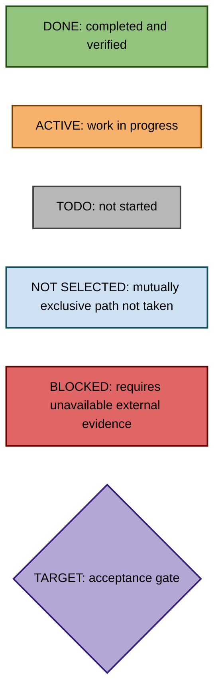
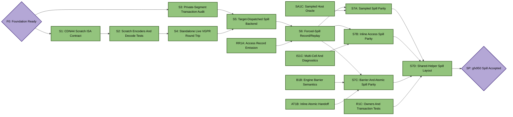
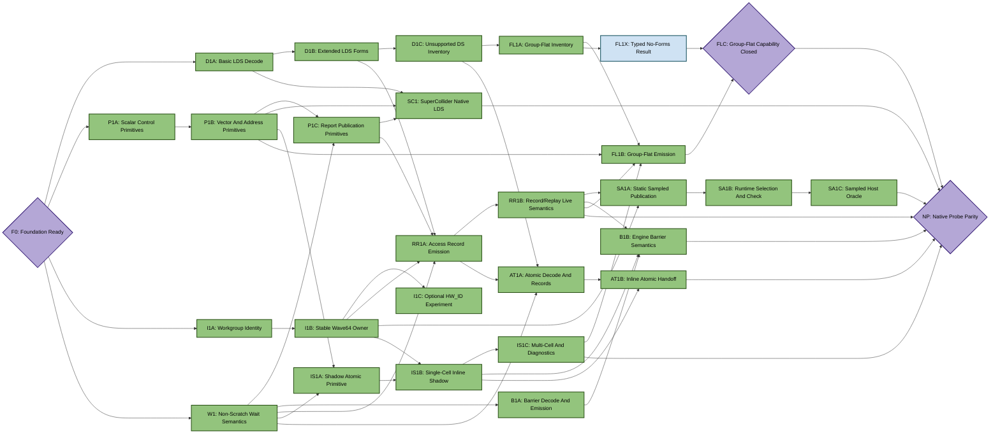

# ConSan gfx950 Native Port Plan

This plan tracks native ConSan support for CDNA4 / `gfx950`. It is separate
from [PLAN.md](PLAN.md) so gfx950 work can proceed without creating conflicts
with ongoing gfx1201 work. The target is feature and qualification parity with
the accepted gfx1201 `standard-v1` profiles, subject to explicit ISA-specific
capability differences.

ConSan must patch the final gfx950 code object that will execute. Translating a
gfx950 kernel to another ISA is not part of sanitizer correctness.

[DESIGN.md](DESIGN.md) describes the sanitizer architecture,
[SPILLING.md](SPILLING.md) defines the resource and private-memory contract,
and [LOCAL_TESTING.md](LOCAL_TESTING.md) supplies workspace-relative paths.
The workspace-local `$WORKSPACE_ROOT/amd-instinct-cdna4-instruction-set-architecture.pdf`
is the primary ISA reference for native CDNA4 contracts.

## Status Legend

- `DONE`: implemented, reviewed, and covered by its stated tests.
- `ACTIVE`: current work.
- `TODO`: ready when its incoming dependencies are complete.
- `TARGET`: an acceptance milestone reached through incoming edges.
- `BLOCKED`: cannot progress without an external dependency or decision.

## ISA Facts That Bound This Plan

The CDNA4 ISA reference establishes several non-negotiable constraints:

- gfx950 is wave64. `EXEC` and `VCC` are 64-bit architectural state, and
  vector, vector-memory, and LDS operations are masked by `EXEC`.
- User SGPRs are numbered 0-101 and physically allocated in groups of 16;
  their descriptor count field is encoded in groups of eight. `VCC` aliases
  SGPRs 106-107. Regular VGPRs are numbered 0-255 and allocated and encoded in
  groups of eight; AccVGPRs are a distinct architectural class.
- `FLAT_SCRATCH` occupies architectural operands 102-103. Scratch instructions
  have a signed 13-bit byte offset, cannot access LDS, and contribute only to
  `VM_CNT`.
- General FLAT instructions contribute to both `VM_CNT` and `LGKM_CNT`; the
  manual says the only sensible post-FLAT wait target is zero for both.
- `S_BARRIER` does not wait on memory counters. Any required `S_WAITCNT` must
  precede the barrier.
- `HW_ID` is documented as debug-only and unsafe as a stable identity because
  its values may change during a wave's lifetime. It cannot be the required
  standard owner source.
- Workgroup IDs and wave-in-workgroup information are available through
  descriptor-enabled system SGPRs. TTMP state is privileged or runtime-owned
  and is not assumed to be an ordinary probe resource.

Project rules:

- Keep gfx1201 behavior and tests green while adding gfx950 support.
- Keep architecture-independent policy shared; isolate native instruction
  encoders and architectural constants behind explicit target capabilities.
- Use LLVM assembly/disassembly and rocJITsu decode as independent encoding
  checks before executing injected code.
- Test focused CPU/synthetic behavior before every live-GPU step.
- Fail closed when a gfx950 probe family lacks a proven encoder, resource
  convention, ownership source, or wait sequence.
- Treat a clean workload as compatibility evidence only. Require patch,
  record, or diagnostic guards for semantic evidence.
- Keep GPU test parallelism near eight, but run initial spill and trap bring-up
  serially.
- Commit in small slices. Update this file when a node changes status.

## Completion Target

Full gfx950 support means:

- SuperCollider and all three MOI `standard-v1` engines patch and execute
  native gfx950 code objects.
- Ordinary runs require no hand-selected VGPR, SGPR, owner, epoch, or report
  buffer resources.
- Dead, descriptor-growth, and spill-backed resource outcomes work on gfx950;
  unsupported cases remain typed and bounded.
- Native LDS accesses, relevant flat/group accesses, barriers, and the narrow
  atomic ordering features have explicit gfx950 capability results.
- Focused live tests prove positive race diagnostics and clean ordered
  controls, not merely successful process exit.
- Selected and broad IREE tiers complete without corruption or resource hangs.
- Documentation contains a truthful per-architecture capability table.

## Progress Log

- 2026-07-13: `E0`, `A1A-A1C`, `S1`, `S2`, and `S4` completed. The closed
  architecture inventory is in
  [GFX950_ARCH_INVENTORY.md](GFX950_ARCH_INVENTORY.md). CDNA4 scratch emission
  round-trips through the decoder and passes 10 repeated full-EXEC plus 10
  repeated partial-EXEC hardware runs on the MI355X. `A2`, `P1A`, `P1B`, `W1`,
  and `S5` are active in the first implementation slice.
- 2026-07-13: first native gfx950 record/replay access probe executes without
  guest corruption and publishes one visible record. This closed the first
  CDNA4 LDS-versus-FLAT wait integration bug. `D1A`, `P1C`, `RR1A`, and `T1A`
  are active; dynamic records and field-level host assertions remain before
  `RR1A` can become `DONE`.
- 2026-07-13: `R1A` is `DONE`. Descriptor planning now treats CDNA4 as
  wave64 with eight-VGPR encoding groups, preserves RDNA wave32/wave64
  behavior, accepts the ordinary SGPR 102 boundary despite its partially
  filled final descriptor group, and rejects VGPR 257 / SGPR 103. A synthetic gfx950 patch
  verifies that descriptor field zero is planned as eight VGPRs.
- 2026-07-13: `P1B` is `DONE`. The final VCC-sensitive arithmetic gap was
  closed by routing CDNA4 probe adds through LLVM-matched `v_add3_u32` while
  retaining one-word `v_add_nc_u32_e32` on RDNA4. The unsafe CDNA4 E32 add is
  rejected explicitly, operand boundaries are covered, and the gfx950 live
  record probe still passes.
- 2026-07-13: `W1` is `DONE`. Every remaining hard-coded gfx12 LDS/load wait
  in MOI emission was replaced by target dispatch. CDNA4 general FLAT paths
  wait for both VM and LGKM counters, LDS paths wait for LGKM, exact encodings
  decode as `s_waitcnt`, and the live gfx950 producer/publication probe passes.
- 2026-07-13: `D1A` is `DONE`. An LLVM-matched gfx950 fixture now inventories
  B32 LDS read/write operands and widths while excluding `ds_add_u32` from
  ordinary access candidates; the admitted write composes with the live
  record path's architecture-neutral range lowering.
- 2026-07-13: `RR1A` is `DONE`. Guarded auto-buffer CTests now require the
  static summary (`1` visible record) and a dynamic per-lane record with
  field-level evidence (`event_index=0`, write kind, owner/epoch zero, four
  LDS bytes, cell `[0,1)`, and full wave64 lane mask); the dynamic run publishes
  64 visible records with automatic EXEC/VCC/SCC preservation.
- 2026-07-13: `R1B` is `DONE`. CDNA4 planning now distinguishes ordinary
  SGPRs `s0-s101` from `FLAT_SCRATCH`, XNACK, VCC, and EXEC; reserves all
  descriptor-enabled user/system SGPR inputs (including workgroup info and
  private wave offset); and fails closed when no five-SGPR special-state save
  window remains. This also corrected the S3/S4 edge: isolated live scratch
  proof S4 and transaction audit S3 independently gate S5.
- 2026-07-13: `S3` is `DONE`. A shared private-dispatch requirement tracker
  now carries each patched kernel's spill size through executable/name
  association, symbol binding, kernel-object lookup, and grow-only AQL packet
  rewriting. Synthetic coverage applies one requirement consistently to the
  descriptor, AMDGPU MessagePack metadata, and dispatch packet; covers zero
  and nonzero existing private sizes; and proves rejected descriptor or
  metadata growth leaves the input unchanged.
- 2026-07-13: `S5` is `DONE`. The integrated spill path dispatches to the
  RDNA4 three-word scratch operations or CDNA4 two-word FLAT_SCRATCH
  operations and their distinct waits while retaining stable four-byte slots,
  cave-size preflight, and rollback. Synthetic gfx1201 and gfx950 patches now
  prove the required save, original access, probe, restore, and return order;
  the focused 190-test resource/builder/MOI/spill suite passes.
- 2026-07-13: `S6` is `DONE`. A guarded gfx950 hardware test forces a
  three-VGPR record/replay spill in a zero-private kernel, observes a visible
  wave64 access record, verifies four independently live values in all 64
  lanes after restoration, and requires the runtime log to prove AQL
  dispatch-private growth from 0 to 12 bytes. Explicit kernel filters keep all
  four gfx950 CTests isolated; the full group passes.
- 2026-07-13: `A2` and `A3A` are `DONE`. A target capability table now
  distinguishes unavailable, inventory-only, and proven native-emission
  support for LDS, group-FLAT, barriers, atomics, identities, scratch, waits,
  publication, and each engine path; target dispatch emits typed feature and
  support reasons when it skips. An LLVM-matched CPU fixture retains gfx950 DS
  read/write, barrier, FLAT read/write, DS atomic, and end-program words and
  inventories every initial native family without a GPU.
- 2026-07-13: `A3B`, `A3C`, and `R1C` are `DONE`, reaching `F0`. Deterministic
  gfx950 fixtures cover dead allocation, eight-register descriptor growth,
  forced spill from zero and nonzero private layouts, scalar exhaustion, and
  transactional dynamic-stack rejection. A dual-architecture shared-helper
  generator uses native CDNA4 call/return and DS encodings; its two owners have
  different register pressure and private sizes yet receive one compatible
  44-byte spill layout while an unrelated descriptor remains untouched.
- 2026-07-13: `P1A` and `P1C` are `DONE`. Scalar builders now select generated
  CDNA4/RDNA4 opcodes explicitly and use architecture-neutral wave64 EXEC/VCC
  names; LLVM-matched gfx950 bytes and decoder tests cover branch, trap, moves,
  EXEC narrowing, SCC preservation, and VCC branching. A standalone no-LDS
  gfx950 kernel publishes 64 known global words with `flat_store_dword` and the
  required zero VM/LGKM wait, proving report visibility independently of an
  access probe.
- 2026-07-13: `I1A`, `I1B`, and `I1C` are `DONE`. The standard gfx950 path now
  performs a reversible entry-time dispatch-pointer ABI transaction, snapshots
  workgroup X/Y/Z before compiler SGPR reuse, derives the logical wave64 owner
  from packed workitem coordinates and AQL workgroup dimensions, and restores
  every original ABI SGPR before guest entry. LLVM-matched SMEM/VOP3 fixtures
  and synthetic descriptor/patch-shape tests pass, as do all 153 focused
  builder/capability/MOI CPU tests. The live 3D control records 16 accesses
  across eight distinct workgroups and requires exact owners `{0,1}` in every
  group; all six gfx950 MOI hardware tests pass after reboot. TTMP sources read
  as zero in ordinary compute and the ISA marks physical `HW_ID` as
  migration-unsafe, so the optional HW_ID experiment is closed as rejected.
- 2026-07-13: `D1B` is `DONE`. CDNA4 candidates now normalize byte/short and
  D16 accesses, B64/B96/B128 accesses, READ2/WRITE2 pairs, and ST64 pairs into
  explicit static byte ranges. A retained LLVM-matched 18-instruction gfx950
  fixture verifies source/destination registers, second write operands,
  immediate fields, 4/8/256/512-byte offset scaling, byte counts, and rounded
  shadow-cell ranges. The combined 181-test ConSan/MOI suite passes.
- 2026-07-13: `D1C` is `DONE`. Every DS site in the representative gfx950
  fixture now has exactly one admitted candidate or typed exclusion. The
  exclusion inventory distinguishes reserved GDS-bit encodings, intentionally
  unsupported LDS atomics, permute/swizzle, transpose, unsupported access
  forms, and other DS operations. A reserved GDS encoding is explicitly
  prevented from entering the LDS probe path.
- 2026-07-13: `RR1B` is `DONE`. A live 128-thread gfx950 kernel records
  same-cell writes from logical owners zero and one and requires replay to
  emit exactly one conflict diagnostic with no overflow. Its non-barrier
  control performs two same-cell writes in one wave and requires two processed
  records with zero diagnostics, proving same-owner program order remains
  clean. Both guarded CTests require two patches and visible records.
- 2026-07-13: `B1A` is `DONE`. LLVM confirms gfx950 admits the no-operand
  `s_barrier` form and rejects gfx12-style signal/wait forms. Exact builder and
  decoder tests keep `s_waitcnt vmcnt(0) lgkmcnt(0)` as a distinct conservative
  precondition before `s_barrier`; an inventory fixture counts one wait and one
  barrier at separate offsets, preventing the false assumption that the
  barrier drains memory counters.
- 2026-07-13: `SA1A` is `DONE`. The sampled capability now enables the static
  CDNA4 emission path. A synthetic gfx950 transaction emits both the sampled
  access patch and identity prologue. The live two-site control statically
  selects site one, whose only active lane is owner one, and requires the
  decoded generation-one write entry for exact cell range `[1,2)`.
- 2026-07-13: `SA1B` is `DONE`. Runtime owner masking selects owner one and
  rejects owner zero in a guarded two-wave control while preserving VCC. The
  bounded immediate checker now assigns successful sampled patches sequential
  slots (instead of aliasing every patch), compares slot one against slot zero,
  and reports exactly one same-cell two-owner conflict on gfx950.
- 2026-07-13: `SA1C` is `DONE`. With immediate checking disabled, the sampled
  host scan consumes the same two-wave/same-cell seed used by `RR1B`, sees two
  current-generation entries from distinct owners, and reports exactly one
  overlap conflict with zero immediate conflicts. This isolates the host
  oracle and directly agrees with record/replay on the same native kernel.
- 2026-07-13: `S7A` is `DONE`. A forced-spill sampled probe saves and restores
  five live VGPRs through 20 bytes of dispatch-private storage while runtime
  owner selection exercises VCC preservation. The guarded gfx950 test requires
  one emitted spill patch and one visible sampled entry, verifies AQL private
  growth from zero to 20 bytes, and proves eight independently live values are
  unchanged in all 64 lanes.
- 2026-07-13: `SC1` is `DONE`. SuperCollider now emits native CDNA4 redundant
  LDS checks with target-dispatched readback opcodes, waits, VOPC operands,
  branches, traps, and marker stores. Guarded clean and racy gfx950 controls use
  automatic registers and require a patch; the clean marker stays zero and the
  racy marker is observed. Synthetic tests cover inline and appended placement,
  and all 193 ConSan CPU regressions pass.
- 2026-07-13: `IS1A` is `DONE`. LLVM and the decoder agree on the CDNA4
  `flat_atomic_swap_x2 ... sc0` return form already emitted by ConSan. A
  standalone one-lane gfx950 control observes the exact old 64-bit value and
  final replacement; a 64-lane contention control proves all returned values
  plus the final slot form one lossless serialized exchange chain.
- 2026-07-13: `IS1B` is `DONE`. The standard inline-shadow path now admits
  CDNA4 and composes automatic identity, seven scratch VGPRs, scalar saves,
  exact-cell addressing, the proven atomic swap, and bounded diagnostics. A
  two-wave B32 write/write control reports one exact owner-0/owner-1 conflict;
  two-wave read/read and same-owner program-order controls remain clean.
- 2026-07-13: `IS1C` is `DONE`. A live two-wave B128 conflict exposed and fixed
  stale packed metadata after the first cell: owner, epoch, generation, and
  instruction fields are now rematerialized per cell. All four exact-shadow
  entries and all four bounded diagnostics agree on the `[0,16)` conflict.
- 2026-07-13: `B1B` is `DONE`. CDNA4 now admits record/replay barrier records
  and inline epoch advancement. The ordered live workload replays two accesses
  plus both Wave64 arrivals without conflict; inline owner one publishes epoch
  one without a diagnostic, while both unordered controls continue to report.
- 2026-07-13: `S7B` is `DONE`. B32 and B128 inline access probes each spill
  seven VGPRs on gfx950. A new CDNA4 hybrid keeps owner/workgroup identity in
  persistent VGPRs while placing epoch plus ephemeral frames in one 44-byte
  private layout; 1,024 live guest values survive and the race still reports.
- 2026-07-13: `AT1A` is `DONE`. The CDNA4 decoder now preserves the native
  eight-byte FLAT atomic address, offset, `SC0`, and `SC1` fields and uses
  `SC0` to distinguish release from return-old-value acquire records. Live
  two-Wave64 controls record two LDS accesses plus both atomic events: a
  same-address handoff replays cleanly and changing only the acquire address
  reports the conflict. All 1,483 Rocjitsu unit tests and all 88 gfx950 CTests
  pass.
- 2026-07-13: `AT1B` is `DONE`. The one-slot inline atomic handoff now admits
  the proven CDNA4 FLAT forms. A same-address acquire imports the releasing
  Wave64 owner's epoch and keeps the subsequent LDS read clean; changing only
  the acquire address produces exactly one inline diagnostic. The gfx950
  atomic capability is now native emission; all 196 ConSan CPU tests and all
  91 gfx950 CTests pass.
- 2026-07-13: `S7C` is `DONE`. Dedicated barrier and atomic workloads keep
  eight unrelated values live in every lane while forced-spill probes execute.
  Record barriers spill six VGPRs, inline private-epoch barriers spill one
  synchronization temporary alongside seven access temporaries, and both
  atomic engines spill three VGPRs per release/acquire site. Same-address and
  barrier controls remain clean; wrong-address atomic controls report exactly
  one conflict. All 200 ConSan CPU tests and all 101 gfx950 CTests pass using
  the workspace TheRock runtime.
- 2026-07-13: `S7D` is `DONE`, reaching the `SP` spill acceptance gate. The
  reachable CDNA4 helper has two kernel owners with different descriptor and
  private baselines; record/replay, sampled, and inline probes respectively
  commit one compatible 44-, 52-, and 60-byte layout to both owners while
  leaving an unrelated kernel unchanged. Marking only one owner dynamic-stack
  rejects the shared spill transaction without emitting a modified ELF. All
  203 ConSan CPU tests and all 104 gfx950 CTests pass.
- 2026-07-13: `FL1A` is `DONE` and selects `FL1B`. CDNA4 eight-byte FLAT
  load/store fields are now inventoried, including opcode, address/data/dest,
  scalar address, unsigned FLAT offset, segment, and SC bits. Representative
  IREE scan and matmul objects use native DS (5 to 44 admitted sites per code
  object) and no application FLAT accesses. A hip-moi MFMA handoff object has
  1,602 kernel/helper FLAT sites: 371 dword, 292 dwordx2, 151 dwordx4, and 70
  ubyte loads; 237 dword, 217 dwordx2, 258 dwordx4, and 4 byte stores; all are
  unknown at their local decode scope. An explicit CDNA4 `SRC_SHARED_BASE`
  construction is strongly classified Group, so the bounded zero-offset
  B32/B64/B128 forms must proceed through `FL1B`, not `FL1X`.
- 2026-07-13: `FL1B` synthetic emission is implemented and remains `ACTIVE`
  (orange) pending its live gfx950 race proof. Record/replay and inline-shadow
  now admit only strongly classified, generic-segment, zero-offset CDNA4 FLAT
  dword/dwordx2/dwordx4 loads and stores. Unknown forms remain inventory-only;
  the synthetic Group fixture emits both probe families over the same low
  address VGPR and shared exact-shadow cell semantics.
- 2026-07-13: `FL1B` is `DONE`; `FL1X` is `NOT SELECTED`. A live padded
  `flat_store_dword` derived from `SRC_SHARED_BASE` races between two gfx950
  waves. Record/replay and inline shadow each report exactly one conflict for
  the same four-byte LDS cell. Unknown pointers and typed private/global
  segments do not emit LDS probes. All 219 focused CPU/synthetic tests and all
  81 registered `Gfx950` CTests pass with the workspace TheRock runtime.
- 2026-07-13: `T1A` is `DONE`; `T1B` is now `ACTIVE`. The portable ConSan LDS
  binary follows `RJ_HIP_TEST_ARCH` and is shared by native gfx1201/gfx950
  registration instead of being compiled twice under architecture-specific
  target names. RDNA-only inline-assembly suites remain explicitly gated on a
  physical gfx1201 plus a gfx1201 build target, while CDNA4 suites now require
  both gfx950 runtime support and a physically enumerated gfx950. This machine
  discovers the native gfx950 controls and no gfx1201 live controls; the
  consolidated clean/racy SuperCollider rows pass.
- 2026-07-13: `T1B` is `DONE`; `T2SC` is now `ACTIVE`. The matrix auto-detects
  gfx1201/gfx950 from the workspace ROCm agent enumerator, accepts an explicit
  architecture override, and fails dry runs whose CTest selection is empty.
  gfx950 dry-run selection names 38 focused rocJITsu live controls, all 44
  independent hip-moi controls, and 10 CDNA4 IREE tile-and-fuse/scan/softmax
  workloads for each profile. The existing RDNA4 selector remains the gfx1201
  branch rather than leaking into gfx950 runs.
- 2026-07-13: `T2SC` is `DONE`; `T2RR` is now `ACTIVE`. The target-aware
  portable gfx950 LDS binary passes both guarded SuperCollider rows: the clean
  marker stays zero and the racy marker is published, with patch emission
  required in both runs.
- 2026-07-13: `T2RR` is `DONE`; `T2SA` is now `ACTIVE`. Eleven focused rows
  pass: dynamic record fields, native and Group-FLAT race positives, same-wave
  and barrier-ordered negatives, same/wrong-address atomic handoff, typed
  unsupported DS disposition, diagnostic capacity exhaustion, dropped or
  unsupported access records, and dropped barrier records.
- 2026-07-13: `T2SA` is `DONE`; `T2IS` is now `ACTIVE`. Seven sampled rows
  pass: standalone and packed publication, deterministic static selection,
  runtime owner selection, immediate and host-oracle conflict paths, and stale
  generation rejection.
- 2026-07-13: `T2IS` is `DONE`; `T2R` is now `ACTIVE`. Ten gfx950 inline rows
  pass across B32, Group-FLAT, B128 multi-cell, read/read, same-wave ordering,
  barrier ordering, atomic handoff, private epoch, and bounded diagnostics. A
  new five-cell B128-plus-B32 race produces five diagnostics with four visible
  and one dropped, directly proving GPU-side overflow accounting.
- 2026-07-13: `T2R` is `DONE`, reaching `T2G`; `T3A` is now `ACTIVE`. All 24
  selected resource/spill rows pass: dead allocation, descriptor growth,
  zero/nonzero-private layouts, forced spills for every engine and
  synchronization path, partial EXEC, dynamic-stack rollback, and multi-owner
  shared-helper commit/rollback. Every live row preserves guest values.
- 2026-07-13: `T3A` is `DONE`; `T3SC` is now `ACTIVE`. The uninstrumented
  baseline passes all 44 hip-moi controls and all 10 selected IREE workloads.
  Inventory-only runs emit no patches and find admitted native LDS in every
  selection: softmax has 4 sites, configured scan has 5 plus two barriers, and
  the eight CDNA4 tile-and-fuse MFMA rows have 20 to 660 sites. The f16 row
  includes B64 and two-address multi-cell forms. Unconfigured scan was removed
  because it had zero admitted sites; no selected IREE object contains Group
  FLAT, whose admitted form remains covered by the dedicated live control.
- 2026-07-13: `T3SC` is `DONE`; `T3RR` is now `ACTIVE`. All 10 selected IREE
  rows pass guarded SuperCollider in 6.07 seconds with patch emission required
  for every row. The first guarded record/replay run is non-vacuous but fails:
  every row emits an access probe plus owner/epoch prologue and then traps with
  `HSA_STATUS_ERROR_ILLEGAL_INSTRUCTION`. T3RR remains orange while a single
  dumped replacement object is reduced at instruction level.
- 2026-07-13: `T3RR` is `DONE`; `T3SA` is now `ACTIVE`. The illegal-instruction
  reduction isolated kernel-entry redirection: kernels requesting AMDHSA
  kernarg preloading have two hardware entries exactly 256 bytes apart, while
  ConSan had emitted only the compatibility entry. ConSan now emits equivalent
  owner/epoch launch stubs at both entries and branches each to its matching
  original path. The new synthetic dual-entry regression and 209 focused
  ConSan tests pass. All 10 guarded selected IREE rows pass record/replay in
  6.01 seconds with both patch and record non-vacuity required.
- 2026-07-13: `T3SA` is `DONE`; `T3IS` is now `ACTIVE`. All 10 guarded selected
  IREE rows pass sampled MOI in 6.03 seconds with both patch and sampled-record
  non-vacuity required. The first inline-shadow pass accepts 4/10 rows; five
  scalar MFMA rows and configured scan fault after automatic persistent
  identity VGPRs cross the descriptor's CDNA4 `ACCUM_OFFSET`. Explicit
  non-initialized owner/epoch registers avoid the fault, and instruction-level
  reduction confirms that writing persistent identity into the accumulator
  window corrupts live MFMA state. T3IS remains orange while identity state is
  moved out of the overlapping VGPR window.
- 2026-07-13: `T3IS` completed its first guarded selected-workload pass, but
  semantic review reopened inline-shadow acceptance as three smaller nodes:
  `T3IO` (stable private owner), `T3IA` (private-state atomic ordering), and
  `T3IL` (focused and live regressions). The temporary accumulator-overlap
  fallback is not acceptance-quality because it derives owner from mutable,
  packed `v0` at each probe and omits atomic handoff patches. `T3IO` is
  `ACTIVE`; `T3G` is therefore not yet reached. In parallel, the independent
  `T4SC` compatibility sweep has started and is also `ACTIVE`.
  Accumulator-constrained CDNA4 inline-shadow kernels now select the existing
  derived-owner/private-epoch representation when five persistent identity
  VGPRs would cross a nonzero `ACCUM_OFFSET`. Private-state prologues also
  preserve paired kernarg-preload entries. All 209 focused ConSan tests pass,
  and all 10 guarded selected inline-shadow rows pass in 6.24 seconds.
- 2026-07-13: the first broad `T4SC` sweep selected 259 IREE ROCm tests and
  passed 244. One isolated matmul failure is reproducibly ConSan-specific; the
  other 14 failures are being separated from parallel-resource and baseline
  effects before classification. Broad profile executions remain mutually
  exclusive because CTest removes a shared `test_tmpdir`, but diagnosis,
  documentation, and independent implementation nodes may proceed in
  parallel.
- 2026-07-13: an isolated broad record/replay MXFP4 failure assigned identity
  at `v135:v139` in a 136-VGPR MFMA kernel before a memory-aperture exception.
  Because record/replay and sampled builders still assume persistent identity,
  the engine-independent accumulator fix is split into `T3IR` after the
  bounded inline private-owner node `T3IO`.
- 2026-07-13: `T3IO` is `DONE`; `T3IR` is now `ACTIVE`. Inline-shadow private
  state now snapshots the correctly flattened gfx950 wave owner and epoch at
  both hardware entries, keeps persistent and ephemeral private slots
  disjoint, and never rederives owner from mutable `v0` at a probe. The focused
  ConSan/resource/placement filter passes 225/225.
- 2026-07-13: all 14 residual SuperCollider family rows still fail when run
  one process at a time. Seven produce the expected mismatch trap, while seven
  produce wrong numerical results instead. One logged MXFP4 row selects
  scratch `v132` in a 136-VGPR MFMA kernel, exposing a second accumulator alias
  hazard. `T4SV` is `ACTIVE`; these seven are not accepted as diagnostics.
- 2026-07-13: `D2A` is `DONE`. The present-facing design, usage, tutorial, and
  spilling documents now cover gfx950/CDNA4 capability and workspace runtime
  contracts. Final per-tier results remain separated in `D2B`.

## DAG Overview

The DAG is split into panels for readability. Repeated nodes refer to the same
work item. `A --> B` means `A` is a hard prerequisite of `B`.

### Color legend

### Foundation and architecture model

```mermaid
flowchart LR
  B0["B0: gfx1201 Accepted Baseline"]:::done
  E0["E0: gfx950 Local Environment"]:::done
  A1A["A1A: Locate Architecture Assumptions"]:::done
  A1B["A1B: Classify Assumptions"]:::done
  A1C["A1C: Close Inventory"]:::done
  A2["A2: Capability And Target Dispatch"]:::done
  A3A["A3A: Basic ISA Fixtures"]:::done
  A3B["A3B: Private And Pressure Fixtures"]:::done
  A3C["A3C: Shared-Helper Fixture"]:::done
  R1A["R1A: Limits And Descriptor Geometry"]:::done
  R1B["R1B: Scalar And Special State"]:::done
  R1C["R1C: Owners And Transaction Tests"]:::done
  F0{"F0: gfx950 Foundation Ready"}:::target

  B0 --> A1A
  E0 --> A3A
  A1A --> A1B --> A1C
  A1C --> A2
  A2 --> A3A
  A3A --> A3B --> A3C
  A1C --> R1A
  A2 --> R1A
  R1A --> R1B --> R1C
  A3C --> F0
  R1C --> F0

  classDef done fill:#93c47d,stroke:#274e13,stroke-width:2px,color:#000;
  classDef active fill:#f6b26b,stroke:#783f04,stroke-width:2px,color:#000;
  classDef todo fill:#b7b7b7,stroke:#434343,stroke-width:2px,color:#000;
  classDef target fill:#b4a7d6,stroke:#351c75,stroke-width:2px,color:#000;
```

### Critical spill path

### Native probes and engine rollout

### Qualification and acceptance

```mermaid
flowchart LR
  SP{"SP: Spill Accepted"}:::target
  NP{"NP: Native Probe Parity"}:::target
  T1A["T1A: Target-Aware Test Registration"]:::done
  T1B["T1B: Workload And Tier Selection"]:::done
  T2SC["T2SC: SuperCollider Focused Tier"]:::done
  T2RR["T2RR: Record/Replay Focused Tier"]:::done
  T2SA["T2SA: Sampled Focused Tier"]:::done
  T2IS["T2IS: Inline-Shadow Focused Tier"]:::done
  T2R["T2R: Resource And Spill Tier"]:::done
  T2G{"T2G: Focused gfx950 Accepted"}:::target
  T3A["T3A: Workload Inventory"]:::done
  T3SC["T3SC: SuperCollider Selected Workloads"]:::done
  T3RR["T3RR: Record/Replay Selected Workloads"]:::done
  T3SA["T3SA: Sampled Selected Workloads"]:::done
  T3IS["T3IS: Initial Inline-Shadow Selected Pass"]:::done
  T3IO["T3IO: Stable Private Owner State"]:::done
  T3IR["T3IR: Private Record/Sampled State"]:::active
  T3IA["T3IA: Private-State Atomic Ordering"]:::todo
  T3IL["T3IL: Inline Semantic Regressions"]:::todo
  T3G{"T3G: Selected Workloads Accepted"}:::target
  T4SV["T4SV: SuperCollider Accumulator-Safe Scratch"]:::active
  T4SC["T4SC: SuperCollider Broad IREE"]:::active
  T4RR["T4RR: Record/Replay Broad IREE"]:::active
  T4SA["T4SA: Sampled Broad IREE"]:::todo
  T4IS["T4IS: Inline-Shadow Broad IREE"]:::todo
  T4G{"T4G: Broad Compatibility Accepted"}:::target
  D2A["D2A: Capability And Runbook Content"]:::done
  D2B["D2B: Final Result Tables"]:::todo
  X1A["X1A: Local gfx1201 Synthetic Regression"]:::todo
  X1B["X1B: gfx1201 Live Regression Evidence"]:::blocked
  M0{"M0: gfx950 Fully Supported"}:::target

  T1A --> T1B
  SP --> T2R
  NP --> T2SC
  NP --> T2RR
  NP --> T2SA
  NP --> T2IS
  T1B --> T2SC
  T1B --> T2RR
  T1B --> T2SA
  T1B --> T2IS
  T1B --> T2R
  T2SC --> T2G
  T2RR --> T2G
  T2SA --> T2G
  T2IS --> T2G
  T2R --> T2G
  T2G --> T3A
  T3A --> T3SC
  T3A --> T3RR
  T3A --> T3SA
  T3A --> T3IS
  T3SC --> T3G
  T3RR --> T3G
  T3SA --> T3G
  T3IS --> T3IO --> T3IR --> T3IA --> T3IL --> T3G
  T3SC --> T4SV --> T4SC
  T3RR --> T4RR
  T3SA --> T4SA
  T3IL --> T4IS
  T4SC --> T4G
  T4RR --> T4G
  T4SA --> T4G
  T4IS --> T4G
  SP --> D2A
  NP --> D2A
  T3G --> X1A
  T4G --> D2B
  D2A --> D2B --> M0
  X1A --> X1B --> M0

  classDef done fill:#93c47d,stroke:#274e13,stroke-width:2px,color:#000;
  classDef active fill:#f6b26b,stroke:#783f04,stroke-width:2px,color:#000;
  classDef todo fill:#b7b7b7,stroke:#434343,stroke-width:2px,color:#000;
  classDef target fill:#b4a7d6,stroke:#351c75,stroke-width:2px,color:#000;
  classDef blocked fill:#e06666,stroke:#660000,stroke-width:2px,color:#000;
```

## Recommended Execution Order

1. Establish the local environment and freeze representative gfx950 code
   objects before changing emitters.
2. Inventory all RDNA4 assumptions and introduce explicit capability dispatch.
3. Audit the CDNA4 descriptor/register model.
4. Complete the initial spill path through S6: standalone hardware round-trip,
   target-dispatched backend, and forced-spill record/replay.
5. In parallel with later spill-family rollout, implement native LDS decode and
   the common CDNA4 probe primitives.
6. Bring up SuperCollider and record/replay first. Use record/replay as the
   semantic oracle for sampled and inline shadow.
7. Add group-flat, barrier, and atomic features only after their gfx950 native
   contracts are tested independently. Close group-flat through FL1B or FL1X
   according to the observed inventory.
8. Complete S7A-S7D only after the corresponding engines and synchronization
   probes exist; spill parity is an integration gate, not an early prerequisite.
9. Run the per-profile focused, selected, and broad qualification nodes in that
   order. Keep broad IREE sweeps serialized.

## Foundation Nodes

### E0: gfx950 Local Environment - DONE

Goal: create a reproducible workspace using the layout in
[LOCAL_TESTING.md](LOCAL_TESTING.md).

Work:

- Build or identify the TheRock ROCm distribution used by HIP and HSA tests.
- Configure rocJITsu for the detected gfx950 agent and build its tests and HSA
  hook.
- Configure hip-moi and a HIP-enabled IREE tree for gfx950.
- Record compiler, runtime, firmware, GPU agent, and target-feature strings.
- Verify an uninstrumented HIP smoke and HSA-tools hook load.

Done criteria:

- Paths required by `consan_test_matrix.sh` exist and use one ROCm runtime.
- `rocminfo`, a HIP kernel, and an unmodified HSA-tools hook agree on gfx950.

### A1A: Locate Architecture Assumptions - DONE

Goal: produce a mechanically checkable list of ConSan dependencies on gfx1201
machine behavior.

Work:

- Classify architecture references in `consan.cpp`, `consan_moi.cpp`,
  `instruction_builder.*`, `spill_manager.*`, the HSA hook, and live tests.
- Record each reference by source location and affected probe family.

Done criteria:

- The source-location inventory is complete enough that later classification
  does not require another repository-wide search.

### A1B: Classify Architecture Assumptions - DONE

Goal: assign a disposition to every item found by A1A.

Work:

- Cover DS/flat layouts, scalar/vector encodings, waits, barriers, atomics,
  scratch, special registers, TTMP payloads, register limits, wave size, and
  descriptor granularity.
- Mark each assumption shared, target-parametric, or requiring a CDNA4
  implementation.

Done criteria:

- Every inventory row has one classification and an implementation/test owner.

### A1C: Close Architecture Inventory - DONE

Goal: turn the classified inventory into enforceable port boundaries.

Work:

- Reconcile the inventory with target gates and capability declarations.
- Add focused assertions or tests for assumptions that must remain gfx1201-only.

Done criteria:

- Every existing `RDNA4` gate in an active ConSan path has an owner and planned
  disposition; no gate is removed merely because a generic decoder exists.

### A2: Capability And Target Dispatch - DONE

Goal: make unsupported native probe families explicit per architecture.

Work:

- Define capabilities for native LDS, flat/group, barriers, atomics, owner
  sources, workgroup sources, scratch spilling, and required waits.
- Route builders through target-specific implementations without duplicating
  engine policy.
- Produce typed skip reasons for missing capabilities.

Done criteria:

- gfx950 inventory never enters an RDNA4 encoder accidentally.
- Synthetic tests distinguish supported inventory from supported emission.

### A3A: gfx950 Basic ISA Fixtures - DONE

Goal: retain small deterministic instruction inputs for decoder and patch-shape
tests.

Work:

- Build minimal kernels containing representative DS reads/writes, barriers,
  flat accesses, and atomics.
- Save assembly expectations or generated fixture sources rather than relying
  only on large compiler outputs.

Done criteria:

- CPU-only tests can inventory the initial gfx950 native instruction families
  without a GPU.

### A3B: gfx950 Private And Pressure Fixtures - DONE

Goal: retain deterministic resource and private-memory inputs separately from
the basic instruction fixtures.

Work:

- Build zero-private, nonzero-private, descriptor-pressure, and dynamic-stack
  marker objects.
- Record kernel descriptor and AMDGPU MessagePack expectations.

Done criteria:

- CPU-only tests can distinguish dead, growth, spill-required, and rejected
  private-layout outcomes.

### A3C: gfx950 Shared-Helper Fixture - DONE

Goal: retain one object that proves all-owner behavior for shared helper text.

Work:

- Build at least two kernel descriptors that reach one shared helper containing
  an admitted LDS access.
- Give the owners deliberately different resource pressure and private layouts.

Done criteria:

- CPU-only patch planning computes one compatible helper plan across every
  reachable owner.

### R1A: CDNA4 Limits And Descriptor Geometry - DONE

Goal: prove the ordinary register limits and descriptor count geometry used by
the allocator.

Work:

- Verify wave size, ordinary VGPR/SGPR limits, allocation granularities, and
  descriptor fields.
- Remove RDNA wave32 assumptions from MOI descriptor helpers.

Result:

- Architecture-aware descriptor helpers force CDNA4 wave64 and use eight-VGPR
  groups while retaining the existing RDNA wave-size rules.
- Boundary tests cover the final ordinary VGPR and SGPR counts, the partially
  filled final SGPR descriptor group, and the first rejected counts.
- A synthetic gfx950 code object exercises the real resource planner and
  confirms that a zero VGPR descriptor field decodes to eight registers.

Done criteria:

- Unit tests cover boundary count encodings and reject the first unrepresentable
  VGPR/SGPR allocation.

### R1B: CDNA4 Scalar And Special State - DONE

Goal: prove scalar-resource and architectural-state inputs independently of
ordinary descriptor growth.

Work:

- Verify special-register numbering and the EXEC/VCC/SCC preservation model.
- Verify workgroup system-SGPR layout and private-segment enablement.

Result:

- The ordinary CDNA4 scalar allocation limit is `s0-s101`; architectural VCC
  and EXEC remain modeled separately at `s106:s107` and `s126:s127`.
- Resource planning reserves the descriptor's user SGPRs plus enabled
  workgroup X/Y/Z, workgroup-info, and private-segment wave-offset inputs even
  when guest instructions do not mention them.
- Synthetic no-emission tests cover a 36-SGPR ABI footprint, automatic save
  placement immediately above it, scalar-file exhaustion, and the special
  register numbers.

Done criteria:

- Synthetic allocation covers scalar-full, special-state, and system-SGPR
  boundary cases without emitting a probe.

### R1C: CDNA4 Owners And Resource Transactions - DONE

Goal: prove shared ownership and transactional allocation outcomes using the
audited R1A/R1B model.

Work:

- Retain the all-owner rule for shared helper text.
- Exercise dead, descriptor-growth, spill-required, and rollback outcomes.

Done criteria:

- Unit tests cover gfx950 dead, growth, spill-required, scalar-full, and shared
  owner outcomes with correct descriptor counts.

## Spill Critical Path

### S1: CDNA4 Scratch ISA Contract - DONE

Goal: define the native save/restore sequence before writing an encoder.

Work:

- Determine the gfx950 scratch load/store forms, operands, address source, and
  immediate range suitable for per-lane VGPR preservation.
- Determine ordering and wait-counter requirements for save-before-clobber and
  restore-before-guest-use.
- Verify behavior under partial and empty EXEC masks.
- Compare the CDNA3 reference emitter with CDNA4 ISA and LLVM output; do not
  assume binary compatibility.

Done criteria:

- The chosen sequence is documented with LLVM-assembled bytes, decoded fields,
  signed 13-bit offset bounds, clobbers, `VM_CNT` waits, and EXEC behavior.

### S2: Scratch Encoders And Decode Tests - DONE

Goal: implement a standalone, transactional gfx950 B32 VGPR spill sequence.

Work:

- Add CDNA4 scratch store/load and wait builders.
- Keep stable four-byte per-lane slots and rollback on multi-slot failure.
- Test zero, aligned nonzero, maximum accepted, and first rejected offsets.
- Round-trip emitted words through the CDNA4 decoder and compare with LLVM.

Done criteria:

- No live GPU is required to prove exact emitted bytes and failure bounds.
- gfx1201 encoder tests remain byte-for-byte unchanged.

### S3: Private-Segment Transaction Audit - DONE

Goal: carry spill capacity through every host/runtime representation.

Work:

- Verify gfx950 descriptor private-size and enable-bit updates.
- Verify in-place AMDGPU MessagePack private-size updates.
- Verify loaded-kernel association and AQL dispatch private-size rewriting.
- Cover kernels compiled with zero and nonzero private bytes.
- Retain dynamic-stack rejection until the CDNA4 stack convention is proven.

Done criteria:

- Synthetic tests prove descriptor, metadata, and dispatch requirements agree,
  and failed growth leaves the object unchanged.

### S4: Standalone Live VGPR Round Trip - DONE

Goal: validate the exact S1/S2 sequence on gfx950 independently of ConSan.

Work:

- Keep a VGPR value live, save it to private scratch, clobber it, restore it,
  and verify all active lanes.
- Test zero-origin and nonzero-origin private segments where practical.
- Add a partial-EXEC control without making inactive lanes observable.

Done criteria:

- Repeated serial runs preserve every active-lane value with no trap, hang, or
  memory fault.

### S5: Target-Dispatched Spill Backend - DONE

Goal: integrate CDNA4 emission beneath the existing `SpillManager` contract.

Work:

- Preserve allocation, stable-slot, ownership, and private-layout policy.
- Select native save/restore emission by architecture.
- Include save/restore byte counts in cave preflight and transactional commit.
- Keep typed failures for offset, stack, ownership, descriptor, and placement
  errors.

Done criteria:

- Synthetic patch shapes contain save, original access, probe, restore, and
  return in the required order for both gfx950 and gfx1201.

### S6: Forced-Spill Record/Replay - DONE

Goal: prove one complete gfx950 ConSan spill-backed vertical slice.

Work:

- Force a three-VGPR record/replay probe to borrow live guest registers.
- Keep several victim values live across the patched access.
- Require a visible record and verify all guest values after restoration.
- Exercise a kernel whose original private size is zero.

Done criteria:

- The test proves patch execution, record publication, value preservation, and
  dispatch-private growth in one run.

### S7A: Sampled Spill Parity - DONE

Goal: extend the proven record/replay spill path to sampled access probes.

Work:

- Cover sampled access windows and their scalar/VCC preservation state.
- Require deterministic selection, visible publication, and at least one
  emitted spill patch.

Done criteria:

- Sampled standard mode needs no register numbers and preserves live victim
  values around a guarded publication.

Result:

- `ConSanMoiGfx950Test.ForcedSpillSampled` uses automatic register selection,
  forces the five-VGPR sampled window through the CDNA4 spill backend, and
  requires a visible generation-one watchpoint plus a logged 0-to-20-byte
  dispatch-private grow operation. Its kernel keeps eight unrelated values
  live across the patched access and validates every value in all 64 lanes;
  runtime stride selection also covers the sampled path's VCC save/restore.

### S7B: Inline Access Spill Parity - DONE

Goal: cover inline-shadow access and private-epoch VGPR windows.

Work:

- Cover B32 and multi-cell inline access windows.
- Cover private-epoch coexistence with ephemeral slots.

Done criteria:

- Inline-shadow standard mode needs no register numbers and a guarded race
  still produces its diagnostic through a spill-backed patch.

Result:

- `ForcedSpillInlineShadowB32` validates eight unrelated values in all 128
  lanes after a seven-VGPR spill/restore and requires a 28-byte private grow;
  its two guarded Wave64 owners still produce one diagnostic.
- `ForcedSpillInlineShadowB128` requires the four-cell race and the same
  seven-VGPR, 28-byte spill frame.
- `ForcedSpillInlineShadowPrivateEpoch` proves the CDNA4 hybrid transaction:
  persistent owner plus three workgroup VGPRs, private epoch at offset zero,
  and non-overlapping access/prologue spill slots share a bounded 44-byte
  layout. The live-value oracle and race diagnostic both remain intact.

### S7C: Barrier And Atomic Spill Parity - DONE

Goal: cover synchronization-specific VGPR temporaries after their native probe
families are proven.

Work:

- Cover barrier-record, inline barrier-epoch, record/replay atomic, and inline
  atomic-handoff temporaries.

Done criteria:

- Each applicable family emits a spill-backed patch and retains its positive
  and ordered-control semantics.

Result:

- Synthetic gfx950 plans require six spilled VGPRs and 24 bytes for a barrier
  record, one spilled barrier temporary in the 44-byte inline private-epoch
  transaction, and three spilled VGPRs per record or inline atomic patch.
- Live 128-thread workloads validate eight independent values per lane after
  every synchronization family. Record/replay consumes two accesses plus two
  barrier or atomic events; ordered controls stay clean, while changing only
  the acquire address produces one diagnostic in each atomic engine.

### S7D: Shared-Helper Spill Layout - DONE

Goal: close spill parity with a reachable helper shared by multiple kernels.

Work:

- Compute one compatible private layout across every owner of the A3C helper.
- Verify rollback when any owner cannot support the common layout.

Done criteria:

- Standard MOI runs need no register numbers, and focused controls observe at
  least one emitted spill patch per applicable engine and shared owner.

Result:

- Record/replay, sampled, and inline-shadow automatically spill three, five,
  and seven VGPRs for the same reachable CDNA4 helper. Each patch names both
  owners and grows both descriptors to the common 44-, 52-, or 60-byte layout;
  the unrelated descriptor remains at zero.
- A per-owner dynamic-stack marker proves atomic rollback: if either reachable
  owner cannot accept the common private layout, no patched ELF is emitted.

## Native Probe Nodes

### D1A: CDNA4 Basic LDS Decode - DONE

Goal: convert the basic gfx950 B32 LDS read/write forms into ConSan's semantic
access model without importing RDNA4 raw layouts.

Work:

- Decode address/data/destination registers and the combined 16-bit byte
  offset for basic single-address forms.
- Normalize byte ranges and rounded shadow-cell ranges.

Result:

- A retained gfx950 code-object fixture covers `ds_write_b32` with a nonzero
  byte offset, `ds_read_b32`, and an adjacent `ds_add_u32` exclusion.
- CPU tests verify decoded address/data/destination registers, widths, access
  kinds, and candidate filtering; the live access-record smoke verifies the
  admitted write composes with range lowering and publication.

Done criteria:

- B32 fixture tests cover reads and writes and do not classify unrelated DS
  operations as ordinary accesses.

### D1B: CDNA4 Extended LDS Forms - DONE

Goal: add bounded multi-width and two-address coverage after D1A is stable.

Work:

- Decode B64/B96/B128, byte/short, d16, READ2/WRITE2, and ST64 forms selected
  for initial parity.
- Apply the ISA-defined offset scaling and alignment rules.

Result:

- Native DS fields are retained in the semantic site/candidate model, and
  every admitted form carries normalized one- or two-range byte geometry.
- An 18-instruction gfx950 fixture uses LLVM-matched encodings to cover the
  selected width, D16, two-address, and ST64 families, including distinct
  WRITE2 data operands and exact rounded shadow cells.

Done criteria:

- Each admitted form has exact register, byte-range, and cell-range fixture
  expectations.

### D1C: CDNA4 Unsupported DS And Atomic Inventory - DONE

Goal: make the remainder of the DS family explicit instead of silently
misclassifying it.

Work:

- Inventory transpose, permute, GDS-reserved, and LDS atomic forms.
- Mark each form admitted elsewhere or intentionally unsupported.

Result:

- Non-admitted DS sites carry a stable typed reason: GDS-reserved, atomic,
  permute/swizzle, transpose, unsupported access form, or other DS.
- A nine-site LLVM-matched/manual-reserved-bit fixture proves complete
  disposition coverage and proves a set GDS bit cannot become an LDS
  sanitizer candidate.

Done criteria:

- Every DS opcode seen in representative gfx950 objects has a normalized form
  or a typed exclusion.

### P1A: CDNA4 Scalar Control Primitives - DONE

Goal: supply and independently validate scalar control-flow/state primitives.

Work:

- Implement branch/trap, scalar moves and compares, and EXEC/VCC/SCC
  preservation as required.
- Parameterize special operand encodings and architectural register limits.
- Validate each primitive independently against LLVM when representable.

Done criteria:

- Scalar-control tests contain no unexplained RDNA4 constants on a gfx950 path.

### P1B: CDNA4 Vector And Address Primitives - DONE

Goal: supply the vector moves, compares, and address arithmetic shared by probe
families.

Work:

- Implement the minimal vector ALU and address-building forms needed by native
  LDS, scratch, shadow, and report paths.
- Test operand boundaries, special operands, and rollback on an unsupported
  encoding.

Result:

- CDNA4 vector ALU, comparison, lane-count, literal move, and address-building
  primitives have exact-byte and rocJITsu decode coverage.
- Probe addition uses the VCC-neutral two-word `v_add3_u32` form on CDNA4;
  LLVM 21.1.8 independently produces `D1FF000A 02020702` for the retained test
  operands. The VCC-writing E32 alternative is rejected on CDNA4.
- Boundary inputs fail without emitting a partial instruction sequence.

Done criteria:

- Every admitted primitive round-trips through rocJITsu decode and, where
  representable, LLVM assembly/disassembly.

### P1C: CDNA4 Report Publication Primitives - DONE

Goal: prove global report-buffer stores and their required completion sequence
before composing full engines.

Work:

- Emit bounded report address calculation and stores using P1A/P1B state.
- Validate exact bytes, buffer bounds, and report visibility in a standalone
  hardware smoke.

Done criteria:

- One guarded GPU test publishes a known report without an LDS probe.

### I1A: gfx950 Workgroup Identity - DONE

Goal: produce stable 1D/2D/3D workgroup identity from descriptor-enabled system
SGPRs.

Work:

- Use descriptor-enabled workgroup ID SGPRs for 1D/2D/3D identity.
- Preserve compatible assignments across shared helpers.

Result:

- The CDNA4 entry prologue snapshots enabled X/Y/Z system SGPRs into one
  common persistent VGPR assignment before any original instruction can reuse
  the scalar inputs; disabled dimensions are canonical zero.
- When ConSan inserts the AQL dispatch-pointer pair ahead of the original ABI,
  it reads all snapshots from their shifted locations and then restores every
  original user/system SGPR to its former number.
- A shared-helper fixture emits one compatible access probe plus an identity
  prologue for each owning kernel. The live `2x2x2` grid proves eight distinct
  3D keys and two records with one identical key per workgroup.

Done criteria:

- Focused controls record distinct workgroup keys for distinct workgroups and
  identical keys for waves in one workgroup.

### I1B: Stable Wave64 Owner Identity - DONE

Goal: define the required standard owner source independently of debug-only
`HW_ID` and runtime-owned TTMP payloads.

Work:

- Derive owner identity from descriptor-enabled wave-in-workgroup state or an
  equivalently stable architectural input.
- Preserve compatible assignments across shared helpers.

Result:

- The prologue reads packed 16-bit workgroup X/Y dimensions from the standard
  AQL dispatch packet and flattens AMDHSA's packed VGPR0 coordinates as
  `x + size_x * (y + size_y * z)` before dividing by 64.
- Owner, epoch, and three workgroup coordinates occupy one automatically
  allocated five-VGPR persistent set shared by every owner of helper text.
- Exact builder fixtures cover the SMEM load, VOP3 multiply-adds, descriptor
  dispatch-pointer insertion, shifted system inputs, and ABI restoration. The
  hardware oracle observes exact owners `{0,1}` in every 128-thread group.

Done criteria:

- Two unordered waves in one workgroup receive distinct stable owners, while
  accesses in different workgroups remain separated by I1A.

### I1C: Optional HW_ID Owner Experiment - DONE

Goal: determine whether `HW_ID` is useful for diagnostics without making it a
standard correctness dependency.

Work:

- Exercise migration-sensitive and repeated controls where practical.
- Expose the source only as an explicitly experimental capability if observed
  behavior and documentation permit it.

Result:

- Rejected for standard and experimental correctness use. The CDNA4 ISA says
  `HW_ID` describes current physical placement and may change during a wave's
  lifetime, while ordinary compute probes observed zero for the tempting TTMP
  wave fields.
- The gfx950 capability table keeps `hw_id_owner` unavailable; NP and M0 use
  only the stable logical owner from I1B.

Done criteria:

- The result is recorded as experimental or rejected. NP and M0 do not depend
  on this node.

### W1: CDNA4 Non-Scratch Memory Wait Semantics - DONE

Goal: model CDNA4 memory completion without gfx12 wait encodings.

Work:

- Define waits after original LDS accesses, report-buffer operations, general
  FLAT operations, and shadow atomics.
- Require both `VM_CNT=0` and `LGKM_CNT=0` after general FLAT operations, as
  required by the ISA manual.
- Leave scratch save/restore waits owned by S1.

Result:

- Original LDS operations use target-dispatched LDS waits; report FLAT loads,
  stores, and atomics use the general-FLAT wait that drains both VM and LGKM on
  CDNA4.
- No gfx12 `s_wait_loadcnt` or `s_wait_dscnt` literal remains in MOI emission.
- Exact-byte/decode tests and the live gfx950 access-record producer/consumer
  smoke cover the currently admitted paths; later engines reuse these helpers.

Done criteria:

- Focused producer/consumer smokes prove each admitted non-scratch wait
  sequence.

### B1A: CDNA4 Barrier Decode And Emission - DONE

Goal: decode and re-emit supported gfx950 barriers independently of engine
semantics.

Work:

- Inventory compiler-emitted barrier forms and operands.
- Prove exact `S_BARRIER` emission and the required pre-barrier memory wait;
  the barrier itself does not drain counters.

Result:

- The exact gfx950 barrier word round-trips as `s_barrier`; unsupported target
  requests fail closed.
- A separate two-word helper and decode fixture prove the conservative
  VM/LGKM-zero wait precedes the barrier and remains a separately classified
  instruction.

Done criteria:

- Fixture tests distinguish barrier decode/emission from its separate
  `S_WAITCNT` precondition.

### B1B: CDNA4 Engine Barrier Semantics - DONE

Goal: compose B1A with record/replay arrival and inline epoch advancement.

Work:

- Add barrier event recording and replay ordering.
- Add inline epoch advancement without changing the original barrier's
  participant set.

Done criteria:

- A barrier-ordered two-wave control remains clean in record/replay and inline
  shadow, while the unordered control reports.

Result:

- `ConSanMoiGfx950Test.RecordReplayKeepsBarrierOrderedTwoWaveClean` requires two
  access records and the two Wave64 arrivals at the compiler-emitted
  `s_barrier`; replay processes all four events without a conflict.
- `ConSanMoiGfx950Test.InlineShadowKeepsBarrierOrderedTwoWaveClean` requires the
  native access and barrier-epoch trampolines, no diagnostics, and a visible
  final shadow entry. Its second-wave owner publishes epoch one; the existing
  unordered record/replay and inline-shadow controls still report one race.

### SC1: SuperCollider Native LDS - DONE

Goal: obtain the first non-destructive native gfx950 sanitizer patch.

Work:

- Duplicate supported DS reads and synthesize readback for supported writes.
- Preserve guest state around compare and trap/marker reporting.
- Exercise inline, local-cave, and appended-cave placement where available.

Done criteria:

- Clean and racy marker-buffer controls pass with `REQUIRE_PATCH=1`; the racy
  case reports without relying on a destructive proof probe.

Result:

- `ConSanLdsGfx950Test.SuperColliderCleanMarker` and
  `ConSanLdsGfx950Test.SuperColliderRacyMarker` both use automatic scratch and
  scalar selection with a required native patch. The clean control leaves the
  marker at zero, while the same check reports the intentional same-cell race.
- CDNA4 store checks wait for write visibility before issuing native
  `ds_read_*` readback, encode the original VGPR as a vector VOPC source, and
  use the target-specific LDS wait and marker-store sequence. Synthetic tests
  cover padded inline and unpadded appended-cave placement; the shared local
  cave planner remains covered by the architecture-neutral placement suite.

### RR1A: gfx950 Access Record Emission - DONE

Goal: emit and decode the static and dynamic access-record ABI before relying
on replay semantics.

Work:

- Emit static and dynamic access records for supported native LDS accesses.
- Record correct workgroup, owner, range, instruction offset, and event index.
- Preserve EXEC/VCC/SCC with automatic scalar resources.

Result:

- The static guarded test requires exactly one visible, non-dropped record.
- The dynamic guarded test enables per-lane appends, requires records, and
  matches the first decoded record's event, kind, owner, epoch, instruction,
  LDS range/cell, and full wave64 lane mask. Its teardown reports 64 visible
  records and no drops.
- Both paths use automatically planned scalar save state and preserve the guest
  kernel result.

Done criteria:

- A guarded auto-buffer run produces visible, field-correct records for one
  static and one dynamic access.

### RR1B: gfx950 Record/Replay Live Semantics - DONE

Goal: establish record/replay as the semantic reference engine on gfx950.

Work:

- Replay same-workgroup records using the exact cell-range and owner model.
- Keep barrier-specific ordering in B1B and atomic-specific ordering in AT1A.

Result:

- A two-wave wave64 fixture produces two same-workgroup/same-cell records from
  distinct stable owners and one replay conflict diagnostic.
- A two-access same-wave fixture proves the owner model preserves non-barrier
  program order without a false conflict; both controls forbid dropped
  records through the hook teardown checks.

Done criteria:

- A two-wave race produces a replay conflict and a non-barrier ordered control
  remains clean.

### SA1A: gfx950 Static Sampled Publication - DONE

Goal: port deterministic sampled entry publication before runtime selection.

Work:

- Emit compact generation-qualified entries.
- Port static selection and VCC preservation.

Result:

- CDNA4 reuses the target-dispatched LDS wait, VCC-neutral vector field
  construction, general-FLAT publication, and stable owner/epoch prologue.
- A guarded two-site live test selects only the second site and observes
  `kind=write`, `owner=1`, `epoch=0`, `generation=1`, and cells `[1,2)`.

Done criteria:

- Deterministic static sampling selects the expected wave and publishes the
  expected range and generation.

### SA1B: gfx950 Runtime Selection And Immediate Check - DONE

Goal: add runtime selection and bounded immediate checking to SA1A.

Work:

- Port runtime power-of-two owner selection.
- Port optional immediate checking and its bounded report path.

Result:

- A runtime stride-two/offset-one control publishes only owner one's site and
  exact cell while the owner-zero site remains absent.
- Successful sampled patches receive sequential report slots; the second
  patch checks the first, increments the bounded immediate-conflict counter
  once, and leaves two visible sampled entries for the host oracle.

Done criteria:

- Deterministic controls select and reject the expected owners, and a selected
  conflict produces an immediate signal.

### SA1C: gfx950 Sampled Host Oracle - DONE

Goal: retain host scan as the broader sampled oracle and compare it with the
record/replay reference.

Work:

- Decode generation-qualified entries and ignore stale generations.
- Compare overlap and owner decisions with RR1B on the same seeds.

Result:

- The isolated host-oracle CTest disables the in-kernel checker, requires two
  visible current-generation entries and one host conflict, and observes zero
  immediate conflicts.
- It reuses the exact `RR1B` two-wave race kernel, so owner/range overlap
  decisions are compared without changing the workload seed.

Done criteria:

- A known sampled race produces both host-scan and immediate-check signals in
  focused controls, while stale and non-overlapping controls remain clean.

### IS1A: gfx950 Shadow Atomic Primitive - DONE

Goal: select and prove the atomic primitive used for exact GPU-side shadow
publication.

Work:

- Select a proven gfx950 atomic primitive for 64-bit shadow exchange.

Done criteria:

- Standalone contention and return-value controls establish the primitive's
  exact update and completion semantics.

Result:

- `ConSanAtomicGfx950Test.ReturnsOldValueAndPublishesReplacement` executes the
  exact `0xdd810000` `flat_atomic_swap_x2 ... sc0` form followed by a zero
  VM/LGKM wait, and verifies both the returned old value and published 64-bit
  replacement.
- `ConSanAtomicGfx950Test.ContentionFormsOneAtomicExchangeChain` applies the
  same primitive from 64 lanes. The 64 return values plus the final slot are
  exactly the initial value and all 64 distinct replacements, proving atomic
  serialization without lost or torn updates.

### IS1B: gfx950 Single-Cell Inline Shadow - DONE

Goal: compose owner/epoch state and IS1A into the smallest exact B32 race probe.

Work:

- Publish one normalized 4-byte cell and detect an unordered conflicting owner.
- Preserve automatic owner/epoch, scratch, scalar, and private-epoch paths.

Done criteria:

- A B32 unordered race reports; read/read and same-owner program-order controls
  remain clean. Barrier-ordered engine behavior is completed by downstream
  `B1B`, which depends on this primitive.

Result:

- `ConSanMoiGfx950Test.InlineShadowReportsTwoWaveRace` requires two access
  patches, visible exact shadow, and one diagnostic whose two write owners are
  zero and one over `[0,4)`.
- `ConSanMoiGfx950Test.InlineShadowKeepsTwoWaveReadReadClean` and
  `ConSanMoiGfx950Test.InlineShadowKeepsSameWaveProgramOrderClean` require the
  same native patch path and visible shadow state while forbidding diagnostics.
  All resources and the report buffer are selected automatically.

### IS1C: gfx950 Multi-Cell Shadow And Diagnostics - DONE

Goal: extend the proven single-cell path without changing the host ABI.

Work:

- Publish every normalized 4-byte cell for scalar and multi-cell accesses.
- Emit the existing bounded diagnostic ABI without changing host semantics.

Done criteria:

- B32 and multi-cell unordered races report; read/read and same-owner
  program-order controls remain clean. Barrier-ordered engine behavior is
  completed by downstream `B1B`.

Result:

- `ConSanMoiGfx950Test.InlineShadowReportsTwoWaveB128Race` requires the four
  normalized cells of one B128 access to produce four visible exact-shadow
  entries and the report ABI's bounded four diagnostics.
- The live proof also verifies in logs that every cell retains the same write
  kind, owner, generation, and instruction offset. An encoding-level unit test
  requires packed low/high metadata to be materialized four times, preventing
  the stale-temporary defect found during this node from recurring.

### FL1A: gfx950 Group-Flat Inventory - DONE

Goal: determine which compiler-emitted gfx950 flat forms and provenance classes
are worth admitting.

Work:

- Audit real gfx950 IREE and hip-moi objects before choosing supported forms.
- Record raw forms and `strict`/`likely` provenance counts by representative
  workload.

Done criteria:

- The inventory names a bounded initial form set and selects FL1B, or records
  that there are no admissible forms and selects FL1X.

Result:

- Real IREE gfx950 scan and matmul objects use native DS for their shared-memory
  accesses; the inspected objects contain no application FLAT sites. The
  representative hip-moi MFMA object contains B8/B32/B64/B128 FLAT loads and
  stores, but all 1,602 sites are unknown when decoded within their local
  kernel/helper scope.
- CDNA4 raw fields and uppercase special-base spelling are now covered. A
  retained `SRC_SHARED_BASE` fixture produces a strict Group B32 load, selecting
  a bounded zero-offset B32/B64/B128 load/store set for FL1B.

### FL1B: gfx950 Group-Flat Emission - DONE

Goal: instrument the bounded FL1A form set without misclassifying global or
private accesses.

Work:

- Define CDNA4 raw-field extraction and LDS address normalization.
- Retain `strict` versus `likely` provenance and visible exclusions.
- Reuse native LDS cell-range semantics rather than creating another shadow
  layout.

Result:

- Synthetic record/replay and inline-shadow emission is complete for the
  bounded CDNA4 dword/dwordx2/dwordx4 form set. The CDNA4 gate additionally
  requires raw generic segment 0 and immediate offset 0; strict provenance
  still excludes unknown/global/private pointers before emission.
- A live two-wave `flat_store_dword` fixture explicitly constructs its pointer
  from `SRC_SHARED_BASE`. Record/replay processes two accesses and reports one
  conflict; inline shadow reports one diagnostic and one visible exact-shadow
  cell for the same four-byte range.
- Unknown generic pointers remain inventory-only. CDNA4 `SEG=1` private and
  `SEG=2` global forms decode into their typed families and never enter the LDS
  candidate set. The node is green after 219 focused CPU/synthetic tests and
  all 81 registered `Gfx950` CTests pass.

Done criteria:

- A strongly classified flat-LDS race agrees between record/replay and inline
  shadow; unknown/global/private forms are not instrumented as LDS.

### FL1X: Typed No-Admitted-Forms Result - NOT SELECTED

Goal: close the group-flat capability honestly when FL1A finds no strongly
proven form worth instrumenting.

Work:

- Record workload inventory counts and the provenance reason for exclusion.
- Emit a typed visible capability outcome for encountered candidates.

Done criteria:

- Native LDS coverage remains enabled, while unknown, global, private, and
  merely speculative flat candidates cannot be mistaken for sanitized LDS.

Result: not selected because FL1A found a strongly classified Group form and
FL1B implemented and validated it. Its Mermaid box is light blue rather than
gray to distinguish an intentionally untaken mutually exclusive branch from
unfinished work.

Only one of FL1B or FL1X is required to reach FLC. Discovery of an admissible
strongly classified form requires FL1B; FL1X is not an escape from implementing
an observed required form.

### AT1A: gfx950 Atomic Decode And Record/Replay - DONE

Goal: decode the admitted global FLAT atomic handoff forms and establish
record/replay ordering for LDS accesses without claiming global-memory race
detection.

Work:

- Select supported gfx950 atomic forms and decode their return/order fields.
- Port record/replay release/acquire records.

Done criteria:

- Record/replay same-address handoff is clean and wrong-address handoff still
  reports.

### AT1B: gfx950 Inline Atomic Handoff - DONE

Goal: compose the admitted atomic contract with inline shadow.

Work:

- Port or explicitly replace the one-slot inline address-matching handoff.

Done criteria:

- Same-address handoff is clean and wrong-address handoff still reports in
  record/replay and inline-shadow controls.

## Qualification Nodes

### T1A: Target-Aware Test Registration - DONE

Goal: let one test definition register the appropriate gfx1201 or gfx950
controls.

Work:

- Replace hard-coded `ARCH gfx1201` and `HAS_GFX1201_GPU` registration around
  portable tests with target-aware configuration.
- Keep ISA-specific assembly tests explicitly named and gated.

Done criteria:

- Test discovery on either machine registers portable controls plus only the
  native ISA-specific controls supported by that GPU.

Result:

- `hip_consan_lds_test` is built once for `RJ_HIP_TEST_ARCH`; gfx950 and
  gfx1201 registrations reuse that portable target.
- Physical-device discovery is composed with runtime support. CDNA4-specific
  suites require gfx950 in `rocm_agent_enumerator`; RDNA-only suites require a
  physical gfx1201 and a gfx1201 test architecture.
- gfx950 discovery contains the native focused controls and no gfx1201 live
  rows. The consolidated clean/racy SuperCollider controls pass.

### T1B: Target-Aware Workload And Tier Selection - DONE

Goal: select equivalent semantic workloads without embedding RDNA4 names in
the common tier harness.

Work:

- Parameterize tier-one workload selection instead of matching only
  `rdna4_tileandfusewmma` names.
- Preserve fail-fast timeouts and per-profile sequencing.

Done criteria:

- Dry-run output on each architecture names a nonempty guarded focused tier and
  the intended architecture-specific selected workloads.

Result:

- The matrix auto-detects gfx950/gfx1201 using the workspace ROCm agent
  enumerator, with `CONSAN_GPU_ARCH` available for explicit cross-machine
  selection and `CONSAN_DRY_RUN=1` for non-mutating discovery.
- Empty dry-run selections are failures. On gfx950, tier 0 selects 38 live
  rocJITsu controls; tier 1 selects all 44 hip-moi controls and 10 CDNA4 IREE
  tile-and-fuse MFMA, scan, and softmax tests per profile.
- gfx1201 retains its established RDNA4 tile-and-fuse WMMA selector; gfx950
  uses CDNA4 MFMA names and cannot silently run an empty RDNA-only regex. The
  guarded gfx950 selection has 10 rows after excluding an unconfigured scan
  variant with zero admitted LDS sites.

### T2SC: gfx950 SuperCollider Focused Tier - DONE

Goal: prove focused native SuperCollider behavior before broader workloads.

Required rows:

- SuperCollider clean and racy marker controls.

Done criteria:

- The positive row requires a patch and marker; the clean row forbids a false
  diagnostic.

Result: both target-aware gfx950 CTest rows pass. Instrumentation is mandatory;
the clean row retains a zero report marker and the racy row publishes the
expected marker.

### T2RR: gfx950 Record/Replay Focused Tier - DONE

Required rows:

- Race, clean ordering, barrier ordering, atomic handoff, overflow, and dropped
  or unsupported record controls.

Done criteria:

- Positive rows require records and diagnostics; ordered rows forbid conflict
  diagnostics.

Result: all 11 selected CTests pass. Positive native and Group-FLAT races each
produce one replay conflict; program/barrier ordering and same-address atomic
handoff remain clean; wrong-address handoff reports. Capacity, drop, and
unsupported outcomes are independently typed and bounded.

### T2SA: gfx950 Sampled Focused Tier - DONE

Required rows:

- Publication, deterministic static selection, runtime selection, host
  conflict, stale generation, and immediate check.

Done criteria:

- Every intended selection and rejection is observable, and the positive race
  reaches both required reporting paths.

Result: all seven selected rows pass. Static and runtime selection are
deterministic, the immediate GPU check and host oracle both report the intended
race, packed publication is covered, and stale generations are rejected.

### T2IS: gfx950 Inline-Shadow Focused Tier - DONE

Required rows:

- B32, multi-cell, read/read, barrier, atomic, diagnostic overflow, and
  private-epoch controls.

Done criteria:

- Positive rows require a diagnostic and ordered/read-only rows forbid one.

Result: all ten selected gfx950 rows pass. Native B32, Group-FLAT, and B128
positives report; read/read, same-wave, barrier-ordered, and same-address atomic
controls stay clean; wrong-address atomic reports; private epoch survives
forced spill. The five-cell overflow control reports five total, four visible,
and one dropped diagnostic.

### T2R: gfx950 Resource And Spill Focused Tier - DONE

Required rows:

- Dead, descriptor-growth, forced-spill, zero-private, nonzero-private,
  rollback, and shared-owner outcomes.

Done criteria:

- Every resource path reports its expected typed outcome, and forced-spill
  rows require an emitted spill patch and preserved guest values.

Result: all 24 selected resource and spill CTests pass. The slice covers dead,
growth, forced-spill, zero/nonzero-private, partial-EXEC, dynamic-stack
rollback, and shared-owner layouts. Every forced live engine row requires a
patch and verifies all guest values after dispatch.

`T2G` is reached only when T2SC, T2RR, T2SA, T2IS, and T2R all pass.

### T3A: gfx950 Real-Workload Inventory - DONE

Goal: choose bounded, representative compiler output before running profiles.

Work:

- Run hip-moi semantic controls without a ConSan hook.
- Select gfx950 IREE workloads containing native LDS, multi-cell operations,
  barriers, and any admitted group-flat forms.
- Record uninstrumented runtime and instruction inventory for each selection.

Done criteria:

- Each selected workload has a stated semantic purpose and at least one
  non-vacuity guard suitable for its profile.

Result:

- All 44 independent hip-moi semantic controls pass without a ConSan hook.
- All 10 selected IREE tests pass uninstrumented. They comprise softmax,
  configured cross-subgroup scan, and eight scalar/batch CDNA4 tile-and-fuse
  MFMA type variants. Individual runtime is 0.25--5.65 seconds; the complete
  parallel baseline takes 6.08 seconds.
- Inventory-only runs use a deliberately nonmatching kernel filter and confirm
  zero emitted patches. Softmax has 4 admitted LDS sites; configured scan has
  5 admitted sites and two barrier-bearing kernels; the MFMA rows have 53,
  260, 37, 36, 20, 660, 592, and 252 admitted sites. The representative f16
  object includes B64 and two-address multi-cell accesses.
- No selected IREE application object has Group FLAT. That is a visible
  workload fact, not a silent omission; the admitted `SRC_SHARED_BASE` form is
  retained in the dedicated T2 live Group-FLAT control.

### T3SC: SuperCollider Selected Workloads - DONE

Goal: run the T3A selection under guarded SuperCollider.

Result: all 10 selected IREE rows pass in 6.07 seconds with
`RJ_CONSAN_REQUIRE_PATCH=1`, so every semantic pass has emitted instrumentation.

### T3RR: Record/Replay Selected Workloads - DONE

Goal: run the T3A selection under guarded record/replay.

Result: all 10 selected rows pass in 6.01 seconds with
`RJ_CONSAN_REQUIRE_PATCH=1` and `RJ_CONSAN_MOI_REQUIRE_RECORDS=1`.

The initial illegal-instruction failure was caused by redirecting a
kernarg-preload kernel to only one appended owner/epoch entry. AMDHSA exposes a
second firmware entry at descriptor entry plus 256 bytes for these kernels.
ConSan now emits paired equivalent launch stubs at that exact spacing, with
each stub returning to the corresponding original entry. A synthetic gfx950
regression locks down the dual-entry layout.

### T3SA: Sampled Selected Workloads - DONE

Goal: run the T3A selection under guarded sampled MOI.

Result: all 10 selected rows pass in 6.03 seconds with
`RJ_CONSAN_REQUIRE_PATCH=1` and `RJ_CONSAN_MOI_REQUIRE_RECORDS=1`.

### T3IS: Initial Inline-Shadow Selected Pass - DONE

Goal: run the T3A selection under guarded inline shadow.

Result: all 10 selected rows pass in 6.24 seconds with
`RJ_CONSAN_REQUIRE_PATCH=1`. When automatic persistent identity would cross a
nonzero CDNA4 `ACCUM_OFFSET`, inline shadow now uses derived owner plus private
epoch state instead of writing the accumulator window. The private-state entry
initializer preserves both kernarg-preload firmware entries.

This result establishes runtime compatibility, not final semantic acceptance.
Review found that the temporary fallback derives owner from `v0` at each probe;
that value is mutable guest state and is not a flattened wave identity for
multidimensional workgroups. The fallback also lacks inline atomic handoff
patches. The following nodes close those gaps before `T3G`.

### T3IO: Stable Private Owner State - DONE

Goal: preserve correct gfx950 inline-shadow owner/epoch identity without
crossing `ACCUM_OFFSET`.

Work:

- Extend private per-lane state to hold an entry-snapshotted owner as well as
  epoch.
- Compute the owner from flattened `(x, y, z)` workitem identity at both normal
  and kernarg-preload entries.
- Load private owner/epoch at inline-shadow access and barrier probes; never
  rederive owner from mutable guest VGPRs.
- Treat malformed or inaccessible owning descriptors conservatively and lock
  down `ACCUM_OFFSET` decoding at zero, exact-boundary, overlap, and
  multiple-owner cases.

Done criteria:

- Synthetic tests prove stable owner layout and paired-entry initialization,
  including multidimensional identity and descriptor boundaries.

Result: private state places epoch at the aligned original private extent,
owner in the next dword, and ephemeral spills at the next 16-byte boundary.
gfx950 entry stubs flatten packed `(x,y,z)` to a wave64 owner, store owner and
zero epoch, spill/restore both temporaries, restore the dispatch-pointer ABI,
and preserve paired kernarg-preload entries. Inline access and barrier probes
load the snapshotted state. Exact-boundary, overlap, multiple-owner, invalid
descriptor, shared-layout, and paired-entry regressions pass; the complete
focused filter is 225/225.

### T3IR: Private Record/Replay And Sampled State - ACTIVE

Goal: reuse accumulator-safe private identity in record/replay and sampled
access-record paths.

Work:

- Select private owner/epoch for every gfx950 MOI engine whose persistent
  identity would cross `ACCUM_OFFSET`.
- Teach first-light and sampled record builders to load private owner/epoch,
  sharing the T3IO layout and entry initializer.
- Generalize prologue discovery beyond exact-shadow access patches and keep
  access, barrier, spill, and descriptor private-size requirements consistent.
- Add focused record/replay and sampled boundary/spill regressions, then rerun
  the isolated MXFP4 failure and the guarded selected tiers.

Done criteria:

- Record/replay and sampled emit non-vacuous private-state records without
  touching accumulator VGPRs, and the isolated MXFP4 row passes.

### T3IA: Private-State Atomic Ordering - TODO

Goal: retain release/acquire epoch handoff when owner and epoch live in private
state.

Work:

- Teach inline atomic ordering caves to load private owner/epoch and to write
  imported epoch back to private state.
- Share one private layout across access, barrier, prologue, and atomic paths.
- Make unsupported combinations a hard, typed outcome rather than silently
  omitting requested ordering instrumentation.

Done criteria:

- Automatic accumulator-overlap selection emits atomic ordering patches and
  focused release/acquire tests pass.

### T3IL: Inline Semantic Regressions - TODO

Goal: prove the completed private representation on synthetic and live gfx950
workloads.

Work:

- Prove a same-wave `v0` clobber remains clean.
- Prove 2D/3D workgroups do not self-conflict and distinct racing waves still
  diagnose.
- Prove automatic accumulator-overlap barrier and atomic handoff cases remain
  clean, then rerun the 10 guarded selected IREE rows.

Done criteria:

- Focused tests and all guarded selected inline-shadow rows pass with the
  semantically complete private representation.

For each T3 profile node:

- Record candidate, patch, spill, unsupported, record, diagnostic, and timeout
  evidence.
- Require the profile-specific patch, record, or diagnostic non-vacuity signal.

Done criteria:

- The profile passes its guarded selected tier; intentional capability
  exclusions are recorded rather than omitted.

`T3G` is reached only when all four T3 profile nodes pass.

### T4SV: SuperCollider Accumulator-Safe Scratch - ACTIVE

Goal: keep redundant-read scratch out of the CDNA4 accumulator alias window.

Work:

- Bound automatic and explicit SuperCollider scratch runs below the owning
  descriptor's decoded nonzero `ACCUM_OFFSET`.
- Prefer another liveness-dead run below the boundary; fail with a typed skip
  when no safe run exists.
- Cover exact-boundary, overlap, B64 store readback, and malformed descriptor
  cases synthetically, then rerun an isolated MXFP4 row.

Trigger: after the wave64 VCC fix, an isolated MXFP4 run patched a B64 store
with `v132` in a 136-VGPR MFMA kernel and silently produced zero results. This
is not a typed SuperCollider mismatch and must be fixed before accepting the
remaining family outcomes.

### T4SC: SuperCollider Broad IREE - ACTIVE

Goal: run the broad gfx950 IREE ROCm inventory under standard SuperCollider.

Current result: 244/259 tests pass in the first parallel sweep. Test 1810, an
unaligned coalesced-DMA f32 matmul, also failed when rerun alone with
SuperCollider and passed alone without instrumentation. The root cause was a
gfx950 wave64 state-preservation bug: the probe comparison wrote both halves
of VCC but restored only `VCC_LO`. CDNA4 now selects a dead descriptor-covered
SGPR pair and saves/restores VCC with `s_mov_b64`; 222 focused tests and the
isolated guarded matmul pass. Generated B64 store readback also now receives
the same descriptor-edge headroom as a native B64 load.
The remaining 14 failures all pass together in an isolated uninstrumented
baseline (13 data-tiled/MXFP4 matmuls plus one TOSA stream matmul), confirming
that the first broad failures were not intrinsic workload failures. Their
isolated instrumented reruns still fail, so they are now being classified as
expected SuperCollider mismatch traps versus a second instrumentation defect.
An isolated logged `dt_f32` run is confirmed typed: one B64 store check patch
at text `0x8f8` branches to a local cave at `0x2140`, then the first dispatch
terminates with the documented default `s_trap 0` mismatch exception. The
serial individual runs classify seven family rows as mismatch traps and seven
as silent numerical corruption. A logged corrupt MXFP4 row uses SuperCollider
scratch `v132` in a 136-VGPR MFMA kernel, so `T4SV` now blocks acceptance until
scratch allocation respects the accumulator alias boundary.

### T4RR: Record/Replay Broad IREE - ACTIVE

Goal: run the same inventory under standard record/replay.

Current status: `ACTIVE`. The first parallel sweep exposed failures in large
data-tiled/MXFP4 and dot workloads, including memory-aperture exceptions; a
simultaneous GPU exception can contaminate other subprocesses, so these are
being rerun individually before attribution. This broad profile deliberately
does not require a patch or record from every object.

An isolated logged MXFP4 row reproduces the memory-aperture exception after
record/replay assigns persistent CDNA4 identity at `v135:v139` in a 136-VGPR
MFMA kernel. This extends `T3IO`: accumulator-safe private owner/epoch state is
required by record/replay and sampled access records too, not only inline
shadow. The private representation and `ACCUM_OFFSET` boundary tests must
therefore be engine-independent.

### T4SA: Sampled Broad IREE - TODO

Goal: run the same inventory under standard sampled MOI.

### T4IS: Inline-Shadow Broad IREE - TODO

Goal: run the same inventory under standard inline shadow.

For each T4 profile node:

- Run no other IREE CTest sweep against the build directory concurrently.
- Keep broad compatibility results distinct from focused sanitizer evidence.
- Preserve reproducible logs for every failure or timeout.

Done criteria:

- The profile completes the agreed inventory without corruption or hidden
  resource-induced timeout; failures have typed ConSan outcomes.

The T4 nodes are independent in the DAG and may be diagnosed or prepared in
parallel. Their actual IREE CTest processes are mutually exclusive because the
shared build directory removes one `test_tmpdir`; each individual process may
still use CTest parallelism. `T4G` is reached after all four complete.

### D2A: Capability And Runbook Content - DONE

Goal: make gfx950 support usable and accurately bounded.

Work:

- Add gfx950 feature rows to `DESIGN.md` and `USAGE.md`.
- Update `TUTORIAL.md` commands only where architecture affects selection.
- Update `SPILLING.md` with the CDNA4 backend, waits, offset boundary, and live
  proof while preserving the shared spill contract.

Done criteria:

- A teammate can identify supported gfx950 features and reproduce each tier.

Result: `DESIGN.md`, `USAGE.md`, `TUTORIAL.md`, and `SPILLING.md` now describe
the native gfx950 capability boundary, CDNA4 wait and spill contracts, wave64
state preservation, accumulator alias hazard, paired entry paths, and
workspace-only runtime commands. Final qualification numbers remain isolated
in `D2B`.

### D2B: Final Result Tables - TODO

Goal: record the completed qualification without blocking architecture content
on long-running sweeps.

Work:

- Record final per-tier results and typed exclusions in `LOCAL_TESTING.md`
  without embedding machine-specific absolute paths.
- Reconcile all capability tables with final T4 outcomes.

Done criteria:

- Documentation distinguishes unsupported coverage, compatibility passes, and
  clean sanitizer evidence.

### X1A: Local gfx1201 Synthetic Regression - TODO

Goal: protect shared gfx1201 encodings and policy without requiring gfx1201
hardware on this machine.

Work:

- Run architecture-neutral and gfx1201 synthetic/encoding regression tests.
- Produce the exact focused and broad commands for the gfx1201 workspace.

Done criteria:

- All locally runnable gfx1201 and shared regressions are green.

### X1B: gfx1201 Live Regression Evidence - BLOCKED

Goal: retain the accepted gfx1201 hardware baseline while changing shared
ConSan policy and emitters.

External completion requirement:

- Run the focused and agreed broad gfx1201 hardware tiers on the gfx1201
  machine after the shared changes are integrated.

Done criteria:

- Local synthetic regression is green and the other workspace records green
  focused and broad hardware results at the accepted revision.

## Final Acceptance Checklist

`M0: gfx950 Fully Supported` is reached only when:

- `SP` and `NP` are complete.
- Focused live controls prove spill preservation and race/order semantics.
- SuperCollider, record/replay, sampled, and inline-shadow each have a guarded
  gfx950 selected-workload pass.
- All four standard profiles complete the agreed broad compatibility tier.
- No standard command requires register numbers or report-buffer sizing.
- `X1A` records green local synthetic regressions and `X1B` records green
  gfx1201 focused and broad hardware tiers from the
  gfx1201 workspace.
- The architecture capability and spilling documentation matches the code.
