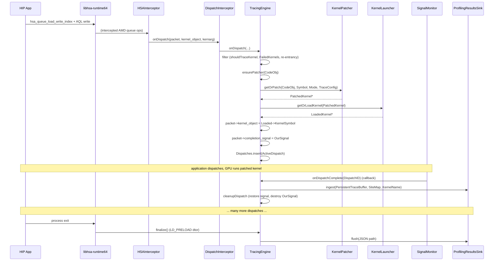
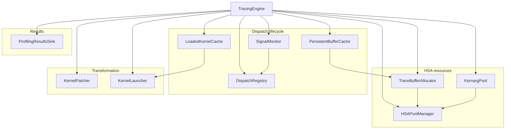

# AegisBit Architecture

Reference for the current (post-Phase 4 refactor) shape of the codebase.
Describes directory layout, component responsibilities, the end-to-end
dispatch flow, and the lifecycle/threading model.

This is not a user guide — see `README.md` for how to run AegisBit.

**If you're onboarding to the codebase, read `docs/ONBOARDING.md` first.**
It covers vocabulary, conceptual model, key data types, build/test
commands, common task recipes, and non-obvious invariants. This
document is the deeper reference it cross-links to.

---

## 1. What AegisBit does

AegisBit is a binary-instrumentation GPU profiler for AMD CDNA GPUs
(gfx942 / gfx950). It attaches to a HIP process via `LD_PRELOAD`,
intercepts every HSA kernel dispatch, and — for kernels selected by the
runtime config — replaces the dispatched code object with a
trampoline-patched copy that records per-site memory-access metadata
(VMEM cache-line coalescing, LDS bank conflicts) into GPU-visible
buffers. On dispatch completion, the recorded data is analyzed and
accumulated into per-kernel summaries that are flushed to JSON at
process shutdown.

The original kernel is **not** rewritten in place: the patcher produces
a fresh ELF with an instrumented `.text`, loads it as a sibling kernel,
and swaps `packet->kernel_object` in the HSA dispatch packet before the
packet is enqueued.

---

## 2. Top-level directory layout

```
include/aegisbit/   Public-ish headers, one per component.
src/
  intercept/        LD_PRELOAD + HSA/dispatch interception.
  runtime/          TracingEngine and its extracted components.
  codeobj/          ELF/code-object parsing and note metadata.
  disasm/           LLVM-MC disassembly + instruction builder.
  analysis/         CFG, site selection, coalescing, scratch regs.
  transform/        Trampoline strategies, islands, ISA encoding.
  codegen/          Payload compilation (AccVGPR spill snippets).
  fixup/            Descriptor updater (kernel descriptor fields).
  launch/           KernelLauncher (HSA code-object load).
test/
  unit/             GoogleTest units (most are HSA-free today).
  integration/      On-GPU integration tests.
  e2e/              End-to-end Python-driven scenarios.
docs/               Investigation notes + this document.
```

Within each `src/` subtree, files map 1:1 with headers in
`include/aegisbit/`, so grepping for a class name locates both the
declaration and the implementation.

---

## 3. Layered dependency model

The dependencies form a layered DAG (top depends on bottom):

```
┌──────────────────────────────────────────────────────────┐
│ intercept/        LD_PRELOAD, HSA API hooks              │   ← process entry
│   HSAInterceptor, DispatchInterceptor                    │
├──────────────────────────────────────────────────────────┤
│ runtime/          TracingEngine (coordinator)            │
│   + extracted components (HSAPoolManager, KernargPool,   │
│     TraceBufferAllocator, PersistentBufferCache,         │
│     DispatchRegistry, SignalMonitor, LoadedKernelCache,  │
│     ProfilingResultsSink, KernelPatcher,                 │
│     InstrumentationPlanner, RuntimeConfig)               │
├──────────────────────────────────────────────────────────┤
│ launch/           KernelLauncher (load patched ELF)      │
│ fixup/            DescriptorUpdater                      │
│ transform/        TrampolineBridge, strategies, emitters │
│ codegen/          PayloadCompiler                        │
├──────────────────────────────────────────────────────────┤
│ analysis/         CFGBuilder, SiteAnalyzer,              │
│                   CoalescingAnalyzer, ScratchRegisters,  │
│                   SourceMapper                           │
│ disasm/           Disassembler, InstructionBuilder       │
│ codeobj/          CodeObjectHandler, CodeObjectParser,   │
│                   NoteMetadataHandler                    │
├──────────────────────────────────────────────────────────┤
│ Types.h, Endian.h — shared POD types                     │
└──────────────────────────────────────────────────────────┘
```

No upward edges. Every cross-layer include is explicit in the
`#include` list at the top of each file, and `include/aegisbit/` is the
only public include root.

---

## 4. End-to-end dispatch flow



Key per-site invariants:

- Buffer addresses are baked into the instrumented trampoline as
  immediates. No kernarg extension is needed; the original kernarg
  passes through unchanged.
- `PersistentBufferCache` guarantees one buffer per kernel *name* — it
  is reused across dispatches, with the counter reset per dispatch.
- `DispatchRegistry` assigns a monotonic `uint32_t DispatchID`;
  `SignalMonitor` polls completion signals in a background thread and
  invokes a callback on the engine when one fires (or times out).
- `onDispatchComplete` does **no HSA work itself** — all analysis happens
  inside `ProfilingResultsSink::ingest`, and HSA cleanup (signal
  destroy) happens in `cleanupDispatch`.

---

## 5. TracingEngine and its extracted components

`TracingEngine` (`src/runtime/TracingEngine.cpp`, 622 lines) is a
singleton coordinator. It owns an instance of every extracted component
and wires them together in `initialize()`:



| Component | File | Responsibility |
|---|---|---|
| `HSAPoolManager` | `runtime/HSAPoolManager.cpp` | One-shot discovery of GPU agent + kernarg + fine-grained HSA pools. `std::call_once`-gated. |
| `TraceBufferAllocator` | `runtime/TraceBufferAllocator.cpp` | `allocate(size) → {buf, counter, actual_size, supportsGPUAtomics}` with fine-grained → kernarg pool fallback. |
| `KernargPool` | `runtime/KernargPool.cpp` | Pre-allocated small kernarg buffer pool populated on a background thread to avoid HSA allocs on the dispatch hot path. |
| `PersistentBufferCache` | `runtime/PersistentBufferCache.cpp` | Per-kernel `PersistentTraceBuffer` cache. One buffer per kernel name, reused across dispatches. |
| `DispatchRegistry` | `include/aegisbit/DispatchRegistry.h` | Atomic `DispatchID` counter + thread-safe `ActiveDispatch` map with `insert / take / forEach / drainAll`. |
| `SignalMonitor` | `runtime/SignalMonitor.cpp` | Background thread polling HSA completion signals; fires `CompletionCallback` / `TimeoutCallback` on the engine. |
| `LoadedKernelCache` | `runtime/LoadedKernelCache.cpp` | Handle-only cache keyed by `(CodeObjectId, KernelObject, Mode)` of loaded patched kernels. No HSA-freeing dtor — safe at shutdown. |
| `ProfilingResultsSink` | `runtime/ProfilingResultsSink.cpp` | Thread-safe accumulator for VMEM/LDS summaries + `ingest(PB, SiteMap, Name)` that interprets buffer layout per `PayloadStrategy`. Single lock-free `flush(path)` at shutdown. |

### What `TracingEngine` still owns directly

After Phase 4, `TracingEngine.cpp` contains only:

- Singleton access (`getInstance`), `initialize()` / `finalize()` /
  dtor lifecycle.
- `onDispatch`: re-entrancy guard, kernel filters, lazy patcher init
  via `ensurePatcher`, buffer/patch pipeline, tail call to
  `launchProfilerDispatch`.
- `launchProfilerDispatch`: MEMORY_ONLY fast path — load/swap kernel
  object, create completion signal, honor `AEGISBIT_SKIP_SIGNAL`,
  register `ActiveDispatch`.
- `onDispatchComplete`: 14 lines — `Dispatches.take` → `Sink.ingest` →
  `cleanupDispatch`.
- `cleanupDispatch`: signal restore + destroy. Skips all HSA calls
  during finalize (runtime may be torn down).
- `lookupKernelSymbol`, `getOrAllocPersistentBuffer`,
  `getOrLoadKernel`: thin pass-throughs.
- Stats (`Stats` struct + mutex).

### Shutdown ordering (preserved exactly across the refactor)

`TracingEngine::finalize()` tears down in this order:

1. `Kernargs.joinInit()` — wait for the background kernarg pool init
   thread so `hsa_*` calls below don't race.
2. `SignalMon->stop()` — request thread exit, join.
3. `Dispatches.drainAll()` → `cleanupDispatch(d, DuringFinalize=true)`
   for each — skips HSA calls.
4. `KernelCache.clear()` / `PersistBuffers.clear()` /
   `Kernargs.clear()` — drop handles only; do **not** call
   `hsa_amd_memory_pool_free`. Calling HSA here during
   `__cxa_finalize` corrupts glibc heap metadata. The OS reclaims GPU
   memory at process exit.
5. `Results.flush(path)` — write JSON.

The handle-only caches and the "don't free" semantics are explicit
design choices, documented in each component's header.

---

## 6. Patching pipeline (`KernelPatcher`)

`KernelPatcher::patchKernel` is the instrumentation pipeline. After
Phase 2 it's decomposed into file-local stages threaded through a
`PatchContext` aggregate:

```
loadCodeObject        CodeObjectHandler::loadFromBytes
     ↓
extractKernel         CodeObjectParser, NoteMetadataHandler
     ↓
buildCFG              CFGBuilder + Disassembler
     ↓
planInstrumentation   InstrumentationPlanner → InstrumentationPlan
     ↓
allocateScratch       ScratchRegisters::fromDescriptor* + refineScratchVGPRs
     ↓                + setupAccVGPRSpill / setupScratchSpill
findSites             SiteAnalyzer → InstrumentationSite[]
     ↓
sortSites + applyMaxSitesLimit
     ↓
maybeUpgradeToSwapPC  SwapPC eligibility check (JumpHeuristics)
     ↓
applyPreKernelPadding (for long-jump islands)
     ↓
buildBridge           TrampolineBridge + chosen TrampolineStrategy
     ↓
assemblePatchedText   stitched .text with trampoline islands
     ↓
applyDescriptorAndRebuildELF  DescriptorUpdater
     ↓
buildSiteMap          SourceMapper (DWARF) → SiteInfo[]
     ↓
PatchedKernel (cached in KernelPatcher::PatchedCache)
```

Each stage has a typed interface and is unit-testable; see
`test/unit/KernelPatcherGTest.cpp`.

### Trampoline strategies

`TrampolineBridge` (`src/transform/TrampolineBridge.cpp`, 265 lines) is
a thin coordinator. The actual trampoline construction is behind the
abstract `TrampolineStrategy` interface
(`src/transform/TrampolineStrategy.h`):

| Strategy | File | When it's chosen |
|---|---|---|
| `SharedBodyStrategy` | `transform/SharedBodyStrategy.cpp` | `s_call_b64`-based shared-body trampolines. Default for gfx942. |
| `SwapPCSharedBodyStrategy` | `transform/SwapPCSharedBodyStrategy.cpp` | `s_swappc_b64`-based; chosen when eligible (sufficient SGPR pair free, body fits). |
| `AdaptiveStrategy` | `transform/AdaptiveStrategy.cpp` | Per-site decision between direct body and relay stub with overflow bookkeeping. |

`BridgeHelpers` (`transform/BridgeHelpers.{h,cpp}`) factors out shared
helpers (dispatch table construction, island alignment, body-size
precomputation) so strategies don't duplicate logic.

---

## 7. Runtime configuration

Every `AEGISBIT_*` environment variable is parsed once in
`RuntimeConfig::initialize()` and exposed as a typed field on either
`RuntimeConfig::Debug` (`DebugFlags`) or `RuntimeConfig::Transform`
(`TransformFlags`). Call sites read the parsed field, never `::getenv`.

- `Debug.*` — diagnostic knobs: `LOG`, `DUMP_INPUT_ELF`, `DUMP_ELF`,
  `DUMP_BLOBS`, `MAX_SITES`, `MAX_LDS`, `SKIP_LDS_FIRST`,
  `SKIP_SIGNAL`, `GPU_FILTER`, `BODY_SITE_ONLY`, `MAX_BODY_SITES`.
- `Transform.*` — codegen / trampoline knobs: `FORCE_RELAY`,
  `FORCE_SWAPPC`, `MINIMAL_RELAY`, `NOP_RELAY`, `VCC_ONLY_RELAY`,
  `NO_BODY_JUMP`, `NOOP_TRAMPOLINE`, `SBRANCH_BODY`, `ACCVGPR_SPILL`,
  `BODY_NEAR_STUBS`, `DRY_PAYLOAD`, `COUNT_MODE`, `STRATEGY`.

`RuntimeConfig::log(msg)` is the single logging entry point and gates
on `Debug.LogLevel`. No `llvm::errs()` or `std::cerr` on hot paths.

Tests use `RuntimeConfigOverride` (`test/unit/support/`) to install a
config, run a lambda, and restore — no `setenv` from tests.

---

## 8. Threading model

Three threads touch runtime state:

1. **Main / app thread.** All `onDispatch` callbacks arrive here.
   Every dispatch-path mutation is serialized by the HSA queue write
   protocol; we add internal mutexes on state shared with the monitor
   (`FailedKernels`, `StatsMutex`, caches).
2. **`KernargPool` init thread.** Spawned lazily on first dispatch.
   Pre-populates the kernarg buffer pool so the hot path doesn't block
   on `hsa_amd_memory_pool_allocate`. Joined in `finalize()`.
3. **`SignalMonitor` thread.** Polls HSA completion signals from
   `DispatchRegistry`. Invokes `CompletionCallback` / `TimeoutCallback`
   on completion/timeout. Does not hold `Dispatches`' lock while
   running callbacks (`forEach` snapshots keys; `take` atomically
   removes). Stopped in `finalize()` before any HSA cleanup.

All extracted components are internally thread-safe; `TracingEngine`
does not take a coarse engine-wide lock.

---

## 9. Testability

Most analysis/transform code is HSA-free and directly unit-testable:

- `analysis/` — pure algorithms, tested with synthetic CFG + site
  fixtures (`test/unit/CFGGTest.cpp`, `test/unit/SiteAnalyzerGTest.cpp`,
  `test/unit/CoalescingAnalyzerGTest.cpp`,
  `test/unit/ScratchRegistersGTest.cpp`).
- `transform/` — each trampoline strategy has its own unit test
  (`test/unit/TrampolineBridgeGTest.cpp`).
- `codeobj/`, `disasm/` — tested with recorded ELF fixtures from
  `test/unit/fixtures/`.
- `runtime/` (HSA-touching components) — currently tested at
  integration level only. Making these unit-testable is the one
  outstanding Phase 4 item (see `docs/future-work.md` — `IHSARuntime`
  abstraction + `MockHSARuntime`).

GPU-dependent tests live under `test/integration/` and require a CDNA
device; they are skipped automatically on CI hosts without one.

---

## 10. Pointers for navigating the code

- Starting from an HSA dispatch: `src/intercept/HSAInterceptor.cpp` →
  `src/intercept/DispatchInterceptor.cpp` → `TracingEngine::onDispatch`.
- Starting from a patched ELF: `KernelPatcher::patchKernel` → stage
  helpers in the same file → `TrampolineBridge::buildInstrumented` →
  strategy `build` → `TrampolineEmitter`.
- Starting from a profiling JSON line: `ProfilingResultsSink::flush` →
  `CoalescingAnalyzer::writeJSON`.
- Starting from an env var: grep `RuntimeConfig::initialize` in
  `src/runtime/RuntimeConfig.cpp` for the single parse point.

---

## 11. See also

- `docs/ONBOARDING.md` — fast-start: vocabulary, data model, build/test
  commands, common task recipes, invariants. **Read first** if you're
  new to the codebase.
- `README.md` — user-facing build + run instructions.
- `docs/PAD_ISLAND_ARCHITECTURE.md` — details of trampoline island
  placement.
- `docs/future-work.md` — deferred follow-ups, including the
  `IHSARuntime` abstraction that completes Phase 4.
- `docs/body-island-bug-investigation.md`,
  `docs/investigation-zerosGPR-flash-attn-errors.md` — bug
  post-mortems; useful context on the trampoline / descriptor corners.
