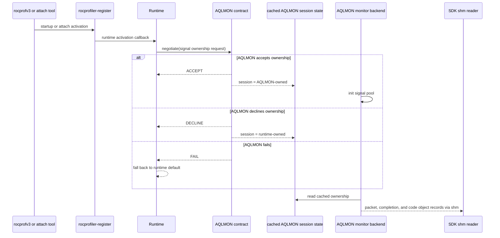
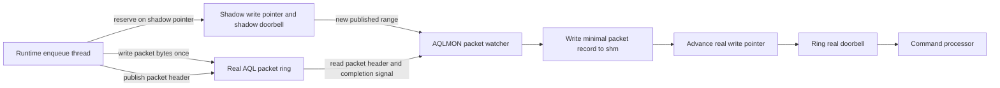
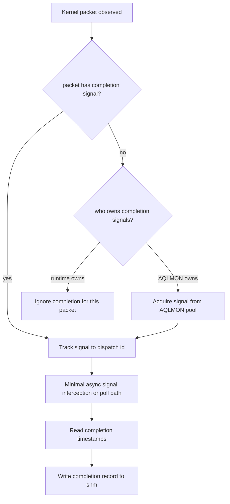
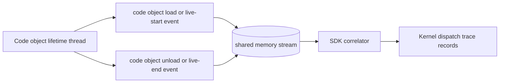
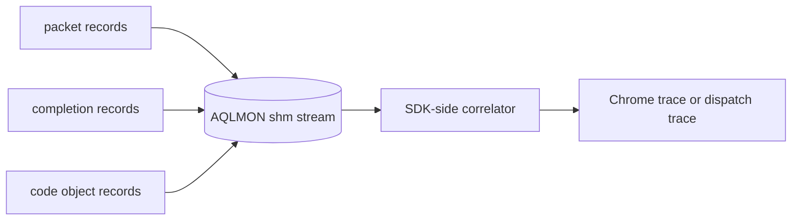

# AQLMON Full Design

## Goal

Provide low-overhead kernel dispatch tracing by pushing the minimum useful packet, completion, and
code-object-lifetime data into a shared-memory stream that an SDK-side correlator can consume.

In the target design, that shared-memory consumer is `rocprofiler-sdk`. The local reader and trace
export samples in this directory exist only to validate the transport while the SDK integration is
still under construction.

The target design is driven by four constraints:

1. minimum time before enqueue/publication
2. minimum time in async signal-handler interception
3. no packet copying or queue-ring replacement
4. simple correlation in one shared-memory stream

This document describes the full target design for the draft PR. The current branch implements only
the first slice of that design.

## Design Summary

The design introduces a new linked library layer named `AQLMON`.

- `rocprofiler-register` stays generic and only tells runtimes that a tool is active
- runtimes link a small `AQLMON` contract library
- when tool activation happens, the runtime calls `AQLMON` once to negotiate completion-signal
  ownership
- `AQLMON` replies with one of three outcomes:
  - accept
  - decline
  - fail
- if `AQLMON` accepts ownership, `AQLMON` initializes and uses its own completion-signal pool
- if `AQLMON` declines, the runtime keeps ownership and `AQLMON` only observes packets that
  already carry completion signals
- packet records, completion records, and code-object lifetime records all go to the same
  shared-memory stream

Ownership is the canonical language for the full design:

- `accept` means `AQLMON` owns completion signals for the session
- `decline` means the runtime owns completion signals for the session
- `fail` means negotiation failed and the runtime falls back safely

The current branch still uses a smaller POC vocabulary for the same decision:

- `monitor-provided` is the current stand-in for `accept`
- `runtime-provided` is the current stand-in for `decline`

The queue path does not copy packets and does not replace the packet ring. It uses a shadow
write-pointer model:

- the runtime sees a shadow write pointer and shadow doorbell watermark
- the runtime writes packet bytes once into the real ring memory
- `AQLMON` observes the packet, dumps the minimum packet data, then advances the real write pointer
- CP only learns about the packet after `AQLMON` has seen it

## Activation And Ownership Negotiation

### Contract Rules

The contract is intentionally generic and runtime-facing.

- `rocprofiler-register` does not embed `AQLMON` policy
- the runtime asks `AQLMON` whether `AQLMON` wants to own completion-signal management
- the runtime does not unilaterally decide who owns signals for a tool session
- the answer is cached once for the session and then reduced to a cheap fast-path mode bit

Target response semantics:

- `ACCEPT`
  `AQLMON` owns completion signals for this session
- `DECLINE`
  the runtime owns completion signals for this session
- `FAIL`
  negotiation failed and the runtime should fall back safely

The runtime depends only on the small contract library. The heavy monitor backend consumes the same
cached session decision, but it is not part of the runtime link contract.

## Queue Publication Model

The design does not copy or move queue packets.

- packet bytes are written once, by the runtime, into the real AQL packet ring
- the only shadowed state is the producer-visible write pointer and doorbell watermark
- the real write pointer and real doorbell remain hidden from the runtime-facing path until
  `AQLMON` has observed the packet

### Important Non-Goals

This design explicitly does not do any of the following:

- no packet copy to a second queue ring
- no queue packet move
- no synthetic packet buffer for the common path
- no broad queue interception that changes the packet ring memory itself

The only delayed publication mechanism is the shadow write-pointer approach.

## Minimal Enqueue Path Work

The enqueue path must remain as close as possible to normal runtime behavior.

On the hot path, `AQLMON` should only do the minimum:

- observe the packet once it becomes visible through the shadow write-pointer path
- read the packet header
- read the completion signal field
- dump the minimum packet metadata into shared memory
- advance the real write pointer after observation

Operational constraints for this path:

- no allocation
- no syscall
- no mutex
- no symbol lookup
- no code-object lookup
- fixed-size record reservation only
- contiguous batch publication only

The enqueue path should not:

- copy packet bodies
- resolve symbols
- do code-object lookups
- do broad shared-state locking
- do expensive time queries per packet if they are not required

## Completion Signal Ownership Paths

### If `AQLMON` Owns Completion Signals

`AQLMON` initializes its own signal pool and uses it only when required.

- pool initialization happens once, outside the packet hot path
- packet-side work is limited to selecting a signal and associating it with the dispatch
- the signal pool path exists so runtimes can decline ownership or fail negotiation
- no signal create or destroy on packet submission
- no per-dispatch async-handler registration on packet submission
- no heap-backed tracker allocation on packet submission

### If The Runtime Owns Completion Signals

This is the preferred low-overhead path when the runtime can already provide completion signals.

- `AQLMON` only observes packets that already contain a completion signal
- `AQLMON` ignores zero-signal packets in this mode
- `AQLMON` does not need to mutate those packets
- completion timestamps come from the runtime-owned signal path
- the runtime must use a completion-signal-only fast path and must not enable broader per-dispatch
  profiling work just to satisfy `AQLMON`

## Minimal Async Signal-Handler Work

The second hard rule is minimum time in the async signal path.

So the async completion path should only do the minimum:

- identify the signal
- identify the correlated dispatch id
- read the completion timestamps
- push a completion record into shared memory

It should not:

- do symbolization
- resolve code objects
- walk large maps
- do per-callback heap allocation
- do broad locking

If the runtime owns the signal path, `AQLMON` should intercept that path as lightly as possible:

- no allocation
- no symbol resolution
- no code-object lookup
- no heavyweight correlation work beyond the dispatch key and timestamp capture
- token-only handler work where possible

If `AQLMON` owns the signal path, it should keep the same rule and push any heavier work to a
separate collector thread.

Default policy:

- a dedicated collector or poller thread should be the common completion path
- intercepted async handlers should stay token-only and should not become the primary heavy
  correlation path

## Code Object Lifetime Monitoring

Code object lifetime is tracked in parallel with packet and completion activity.

The design goal is one correlation stream:

- packet record
- completion record
- code object live-start record
- code object live-end record

That keeps the SDK correlator simple.

## Watcher Policy

The watcher thread sits on the delayed-publication path, so its behavior must be explicit.

- it publishes only contiguous committed packet ranges
- it batches real write-pointer updates and real doorbells
- it never publishes reserved-but-not-ready slots
- it should use a dedicated polling thread rather than pushing work back onto runtime submit
  threads

## Shared-Memory Stream

The shared-memory stream is the handoff into the SDK.

Required correlation keys are intentionally basic:

- `pid`
- `dispatch_id`
- queue identity
- completion-signal identity where applicable
- code-object identity

The goal is low-overhead capture first and richer resolution later.

## Current Branch Scope

This draft branch does not yet implement the full design above.

What exists now:

- generic runtime activation callback support in `rocprofiler-register`
- a linked `AQLMON` runtime contract library
- HIP/CLR as the first runtime example
- a per-kernel fast-path bit in HIP/ROCclr to request runtime-provided completion signals
- the current preload monitor consuming that POC mode decision

What still remains to reach the full design:

- real end-to-end tool activation flow instead of a preload-only validation launcher
- full `ACCEPT / DECLINE / FAIL` session semantics in the public contract shape
- the complete shadow write-pointer publication path polished for production
- minimal runtime-owned async handler interception for completion timestamps
- the monitor-owned signal-pool path integrated with the negotiated ownership contract
- code-object lifetime monitoring integrated into the same production stream
- SDK-side shared-memory integration beyond the basic sample reader

## Why This Draft PR Exists Now

The draft PR is intended to carry two things together:

1. the target design, clearly documented
2. the first implementation slice that proves the generic activation and runtime-negotiation
   direction

That allows the design to be reviewed now while the remaining implementation work continues on the
same branch.
