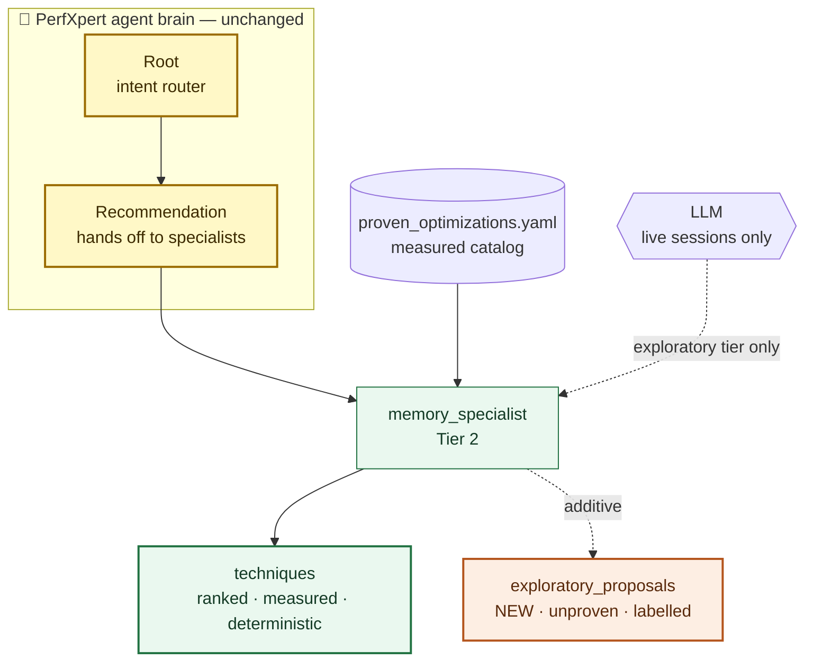
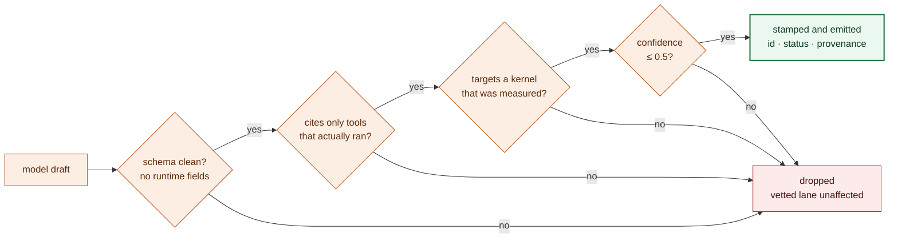

# Demoing Bounded Specialist Creativity

A 10-minute walkthrough for showing another engineer what the exploratory
proposal lane does and why it is safe. It needs **no API key, no GPU, and no
network** — the demo scripts a hostile model in place of a provider, so it
prints the same thing every time.

For the concepts, see
[Bounded specialist creativity](bounded-specialist-creativity.md).

## Open with the tension

> PerfXpert recommends GPU optimizations that engineers act on, so its advice
> comes from a catalog of techniques someone measured. We want the model to
> suggest something *not* in that catalog — without it ever passing that
> suggestion off as measured.

## 1. How the architecture is extended

Start from the hierarchy your audience already knows
([agent-hierarchy.md](../architecture/agent-hierarchy.md)): Root routes, the
Tier-1 agents own classification and strategy, and four Tier-2 specialists own
performance domains. **None of that changes.** The feature adds one output to
Tier-2 specialists and nothing else:



The point to land: the model does not sit *between* the catalog and the
advice. It hangs off the side, feeding a second output that never merges with
the first.

## 2. What happens inside a specialist

The ordering is the safety property. The vetted answer is finished *before*
anything considers calling a model:

```mermaid
flowchart TD
  classDef det fill:#eaf8ef,stroke:#227343,color:#143b26,stroke-width:1px
  classDef gate fill:#fff4d8,stroke:#a66a00,color:#4a3100,stroke-width:1px
  classDef added fill:#fdeee3,stroke:#b4551d,color:#5a2a0c,stroke-width:1px

  start(["run_memory_specialist"])
  rank["rank catalog · attach predictions"]
  frozen["techniques · confidence · citations<br/>FROZEN — no model input"]
  tier{"tier == exploratory?<br/>config AND live AND capability"}
  call["one bounded model call"]
  check["validate drafts against evidence"]
  out(["output"])

  start --> rank --> frozen --> tier
  tier -- "no — the default" --> out
  tier -- yes --> call --> check -.-> out

  class rank,frozen det
  class tier gate
  class call,check added
```

Two things worth saying out loud. Under the default `strict` tier the
specialist returns at that gate and **never calls the model at all** — this
costs nothing until you ask for it. And because the vetted fields are already
frozen upstream of the call, a provider that returns garbage cannot reach
them.

## 3. Run the demo

```bash
# SKIP-SAMPLE — run from the perfxpert project root
cd experimental/python/perfxpert
python scripts/demo_bounded_creativity.py
```

About a second. Six steps:

| Step | What it shows |
|---|---|
| 1 | Default config: hostile model returns invented techniques at 0.99 confidence — output is pure catalog, no proposals |
| 2 | Exploration on: proposal appears, `status: exploratory`, confidence 0.4 against a 0.5 ceiling, runtime-assigned id. **Vetted lane identical to step 1** |
| 3 | Four forged proposals, four rejections, advice never moves |
| 4 | Live output vs air-gap: every measured field identical |
| 5 | `proposals list / show / promote` |
| 6 | A proposal that tries to forge its own measurements |

## 4. Step 3 is the demo — the gauntlet

Every proposal runs this before it is allowed to exist:



Dwell on two answers here.

**The manifest is built from what the framework observed, not what the model
reports.** That's the difference between "the model says it called the
profiler" and "the runtime recorded a profiler call." The model cannot vouch
for itself.

**Over-confidence is rejected, not clamped.** A clamped proposal would look
exactly like an honest one, so refusing preserves the signal.

On the fourth case the framework's own rejection prints mid-demo:

```
framework: discarding MemoryTechniquesSpecialist output that failed
MemorySpecialistOutput validation: tool_calls Extra inputs are not permitted
```

That log line is the demo. The model tried to write the evidence record it
would later be judged against, and validation threw away the whole response.

## 5. Promotion, and why it refuses to finish

The script saves a result and prints three commands. Run them live. `promote`
emits a catalog entry that **deliberately fails validation**:

```
This entry is incomplete by design: measured_speedup_range,
source_citation, preconditions, fixture_pair still need real measurements.
```

Say: *promotion cannot be automated, because those four fields only exist once
a human ran the experiment. The tool scaffolds the entry and then stops —
that's the point where an unmeasured idea would otherwise quietly become
measured advice.*

## If they want proof rather than a demonstration

```bash
# SKIP-SAMPLE — run from the perfxpert project root
pytest tests/test_agents/test_specialist_lanes.py \
       tests/test_agents/test_lane_boundary_probes.py \
       tests/test_integration/test_airgap_parity.py \
       tests/test_cli/test_proposals_cmd.py -q
```

99 tests, about a second. The parity suite runs specialists under a hostile
model and asserts the vetted lane is byte-identical to air-gap; the boundary
probes assert the model cannot reach runtime-owned fields; the promotion tests
cover five YAML injection vectors.

Closing line: *the demo shows the model failing to get through. The tests are
what keep it failing.*

## Questions you will get

**"What if the idea is actually good?"** Someone runs the experiment and
`promote` scaffolds the catalog entry. The goal isn't to filter good ideas
out, it's to keep unmeasured ideas labelled until measurement happens.

**"Why can only Tier-2 specialists propose?"** Tiers 0 and 1 route and decide.
A model-influenced routing decision would move the deterministic core and
break air-gap parity. A specialist suggestion can only ever be additive.

**"What stops exploration shipping on by default?"** It is off by default,
requires a live session, and requires the agent to declare the capability. All
three must independently permit it.

## If you have two minutes

Run the script and show steps 3 and 4. A hostile model failing four times
while the advice never moves, and live output matching air-gap exactly, is the
whole idea.
