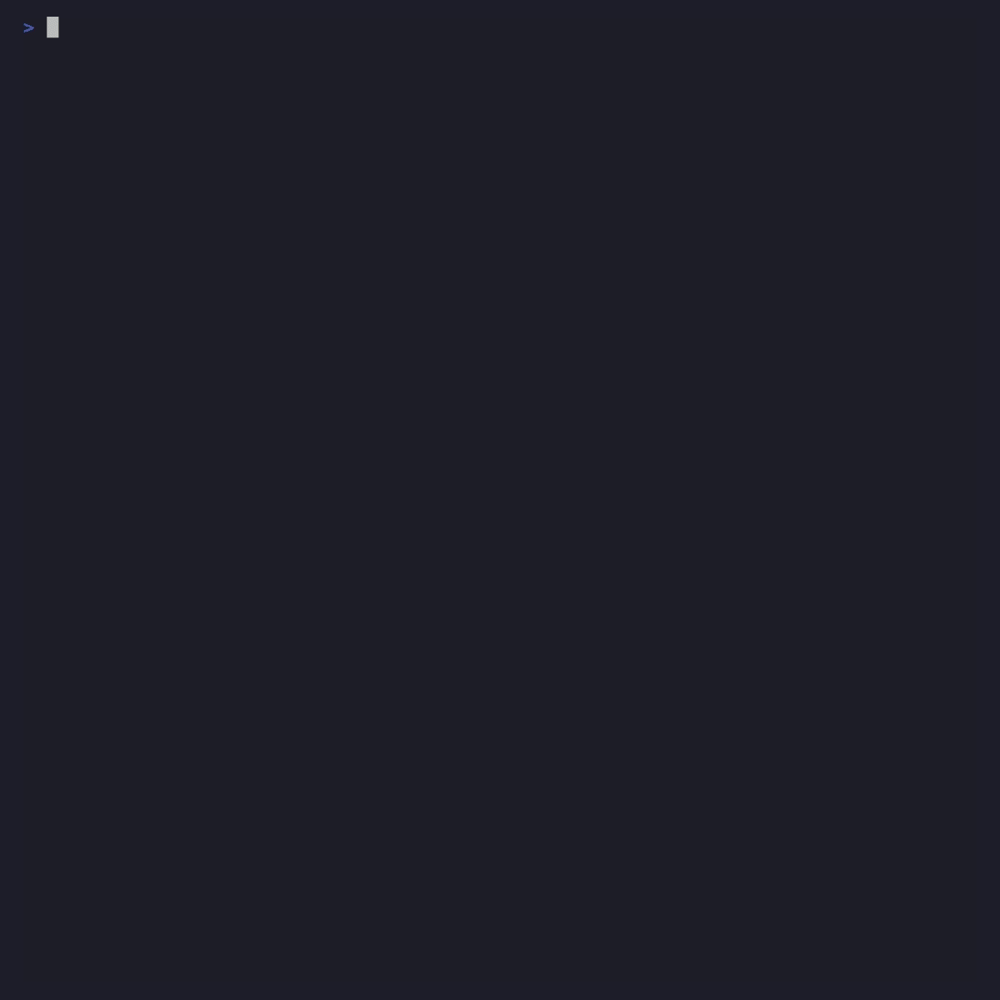
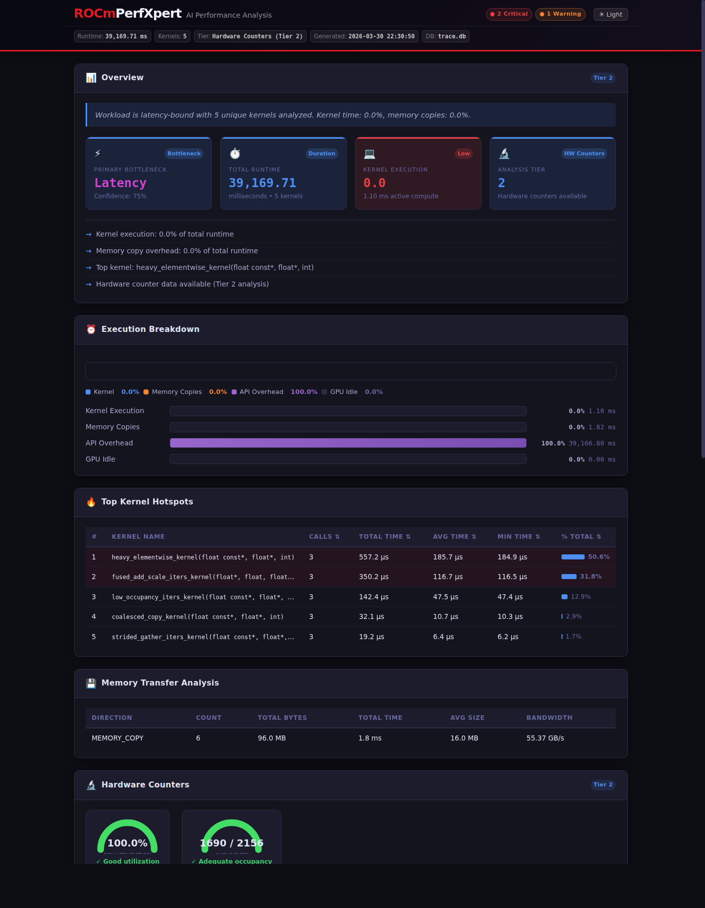

# PerfXpert Getting Started Guide

A visual, step-by-step guide to using PerfXpert for AMD GPU performance analysis. Each section includes an animated demo showing exactly what to type and what to expect.

---

## Overview

PerfXpert reads ROCPD GPU trace databases from any AMD profiling & tracing tool such as `rocprofv3` and turns raw profiling data into prioritized, actionable recommendations. It works across five analysis tiers — from static source scanning (no GPU needed) through instruction-level stall analysis.

The core workflow is: **Profile -> Analyze -> Optimize -> Verify**. PerfXpert's interactive mode automates this entire loop with AI-powered code editing.

---

## 1. Installation

Install PerfXpert with a single pip command. The `[all]` extra includes LLM support (Anthropic, OpenAI) and rich terminal output.

> **Run this FIRST on stock Ubuntu / rocm/dev-ubuntu images**: those
> images ship with pip 22.x and pre-PEP-621 setuptools, which fails the
> perfxpert wheel build with `filename has 'perfxpert', but metadata has
> 'unknown'`. The fix is a one-liner:
>
> ```bash
> pip install -U pip setuptools wheel
> ```
>
> The build requires `setuptools>=61` (declared in `pyproject.toml`'s
> `[build-system] requires`). Recent pip (23+) honors that declaration
> automatically; older pip does not.

```bash
pip install "perfxpert[all]"

# Or from source (development mode)
cd experimental/python/perfxpert && pip install -e ".[all]"

# Verify
perfxpert --version
```


**Supported GPUs**: MI100 (gfx908), MI200 series (gfx90a), MI300 series (gfx942), MI350 series (gfx950), RDNA2 (gfx1030), RDNA3 (gfx1100).

**Dependencies**: Core analysis is pure Python (zero deps). LLM extras add `anthropic` and `openai` SDKs. `rich` adds colored terminal output.

---

## 2. Quick Start: One-Shot Analysis

The simplest workflow is two commands: collect a trace with `rocprofv3`, then analyze it.

```bash
# SKIP-SAMPLE — illustrative; requires a real HIP binary and rocprofv3
# Step 1: Collect a system trace
rocprofv3 --sys-trace --kernel-trace --memory-copy-trace --stats \
  -d ./out -o results -- ./my_app

# Step 2: Analyze
perfxpert analyze -i ./out/results_results.db
```

The output shows a time breakdown (kernel / memcpy / overhead / idle), top kernels ranked by GPU time, and prioritized recommendations with specific actions.



### Output Formats

Generate reports in four formats:

```bash
# SKIP-SAMPLE — requires a real trace.db
# Text (default) — for terminals and logs
perfxpert analyze -i trace.db

# JSON — for CI/CD pipelines
perfxpert analyze -i trace.db --format json -d ./out -o analysis

# Markdown — for pull requests and docs
perfxpert analyze -i trace.db --format markdown -d ./out -o analysis

# Webview — self-contained interactive HTML
perfxpert analyze -i trace.db --format webview -d ./out -o analysis
```


The webview generates a self-contained HTML file with the AMD dark theme, SVG gauge charts, collapsible recommendation cards, and a light/dark mode toggle:



---

## 3. Tier 0: Source Code Scanning

Analyze your source code before profiling — no GPU or trace database needed.

```bash
# SKIP-SAMPLE — requires a ./my_app source tree and/or trace.db
# Scan source directory
perfxpert analyze --source-dir ./my_app

# Combined: source scan + trace analysis
perfxpert analyze -i trace.db --source-dir ./my_app
```

PerfXpert scans `.hip`, `.cpp`, `.cu`, `.cl`, `.py`, `.h`, `.hpp` files and detects:
- GPU kernel definitions and launch patterns
- Memory operations (hipMemcpy, hipMemcpyAsync)
- Synchronization points (hipDeviceSynchronize)
- Stream usage (or lack thereof)
- Framework usage (PyTorch, JAX, TensorFlow)
- ROCTx markers

The output includes a profiling plan with the exact `rocprofv3` command to run, with counters pre-selected based on what was found in the source.


---

## 4. Agentic TUI Workflow (The Star Feature)

The agentic TUI automates the full optimization loop: profile, analyze,
AI-edit code, recompile, re-profile, compare. As of v0.2.0 this is the
`perfxpert-code` command (AMD-themed bundled opencode TUI) — it wraps the
same agent runtime the batch-mode `analyze` CLI uses.

```bash
# SKIP-SAMPLE — requires bundled opencode binary on PATH
perfxpert-code
```

Inside the TUI you describe your workload in natural language
(e.g. "profile ./my_app and suggest optimizations"). The Root agent then
drives the Analysis → Recommendation → Specialist hierarchy behind the
scenes.

### What happens:

1. **Workload detection** — identifies your binary type (HIP, Python ML,
   MPI) and selects optimal profiling flags
2. **Profiling plan** — shows the generated `rocprofv3` command for your
   approval
3. **Profile run** — runs the profiler with real-time output streaming
4. **Analysis** — analyzes the trace, shows findings with AI-refined
   recommendations
5. **Recommendations menu** — address with AI, skip, or re-profile
6. **AI edit** — AI edits your source files using precise SEARCH/REPLACE
   blocks (see Gate Cascade doc for correctness guarantees)
7. **Re-profile** — re-profile with the optimized code and compare


### AI Code Editing

When the agent applies an optimization, the LLM generates targeted code
changes as SEARCH/REPLACE blocks — not full-file rewrites. This prevents
truncation on large files and makes the diff easy to review:

```
<<<<<<< SEARCH
    for(int i = 0; i < CHUNKS; i++) {
        HIP_CHECK(hipMemcpy(d_in + i * chunk, ...));
    }
=======
    HIP_CHECK(hipMemcpyAsync(d_in, h_in.data(),
                 N * sizeof(float),
                 hipMemcpyHostToDevice, stream1));
>>>>>>> REPLACE
```

If the edit causes compilation errors, the Correctness agent reverts the
change automatically; see `docs/architecture/gate-cascade.md` for the full
5-gate correctness/regression contract.

---

## 5. MPI Multi-GPU Profiling

PerfXpert auto-detects MPI launchers and restructures the profiling command so each rank gets its own profiler instance.

```bash
# SKIP-SAMPLE — requires a built MPI application + openmpi
# Batch-mode analyze that profiles an MPI workload end-to-end
perfxpert analyze \
  --llm anthropic \
  --source-dir ./src \
  --run "mpirun -n 8 ./multi_gpu_demo"
```

Inside `perfxpert-code` you can describe the same workload in natural
language ("profile mpirun -n 8 ./multi_gpu_demo") and the Analysis agent
will drive the same detection logic.

The tool:
- Detects `mpirun`/`srun`/`jsrun` and wraps each rank: `mpirun -n 8 rocprofv3 <flags> -- ./binary`
- Uses `%nid%` per-rank output naming to avoid SQLite collisions
- Auto-merges all per-rank databases into a single `merged_processes.db`
- Analyzes the unified trace across all GPUs


> **Note**: `--process-sync` (used for Python DDP/torchrun) is NOT used for MPI because OpenMPI strips LD_PRELOAD from child processes. PerfXpert handles this automatically.

---

## 6. LLM Providers

Five LLM providers are supported. LLM is optional — all analysis runs locally without internet.

```bash
# SKIP-SAMPLE — requires a real trace.db and LLM credentials
# Anthropic Claude
export ANTHROPIC_API_KEY="sk-ant-..."
perfxpert analyze -i trace.db --llm anthropic

# OpenAI
export OPENAI_API_KEY="sk-..."
perfxpert analyze -i trace.db --llm openai --llm-model gpt-4o

# Private endpoint (any OpenAI-compatible server)
export PERFXPERT_LLM_PRIVATE_URL="https://llm.corp.internal/v1"
export PERFXPERT_LLM_PRIVATE_MODEL="llama-3-70b"
perfxpert analyze -i trace.db --llm private

# Local Ollama (air-gapped, zero internet)
perfxpert analyze -i trace.db --llm local
```


**Privacy**: When LLM is enabled, sensitive data is sanitized before transmission — kernel names, grid sizes, and file paths are redacted. Only aggregated metrics and bottleneck classifications are sent.

---

## 7. Intelligence Features

PerfXpert goes beyond simple threshold rules with four intelligence features:

### Counter-Aware Recommendations

When hardware counters are in the trace, recommendations use actual GPU utilization instead of generic advice:

```
# With counters (GPU util 94%):
[HIGH] GPU utilization is 94.3% — kernel is compute-bound.
       Focus on algorithmic optimization: reduce transcendentals, use FMA.

# Without counters:
[HIGH] Profile this kernel with hardware counters to identify its bottleneck.
```

### Plateau Detection

After 2+ iterations with <2% improvement, the tool stops repeating and suggests escalation:

```
Optimization plateau detected: <1.2% change over 3 iterations
Consider deeper analysis: ATT (instruction stalls) or rocprof-compute (roofline)
(2 previously-seen recommendations suppressed)
```

### Init-Overhead Awareness

For short workloads where ROCm initialization dominates:

```
[INFO] Short workload (43ms) with 2.1% GPU compute — overhead is
       ROCm runtime initialization. GPU code is already well-optimized.
```

### LLM-Refined Recommendations

When an LLM is connected, rule-based recommendations are refined with full context — edit history, prior suggestions, and the AMD GPU reference guide:

```
AI-Refined Analysis (context-aware):
  Async streams already applied in prior edit. Next step: use ATT
  to identify which VALU instructions dominate the compute kernel.
```


---

## 8. ATT Tier 3: Instruction-Level Analysis

For the deepest analysis, collect an AMD Thread Trace to see per-instruction stall data:

```bash
# SKIP-SAMPLE — requires rocprof-trace-decoder + a real HIP binary
# Collect ATT trace
rocprofv3 --att \
  --att-library-path /opt/rocm/lib \
  --att-target-cu 0 \
  -d ./att_output -o trace -- ./my_app

# Analyze (auto-detects stats_*.csv alongside the .db)
perfxpert analyze -i ./att_output/trace*.db
```

The output classifies each high-stall instruction into bottleneck categories: VMEM latency, LDS bank conflict, dependency chain, or branch divergence.


In interactive mode, when plateau detection triggers, the `[t]` option builds the ATT collection command automatically.

---

## 9. Python API

The agentic runtime is available programmatically via `perfxpert.agents`:

```python
from pathlib import Path
from perfxpert.agents import runtime, schemas

session = runtime.build_session(airgap=True)  # or provider="openai"
out = session.run_root(
    schemas.RootInput(
        user_query="Analyze this GPU performance trace.",
        database_path=str(Path("trace.db")),
        airgap=True,
        session_id=session.session_id,
    )
)
print(out.primary_bottleneck)
print(out.narrative)
for rec in out.recommendations:
    print(f"[{rec.get('priority')}] {rec.get('title')}: {rec.get('description')}")
```


For the full air-gap vs LLM comparison, provider ladder, and CLI /
Python entry points, see
[../guides/agentic-mode.md](../guides/agentic-mode.md).

---

## 10. Fence Slices (Per-Agent System Prompts)

Agent behavior is shaped by small, single-purpose fence slices under
`perfxpert/agents/fence/`. There is one slice per agent (Root, Analysis,
Recommendation, Correctness, Compute/Latency/Memory specialists). Each
slice is ≤ 400 lines and loaded as that agent's system prompt at runtime.

See `docs/architecture/agent-hierarchy.md` for the full map and
`docs/contributing/tools.md` + CONTRIBUTING for the editing rules.

```bash
# SKIP-SAMPLE — illustrative
# View a single fence slice
cat experimental/python/perfxpert/perfxpert/agents/fence/analysis.md
```

Add company-specific guidelines to the relevant slice (Analysis for
triage rules, Recommendation for advice filters, etc.). Each edit is
enforced by CI length limits; break slices if they grow beyond 400 lines.


---

## 11. Session Persistence

Sessions auto-save inside `perfxpert-code` (AMD-themed opencode TUI). List
and resume from the same command:

```bash
# SKIP-SAMPLE — requires bundled opencode binary on PATH
# List prior sessions
perfxpert-code --list-sessions

# Resume by session id
perfxpert-code --resume <session-id>
```

The checkpoint system tracks every code edit. Gate cascade (see
`docs/architecture/gate-cascade.md`) enforces correctness and regression
bounds automatically on every accepted edit.


---

## Quick Reference

| Task | Command |
|---|---|
| Install | `pip install "perfxpert[all]"` |
| Analyze trace | `perfxpert analyze -i trace.db` |
| HTML report | `perfxpert analyze -i trace.db --format webview -d ./out -o report` |
| Source scan | `perfxpert analyze --source-dir ./src` |
| Agentic TUI | `perfxpert-code` |
| MPI profiling | `perfxpert analyze --source-dir ./src --run "mpirun -n 4 ./my_app"` |
| Resume session | `perfxpert-code --resume <session-id>` |
| ATT analysis | `perfxpert analyze -i att_output/trace*.db --att-dir ./att_output` |

---

*Generated for PerfXpert v0.2.0 — AMD ROCm AI-Powered GPU Trace Analysis*
