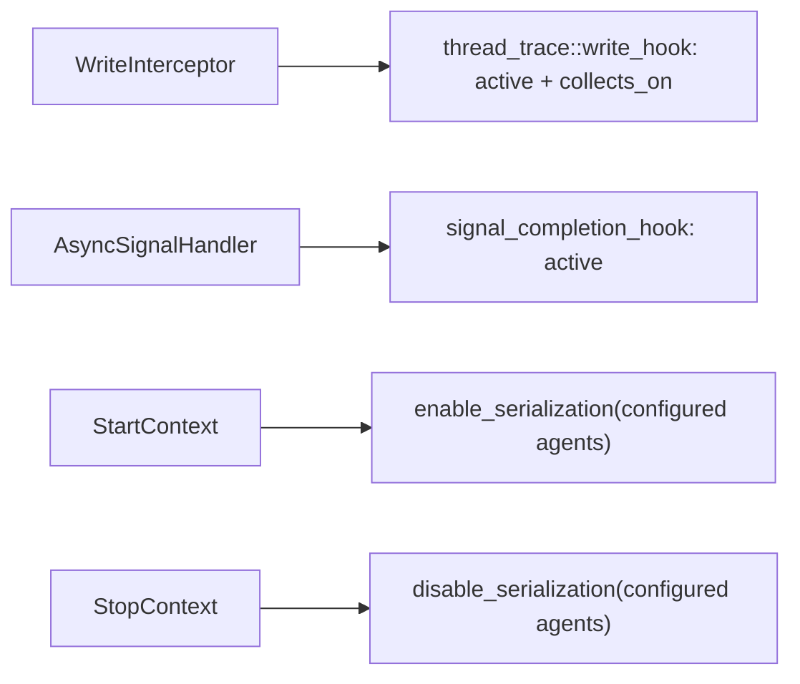

## Motivation

This PR isolates the thread-trace slice of the callback-removal effort (reference PRs #8730 / #8586) into a small, single-service change, per review guidance to land callback removal one service at a time.

### Underlying Problem

Dispatch thread trace (ATT) currently registers a `queue_callbacks_t` on every HSA queue. That hides “is this service active?” inside a per-queue map, makes enqueue and completion the same walk, and serializes every GPU while any dispatch ATT context is active.

This PR:

1. **Stops registering** dispatch ATT with that map. The write interceptor and async signal handler call explicit free functions instead (`thread_trace::write_hook`, `signal_completion_hook`, `is_any_active`).
2. **Scopes dispatch ATT to configured GPU agents** so disjoint agent sets can be active together; serialization is refcounted per agent and overlapping contexts conflict via `intersects()`.

Device thread trace is unchanged in its hook wiring; only dispatch ATT migrates here. The per-queue callback registry remains for counters, PC sampling, and SPM until those services land in their own PRs.

### Notes on Bigger Picture

Sibling migrations: counter collection (#8891), SPM (#8887), PC sampling (#8895).

Kernel replay (#7960, #8622) benefits from callback removal but this PR is independent and behavior-preserving on its own.

## Technical Details

**Both hooks iterate active contexts** (not registered). `post_kernel_call` self-filters by finding `THREAD_TRACE_CLIENT_ID`-tagged packets in `inst_pkt` via `dynamic_cast`, so routing differs from counter/SPM provenance via `packet_return_map`.

Permalinks pin to `d39785f`.

### Hooks and call sites

- Declarations: [queue_hooks.hpp](https://github.com/ROCm/rocm-systems/blob/d39785f/projects/rocprofiler-sdk/source/lib/rocprofiler-sdk/thread_trace/queue_hooks.hpp)
- Enter (`collects_on`, `THREAD_TRACE_CLIENT_ID`): [queue_hooks.cpp#L44-L69](https://github.com/ROCm/rocm-systems/blob/d39785f/projects/rocprofiler-sdk/source/lib/rocprofiler-sdk/thread_trace/queue_hooks.cpp#L44-L69)
- Exit (active contexts): [queue_hooks.cpp#L71-L85](https://github.com/ROCm/rocm-systems/blob/d39785f/projects/rocprofiler-sdk/source/lib/rocprofiler-sdk/thread_trace/queue_hooks.cpp#L71-L85)
- `is_any_active`: [queue_hooks.cpp#L87-L91](https://github.com/ROCm/rocm-systems/blob/d39785f/projects/rocprofiler-sdk/source/lib/rocprofiler-sdk/thread_trace/queue_hooks.cpp#L87-L91)
- `no_real_consumers` gate: [queue.cpp#L318-L322](https://github.com/ROCm/rocm-systems/blob/d39785f/projects/rocprofiler-sdk/source/lib/rocprofiler-sdk/hsa/queue.cpp#L318-L322)
- Enter call site: [queue.cpp#L632-L642](https://github.com/ROCm/rocm-systems/blob/d39785f/projects/rocprofiler-sdk/source/lib/rocprofiler-sdk/hsa/queue.cpp#L632-L642)
- Exit call site: [queue.cpp#L172-L179](https://github.com/ROCm/rocm-systems/blob/d39785f/projects/rocprofiler-sdk/source/lib/rocprofiler-sdk/hsa/queue.cpp#L172-L179)
- Batching disabled while active: [queue.cpp#L778-L779](https://github.com/ROCm/rocm-systems/blob/d39785f/projects/rocprofiler-sdk/source/lib/rocprofiler-sdk/hsa/queue.cpp#L778-L779)
- `start_context` / `stop_context` (no `add_callback`; serialization only): [core.cpp#L514-L533](https://github.com/ROCm/rocm-systems/blob/d39785f/projects/rocprofiler-sdk/source/lib/rocprofiler-sdk/thread_trace/core.cpp#L514-L533)
- `collects_on` / `intersects`: [core.cpp#L495-L512](https://github.com/ROCm/rocm-systems/blob/d39785f/projects/rocprofiler-sdk/source/lib/rocprofiler-sdk/thread_trace/core.cpp#L495-L512)
- Context conflict uses `intersects`: [context.cpp#L297-L303](https://github.com/ROCm/rocm-systems/blob/d39785f/projects/rocprofiler-sdk/source/lib/rocprofiler-sdk/context/context.cpp#L297-L303)
- Producer tag: [client_ids.hpp#L37-L40](https://github.com/ROCm/rocm-systems/blob/d39785f/projects/rocprofiler-sdk/source/lib/rocprofiler-sdk/hsa/queue_hooks/client_ids.hpp#L37-L40)

Per-agent scoping is configured via `rocprofiler_configure_dispatch_thread_trace_service` agent params (not a separate `set_agents` API). Agents are fixed at configure time.

## Reviewer Guide

1. Confirm **both** hooks use `get_active_contexts` ([queue_hooks.cpp#L57-L84](https://github.com/ROCm/rocm-systems/blob/d39785f/projects/rocprofiler-sdk/source/lib/rocprofiler-sdk/thread_trace/queue_hooks.cpp#L57-L84)). This differs from counters/SPM exit routing.
2. ATT-only runs still enter `WriteInterceptor` via `thread_trace::is_any_active()` ([queue.cpp#L318-L322](https://github.com/ROCm/rocm-systems/blob/d39785f/projects/rocprofiler-sdk/source/lib/rocprofiler-sdk/hsa/queue.cpp#L318-L322)).
3. `DispatchThreadTracer::start_context` does **not** call `add_callback` ([core.cpp#L514-L523](https://github.com/ROCm/rocm-systems/blob/d39785f/projects/rocprofiler-sdk/source/lib/rocprofiler-sdk/thread_trace/core.cpp#L514-L523)).
4. **`context::stop_context` clears the active slot before calling service stop** ([context.cpp#L378-L395](https://github.com/ROCm/rocm-systems/blob/d39785f/projects/rocprofiler-sdk/source/lib/rocprofiler-sdk/context/context.cpp#L378-L395)). Verify this is safe given active-only completion routing — does `post_kernel_call` still reach in-flight work?
5. No GPU drain in ATT stop; only `disable_serialization` ([core.cpp#L526-L533](https://github.com/ROCm/rocm-systems/blob/d39785f/projects/rocprofiler-sdk/source/lib/rocprofiler-sdk/thread_trace/core.cpp#L526-L533)).
6. `collects_on` before `pre_kernel_call` ([queue_hooks.cpp#L60-L61](https://github.com/ROCm/rocm-systems/blob/d39785f/projects/rocprofiler-sdk/source/lib/rocprofiler-sdk/thread_trace/queue_hooks.cpp#L60-L61)).
7. Disjoint ATT contexts: [per_agent_scoping_test.cpp](https://github.com/ROCm/rocm-systems/blob/d39785f/projects/rocprofiler-sdk/source/lib/rocprofiler-sdk/thread_trace/tests/per_agent_scoping_test.cpp) — `intersects`, disjoint start, serialization scope, write_hook agent filter.
8. Hook unit test is gate-only ([queue_hooks_test.cpp#L34-L37](https://github.com/ROCm/rocm-systems/blob/d39785f/projects/rocprofiler-sdk/source/lib/rocprofiler-sdk/thread_trace/tests/queue_hooks_test.cpp#L34-L37)); positive path relies on rocprofv3 ATT integration smoke.

**Answer:** Does ATT-only profiling still intercept dispatches? Does a GPU-1-only context leave GPU-0 unserialized? Can two disjoint ATT contexts start together? Is in-flight ATT completion safe after stop given active-only exit routing?

**Out of scope:** device ATT hook migration; deleting `Queue::_callbacks`; counters/SPM/PC-sampling migrations.

## Issue Tracking

AIPROFSDK-1016

## Test Plan

- [is_any_active gate](https://github.com/ROCm/rocm-systems/blob/d39785f/projects/rocprofiler-sdk/source/lib/rocprofiler-sdk/thread_trace/tests/queue_hooks_test.cpp#L34-L37)
- Per-agent unit tests ([per_agent_scoping_test.cpp](https://github.com/ROCm/rocm-systems/blob/d39785f/projects/rocprofiler-sdk/source/lib/rocprofiler-sdk/thread_trace/tests/per_agent_scoping_test.cpp))
- rocprofv3 ATT integration smoke (positive hook path)

## Test Result

Unit coverage as above. Treat the Checks tab as source of truth for CI.

## Submission Checklist

- [x] Look over the contributing guidelines at https://github.com/ROCm/rocm-systems/blob/develop/CONTRIBUTING.md.
