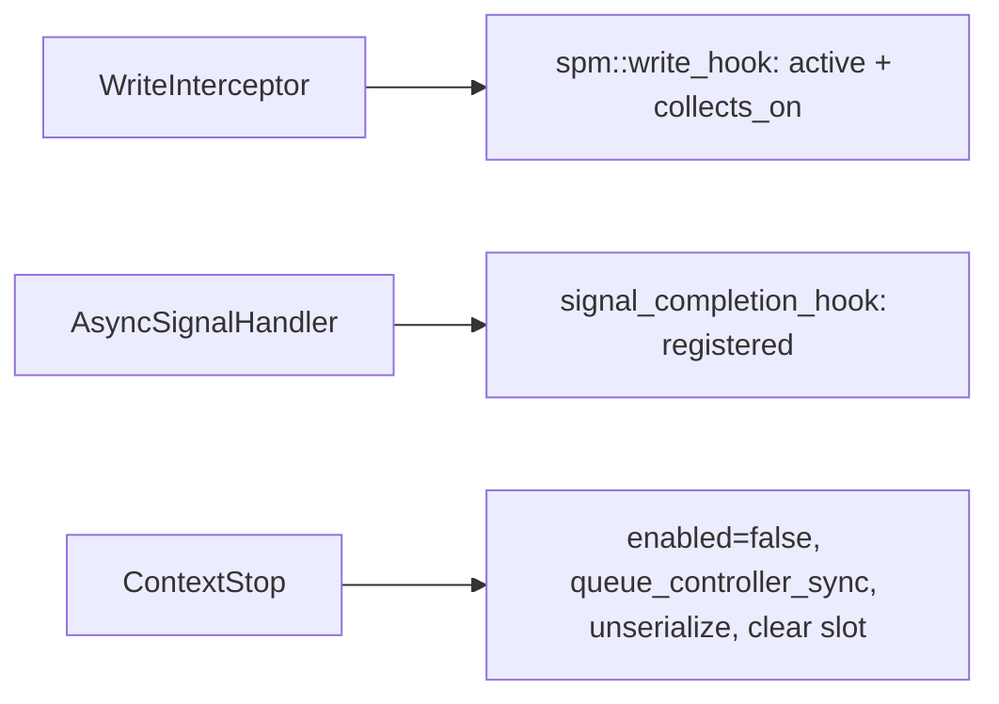

## Motivation

The purpose of this PR is to isolate the SPM slice of the callback-removal effort (reference PRs #8730 / #8586) into a small, single-service change, per review guidance to land callback removal one service at a time. This is independent of the kernel replay feature in PR #7960 and #8622 but it aids it.

### Underlying Problem

Dispatch SPM currently registers a `queue_callbacks_t` on every HSA queue. That hides “is this service active?” inside a per-queue map, makes enqueue and completion the same walk, and serializes every GPU while any SPM context is active.

This PR:

1. **Stops registering** SPM with that map. The write interceptor and async signal handler call explicit free functions instead (`spm::write_hook`, `signal_completion_hook`, `is_any_active`).
2. **Routes completions by provenance** — enter iterates active contexts, exit iterates registered contexts so in-flight dispatches still complete after stop.
3. **Scopes SPM to GPU agents** via `rocprofiler_spm_dispatch_counting_service_set_agents`, with GPU drain on stop and per-agent serialization refcounting.

The per-queue callback registry remains for counters, thread trace, and PC sampling until those services land in their own PRs.

### Notes on Bigger Picture

Aids PR #7960 and the kernel replay work tracked under AIPROFSDK-68. This PR also helps other features that require removing the SPM per-queue callback registry, but does not depend on kernel replay landing first.

Sibling migrations: thread trace (#8790), counter collection (#8891), PC sampling (#8895).

## Technical Details

**Enter = active, exit = registered.** Exit self-filters via `packet_return_map` so in-flight dispatches complete after stop.

Permalinks pin to `758072b`.

### Hooks and call sites

- Declarations: [queue_hooks.hpp](https://github.com/ROCm/rocm-systems/blob/758072b/projects/rocprofiler-sdk/source/lib/rocprofiler-sdk/spm/queue_hooks.hpp)
- Enter: [queue_hooks.cpp#L42-L75](https://github.com/ROCm/rocm-systems/blob/758072b/projects/rocprofiler-sdk/source/lib/rocprofiler-sdk/spm/queue_hooks.cpp#L42-L75)
- Exit (registered / provenance): [queue_hooks.cpp#L77-L101](https://github.com/ROCm/rocm-systems/blob/758072b/projects/rocprofiler-sdk/source/lib/rocprofiler-sdk/spm/queue_hooks.cpp#L77-L101)
- `is_any_active`: [queue_hooks.cpp#L103-L107](https://github.com/ROCm/rocm-systems/blob/758072b/projects/rocprofiler-sdk/source/lib/rocprofiler-sdk/spm/queue_hooks.cpp#L103-L107)
- `no_real_consumers` gate: [queue.cpp#L318-L322](https://github.com/ROCm/rocm-systems/blob/758072b/projects/rocprofiler-sdk/source/lib/rocprofiler-sdk/hsa/queue.cpp#L318-L322)
- Enter call site: [queue.cpp#L632-L642](https://github.com/ROCm/rocm-systems/blob/758072b/projects/rocprofiler-sdk/source/lib/rocprofiler-sdk/hsa/queue.cpp#L632-L642)
- Exit call site: [queue.cpp#L172-L179](https://github.com/ROCm/rocm-systems/blob/758072b/projects/rocprofiler-sdk/source/lib/rocprofiler-sdk/hsa/queue.cpp#L172-L179)
- Batching disabled while active: [queue.cpp#L778-L779](https://github.com/ROCm/rocm-systems/blob/758072b/projects/rocprofiler-sdk/source/lib/rocprofiler-sdk/hsa/queue.cpp#L778-L779)
- `start_context` (no `add_callback`): [core.cpp#L258-L276](https://github.com/ROCm/rocm-systems/blob/758072b/projects/rocprofiler-sdk/source/lib/rocprofiler-sdk/spm/core.cpp#L258-L276)
- Stop (`enabled` → drain → unserialize): [core.cpp#L283-L323](https://github.com/ROCm/rocm-systems/blob/758072b/projects/rocprofiler-sdk/source/lib/rocprofiler-sdk/spm/core.cpp#L283-L323)
- Stop services **before** active-slot CAS: [context.cpp#L392-L408](https://github.com/ROCm/rocm-systems/blob/758072b/projects/rocprofiler-sdk/source/lib/rocprofiler-sdk/context/context.cpp#L392-L408)
- Conflict uses `intersects`: [context.cpp#L311-L317](https://github.com/ROCm/rocm-systems/blob/758072b/projects/rocprofiler-sdk/source/lib/rocprofiler-sdk/context/context.cpp#L311-L317)
- `set_agents` API: [spm.h#L318-L338](https://github.com/ROCm/rocm-systems/blob/758072b/projects/rocprofiler-sdk/source/include/rocprofiler-sdk/experimental/spm.h#L318-L338)
- Producer tag: [client_ids.hpp#L37-L40](https://github.com/ROCm/rocm-systems/blob/758072b/projects/rocprofiler-sdk/source/lib/rocprofiler-sdk/hsa/queue_hooks/client_ids.hpp#L37-L40)

## Reviewer Guide

1. Confirm enter = active, exit = registered ([queue_hooks.cpp](https://github.com/ROCm/rocm-systems/blob/758072b/projects/rocprofiler-sdk/source/lib/rocprofiler-sdk/spm/queue_hooks.cpp)).
2. SPM-only runs still enter `WriteInterceptor` ([queue.cpp#L318-L322](https://github.com/ROCm/rocm-systems/blob/758072b/projects/rocprofiler-sdk/source/lib/rocprofiler-sdk/hsa/queue.cpp#L318-L322)).
3. `start_context` does **not** call `add_callback` ([core.cpp#L258-L276](https://github.com/ROCm/rocm-systems/blob/758072b/projects/rocprofiler-sdk/source/lib/rocprofiler-sdk/spm/core.cpp#L258-L276)).
4. `context::stop_context` stops SPM **before** the active-slot CAS ([context.cpp#L392-L408](https://github.com/ROCm/rocm-systems/blob/758072b/projects/rocprofiler-sdk/source/lib/rocprofiler-sdk/context/context.cpp#L392-L408)).
5. `spm::stop_context` keeps `queue_controller_sync` ([core.cpp#L283-L323](https://github.com/ROCm/rocm-systems/blob/758072b/projects/rocprofiler-sdk/source/lib/rocprofiler-sdk/spm/core.cpp#L283-L323)) — drain bounds when completions arrive; provenance routing bounds delivery.
6. In-flight regression: `spm_core` test `stop_context_in_flight_completion_routes_via_hook_path` ([core.cpp#L990+](https://github.com/ROCm/rocm-systems/blob/758072b/projects/rocprofiler-sdk/source/lib/rocprofiler-sdk/spm/tests/core.cpp#L990)) — `packet_return_map` drains via `signal_completion_hook` after stop.
7. Per-agent: `set_agents_restricts_collection`, disjoint SPM contexts ([core.cpp#L1128+](https://github.com/ROCm/rocm-systems/blob/758072b/projects/rocprofiler-sdk/source/lib/rocprofiler-sdk/spm/tests/core.cpp#L1128)).
8. Gate-only unit test: [queue_hooks_test.cpp#L33-L36](https://github.com/ROCm/rocm-systems/blob/758072b/projects/rocprofiler-sdk/source/lib/rocprofiler-sdk/spm/tests/queue_hooks_test.cpp#L33-L36).

**Answer:** In-flight SPM dispatch still gets `DISPATCH_END` / `kfd_stop` after stop? `packet_return_map` empty? GPU-1-only SPM leave GPU-0 alone?

**Out of scope:** deleting `Queue::_callbacks`; other service migrations.

## Issue Tracking

AIPROFSDK-1017

Related: AIPROFSDK-68 (kernel replay — see #7960).

## Test Plan

- [is_any_active](https://github.com/ROCm/rocm-systems/blob/758072b/projects/rocprofiler-sdk/source/lib/rocprofiler-sdk/spm/tests/queue_hooks_test.cpp#L33-L36)
- In-flight + per-agent tests in [spm/tests/core.cpp](https://github.com/ROCm/rocm-systems/blob/758072b/projects/rocprofiler-sdk/source/lib/rocprofiler-sdk/spm/tests/core.cpp)
- Existing start/stop / sync / restart tests updated off callback iteration

## Test Result

Intended coverage listed above. Treat the Checks tab as source of truth for CI.

## Submission Checklist

- [x] Look over the contributing guidelines at https://github.com/ROCm/rocm-systems/blob/develop/CONTRIBUTING.md.
