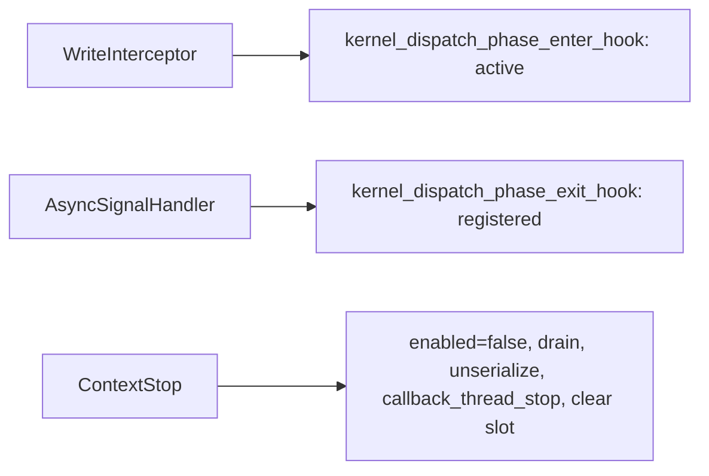

## Motivation

The purpose of this PR is to isolate the counter-collection slice of the callback-removal effort (reference PRs #8730 / #8586) into a small, single-service change, per review guidance to land callback removal one service at a time.

### Underlying Problem

Dispatch counter collection currently registers a `queue_callbacks_t` on every HSA queue. That hides “is this service active?” inside a per-queue map, makes enqueue and completion the same walk, and serializes every GPU while any counter context is active.

This PR:

1. **Stops registering** counter collection with that map. The write interceptor and async signal handler call explicit free functions instead.
2. **Scopes collection to GPU agents** via `rocprofiler_dispatch_counting_service_set_agents`, so disjoint agent sets can be active together.

Public dispatch callback/record APIs are unchanged except for `set_agents`. Device counting is untouched. The per-queue callback map remains for unmigrated services.

### Notes on Bigger Picture

Note the associated focused effort of PR #8790 for migrating thread trace off the per-queue callback registry.

The kernel replay feature PR #7960 is greatly enhanced by this PR. However, note this is independent of the kernel replay feature and can be used for other features in ROCprofiler-SDK.

## Technical Details

**Enter vs exit use different context sets.** Enter iterates **active** contexts; exit iterates **registered** contexts so in-flight dispatches still complete after stop.

Architecture: [queue_callback_removal_architecture.md](https://github.com/ROCm/rocm-systems/blob/70bef64/projects/rocprofiler-sdk/source/docs/conceptual/queue_hooks/queue_callback_removal_architecture.md). Permalinks pin to `70bef64`.

### Hooks and call sites

- Declarations: [queue_hooks.hpp](https://github.com/ROCm/rocm-systems/blob/70bef64/projects/rocprofiler-sdk/source/lib/rocprofiler-sdk/counters/queue_hooks.hpp)
- Enter (`collects_on`, `COUNTERS_CLIENT_ID`): [queue_hooks.cpp#L45-L84](https://github.com/ROCm/rocm-systems/blob/70bef64/projects/rocprofiler-sdk/source/lib/rocprofiler-sdk/counters/queue_hooks.cpp#L45-L84)
- Exit (provenance via `packet_return_map`): [queue_hooks.cpp#L86-L107](https://github.com/ROCm/rocm-systems/blob/70bef64/projects/rocprofiler-sdk/source/lib/rocprofiler-sdk/counters/queue_hooks.cpp#L86-L107)
- `is_any_active`: [queue_hooks.cpp#L109-L113](https://github.com/ROCm/rocm-systems/blob/70bef64/projects/rocprofiler-sdk/source/lib/rocprofiler-sdk/counters/queue_hooks.cpp#L109-L113)
- `no_real_consumers` gate: [queue.cpp#L318-L328](https://github.com/ROCm/rocm-systems/blob/70bef64/projects/rocprofiler-sdk/source/lib/rocprofiler-sdk/hsa/queue.cpp#L318-L328)
- Enter call site: [queue.cpp#L633-L644](https://github.com/ROCm/rocm-systems/blob/70bef64/projects/rocprofiler-sdk/source/lib/rocprofiler-sdk/hsa/queue.cpp#L633-L644)
- Exit call site: [queue.cpp#L172-L179](https://github.com/ROCm/rocm-systems/blob/70bef64/projects/rocprofiler-sdk/source/lib/rocprofiler-sdk/hsa/queue.cpp#L172-L179)
- Batching disabled while active: [queue.cpp#L768-L781](https://github.com/ROCm/rocm-systems/blob/70bef64/projects/rocprofiler-sdk/source/lib/rocprofiler-sdk/hsa/queue.cpp#L768-L781)
- `start_context` (no `add_callback`): [core.cpp#L148-L172](https://github.com/ROCm/rocm-systems/blob/70bef64/projects/rocprofiler-sdk/source/lib/rocprofiler-sdk/counters/core.cpp#L148-L172)
- Stop order (`enabled` → drain → unserialize → callback thread): [core.cpp#L174-L209](https://github.com/ROCm/rocm-systems/blob/70bef64/projects/rocprofiler-sdk/source/lib/rocprofiler-sdk/counters/core.cpp#L174-L209)
- Stop services **before** active-slot CAS: [context.cpp#L377-L405](https://github.com/ROCm/rocm-systems/blob/70bef64/projects/rocprofiler-sdk/source/lib/rocprofiler-sdk/context/context.cpp#L377-L405)
- Producer tags: [client_ids.hpp#L33-L56](https://github.com/ROCm/rocm-systems/blob/70bef64/projects/rocprofiler-sdk/source/lib/rocprofiler-sdk/hsa/queue_hooks/client_ids.hpp#L33-L56)

### Per-agent scoping

- API: [dispatch_counting_service.h#L148-L185](https://github.com/ROCm/rocm-systems/blob/70bef64/projects/rocprofiler-sdk/source/include/rocprofiler-sdk/dispatch_counting_service.h#L148-L185)
- `collects_on` / `intersects`: [context.hpp#L82-L110](https://github.com/ROCm/rocm-systems/blob/70bef64/projects/rocprofiler-sdk/source/lib/rocprofiler-sdk/context/context.hpp#L82-L110)
- Conflict uses `intersects`: [context.cpp#L305-L314](https://github.com/ROCm/rocm-systems/blob/70bef64/projects/rocprofiler-sdk/source/lib/rocprofiler-sdk/context/context.cpp#L305-L314)
- `set_agents` locked while active: [core.cpp#L211-L248](https://github.com/ROCm/rocm-systems/blob/70bef64/projects/rocprofiler-sdk/source/lib/rocprofiler-sdk/counters/core.cpp#L211-L248)
- Serialization refcount: [queue_controller.hpp#L97-L175](https://github.com/ROCm/rocm-systems/blob/70bef64/projects/rocprofiler-sdk/source/lib/rocprofiler-sdk/hsa/queue_controller.hpp#L97-L175)

## Reviewer Guide

1. Confirm enter = `get_active_contexts`, exit = `get_registered_contexts` ([queue_hooks.cpp](https://github.com/ROCm/rocm-systems/blob/70bef64/projects/rocprofiler-sdk/source/lib/rocprofiler-sdk/counters/queue_hooks.cpp)).
2. Counters-only runs still enter `WriteInterceptor` ([queue.cpp#L318-L328](https://github.com/ROCm/rocm-systems/blob/70bef64/projects/rocprofiler-sdk/source/lib/rocprofiler-sdk/hsa/queue.cpp#L318-L328)).
3. `start_context` does **not** call `add_callback` ([core.cpp#L148-L172](https://github.com/ROCm/rocm-systems/blob/70bef64/projects/rocprofiler-sdk/source/lib/rocprofiler-sdk/counters/core.cpp#L148-L172)).
4. `context::stop_context` stops counters **before** the active-slot CAS ([context.cpp#L377-L405](https://github.com/ROCm/rocm-systems/blob/70bef64/projects/rocprofiler-sdk/source/lib/rocprofiler-sdk/context/context.cpp#L377-L405)).
5. `counters::stop_context` drains before teardown ([core.cpp#L174-L209](https://github.com/ROCm/rocm-systems/blob/70bef64/projects/rocprofiler-sdk/source/lib/rocprofiler-sdk/counters/core.cpp#L174-L209)).
6. `collects_on` filters **before** `queue_cb` ([queue_hooks.cpp#L62-L66](https://github.com/ROCm/rocm-systems/blob/70bef64/projects/rocprofiler-sdk/source/lib/rocprofiler-sdk/counters/queue_hooks.cpp#L62-L66)).
7. In-flight regression: [queue_hooks_test.cpp#L194-L326](https://github.com/ROCm/rocm-systems/blob/70bef64/projects/rocprofiler-sdk/source/lib/rocprofiler-sdk/counters/tests/queue_hooks_test.cpp#L194-L326) — map drops by one per completion **and** every dispatch reaches the record callback after stop.
8. Per-agent: [per_agent_scoping_test.cpp](https://github.com/ROCm/rocm-systems/blob/70bef64/projects/rocprofiler-sdk/source/lib/rocprofiler-sdk/counters/tests/per_agent_scoping_test.cpp), integration [per_agent_scoping_app.cpp](https://github.com/ROCm/rocm-systems/blob/70bef64/projects/rocprofiler-sdk/tests/counter-collection-per-agent/per_agent_scoping_app.cpp).

**Answer:** In-flight record after stop? GPU-1-only context leave GPU-0 alone? `packet_return_map` empty with every record delivered?

**Out of scope:** deleting `Queue::_callbacks`; migrating other services; device-counting.

## Issue Tracking

<!-- Counter-collection ticket — fill in once confirmed (AIPROFSDK-1016 is ATT, not counters) -->

## Test Plan

- [is_any_active](https://github.com/ROCm/rocm-systems/blob/70bef64/projects/rocprofiler-sdk/source/lib/rocprofiler-sdk/counters/tests/queue_hooks_test.cpp#L172-L175); [stop-while-in-flight](https://github.com/ROCm/rocm-systems/blob/70bef64/projects/rocprofiler-sdk/source/lib/rocprofiler-sdk/counters/tests/queue_hooks_test.cpp#L194-L326)
- Per-agent unit + multi-GPU integration (links above)
- Start/stop tests assert `enabled`, not `iterate_callbacks` ([core.cpp](https://github.com/ROCm/rocm-systems/blob/70bef64/projects/rocprofiler-sdk/source/lib/rocprofiler-sdk/counters/tests/core.cpp))

## Test Result

Intended coverage listed above. Treat the Checks tab as source of truth for CI.

## Submission Checklist

- [x] Look over the contributing guidelines at https://github.com/ROCm/rocm-systems/blob/develop/CONTRIBUTING.md.
