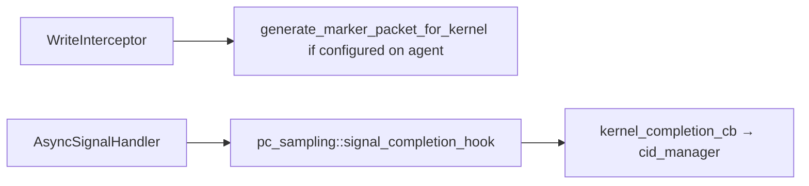

## Motivation

The purpose of this PR is to isolate the PC-sampling slice of the callback-removal effort (reference PRs #8730 / #8586) into a small, single-service change, per review guidance to land callback removal one service at a time. Helps toward but independent of the kernel replay feature in #7960.

### Underlying Problem

PC sampling currently registers a per-queue completion callback with the HSA queue controller so kernel completions reach the CID manager. That ties completion delivery to the shared per-queue callback registry even though marker-packet injection was never registry-based.

This PR:

1. **Removes the registry registration** from `pc_sampling_service_finish_configuration` and delivers completion explicitly via `pc_sampling::signal_completion_hook` from the async signal handler.
2. **Replaces the `get_notifiers()` gate** with `is_configured_on_agent()` so PC-only runs still enter the write interceptor and receive marker packets on configured agents.

PC sampling has **no enqueue hook** — marker injection stays inline in `WriteInterceptor`. This is the smallest migration: completion-only, no batching change. The per-queue callback registry remains for counters, thread trace, and SPM until those services land in their own PRs.

### Notes on Bigger Picture

Sibling migrations: thread trace (#8790), SPM (#8887), counter collection (#8891).

Kernel replay (#7960) benefits from callback removal but this PR is independent and behavior-preserving on its own.

## Technical Details

Permalinks pin to `ec87a2f`.

### Hooks and call sites

- Declarations: [queue_hooks.hpp](https://github.com/ROCm/rocm-systems/blob/ec87a2f/projects/rocprofiler-sdk/source/lib/rocprofiler-sdk/pc_sampling/queue_hooks.hpp)
- `is_configured_on_agent`: [queue_hooks.cpp#L36-L45](https://github.com/ROCm/rocm-systems/blob/ec87a2f/projects/rocprofiler-sdk/source/lib/rocprofiler-sdk/pc_sampling/queue_hooks.cpp#L36-L45)
- `signal_completion_hook` → `kernel_completion_cb`: [queue_hooks.cpp#L47-L66](https://github.com/ROCm/rocm-systems/blob/ec87a2f/projects/rocprofiler-sdk/source/lib/rocprofiler-sdk/pc_sampling/queue_hooks.cpp#L47-L66), [hsa_adapter.cpp#L133-L150](https://github.com/ROCm/rocm-systems/blob/ec87a2f/projects/rocprofiler-sdk/source/lib/rocprofiler-sdk/pc_sampling/hsa_adapter.cpp#L133-L150)
- `no_real_consumers` gate (per-agent, not global): [queue.cpp#L318-L321](https://github.com/ROCm/rocm-systems/blob/ec87a2f/projects/rocprofiler-sdk/source/lib/rocprofiler-sdk/hsa/queue.cpp#L318-L321)
- Exit call site: [queue.cpp#L172-L179](https://github.com/ROCm/rocm-systems/blob/ec87a2f/projects/rocprofiler-sdk/source/lib/rocprofiler-sdk/hsa/queue.cpp#L172-L179)
- Registration removed from configure path: [hsa_adapter.cpp#L354-L358](https://github.com/ROCm/rocm-systems/blob/ec87a2f/projects/rocprofiler-sdk/source/lib/rocprofiler-sdk/pc_sampling/hsa_adapter.cpp#L354-L358)
- `queue_id` removed from PC sampling types ([types.hpp](https://github.com/ROCm/rocm-systems/blob/ec87a2f/projects/rocprofiler-sdk/source/lib/rocprofiler-sdk/pc_sampling/types.hpp))

PC sampling does not use `client_ids.hpp` producer tags on this branch (marker injection is unchanged). No `is_any_active()` — the gate is per-agent configuration state.

## Reviewer Guide

1. Confirm **no** `add_callback` / `remove_callback` in [hsa_adapter.cpp configure path](https://github.com/ROCm/rocm-systems/blob/ec87a2f/projects/rocprofiler-sdk/source/lib/rocprofiler-sdk/pc_sampling/hsa_adapter.cpp#L354-L358).
2. `AsyncSignalHandler` calls `pc_sampling::signal_completion_hook` after registry walk ([queue.cpp#L172-L179](https://github.com/ROCm/rocm-systems/blob/ec87a2f/projects/rocprofiler-sdk/source/lib/rocprofiler-sdk/hsa/queue.cpp#L172-L179)).
3. `no_real_consumers` uses `is_configured_on_agent(agent)` per dispatch queue's agent ([queue.cpp#L318-L321](https://github.com/ROCm/rocm-systems/blob/ec87a2f/projects/rocprofiler-sdk/source/lib/rocprofiler-sdk/hsa/queue.cpp#L318-L321)) — PC-sampling-only on one GPU must still intercept that GPU's dispatches.
4. Marker injection path unchanged except gate rename to `is_configured_on_agent` ([queue.cpp](https://github.com/ROCm/rocm-systems/blob/ec87a2f/projects/rocprofiler-sdk/source/lib/rocprofiler-sdk/hsa/queue.cpp)).
5. `kernel_completion_cb` still guards on `is_pc_sample_service_configured` and correlation id ([hsa_adapter.cpp#L138-L149](https://github.com/ROCm/rocm-systems/blob/ec87a2f/projects/rocprofiler-sdk/source/lib/rocprofiler-sdk/pc_sampling/hsa_adapter.cpp#L138-L149)).
6. `#if ROCPROFILER_SDK_HSA_PC_SAMPLING` — hook stubs must link when support is off ([queue_hooks.cpp](https://github.com/ROCm/rocm-systems/blob/ec87a2f/projects/rocprofiler-sdk/source/lib/rocprofiler-sdk/pc_sampling/queue_hooks.cpp)).
7. Unit test: [queue_hooks_test.cpp#L34-L39](https://github.com/ROCm/rocm-systems/blob/ec87a2f/projects/rocprofiler-sdk/source/lib/rocprofiler-sdk/pc_sampling/tests/queue_hooks_test.cpp#L34-L39).

**Answer:** With PC sampling configured on GPU-0 only, does GPU-0 still get marker injection and completion CID retirement? With no PC sampling configured, does `is_configured_on_agent` return false for all agents?

**Out of scope:** enqueue hook extraction; `client_ids.hpp` tagging; per-agent scoping API; deleting `Queue::_callbacks`.

## Issue Tracking

<!-- PC-sampling ticket — fill in once confirmed -->

## Test Plan

- [is_configured_on_agent unconfigured](https://github.com/ROCm/rocm-systems/blob/ec87a2f/projects/rocprofiler-sdk/source/lib/rocprofiler-sdk/pc_sampling/tests/queue_hooks_test.cpp#L34-L39)
- Existing PC sampling integration / rocprofv3 PC sampling tests

## Test Result

Unit gate test as above. Treat the Checks tab as source of truth for CI.

## Submission Checklist

- [x] Look over the contributing guidelines at https://github.com/ROCm/rocm-systems/blob/develop/CONTRIBUTING.md.
