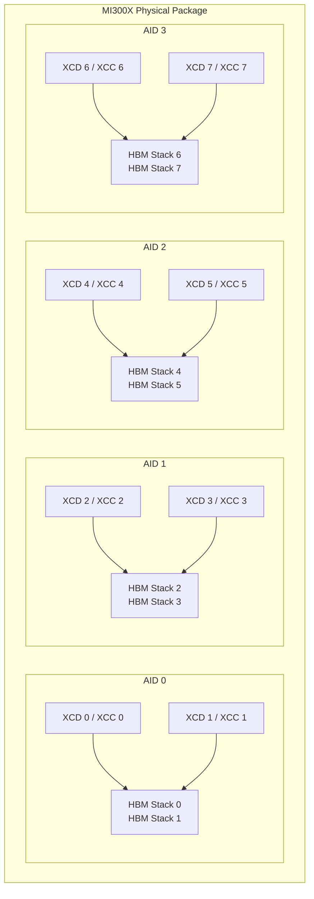
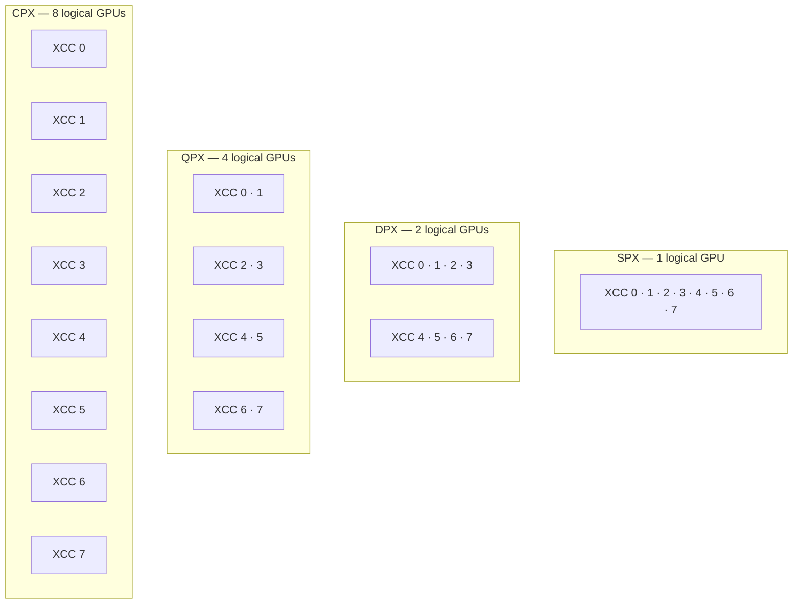

---
myst:
  html_meta:
    "description lang=en": "AMD SMI conceptual guide for GPU accelerator and memory partitioning."
    "keywords": "system, management, instinct, accelerator, interface, partition, compute, memory, NPS, SPX, DPX, TPX, QPX, CPX, XCC, amd-smi"
---

# GPU partitioning

GPU partitioning splits one physical AMD Instinct GPU into multiple logical GPUs, so workloads can
share it in isolation. It has two independent dimensions: **accelerator partitioning** (how compute
resources are grouped) and **memory partitioning** (how HBM is divided).

```{note}
Partitioning is supported on select AMD Instinct GPUs (CDNA 3 and later, such as MI300X). The
available modes depend on the ASIC and firmware. On unsupported hardware (for example, Navi/RDNA
GPUs), the partition APIs return `AMDSMI_STATUS_NOT_SUPPORTED`.
```

## Architecture background

AMD Instinct CDNA 3 GPUs (MI300 series) are built from chiplet dies connected through an active
interposer.

### Physical die types

- **XCD (Accelerator Complex Die)** -- The GPU compute die: Compute Units (CUs), Asynchronous
  Compute Engines (ACEs), video decode and JPEG engines, DMA engines, and an L2 cache. MI300X has
  8 XCDs and MI300A has 6.
- **CCD (CPU Core Complex Die)** -- CPU cores and L3 cache, present only on APUs such as MI300A.
  CCDs are not part of accelerator partitioning, but on APUs the NPS mode also covers CCD memory
  placement.
- **AID (Active Interposer Die)** -- The base die, called IOD (I/O Die) in older documentation. It
  provides PCIe, xGMI links, HBM memory controllers, and the fabric between XCDs and memory.
  MI300X has 4 AIDs, each with 2 XCDs and 2 HBM stacks:



### Logical units

- **XCC (Accelerated Compute Core)** -- The schedulable compute unit that the driver and AMD SMI
  see: the CUs, ACEs, caches, and global resources of one XCD. MI300X and MI300A have one XCC per
  XCD, so the terms are often interchangeable. Partition modes group XCCs, which is why AMD SMI
  uses XCC terminology.
- **XCP (Accelerated Compute Processor)** -- Also called a Graphics Compute Partition. A logical
  GPU created by an accelerator partition. The OS and HIP runtime enumerate each XCP as a separate
  GPU. MI300X has 1 XCP in SPX mode and 8 in CPX mode.

### Sockets and partitions

| Concept | AMD SMI handle | Description |
| :--- | :--- | :--- |
| Physical GPU (socket) | `amdsmi_socket_handle`, from `amdsmi_get_socket_handles()` | One OAM module or PCIe card, identified by the PCIe Domain:Bus:Device address that all of its partitions share. Not a CPU socket. |
| Logical GPU (partition) | `amdsmi_processor_handle`, from `amdsmi_get_processor_handles(socket)` | One XCP. An MI300X socket has 1 in SPX mode and 8 in CPX mode. |

```text
System
├── Socket 0 (physical GPU)              amdsmi_socket_handle
│   ├── Partition 0 (XCP 0, primary)     amdsmi_processor_handle   e.g. renderD128
│   ├── Partition 1 (XCP 1, secondary)   amdsmi_processor_handle   e.g. renderD129
│   └── ...                              one per XCP in the current mode
└── Socket 1 (physical GPU)
    └── ...
```

- The partition mode belongs to the physical GPU and applies to all of its partitions.
- All partitions in a socket share the same physical resources (HBM, power and thermal budget,
  PCIe bandwidth). They are not independent cards.
- A partition change alters the set of processor handles and invalidates existing ones. Call
  `amdsmi_shut_down()` and `amdsmi_init()`, then re-enumerate.

### Primary and secondary partitions

Partition 0 of each physical GPU is its **primary partition**. It is the only partition backed by
the GPU's PCIe device, so it is the only one with device-wide sysfs files such as `gpu_metrics`,
`current_compute_partition`, and `current_memory_partition`. All other partitions are **secondary
partitions**, which expose only their own partition-scoped data (`xcp_metrics`).

| Data or operation | Primary (partition 0) | Secondary (partition 1+) |
| :--- | :---: | :---: |
| Partition ID, UUID, and enumeration info | ✅ | ✅ |
| Partition metrics (`xcp_metrics`: clocks, utilization, violations) | ✅ | ✅ |
| Device-wide metrics (`gpu_metrics`: board and socket power) | ✅ | ❌ |
| ASIC and board serial numbers | ✅ | ❌ |
| Current accelerator and memory partition mode | ✅ | ❌ |
| Partition capabilities and profiles | ✅ | ❌ |
| Set the accelerator or memory partition | ✅ | ❌ |

❌ = not reported on that partition. The API returns `AMDSMI_STATUS_NOT_SUPPORTED` (or N/A
values for metrics), and the CLI shows `N/A`.

A secondary partition is still in the same mode as its primary. For example, on a GPU in DPX/NPS2
mode, only partition 0 reports the mode, but partition 1 is also DPX/NPS2:

```console
$ amd-smi partition --current
CURRENT_PARTITION:
GPU_ID  MEMORY  ACCELERATOR_TYPE  ACCELERATOR_PROFILE_INDEX  PARTITION_ID
0       NPS2    DPX               1                          0
1       N/A     N/A               N/A                        1
```

`amd-smi static --partition` and `amd-smi partition --memory`/`--accelerator` also show `N/A` for
secondary partitions. To report the mode for a secondary partition, read it from the partition with
ID 0 in the same socket. Every partition reports its ID as `current_partition_id` in
`amdsmi_get_gpu_kfd_info()` (`PARTITION_ID` in `amd-smi list`).

To group partitions by physical GPU, use the socket (`amdsmi_get_processor_handles(socket)`) or the
shared PCIe Domain:Bus:Device address. Do not use UUIDs (one per partition since ROCm 7.0) or serial
numbers (primary partition only).

```{note}
Before ROCm 6.4.1, secondary partitions mirrored the primary partition's node (`renderD128`), so
every partition reported the same partition mode, device metrics, and `drm_card`/`drm_render`
values. Since ROCm 6.4.1, each partition maps to its own DRM node. See the
[ROCm 6.4.1 changelog](https://github.com/ROCm/rocm-systems/blob/develop/projects/amdsmi/CHANGELOG.md#amd_smi_lib-for-rocm-641).
```

## Accelerator partitioning

Accelerator partitioning groups a GPU's XCCs into XCPs. Each XCP appears to the OS as a separate
logical GPU.

### Accelerator partition modes

| Mode | Name | Description |
| :--- | :--- | :--- |
| `SPX` | Single GPU mode | All XCCs work together as one logical GPU |
| `DPX` | Dual GPU mode | Half the XCCs form each of 2 logical GPUs |
| `TPX` | Triple GPU mode | One-third of the XCCs form each of 3 logical GPUs |
| `QPX` | Quad GPU mode | One-quarter of the XCCs form each of 4 logical GPUs |
| `CPX` | Core GPU mode | Each XCC is its own logical GPU |

A mode is valid only when the XCC count divides evenly by its partition count, so supported modes
differ by model:

| Mode | Partitions | MI300X / MI325X (8 XCCs) | MI300A (6 XCCs) |
| :--- | :---: | :---: | :---: |
| SPX | 1 | ✅ 8 XCCs | ✅ 6 XCCs |
| DPX | 2 | ✅ 4 XCCs each | ✅ 3 XCCs each |
| TPX | 3 | ❌ | ✅ 2 XCCs each |
| QPX | 4 | ✅ 2 XCCs each | ❌ |
| CPX | XCC count | ✅ 1 XCC each | ✅ 1 XCC each |

Firmware also controls which modes are offered. Check the modes and partition counts on your system
(including other models, such as MI350X/MI355X) with `sudo amd-smi partition --accelerator`.

MI300X XCC grouping by mode (each box is one logical GPU):



### Workgroup scheduling in SPX vs CPX

- **SPX** -- Workgroups are distributed round-robin across all XCCs. You cannot control which XCC
  a workgroup runs on.
- **CPX** -- Each XCC is its own logical GPU, so you control work placement explicitly. This can
  improve cache locality and save power.

## Memory partitioning

Memory partitioning sets the NPS (NUMA nodes per socket) mode, which controls how the HBM (High
Bandwidth Memory) stacks are interleaved and split into NUMA domains.

### Memory partition modes

| Mode | Name | HBM allocation |
| :--- | :--- | :--- |
| `NPS1` | 1 NUMA node | All 8 HBM stacks are interleaved across the entire GPU |
| `NPS2` | 2 NUMA nodes | 2 sets of 4 HBM stacks, one per AID pair |
| `NPS4` | 4 NUMA nodes | Each XCD's data interleaved across its local AID's HBM stacks |
| `NPS8` | 8 NUMA nodes | Each XCD uses a single dedicated HBM stack |

### Compatibility matrix

Not every accelerator mode can be combined with every memory mode. MI300X supports:

| | NPS1 | NPS2 | NPS4 |
| :--- | :---: | :---: | :---: |
| **SPX** | ✅ | -- | -- |
| **DPX** | ✅ | ✅ | -- |
| **QPX** | ✅ | -- | ✅ |
| **CPX** | ✅ | -- | ✅ |

```{note}
- The number of memory partitions cannot exceed the number of accelerator partitions.
- NPS8 is defined in the API but not supported on MI300X.
- Supported combinations vary by model and firmware. The `MEMORY_PARTITION_CAPS` column of
  `sudo amd-smi partition --accelerator` lists the NPS modes each accelerator profile supports.
```

### Performance trade-offs

- **NPS1** -- One memory pool interleaved across all HBM stacks. Bandwidth is consistent no matter
  which XCDs are active and it is simpler to program, but cross-AID traffic is higher.
- **NPS4** -- Memory is local to each AID, which reduces cross-AID traffic. An XCD that is the only
  active XCD on its AID can reach the full AID bandwidth (~1 TB/s on MI300X). CPX/NPS4 suits
  bandwidth-bound workloads that can spread across many partitions, and can beat SPX/NPS1 on both
  memory bandwidth and compute throughput. For benchmark data, see the
  [Deep dive into MI300 partition modes](https://rocm.blogs.amd.com/software-tools-optimization/compute-memory-modes/README.html).

## Device enumeration

### How logical GPUs are numbered

The accelerator partition mode sets how many logical GPUs the OS sees. A single MI300X in CPX mode
reports 8 (`amd-smi` IDs 0-7); an 8×MI300X system in CPX mode reports 64 (IDs 0-63).

In `amd-smi list`, all partitions of a physical GPU share its PCIe Bus:Device address, and the
function field of the displayed BDF encodes the partition number (for example, `0000:0c:00.0`
through `0000:0c:00.7` in CPX mode). Each partition also has its own `UUID` and `PARTITION_ID`.

### BDF encoding

AMD SMI encodes each partition's ID in its 64-bit BDF ID, normally in **bits [31:28]**. Some KFD
versions report it in the PCIe function field, **bits [2:0]**, instead, so AMD SMI falls back to
bits [2:0] when bits [31:28] are zero and bits [2:0] are not:

```text
BDFID = ((DOMAIN & 0xFFFFFFFF) << 32) | ((Partition & 0xF) << 28)
        | ((BUS & 0xFF) << 8) | ((DEVICE & 0x1F) << 3) | (FUNCTION & 0x7)
```

| Field | Bits | Source |
| :--- | :--- | :--- |
| Domain | [63:32] | PCIe domain |
| **Partition ID (primary)** | **[31:28]** | KFD location ID upper nibble |
| Bus | [15:8] | PCIe bus number |
| Device | [7:3] | PCIe device number |
| **Partition ID (fallback)** / Function | **[2:0]** | PCIe function number; also carries partition ID on non-SPX driver versions where bits [31:28] are zero |

### UUID behavior

| ROCm version | UUID behavior |
| :--- | :--- |
| Before 7.0 | All partitions of a physical GPU share one UUID. Use the partition ID or HIP device index to tell them apart. |
| 7.0 and later | Each partition has its own UUID, matching the CUDA convention for partitioned devices. |
| 7.13.0 and later | `amdsmi_get_gpu_device_uuid()` uses the same format as HIP and `rocminfo` ([changelog](https://github.com/ROCm/rocm-systems/blob/develop/projects/amdsmi/CHANGELOG.md#amd_smi_lib-for-rocm-7130)). |

**Relevant APIs and CLI**

- `amdsmi_get_gpu_device_uuid()` -- The UUID of the given partition.
- `amdsmi_get_gpu_enumeration_info()` -- Per-partition `hip_uuid`, `hip_id`, `hsa_id`,
  `drm_render`, `drm_card`, and `oam_id` in `amdsmi_enumeration_info_t`. The preferred way to get
  the HIP UUID.
- `amdsmi_get_gpu_asic_info()` -- `asic_serial` in `amdsmi_asic_info_t`, the physical GPU's serial
  from the `unique_id` sysfs file. Reported only on the primary partition.
- `amd-smi list` -- Shows `UUID` per logical GPU. Add `-e` / `--enumeration` to also show `HIP_ID`
  and `HIP_UUID`.

```shell
# Show UUID and HIP_UUID for all logical GPUs
amd-smi list -e
```

## Platform support

| API | Bare metal | Host (hypervisor) | Guest (SR-IOV VF / mVF) |
| :--- | :---: | :---: | :---: |
| `amdsmi_get_gpu_compute_partition()` | ✅ | ❌ | ❌ |
| `amdsmi_set_gpu_compute_partition()` | ✅ | ❌ | ❌ |
| `amdsmi_get_gpu_memory_partition()` | ✅ | ❌ | ❌ |
| `amdsmi_set_gpu_memory_partition()` | ✅ | ❌ | ❌ |
| `amdsmi_get_gpu_accelerator_partition_profile_config()` | ✅ | ✅ | ✅ |
| `amdsmi_get_gpu_accelerator_partition_profile()` | ✅ | ✅ | ✅ |
| `amdsmi_set_gpu_accelerator_partition_profile()` | ✅ | ✅ | ❌ |
| `amdsmi_get_gpu_memory_partition_config()` | ✅ | ✅ | ✅ |
| `amdsmi_set_gpu_memory_partition_mode()` | ✅ | ✅ | ❌ |

- Guests can query partition settings but cannot change them.
- In a guest, the reported accelerator partition mode does **not** reflect the mode configured on
  the host. The hypervisor withholds host partition details from guests for security reasons.

## Operational requirements

Changing partition settings has strict requirements:

- **Root/sudo privileges** -- required for every set call, and to query accelerator partition
  profiles (`amdsmi_get_gpu_accelerator_partition_profile_config()`).
- **Primary partition only** -- set calls on a secondary partition return
  `AMDSMI_STATUS_NOT_SUPPORTED`.
- **Idle GPU** -- no workloads may run on any partition of the physical GPU.
- **Driver reload for memory partition changes** -- after the set call succeeds, stop all GPU
  processes and run:

  ```shell
  sudo modprobe -r amdgpu && sudo modprobe amdgpu
  ```

  The reload reconfigures **all GPUs in the hive** at once.

```{warning}
The memory partition set call alone does not apply the change. Until the driver reloads, the system
keeps using the old configuration.

Before [ROCm 7.0](https://github.com/ROCm/rocm-systems/blob/develop/projects/amdsmi/CHANGELOG.md#amd_smi_lib-for-rocm-700),
the set API reloaded the driver itself. Since
[ROCm 7.13.0](https://github.com/ROCm/rocm-systems/blob/develop/projects/amdsmi/CHANGELOG.md#amd_smi_lib-for-rocm-7130),
`amd-smi reset -r` is no longer available; use `modprobe` as shown above.
```

## Workload isolation and assignment

Each partition is an independent GPU to the ROCm runtime. `HIP_VISIBLE_DEVICES` and
`ROCR_VISIBLE_DEVICES` affect only the runtime, not amd-smi. Container `--device` flags and cgroup
rules work at the kernel level, so they also restrict what amd-smi sees. To assign a workload to
specific partitions:

- **`HIP_VISIBLE_DEVICES`** or **`ROCR_VISIBLE_DEVICES`** -- environment variables that
  restrict which logical GPU IDs an application can see. For example, to expose only CPX
  partitions 0 and 1 of an MI300X:

  ```shell
  export HIP_VISIBLE_DEVICES=0,1
  ```

- **MPI launchers** -- Use `-x ROCR_VISIBLE_DEVICES=<ids>` per MPI process rank to give each
  rank a dedicated set of partitions:

  ```shell
  mpirun \
    -np 1 -x ROCR_VISIBLE_DEVICES=0,8,16,24 ./my_app : \
    -np 1 -x ROCR_VISIBLE_DEVICES=1,9,17,25 ./my_app
  ```

- **Containers** -- Pass individual render devices to each container using `--device`.
  Each XCD in CPX mode has its own `/dev/dri/renderD<N>` entry, starting at `renderD128`.
  The next physical GPU's XCDs start at `renderD128 + (8 × gpu_index)`:

  ```shell
  # CPX partition 0 from physical GPU 0 only
  docker run --device=/dev/kfd --device=/dev/dri/renderD128 rocm/pytorch

  # All CPX partitions of physical GPU 0 (MI300X)
  docker run --device=/dev/kfd \
    --device=/dev/dri/renderD128 --device=/dev/dri/renderD129 \
    --device=/dev/dri/renderD130 --device=/dev/dri/renderD131 \
    --device=/dev/dri/renderD132 --device=/dev/dri/renderD133 \
    --device=/dev/dri/renderD134 --device=/dev/dri/renderD135 \
    rocm/pytorch

  # CPX partition 0 from each of 8 physical GPUs (8×MI300X system)
  docker run --device=/dev/kfd \
    --device=/dev/dri/renderD128 --device=/dev/dri/renderD136 \
    --device=/dev/dri/renderD144 --device=/dev/dri/renderD152 \
    --device=/dev/dri/renderD160 --device=/dev/dri/renderD168 \
    --device=/dev/dri/renderD176 --device=/dev/dri/renderD184 \
    rocm/pytorch
  ```

  See [Using AMD SMI in a Docker container](/how-to/setup-docker-container.md) for additional
  requirements when managing memory partitions from inside a container
  (`--cap-add=SYS_MODULE` and `-v /lib/modules:/lib/modules`).

- **Linux cgroups** -- Use cgroup device allow/deny rules to restrict access to specific
  render minor IDs at the kernel level:

  ```shell
  # Deny access to renderD128 (CPX partition 0 of GPU 0)
  echo "c 226:128 rwm" > /sys/fs/cgroup/devices/devices.deny
  ```

  ```{note}
  This uses the cgroup v1 API. On cgroup v2 systems (RHEL 9, Ubuntu 22.04+, Fedora 31+),
  `/sys/fs/cgroup/devices/` does not exist. Refer to your distribution's cgroup v2 BPF
  device controller documentation, or use container `--device` flags instead.
  ```

  See [Using Linux control groups](https://rocm.blogs.amd.com/software-tools-optimization/compute-memory-modes/README.html#using-linux-control-groups)
  for a detailed walkthrough of major/minor device IDs and cgroup rules for partitioned GPUs.

```{note}
A workload runs **only** on the XCCs of the partitions assigned to it and never spills onto other
partitions. Distribute work across partitions explicitly, for example with `hipSetDevice`,
`torch.cuda.set_device`, or job scheduler environment variables.
```

## API generations

AMD SMI has two generations of partition APIs. Use the accelerator partition profile APIs for new
code.

### Original compute partition APIs

These APIs identify the partition mode by name: a string for queries, an enum for sets.

| API | Description |
| :--- | :--- |
| `amdsmi_get_gpu_compute_partition()` | Returns the current compute partition as a string (`"SPX"`, `"CPX"`, etc.) |
| `amdsmi_set_gpu_compute_partition()` | Sets the compute partition by enum (`amdsmi_compute_partition_type_t`) |
| `amdsmi_get_gpu_memory_partition()` | Returns the current memory partition as a string (`"NPS1"`, `"NPS4"`, etc.) |
| `amdsmi_set_gpu_memory_partition()` | Sets the memory partition by enum (`amdsmi_memory_partition_type_t`) |

```{note}
`amdsmi_get_gpu_compute_partition()`, `amdsmi_set_gpu_compute_partition()`, and
`amdsmi_set_gpu_memory_partition()` are deprecated and will be removed in the next major release.
```

Limitations:

- **No capability discovery** -- an unsupported mode is rejected only when you try to set it.
- **No resource visibility** -- no per-partition counts of XCCs or encoder, decoder, DMA, and JPEG
  engines.
- **No memory compatibility information** -- no indication of which NPS modes a compute mode
  supports.
- **Bare metal only** -- not available on hypervisor hosts or in SR-IOV guests.

### Accelerator partition profile APIs

These APIs follow the SR-IOV host partition model and work on bare metal, hypervisor hosts, and
SR-IOV guests. They identify configurations by **profile index**, an integer enumerated at runtime
from the device, so only configurations the hardware supports can be set.

#### Capability discovery

`amdsmi_get_gpu_accelerator_partition_profile_config()` returns an
`amdsmi_accelerator_partition_profile_config_t` struct that describes all supported
accelerator partition profiles for the device:

- **`num_profiles`** — total number of valid profiles.
- **`default_profile_index`** — the hardware default profile (restored on driver reset).
- **`profiles[]`** — one entry per supported profile, each containing:
  - `profile_type` — partition mode (`SPX`, `DPX`, `QPX`, `CPX`, etc.).
  - `num_partitions` — how many logical GPU partitions this profile creates.
  - `memory_caps` — a bitmask (`amdsmi_nps_caps_t`) indicating which NPS memory partition
    modes are compatible with this accelerator profile (`nps1_cap`, `nps2_cap`, `nps4_cap`,
    `nps8_cap`).
  - `profile_index` — the index value to pass to `amdsmi_set_gpu_accelerator_partition_profile()`.
  - `resources[]` — a 2-D array describing which hardware resource IDs (XCC indexes) are
    assigned to each logical partition under this profile.
- **`resource_profiles[]`** — one entry per resource type, each containing:
  - `resource_type` — one of `AMDSMI_ACCELERATOR_XCC`, `AMDSMI_ACCELERATOR_ENCODER`,
    `AMDSMI_ACCELERATOR_DECODER`, `AMDSMI_ACCELERATOR_DMA`, or `AMDSMI_ACCELERATOR_JPEG`.
  - `partition_resource` — the count of that resource type available per partition.
  - `num_partitions_share_resource` — if greater than 1, the resource is shared across
    that many partitions rather than dedicated per partition.

`amdsmi_get_gpu_memory_partition_config()` returns an `amdsmi_memory_partition_config_t`
struct with:

- **`partition_caps`** — bitmask of NPS modes the device supports.
- **`mp_mode`** — the currently active NPS memory partition mode.
- **`num_numa_ranges`** — number of NUMA memory ranges visible in this partition.
- **`numa_range[]`** — per-range entries with `memory_type`, `start`, and `end` addresses,
  describing the physical HBM layout as seen from the current partition context.

#### Setting partitions by profile index

`amdsmi_set_gpu_accelerator_partition_profile()` takes a `profile_index` from
`amdsmi_get_gpu_accelerator_partition_profile_config()`, so it accepts only configurations the
device reports as supported.

`amdsmi_set_gpu_memory_partition_mode()` sets the NPS mode. It replaces the deprecated
`amdsmi_set_gpu_memory_partition()` and also works on hypervisor hosts.

#### Querying the current profile

`amdsmi_get_gpu_accelerator_partition_profile()` returns the active
`amdsmi_accelerator_partition_profile_t` (the same structure as one entry of the config array) and
the partition's ID in `partition_id[0]`. On hypervisor hosts, `partition_id` instead lists every
partition of the physical GPU.

On a secondary partition, it returns `AMDSMI_STATUS_NOT_SUPPORTED` but still fills
`partition_id[0]`. See [Primary and secondary partitions](#primary-and-secondary-partitions).

## From concept to action

AMD SMI provides tools to query and configure accelerator and memory partitioning.

:::::{tab-set}
::::{tab-item} C/C++
The AMD SMI library provides APIs to query and set both compute and memory partition modes.

```{code-block} cpp
#include "amd_smi/amdsmi.h"

// Partition changes alter device topology -- AMD SMI must re-initialize after
// each change to obtain a valid handle list reflecting the new device count.
int main() {
    amdsmi_init(AMDSMI_INIT_AMD_GPUS);
    // ... enumerate sockets and processor handles ...
    // gpu: the primary partition (partition ID 0) of the target GPU

    // Steps 1-2: Query current settings and available modes (always run first)
    amdsmi_get_gpu_accelerator_partition_profile(gpu, &cur_profile, partition_ids);
    amdsmi_get_gpu_memory_partition_config(gpu, &mem_config);              // current mode + supported NPS modes
    amdsmi_get_gpu_accelerator_partition_profile_config(gpu, &acc_config); // supported profiles

    // Step 3: Set memory partition (use a mode reported as supported in step 2)
    amdsmi_set_gpu_memory_partition_mode(gpu, AMDSMI_MEMORY_PARTITION_NPS4);

    // Step 4: Reload the driver -- required to apply the memory partition change.
    // Stop all GPU workloads first. The reload may reset the accelerator partition.
    // The reload needs to occur out of band via calls to `modprobe -r amdgpu` and
    // then `modprobe amdgpu`

    // Step 5: Re-initialize to pull in the updated topology (new device count/handles)
    amdsmi_shut_down();
    amdsmi_init(AMDSMI_INIT_AMD_GPUS);
    // ... re-enumerate sockets and processor handles ...

    // Step 6: Set accelerator partition by profile index (must be valid for active NPS mode)
    amdsmi_set_gpu_accelerator_partition_profile(gpu, target_profile_index);

    // Step 7: Re-initialize again -- accelerator partition changes the logical device count
    amdsmi_shut_down();
    amdsmi_init(AMDSMI_INIT_AMD_GPUS);
    // ... re-enumerate and verify partition settings and device count ...

    amdsmi_shut_down();
    return 0;
}
```

For a complete, self-contained example including enumeration, capability discovery, and
re-initialization handling, see
[`example/amd_smi_partition_example.cc`](https://github.com/ROCm/rocm-systems/blob/develop/projects/amdsmi/example/amd_smi_partition_example.cc).
For usage of the older `amdsmi_get_gpu_compute_partition` / `amdsmi_set_gpu_compute_partition`
APIs, see
[`example/amd_smi_drm_example.cc`](https://github.com/ROCm/rocm-systems/blob/develop/projects/amdsmi/example/amd_smi_drm_example.cc).

**Accelerator partition profile APIs** (see [Platform support](#platform-support)):
- {c:func}`amdsmi_get_gpu_accelerator_partition_profile_config` -- Get all supported accelerator
  partition profiles and their valid profile indexes.
- {c:func}`amdsmi_get_gpu_accelerator_partition_profile` -- Get the current accelerator partition
  profile and partition IDs.
- {c:func}`amdsmi_set_gpu_accelerator_partition_profile` -- Set an accelerator partition by profile
  index (obtained from {c:func}`amdsmi_get_gpu_accelerator_partition_profile_config`).
- {c:func}`amdsmi_get_gpu_memory_partition_config` -- Query the current NPS mode and supported NPS modes.
- {c:func}`amdsmi_set_gpu_memory_partition_mode` -- Set the NPS memory partition mode.

**Original APIs** (bare metal only):
- {c:func}`amdsmi_get_gpu_compute_partition` (deprecated) -- Query the current compute partition setting as a string.
- {c:func}`amdsmi_set_gpu_compute_partition` (deprecated) -- Set the compute partition mode by enum.
- {c:func}`amdsmi_get_gpu_memory_partition` -- Query the current memory partition mode as a string.
- {c:func}`amdsmi_set_gpu_memory_partition` (deprecated) -- Set the memory partition mode by enum.

See {ref}`Compute Partition Functions <tagComputePartition>`,
{ref}`Memory Partition Functions <tagMemoryPartition>`, and
{ref}`Accelerator Partition Profile Functions <tagAcceleratorPartition>`
for the full API reference.
::::

::::{tab-item} Python
The Python API mirrors the C API. For a complete, self-contained example including
enumeration, capability discovery, and re-initialization handling, see
[`example/amd_smi_partition_example.py`](https://github.com/ROCm/rocm-systems/blob/develop/projects/amdsmi/example/amd_smi_partition_example.py).

```{code-block} python
import amdsmi

# Partition changes alter device topology -- AMD SMI must re-initialize after
# each change to obtain a valid handle list reflecting the new device count.

amdsmi.amdsmi_init()
# ... enumerate processor handles ...
# gpu: the primary partition (partition ID 0) of the target GPU

# Steps 1-2: Query current settings and available modes (always run first)
cur_profile = amdsmi.amdsmi_get_gpu_accelerator_partition_profile(gpu)
mem_config  = amdsmi.amdsmi_get_gpu_memory_partition_config(gpu)              # current mode + supported NPS modes
acc_config  = amdsmi.amdsmi_get_gpu_accelerator_partition_profile_config(gpu) # supported profiles

# Step 3: Set memory partition (use a mode reported as supported in step 2)
amdsmi.amdsmi_set_gpu_memory_partition_mode(gpu, amdsmi.AmdSmiMemoryPartitionType.NPS4)

# Step 4: Reload the driver -- required to apply the memory partition change.
# Stop all GPU workloads first. The reload may reset the accelerator partition.
# The reload needs to occur out of band via calls to `modprobe -r amdgpu` and
# then `modprobe amdgpu`

# Step 5: Re-initialize to pull in the updated topology (new device count/handles)
amdsmi.amdsmi_shut_down()
amdsmi.amdsmi_init()
# ... re-enumerate processor handles ...

# Step 6: Set accelerator partition by profile index (must be valid for active NPS mode)
amdsmi.amdsmi_set_gpu_accelerator_partition_profile(gpu, target_profile_index)

# Step 7: Re-initialize again -- accelerator partition changes the logical device count
amdsmi.amdsmi_shut_down()
amdsmi.amdsmi_init()
# ... re-enumerate and verify partition settings and device count ...

amdsmi.amdsmi_shut_down()
```

See related APIs:

**Accelerator partition profile APIs** (see [Platform support](#platform-support)):
- [`amdsmi_get_gpu_accelerator_partition_profile_config()`](/reference/amdsmi-py-api.md#amdsmi_get_gpu_accelerator_partition_profile_config)
- [`amdsmi_get_gpu_accelerator_partition_profile()`](/reference/amdsmi-py-api.md#amdsmi_get_gpu_accelerator_partition_profile)
- [`amdsmi_set_gpu_accelerator_partition_profile()`](/reference/amdsmi-py-api.md#amdsmi_set_gpu_accelerator_partition_profile)
- [`amdsmi_get_gpu_memory_partition_config()`](/reference/amdsmi-py-api.md#amdsmi_get_gpu_memory_partition_config)
- [`amdsmi_set_gpu_memory_partition_mode()`](/reference/amdsmi-py-api.md#amdsmi_set_gpu_memory_partition_mode)

**Original APIs** (bare metal only):
- [`amdsmi_get_gpu_compute_partition()`](/reference/amdsmi-py-api.md#amdsmi_get_gpu_compute_partition) (deprecated)
- [`amdsmi_set_gpu_compute_partition()`](/reference/amdsmi-py-api.md#amdsmi_set_gpu_compute_partition) (deprecated)
- [`amdsmi_get_gpu_memory_partition()`](/reference/amdsmi-py-api.md#amdsmi_get_gpu_memory_partition)
- [`amdsmi_set_gpu_memory_partition()`](/reference/amdsmi-py-api.md#amdsmi_set_gpu_memory_partition) (deprecated)
::::

::::{tab-item} amd-smi CLI
See [`amd-smi partition --help`](/how-to/amdsmi-cli-tool.md#amd-smi-partition) and
[`amd-smi set --help`](/how-to/amdsmi-cli-tool.md#amd-smi-set) for details and available
options.

```shell
# Step 1: View current partition settings
sudo amd-smi partition --current

# Step 2: View available modes -- important to run BEFORE making any partition changes.
# Only set modes that appear as supported here.
sudo amd-smi partition --memory
sudo amd-smi partition --accelerator -g 0

# Step 3: Set memory partition mode (must be a supported mode from step 2)
sudo amd-smi set -M <NPS1|NPS2|NPS4|NPS8>

# Step 4: Reload the driver (required -- must be triggered manually after set)
sudo modprobe -r amdgpu && sudo modprobe amdgpu

# Step 5: Wait for the driver to come back up, then verify
# Confirm the memory partition changed as expected
sudo amd-smi partition --current
# Check that the expected number of devices is present
amd-smi list

# Step 6: Set compute (accelerator) partition mode if needed
# (must be a supported mode from step 2; no driver reload required)
# Accepts either the partition TYPE or profile INDEX shown by --accelerator in step 2
sudo amd-smi set -C <SPX|DPX|TPX|QPX|CPX|INDEX>

# Step 7: Verify
sudo amd-smi partition --current
amd-smi list
```
::::
:::::

## Further reading

- [Deep dive into the MI300 compute and memory partition modes (ROCm blog)](https://rocm.blogs.amd.com/software-tools-optimization/compute-memory-modes/README.html)
- [AMD Instinct MI300 Series microarchitecture (ROCm documentation)](https://rocm.docs.amd.com/en/latest/conceptual/gpu-arch/mi300.html)
- [GPU isolation techniques (ROCm documentation)](https://rocm.docs.amd.com/en/latest/conceptual/gpu-isolation.html)
- [AMD CDNA 3 Architecture White Paper](https://www.amd.com/content/dam/amd/en/documents/instinct-tech-docs/white-papers/amd-cdna-3-white-paper.pdf)
- [AMDGPU Documentation](https://docs.kernel.org/gpu/amdgpu/index.html)
