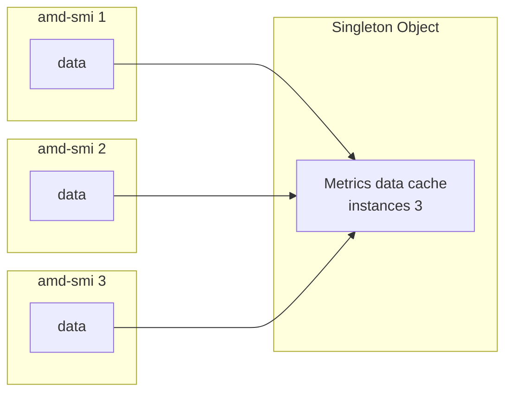

---
myst:
  html_meta:
    "description lang=en": "AMD SMI for reliability, availability, serviceability."
    "keywords": "system, management, interface, cper, log, error, spec, ecc, afid, fault, ras"
---

# Reliability, availability, serviceability (RAS)

RAS aims to increase the robustness of a system by detecting hardware errors, recording them, and
correcting them where possible. See [Reliability, availability, serviceability (Linux
kernel)](https://docs.kernel.org/admin-guide/RAS/main.html) for more general information.

## ECC

ECC (Error-Correcting Code) is a type of memory to automatically detect errors. Correctable 1-bit
errors are handled by the ECC logic and logged by the hardware. Uncorrectable 2-bit errors can be
detected but not reliably fixed; this is a more serious event that must be reported. See [RAS Error
Count sysfs Interface](https://docs.kernel.org/gpu/amdgpu/ras.html#ras-error-count-sysfs-interface)
to learn how AMD SMI accesses error counts.

While ECC is a mechanism to handle different errors, CPER is the standard used to report that the event
occurred.

## CPER

At its core, CPER (Common Platform Error Record) is a standard format included in the [UEFI
specification](https://uefi.org/specs/UEFI/2.10/01_Introduction.html) to report errors to the
operating system. It works as a standard error report template that different hardware components
can fill out when something goes wrong. It consists of a header, one or more section descriptors --
and for each descriptor, an associated section containing error or informational data. See [CPER
(UEFI Specification)](https://uefi.org/specs/UEFI/2.10/Apx_N_Common_Platform_Error_Record.html) for
more information.

A CPER record consists of vital information for diagnostics such as:

- Error source
- Error type
- Error severity
  - 0 - Recoverable (also called non-fatal uncorrected)
  - 1 - Fatal
  - 2 - Corrected
  - 3 - Informational
- Timestamp
- Other data

A CPER record might contain an AFID in its data to help map a complex error to a more actionable service task.

## AFID

AFIDs (AMD Field ID) are unique numerical IDs associated with specific events or errors produced by
AMD Instinct accelerators. It provides a specific identifier for a known condition, which helps
facilitate root cause analysis. Each AFID is associated with category, type, and severity fields. See
[AFID Event List](https://docs.amd.com/r/en-US/AMD_Field_ID_70122_v1.0/AFID-Event-List) for more
information.

## Multiple Initialization Performance Optimization

A static metrics cache was implemented in the amd-smi object which persists over multiple amd-smi instances.
This also applies to any multiple threaded C/C++ application.
Upon creation of the first amd-smi instance, a Singleton object that contains the metrics cache is instanciated.
Any amd-smi instances created thereafter will inherit the Singleton object metrics cache data.
Each amd-smi creation increases the usage counter in the Singleton object.
And each amd-smi destruction decreases the usage counter.
When the Singleton counter reaches zero, the metrics cache is destroyed along with the Singleton object.
This principle follows the Singleton Design Principal of sharing cached data across multiple objects.



The data caching can be controlled through two environment variables:
```
AMD_GPU_METRICS_CACHE_MS = 1 ms
AMD_ASIC_INFO_CACHE_MS = 10000 ms
```
These environment variables control how long information is stored in the data cache before it is refreshed.
Therefore calls for the system information will not trigger a system retrieval until the cache goes invalid and needs refreshing.

### Best Practice
The best practice is defined by the User.  If a mutliple threaded application or multiple amd-smi instances are only going to need information every 5 seconds, then set the environment variable to something slightly less than 5 seconds.
```
AMD_GPU_METRICS_CACHE_MS = 4900 ms
```
In that way, the system is not constantly updating the cache from requests by each of the instances in the threads.


## From concept to action

AMD SMI provides tools to programmatically monitor and manage these RAS features.

:::::{tab-set}
::::{tab-item} C/C++
The AMD SMI library provides APIs to query ECC error counts and manage CPER records
(list, decode, and clear).

See [ECC information](/doxygen/docBin/html/group__tagECCInfo) and [RAS
information](/doxygen/docBin/html/group__tagRasInfo) for available APIs.
::::

::::{tab-item} Python
See related APIs:

- [](/reference/amdsmi-py-api.md#amdsmi_get_gpu_ecc_count)
- [](/reference/amdsmi-py-api.md#amdsmi_get_gpu_ecc_enabled)
- [](/reference/amdsmi-py-api.md#amdsmi_get_gpu_ecc_status)
- [](/reference/amdsmi-py-api.md#amdsmi_get_gpu_total_ecc_count)
- [](/reference/amdsmi-py-api.md#amdsmi_get_gpu_cper_entries)
- [](/reference/amdsmi-py-api.md#amdsmi_get_afids_from_cper)
- [](/reference/amdsmi-py-api.md#amdsmi_get_gpu_ras_feature_info)
- [](/reference/amdsmi-py-api.md#amdsmi_get_gpu_ras_block_features_enabled)
::::

::::{tab-item} amd-smi CLI
See [`amd-smi ras --help`](/how-to/amdsmi-cli-tool.md#amd-smi-ras) for details and available options.
```shell
amd-smi ras --help
```
::::
:::::

## Further reading

- [AMD Field ID](https://docs.amd.com/r/en-US/AMD_Field_ID_70122_v1.0/Introduction)
- [CPER (UEFI specification)](https://uefi.org/specs/UEFI/2.10/Apx_N_Common_Platform_Error_Record.html)
- [Reliability, availability, serviceability (Linux kernel)](https://docs.kernel.org/admin-guide/RAS/main.html)
