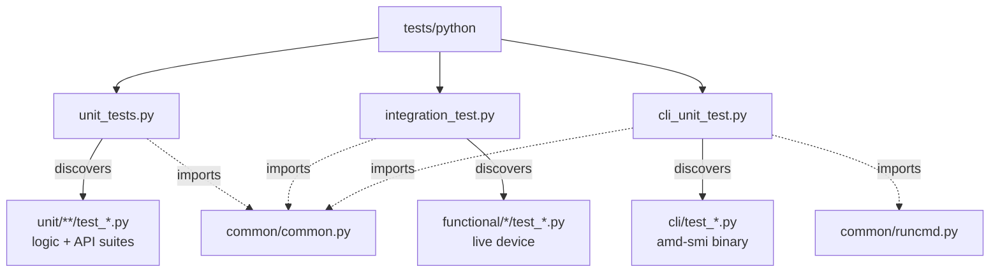
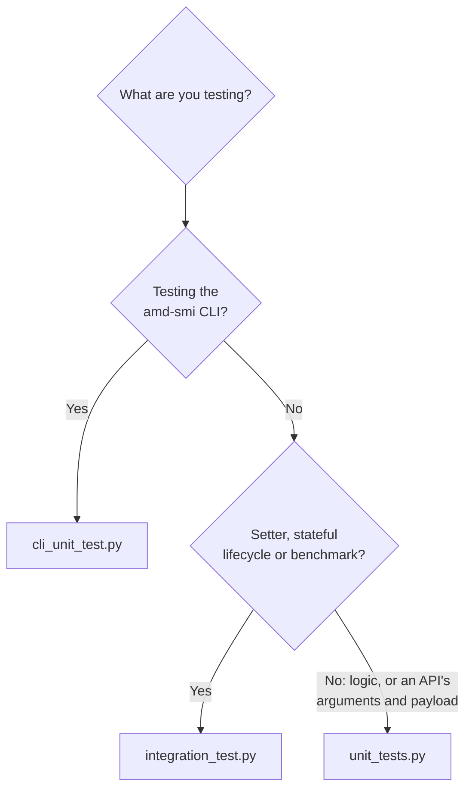
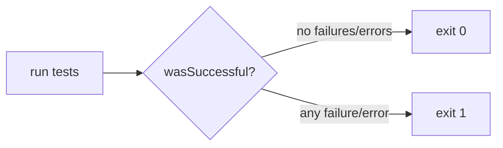
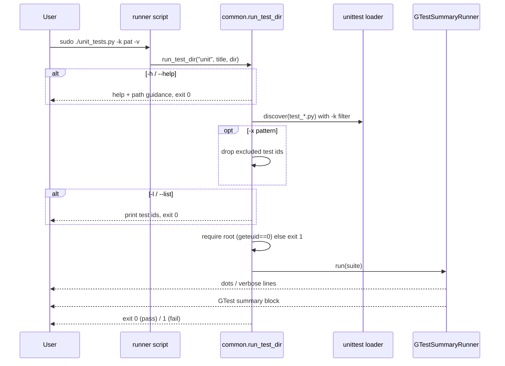

# AMD SMI Python Tests

Python `unittest`-based test suite for AMD SMI. Tests are split by **test type**
(unit vs. functional vs. CLI) and by **component** (gpu, cpu, nic, ifoe, system),
each driven by one of three top-level runner scripts.

For the broader design rationale (C++ + Python), see the test design guide:
[../../docs/conceptual/test-design.md](../../docs/conceptual/test-design.md).

---

## Contents

- [Layout](#layout)
- [Prerequisites](#prerequisites)
- [The three runners](#the-three-runners)
- [Choosing a runner](#choosing-a-runner)
- [Command-line options](#command-line-options)
- [Environment variables](#environment-variables)
- [Examples](#examples)
- [Interpreting the output](#interpreting-the-output)
- [Execution flow](#execution-flow)
- [Troubleshooting](#troubleshooting)

---

## Layout

```text
tests/python/
├── unit_tests.py           # runner: discovers unit/        (logic + live-device API suites)
├── integration_test.py     # runner: discovers functional/  (live hardware)
├── cli_unit_test.py        # runner: discovers cli/         (drives amd-smi CLI)
├── common/                 # shared runner + helpers (common.py, runcmd.py)
├── unit/                   # logic tests plus the live-device API suites
│   ├── system/             #   test_bdf.py, test_check_res.py, test_lifecycle.py, test_topology.py
│   ├── gpu/                #   apu_metrics, plus one suite per API area (power, clock, ras, ...)
│   ├── cpu/                #   identity, clock, power, thermal, dimm, energy, hsmp
│   ├── nic/                #   identity, switch
│   └── mock/               #   suites that replace amdsmi or the CLI's imports
│       ├── system/         #     output_file_stdin, ...
│       └── gpu/            #     cli_metric_partition, vcn_busy_navi, ...
├── functional/             # hardware tests (require a live device + root)
│   ├── gpu/  cpu/  nic/  ifoe/  system/
└── cli/                    # exercise the installed `amd-smi` binary
```

Test files are always named `test_*.py`; each runner discovers only its own
subtree.



---

## Prerequisites

- **Python 3.8+**
- The **`amdsmi` Python package installed** — every runner imports it at start-up
  (resolved via `AMDSMI_PATH` → `ROCM_HOME` → `ROCM_PATH` → `/opt/rocm`). See the
  [AMD SMI installation guide](https://rocm.docs.amd.com/projects/amdsmi/en/latest/).
- **Root privileges (`sudo`)** — all three runners enforce a root check and exit
  with an error if `geteuid() != 0`. Functional tests and the per-component unit
  API suites additionally need a live GPU/CPU/NIC; the remaining unit tests are
  logic-only but still go through the same runner. Running the API suites without
  root turns readable-only-as-root queries into `AMDSMI_STATUS_NO_PERM` failures.

---

## The three runners

| Runner | Discovers | Hardware | Purpose |
| :--- | :--- | :--- | :--- |
| `unit_tests.py` | `unit/` | For the API suites | BDF parsing, formatting and CLI logic against a stubbed C library, plus per-API argument rejection and payload validation |

`unit/<component>/` holds one suite per API area, and each API gets a single test that drives
it both ways via the driver in [common/common.py](common/common.py):

- **`reject()`** — one deliberately invalid argument per call; the library must refuse it. Every
  invalid value is rejected by the Python interface before the C entry point, so no device state can
  change even for a setter.
- **`expect()`** — valid arguments only. Prints the payload, checks it is structurally sound, and
  requires `AMDSMI_STATUS_SUCCESS`; a not-supported status is reported rather than failed.

Both repeat every call for each live processor handle and each enum value the other arguments take.
A suite skips when the platform has no processor of its kind, and an API skips when every
combination reports not-supported. Setters, stateful lifecycles and benchmarks stay in
`functional/`.

Within `unit/`, a test belongs in `unit/mock/<component>/` if it replaces `amdsmi` or
a CLI module in `sys.modules`; everything else goes directly in `unit/<component>/`.
Suites under `mock/` must inherit `common.common.ModuleIsolationMixin` and declare
`ISOLATED_MODULES` (and `ISOLATED_PATH` when they extend `sys.path`), so a stub never
outlives its suite — [unit/test_module_isolation.py](unit/test_module_isolation.py)
enforces this.
| `integration_test.py` | `functional/` | Yes | API calls against a live device |
| `cli_unit_test.py` | `cli/` | Yes | Runs the installed `amd-smi` binary and checks its output |

All three share the same option set and the same GTest-style summary, because
they all delegate to `common.run_test_dir()`.

### Invocation

From an installed package (recommended — avoids a shadowing `site-packages` copy):

```bash
sudo /opt/rocm/share/amd_smi/tests/python_unittest/unit_tests.py -v
sudo /opt/rocm/share/amd_smi/tests/python_unittest/integration_test.py -v
sudo /opt/rocm/share/amd_smi/tests/python_unittest/cli_unit_test.py -v
```

From this source tree:

```bash
sudo ./unit_tests.py -v
sudo ./integration_test.py -v
sudo ./cli_unit_test.py -v
```

> The install target maps `tests/python/` to `.../tests/python_unittest/` so the
> historical installed path keeps working unchanged.

---

## Choosing a runner



---

## Command-line options

Every runner accepts the same flags (parsed in `common/common.py`):

| Option | Long form | Effect |
| :--- | :--- | :--- |
| `-v`, `-vv` | `--verbose` | Verbose: each test body prints its own per-call output; the runner's own dot line is suppressed to avoid duplication. **Recommended.** |
| `-q` | `--quiet` | Quiet: suppress the title/legend/per-test prints; dots only. |
| `-b` | `--buffer` | Buffer each test's stdout/stderr; show it only if that test fails. |
| `-k PAT` | `--keyword PAT` | Run only tests whose id contains `PAT` (substring; `-kPAT` joined form also works). |
| `-x PAT` | `--exclude PAT` | Skip tests whose id contains `PAT` (the inverse of `-k`). |
| `-l` | `--list` | List all discovered test ids to **stdout** and exit (nothing runs). |
| `-h` | `--help` | Show unittest help plus AMD SMI env-var/path guidance and examples. |

Notes:

- `-k` and `-x` match against the **full dotted test id**, e.g.
  `cli.test_event.TestEvent.test_command`, so you can filter by file, class, or
  method name fragment.
- `-l` output goes to stdout (test-run chatter goes to stderr), so
  `... -l | grep xgmi` works cleanly.
- `-h` does **not** require root and never runs any test.

---

## Environment variables

| Variable | Meaning |
| :--- | :--- |
| `AMDSMI_PATH` | Path to the `amd_smi` share dir; overrides `ROCM_HOME`/`ROCM_PATH`. |
| `ROCM_HOME` | ROCm install root, used when `AMDSMI_PATH` is unset. |
| `ROCM_PATH` | Fallback ROCm install root (default `/opt/rocm`). |
| `NO_COLOR` | If set, disables ANSI colors in the summary (see <https://no-color.org/>). |

The resolved path must contain the `amdsmi` package. If a system-installed
`amdsmi` shadows the intended build, the runner prints an explicit remediation
block and exits.

---

## Examples

```bash
# List every unit test without running anything
sudo ./unit_tests.py -l

# Run all unit tests, verbose (recommended)
sudo ./unit_tests.py -v

# Run only BDF-parsing tests
sudo ./unit_tests.py -k "bdf" -v

# Run all functional tests except the performance suites
sudo ./integration_test.py -x performance -v

# Run only the CLI version-command test, buffering per-test output
sudo ./cli_unit_test.py -k "version" -b -v

# Point at a non-default build
sudo AMDSMI_PATH=/path/to/build/share/amd_smi ./integration_test.py -v
```

### `-l` (list) output

```text
Available tests:
    unit.gpu.test_apu_metrics.TestAmdSmiApuMetrics.test_convert_apu_unit_scalar
    unit.mock.gpu.test_vcn_busy_navi.TestVcnBusyNaviFallback.test_navi_vcn_busy_reads_sysfs
    unit.system.test_bdf.TestAmdSmiPythonBDF.test_parse_bdf
    unit.system.test_check_res.TestAmdSmiCheckRes.test_check_res
    ...
```

### `-v` (verbose) run

```text
AMD SMI Unit Tests

Running tests...

... (per-test output from each test body) ...

[----------] 12 tests ran. (34 ms total)
[  PASSED  ] 12 tests.
```

### A run with a skip and a failure

```text
======================================================================
Legend: . = pass, s = skipped, F = fail, E = error
======================================================================

[----------] 40 tests ran. (512 ms total)
[  PASSED  ] 38 tests.
[  FAILED  ] 1 test, listed below:
[  FAILED  ] TestPower.test_power_cap
[  SKIPPED ] 1 test, listed below:
[  SKIPPED ] TestOverdrive.test_overdrive_write
```

---

## Known failures

The API suites assert `AMDSMI_STATUS_SUCCESS` from every getter, which surfaces
defects that previously went unreported. On current hardware the following fail
for reasons in the library, not the tests — treat any *other* failure as a
regression:

| Status | Tests | Cause |
| :--- | :--- | :--- |
| `AMDSMI_STATUS_UNEXPECTED_DATA` | `test_get_clock_info`, `test_get_energy_count`, `test_get_gpu_activity`, `test_get_gpu_metrics_info`, `test_get_gpu_pci_bandwidth`, `test_get_gpu_xcd_counter`, `test_get_gpu_xgmi_link_status`, `test_get_link_metrics`, `test_get_pcie_info`, `test_get_temp_metric` (HBM sensors), `test_get_utilization_count`, `test_get_violation_status` | The library returns a payload it cannot parse |
| `AMDSMI_STATUS_NO_PERM` | `test_get_gpu_accelerator_partition_profile_config` | Only when run without root; the runners require `sudo`, so this passes normally |

These are tracked as library defects rather than suppressed, so that a fix flips
the test green without anyone having to remember to unmark it.

---

## Interpreting the output

**Progress legend** (shown in non-verbose mode). While tests run, `unittest`
prints one character per test:

| Char | Meaning |
| :--- | :--- |
| `.` | pass |
| `s` | skipped (feature/hardware not applicable) |
| `F` | failure (an assertion did not hold) |
| `E` | error (an unexpected exception was raised) |

**GTest-style summary** (always printed at the end, to stderr):

- `[----------] N tests ran. (X ms total)` — total count and wall-clock time.
- `[  PASSED  ] N tests.` — count that passed.
- `[  FAILED  ] ...` — one line per failing test, listed by `Class.method`.
  Errors and unexpected `@expectedFailure` successes are counted here too.
- `[  SKIPPED ] ...` — one line per skipped test.

Colors mirror GTest (green pass / yellow skip / red fail / cyan separator) and
are automatically suppressed when output is not a TTY or when `NO_COLOR` is set.

**Exit code** — the process exits `0` when every test passed (skips are OK) and
`1` if any test failed or errored. This is what CI keys off of.



---

## Execution flow

What `common.run_test_dir()` does for every runner:



---

## Troubleshooting

| Symptom | Cause / fix |
| :--- | :--- |
| `amdsmi path "..." does not exist` | Set `AMDSMI_PATH`, `ROCM_HOME`, or `ROCM_PATH` to a valid install. |
| `amdsmi loaded from '...' instead of expected path` | A system-installed `amdsmi` is shadowing the build. Run from the installed tests dir, set `AMDSMI_PATH`, or reinstall/uninstall the stale package (the error prints the exact commands). |
| `Please relaunch with elevated privileges.` then exit 1 | The runner requires root. Re-run with `sudo`. |
| Functional/CLI tests skip or fail | They need live hardware and the installed `amd-smi` binary on `PATH` (the CLI helper prepends `$ROCM_PATH/bin`). |

---

## Reference

- Test design guide: [../../docs/conceptual/test-design.md](../../docs/conceptual/test-design.md)
- Python `unittest`: <https://docs.python.org/3.8/library/unittest.html>
