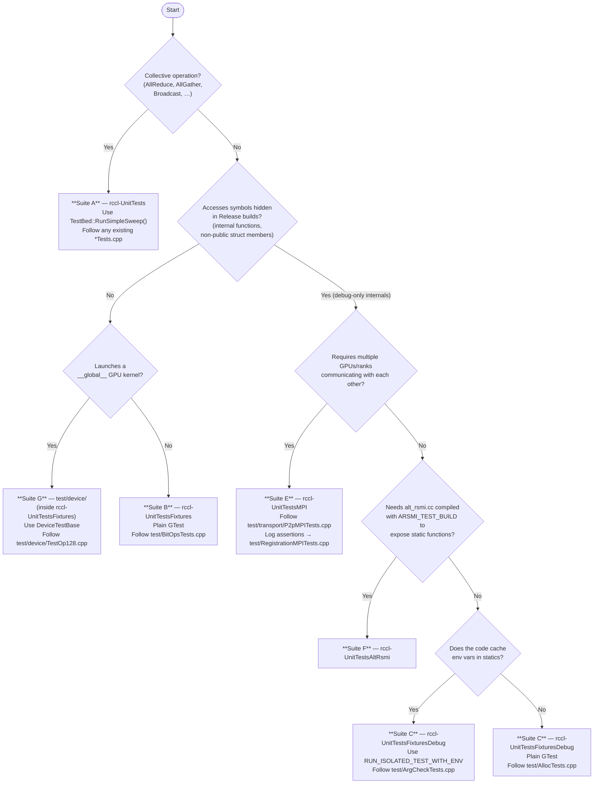

# RCCL Testing Guide

A practical reference for new hires. Covers every test suite, when to use it, which files to touch to add a test, and how to build and run each suite.

---

## Table of Contents

1. [Background and Philosophy](#1-background-and-philosophy)
2. [Repository Layout](#2-repository-layout)
3. [Quick-Reference Table](#3-quick-reference-table)
4. [Building the Tests](#4-building-the-tests)
5. [Suite A — `rccl-UnitTests` (Collective / TestBed)](#5-suite-a--rccl-unittests-collective--testbed)
6. [Suite B — `rccl-UnitTestsFixtures` (Header-Level, Release-Safe)](#6-suite-b--rccl-unittestsfixtures-header-level-release-safe)
7. [Suite C — `rccl-UnitTestsFixturesDebug` (Internal Symbols, Debug Only)](#7-suite-c--rccl-unittestsfixturesdebug-internal-symbols-debug-only)
8. [Suite E — `rccl-UnitTestsMPI` (Multi-Process / Multi-GPU)](#8-suite-e--rccl-unittestsmpi-multi-process--multi-gpu)
9. [Suite F — `rccl-UnitTestsAltRsmi` (AltRsmi Special Linkage, Debug Only)](#9-suite-f--rccl-unittestsaltrsmi-altrsmi-special-linkage-debug-only)
10. [Suite G — `rccl-UnitTestsFixtures` device/ (GPU Kernel Tests)](#10-suite-g--rccl-unittestsfixturesdevice-gpu-kernel-tests)
11. [The Python Test Runner](#11-the-python-test-runner)
12. [Multi-Node Testing with `mnctl`](#12-multi-node-testing-with-mnctl)
13. [Test Infrastructure Reference](#13-test-infrastructure-reference)
14. [Decision Guide — Which Suite?](#14-decision-guide--which-suite)
15. [Day-to-Day Cheat Sheet](#15-day-to-day-cheat-sheet)
16. [rccl-tests — Performance and Correctness](#16-rccl-tests--performance-and-correctness)

---

## 1. Background and Philosophy

RCCL is a multi-GPU, multi-node collective-communication library. Testing it requires multiple distinct strategies because:

- **Public API tests** run against the installed shared library and work in both Release and Debug builds.
- **Internal symbol tests** access non-public functions inside `librccl.so`, which are only externally visible when compiled with `-DCMAKE_BUILD_TYPE=Debug` (Release hides them via `-fvisibility=hidden`).
- **Static-variable tests** — RCCL code frequently caches `getenv()` results in static variables that are initialised once per process and never reset. Standard GTest runs all tests in one process, so test order affects results. These tests need process isolation (`fork()` a fresh child per test).
- **Collective-operation tests** need multiple communicating processes, one per GPU. A single process cannot meaningfully exercise AllReduce, AllGather, and similar operations. These tests use MPI.
- **GPU kernel tests** run device-side (`__global__`) code directly from the host, requiring a HIP kernel launch harness.

Each of these situations corresponds to a separate test binary. `test/CMakeLists.txt` is the single authoritative source for which source files belong to which binary; consult it whenever you are unsure.

---

## 2. Repository Layout

All RCCL test code lives under `test/` (paths relative to `projects/rccl/`). Only directories are listed here; for the current set of source files in each binary see `test/CMakeLists.txt`.

```
test/
├── CMakeLists.txt          ← single source of truth for all binaries
├── common/                 ← shared infrastructure: entry points, TestBed,
│                             process-isolation framework, MPI framework,
│                             RAII guards, device buffers, error-check macros
├── device/                 ← GPU kernel (device-side) tests and DeviceTestBase fixture
├── graph/                  ← graph / XML subsystem tests
├── transport/              ← MPI transport-layer tests (P2P, SHM, NET, IB)
├── proxy_trace/            ← proxy-trace subsystem tests
└── latency_profiler/       ← latency-profiler subsystem tests

tools/scripts/test_runner/
├── test_runner.py          ← Python orchestration entry point
├── configs/                ← JSON suite configs (ci-precheckin, mi300x_mellanox_ib, …)
└── lib/                    ← internal runner modules

docker/
└── mnctl/                  ← Python multi-node Docker orchestrator
```

Top-level `test/*.cpp` files are collective tests, fixture tests, and MPI tests; their binary assignment is entirely determined by which `set(…_SOURCE_FILES …)` list they appear in inside `test/CMakeLists.txt`.

---

## 3. Quick-Reference Table

| Binary | Build type | Uses MPI | When to use |
|--------|-----------|----------|-------------|
| `rccl-UnitTests` | Release **or** Debug | No | Collective operations, full-stack functional tests |
| `rccl-UnitTestsFixtures` | Release **or** Debug | No | Header-only internals, public struct/utility tests, GPU kernel tests |
| `rccl-UnitTestsFixturesDebug` | **Debug only** | No | Internal symbols hidden in Release (`ncclIbMalloc`, enqueue, proxy, etc.) |
| `rccl-UnitTestsMPI` | **Debug only** | **Yes** | Multi-process collective behaviour, transport-layer (P2P/SHM/NET/IB), multi-node |
| `rccl-UnitTestsAltRsmi` | **Debug only** | No | `alt_rsmi.cc` compiled with `ARSMI_TEST_BUILD` to expose static variables |

---

## 4. Building the Tests

### 4.1 Prerequisites

| Tool | Minimum | Notes |
|------|---------|-------|
| ROCm | 6.4.0 | Fixture and fixture-debug binaries require `ROCM_VERSION >= 60400` |
| CMake | 3.16 | |
| OpenMPI (or MPICH) | any | Required for Suite E; default install path `/opt/ompi` |
| Python | 3.6+ | For `test_runner.py` and `mnctl`; stdlib only, no pip dependencies |

### 4.2 Using `install.sh`

`install.sh` is the canonical build wrapper. Tests are compiled when you pass `-t` (or `--tests_build`).

```bash
# Release build — public tests only (Suites A and B)
./install.sh -t -l                          # -l = local GPU only (faster)

# Debug build — all non-MPI suites (A, B, C, F, G)
./install.sh --debug -t -l

# Debug build + MPI suites (all suites including E)
./install.sh --debug -t -l --enable-mpi-tests

# Debug + MPI, all GPU architectures (for multi-arch CI)
./install.sh --debug -t --enable-mpi-tests

# Pass extra CMake options
./install.sh --debug -t -l --cmake-options "-DFOO=ON -DBAR=OFF"

# Build with LLVM code-coverage instrumentation
./install.sh --debug -t -l --enable-code-coverage

# Build, then run a quick subset of tests
./install.sh --debug -t -l --run_tests_quick

# Build, then run every test binary
./install.sh --debug -t -l --run_tests_all
```

**Build output locations:**

| Build type | Directory |
|-----------|-----------|
| Release | `build/release/` |
| Debug | `build/debug/` |

Test binaries land at `build/{release,debug}/test/rccl-UnitTests*`.

> **`--enable-mpi-tests` requires `--debug`.**  
> MPI tests link against internal RCCL symbols that are not exported in Release builds.

### 4.3 Direct CMake (advanced)

```bash
mkdir -p build/debug && cd build/debug

cmake ../.. \
  -DCMAKE_BUILD_TYPE=Debug \
  -DBUILD_TESTS=ON \
  -DENABLE_MPI_TESTS=ON \
  -DMPI_PATH=/opt/ompi \
  -DBUILD_LOCAL_GPU_TARGET_ONLY=ON \
  -DROCM_PATH=/opt/rocm

make -j$(nproc) rccl-UnitTests rccl-UnitTestsFixtures rccl-UnitTestsFixturesDebug \
                rccl-UnitTestsMPI rccl-UnitTestsAltRsmi
```

### 4.4 Using a pre-built RCCL library

```bash
export RCCL_LIB_PATH=/path/to/existing/build   # must contain librccl.so and test/
python3 tools/scripts/test_runner/test_runner.py \
  --config tools/scripts/test_runner/configs/ci-precheckin.json
# build step is skipped automatically
```

---

## 5. Suite A — `rccl-UnitTests` (Collective / TestBed)

### What it tests

End-to-end collective operations (AllReduce, AllGather, AllToAll, Broadcast, Gather, Reduce, ReduceScatter, Scatter, SendRecv, GroupCall, NonBlocking) plus the recorder, proxy-trace, and latency-profiler subsystems. Tests spawn child worker processes internally via `CallCollectiveForked` — no MPI installation is needed.

### Test framework: TestBed

`TestBed` (`test/common/TestBed.hpp`) is a custom harness that forks child worker processes, assigns GPUs, initialises RCCL communicators, runs the collective, and verifies correctness. The primary entry point is `RunSimpleSweep()`; lower-level control is available via `RunSimpleConfig()`.

**Canonical example:** any existing `test/*Tests.cpp` file that uses `TestBed`. `test/AllReduceTests.cpp` is a good starting point — it covers in-place, out-of-place, managed memory, graph capture, and bias variants, showing the range of parameters `RunSimpleSweep()` accepts.

**Reference:** [Google Test primer](https://google.github.io/googletest/primer.html)

### Adding a test

To add a test to an existing collective, open the corresponding `test/*Tests.cpp` and add a new `TEST()` block following the patterns already present.

To test a new top-level feature, create `test/MyFeatureTests.cpp` and add its filename to the `TEST_SOURCE_FILES` list in `test/CMakeLists.txt`.

Sub-system tests (proxy-trace, latency-profiler, recorder) live in the subdirectories shown in the layout above; add to those files.

### Building and running

```bash
./install.sh -t -l                          # release is sufficient

./build/release/test/rccl-UnitTests         # run everything
./build/release/test/rccl-UnitTests --gtest_filter="AllReduce.OutOfPlace"
./build/release/test/rccl-UnitTests --gtest_filter="AllReduce.*"

# Debug output on failure
NCCL_DEBUG=INFO ./build/release/test/rccl-UnitTests --gtest_filter="AllReduce.OutOfPlace"
```

---

## 6. Suite B — `rccl-UnitTestsFixtures` (Header-Level, Release-Safe)

### What it tests

Tests that depend **only on header-defined symbols** — `inline`, `static`, `constexpr`, and template functions — and therefore link cleanly against both Release and Debug builds of RCCL. Typical targets: bit-manipulation utilities, communicator helper types, public enqueue helpers, and GPU device-code headers. See the `TEST_FIXTURE_SOURCE_FILES` list in `test/CMakeLists.txt` for the current set.

> **Rule of thumb:** if your test only `#include`s headers and does not require symbols compiled into `librccl.so`, it belongs here.

GPU kernel tests (Suite G) are also part of this binary; see [Section 10](#10-suite-g--rccl-unittestsfixturesdevice-gpu-kernel-tests).

**Canonical example:** `test/BitOpsTests.cpp` (plain GTest against a header-only utility). `test/CommTests.cpp` is another clean example.

### Adding a test

Add a new `TEST()` or `TEST_F()` block to an existing fixture test file, or create a new file and add it to `TEST_FIXTURE_SOURCE_FILES` in `test/CMakeLists.txt`.

### Building and running

```bash
./install.sh -t -l

./build/release/test/rccl-UnitTestsFixtures
./build/release/test/rccl-UnitTestsFixtures --gtest_filter="BitOps*"
```

---

## 7. Suite C — `rccl-UnitTestsFixturesDebug` (Internal Symbols, Debug Only)

### What it tests

Functions compiled into `librccl.so` that are hidden via `-fvisibility=hidden` in Release builds but accessible in Debug builds. This includes memory allocators, parameter lookup, argument checking, enqueue internals, socket utilities, proxy-thread code, the XML graph parser, ROCm library wrapping, and transport setup. See `TEST_FIXTURE_DEBUG_SOURCE_FILES` in `test/CMakeLists.txt` for the current list.

Many of these tests use `ProcessIsolatedTestRunner` because the code under test reads environment variables into static variables (see below).

### Process isolation — why you need it here

RCCL frequently caches `getenv()` results in `static` variables that are initialised once and never reset:

```cpp
static int p2pNetChunkSize = RCCL_VALUE_UNSET;
if (p2pNetChunkSize == RCCL_VALUE_UNSET) {
    const char* s = getenv("NCCL_P2P_NET_CHUNKSIZE");
    p2pNetChunkSize = s ? atoi(s) : calculateDefault();
}
```

If Test 1 sets `NCCL_P2P_NET_CHUNKSIZE=12345` and Test 2 clears it, the static variable retains `12345` — Test 2 sees stale state. `ProcessIsolatedTestRunner` solves this by running each test body in a `fork()`'d child process; static variables are always freshly initialised.

**Reference:**
- `test/common/ProcessIsolatedTestRunner.hpp` — API and macro definitions
- `test/common/ProcessIsolatedTestFramework.md` — full documentation with worked examples

**Canonical examples:**
- `test/AllocTests.cpp` — plain GTest against internal symbols (no env-var sensitivity)
- `test/ArgCheckTests.cpp` — `RUN_ISOLATED_TEST_WITH_ENV` for env-var-sensitive code
- `test/ProxyTests.cpp` — larger example combining both patterns
- `test/RcclWrapTests.cpp` — process-isolated tests for ROCm library wrapping, which caches state in statics
- `test/TransportTests.cpp` — transport setup tests using the `TransportUtils.hpp` helpers to construct minimal `ncclComm` / `ncclChannel` structures without a real network fabric

The available isolation macros are:

| Macro | Use |
|-------|-----|
| `RUN_ISOLATED_TEST(name, lambda)` | Single test, inherits parent environment |
| `RUN_ISOLATED_TEST_WITH_ENV(name, lambda, {{k,v},…})` | Single test, custom environment |
| `RUN_ISOLATED_TESTS(TestConfig("A", lA), TestConfig("B", lB), …)` | Multiple tests in one `TEST()` |

### Adding a test

For code that does **not** cache environment variables: add a plain `TEST()` block following `test/AllocTests.cpp`.

For code that **does** cache environment variables into statics: use `RUN_ISOLATED_TEST_WITH_ENV` following `test/ArgCheckTests.cpp`.

Add new source files to `TEST_FIXTURE_DEBUG_SOURCE_FILES` in `test/CMakeLists.txt`.

### Building and running

```bash
./install.sh --debug -t -l

./build/debug/test/rccl-UnitTestsFixturesDebug
./build/debug/test/rccl-UnitTestsFixturesDebug --gtest_filter="Alloc.*"

NCCL_DEBUG=INFO ./build/debug/test/rccl-UnitTestsFixturesDebug \
  --gtest_filter="MyInternal.EnvVarControlledBehaviour"
```

---

## 8. Suite E — `rccl-UnitTestsMPI` (Multi-Process / Multi-GPU)

### What it tests

Features that require genuine multi-process communication: P2P transport, shared-memory transport, network (NIC) transport, InfiniBand, user-buffer and graph-capture registration, and collective launch ordering. Each test is invoked via `mpirun`, which spawns one rank per GPU. See `MPI_TEST_SOURCE_FILES` in `test/CMakeLists.txt` for the current list, and the `test/transport/` subdirectory for transport-layer tests.

### Test framework: MPITestBase

`MPITestBase` (`test/common/MPITestBase.hpp`) is a Google Test adapter that inherits from both `::testing::Test` and `MPITestCore`. It handles RCCL communicator and HIP stream setup/teardown automatically, and provides guards that skip a test gracefully when its hardware prerequisites are not met.

**References:**
- `test/common/MPITestFramework.md` — complete framework documentation (start here)
- `test/common/MPITestBase.hpp` — GTest adapter API
- `test/common/MPITestCore.hpp` — framework-agnostic base (communicator creation, node validation)
- `test/common/MPIHelpers.hpp` — per-rank logging, `TestLogAssertionContext`
- `test/common/ResourceGuards.hpp` — RAII guards for communicators, streams, device memory
- `test/common/DeviceBufferHelpers.hpp` — typed `DeviceBuffer<T>` with `upload()`/`download()`
- `test/common/TestChecks.hpp` — `RCCL_TEST_CHECK`, `HIP_TEST_CHECK`, `TEST_INFO`, `TEST_WARN`, …
- [Google Test](https://google.github.io/googletest/primer.html)
- [Open MPI docs](https://www.open-mpi.org/doc/current/)
- [HIP programming guide](https://rocm.docs.amd.com/projects/HIP/en/latest/user_guide/programming_guide.html)

**Canonical examples:**
- `test/transport/P2pMPITests.cpp` — clean `MPITestBase` usage: `validateTestPrerequisites`, `createTestCommunicator`, `DeviceBuffer`, RAII guards, single-node constraint (`kRequireSingleNode`)
- `test/RegistrationMPITests.cpp` — `TestLogAssertionContext` for asserting on RCCL debug log output after an operation

### Key API reference

| Method / constant | What it does |
|---|---|
| `validateTestPrerequisites(min, max, pow2, min_nodes, max_nodes)` | Issues `GTEST_SKIP()` and returns `false` if prerequisites are not met |
| `createTestCommunicator()` | Creates a per-test `ncclComm_t` + `hipStream_t` |
| `getActiveCommunicator()` | Returns the per-test `ncclComm_t` |
| `getActiveStream()` | Returns the per-test `hipStream_t` |
| `MPIEnvironment::world_rank` / `::world_size` | Global MPI rank and size |
| `kRequireSingleNode` | Pass as `min_nodes` to skip when ranks span multiple hosts |
| `kNoNodeLimit` | Default: test runs regardless of node count |
| `RCCL_TEST_CHECK(expr)` | Asserts `ncclSuccess`; marks test failed and prints error otherwise |
| `HIP_TEST_CHECK(expr)` | Same for HIP error codes |
| `TEST_INFO(fmt, …)` | Printf-style log, printed only when `NCCL_DEBUG=INFO` |
| `TEST_WARN(fmt, …)` | Printed only when `NCCL_DEBUG=WARN` |

### Logging in MPI tests

`TEST_INFO`, `TEST_WARN`, `TEST_ABORT`, and `TEST_TRACE` are defined in `test/common/TestChecks.hpp`. They auto-prefix output with rank and hostname and are gated by `NCCL_DEBUG`:

```
NCCL_DEBUG=WARN  → TEST_WARN only
NCCL_DEBUG=INFO  → TEST_WARN + TEST_INFO          ← recommended for debugging
NCCL_DEBUG=ABORT → above + TEST_ABORT
NCCL_DEBUG=TRACE → all macros
```

Set `RCCL_MPI_LOG_ALL_RANKS=1` to redirect each rank's stderr to `rccl_test_rank_<N>.log` in the working directory; rank 0 also writes to the console. Use `TestLogAssertionContext` (see `test/common/MPIHelpers.hpp` and `test/RegistrationMPITests.cpp`) to capture and assert on NCCL debug output within a test.

### Adding a test

Add to an existing `transport/*MPITests.cpp` file for transport-layer tests, or to a top-level MPI test file for higher-level scenarios. For a new feature area, create a new file and add it to `MPI_TEST_SOURCE_FILES` in `test/CMakeLists.txt`. Wrap the file body in `#ifdef MPI_TESTS_ENABLED … #endif`.

Follow `test/transport/P2pMPITests.cpp` for the baseline pattern. If your test needs to assert that specific RCCL debug lines were emitted, follow `test/RegistrationMPITests.cpp`.

### Building and running

```bash
./install.sh --debug -t -l --enable-mpi-tests

# All MPI tests, 4 ranks
mpirun -np 4 ./build/debug/test/rccl-UnitTestsMPI

# One test
mpirun -np 2 ./build/debug/test/rccl-UnitTestsMPI \
  --gtest_filter="P2pMPITest.SimpleSendRecv"

# With per-rank logging
NCCL_DEBUG=INFO RCCL_MPI_LOG_ALL_RANKS=1 \
  mpirun -np 4 ./build/debug/test/rccl-UnitTestsMPI \
  --gtest_filter="MyFeatureMPITest.BasicAllReduce"
# Inspect: rccl_test_rank_2.log

# Multi-node
RCCL_TEST_MPI_HOSTFILE=~/.my_hostfile \
  mpirun -np 16 --hostfile ~/.my_hostfile \
    --map-by slot \
    --mca plm_rsh_agent "ssh -p 2224 -o StrictHostKeyChecking=no -q" \
    --allow-run-as-root \
    ./build/debug/test/rccl-UnitTestsMPI \
    --gtest_filter="NetMPITest.*"
```

---

## 9. Suite F — `rccl-UnitTestsAltRsmi` (AltRsmi Special Linkage, Debug Only)

### What it tests

`src/misc/alt_rsmi.cc` provides an alternative ROCm SMI integration path. Its internal functions use `static` linkage by default. `rccl-UnitTestsAltRsmi` compiles `alt_rsmi.cc` with `-DARSMI_TEST_BUILD`, which promotes selected statics to `extern` so tests can call them directly. See `TEST_ALTRSMI_SOURCE_FILES` in `test/CMakeLists.txt`.

### Adding a test

Add to the existing AltRsmi test file, or create a new file and add it to `TEST_ALTRSMI_SOURCE_FILES` in `test/CMakeLists.txt`.

### Building and running

```bash
./install.sh --debug -t -l

./build/debug/test/rccl-UnitTestsAltRsmi
./build/debug/test/rccl-UnitTestsAltRsmi --gtest_filter="AltRsmi.*"
```

---

## 10. Suite G — `rccl-UnitTestsFixtures` device/ (GPU Kernel Tests)

### What it tests

Device-side (`__global__`) RCCL kernel code. Tests in `test/device/` are compiled into `rccl-UnitTestsFixtures` (Suite B) — there is no separate binary. The `test/device/` subdirectory is the designated location for all GPU kernel tests.

### Test framework: DeviceTestBase

`test/device/DeviceTestBase.hpp` provides a GTest fixture with:
- `SetUp()` that calls `hipSetDevice(0)`
- `DeviceBuffer<T>` — typed RAII wrapper for `hipMalloc`/`hipFree` with `copyFrom()`, `copyTo()`, `upload()`, `download()`, and `zero()` methods
- `gridFor(n)` — computes the `dim3` grid for N elements at the default block size
- `syncAndCheck()` — asserts `hipGetLastError()` and `hipDeviceSynchronize()` both succeed

**Canonical example:** `test/device/TestOp128.cpp` — comprehensive GPU kernel tests covering multiple code paths (including detection of an out-of-bounds bug found during test authoring). Read this file before writing new device tests.

**Reference:** [HIP programming guide](https://rocm.docs.amd.com/projects/HIP/en/latest/user_guide/programming_guide.html)

### Adding a test

Create `test/device/MyKernelTests.cpp`, inherit from `DeviceTestBase`, and follow the structure in `test/device/TestOp128.cpp`. Add the file to `TEST_FIXTURE_SOURCE_FILES` in `test/CMakeLists.txt`. If the kernel header under test requires additional include directories, add a `target_include_directories` call for `rccl-UnitTestsFixtures` alongside the existing one for `TestOp128`.

### Building and running

```bash
./install.sh -t -l        # release is fine; --debug also works

./build/release/test/rccl-UnitTestsFixtures --gtest_filter="MyKernelTest.*"
```

---

## 11. The Python Test Runner

The Python test runner (`tools/scripts/test_runner/test_runner.py`) is the preferred way to run tests in CI and for systematic coverage sweeps. It reads a JSON config, optionally builds RCCL, dispatches each test individually via `--gtest_filter`, manages per-test timeouts and environment variables, and produces a summary report. It can also re-run failed tests with an escalated debug environment.

### Quick-start

```bash
cd projects/rccl

# Run the CI precheckin suite (single-node, all collectives)
python3 tools/scripts/test_runner/test_runner.py \
  --config tools/scripts/test_runner/configs/ci-precheckin.json

# Run the full MI300X + InfiniBand suite
python3 tools/scripts/test_runner/test_runner.py \
  --config tools/scripts/test_runner/configs/mi300x_mellanox_ib.json

# Run a single named test from the config
python3 tools/scripts/test_runner/test_runner.py \
  --config tools/scripts/test_runner/configs/ci-precheckin.json \
  --test-name "AllReduce.OutOfPlace"

# Skip the build step (use an existing build)
python3 tools/scripts/test_runner/test_runner.py \
  --config tools/scripts/test_runner/configs/ci-precheckin.json \
  --no-build

# Automatically rerun failures with the config's rerun_env_variables applied
python3 tools/scripts/test_runner/test_runner.py \
  --config tools/scripts/test_runner/configs/ci-precheckin.json \
  --rerun-failed

# Skip all MPI tests (single-node only)
python3 tools/scripts/test_runner/test_runner.py \
  --config tools/scripts/test_runner/configs/mi300x_mellanox_ib.json \
  --skip-mpi-check

# Use a pre-built RCCL (build step skipped automatically)
export RCCL_LIB_PATH=/path/to/existing/build
python3 tools/scripts/test_runner/test_runner.py \
  --config tools/scripts/test_runner/configs/ci-precheckin.json

# Generate an LLVM code-coverage report
python3 tools/scripts/test_runner/test_runner.py \
  --config tools/scripts/test_runner/configs/ci-precheckin.json \
  --coverage-report
```

### Adding your test to a config

The annotated template at `tools/scripts/test_runner/configs/test_config_sample.json` documents the full JSON schema — read it before creating or editing a config. Key concepts:

- A `test_configurations` block defines named configurations, each with a binary, rank/node/GPU counts, timeout, environment variables, and a list of test entries.
- Each test entry maps to one `--gtest_filter` invocation.
- `"extends": "other_config_name"` inherits and merges settings from another configuration, avoiding repetition.
- `"rerun_env_variables"` specifies the additional environment applied when `--rerun-failed` is active (typically escalating `NCCL_DEBUG` to `INFO`).
- A `test_suites` block at the top level assembles configurations into runnable suites.

To register a new test: add an entry to the `tests` array of the appropriate `test_configurations` block in `ci-precheckin.json` (for single-node tests) or `mi300x_mellanox_ib.json` (for MPI/network tests).

---

## 12. Multi-Node Testing with `mnctl`

`docker/mnctl/` is a pure Python 3 tool (no pip dependencies) that builds ROCm Docker containers, deploys them across multiple nodes, wires up inter-container SSH, and leaves you with a ready-to-use MPI cluster.

```bash
cd projects/rccl/docker

# ── Single node: build and launch ──
python3 -m mnctl --run
docker exec -it rccl-mn bash

# ── Multi-node (reads ~/.mnctl_hostfile or SLURM_NODELIST automatically) ──
cat > ~/.mnctl_hostfile <<'EOF'
node-a slots=8
node-b slots=8
EOF

python3 -m mnctl --launch-all --ssh     # build, deploy, auto-generate SSH keys

# Verify inter-container SSH
python3 -m mnctl --verify

# Run MPI tests across nodes
docker exec -it rccl-mn bash
mpirun -np 16 \
  --hostfile ~/.mnctl_hostfile --map-by slot \
  --mca plm_rsh_agent "ssh -p 2224 -o StrictHostKeyChecking=no -q" \
  --allow-run-as-root \
  /workspace/build/debug/test/rccl-UnitTestsMPI \
  --gtest_filter="NetMPITest.*"

# ── Tear down ──
python3 -m mnctl --stop-all
```

**Key features:**
- SLURM auto-detection (reads `SLURM_NODELIST` if no hostfile is present)
- Shared-filesystem detection (skips rsync when nodes share storage)
- SSH key auto-generation, or bring your own (`--ssh ~/.ssh/id_rsa`)
- Streaming output from remote containers

Full documentation: `docker/mnctl/README.md`.

---

## 13. Test Infrastructure Reference

### Headers you will use most

| Header (relative to `test/`) | What it provides |
|---|---|
| `common/TestBed.hpp` | `TestBed` + `RunSimpleSweep()` for collective tests (Suite A) |
| `common/ProcessIsolatedTestRunner.hpp` | `RUN_ISOLATED_TEST*` macros for env-var-sensitive tests (Suite C) |
| `common/MPITestBase.hpp` | `MPITestBase` GTest fixture for Suite E |
| `common/MPITestCore.hpp` | Framework-agnostic MPI base (`validateTestPrerequisites`, `createTestCommunicator`, …) |
| `common/MPIHelpers.hpp` | `initializeMPI`, `setupGPU`, `TestLogAssertionContext`, `getRankLogFilePath` |
| `common/MPIEnvironment.hpp` | `MPIEnvironment::world_rank`, `::world_size` |
| `common/MPIStandaloneTest.hpp` | Non-GTest MPI base for performance benchmarks |
| `common/ResourceGuards.hpp` | `makeScopeGuard`, `makeDeviceBufferAutoGuard`, `NcclRegHandleGuard` |
| `common/DeviceBufferHelpers.hpp` | Typed `DeviceBuffer<T>` with upload/download helpers (MPI tests) |
| `device/DeviceTestBase.hpp` | `DeviceTestBase`, `DeviceBuffer<T>`, `gridFor`, `syncAndCheck` (Suite G) |
| `common/TestChecks.hpp` | `RCCL_TEST_CHECK`, `HIP_TEST_CHECK`, `MPICHECK`, `TEST_INFO`, `TEST_WARN`, … |
| `common/EnvVars.hpp` | RAII `SetEnvVar`/`UnsetEnvVar` helpers |
| `common/TransportUtils.hpp` | Helpers for constructing minimal `ncclComm`/`ncclChannel` structures in transport tests (Suite C) |

### Documentation files in the repo

| File | Content |
|------|---------|
| `test/README.md` | Test suite overview |
| `test/common/ProcessIsolatedTestFramework.md` | Full `ProcessIsolatedTestRunner` documentation |
| `test/common/MPITestFramework.md` | Full MPI test framework documentation |
| `docker/mnctl/README.md` | `mnctl` multi-node Docker tool |
| `tools/scripts/test_runner/README.md` | Python test runner documentation |
| `tools/scripts/test_runner/configs/test_config_sample.json` | Annotated JSON config schema template |
| `../rccl-tests/README.md` | rccl-tests build, usage, and full argument reference |
| `../rccl-tests/src/collector.h` | NIC counter collector API and environment variable reference |

### External links

| Technology | Documentation |
|-----------|--------------|
| Google Test | https://google.github.io/googletest/primer.html |
| Google Mock | https://google.github.io/googletest/gmock_for_dummies.html |
| Open MPI | https://www.open-mpi.org/doc/current/ |
| HIP programming | https://rocm.docs.amd.com/projects/HIP/en/latest/user_guide/programming_guide.html |
| RCCL API | https://rccl.readthedocs.io/en/latest/ |
| ROCm docs | https://rocm.docs.amd.com/ |

---

## 14. Decision Guide — Which Suite?



---

## 15. Day-to-Day Cheat Sheet

### Build commands

```bash
# Release (Suites A, B, G)
./install.sh -t -l

# Debug (Suites A, B, C, F, G)
./install.sh --debug -t -l

# Debug + MPI (all suites)
./install.sh --debug -t -l --enable-mpi-tests
```

### Run commands

```bash
# Suite A
./build/release/test/rccl-UnitTests
./build/release/test/rccl-UnitTests --gtest_filter="AllReduce.OutOfPlace"

# Suite B
./build/release/test/rccl-UnitTestsFixtures

# Suite C (debug only)
./build/debug/test/rccl-UnitTestsFixturesDebug

# Suite E — 4 ranks
mpirun -np 4 ./build/debug/test/rccl-UnitTestsMPI

# Suite E — one test with per-rank logging
NCCL_DEBUG=INFO RCCL_MPI_LOG_ALL_RANKS=1 \
  mpirun -np 4 ./build/debug/test/rccl-UnitTestsMPI \
  --gtest_filter="P2pMPITest.SimpleSendRecv"

# Suite F (debug only)
./build/debug/test/rccl-UnitTestsAltRsmi

# Suite G (runs inside Suite B binary)
./build/release/test/rccl-UnitTestsFixtures --gtest_filter="MyKernelTest.*"
```

### Python test runner

```bash
# CI precheckin
python3 tools/scripts/test_runner/test_runner.py \
  --config tools/scripts/test_runner/configs/ci-precheckin.json

# Full MI300X+IB suite, rerun failures with debug env
python3 tools/scripts/test_runner/test_runner.py \
  --config tools/scripts/test_runner/configs/mi300x_mellanox_ib.json \
  --rerun-failed --verbose

# One test by name, skip build
python3 tools/scripts/test_runner/test_runner.py \
  --config tools/scripts/test_runner/configs/ci-precheckin.json \
  --test-name "AllReduce.OutOfPlace" --no-build
```

### rccl-tests (performance / correctness)

```bash
cd projects/rccl-tests

# Build (single GPU target, with MPI)
GPU_TARGETS="gfx942" make MPI=1 MPI_HOME=/opt/ompi NCCL_HOME=/opt/rocm -j$(nproc)

# Build via CMake (auto-detect local GPU, with MPI)
mkdir -p build && cd build
cmake -DCMAKE_BUILD_TYPE=Release \
      -DCMAKE_PREFIX_PATH="/opt/ompi;/opt/rocm" \
      -DUSE_MPI=ON \
      -DBUILD_LOCAL_GPU_TARGET_ONLY=ON ..
make -j$(nproc)
cd ..

# Single-node AllReduce sweep (8 GPUs)
./build/all_reduce_perf -b 8 -e 128M -f 2 -g 8

# Multi-node AllReduce (64 ranks, 8 per node)
mpirun -np 64 -N 8 ./build/all_reduce_perf -b 8 -e 8G -f 2 -g 1

# With local buffer registration (ncclCommRegister)
./build/all_reduce_perf -b 8M -e 128M -f 2 -g 8 -R 1

# With symmetric buffer registration (requires RCCL >= 2.27 + NCCL_CUMEM_ENABLE=1)
NCCL_CUMEM_ENABLE=1 ./build/all_reduce_perf -b 8M -e 128M -f 2 -g 8 -R 2

# HIP graph capture (10 replays)
./build/all_reduce_perf -b 8M -e 128M -f 2 -g 8 -G 10

# With NIC diagnostics (bnxt_re or ionic)
RCCL_TESTS_NET_COUNTER_ENABLE=1 NCCL_IB_HCA=bnxt_re0,bnxt_re1 \
  mpirun -np 8 ./build/all_reduce_perf -b 8M -e 128M -f 2 -g 1

# NIC diagnostics with counter subset
RCCL_TESTS_NET_COUNTER_ENABLE=1 RCCL_TESTS_NIC_COUNTER_LIST=rx_cnp_pkts,tx_cnp_pkts \
  NCCL_IB_HCA=bnxt_re0,bnxt_re1 \
  mpirun -np 8 ./build/all_reduce_perf -b 8M -e 128M -f 2 -g 1

# Pytest correctness suite
LD_LIBRARY_PATH=/opt/rocm/lib HSA_FORCE_FINE_GRAIN_PCIE=1 python3 -m pytest
```

### GTest flags

```bash
# List all tests without running
./rccl-UnitTests --gtest_list_tests

# Match multiple patterns
./rccl-UnitTests --gtest_filter="AllReduce*:Broadcast*"

# Exclude a pattern
./rccl-UnitTests --gtest_filter="-AllReduce.Channels"

# Stop on first failure
./rccl-UnitTests --gtest_fail_fast

# Repeat N times (flakiness hunting)
./rccl-UnitTests --gtest_repeat=10 --gtest_filter="AllReduce.OutOfPlace"

# Run tests marked DISABLED_
./rccl-UnitTests --gtest_also_run_disabled_tests
```

### Useful environment variables

| Variable | Effect |
|----------|--------|
| `NCCL_DEBUG=INFO` | Enable RCCL info logging; activates `TEST_INFO` in MPI tests |
| `NCCL_DEBUG=WARN` | Activates `TEST_WARN` in MPI tests |
| `NCCL_DEBUG=TRACE` | Activates all `TEST_*` macros |
| `NCCL_DEBUG_SUBSYS=REG` | Limit NCCL debug output to the registration subsystem |
| `RCCL_MPI_LOG_ALL_RANKS=1` | Redirect each MPI rank's stderr to `rccl_test_rank_<N>.log` |
| `RCCL_TEST_MPI_HOSTFILE` | Path to MPI hostfile used by the Python test runner |
| `RCCL_LIB_PATH` or `RCCL_BUILD_DIR` | Pre-built RCCL directory; skips build in `test_runner.py` |
| `MPI_PATH` | Override MPI installation directory (default: `/opt/ompi`) |
| `ROCM_PATH` | Override ROCm installation directory (default: `/opt/rocm`) |
| `HSA_NO_SCRATCH_RECLAIM=1` | Suppress GPU scratch-memory reclaim; recommended for stability |
| `UT_POW2_GPUS=1` | Restrict tests to power-of-two GPU counts |
| `NCCL_CUMEM_ENABLE=1` | Enable cuMem virtual-memory backing; required for symmetric buffer registration (`-R 2`) in rccl-tests |
| `RCCL_TESTS_NET_COUNTER_ENABLE=1` | Enable NIC counter collection in rccl-tests (bnxt_re / ionic NICs) |
| `RCCL_TESTS_NIC_COUNTER_LIST=rx_cnp_pkts,...` | Comma-separated subset of counters to collect (default: all counters for the detected NIC type) |
| `RCCL_TESTS_NET_COUNTER_NIC_PREFIX=ionic` | NIC prefix filter for auto-discovery when `NCCL_IB_HCA` is unset |

---

## 16. rccl-tests — Performance and Correctness

`projects/rccl-tests/` is a standalone performance and correctness tool for RCCL. It is complementary to the unit-test suites (A–C, E–G): the unit tests verify correctness and internal behaviour through GTest, while rccl-tests measures bandwidth and latency at scale and double-checks numerical correctness across collective types, data types, and reduction operations. Typical use cases are performance regression hunting, multi-node characterisation, and validating new hardware configurations.

Unlike the unit tests, rccl-tests is a separate project with its own build system. It lives at `projects/rccl-tests/` and is built independently of RCCL's `install.sh`.

### Supported GPU targets

Both the Makefile and CMake builds support: `gfx906`, `gfx908`, `gfx90a`, `gfx942`, `gfx950`, `gfx1030`, `gfx1100`, `gfx1101`, `gfx1102`, `gfx1151`, `gfx1200`, `gfx1201`, `gfx1250`.

> **`gfx1250`** was added in April 2026. HIP compatibility requires HIP ≥ 7.2.0 and is gated automatically in the Makefile.

### Building

```bash
cd projects/rccl-tests

# Makefile — one GPU target, with MPI
GPU_TARGETS="gfx942" make MPI=1 MPI_HOME=/opt/ompi NCCL_HOME=/opt/rocm -j$(nproc)

# Makefile — all default targets, no MPI (single-node only)
make NCCL_HOME=/opt/rocm -j$(nproc)

# CMake — auto-detect local GPU, with MPI
mkdir -p build && cd build
cmake -DCMAKE_BUILD_TYPE=Release \
      -DCMAKE_PREFIX_PATH="/opt/ompi;/opt/rocm" \
      -DUSE_MPI=ON \
      -DBUILD_LOCAL_GPU_TARGET_ONLY=ON ..
make -j$(nproc)
cd ..
```

Binaries are written to `build/` and named `<collective>_perf` (e.g. `all_reduce_perf`, `all_gather_perf`, `broadcast_perf`, `reduce_scatter_perf`, `reduce_perf`, `sendrecv_perf`, `alltoall_perf`, `alltoallv_perf`).

### Running

#### Single-node

```bash
# AllReduce sweep, 8 GPUs, 8 B → 128 MiB
./build/all_reduce_perf -b 8 -e 128M -f 2 -g 8

# Recommended for performance: 1 MPI rank per GPU
mpirun -np 8 --bind-to numa ./build/all_reduce_perf -b 8 -e 128M -f 2 -g 1
```

#### Multi-node

```bash
# 64 ranks across 8 nodes (8 GPUs each)
mpirun -np 64 -N 8 ./build/all_reduce_perf -b 8 -e 8G -f 2 -g 1
```

### Key flags

| Flag | Meaning |
|------|---------|
| `-b / -e / -f` | Min bytes, max bytes, step factor for the size sweep |
| `-g <n>` | GPUs per thread (use `-g 1` with MPI for 1 rank per GPU) |
| `-d <type>` | Data type (`float`, `bfloat16`, `fp8_e5m2`, `all`, …) |
| `-o <op>` | Reduction operation (`sum`, `prod`, `min`, `max`, `avg`, `all`) |
| `-n / -w` | Iteration and warmup counts |
| `-c <n>` | Correctness-check iterations (default 1) |
| `-G <n>` | Capture as HIP graph, replay N times |
| `-R 0` | No buffer registration (default) |
| `-R 1` | Local buffer registration via `ncclCommRegister` |
| `-R 2` | Symmetric buffer registration (requires RCCL ≥ 2.27, `NCCL_CUMEM_ENABLE=1`) |
| `-D <impl>` | Device API kernel implementation (0 = RCCL built-in; ≥ 1 requires `-R 2`) |
| `-A 1` | Print algorithm / protocol / channel count per message size |
| `-M 1` | Print memory usage report |
| `-J <file>` | Write JSON output |
| `-T <sec>` | Timeout per message-size step |

### Buffer registration modes (`-R`)

As of RCCL 2.27, rccl-tests supports three registration modes:

- **`-R 0`** (default): no registration; RCCL performs IPC handle exchange at runtime.
- **`-R 1`** (local): calls `ncclCommRegister` on send/recv buffers before the sweep, enabling RCCL to cache IPC handles and skip re-registration on each call. Supported with `hipMalloc` allocations on both GFX9 and CDNA3.
- **`-R 2`** (symmetric): uses cuMem virtual-memory allocations backed by `NCCL_CUMEM_ENABLE=1`. Enables a symmetric-memory code path in RCCL that avoids IPC entirely on supported hardware. Requires RCCL ≥ 2.27 and HIP ≥ 7.1. **LL protocol is temporarily disabled with `-R 2`.**

```bash
# Local registration
./build/all_reduce_perf -b 8M -e 128M -f 2 -g 8 -R 1

# Symmetric registration
NCCL_CUMEM_ENABLE=1 ./build/all_reduce_perf -b 8M -e 128M -f 2 -g 8 -R 2

# Symmetric + device API implementation 1 (requires -R 2)
NCCL_CUMEM_ENABLE=1 ./build/all_reduce_perf -b 8M -e 128M -f 2 -g 8 -R 2 -D 1
```

### NIC counter diagnostics

A self-contained network counter collector (`src/collector.cu` / `src/collector.h`) was added in March 2026 and extended with AINIC (ionic) NIC support in April 2026. When enabled, it snapshots NIC counters before and after each collective, computes deltas and rates, and prints a per-node summary table. It has no dependency on the RCCL or GPU runtimes.

Collection is triggered only on `localRank == 0, thread == 0` per node to avoid redundant work.

**Environment variables:**

| Variable | Effect |
|----------|--------|
| `RCCL_TESTS_NET_COUNTER_ENABLE=1` | Enable collection; without this, no output is produced |
| `NCCL_IB_HCA=bnxt_re0,bnxt_re1,...` | Primary NIC source; names are resolved via sysfs |
| `RCCL_TESTS_NIC_COUNTER_LIST=rx_cnp_pkts,...` | Comma-separated subset of counters (default: all counters for the detected NIC type) |
| `RCCL_TESTS_NET_COUNTER_NIC_PREFIX=ionic` | NIC prefix filter for auto-discovery when `NCCL_IB_HCA` is unset |

**Supported NIC types and their counter sources:**

| NIC type | Auto-detected by | Counter sources |
|----------|------------------|-----------------|
| `bnxt_re` (Thor2) | `bnxt_re` prefix in IB device name | ethtool -S, IB hw_counters, debugfs bnxt_re |
| `ionic` (AINIC) | `ionic` prefix in NIC name | ethtool -S, IB hw_counters |

**Example output:**

```
NET_COUNTER_TABLE: node=myhost  rank=0  duration_sec=18
------------------------------------------------------------
Device              rx_cnp_pkts    tx_cnp_pkts    ...
                    count  rate/s  count  rate/s
------------------------------------------------------------
bnxt_re0(benic7p1)      0    0.00      0    0.00
bnxt_re1(benic8p1)      0    0.00      0    0.00
------------------------------------------------------------
```

Rows are sorted by IB device name for consistent readability.

**Example invocations:**

```bash
# bnxt_re NICs
RCCL_TESTS_NET_COUNTER_ENABLE=1 NCCL_IB_HCA=bnxt_re0,bnxt_re1 \
  mpirun -np 8 ./build/all_reduce_perf -b 8M -e 128M -f 2 -g 1

# ionic NICs via auto-discovery
RCCL_TESTS_NET_COUNTER_ENABLE=1 RCCL_TESTS_NET_COUNTER_NIC_PREFIX=ionic \
  mpirun -np 8 ./build/all_reduce_perf -b 8M -e 128M -f 2 -g 1

# Only collect CNP counters
RCCL_TESTS_NET_COUNTER_ENABLE=1 NCCL_IB_HCA=bnxt_re0,bnxt_re1 \
  RCCL_TESTS_NIC_COUNTER_LIST=rx_cnp_pkts,tx_cnp_pkts \
  mpirun -np 8 ./build/all_reduce_perf -b 8M -e 128M -f 2 -g 1
```

### Pytest correctness suite

rccl-tests ships a small pytest suite in `test/` that exercises AllReduce, AllGather, Broadcast, Reduce, and ReduceScatter for correctness. These run the compiled binaries and check output.

```bash
cd projects/rccl-tests
# Fine-grained memory is required for the fine-grain memory-type tests
LD_LIBRARY_PATH=/opt/rocm/lib HSA_FORCE_FINE_GRAIN_PCIE=1 python3 -m pytest

# With a hostfile for multi-node runs
LD_LIBRARY_PATH=/opt/rocm/lib HSA_FORCE_FINE_GRAIN_PCIE=1 \
  python3 -m pytest --hostfile ~/.my_hostfile
```

### Relationship to the RCCL unit tests

| | rccl-tests | RCCL unit tests (A–C, E–G) |
|-|------------|-----------------------|
| **Purpose** | Bandwidth, latency, numerical correctness at scale | Functional correctness, internal invariants |
| **Build** | Separate project (`projects/rccl-tests/`) | Part of `projects/rccl/` via `install.sh -t` |
| **Framework** | Custom harness + MPI + pytest | GTest + TestBed + MPITestBase |
| **Typical scale** | 1–512+ GPUs, multi-node | 1–8 GPUs, single-node or small MPI |
| **When to use** | Perf regressions, hardware bring-up, NIC diagnostics | Feature correctness, CI gating |
