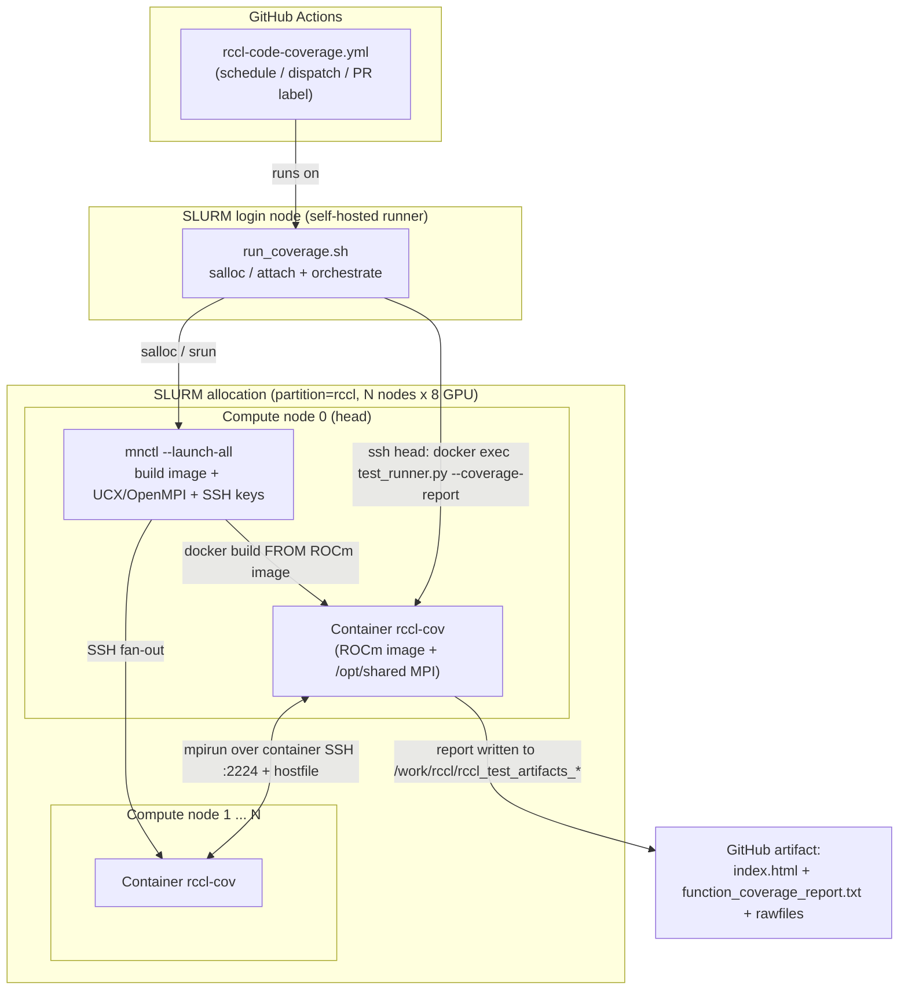
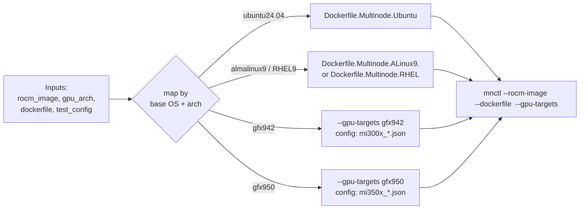

# RCCL Code Coverage CI — Design & Code Walkthrough

This document describes the GitHub Actions pipeline that runs RCCL code coverage on
a SLURM GPU cluster, using **released ROCm Docker images** as the base and the
**`rccl-utils/MultiNodeDocker` (`mnctl`)** utility to launch and orchestrate
multi-node containers.

It is the GitHub Actions translation of the legacy Jenkins `batch-codecoverage`
job. The Jenkins job submitted an `sbatch` script to a fixed SLURM reservation,
`module load`ed ROCm, pointed at a hardcoded OpenMPI path, and ran
`test_runner.py --coverage-report`. This design keeps `test_runner.py` as the
source of truth for the actual coverage build/collect/report, and replaces all of
the environment glue with a portable, image-based, `mnctl`-driven flow.

---

## TL;DR — start here

**What this does:** measures how much of the RCCL source code is exercised by its
test suites ("code coverage"), running the tests across multiple GPU nodes, and
publishes an HTML + text report as a GitHub artifact.

**How a run flows (30-second version):**

1. GitHub Actions (nightly, manual, or on a PR label) picks one or more *targets*
   (an OS + GPU arch + ROCm image + cluster combo).
2. For each target, a self-hosted runner on a SLURM **login node** grabs GPU nodes
   (`salloc`), then uses **`mnctl`** to launch one ROCm container per node and wire
   them together with SSH + MPI.
3. It runs `test_runner.py --coverage-report`, which builds RCCL with coverage
   instrumentation, runs the tests via `mpirun`, and generates the report.
4. The report is copied back to the runner and uploaded as an artifact. Nodes are
   always released afterward.

**Where things land:** `test_runner` writes the report into
`projects/rccl/rccl_test_artifacts_<RUN_ID>_<timestamp>/report/` (`index.html`,
`function_coverage_report.txt`), with `logs/` and structured `results/` alongside.
`RUN_ID` = `<arch>-<rocm>-<branch>[-pr<N>]` names that dir, the hostfile, and the log
prefix, so a run is recognizable at a glance and its dirs/logs correlate.

**Just want to run it yourself?** Jump to
[§7 Local testing](#7-local-testing-on-the-current-cluster) or the
[Common tasks](#common-tasks-how-do-i) table. New to the terminology? See the
[Glossary](#glossary).

> **Mental model:** the workflow does *not* run inside a container. It runs on the
> host (login node) and drives Docker on the compute nodes. `test_runner.py` (in
> the RCCL repo) is untouched and does the real build/test/report work — everything
> here just sets up the multi-node environment around it.

---

## Table of contents

**Quick reference (newcomers start here):**

- [TL;DR — start here](#tldr--start-here)
- [Glossary](#glossary)
- [Common tasks (how do I…?)](#common-tasks-how-do-i)

**Reference sections:**


1. [Goals & confirmed decisions](#1-goals--confirmed-decisions)
2. [High-level architecture](#2-high-level-architecture)
3. [End-to-end sequence](#3-end-to-end-sequence)
4. [Why not TheRock's `container:` model](#4-why-not-therocks-container-model)
5. [File-by-file walkthrough](#5-file-by-file-walkthrough)
6. [Deploying for different OS / arch / ROCm versions](#6-deploying-for-different-os--arch--rocm-versions)
7. [Local testing on the current cluster](#7-local-testing-on-the-current-cluster)
8. [Optimizations](#8-optimizations)
9. [Pitfalls & what could go wrong](#9-pitfalls--what-could-go-wrong)
10. [Testing runbook & multi-cluster enablement](#10-testing-runbook--multi-cluster-enablement)

---

## Glossary

Plain-language definitions of the terms used throughout this doc.

| Term | What it means |
|------|---------------|
| **Code coverage** | A measure of which source lines/functions were actually run by the tests. Higher = more of the code is tested. |
| **RCCL** | AMD's ROCm Communication Collectives Library (the code under test). |
| **rccl-tests** | A separate repo of performance/correctness test binaries (`all_reduce_perf`, …) that the suites invoke. |
| **ROCm** | AMD's GPU compute stack (the CUDA equivalent). A "ROCm image" is a Docker image with it preinstalled. |
| **gfx942 / gfx950** | GPU architecture codenames (e.g. `gfx942` = MI300X). Selects which GPU the build targets. |
| **SLURM** | The cluster job scheduler. You ask it for nodes; it grants an *allocation*. |
| **`salloc` / `srun` / `squeue` / `scontrol`** | SLURM commands: request an allocation / run a step / list jobs / inspect jobs & nodes. |
| **Login node vs compute node** | You land on a *login node* (no GPUs); it schedules work onto *compute nodes* (have the GPUs). |
| **`mnctl`** | `rccl-utils/MultiNodeDocker` — the tool that builds & launches one container per node and wires them with SSH + MPI. |
| **MPI / OpenMPI / UCX / `mpirun`** | The message-passing stack that lets processes on different nodes/GPUs talk. `mpirun` launches the multi-node job. |
| **Hostfile** | A text file listing the nodes (and GPU "slots" per node) that `mpirun` should use. |
| **Harbor / registry** | The private Docker registry (`registry-sc-harbor.amd.com`) the ROCm images are pulled from. Needs `docker login`. |
| **`.profraw`** | Raw coverage data files emitted by instrumented binaries at exit; merged into the final report. |
| **`RUN_ID`** | A recognizable id per run, `<arch>-<rocm>-<branch>[-pr<N>]` (e.g. `gfx942-7.13.0rc2-develop`). Used as `test_runner`'s `--report-suffix`, the hostfile name, and the log prefix. No timestamp — the `rccl_test_artifacts_<RUN_ID>_<timestamp>` dir already carries one. |
| **Bind mount / `--volume`** | Making a host directory appear inside the container at a given path (e.g. the RCCL source at `/work/rccl`). |
| **Artifact** | A file bundle GitHub Actions saves from a run so you can download it afterward (here: the coverage report). |
| **Self-hosted runner** | A GitHub Actions worker we host ourselves (on a SLURM login node), as opposed to GitHub's cloud runners. |

---

## Common tasks (how do I…?)

| I want to… | Do this |
|------------|---------|
| **Run coverage on my existing allocation** | See [§7](#7-local-testing-on-the-current-cluster). In short: `ALLOC_MODE=existing GPU_ARCH=gfx942 bash .github/scripts/run_coverage.sh`. |
| **Run coverage on fresh nodes** | `ALLOC_MODE=new NODES=2 PARTITION=rccl ACCOUNT=rccl bash .github/scripts/run_coverage.sh` (see [§10.2](#102-test-with-a-fresh-allocation-on-reservation-rccl_415)). |
| **Run only one test suite (fast)** | Add `TEST_SUITE=<config-key-or-display-name>`, e.g. `TEST_SUITE=ubr_multi_node`. The script translates config keys to display names for you. |
| **Trigger it from GitHub** | Actions → *RCCL Code Coverage* → *Run workflow*; optionally set `targets` (e.g. `gfx942,alola`) or per-run overrides. On PRs, add the `ci: code-coverage` label. |
| **Add a new OS / arch / ROCm target** | Append one row to `COVERAGE_TARGETS` in `coverage_configure.py` with `enabled: True` (see [§6](#6-deploying-for-different-os--arch--rocm-versions)). No YAML edits. |
| **Enable a new cluster (Alola/Ruby/TW)** | Fill a `CLUSTERS` row + register a runner (see [§10.3](#103-enable-on-alola--ruby--tw)). |
| **Find the report** | `projects/rccl/rccl_test_artifacts_<RUN_ID>_<timestamp>/report/index.html` locally, or download the `rccl-coverage-<target>` artifact from the run. |
| **Fix a private-image pull failure** | `docker login registry-sc-harbor.amd.com` on the nodes, or set `REGISTRY_USER`/`REGISTRY_TOKEN` (see [Pitfalls](#9-pitfalls--what-could-go-wrong)). |
| **Understand why my run failed** | Scan [§9 Pitfalls](#9-pitfalls--what-could-go-wrong) by symptom; each row lists the error text and the fix. |
| **Force a clean image/deps rebuild** | Set `FORCE_REBUILD=1` (adds `mnctl --rebuild`). |

---

## 1. Goals & confirmed decisions

| # | Decision | Value |
|---|----------|-------|
| Placement | Workflow lives in | `projects/rccl/.github/workflows/` |
| Base | ROCm provider | A released ROCm image, default `registry-sc-harbor.amd.com/framework/therock-release:47_gfx94X_7.13.0rc2_ubuntu24.04_py3.12_pytorch_release-2.11_96bfee1` |
| Launcher | Container orchestration | `rccl-utils/MultiNodeDocker` (`mnctl`), **checked out by the workflow** (`ROCm/rccl-utils`, `MNCTL_DIR`); staged onto shared FS if the runner workspace isn't visible on the compute nodes |
| Runner | Where the workflow runs | Self-hosted GitHub runner on a **SLURM login node**, which does `salloc`/`sbatch` |
| Source | RCCL repo (has `test_runner.py` + `install.sh`) | **Bind-mounted** at `/work/rccl` via `mnctl --volume` |
| Perf tests | `rccl-tests` repo (perf binaries: `all_reduce_perf`, ...) | **Bind-mounted** at `/work/rccl-tests` via `mnctl --volume`; `RCCL_TESTS_DIR=/work/rccl-tests` passed to `test_runner`. Host path defaults to sibling `projects/rccl-tests` (override with `RCCL_TESTS_DIR`) |
| Scope | Node count | **Multi-node** (default 2 nodes × 8 GPU) |
| MPI | MPI provider | **`mnctl`-provisioned** UCX + OpenMPI (built once into `/opt/shared`, cached) |
| Reporting | Where the report goes | **GitHub artifact** only (for now) |
| Portability | Must run on | Any cluster, any ROCm version, any gfx arch (all parameterized) |

Cluster facts baked into the defaults (from `sinfo` / `scontrol` on the current cluster):

- Partition: `rccl`, Account: `rccl`, 8 GPUs/node (`--gres=gpu:8`).
- Long-lived RCCL reservations exist: `rccl_415` (2 nodes, includes `jenkins_ci`), `rccl_92` (6 nodes).
- Nodes are MI300X (`gfx942`).

---

## 2. High-level architecture



**Key idea:** the workflow runs on the **host** (login node), not inside a job
container. `mnctl` builds a thin multi-node image *on top of* the released ROCm
image on every allocated node, launches one container per node, wires up
passwordless SSH between containers (port 2224) and an MPI hostfile, then a single
`docker exec` on the head node runs `test_runner.py --coverage-report`, whose
`mpirun` spans all nodes.

---

## 3. End-to-end sequence

```mermaid
sequenceDiagram
    participant GH as GitHub Actions
    participant SH as run_coverage.sh (login node)
    participant SL as SLURM
    participant MN as mnctl (head compute node)
    participant CT as Containers (all nodes)
    participant TR as test_runner.py (in head container)

    GH->>GH: setup job: coverage_configure.py -> matrix (per target)
    GH->>SH: coverage job (per target: image, arch, nodes, config)
    SH->>SL: salloc -N<nodes> -p rccl -A rccl --gres=gpu:8 (or attach existing job)
    SL-->>SH: allocation granted (SLURM_JOB_NODELIST)
    SH->>SH: derive RUN_ID (arch-rocm-branch[-prN]); write ~/.mnctl/$RUN_ID.hostfile; register teardown trap
    SH->>SH: preflight: docker pull image on all nodes (fail fast on auth)
    SH->>MN: ssh head "mnctl --launch-all --ssh --rocm-image ... --shared-dir <FS> --volume rccl:/work/rccl"
    MN->>CT: build image (FROM ROCm image) on each node
    MN->>CT: build UCX+OpenMPI once -> /opt/shared (cached)
    MN->>CT: distribute SSH keys, launch containers, start sshd:2224
    CT-->>MN: "=== Ready ==="
    SH->>TR: ssh head "docker exec rccl-cov test_runner.py --coverage-report"
    TR->>TR: install.sh --enable-code-coverage (build RCCL instrumented)
    TR->>CT: mpirun gtest suites (LLVM_PROFILE_FILE=*.profraw)
    TR->>TR: llvm-profdata merge + llvm-cov -> HTML + text report
    TR-->>SH: report in /work/rccl/rccl_test_artifacts_<RUN_ID>_<ts>; path written to RCCL_ARTIFACTS_DIR_FILE
    SH->>SH: read pointer -> chown that exact dir to runner user; export COVERAGE_ARTIFACT_DIR
    SH->>MN: ssh head "mnctl --stop-all"
    SH->>GH: upload-artifact($COVERAGE_ARTIFACT_DIR)  # exactly this run's dir
```

---

## 4. Why not TheRock's `container:` model

TheRock's test workflows pull a ROCm image the "native GitHub" way — a
job-level `container:` block whose image comes from an input/derived URL:

```118:126:/home/AMD/atkulkar/code/rocm-sparse/TheRock/.github/workflows/test_rocm_wheels.yml
      image: ${{ contains(inputs.test_runs_on, 'linux') && inputs.container_image_url != '' && inputs.container_image_url || null }}
      options: --ipc host
        --group-add video
        --device /dev/kfd
        --device /dev/dri
        --group-add 992
        --group-add 110
        --env-file /etc/podinfo/gha-gpu-isolation-settings
        --user 0:0
```

and, for native-package tests, derives the image per OS profile with a Python helper:

```115:127:/home/AMD/atkulkar/code/rocm-sparse/TheRock/.github/workflows/test_native_linux_packages_install.yml
      - name: Derive package type, GPU architecture, and container image
        id: derive
        run: |
          ...
          python build_tools/packaging/linux/get_url_repo_params.py get-container-image \
            --os-profile "${{ inputs.os_profile }}"
```

**Applicability to us:**

- ✅ **Reusable:** the *image-reference-as-input* pattern (parameterize the image
  URL, derive it per OS/arch) and the GPU `options` block (`--device /dev/kfd`,
  `--device /dev/dri`, `--ipc host`, `--group-add video`) map directly onto our
  `mnctl` launch args.
- ❌ **Not reusable for multi-node:** a job-level `container:` runs the *entire
  job inside one container on one runner*. MPI coverage needs **N containers
  across N nodes** with SSH between them. That is exactly what `mnctl` provides
  and what a single `container:` cannot. So we deliberately run `mnctl` on the
  **host** and let it manage per-node containers.
- ⚠️ **Registry auth:** GitHub's `container:` implicitly `docker pull`s (with
  `credentials:` if private). Because `mnctl` does `docker build FROM <image>` on
  **every** allocated node, each node's Docker must be able to pull from
  `registry-sc-harbor.amd.com` — i.e. `docker login` must be present on all nodes
  (or the image pre-pulled). This is the one extra operational requirement vs.
  TheRock's single-runner model. See [pitfalls](#9-pitfalls--what-could-go-wrong).

**Bottom line:** we borrow TheRock's "image URL as a parameter, derived per
os/arch" idea, but not its single-container execution model.

---

## 5. File-by-file walkthrough

All under `projects/rccl/`:

```
projects/rccl/
├── .github/
│   ├── workflows/
│   │   └── rccl-code-coverage.yml      # (1) GH Actions entry point (setup -> matrix -> coverage)
│   └── scripts/
│       ├── coverage_configure.py       # (2) target table -> build matrix (one row per target)
│       ├── run_coverage.sh             # (3) entry -> python run_workload.py --workload coverage
│       ├── run_workload.py             #     entrypoint: pick payload by --workload/$WORKLOAD
│       ├── orchestrator.py             #     RunConfig (dataclass) + Orchestrator (generic flow)
│       └── payloads/
│           ├── base.py                 #     Payload ABC (plugin contract)
│           ├── coverage.py             #     CoveragePayload
│           └── __init__.py             #     REGISTRY: workload name -> class
└── docs/
    └── rccl_code_coverage_ci.md        # (this document)
```

> **Class-based Python implementation.** The orchestration is a stdlib-only Python
> program: `run_workload.py` (entrypoint) + `orchestrator.py` (`RunConfig` dataclass
> and the generic `Orchestrator` flow: allocation, hostfile, registry login, mnctl
> launch, artifact collection, teardown) + `payloads/*.py` (workload plugins).
> `run_coverage.sh` — which the workflow calls — is a one-line shim to
> `run_workload.py --workload coverage`. The coverage-specific bits (rccl-tests
> mount, suite-name mapping, stale-CMake cleanup, the `test_runner` invocation) live
> in `payloads/coverage.py`. To add a workload, add a `payloads/<name>.py` `Payload`
> subclass and register it in `payloads/__init__.py`; the contract is documented in
> `payloads/base.py`. See `.github/scripts/README.md` for a quick tour.
>
> *(An equivalent bash implementation may exist locally as a historical fallback but
> is not tracked in the repository.)*

The workflow has two jobs: a lightweight `setup` job (on `ubuntu-24.04`) runs
`coverage_configure.py` to emit a matrix, then a `coverage` job fans out one run
per enabled target on the self-hosted `slurm-login` runner.

### (1) `rccl-code-coverage.yml`

Two-job entry point. Responsibilities:

- **Triggers:** daily `schedule`, manual `workflow_dispatch` (with a `targets`
  selector plus per-run overrides: image/dockerfile/arch/nodes/config/filters), and
  `pull_request` gated on the `ci: code-coverage` label (same gate as Jenkins).
- **`setup` job** (on `ubuntu-24.04`): runs `coverage_configure.py` → emits the
  build `matrix` and `has_targets`. Cheap; no cluster access.
- **`coverage` job**: `strategy.matrix` fan-out (one job per enabled/selected
  target, `fail-fast: false`), runs on a self-hosted login-node runner
  (`[self-hosted, <matrix.runner>]`). There is **no** job `container:` — the
  script drives Docker on compute nodes. Steps: checkout RCCL → checkout
  rccl-tests (into a sibling `rccl-tests/` subdir; `ROCm/rccl-tests` at the
  `rccl_tests_ref` input, default `develop`) → checkout rccl-utils (into a sibling
  `rccl-utils/` subdir; `ROCm/rccl-utils` at the `rccl_utils_ref` input, default
  `master`, providing `mnctl`) → run `run_coverage.sh` (matrix values +
  `RCCL_TESTS_DIR=$GITHUB_WORKSPACE/rccl-tests` and
  `MNCTL_DIR=$GITHUB_WORKSPACE/rccl-utils/MultiNodeDocker` passed as env) →
  `upload-artifact` of the coverage output (`if: always()`, named per target).
  **Everything the run needs (RCCL, rccl-tests, mnctl) is checked out by the
  workflow — no pre-provisioned cluster checkout is required.**

The workflow is intentionally thin; all cluster logic lives in the script so it
is testable standalone (see [§7](#7-local-testing-on-the-current-cluster)).

### (2) `coverage_configure.py`

A one-row-per-target table (`COVERAGE_TARGETS`) whose keys map directly to the env
`run_coverage.sh` consumes: `rocm_image`, `dockerfile`, `gpu_arch`, `test_config`,
`nic_type`, `nodes`, `runner`, plus `enabled`. It emits a GitHub Actions `matrix`
(`{"include": [...]}`) of all enabled rows, and `has_targets` to gate the coverage
job. The `targets` input selects a subset by target **name or gfx arch** (e.g.
`gfx942,gfx950`; `all` = every enabled row); a `workflow_dispatch` run that sets
`rocm_image` instead overrides the table and produces a single-entry matrix from
the inputs. **Adding a new OS/arch/ROCm target is one row** — no YAML changes.

### (3) `run_coverage.sh`

The orchestration brain. Structure:

1. **Inputs (env with defaults):** `ROCM_IMAGE`, `DOCKERFILE`, `GPU_ARCH`,
   `NODES`, `TEST_CONFIG`, `TEST_SUITE`, `TEST_NAME`, `PARTITION=rccl`,
   `ACCOUNT=rccl`, `GPUS_PER_NODE=8`, `TIME_LIMIT`, `RESERVATION`,
   `ALLOC_MODE` (`auto`/`new`/`existing`), `FORCE_REBUILD` (force image+deps
   rebuild), and `SHARED_FS_ROOT`/`SHARED_DIR`/`BUILDS_DIR` (shared-FS deps cache).
2. **Allocation resolution:**
   - `existing` (or `auto` when a running job is found): reuse the newest RUNNING
     job's nodes — the pattern used by `rccl-utils/SyncBench/.../multinode_slurm_run.sh`
     (`squeue -u $USER -t R`, `scontrol show hostnames`). Lets you test *now*
     against your already-allocated nodes.
   - `new`: `salloc -N$NODES -p $PARTITION -A $ACCOUNT --gres=gpu:$GPUS_PER_NODE
     --ntasks-per-node=$GPUS_PER_NODE [--reservation=$RESERVATION] -t $TIME_LIMIT`.
3. **Run id, hostfile + shared dirs:** derive a recognizable `RUN_ID`
   (`<arch>-<rocm>-<branch>[-pr<N>]`, sanitized; ROCm parsed from the image tag,
   branch/PR from `RCCL_BRANCH`/`PR_NUMBER` or `git`; reused across the `salloc`
   re-exec) and use it as `test_runner`'s `--report-suffix`, the per-run hostfile
   `~/.mnctl/$RUN_ID.hostfile` (`<node> slots=8`), and the `[run_coverage $RUN_ID]`
   log prefix. **No results dir is created here** — `test_runner` creates
   `rccl_test_artifacts_<RUN_ID>_<timestamp>/` during the run. Then it creates the
   shared-FS `SHARED_DIR`/`BUILDS_DIR` (kept per-arch for cross-run reuse).
   Passing `--hostfile` explicitly makes `mnctl` use it verbatim (no reliance on
   SLURM env surviving the `ssh` hop). `test_runner` also needs an MPI hostfile:
   `MPI_HOSTFILE` defaults to this dynamic file (mnctl mounts it into the
   container), or a user-supplied `RCCL_TEST_MPI_HOSTFILE` (mounted if different),
   and is passed into the container as `RCCL_TEST_MPI_HOSTFILE` so `test_runner`
   stops reporting `No MPI hostfile found`.
4. **Idempotent teardown registered early:** `trap cleanup EXIT INT TERM` (guarded
   by `CLEANED`) so any later failure still tears down. `cleanup` first calls
   `collect_results` (chown `rccl_test_artifacts_<RUN_ID>_*` to the runner user — see
   step 7.5) **before** the container is gone, then runs the idempotent
   `mnctl --stop-all` and a per-node `docker rm -f <container>` safety net.
5. **Fail-fast registry preflight:** `docker pull $ROCM_IMAGE` on **every** node;
   if any node can't pull, exit immediately with a `docker login <registry>` hint.
   Also warms each node's image cache for the build that follows.
5.5. **Ensure mnctl reaches the compute nodes (self-contained):** `mnctl` is invoked
   on the head node via `ssh "$HEAD" "cd $MNCTL_DIR && python3 -m mnctl …"`, so
   `MNCTL_DIR` must be visible there. Since the runner workspace holding the checkout
   may be node-local, the script tests `ssh $HEAD test -d $MNCTL_DIR/mnctl` and, if it
   fails, `rsync`s the source to `$SHARED_FS_ROOT/.mnctl-src/MultiNodeDocker` (shared
   FS) and runs from there. No-op when `MNCTL_DIR` is already visible (e.g. local dev).
6. **Launch (on the head compute node, via `ssh`):**
   `python3 -m mnctl --launch-all --ssh --hostfile ~/.mnctl/$RUN_ID.hostfile
   --rocm-image $ROCM_IMAGE --dockerfile $DOCKERFILE --gpu-targets $GPU_ARCH
   --name rccl-cov-$GPU_ARCH --shared-dir $SHARED_DIR --builds-dir $BUILDS_DIR
   --shared-fs yes [$REBUILD_FLAG] --volume <rccl>:/work/rccl
   --volume <rccl-tests>:/work/rccl-tests`. No `cov_out` mount — results go into the
   RCCL source mount (see below). The image is reused if cached and rebuilt only when
   missing (or when `FORCE_REBUILD=1` adds `--rebuild`); UCX/OpenMPI are built once
   into the shared-FS dir and reused across nodes/runs.
7. **Run coverage:** `ssh head docker exec rccl-cov-$GPU_ARCH bash -lc
   "cd /work/rccl && ROCM_PATH=/opt/rocm MPI_PATH=/opt/shared/ompi
   RCCL_TESTS_DIR=/work/rccl-tests python3
   tools/scripts/test_runner/test_runner.py --config configs/$TEST_CONFIG
   [--suite ...] [--test-name ...] --report-suffix $RUN_ID --coverage-report
   --emit-results"`. Filters + `--report-suffix` are passed as `docker exec -e` env
   vars and the arg array is rebuilt **inside** the container, so values with spaces
   survive the ssh/docker/bash quoting layers. There is **no `--results-dir`**, so
   `test_runner` writes everything (report + logs + emitted results) into
   `/work/rccl/rccl_test_artifacts_<RUN_ID>_<timestamp>/` — under the RCCL source
   bind-mount, i.e. on shared FS the runner already sees.
7.5. **Collect results (`collect_results`, idempotent):** the script resolves *exactly*
   which dir `test_runner` created. It passes `RCCL_ARTIFACTS_DIR_FILE` into the container,
   and `test_runner` writes the absolute workspace path it created to that pointer file
   (on shared FS, so the login node sees it too). `collect_results` reads the pointer's
   basename — deterministic, no globbing. If the pointer is missing (early failure, or an
   older `test_runner`), it falls back to a RUN_ID-scoped `find … -name
   'rccl_test_artifacts_<RUN_ID>_*'` (newest by lexical/timestamp order). `test_runner`
   creates the dir as **root** while `upload-artifact` runs on the login-node runner as a
   non-root user; because the dir lives under `$RCCL_DIR` (a shared-FS bind mount) no
   copy-back is needed — the script just `chown`s that exact dir (in-container, as root)
   and exports its basename as `COVERAGE_ARTIFACT_DIR`. Guarded for the case where nothing
   was created (early failure). Runs on success and failure, before teardown.
8. **Teardown:** fires via the `trap` on normal exit, error, or interrupt; if we
   `salloc`ed, the allocation is released when the block exits.

Why `ssh` to the head compute node instead of `srun`: an `srun --nodes=1` step
resets `SLURM_NODELIST` to a single node, which would break `mnctl`'s multi-node
view. Passing an explicit `--hostfile` over plain `ssh` (à la SyncBench) is the
robust pattern and matches how the cluster is already used.

### The unchanged core: `test_runner.py --coverage-report`

`mnctl` and the script only set up the *environment*. The actual coverage work is
in the RCCL repo and is invoked with `--coverage-report`:

```385:481:/home/AMD/atkulkar/code/rocm-sparse/projects/rccl/tools/scripts/test_runner/lib/test_executor.py
    def build_rccl(self):
        """
        Build RCCL using install.sh with configurable build settings.
        ...
```

The `mi300x_mellanox_ib.json` config already carries the coverage build flags and
the multi-node suites:

```16:19:/home/AMD/atkulkar/code/rocm-sparse/projects/rccl/tools/scripts/test_runner/configs/mi300x_mellanox_ib.json
  "build_configuration": {
    "install_flags": ["--debug", "-t", "-l", "--log-trace", "--enable-code-coverage", "--enable-mpi-tests", "--no_clean"],
    "cmake_options": "-DCMAKE_EXPORT_COMPILE_COMMANDS=ON",
    "parallel_jobs": 64
```

Report generation uses the ROCm image's own LLVM tools (`$ROCM/lib/llvm/bin/
llvm-profdata`, `llvm-cov`), producing `index.html` + `function_coverage_report.txt`.

---

## 6. Deploying for different OS / arch / ROCm versions

Everything that varies is an input to the workflow / env to the script. Nothing
in the pipeline hardcodes a ROCm version or arch.



Deployment recipe:

| To change… | Do this |
|------------|---------|
| **ROCm version** | Set `rocm_image` to the new release tag. Use a distinct `--name` (auto-nests `~/.docker-shared/<name>` so each version keeps its own UCX/OpenMPI). |
| **Base OS** | Pick the matching `Dockerfile.Multinode.*` (`Ubuntu`, `RHEL`, `ALinux9.<ver>`, `CentOSStream9`, `ManyLinux`). The default harbor image is `ubuntu24.04` → `Dockerfile.Multinode.Ubuntu`. |
| **GPU arch** | Set `gpu_arch` (→ `--gpu-targets`), the runner label, and (if needed) a arch-specific `test_config`. |
| **NIC** | `--nic-type mellanox` (default) or `ainic`; `mnctl` auto-prepends the matching `post-setup/<nic>` dir. |
| **New cluster** | Adjust `PARTITION`/`ACCOUNT`/`RESERVATION`/`GPUS_PER_NODE`. If no SLURM, provide a static `--hostfile`. |

This is exactly what `coverage_configure.py` provides: append one row to
`COVERAGE_TARGETS` (with `enabled: True`) and the nightly matrix picks it up — no
YAML edits. Two disabled example rows (`gfx950-ubuntu24`,
`gfx942-almalinux9-7.1.2`) are included as templates; fill in their image tags and
flip `enabled` to deploy.

---

## 7. Local testing on the current cluster

You already have a 2-node allocation (`squeue`: job on `ctr-cx65-mi300x-[12,21]`,
partition `rccl`, 8 GPU/node). Test **without** GitHub, directly with the script:

```bash
cd ~/code/rocm-sparse/projects/rccl

# Reuse your existing running allocation (no new salloc):
ALLOC_MODE=existing \
GPU_ARCH=gfx942 \
REGISTRY_USER="$USER" \
REGISTRY_TOKEN='<harbor-cli-secret-or-robot-token>' \
ROCM_IMAGE=registry-sc-harbor.amd.com/framework/therock-release:47_gfx94X_7.13.0rc2_ubuntu24.04_py3.12_pytorch_release-2.11_96bfee1 \
DOCKERFILE=Dockerfile.Multinode.Ubuntu \
TEST_CONFIG=mi300x_mellanox_ib.json \
MNCTL_DIR=~/code/rocm-sparse/rccl-utils/MultiNodeDocker \
bash .github/scripts/run_coverage.sh
```

Incremental bring-up (recommended first time):

```bash
# 0. Make sure Docker can pull the private base image on the compute nodes.
#    Non-interactive (works over ssh); token via stdin so it never hits argv/ps:
echo '<harbor-cli-secret-or-robot-token>' | \
  ssh <node> "docker login registry-sc-harbor.amd.com -u '$USER' --password-stdin"

# 1. Dry-run mnctl (no launch) to validate SSH/hostfile/devices:
cd rccl-utils/MultiNodeDocker
python3 -m mnctl --launch-all --ssh --dry-run --rocm-image  --dockerfile Dockerfile.Multinode.Ubuntu

# 2. Launch only, then exec a trivial MPI smoke test:
python3 -m mnctl --launch-all --ssh --rocm-image  --dockerfile Dockerfile.Multinode.Ubuntu --gpu-targets gfx942 --name rccl-cov
python3 -m mnctl --verify                          # SSH across containers
docker exec rccl-cov bash -lc 'mpirun --version && rocminfo | grep gfx'

# 3. Full coverage run (small filter first to keep it fast):
# NOTE: test_runner's --suite-name globs the suite DISPLAY name (e.g. "UBR Tests -
# Multi Node"), not the registry config key ("ubr_multi_node"). run_coverage.sh
# translates a config key for you; a raw test_runner call must use the display name.
docker exec rccl-cov bash -lc 'cd /work/rccl && ROCM_PATH=/opt/rocm MPI_PATH=/opt/shared/ompi \
  python3 tools/scripts/test_runner/test_runner.py --config tools/scripts/test_runner/configs/mi300x_mellanox_ib.json \
  --suite-name "Unit Tests - Standard Collectives" --coverage-report --verbose --emit-results'
# Report + logs + results land in /work/rccl/rccl_test_artifacts_<timestamp>/ (no --results-dir).

# 4. Tear down:
python3 -m mnctl --stop-all
```

Tips:
- `--verbose` on any `mnctl` command prints the exact `docker`/`ssh` commands to replay by hand.
- First run builds UCX/OpenMPI (minutes); subsequent runs are cached in `~/.docker-shared/<name>`.
- Start with a single suite (`--suite`) or `--test-name` filter to validate the plumbing before the full matrix.

---

## 8. Optimizations

**Time / cost** (implemented in `run_coverage.sh` + `coverage_configure.py`)
- **Cache the multi-node image (with rebuild fallback).** `mnctl` reuses the cached
  image when its tag exists and **rebuilds automatically only if it is missing**.
  The stable per-arch `--name` keeps the tag stable across nightly runs. Force a
  clean rebuild with `FORCE_REBUILD=1` (adds `mnctl --rebuild`).
- **Cache UCX/OpenMPI on shared FS.** The script points `--shared-dir`/`--builds-dir`
  at `$SHARED_FS_ROOT/.docker-{shared,builds}/<container>` (default `$HOME`, must be
  NFS/GPFS/Lustre) and passes `--shared-fs yes`, so the leader builds UCX/OpenMPI
  once and all nodes + future runs reuse it. Biggest single win after the first run.
- **Parallelize + select the arch/version matrix.** `coverage_configure.py` emits a
  matrix (one job per enabled target, `fail-fast: false`). The `targets`
  workflow_dispatch input selects a subset by target name or gfx arch (e.g.
  `gfx942,gfx950`); `all` (default) runs every enabled row. For true concurrency
  give each target row its own `runner` label (a single self-hosted runner
  serializes jobs).
- **`--no_clean` incremental RCCL builds.** Already in the config; persist the RCCL
  build dir on shared FS to make instrumented rebuilds incremental across runs.
  The build runs **inside the container** against the source bind-mounted at
  `/work/rccl`, so `build/*/CMakeCache.txt` bakes that path. On a re-run the
  existing `build/` is reused: no source change → near-noop; source changed →
  CMake/ninja rebuilds only what changed. `run_coverage.sh` does **not** wipe the
  build dir blindly (that would force a full rebuild every run). Instead it reads
  `CMAKE_HOME_DIRECTORY` from each `CMakeCache.txt` and only cleans when it does
  **not** match the container mount (`/work/rccl`, `/work/rccl-tests`) — i.e. the
  cache was configured elsewhere (a prior host build under `/home/...`, or a
  different runner workspace). In that case it logs a `WARNING: stale CMake cache
  detected` and removes `build/` before building; otherwise it keeps the dir for
  an incremental build. This preserves the "build once, then incremental" behavior
  while avoiding the `CMakeCache.txt directory ... is different` failure.
  - **Runs inside the container as root.** The check+clean is executed via
    `docker exec` (fed a script over stdin), **not** on the host. The in-container
    build runs as root, so its `build/` artifacts are root-owned; a host-side
    `rm` would fail with `Permission denied`. Cleaning in-container removes them
    correctly, and the deletion propagates to the host through the bind mount.
  - **Under GitHub Actions:** with `actions/checkout` the source lives at the
    runner workspace path, but the build only ever happens inside the container
    (always `/work/rccl`), so the first configure bakes a compatible path and the
    stale-cache wipe effectively never triggers in CI. Incremental reuse across
    re-runs requires the build dir to survive between jobs — persist it on shared
    FS (or a stable self-hosted runner workspace); ephemeral/cleaned workspaces
    always start from a clean build regardless.
- **Right-size the allocation & time limit.** Use `--reservation=rccl_415` to avoid
  queue wait; request only the nodes the chosen config needs.
- **Filter by default for presubmit.** On PRs, run a reduced suite (fast signal);
  run the full matrix only on the nightly schedule.
- **Parallelize the arch/version matrix** with a workflow `matrix:` so gfx942 and
  gfx950 run concurrently on separate allocations.

**Signal / usefulness**
- **Publish a coverage % summary** to the GitHub Step Summary (parse
  `function_coverage_report.txt`) so results are visible without downloading the
  artifact.
- **Trend over time** later by pushing the summary to S3/a dashboard (deferred per
  decision #6).

**Robustness** (implemented in `run_coverage.sh`)
- **Non-interactive registry login.** If `REGISTRY_USER` + `REGISTRY_TOKEN` are set
  (a Harbor CLI secret or robot/service-account token), the script logs in on every
  node via `docker login --password-stdin` (token piped over stdin, never in argv).
  This avoids the `Cannot perform an interactive login from a non TTY device` error
  you get running plain `docker login` over `ssh`. In CI, store these as GitHub
  secrets and export them into the step; the faceless account swaps in transparently.
  Leave unset if nodes are already logged in.
- **Fail fast on registry auth.** Before any build, the script `docker pull`s the
  base image on **every** node; if any node can't pull, it exits immediately with
  a `docker login <registry>` hint (instead of failing minutes into the build).
  The pull also warms each node's cache so the subsequent `build FROM` reuses it.
- **Idempotent, self-healing teardown.** A `trap cleanup EXIT INT TERM` runs once
  (guarded by a `CLEANED` flag) on normal exit, error, or interrupt. It calls the
  idempotent `mnctl --stop-all` and then a per-node `docker rm -f <container>`
  safety net, so containers/GPUs are never leaked even if a node was unreachable
  via the head. `salloc`ed nodes are released automatically when the block exits.

---

## 9. Pitfalls & what could go wrong

| Area | Risk | Mitigation |
|------|------|-----------|
| **Private registry auth** | `mnctl` builds `FROM` the harbor image on *every* node; a node without `docker login` fails the build. | **Handled:** the script's preflight `docker pull` on every node fails fast with a `docker login` hint before any build starts. Pre-login the nodes to fix. |
| **SLURM env across `ssh`** | `SLURM_NODELIST` does not survive a plain `ssh` hop; `srun -N1` shrinks it to one node. | Always pass `mnctl --hostfile ~/.mnctl/$RUN_ID.hostfile` (explicit; script writes it from `scontrol show hostnames`). |
| **test_runner can't find MPI hostfile** | `No MPI hostfile found (checked RCCL_TEST_MPI_HOSTFILE env var and ~/.mpi_hostfile)` — MPI tests get skipped. | **Handled:** `run_coverage.sh` sets `RCCL_TEST_MPI_HOSTFILE` in the container to the dynamic mnctl hostfile (already mounted), or to a user-supplied `RCCL_TEST_MPI_HOSTFILE` (mounted if it differs). In CI, optionally set the `RCCL_TEST_MPI_HOSTFILE` repo/org variable; empty = use the dynamic one. |
| **All suites skipped: `does not match --suite-name`** | `--suite-name` globs the suite **display name** (e.g. `UBR Tests - Multi Node`), but a registry **config key** (e.g. `ubr_multi_node`) was passed, so nothing matches and every suite is skipped. | **Handled:** `run_coverage.sh` accepts either — it looks up `TEST_SUITE` in the config's `test_suites[]` and, if it's a `config` key, translates to the matching display name(s) (`:`-joined). A raw `test_runner` call must use the display-name glob directly. |
| **Login node has no Docker/GPU** | Running `mnctl` on the login node may fail image build / device access. | Run `mnctl` on the **head compute node** via `ssh` (script does this), not on the login node. |
| **Shared-dir reuse across ROCm versions** | UCX is built `--with-rocm=/opt/rocm`; reusing one `shared_dir` across images silently disables GPU/RDMA transports or crashes at MPI init. | One `--name` per (image, arch); `mnctl` auto-nests `~/.docker-shared/<name>`. Never share across versions. |
| **Container SSH port / NIC** | Inter-container MPI uses port 2224 + RDMA libs; wrong NIC type or blocked port hangs `mpirun`. | Set correct `--nic-type` (mellanox/ainic); `--verify` before the run; ensure 2224 open between nodes. |
| **Home dir not shared** | Hostfile / SSH keys written on the login node may not be visible on compute nodes. | Ensure `~` is on shared FS (typical here), or let `mnctl --launch-all` rsync (it detects shared FS). |
| **UID/GID & GPU perms** | Artifacts written as root inside the container; `/dev/kfd` perms. | Entrypoint remaps UID/GID to host and `chmod 666` GPU devices; `collect_results` chowns the artifacts dir to the runner user afterward. |
| **Results not reaching the runner / artifact** | `test_runner` writes `rccl_test_artifacts_<RUN_ID>_<timestamp>/` **as root**, but `upload-artifact` runs on the **login-node runner** as a non-root user, so the root-owned dir isn't readable → `if-no-files-found: warn`. | **Handled:** the dir lives under `$RCCL_DIR` (a shared-FS bind mount the runner already sees), so no copy-back is needed. `test_runner` records the exact dir it created via `RCCL_ARTIFACTS_DIR_FILE`; `collect_results()` reads that pointer (fallback: RUN_ID-scoped `find`), `chown`s that exact dir in-container, and exports `COVERAGE_ARTIFACT_DIR`. The workflow then `upload-artifact`s `$COVERAGE_ARTIFACT_DIR` with `if: always()`. |
| **Coverage build is slow/heavy** | Instrumented `--debug` build + all suites can exceed the time limit. | Generous `-t`, incremental `--no_clean` build cache, suite filters for presubmit. |
| **Stale CMake cache (path mismatch)** | A `build/` created outside the container (host build under `/home/...`, or a different workspace) makes the in-container build fail: `CMakeCache.txt directory ... is different` / `source ... does not match`. | **Handled:** `run_coverage.sh` compares each `build/*/CMakeCache.txt`'s `CMAKE_HOME_DIRECTORY` to the container mount (`/work/rccl` and `/work/rccl-tests`) and cleans the offending `build/` only on mismatch (logging a WARNING), keeping it otherwise for incremental reuse. The check+clean runs **inside the container as root** (via `docker exec`), because the build's `build/` artifacts are root-owned and a host-side `rm` fails with `Permission denied`. Don't run a host-side CMake build in the same tree. |
| **rccl-tests source missing** | `test_runner` builds the perf binaries from `${RCCL_TESTS_DIR:-${WORKDIR}/../rccl-tests}` → `/work/rccl-tests`; if it isn't mounted the run fails with `rccl-tests source directory not found: /work/rccl-tests`. | **Handled:** `run_coverage.sh` resolves `RCCL_TESTS_DIR` (default sibling `projects/rccl-tests`), fails fast if absent, bind-mounts it at `/work/rccl-tests`, and exports `RCCL_TESTS_DIR=/work/rccl-tests` into the container. In CI, check out rccl-tests alongside rccl or set `RCCL_TESTS_DIR`. |
| **mnctl not found / not visible on compute nodes** | The script `cd`s into `MNCTL_DIR` **on the head compute node** to run `mnctl`. The default assumes the monorepo sibling `rccl-utils/MultiNodeDocker`; a standalone CI checkout lives in the runner workspace, which may be absent or node-local on the head. | **Handled:** the workflow checks out `ROCm/rccl-utils` and sets `MNCTL_DIR`; `run_coverage.sh` fails fast if `MNCTL_DIR/mnctl` is missing, and if the head can't see `MNCTL_DIR` it `rsync`s the source to `$SHARED_FS_ROOT/.mnctl-src/MultiNodeDocker` and runs from there. No pre-provisioned cluster checkout needed. |
| **`.profraw` explosion / disk** | `LLVM_PROFILE_FILE=*_%p_%m.profraw` across many ranks/nodes → many files, large disk. | Emit into shared scratch, compress `rawfiles/`, clean between runs (the runner already globs+merges). |
| **Multi-node data locality** | `.profraw` files are produced on each node; `generate_coverage_report()` runs in the head container. | Ensure `--results-dir`/build dir is on shared FS so the head sees all nodes' profraw, or gather before merge. |
| **Registry image drift** | A moving tag changes ROCm under you between runs. | Pin the full immutable tag (as in the default); bump deliberately. |
| **Runner availability** | Only one self-hosted login runner → serialized nightly runs. | `concurrency` group already set; add more runners or stagger schedules if needed. |
| **GPU cleanup between runs** | Leftover processes/containers hold GPUs, next run fails. | **Handled:** idempotent `trap cleanup EXIT INT TERM` runs `mnctl --stop-all` + per-node `docker rm -f`; optionally add a `cleanup_processes` step before launch. |

---

## 10. Testing runbook & multi-cluster enablement

### 10.1 Test against your current allocation (fastest)

You already hold a running 2-node allocation (partition `rccl`). Run the script
directly on it — no GitHub, no new `salloc`:

```bash
cd ~/code/rocm-sparse/projects/rccl

# Sanity: confirm the allocation and that Docker can pull the private image on the nodes.
# Non-interactive login: use a Harbor CLI secret / robot token (interactive `docker login`
# fails over ssh with "Cannot perform an interactive login from a non TTY device").
squeue -u "$USER" -t R -o "%.10i %.20j %.6D %N"
export REGISTRY_TOKEN='<harbor-cli-secret-or-robot-token>'
IMG=registry-sc-harbor.amd.com/framework/therock-release:47_gfx94X_7.13.0rc2_ubuntu24.04_py3.12_pytorch_release-2.11_96bfee1
for h in $(scontrol show hostnames "$(squeue -u "$USER" -t R -h -o %N | head -1)"); do
  echo "===== $h ====="
  echo "$REGISTRY_TOKEN" | ssh "$h" \
    #"docker login registry-sc-harbor.amd.com -u '$USER' --password-stdin"
    "docker login registry-sc-harbor.amd.com -u '$USER'"
  # -tt forces a TTY so docker prints live layer-download progress bars over ssh.
  ssh -tt "$h" "docker pull '$IMG'" && echo "$h: OK"
done

# Dry run: start with a tiny suite to validate the whole plumbing quickly.
ALLOC_MODE=existing GPU_ARCH=gfx942 TEST_SUITE=ubr_multi_node \
bash .github/scripts/run_coverage.sh

# Full run once the smoke test passes:
ALLOC_MODE=existing GPU_ARCH=gfx942 bash .github/scripts/run_coverage.sh
```

`test_runner` writes everything into `projects/rccl/rccl_test_artifacts_<RUN_ID>_<timestamp>/`
— `report/` (`index.html`, `function_coverage_report.txt`), `logs/`, and structured
`results/`. `RUN_ID` (`<arch>-<rocm>-<branch>[-pr<N>]`, e.g. `gfx942-7.13.0rc2-develop`;
ROCm parsed from the image tag, branch/PR from `RCCL_BRANCH`/`PR_NUMBER` or `git`) also
names the per-run MPI hostfile (`~/.mnctl/$RUN_ID.hostfile`) and prefixes every
`[run_coverage $RUN_ID]` log line, so a run is recognizable and its dirs/logs correlate.
No timestamp is added to `RUN_ID` because the `rccl_test_artifacts_..._<timestamp>` dir
already carries one. The `SHARED_DIR`/`BUILDS_DIR` deps caches stay keyed by container
(per-arch) on purpose so they're reused across runs.

> Tip: these `rccl_test_artifacts_*` dirs accumulate in your checkout across local runs —
> `git clean` them or delete periodically. In CI the workspace is cleaned each job.

### 10.2 Test with a fresh allocation on reservation `rccl_415`

```bash
cd ~/code/rocm-sparse/projects/rccl
ALLOC_MODE=new NODES=2 PARTITION=rccl ACCOUNT=rccl RESERVATION=rccl_415 \
TIME_LIMIT=04:00:00 GPU_ARCH=gfx942 \
bash .github/scripts/run_coverage.sh
```

The script `salloc`s `-N2 -p rccl -A rccl --gres=gpu:8 --ntasks-per-node=8
--reservation=rccl_415 -t 04:00:00`, runs coverage inside the allocation, then
releases it. To make this the CI default, set `reservation: "rccl_415"` in the
`mi300x-rccl` row of `CLUSTERS`.

### 10.3 Enable on Alola / Ruby / TW

Each cluster differs only in SLURM settings + runner label, captured in the
`CLUSTERS` table in `coverage_configure.py`. Steps per cluster:

1. **Discover its SLURM params** on that cluster's login node:
   ```bash
   sinfo -s                       # partitions + node counts
   sacctmgr show assoc user=$USER format=account,partition   # your account(s)
   scontrol show reservation      # reservation names (if any)
   sinfo -o "%P %G"               # gres (GPUs/node)
   ```
2. **Fill the `CLUSTERS` row** (`partition`, `account`, `reservation`,
   `gpus_per_node`, `runner`, `shared_fs_root`). Set `shared_fs_root` to a path on
   that cluster's shared FS if `$HOME` is not shared across its nodes.
3. **Register a self-hosted GitHub runner** on that cluster's login node with the
   matching label (`alola-slurm-login` / `ruby-slurm-login` / `tw-slurm-login`) and
   `docker login` the registry on all its GPU nodes.
4. **Add/enable a target row** referencing the cluster and flip `enabled: True`.
5. **Verify quickly** by running the script on that login node before wiring CI:
   ```bash
   ALLOC_MODE=new PARTITION=<p> ACCOUNT=<a> RESERVATION=<r> GPUS_PER_NODE=<n> \
   SHARED_FS_ROOT=<shared_path> GPU_ARCH=<arch> TEST_SUITE=unit_tests_standard \
   bash .github/scripts/run_coverage.sh
   ```

Then trigger from GitHub, optionally scoping to one cluster:
`workflow_dispatch` with `targets: alola` (selects by cluster name), or a
single-image override with `cluster: ruby`.

> Because a self-hosted runner runs one job at a time, per-cluster runner labels
> also give you **cross-cluster parallelism**: Alola, Ruby, and TW runs proceed
> concurrently on their own runners, while multiple targets on the *same* cluster
> serialize on that cluster's runner.

---

## Appendix: relationship to the legacy Jenkins job

| Jenkins (`batch-codecoverage`) | This pipeline |
|--------------------------------|---------------|
| `sbatch` to reservation `rccl_415` | `salloc`/attach on partition `rccl` (optionally `--reservation`) |
| `module load rocm/<ver>` | released ROCm **Docker image** (`--rocm-image`) |
| Hardcoded `MPI_PATH=/home/.../ompi` | `mnctl`-provisioned UCX/OpenMPI in `/opt/shared` |
| Hostfile from `$SLURM_NODELIST` | Hostfile from `scontrol show hostnames` → per-run `~/.mnctl/$RUN_ID.hostfile` |
| `test_runner.py --coverage-report` | **unchanged** — same script, same configs |
| Jenkins artifacts + NFS scratch | GitHub artifact (S3 later) |
| Reviewer-gated `%RCCL_TEST_CONFIG` comment | `workflow_dispatch` inputs (`test_config`/`suite`/`name`) |
