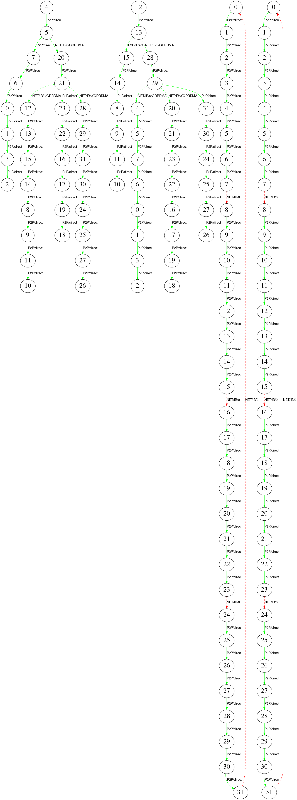

# Topology Visualizer
Topology Visualizer extracts topology information from RCCL log file and presents graphically. Less than optimal connections between GPUs and nodes are highlighted in red for easy identification.

## Requirements
Following packages are required to run Topology Visualizer:
1. gawk
2. graphviz
3. bc (for parallel script timing)
4. ImageMagick (optional, for merging PNG/PDF in parallel mode)

## Usage
Topology Visualizer accepts both RCCL log files or simulator output, i.e. [Topology Explorer](https://github.com/ROCm/rccl/tree/master/tools/topo_expl "Topology Explorer").

RCCL logs needs to be collected with NCCL_DEBUG=INFO and NCCL_DEBUG_SUBSYS=INIT,GRAPH environmental variables. Example command line:
```shell
mpirun -np 4 -host rocm-framework-1,rocm-framework-3,rocm-framework-5,rocm-framework-6 \
  -env HSA_FORCE_FINE_GRAIN_PCIE 1 -env NCCL_DEBUG INFO -env NCCL_DEBUG_SUBSYS INIT,GRAPH \
  ~/rccl-tests/build/all_reduce_perf -b 8 -e 128M -f 2 -g 8 | tee ~/4_nodes.log

./topo_visual.sh -i 4_nodes.log
```

## Scripts

### topo_visual.sh (Standard)
Single-threaded visualization, good for small to medium topologies.

```
Usage: topo_visual.sh -i input_filename [-f format] [-d dpi] [-l]

Options:
  -i input_filename   Input log file (required)
  -f format           Output format: svg (default), png, pdf
  -d dpi              DPI for PNG output (default: 300)
  -l                  Large graph mode: optimizes layout for 64+ GPUs
```

### topo_visual_parallel.sh (Parallel - Recommended for Large Topologies)
Parallel visualization that renders each channel concurrently. **Significantly faster for large topologies (64+ GPUs).**

```
Usage: topo_visual_parallel.sh -i input_filename [-f format] [-d dpi] [-j jobs] [-m] [-k]

Options:
  -i input_filename   Input log file (required)
  -f format           Output format: svg (default), png, pdf
  -d dpi              DPI for PNG output (default: 300)
  -j jobs             Number of parallel jobs (default: auto = CPU count)
  -m                  Merge all channels into single output file
  -k                  Keep temporary files (for debugging)
```

## Examples

```shell
# Standard visualization (small topologies)
./topo_visual.sh -i 4_nodes.log

# Parallel visualization for 256 GPU topology with 32 parallel jobs
./topo_visual_parallel.sh -i large_topo.log -j 32

# Parallel with merged output
./topo_visual_parallel.sh -i large_topo.log -j 16 -m

# High-DPI PNG with parallel rendering
./topo_visual_parallel.sh -i large_topo.log -f png -d 600 -j 16
```

## Performance Comparison

For a 256 GPU topology with 32 channels:

| Method | Time |
|--------|------|
| topo_visual.sh | ~5-10 minutes |
| topo_visual_parallel.sh -j 16 | ~30-60 seconds |
| topo_visual_parallel.sh -j 32 | ~15-30 seconds |

## Output Formats

| Format | Type | Best For | Zoom Quality |
|--------|------|----------|--------------|
| **SVG** (default) | Vector | Large topologies, web viewing | Perfect at any zoom |
| **PNG** | Raster | Documentation, sharing | Depends on DPI |
| **PDF** | Vector | Printing, documentation | Perfect at any zoom |

## Parallel Script Files

- `extract_topo_split.awk` - Splits topology into separate DOT files per channel
- `topo_visual_parallel.sh` - Main parallel wrapper script
- `merge_svg.sh` - Merges multiple SVG files into one (used with -m flag)

## Legend

Solid lines: connections over P2P or shared memory

Dashed lines: connections over network

Green: P2P connections, network connections with GPU RDMA

Red: Connections over shared memory or without GPU RDMA

## Example Output


## Copyright
All source code and accompanying documentation are copyright (c) 2019-2026 Advanced Micro Devices, Inc. All rights reserved.
