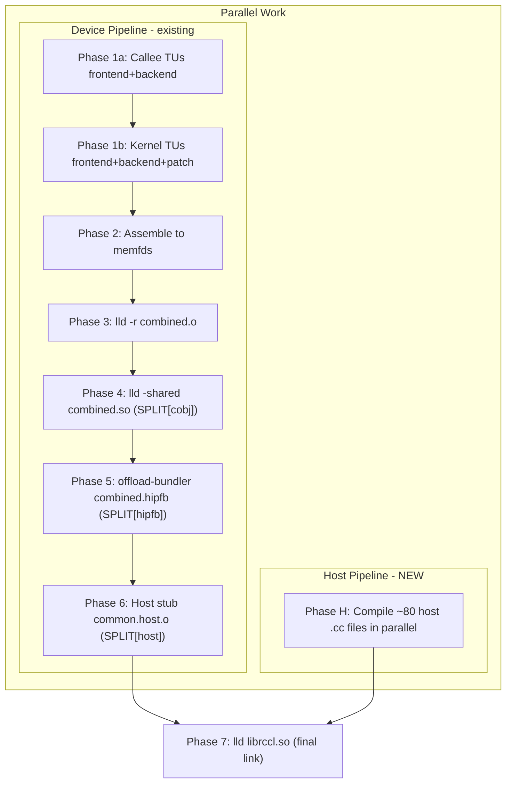
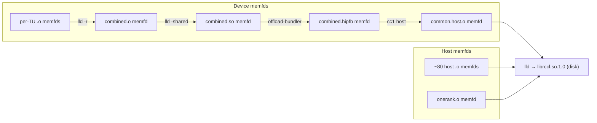

# Extend RCCL Build Server: Host Compilation + Final Link

## Current State

The build server (`[src/main.cpp](projects/rccl/tools/build-server/src/main.cpp)`) handles only the **device pipeline**:

- Phase 1a/1b: Clang frontend + AMDGPU backend for callee/kernel TUs
- Phase 2: In-memory assembly to memfd objects
- Phase 3: `lld -r` to produce `combined.<arch>.o`

After that, `[host-link.py](projects/rccl/tools/build-server/host-link.py)` runs SPLIT[cobj], SPLIT[hipfb], SPLIT[host] by scraping commands from `build.ninja`. Host .cc compilation and the final `librccl.so` link are left to ninja entirely.

## Target Architecture




Host compilation and device compilation are independent and can run concurrently, joining only at the final link.

## HIP Host Compilation: Traced Pipeline

The Clang driver with `-xhip --offload-arch=gfx950` runs **4 sub-commands** per host `.cc` file -- even for files with zero device code:

1. **Device cc1** (`-triple amdgcn -fcuda-is-device -emit-llvm-bc`) -- produces trivially empty device bitcode
2. **llvm-offload-binary** -- packages the bitcode into an offload image
3. **clang-linker-wrapper** (`--emit-fatbin-only`) -- produces a per-TU `.hipfb`
4. **Host cc1** (`-triple x86_64 -emit-obj -fcuda-include-gpubinary .hipfb`) -- compiles host code with embedded fat binary

With `--offload-host-only`, this collapses to a **single cc1** invocation:

- `cc1 -triple x86_64-unknown-linux-gnu -emit-obj ... -x hip allocator.cc`
- No device cc1, no offload-binary, no linker-wrapper, no `-fcuda-include-gpubinary`
- HIP language mode still active (headers, macros, `__HIP_PLATFORM_AMD__` etc.)

**Decision**: Use `--offload-host-only` for the ~80 host `.cc` files. The omitted `.hip_fatbin` section is trivially empty for these files. `onerank.cu.cpp` (which has actual device kernels) runs as a **subprocess** with the full `-xhip` pipeline.

## Changes

### 1. `extract-ninja-flags.py` -- extract host compile + link info

Parse `build.ninja` for two new categories:

- **Host compile commands**: Match `CXX_COMPILER__rccl_Release` build rules. Extract:
  - Host compiler path and flags (FLAGS, DEFINES, INCLUDES from the rule)
  - List of all host source files
  - Separate `onerank.cu.cpp` into its own list (needs full HIP pipeline)
- **Link command for `librccl.so.1.0`**: Match `CXX_SHARED_LIBRARY_LINKER__rccl_Release`. Extract:
  - LINK_FLAGS (includes the fat object path)
  - LINK_LIBRARIES (amdhip64, dl, pthread, etc.)
  - The list of host `.o` input paths
- **SPLIT[cobj], SPLIT[hipfb], SPLIT[host] commands**: Extract the full command templates.

Add new config sections to `build_server_flags.conf`:

```
[host_flags]
-O3
-fPIC
--offload-host-only
-xhip
--offload-arch=gfx950
-DNDEBUG
-Drccl_EXPORTS
-I/path/to/include
...

[host_sources]
/path/to/hipify/src/allocator.cc
/path/to/hipify/src/bootstrap.cc
...

[onerank_source]
/path/to/hipify/src/device/onerank.cu.cpp

[onerank_flags]
-xhip
--offload-arch=gfx950
-O3
...

[split_cobj_flags]
-shared
-o
split_device/dev_obj/combined.gfx950.so
split_device/dev_obj/combined.gfx950.o

[split_hipfb_command]
clang-offload-bundler --type=bc ...

[split_host_flags]
--offload-host-only
-xhip
--offload-arch=gfx950
-Xclang
-fcuda-include-gpubinary
-Xclang
split_device/fat_obj/combined.hipfb
...

[link_flags]
-parallel-jobs=16
...

[link_libraries]
-lamdhip64
-ldl
...
```

### 2. `main.cpp` -- new phases after device pipeline

**Phase 4 - SPLIT[cobj] (in-process LLD):**
Call `lld::lldMain` with `-shared` args to produce `combined.<arch>.so` from `combined.<arch>.o`. The build server already links LLD, so this is just a different `lldMain` invocation. The input `combined.<arch>.o` can stay as a memfd (from Phase 3), and the output `.so` goes to a memfd too (consumed by SPLIT[hipfb] next).

**Phase 5 - SPLIT[hipfb] (subprocess):**
Run `clang-offload-bundler` as a subprocess. Input is the `combined.<arch>.so` memfd via `/proc/self/fd/N`. Output `combined.hipfb` goes to a memfd (consumed by SPLIT[host] next). If the bundler can't read from `/proc/self/fd`, write `.so` to a tmpfile.

**Phase 6 - SPLIT[host] (in-process Clang):**
Compile `common.cu.cpp` with `--offload-host-only -Xclang -fcuda-include-gpubinary -Xclang /proc/self/fd/N` (pointing to the hipfb memfd). Use `captureCC1Args` to get host cc1 args, then `compileCC1` with `EmitLLVMOnlyAction` + x86 backend to produce object bytes into a `SmallVector<char>`, then write to memfd. This produces `common.host.o` in a memfd.

### 3. `main.cpp` -- host code compilation (Phase H, parallel with device)

Runs concurrently with the device pipeline (Phases 1-3). Uses `--offload-host-only` flags.

- Load `[host_flags]` and `[host_sources]` from the config.
- Add `--offload-host-only` to the driver flags before calling `captureCC1Args`. This collapses the 4-step HIP pipeline to a single host cc1 invocation.
- Capture host cc1 args once via `captureCC1Args` (produces x86_64 host cc1 args).
- Compile all ~80 host sources in parallel using:
  1. `compileCC1` with `EmitLLVMOnlyAction` to get LLVM IR Module
  2. Create x86 `TargetMachine` from Module attributes (target-cpu, target-features)
  3. `addPassesToEmitFile(PM, OS, nullptr, CodeGenFileType::ObjectFile)` to emit object bytes into `SmallVector<char>`
  4. Write object bytes to memfd via `memfd_create` + `::write`
- All host `.o` memfds are collected for the final link.

Helper function (mirrors device pipeline pattern):

```cpp
static bool emitObject(llvm::Module &M, llvm::TargetMachine &TM,
                       llvm::SmallVectorImpl<char> &ObjBuf) {
  M.setDataLayout(TM.createDataLayout());
  M.setTargetTriple(TM.getTargetTriple());
  llvm::raw_svector_ostream OS(ObjBuf);
  llvm::legacy::PassManager PM;
  if (TM.addPassesToEmitFile(PM, OS, nullptr,
                             llvm::CodeGenFileType::ObjectFile))
    return false;
  PM.run(M);
  return true;
}

static std::unique_ptr<llvm::TargetMachine>
createX86TargetMachine(const llvm::Module *M = nullptr) {
  llvm::Triple Triple("x86_64-unknown-linux-gnu");
  std::string Error;
  const llvm::Target *T = llvm::TargetRegistry::lookupTarget(Triple, Error);
  if (!T) return nullptr;
  std::string CPU = "x86-64";
  std::string Features;
  if (M) {
    for (const auto &F : *M) {
      if (F.isDeclaration()) continue;
      auto A = F.getFnAttribute("target-cpu");
      if (A.isStringAttribute() && !A.getValueAsString().empty())
        CPU = A.getValueAsString().str();
      auto B = F.getFnAttribute("target-features");
      if (B.isStringAttribute() && !B.getValueAsString().empty())
        Features = B.getValueAsString().str();
      break;
    }
  }
  llvm::TargetOptions Opts;
  return std::unique_ptr<llvm::TargetMachine>(T->createTargetMachine(
      Triple, CPU, Features, Opts, llvm::Reloc::PIC_,
      std::nullopt, llvm::CodeGenOptLevel::Aggressive));
}
```

`**onerank.cu.cpp**`: Compiled as a **subprocess** using the full compiler command from `[onerank_flags]`. Runs in parallel with the other host compilations. Output `.o` is read back into a memfd for the final link.

### 4. `main.cpp` -- final link (Phase 7)

- After both device pipeline and host compilation complete, run `lld::lldMain` to produce `librccl.so.1.0`.
- Inputs via `/proc/self/fd/N`:
  - All ~80 host `.o` memfds
  - `onerank.cu.cpp.o` memfd
  - `common.host.o` memfd (fat object from Phase 6)
- Link flags and libraries from `[link_flags]` and `[link_libraries]` config sections
- Output: `librccl.so.1.0` written to disk (the only file that hits disk)
- Create `librccl.so` and `librccl.so.1` symlinks

### 5. `host-link.py` -- deprecate / simplify

Once the build server handles everything, `host-link.py` becomes unnecessary. Keep it as a fallback mode but mark it as deprecated.

### 6. Thread scheduling

```
main():
  // Parse config, init LLVM targets
  
  // Launch host compilation in background (Phase H + onerank subprocess)
  std::future<...> hostFuture = std::async([&] {
    // Compile ~80 host .cc files with --offload-host-only cc1
    // + spawn onerank.cu.cpp as subprocess
    // Returns vector of memfds
    return runHostCompilation(BC, HostSources, HostCC1);
  });
  
  // Run device pipeline (phases 1a, 1b, 2, 3)
  runDevicePipeline(BC, ...);
  
  // Run post-device steps (phases 4, 5, 6) -- depend on device pipeline
  runSplitCobj(BC, ...);   // lld -shared, memfd→memfd
  runSplitHipfb(BC, ...);  // subprocess, memfd→memfd
  runSplitHost(BC, ...);   // cc1, memfd→memfd
  
  // Wait for host compilation
  auto hostMemfds = hostFuture.get();
  
  // Final link (phase 7) -- all inputs are memfds
  runFinalLink(BC, hostMemfds, deviceFatMemfd, ...);
```

The device pipeline uses `BC.Cfg.NumThreads` threads internally via `parallelFor`. The host compilation would share the thread pool or use a separate pool. Since both are CPU-bound, a simple split (e.g., device gets 75% of threads, host gets 25%) works as a first pass.

## In-Memory Artifact Flow

All intermediate artifacts stay in memfds. Only `librccl.so.1.0` is written to disk.




## Implementation Order

Recommended incremental approach -- each step produces a working build server:

1. Extract host/link info in `extract-ninja-flags.py` (enables the rest)
2. Add SPLIT[cobj] to `main.cpp` (in-process LLD, memfd to memfd)
3. Add SPLIT[hipfb] to `main.cpp` (subprocess, memfd to memfd)
4. Add SPLIT[host] to `main.cpp` (in-process cc1 + x86 backend to memfd)
5. Add host code compilation with `--offload-host-only` (parallel cc1 + x86 backend to memfds)
6. Add onerank.cu.cpp subprocess compilation
7. Add final `librccl.so` link (in-process LLD, all memfd inputs)
8. Wire up parallel device+host scheduling

