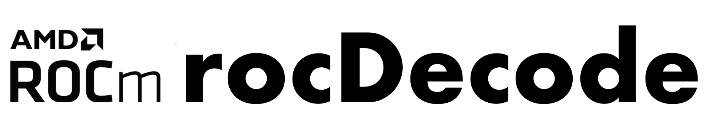

[](https://opensource.org/licenses/MIT)

<p align="center"></p>

rocDecode is a high-performance video decode SDK for AMD GPUs. Using the rocDecode API, you can
access the video decoding features available on your GPU.

> [!NOTE]
> The published documentation is available at [rocDecode](https://rocm.docs.amd.com/projects/rocDecode/en/latest/index.html) in an organized, easy-to-read format, with search and a table of contents. The documentation source files reside in `projects/rocdecode/docs` in this repository. As with all ROCm projects, the documentation is open source. For more information on contributing to the documentation, see [Contribute to ROCm documentation](https://rocm.docs.amd.com/en/latest/contribute/contributing.html).

## Supported codecs
* H.265 (HEVC) - 8 bit, and 10 bit
* H.264 (AVC) - 8 bit
* AV1 - 8 bit, and 10 bit
* VP9 - 8 bit, and 10 bit

## Supported platforms

* **Linux** (Ubuntu 22.04 / 24.04)
* **Windows** (Windows 10/11) — experimental, via the VA-API on D3D12 (vaon12) backend

## Prerequisites

### Hardware
* **GPU**: [AMD Radeon&trade; Graphics](https://rocm.docs.amd.com/projects/install-on-linux/en/latest/reference/system-requirements.html) / [AMD Instinct&trade; Accelerators](https://rocm.docs.amd.com/projects/install-on-linux/en/latest/reference/system-requirements.html)

> [!IMPORTANT]
> `gfx908` or higher GPU required

### ROCm via TheRock

rocDecode is built and installed as part of [TheRock](https://github.com/ROCm/TheRock) on both Linux and Windows. All core dependencies are provided by the TheRock build, including:

* HIP runtime and development libraries
* AMD Clang++ compiler (C++17 required)
* Libva and VA-API drivers
* Libdrm (amdgpu)
* CMake and pkg-config

### Windows additional dependencies

On Windows, rocDecode uses the [vaon12](https://devblogs.microsoft.com/directx/video-acceleration-api-va-api-now-available-on-windows/) backend (Mesa's VA-API on D3D12 translation layer) for hardware-accelerated decoding. In addition to the TheRock-provided dependencies, the following are needed:

* **vaon12** — VA-API on D3D12 libraries (`va.dll`, `va_win32.dll`, `vaon12_drv_video.dll`), available via the [Microsoft.Direct3D.VideoAccelerationCompatibilityPack NuGet package](https://www.nuget.org/packages/Microsoft.Direct3D.VideoAccelerationCompatibilityPack)
* **Visual Studio 2022** with C++ desktop workload (MSVC compiler, C++17)
* **CMake** 3.10 or later
* **Windows SDK** (provides D3D12 and DXGI headers/libraries)

**Optional:**

* **FFmpeg** — pre-built libraries or built from source (required for samples and the host decoder library)

### FFmpeg (required for samples and tests)

[FFmpeg](https://github.com/FFmpeg/FFmpeg) development libraries must be installed separately to build and run samples and extended tests.

**Linux:**

  ```shell
  sudo apt install libavcodec-dev libavformat-dev libavutil-dev
  ```

**Windows:**

  Use pre-built FFmpeg libraries or build from source. Pass `-DFFMPEG_ROOT=<path>` to CMake when configuring.

## Build and install

rocDecode is built as part of [TheRock](https://github.com/ROCm/TheRock) on both Linux and Windows. To build standalone from source:

### Linux

```shell
git clone https://github.com/ROCm/rocm-systems.git
cd rocm-systems/projects/rocdecode
mkdir build && cd build
cmake ../
make -j8
sudo make install
```

### Windows

```bat
git clone https://github.com/ROCm/rocm-systems.git
cd rocm-systems\projects\rocdecode
mkdir build && cd build
cmake .. -DVAON12_ROOT=<path-to-vaon12> -DROCM_PATH=<path-to-TheRock-build>
cmake --build . --config Release
cmake --install . --config Release
```

> [!NOTE]
> * Set `VAON12_ROOT` to the vaon12 NuGet package or custom build directory.
> * Set `ROCM_PATH` to the TheRock build output directory.
> * To include FFmpeg support, add `-DFFMPEG_ROOT=<path-to-ffmpeg>`.

### Run tests

  **Linux:**

  ```shell
  make test
  ```

  **Windows:**

  Before running tests or samples, add the rocDecode and FFmpeg DLL directories to your PATH so that
  executables can locate the required DLLs at runtime:

  ```bat
  set PATH=%ROCM_PATH%\bin;%FFMPEG_ROOT%\bin;%PATH%
  ctest -C Release
  ```

  > [!IMPORTANT]
  > Tests require FFmpeg dev libraries to be installed

  > [!NOTE]
  > To run tests with verbose output, use `ctest -VV` (or `make test ARGS="-VV"` on Linux).

## Verify installation

After installation, the following files are available:

* Libraries in `/opt/rocm/lib`
* Header files in `/opt/rocm/include/rocdecode`
* Samples in `/opt/rocm/share/rocdecode`
* Documents in `/opt/rocm/share/doc/rocdecode`

### Using sample application

To verify your installation using a sample application, run:

  ```shell
  mkdir rocdecode-sample && cd rocdecode-sample
  cmake /opt/rocm/share/rocdecode/samples/videoDecode/
  make -j8
  ./videodecode -i /opt/rocm/share/rocdecode/video/AMD_driving_virtual_20-H265.mp4
  ```

### Using CTest

To verify your installation using CTest, run:

  ```shell
  mkdir rocdecode-test && cd rocdecode-test
  cmake /opt/rocm/share/rocdecode/test/
  ctest -VV
  ```

## Samples

You can access samples to decode your videos in the
[samples](https://github.com/ROCm/rocm-systems/tree/develop/projects/rocdecode/samples) directory. Refer to the
individual folders to build and run the samples.

[FFmpeg](https://ffmpeg.org/about.html) is required for sample applications and `make test`:

  ```shell
  sudo apt install libavcodec-dev libavformat-dev libavutil-dev
  ```

## Tested configurations

* Linux
  * Ubuntu - `22.04` / `24.04`
* Windows (experimental)
  * Windows 10 / 11
* [TheRock](https://github.com/ROCm/TheRock) - `7.12` or later
* FFmpeg - `4.4.2` / `6.1.1`
