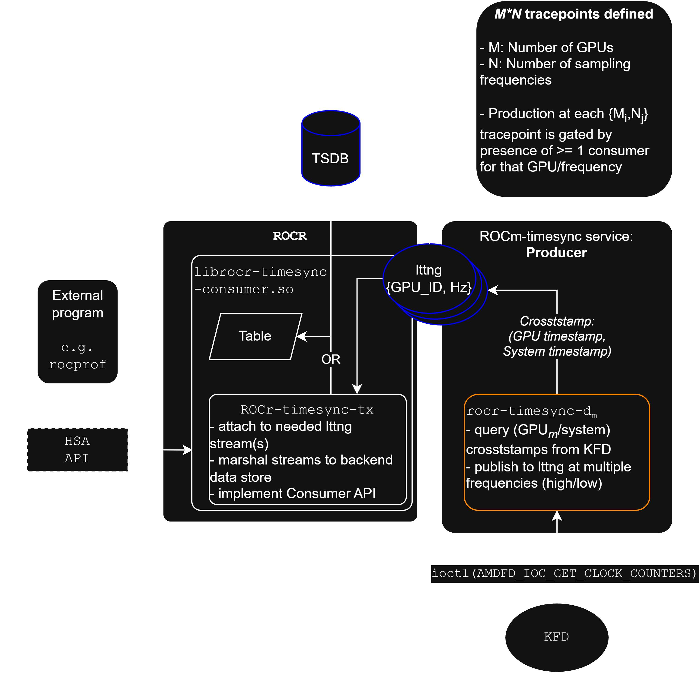
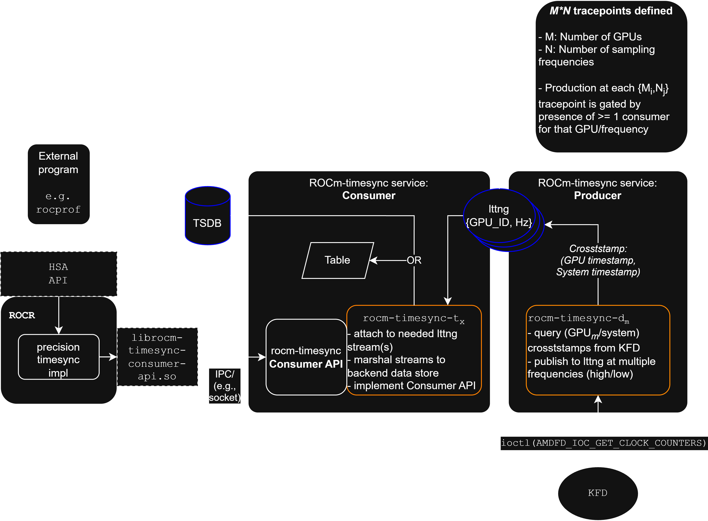

# ROCR Timesync

ROCR Timesync is an open source library that support precision time
synchronization on AMD platforms. It works in conjunction with
[rocr-runtime](../rocr-runtime) to support translation of time from HSA agents
to a common global system timeline.

A goal is to support alignment of timestamps across HSA agents with precision
targets of 1 µs or less, in systems where appropriate HW mechanisms exist to
allow this (e.g., PTP/PTM)

### Background

TODO

## Overview

## Architecture

### In-process

### Out-of-process

In contrast to an in-process design, an out-of-process design removes the need
for every timesync client to store timestamp data. The benefit is that, because
timesync data is not process specific, there is no need for each process to
maintain its own copy.

#### Consumer API

The out-of-process architecture requires a ROCR instance to communicate with
the ROCm-timesync consumer service. We envision an API with at least the following API functions

1. `query_timesync_freq(uint32_t *hz int *num_hz)
- return to the caller a set of streaming frequencies, in Hzm supported by ROCR-timesync on this system

2. `enable_timesync_freq(uint32_t freq)
- enable timestamp generation at `freq` Hz

Notes:
- If not already running, deploys new thread which attaches to the *lttng* data stream and marshals data into the persistent datastore (e.g., *InfluxDB*)
- If already running, update a counter indicating the presence of an additional active consumer

3. `disable_timesync_freq(uint32_t freq)
- disable timestamp generation at `freq` Hz

Notes:
- Decrement count of active consumers
- If count reaches 0, datastore can be destroyed

- If more than one active consumer is present, simpl

2. attach_stream(precision)
- precision=[high,low]

- Exports raw lttng stream for external consumption (e.g., debugging or piping to a customer datastore)

3. translate_time_to_system(agent, timestamp)
- agent: HSA agent_id
- timestamp: timestamp from 'agent' domain

Translates 'timestamp' from 'agent' domain to system (PTP) domain by querying the internal backend data store

