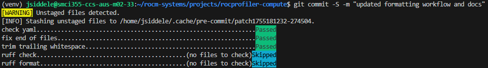

# Contributing to ROCm Compute Profiler

## Cloning and setup instructions
ROCm Compute Profiler lives under `projects/rocprofiler-compute` in the [ROCm Systems super-repo](https://github.com/ROCm/rocm-systems).
The latest sources are in the `develop` branch. You can find particular releases in the `release/rocm-rel-X.Y` branch for the particular release you're looking for.

Sparse checkout is recommended for most contributors.

```bash
git clone --no-checkout --filter=blob:none https://github.com/ROCm/rocm-systems.git
cd rocm-systems
git sparse-checkout init --cone
git sparse-checkout set projects/rocprofiler-compute
git checkout develop

cd projects/rocprofiler-compute

# Initialize submodule dependencies (vendored Python deps and src/lib/external C++ libs)
git submodule update --init --recursive -- src/

python3 -m pip install -r requirements.txt
```

**Note**: When working from source, submodules live under `src/` (vendored Python dependencies like PyYAML in `src/vendored/`, and C++ libraries like googletest, fmt, and json in `src/lib/external/`). If you see import errors about missing vendored modules or missing C++ externals during a build, run `git submodule update --init --recursive -- src/`.


## Development instructions
### Install development tools (linter, pre-commit hooks, YAML utilities)
```bash
python3 -m pip install -r requirements-development.txt
```

### Install pre-commit hooks
This automatically checks your code for formatting issues before each commit, helping you catch problems before they reach CI.
```bash
cd rocprofiler-compute
pre-commit install
```

Once installed, every commit will run the configured checks automatically:

See the [pre-commit documentation](https://pre-commit.com/#quick-start) for more details.

This will automatically use [Ruff](https://docs.astral.sh/ruff/) for linting and formatting. All contributions to `src/` must pass Ruff checks before merging.
If you want to run Ruff manually:
```bash
# Check for issues
ruff check .
ruff format --check .

# Auto-fix most issues
ruff check --fix .
ruff format .
```

## Check coding style and development guidelines:
- [Python Coding Style Guidelines](docs-internal/dev-guidelines/coding-style-python.md).
- [YAML Metric Equation Guidelines](docs-internal/dev-guidelines/yaml-metric-equation-guidelines.md)
- [Command Line Interface Guidelines](docs-internal/dev-guidelines/cli-guidleines.md)


## Submitting a Pull Request
Labels and reviewer assignments are handled automatically based on the files you've changed. Reviewers for `projects/rocprofiler-compute` are defined in the top-level [CODEOWNERS](https://github.com/ROCm/rocm-systems/blob/develop/CODEOWNERS) file.

All pull requests must pass CI checks before merging. For `rocprofiler-compute`, these currently include compilation checks, with correctness and performance tests being added over time. See the [CI documentation](https://github.com/ROCm/rocm-systems/blob/develop/docs/continuous-integration.md) for a full breakdown of what runs on each PR.

### Updating metric YAML files
If your PR modifies **metric configurations** — panel YAMLs under `src/rocprof_compute_soc/analysis_configs/gfx<arch>/*.yaml` or metric descriptions in `docs/data/metrics_description.yaml` — follow the metric management workflow:

1. Edit the relevant panel YAMLs.
2. Validate them with `python tools/config_management/master_config_workflow_script.py --validate-only`.
3. Refresh the hash DB with `python tools/config_management/hash_manager.py --compute-all src/rocprof_compute_soc/analysis_configs` and confirm CI tests pass.

For full details, see the [metric config management README](./tools/config_management/README.md).

### Updating analysis database
The two diagrams in the [analysis data dump docs](docs/how-to/analyze/cli.rst) are
generated from [`src/utils/analysis_orm.py`](src/utils/analysis_orm.py), not drawn
by hand. If your PR changes a table, column, foreign key, or a view definition in
`Database._compile_view_sql`, regenerate them and commit the PNGs:

```bash
./tools/schema_visualizer.py
```

This requires the Graphviz `dot` binary (`apt install graphviz`). The tool reads
the ORM metadata for the schema diagram, and materializes the views in a
throwaway database to read back their real columns for the views diagram, so
neither diagram can drift from the code. Do not edit the PNGs by hand.

### Updating documentation
For instructions on building and testing changes to files under the `docs/` folder, see the [ROCm documentation contributing guide](https://rocm.docs.amd.com/en/latest/contribute/contributing.html).


## Reporting Issues and Bugs
- Search [existing issues](https://github.com/ROCm/rocm-systems/issues) before filing a new one — your bug may already be tracked.
- If you don't find an existing issue, [open a new one](https://github.com/ROCm/rocm-systems/issues/new) with a clear description of the problem and steps to reproduce it.

## Vendoring External Dependencies

rocprofiler-compute vendors certain Python dependencies (via git submodules) to eliminate external dependencies in profile mode. This improves portability and reliability on HPC systems.

**We vendor:**
- Pure Python packages used in profile code path
- Stable packages with permissive licenses

For detailed vendoring workflow (adding/updating packages), see [`src/vendored/README.md`](./src/vendored/README.md).

## AI Agent Guidelines

This project uses AI coding assistants (Claude Code, Cursor, GitHub Copilot). All AI-specific guidelines live in [`AGENTS.md`](AGENTS.md), which serves as the single source of truth. Tool-specific adapter files (e.g., `CLAUDE.md`, `.github/copilot-instructions.md`) reference `AGENTS.md` without duplicating content.

To add or update AI guidelines, edit the appropriate file under `.ai/` and add a reference in `AGENTS.md`.
## Profile Mode Dependency Policy

Profile mode code should not use non-standard Python libraries.

### Why This Matters

Profile mode uses only stdlib to:
1. **Avoid dependency conflicts** - Users can profile without creating virtual environments or worrying about package version conflicts with their own projects
2. **Work everywhere** - No `pip install` needed:
   - HPC systems with locked-down Python environments
   - Security-sensitive systems requiring minimal dependencies
   - Any system with Python 3.8+ installed

### Enforcement

**Python Version Requirement:**
- Import enforcement requires Python 3.10+ (uses `sys.stdlib_module_names`)
- Python 3.8-3.9: Tests run but import enforcement is disabled (warning issued)
- CI uses Python 3.10+ to ensure full enforcement coverage

Enforcement is automatically done for tests which execute profile pipeline using main
function instead of subprocess (unlike tests using --call-binary and multi mpi rank tests).
These tests are automatically protected by guards in `tests/conftest.py` when testing with Python 3.10 and above.
The guard intercepts ALL imports (direct, nested, dynamic) and fails tests immediately if
non-stdlib packages are imported.

### What's Allowed

**Python standard library** (Python 3.8+):
- `json`, `csv`, `sqlite3`, `subprocess`, `pathlib`, `logging`, `sys`, `os`, etc.

**Project modules**:
- `rocprof_compute`, `utils`, `vendored.*`, `roofline`, `config`, `argparser`

**ROCm system libraries** (bundled with ROCm, not pip packages):
- `amdsmi` - AMD System Management Interface
- `hip` - HIP runtime Python bindings
- `rocprofv3` - rocprofv3 Python bindings

### What's NOT Allowed

These are forbidden in profile mode

**External packages**:
- `pandas`, `yaml`, `numpy`, `plotly`, `dash`, `textual`, etc.
- Anything from `requirements.txt`

### Common Mistakes

**Don't do this in profile code:**
```python
import pandas  # External package
import yaml    # Use json or vendored.pyyaml instead
import numpy   # Use stdlib math/statistics
```

**Do this instead:**
```python
import json              # Stdlib for config/data
import csv               # Stdlib for CSV operations
import sqlite3           # Stdlib for data manipulation
from vendored.pyyaml import yaml  # Vendored package (if needed)
```

### If Your Test Fails

**Error message:**
```
PROFILE MODE DEPENDENCY VIOLATION
Forbidden package: pandas
```

**How to fix:**

1. **Move import to analyze mode**
   - Move the import and relevant code to analysis mode

2. **Use stdlib alternative**
   - `pandas` → `csv` module + `sqlite3` for dataframes
   - `yaml` → `json` module (or `vendored.pyyaml` if YAML required)
   - `numpy` → `math`/`statistics` modules
