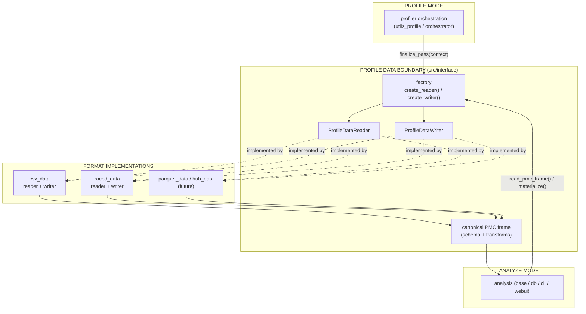

# Profile Data Boundary — Architecture Proposal

**Status:** Draft for review
**Author:** James Siddeley
**Scope:** `projects/rocprofiler-compute` — profile-write and analyze-read data access
**Related branch:** `users/jamessiddeley-amd/refactor-profiler-hub`
**Related PRs:** rocpd-default (`#6485`), profile-data boundary refactor

---

## 1. Why this document exists

Today the knowledge of *how* profiling data is stored — CSV files, ROCPD `.db` databases, intermediate `results_*.csv`, the `pmc_perf.csv` join, on-disk directory layout — is spread thinly across many modules: `utils_profile`, `analysis_base`, `analysis_db`, `file_io`, `utils_analysis`, the CLI, and the WebUI. Each new storage change (making ROCPD the default, retaining `.db` files, removing the profile-time CSV conversion) forces edits in several unrelated places at once. That is the pattern that produced a large, hard-to-review change set "all over the place."

We are about to add *more* storage variation, not less:

- **ROCPD `.db`** becoming the default profiling output.
- **Profiler Hub (SNA)** as a future source of profile data.
- **Parquet** as a candidate experiment for large workloads.

If format/layout knowledge stays diffuse, every one of these becomes another cross-cutting change. The goal of this proposal is to make storage format an **implementation detail behind one boundary**, so that adding parquet or changing ROCPD retention means touching *one* profile-data implementation — not the analysis engine, CLI, WebUI, or profiler orchestration.

This matters more, not less, in an AI-assisted codebase: agents and humans alike reason far better when a concern lives behind a single, well-named seam than when it is scattered across a dozen call sites. Good design is the constraint that keeps "it works" from quietly decaying into "nobody can safely change it."

---

## 2. Design principles

1. **One boundary for storage.** Only the profile-data layer (`src/interface/`) knows the format and the on-disk layout. Everything else speaks a canonical in-memory data model.
2. **Symmetric read/write contracts.** Profile mode *writes* profile data through a writer interface; analyze mode *reads* profile data through a reader interface.
3. **Canonical data model in the middle.** The rest of the code only ever sees a canonical PMC dataframe (with `pmc_perf.csv` retained as a compatibility materialization), never format-specific rows or filenames.
4. **Selection by factory, never by branching at call sites.** Callers ask a factory for "the reader/writer for this workload" and never write `if csv ... elif rocpd`.
5. **New format = new implementation, nothing else.** Adding parquet/SNA should add one module and register it once.

---

## 3. Target architecture



Key idea: the analysis engine, CLI, WebUI, and profiler orchestration depend on the **boundary**, never on a concrete format. The arrow from implementations to callers is always mediated by the canonical PMC frame.

### 3.1 Module layout

```
src/interface/
  profile_data.py        # contracts: Reader/Writer interfaces, context/options types
  factory.py             # format selection (config -> reader, flag -> writer)
  pmc_frame.py           # canonical PMC dataframe schema + transforms
  csv_data.py            # CSV reader + writer (profile + analysis halves)
  rocpd_data.py          # ROCPD reader + writer (profile + analysis halves)
  parquet_data.py        # (future) parquet reader + writer
```

### 3.2 The two contracts

A **reader** answers analyze-time questions without exposing where data lives:

- `has_profile_data(workload_dir) -> bool`
- `read_pmc_frame(workload_dir) -> DataFrame`  *(the canonical model)*
- `materialize_pmc_perf(workload_dir, output_path) -> Path`  *(compatibility output)*

A **writer** finalizes one profiling pass without exposing format details to the orchestrator:

- `finalize_pass(context) -> None`

Callers obtain these from the factory — `create_profile_data_reader(config, options)` and `create_profile_data_writer(format)` — and never instantiate a concrete class directly.

### 3.3 The canonical data model

The cross-boundary type is a **wide PMC dataframe**: one row per dispatch, counter names as columns, plus a stable set of identity/metadata columns. Format-specific shapes (e.g. ROCPD long-form `Counter_Name`/`Counter_Value` rows) are normalized to this canonical shape *inside* the boundary, in `pmc_frame.py`. `pmc_perf.csv` remains a materialized compatibility output, but it is produced *by* the boundary, not assembled by callers.

---

## 4. Where we are today (honest baseline)

The refactor branch has already built the right *skeleton*. Crediting what works is important, because the plan below is "finish and enforce," not "start over."

**Already in place and correct:**

- A real `src/interface/` layer with `ProfileDataReader` / `ProfileDataWriter` contracts, CSV and ROCPD implementations, a factory, and centralized canonical-frame transforms in `pmc_frame.py`.
- The two highest-traffic call sites are wired through the boundary: analyze read goes through `file_io.create_df_pmc -> reader.read_pmc_frame()`, and profile finalize goes through `utils_profile -> create_profile_data_writer().finalize_pass()`.
- The format-specific internals are split into profile vs analysis halves (`*ProfileData` / `*AnalysisData`) as suggested.
- Dedicated boundary tests exist (`tests/test_profile_data.py`) plus updated integration tests.

**Gaps to close before this is the architecture, not just scaffolding for it:**

1. **The boundary is not yet enforced everywhere.** Several consumers still encode format/layout knowledge directly — most importantly `analysis_db` reads `pmc_perf.csv` itself and bypasses the reader; `utils_analysis.is_workload_empty` globs `results_*.csv`/`pmc_perf.csv`; torch-trace merge infers `rocpd` vs `csv` from directory layout; `analysis_base` hard-codes profile-data filenames in paths and messages.
2. **Leftover scaffolding.** Besides the real `src/interface/` tree, an unused `src/utils/profile_data/` re-export package and a legacy `src/utils/rocpd_data.py` shim still exist. Only `interface/` is wired into production; the rest should be removed once import paths are migrated.
3. **`src/orchestrator/` exists but is not used in production.** It matches the suggested layout but `utils_profile`/`analysis_base` call the factory directly, so the orchestrator classes are currently exercised only by tests.
4. **ROCPD "analysis read" still goes through CSV intermediates.** The ROCPD reader concatenates writer-produced `results_*.csv` rather than reading retained `.db` directly — so the `.db`-default promise isn't fully realized at analyze time yet.
5. **Contract sharp edges.** Interfaces are `Protocol`s (no runtime enforcement); the shared pass-context carries a ROCPD-only field; a protocol docstring names `pmc_perf.csv`. Minor, but they leak format/intent into the shared contract.

None of these are reasons to redesign — they are the difference between "the seam exists" and "the seam is the only way through."

---

## 5. Proposed end state (acceptance criteria)

The refactor is "done" when all of the following hold:

- [ ] Every PMC load in analyze mode flows through `create_profile_data_reader(...).read_pmc_frame()`. No `pd.read_csv(".../pmc_perf.csv")` or `results_*.csv` globs outside `src/interface/`.
- [ ] No module outside `src/interface/` contains a `csv` vs `rocpd` conditional or references a format string for routing.
- [ ] Workload presence/emptiness is answered by `reader.has_profile_data(...)`, not by probing filenames.
- [ ] Adding a hypothetical `parquet_data.py` requires changes to exactly two files: the new implementation and one factory registration. (We will validate this with a written walkthrough, even before parquet is real.)
- [ ] Exactly one profile-data tree exists (`src/interface/`). Any remaining shim packages are removed.
- [ ] Each concrete reader and writer has direct unit tests over real temp profile data (including a real ROCPD `.db` fixture), not just mocks.

---

## 6. Phased plan

Sequencing matters: we land the boundary first, then move behavior behind it, so the ROCPD-default change becomes a small plug-in rather than another sprawling diff.

**Phase 1 — Establish the boundary (largely complete).**
Keep `src/interface/` as the single source of truth. Freeze new code from importing anything but `interface.*`.

**Phase 2 — Enforce the boundary (highest value).**
Route the remaining consumers through the reader: fix `analysis_db` first (it fully bypasses the reader), then `is_workload_empty`, then torch-trace merge, then `analysis_base` filename/message coupling. After this phase, format/layout greps come back clean outside `interface/`.

**Phase 3 — Consolidate.**
Remove the unused `utils/profile_data/` package and the legacy `utils/rocpd_data.py` shim once import paths are migrated. Decide on `orchestrator/`: either wire it in as the single production entry point for profile/analyze data operations, or remove it until needed. One of the two — not "exists but unused."

**Phase 4 — Make ROCPD a first-class read path.**
Give the ROCPD reader a true `.db` read path so analyze does not depend on writer-produced CSV intermediates. This is what actually retires the expensive profile-time conversion end-to-end.

**Phase 5 — Harden the contract and prove extensibility.**
Promote the interfaces to ABCs (or `runtime_checkable` protocols) with explicit registration in the factory. Move ROCPD-only options out of the shared context into the ROCPD implementation. Write the parquet "two-file change" walkthrough as the regression test for the design itself.

---

## 7. What this buys us

- The ROCPD-default work, and the future Profiler Hub / parquet work, each become a **single profile-data implementation plus one factory registration** — small, isolated, reviewable PRs.
- Analysis, CLI, WebUI, DB analysis, and the parser stop caring where bytes come from; they consume one canonical dataframe.
- The blast radius of a storage change collapses from "many modules" to "one module," which is exactly the property that keeps the codebase changeable — by people and by AI — as the format landscape grows.

---

## Appendix A — Quick reference: current contracts

```41:58:src/interface/profile_data.py
class ProfileDataReader(Protocol):
    """Read profile data without exposing its storage layout."""

    def has_profile_data(self, workload_dir: Path) -> bool:
        """Return True if this reader can find profile data."""

    def materialize_pmc_perf(self, workload_dir: Path, output_path: Path) -> Path:
        """Ensure a pmc_perf.csv file exists and return its path."""

    def read_pmc_frame(self, workload_dir: Path) -> pd.DataFrame:
        """Return the canonical PMC DataFrame for analysis."""


class ProfileDataWriter(Protocol):
    """Finalize profile data after a profiling pass."""

    def finalize_pass(self, context: ProfilePassContext) -> None:
        """Finalize profile data for one profiling pass."""
```

## Appendix B — Boundary-leak inventory (Phase 2 worklist)

| Location | Leak to remove |
| --- | --- |
| `rocprof_compute_analyze/analysis_db.py` (~318-322) | Direct `pd.read_csv(.../pmc_perf.csv)` — bypasses reader |
| `rocprof_compute_analyze/analysis_db.py` (~69-72) | `format_rocprof_output != "rocpd"` gate |
| `utils/utils_analysis.py` (~575-581) | Globs `pmc_perf.csv` / `results_*.csv` for emptiness |
| `utils/utils_analysis.py` (~505-511) | Infers `rocpd` vs `csv` from directory layout |
| `rocprof_compute_analyze/analysis_base.py` (~450-459) | Hard-coded profile-data filenames in paths/messages |
| `utils/utils_profile.py` (~215-219) | Format-string validation before factory call |
| `rocprof_compute_base.py` (~199-212) | ROCPD→CSV runtime fallback |
| `interface/rocpd_data.py` (~338-385) | ROCPD analysis reads `results_*.csv`, not `.db` (Phase 4) |

## Appendix C — Leftover scaffolding (Phase 3 worklist)

| Tree | Status | Action |
| --- | --- | --- |
| `src/interface/` | Real, wired into production | Keep — single source of truth |
| `src/utils/profile_data/` | Unused re-export package | Remove |
| `src/utils/rocpd_data.py` | Re-export shim for legacy imports | Remove after import migration |
| `src/orchestrator/` | Matches suggested layout, not wired in | Wire in as the production entry point, or remove until needed |
