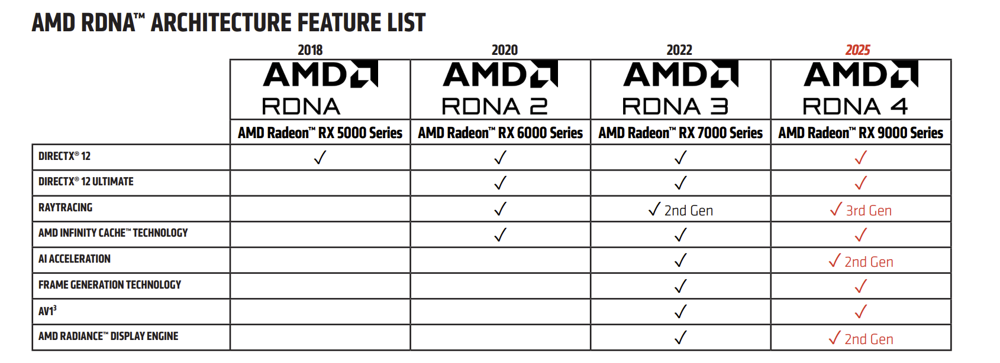

.. meta::
   :description: ROCm Compute Profiler RDNA3 client GPU performance model
   :keywords: ROCm Compute Profiler, RDNA, RDNA3, gfx1151, Radeon, ROCm

.. _rdna-performance-model:

=====
RDNA3
=====

This chapter covers **AMD Radeon™ / RDNA™** configurations exposed in ROCm Compute Profiler.

.. figure:: ../../data/conceptual/RDNA3_Block_Diagram.png
   :alt: AMD RDNA3 generation series block diagram — host CPU, system and device memory, memory controller, L2/L1 caches, global data share, command processors, ultra-threaded dispatch, and processor array of WGPs with CUs, LDS, instruction and constant caches
   :align: center

   **Figure: AMD RDNA3 generation series (block diagram).** Work flows from the host and from
   system/device memory through the memory controller into the **L2** / **L1** stack, **Global Data
   Share**, and **command processors**, then through the **Ultra-Threaded Dispatch Processor** into a
   **processor array** of **Workgroup Processors (WGPs)**. Each WGP groups **Compute Units (CUs)**
   (vector/scalar ALUs and registers) with **Local Data Share**, while dedicated **instruction** and
   **constant** caches feed the front end. The diagram is a high-level guide for how profiler panels
   (e.g. TCP, GL1C, GL2C, GCEA on **gfx1151**) map to these blocks—not a literal floorplan for every SKU.

For Instinct / CDNA naming (**CU**, shader engine, etc.), use the top-level :doc:`../performance-model`
overview and :doc:`../cdna/cdna-performance-model`. **Here** the focus is on **WGPs**, **TCP / GL1C / GL2C**,
**GCEA**, and related panels when an analysis config targets RDNA-class parts.

Public architecture summaries and :doc:`GPU / accelerator specifications <rocm:reference/gpu-arch-specs>`
remain the best reference for packaging, SIMD width, and generational differences between
RDNA3, RDNA3.5, and later client GPUs. The sections below describe what the **profiler measures and names**
in the shipped YAML for **RDNA3.5 (gfx1151)**.

ROCm Profiler includes analysis panels targeting **RDNA3.5** parts reporting as
**gfx1151** — for example integrated graphics on AMD Ryzen AI Max+ (Strix Halo) class
processors.

.. rubric:: Memory hierarchy in the tool

For gfx1151, the on-disk **Memory Chart** panel walks the path described in
``src/rocprof_compute_soc/analysis_configs/gfx1151/0300_Memory_Chart.yaml``:
instruction and scalar paths, **TCP** (vector L0), **LDS**, interfaces to
**GL1C** (L1), **GL2C** (L2), and **GCEA** toward system memory. The CLI
memory diagram (``mem_chart_gfx11``) uses the same metric key conventions.

.. rubric:: Workgroups and execution

RDNA3-class GPUs organize compute around **Workgroup Processors (WGPs)** and
**Compute Units (CUs)**; wavefronts are typically **wave32**-oriented in this
configuration. The **WGP**, **SPI**, and **CPC** panels in ``gfx1151`` expose
dispatch, occupancy, and command-processor side metrics that complement the
:doc:`Instinct / CDNA conceptual pages <../cdna/compute-unit>` (which use
naming such as ``CU`` and ``SE`` in places).

.. rubric:: Where to read metric text

* Conceptual sub-pages below group metric tables by block (**System Speed-of-Light** first, then **WGP**, **TCP (GL0)**,
  **GL1** / **GL1C**, **GL2** / **GL2C** + **GCEA**, **shader engine** / **SPI**, **command processor** / **CPC**). The :doc:`system-speed-of-light` page uses the same metric keys as the analysis panel.
* Panel YAMLs under ``src/rocprof_compute_soc/analysis_configs/gfx1151/`` —
  formulas, peaks, and counter bindings.

In this chapter, profiler concepts for RDNA use **client GPU naming** (WGP, GL1/GL2, …) and embed the
**RDNA3.5 (gfx1151)** metric tables under each block:

* :doc:`system-speed-of-light` — SoL table for **gfx1151**.

* :doc:`wgp` — roofline, WGP utilization, waves, instruction mix, WGP I$/scalar caches.

* :doc:`tcp-cache` — **TCP** (vector **L0** / **GL0**): panel tables and Memory Chart rows through TCP–GL1.

* :doc:`gl1-cache` — **GL1C** (L1): panel tables and Memory Chart **GL1C Cache (L1)**.

* :doc:`gl2-cache` — **GL2C**, **GCEA** / DRAM / arbiter, and related panel metrics.

* :doc:`shader-engine` — GRBM GPU/SE utilization and **SPI** dispatch statistics.

* :doc:`command-processor` — **CPC** / **MEC** metrics (same role as CDNA CP, different tab layout in ``gfx1151``).

* :doc:`references` — public references and link to Instinct citations.

Related
=======

* :doc:`../performance-model` — top-level overview (CDNA and RDNA).

* :doc:`../cdna/cdna-performance-model` — CDNA/2/3/4 block-by-block sections.
