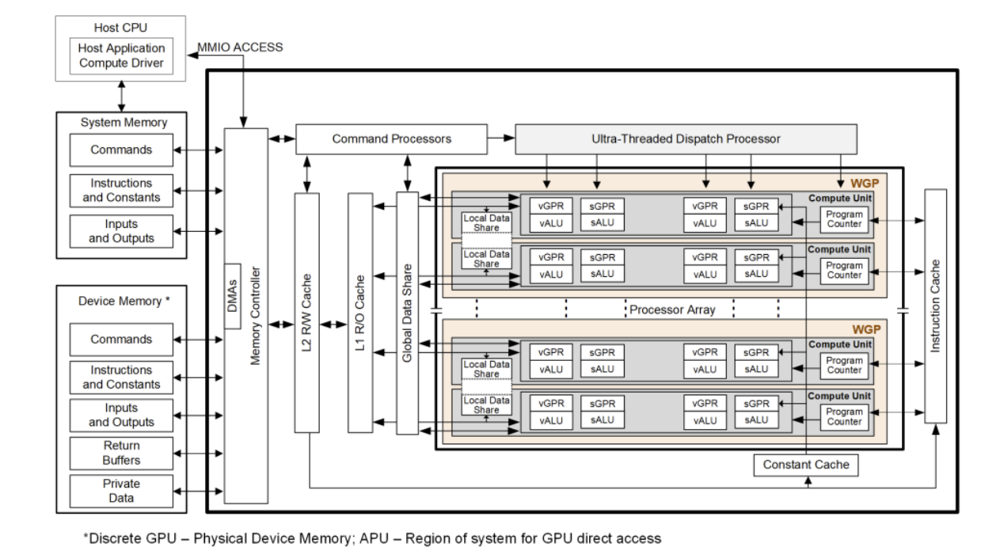

.. meta::
   :description: ROCm Compute Profiler RDNA3 APU performance model
   :keywords: ROCm Compute Profiler, RDNA, RDNA3, gfx1151, Radeon, ROCm

.. _rdna-performance-model:

=====
RDNA3
=====

This chapter covers AMD Radeon / RDNA configurations exposed in ROCm Compute Profiler.

   **Figure: AMD RDNA3 generation series (block diagram).** See page 5 of
   `RDNA3 shader instruction set architecture <https://docs.amd.com/v/u/en-US/rdna3-shader-instruction-set-architecture-feb-2023_0#page=5>`__.

For Instinct / CDNA naming (CU, shader engine, etc.), use the top-level :doc:`../performance-model`
overview and :doc:`../cdna/cdna-performance-model`. Here the focus is on WGPs, TCP / GL1C / GL2C,
GCEA, and related panels when an analysis config targets RDNA hardware.

Public architecture summaries and :doc:`GPU / accelerator specifications <rocm:reference/gpu-arch-specs>`
remain the best reference for packaging, SIMD width, and generational differences between
RDNA3, RDNA3.5, and later APUs. The sections below describe what the profiler measures and names
for RDNA3.5 (gfx1151).

ROCm Profiler includes analysis panels targeting RDNA3.5 parts reporting as
gfx1151 — for example integrated graphics on AMD Ryzen AI Max Series - Strix Halo
processors.

.. rubric:: Memory hierarchy in the tool

For gfx1151, the Memory Chart panel walks the path from instruction and scalar
paths, TCP (GL0), LDS, interfaces to GL1C (L1), GL2C (L2), and GCEA toward
system memory.

.. rubric:: Workgroups and execution

RDNA3-class GPUs organize compute around Workgroup Processors (WGPs) and
Compute Units (CUs); wavefronts are typically wave32-oriented in this
configuration. The WGP, SPI, and CPC panels in gfx1151 expose
dispatch, occupancy, and command-processor side metrics that complement the
:doc:`Instinct / CDNA conceptual pages <../cdna/compute-unit>` (which use
naming such as CU and SE in places).

.. rubric:: Where to read metric text

* Conceptual sub-pages below group metric tables by block (System Speed-of-Light
  first, then WGP, TCP (GL0), GL1 / GL1C, GL2 / GL2C + GCEA, shader engine / SPI,
  command processor / CPC). The :doc:`system-speed-of-light` page uses the same
  metric keys as the analysis panel.

In this chapter, profiler concepts for RDNA use APU naming (WGP, GL1/GL2, ...)
and embed the RDNA3.5 (gfx1151) metric tables under each block:

* :doc:`system-speed-of-light` — SoL table for gfx1151.

* :doc:`wgp` — roofline, WGP utilization, waves, instruction mix, WGP instruction and data caches.

* :doc:`tcp-cache` — TCP (GL0): panel tables and Memory Chart rows through TCP-GL1.

* :doc:`gl1-cache` — GL1C (L1): panel tables and Memory Chart GL1C Cache (L1).

* :doc:`gl2-cache` — GL2C, GCEA / DRAM / arbiter, and related panel metrics.

* :doc:`shader-engine` — GRBM GPU/SE utilization and SPI dispatch statistics.

* :doc:`command-processor` — CPC / ME(Micro Engine) metrics (same role as CDNA CP, different tab layout in gfx1151).

* :doc:`references` — public references and link to Instinct citations.

Related
=======

* :doc:`../performance-model` — top-level overview (CDNA and RDNA).

* :doc:`../cdna/cdna-performance-model` — CDNA 2/3/4 block-by-block sections.
