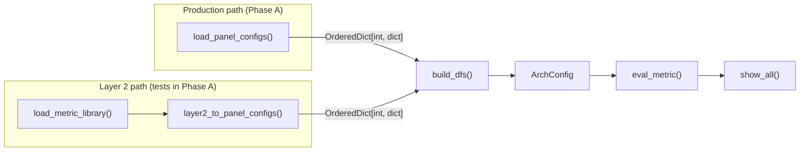

# Phase 1 -- Metric Library (Stages 1-4)

Parent: [LLD index](lld-index.md)


## Stage 1 -- Layer 2 schema + inheritance loader

> Layer 1.5 collectables moved out of Phase A into a separate epic. The collectables
> section below is kept as input to that epic.

### Layer 2 metric schema

New module `src/utils/layer2_schema.py`. Defines the structure of a Layer 2 metric
definition file via dataclasses.

`MetricDefinition` fields:

| Field | Type | Required | Notes |
|---|---|---|---|
| `id` | str | yes | Stable hierarchical string, e.g. `mem.l2_hit_rate` |
| `name` | str | yes | Canonical display name, e.g. `"L2 Cache Hit Rate"` |
| `formula` | str | yes | Base expression without aggregation wrappers |
| `unit` | str | yes | e.g. `"Percent"`, `"GFLOPs"` |
| `description` | str | yes | Human-readable metric description |
| `peak` | str (formula) | no | Performance ceiling expression. Required for speed-of-light metrics. |
| `coll_level` | str | no | Accumulation level, e.g. `SQ_LEVEL_WAVES` |
| `avg_mode` | str | no | Default `weighted` (`SUM(X)/SUM(Y)`). Set to `simple` for metrics that use `AVG()` instead. |

**Aggregation is not a metric field.** The metric defines a single base formula
without aggregation wrappers (`SUM`, `AVG`, `MIN`, `MAX`). Aggregation is a display
concern owned by Layer 3 -- the view's `header` dict declares which columns to show
(e.g., `avg`, `min`, `max`, or `value`), and the code auto-generates the wrapped
formulas at evaluation time.

This eliminates the current duplication where ~98% of metrics repeat the same base
formula three times with different wrappers. The `simple_box` tables already prove
this pattern works -- they auto-generate `MIN/Q1/MEDIAN/Q3/MAX` from a single `expr`.

Percent-of-peak is not a schema field. In the target state it is computed automatically
when a metric has a `peak` formula and `unit: Percent`. During the transition, the legacy
mapping keeps today's explicit `pct_of_peak` per table row, so output does not change.

A metric's numeric positional ID (`legacy_id`) is not a metric field either. The same
metric appears in several tables, at a different position in each, so the positional IDs
belong to the transition-only legacy mapping (see
[Transition mechanism](lld-index.md#transition-mechanism-legacy_id)). One metric can
appear in several tables of the mapping.

A metric concept has one `id` on every architecture. Each family base (gfx908 for CDNA,
gfx115x for RDNA, and gfx1250) defines the id with that family's formula, as the HLD's
end-to-end example does for `mem.l2_hit_rate`. Within one architecture, every appearance
of an id uses the same formula.

```yaml
SALU Utilization:
  id: compute.salu_util
  name: "SALU Utilization"
  formula: "100 * SQ_ACTIVE_INST_SCA / ($GRBM_GUI_ACTIVE_PER_XCD * $cu_per_gpu)"
  unit: Percent
  description: >-
    The percentage of time the SALU was busy executing instructions.

VALU FLOPs:
  id: compute.valu_flops
  name: "VALU FLOPs"
  formula: "64 * (SQ_INSTS_VALU_ADD_F16 + SQ_INSTS_VALU_MUL_F16 + ...) / (End_Timestamp - Start_Timestamp)"
  unit: GFLOPs
  peak: "$max_sclk * $cu_per_gpu * 64 * 2 / 1000"
  description: >-
    The total number of vector ALU floating-point operations per second.
```

**Typed variants** for fabric stall tables (`xfer`, `coherency`, `expr`, `type`,
`transaction` fields) are handled as a `FabricStallMetric` sub-schema. These table types
have fixed column structures that differ from general metric tables. The general
`MetricDefinition` does not accommodate them -- they use a separate validation path.

`VariableDefinition` fields:

| Field | Type | Required | Notes |
|---|---|---|---|
| `name` | str | yes | Variable name without `$`, e.g. `GRBM_GUI_ACTIVE_PER_XCD` |
| `formula` | str | yes | Expression, e.g. `"(GRBM_GUI_ACTIVE / $num_xcd)"` |
| `depends_on` | list[str] | no | Other variables this depends on, for eval ordering |

```yaml
# gfx908/variables.yaml
variables:
  GRBM_GUI_ACTIVE_PER_XCD:
    formula: "(GRBM_GUI_ACTIVE / $num_xcd)"
  GRBM_COUNT_PER_XCD:
    formula: "(GRBM_COUNT / $num_xcd)"
  GRBM_SPI_BUSY_PER_XCD:
    formula: "(GRBM_SPI_BUSY / $num_xcd)"
  numActiveCUs:
    formula: >-
      TO_INT(MIN(ROUND(SUM(4 * SQ_BUSY_CU_CYCLES) /
      SUM($GRBM_GUI_ACTIVE_PER_XCD), 0) / $max_waves_per_cu * 8 +
      MIN(MOD(ROUND(SUM(4 * SQ_BUSY_CU_CYCLES) /
      SUM($GRBM_GUI_ACTIVE_PER_XCD), 0),
      $max_waves_per_cu), 8), $cu_per_gpu))
    depends_on: [GRBM_GUI_ACTIVE_PER_XCD]
  kernelBusyCycles:
    formula: "ROUND(AVG((((End_Timestamp - Start_Timestamp) / 1000) * $max_sclk)), 0)"
  hbmBandwidth:
    formula: "($max_mclk / 1000 * 32 * $num_memory_channels)"
```

### Layer 1.5 -- Collectables

A collectable is a formula fragment whose counters fit in a single hardware pass. It
sits between raw PMC counters (Layer 1) and full metric formulas (Layer 2) in the
layer hierarchy.

#### The hardware constraint

Each IP block has a per-pass counter limit enforced by the hardware. On gfx942:

| IP Block | Max counters per pass |
|---|---|
| SQ | 8 (includes SQC and SP via BLOCK_REMAP) |
| TCC | 4 |
| TCP | 4 |
| TA | 2 |
| TD | 2 |
| GRBM | 2 |

Metric formulas routinely exceed these limits:

- **VALU FLOPs** (single metric): references 12 SQ counters (`SQ_INSTS_VALU_ADD_F16`,
  `SQ_INSTS_VALU_MUL_F16`, ..., `SQ_INSTS_VALU_FMA_F64`). SQ limit is 8 -- this one
  metric must span at least 2 hardware passes.
- **System Speed-of-Light panel**: ~39 SQ/SQC counters total -> 5+ SQ-limited passes.
- **L2 Cache panel**: 32 TCC counters / 4 per pass = 8+ TCC-limited passes.
- **vL1D Cache panel**: 34 TCP counters / 4 per pass = 9+ TCP-limited passes.

The current system handles this by binning counters across passes via
`perfmon_coalesce()`, then evaluating the full formula against merged counter data
from all passes. This produces incorrect results for ratio metrics.

#### Why cross-pass evaluation is mathematically wrong

**Concrete example: L2 Cache Hit Rate on gfx942**

Formula: `100 * TCC_HIT_sum / (TCC_HIT_sum + TCC_MISS_sum)`

The invariant: in any single kernel execution, `TCC_HIT + TCC_MISS = total requests`,
so `0% <= HitRate <= 100%`.

Suppose TCC_HIT_sum and TCC_MISS_sum land in different passes (TCC limit = 4 counters,
and other TCC counters consumed the remaining slots). Consider a GEMM kernel touching
a large matrix:

| | TCC_HIT | TCC_MISS | True hit rate |
|---|---|---|---|
| Pass 1 (cache cold at start) | 500,000 | 300,000 | 62.5% |
| Pass 2 (cache warm from pass 1) | 750,000 | 50,000 | 93.75% |

The cross-pass formula uses TCC_HIT from pass 1 and TCC_MISS from pass 2:

```
HitRate_cross = 100 * 500,000 / (500,000 + 50,000) = 90.9%
```

This result (90.9%) is neither the pass-1 truth (62.5%) nor the pass-2 truth (93.75%).
It describes no actual kernel execution.

**Formal statement:** Let H(i) and M(i) be hit and miss counts in pass i. The true
hit rate for pass i is R(i) = H(i) / (H(i) + M(i)). Cross-pass collection computes:

```
R_cross = H(1) / (H(1) + M(2))
```

R_cross = R(1) only when M(2) = M(1), i.e., when the workload is perfectly
deterministic across passes. For any workload with state-dependent behavior (cache
warming, OS scheduling jitter, memory allocation differences), M(2) != M(1) and
the error is:

```
|R_cross - R(1)| = |H(1) * (M(1) - M(2))| / ((H(1) + M(1)) * (H(1) + M(2)))
```

**Pathological case:** For the TCP hit rate formula `100 * (REQ - MISS) / REQ`: if
REQ is measured in pass 1 (low-traffic phase, REQ = 1000) and MISS in pass 2
(high-traffic phase, MISS = 2000), the result is `100 * (1000 - 2000) / 1000 = -100%`
-- a physically impossible value.

#### Existing partial mechanisms

| Mechanism | What it does | Why it is insufficient |
|---|---|---|
| `same_bucket_priority_metric_ids` | Greedy bin-packing that tries to keep priority metrics' counters in one pass | Falls through silently when counters don't fit; only 4 metrics configured (gfx115x only) |
| `_metric_aware_coalesce_pass` | Best-effort: sorts metrics by counter count, tries to pack each metric's counters into one bucket | No guarantee; logs a debug message and defers to first-fit when it fails |
| `coll_level` | Marks accumulator counters that need dedicated pass files | Only for ACCUM counters, not for general ratio metrics |
| `NOISE_CLAMP` | Display-time clamp that suppresses results with high noise indicators | Mitigation, not prevention -- the wrong value is still computed |

#### What a collectable formalizes

A collectable declares a set of counters that form an **atomic collection unit** --
they must be collected in the same hardware pass to produce a mathematically correct
intermediate result.

```yaml
# gfx908/collectables.yaml
collectables:
  l2_hit_miss:
    id: collect.l2_hit_miss
    formula: "TCC_HIT_sum / (TCC_HIT_sum + TCC_MISS_sum)"
    # counters: [TCC_HIT_sum, TCC_MISS_sum]  -- inferred from formula
```

A Layer 2 metric can reference a collectable by id:

```yaml
L2 Cache Hit Rate:
  id: mem.l2_hit_rate
  name: "L2 Cache Hit Rate"
  formula: "100 * $collect.l2_hit_miss"
  unit: Percent
  peak: 100
  description: >-
    The ratio of cache line requests that hit in the last-level on-chip cache.
```

#### Scope in this LLD

This stage defines the collectable **schema and config structure** so that
collectables have a well-defined home in the layer architecture. Layer 2 metrics can
reference collectables by id in their formulas. During counter extraction,
`get_counters_for_metrics()` resolves collectables transitively to their underlying
Layer 1 counters.

The evaluation pipeline (`eval_metric()`, `build_eval_string()`, `MetricEvaluator`)
is not changed in this LLD. Currently, collectables expand inline like built-in
variables -- they are a formula organization mechanism. Per-pass intermediate
evaluation (collecting a collectable's counters together and evaluating its formula
within that pass) is a future enhancement requiring a separate design.

The bin-packing pipeline (`perfmon_coalesce()`) is not changed. Collectable-aware
counter grouping is a natural follow-up once per-pass evaluation is implemented.

`CollectableDefinition` fields:

| Field | Type | Required | Notes |
|---|---|---|---|
| `id` | str | yes | Stable string, e.g. `collect.l2_hit_miss` |
| `formula` | str | yes | References Layer 1 counters only |
| `counters` | list[str] | no | Explicit counter list for pass-limit validation (inferred from formula if absent) |

The `MetricLibrary` (Stage 2) loads collectables from `collectables.yaml` alongside
metrics and variables. `get_counters_for_metrics()` resolves collectable references
in the same way it resolves built-in variables -- transitively extracting the
underlying Layer 1 counters from the collectable's formula.

**Target state for SDK integration:** The HLD notes that collectables should
ultimately be integrated into `sdk_config.yaml` as part of the SDK counter
definitions. This requires collaboration with the SDK team and is not part of this
LLD. Until then, collectables are defined separately by rocprof-compute in the
base arch YAML files.

### Inheritance loader

New module `src/utils/yaml_inherit_loader.py`. Implements a custom PyYAML loader
for the `!inherit <path>` tag. The tag must appear as the first line of a YAML file.

GitLab CI's `extends` keyword uses the same approach -- deep merge across files,
multi-level inheritance, later values override earlier ones.
See [GitLab YAML optimization docs](https://docs.gitlab.com/ci/yaml/yaml_optimization/).
Native YAML anchors (`&`/`*`) and merge keys (`<<`) are insufficient -- they only
perform shallow merge, do not work across files, and the merge key is semi-deprecated
in the YAML spec.

**Implementation:** Vendor the [`deepmerge`](https://pypi.org/project/deepmerge/)
Python library (pure Python, MIT license) or implement the merge logic inline
(~30 lines for our specific merge rules). The merge must work in profile mode,
which prohibits pip dependencies (`ProfileModeImportGuard` enforces stdlib-only
imports). The vendored PyYAML is precedent for this approach. Import yaml from
the vendored copy (`from vendored import yaml`) for profile-mode compatibility.

`InheritLoader` subclasses `yaml.SafeLoader` and registers constructors for two
custom tags:
- `!inherit <path>` -- file-level inheritance (loads and merges the referenced file)
- `!remove` -- marks a key for deletion during merge

When `!inherit` fires:

1. Resolve `<path>` relative to the current file's directory.
2. Load the base file recursively (supporting chains:
   `gfx950 -> gfx942 -> gfx940 -> gfx90a -> gfx908`).
3. Deep-merge the current file's content on top of the base.
4. After merge, scan for any `!remove` markers and delete those keys.

**Merge operations:**

| Operation | Input | Behavior |
|---|---|---|
| Modify | Scalar in override | Override replaces base value. |
| Add | New key in override | Appended to the merged map. Supports adding new metrics, tables, or fields that the parent arch does not have. |
| Remove | Value set to `!remove` | Key is deleted from the merged result. Used when a child arch drops a metric or field that existed in the parent. |
| Deep merge | Map + map | Recursive deep merge. Override keys win; base-only keys preserved. |
| List merge | `data source` list | Matched by `metric_table.id` (not position), then deep-merged per entry. New entries appended. |

Example of all three operations:

```yaml
# gfx90a/0200_system_speed_of_light.yaml
!inherit ../gfx908/0200_system_speed_of_light.yaml

metric:
  # Modify: change the formula for an existing metric
  VALU FLOPs:
    formula: "64 * (SQ_INSTS_VALU_ADD_F16 + ...) / (End_Timestamp - Start_Timestamp)"

  # Add: new metric not present in gfx908
  MFMA FLOPs (BF16):
    id: compute.mfma_flops_bf16
    name: "MFMA FLOPs (BF16)"
    formula: "512 * SQ_INSTS_VALU_MFMA_MOPS_BF16 / (End_Timestamp - Start_Timestamp)"
    unit: GFLOPs
    description: >-
      BF16 matrix fused multiply-add operations per second.

  # Remove: metric that existed in gfx908 but is not valid for gfx90a
  Some Deprecated Metric: !remove
```

**Cycle detection:** Maintain a set of resolved absolute paths during the recursive
chain. If a path appears twice, raise `InheritanceCycleError` with the full chain.

**No runtime switch in Phase A:** Production code does not switch between the old and
new paths during Phase A -- no environment variable or hidden option. The Layer 2 path
is exercised by tests only (Stage 3 validation) until the cutover.

### Tests

- Schema validation: required fields produce valid objects, missing required fields
  raise validation errors, typed variant fields accepted only for fabric stall metrics.
- Collectable schema: valid collectable definitions pass validation, missing `id` or
  `formula` raises errors, counter list is inferred from formula when not explicit.
- Inheritance loader: single-level inheritance, multi-level chain (4+ deep, matching
  the real `gfx908 -> gfx90a -> gfx940 -> gfx942` chain), cycle detection error.
- Merge operations: key modification (override), key addition (new metric in child),
  key removal (`!remove` deletes from merged result), deep-merge of maps,
  `data source` list matched by `metric_table.id`, new list entry appended.
- Round-trip: a minimal synthetic YAML family (base + chain of overrides with
  additions, modifications, and removals) loads correctly and produces the expected
  merged structure.
- Golden-file comparison infrastructure: note this is a new testing pattern for the
  project. The test framework for serializing and comparing `panel_configs` output
  needs to be built as part of this stage.

### Dependencies

None. This is the foundation stage.


## Stage 2 -- Layer 2 parser

### MetricLibrary

New module `src/utils/layer2_parser.py`.

`load_metric_library(metric_dir: Path, arch: str) -> MetricLibrary`:

1. Resolve the architecture's base arch and inheritance chain:
   ```python
   ARCH_INHERITANCE = {
       "gfx908": None,         # CDNA base -- no parent
       "gfx90a": "gfx908",
       "gfx940": "gfx90a",     # each arch inherits from its immediate predecessor
       "gfx941": "gfx940",
       "gfx942": "gfx940",
       "gfx950": "gfx942",
       "gfx115x": None,        # RDNA base -- no parent
       "gfx1250": None,        # own base -- shares no file with gfx115x
   }
   ```
   gfx1150-gfx1153 map to the `gfx115x` directory through `canonical_config_arch()`.
2. Load YAML files from `{metric_dir}/{arch}/`. Each file either stands alone (base
   arch) or begins with `!inherit` pointing to the parent arch's file.
3. The `InheritLoader` (Stage 1) resolves the `!inherit` chain recursively and
   deep-merges overrides on top of the base.
4. Validate each loaded metric definition against `layer2_schema`.
5. Collect all metrics into `MetricLibrary.metrics: dict[str, MetricDefinition]`,
   keyed by string `id`. Raise on duplicate ids.
6. Load `variables.yaml` from the base arch directory (walked via `ARCH_INHERITANCE`)
   into `MetricLibrary.variables: dict[str, VariableDefinition]`.

7. Load `sets.yaml` from the arch directory (inherited along `ARCH_INHERITANCE` like the
   metric files) into `MetricLibrary.sets: dict[str, SetDefinition]`. Sets only reference
   metric ids; see [Sets migration](#sets-migration).

Collectables (Layer 1.5, separate epic) are not loaded in Phase A.

`MetricLibrary` class:

```python
class MetricLibrary:
    metrics: dict[str, MetricDefinition]
    variables: dict[str, VariableDefinition]
    sets: dict[str, SetDefinition]

    def get_metric(self, id: str) -> MetricDefinition: ...
    def get_counters_for_metrics(
        self, metric_ids: list[str], gpu_series: str
    ) -> set[str]: ...
```

`get_counters_for_metrics()` extracts HW counters from the requested metrics:

1. **Pre-expand collectable references** (once the collectables epic lands): Replace `$collect.xxx` in formulas with the
   collectable's own formula before passing to the regex extractor. This is necessary
   because `VARIABLE_RE` in `utils_counter_defs.py` stops at the dot -- `$collect.l2_hit_miss`
   would be parsed as variable `collect` + stray text `.l2_hit_miss`.
2. **Concatenate formula strings** for the requested metrics (including expanded
   collectables).
3. **Include `coll_level` values** in the text passed to the extractor. The current
   `detect_counters()` scans raw YAML text which incidentally picks up
   `coll_level: SQ_LEVEL_WAVES` as a counter name. The MetricLibrary approach must
   explicitly add `coll_level` values to maintain equivalence. The raw-text scan also
   picks up counter names mentioned only in YAML comments or descriptions (on gfx115x
   and gfx1250); the formula-based extraction does not, and the equivalence test lists
   those names as known differences.
4. **Delegate to `extract_counters_and_variables()`** in `utils_counter_defs.py` for
   regex-based HW counter extraction and transitive built-in variable resolution.

### Tests

- Integration test: load a synthetic family chain (`gfx908/` -> `gfx940/` ->
  `gfx942/`) from test fixtures. Verify: correct number of metrics, inheritance
  overrides applied, variable definitions present, duplicate id raises error.
- Counter extraction equivalence: `get_counters_for_metrics()` returns the same
  counter set as `extract_counters_and_variables()` when given the same formula text.
- String metric IDs follow the hierarchical convention
  (`{category}.{subcategory}_{name}`).

### Dependencies

Stage 1.


## Stage 3 -- Compatibility adapter

This is the critical integration piece. The adapter sits between the new Layer 2 output
and the existing pipeline. It produces exactly the same `panel_configs` structure that
`load_panel_configs()` returns today so that `build_dfs()`, `eval_metric()`, and
`show_all()` require zero changes.

### Adapter

New module `src/utils/compat_adapter.py`.

`layer2_to_panel_configs(library: MetricLibrary, arch: str) -> OrderedDict[int, dict]`:

The output must match the exact dict shape that `_build_metric_table_df()` in
`parser.py` consumes:

```python
{
    panel_id: {
        "id": int,           # e.g. 1100
        "title": str,        # e.g. "Compute Units - Compute Pipeline"
        "data source": [
            {"metric_table": {
                "id": int,     # e.g. 1101
                "title": str,
                "header": {"metric": str, "value"|"avg": str, ...},
                "metric": OrderedDict({
                    "VALU FLOPs": {"value": "formula...", "unit": "GFLOPs", ...},
                    ...
                }),
                "cli_style": str,  # optional
            }},
        ],
        "metrics_description": {"VALU FLOPs": "description...", ...},
    }
}
```

The adapter reconstructs this shape from `MetricLibrary` and the transition-only legacy
mapping by:

1. Placing metrics into panels and tables from the legacy mapping. Each table row in
   the mapping references a metric id and carries the row's `legacy_id` (e.g. `"11.1.0"`
   is panel 1100, table 1101, row 0). The `legacy_id` is the bridge between string ids
   and the numeric structure. A metric shown in several tables has one row per table,
   and rows are ordered by `legacy_id`.
2. Building the `header` dict from the table's column layout (determined by the
   view in the final design, or from a legacy mapping during transition).
3. Building the `metric` OrderedDict with metric name as key and formula fields as
   value dict. During the initial migration (Stage 4), the migration tooling
   pre-computes the aggregation-wrapped formulas (avg/min/max) from the base formula
   and stores them alongside the base formula. The adapter reads these pre-computed
   values rather than generating them at runtime. Runtime auto-generation of
   aggregation wrappers is a future optimization (the wrapping logic is more complex
   than a simple prefix/suffix -- it involves constant factoring, numerator/denominator
   decomposition, and handling of inner functions like NOISE_CLAMP).
4. Taking `pct_of_peak` from the legacy mapping. Computing it automatically from `peak`
   and `unit: Percent` is the target state, after the transition.
5. Placing descriptions into `metrics_description`.

`layer2_vars_to_builtin_vars(library: MetricLibrary) -> dict[str, str]`:

Converts `MetricLibrary.variables` to the `dict[str, str]` format that
`get_build_in_vars()` returns (variable name -> formula string). This allows
`calc_builtin_vars()` in `evaluation_pipeline.py` to use variables from YAML
without changing its evaluation logic.

### Integration point

In Phase A the adapter is not wired into production. `generate_configs()` in
`analysis_base.py` keeps calling `load_panel_configs()`, and `detect_counters()` in
`soc_base.py` keeps scanning the panel YAMLs. The equivalence tests call the Layer 2
functions directly and compare them with the old path. The cutover replaces the
`load_panel_configs()` call in one change:

```python
# In generate_configs(), at the cutover:
library = load_metric_library(METRIC_LIBRARY_DIR, arch)
ac.panel_configs = layer2_to_panel_configs(library, arch)
```

The Layer 2 files live in a sibling tree, `src/rocprof_compute_soc/metric_library/`
(`METRIC_LIBRARY_DIR`), not in `analysis_configs/{arch}/`. The old loader requires a
`Panel Config` key in every `*.yaml` of an arch directory, so mixing the two formats there
would break it. A user-supplied `--config-dir` keeps using the old loader.

Everything downstream -- `build_dfs()`, `eval_metric()`, `show_all()` -- sees the
same `ArchConfig` regardless of which path produced it.



### Profile mode integration

At the cutover, `detect_counters()` in `soc_base.py` takes its counters from the
library. In Phase A the equivalence tests call the same code directly:

```python
library = load_metric_library(METRIC_LIBRARY_DIR, arch)
if filter_blocks:
    # Resolve filter tokens to metric ids
    metric_ids = resolve_filter_to_metric_ids(filter_blocks, library)
    counters = library.get_counters_for_metrics(metric_ids, gpu_series)
else:
    all_ids = list(library.metrics.keys())
    counters = library.get_counters_for_metrics(all_ids, gpu_series)
```

### Validation

- **Golden-file test:** For each architecture, produce `panel_configs` via both old
  and new paths, serialize to JSON, assert structural equality.
- **Counter extraction equivalence:** `detect_counters()` returns the same counter
  set via both paths.
- **End-to-end:** Full analyze pipeline (load -> build_dfs -> eval_metric -> show_all)
  with the Layer 2 path produces identical text output to the old path for a
  reference workload. The test substitutes the Layer 2 path for `load_panel_configs()`
  with pytest's `monkeypatch`, so production code needs no switch.

### Dependencies

Stage 2.


## Stage 4 -- Metric migration

The largest stage. Parallelizable by hardware concept (compute, memory, system) and by
architecture. The deliverable is the actual Layer 2 YAML files and the migration of
built-in variables and sets.

### New directory structure

```
metric_library/          # sibling of analysis_configs/ (see Stage 3)
  gfx908/                # CDNA base (first arch) -- complete standalone definitions
    variables.yaml
    sets.yaml
    0000_top_stats.yaml
    0100_system_info.yaml
    0200_system_speed_of_light.yaml
    0300_memory_chart.yaml
    0400_roofline.yaml
    0500_command_processor_cpc_cpf.yaml
    0600_workgroup_manager_spi.yaml
    0700_wavefront.yaml
    1000_compute_units_instruction_mix.yaml
    1100_compute_units_compute_pipeline.yaml
    1200_local_data_share_lds.yaml
    1300_instruction_cache.yaml
    1400_scalar_l1_data_cache.yaml
    1500_address_processing_unit_and_data_return_path_ta_td.yaml
    1600_vector_l1_data_cache.yaml
    1700_l2_cache.yaml
    1800_l2_cache_per_channel.yaml
    2100_pc_sampling.yaml
  gfx90a/                # inherits gfx908, overrides only what differs
  gfx940/                # inherits gfx90a
  gfx941/                # inherits gfx940 (2 files differ)
  gfx942/                # inherits gfx940
  gfx950/                # inherits gfx942, adds 3000_mem_bw.yaml
  gfx115x/               # RDNA base -- complete standalone definitions
    variables.yaml
    ... (13 RDNA panel files)
  gfx1250/               # own base -- complete standalone definitions
    variables.yaml
    ... (19 panel files)
  _legacy_layout/        # transition-only legacy mapping, one directory per arch
```

No abstract `_base/` directories. The first architecture in each family (gfx908 for
CDNA, gfx115x for RDNA, and gfx1250, which shares no file with gfx115x) serves as the
base -- its files are complete, standalone
definitions. Each subsequent arch inherits from its immediate predecessor in the
hardware lineage, using additions, modifications, and removals (`!remove`) to
express only what changed. This chain-based pattern applies to future families
(gfx12xx).

### Migration order

1. **gfx908** -- the CDNA base. Convert its current panel config files to Layer 2
   format with string IDs, single formulas, and descriptions. This is the largest
   single-arch conversion but produces the foundation for the inheritance chain.
2. **gfx90a** -- inherits gfx908. Override files for metrics added or modified in MI200.
3. **gfx940** -- inherits gfx90a. MI300 generation -- adds MFMA FLOPs variants,
   modifies formulas for new counter names.
4. **gfx941** -- inherits gfx940. Differs in 2 files (one unit override and three
   roofline formulas). The smallest override, ideal for validating the inheritance
   mechanism.
5. **gfx942, gfx950** -- inherits gfx940/gfx942 respectively.
6. **gfx115x** -- RDNA base. Separate standalone definitions, no inheritance from CDNA.
7. **gfx1250** -- own base. Separate standalone definitions.

Each step is validated: run the golden-file comparison (old path vs new path) for the
migrated architecture before proceeding to the next.

### Metric ID assignment

Convention: `{category}.{subcategory}_{name}`, all lowercase, underscores for
word separation.

| Category | Derived from | Example IDs |
|---|---|---|
| `system` | Panel 0200 | `system.gpu_util`, `system.gpu_busy` |
| `roofline` | Panel 0400 | `roofline.hbm_bw`, `roofline.l2_bw` |
| `cp` | Panel 0500 | `cp.load_util`, `cp.stall` |
| `spi` | Panel 0600 | `spi.shader_processor_util` |
| `wavefront` | Panel 0700 | `wavefront.occupancy`, `wavefront.vgprs` |
| `compute.inst_mix` | Panel 1000 | `compute.inst_mix_valu` |
| `compute` | Panel 1100 | `compute.valu_flops`, `compute.salu_util`, `compute.ipc` |
| `lds` | Panel 1200 | `lds.util`, `lds.bank_conflicts` |
| `mem.l1i` | Panel 1300 | `mem.l1i_hit_rate`, `mem.l1i_fetch_lat` |
| `mem.sl1d` | Panel 1400 | `mem.sl1d_hit_rate` |
| `ta` | Panel 1500 | `ta.global_insts` |
| `mem.l1d` | Panel 1600 | `mem.l1d_cache_bw`, `mem.l1d_hit_rate` |
| `mem.l2` | Panel 1700 | `mem.l2_hit_rate`, `mem.l2_cache_bw` |
| `mem.fabric` | Panel 1700 (L2-Fabric tables) | `mem.fabric_rd_lat`, `mem.fabric_stall_rd` |
| `mem.l2_chan` | Panel 1800 | `mem.l2_chan_hit_rate` |

The numeric positional IDs (e.g. `"11.2.2"`) are kept in the legacy mapping for the
compatibility adapter, one per table row. They are removed with the mapping in Stage 8.

### OQ3 resolution -- metrics with both description and formula drift

The HLD analysis counted 39 such metrics by grouping on metric name alone. Grouping by
(table title, metric name), so that generic names such as `Utilization` or `Req` do not
merge unrelated metrics, gives 17 groups at `f8fac5575b`. Every one of them involves
gfx115x or gfx1250.

**Resolution:** a metric concept has one `id` on every architecture, and each family base
defines it with that family's formula (see Stage 1). The comparison criteria below are
still useful for review: where a family's formula measures something noticeably
different (for example, gfx115x `VALU FLOPs` counts lane-ops), the id stays shared and
the difference is tracked as a formula issue, not as a separate id.

**Within one architecture**, every appearance of an id uses the same formula. Where
today's YAMLs differ between tables:

- **A different quantity under the same name** (e.g. `Wavefront Occupancy` as a count in
  table 201 and as a percent in 301) gets separate ids.
- **The same quantity at a different unit scale** (e.g. `L2-Fabric Read BW` in GB/s vs
  Bytes/s) keeps one id. The scaled form stays in the legacy mapping until Phase 2.
- **The same quantity with a different formula** (e.g. the gfx1250 cache hit rates,
  HITS/REQ vs HITS/(HITS+MISSES)) is unified to one formula in both the old and the new
  files. Each case is approved individually and listed in the CHANGELOG, because it
  changes displayed values.

### OQ4 resolution -- same description under different names

The HLD analysis counted 43 groups. Recounted at `f8fac5575b` with the grouping above, 30
descriptions are shared by more than one name.

**Resolution criteria:**

1. Select the **most specific, unambiguous name** as the canonical `name` in Layer 2.
   Prefer names that self-document the metric's scope without being excessively verbose.
2. All other names become view-level `label` overrides in Layer 3. Until then they are
   per-row labels in the legacy mapping.

| Description group | Current names | Canonical `name` |
|---|---|---|
| L2 cache hit ratio | `Cache Hit`, `Hit Rate`, `L2 Cache Hit Rate` | `L2 Cache Hit Rate` |
| Read latency | `L2-Fabric Read Latency`, `Read Latency` | `L2-Fabric Read Latency` |
| INT8 MFMA ops | `MFMA IOPs (INT8)`, `MFMA IOPs (Int8)` | `MFMA IOPs (INT8)` |

Two groups share a description only because of documentation errors: `L1I Hit Rate` and
`L1I BW` have swapped descriptions on gfx908-gfx942, and `Dependency Wait Cycles` reuses
the `Wave Cycles` description. These keep separate ids.

### Sets migration

A set is a Layer 2 concept: its membership is constrained by hardware (the counters of
its metrics must fit in a single pass), which is checked against the metric formulas.
How a set's results are displayed is a Layer 3 concern (see
[Set display](lld-phase2-display-view.md#set-display)).

Sets move from `profile_configs/sets/{arch}_sets.yaml` to
`metric_library/{arch}/sets.yaml` and switch from numeric positional IDs to string metric
IDs:

```yaml
# Before
sets:
- title: Compute Throughput Utilization
  set_option: compute_thruput_util
  description: Placeholder
  metric:
  - 11.2.2: SALU Utilization
  - 11.2.3: VALU Utilization

# After
sets:
- title: Compute Throughput Utilization
  set_option: compute_thruput_util
  description: Placeholder
  metric:
  - compute.salu_util
  - compute.valu_util
```

- **References only.** A set entry references a metric id and carries no metric fields,
  so a metric is still defined exactly once per architecture. Every referenced id must
  exist on that architecture.
- **Inheritance.** `sets.yaml` follows the same `!inherit` chain as the metric files; for
  example, gfx941 and gfx942 use gfx940's sets unchanged.
- **Single-pass check.** Validation uses `get_counters_for_metrics()` to confirm that each
  set's counters fit in one pass.
- **Transition.** Production `--set` and `--list-sets` keep reading
  `profile_configs/sets/` until the cutover. The equivalence tests prove that each
  string-ID set yields the same counters as the numeric set it replaces.

### Built-in variable migration

The built-in variables move into each base arch's `variables.yaml`. In Phase A,
`get_build_in_vars()` in `utils_counter_defs.py` keeps its hardcoded dicts, and a test
asserts that `layer2_vars_to_builtin_vars()` returns the same dict for every GPU series.
At the cutover, `get_build_in_vars()` loads from `MetricLibrary.variables` and the
hardcoded dicts are removed.

The evaluation pipeline (`calc_builtin_vars()` in `evaluation_pipeline.py`) is
unchanged -- it receives the same `dict[str, str]` regardless of source.

### Tooling updates

| Tool | What changes |
|---|---|
| `validate_sets_metric_ids.py` | Validate `metric_library/{arch}/sets.yaml`: references resolve through `MetricLibrary`, and each set fits one pass. The numeric files keep their positional check until the cutover. |
| `format_yaml.py` | Recognize Layer 2 YAML structure (metric list with `id`, `name`, aggregation fields). Core equation formatting logic (factoring constants out of aggregation) is unchanged -- same equation keys (`value`, `avg`, `min`, `max`, `peak`). |
| `hash_manager.py` | Include base arch directories in hash database. Path discovery expands to cover `gfx908/*.yaml` and `gfx115x/*.yaml` as base arch files. |
| `verify_against_config_template.py` | Validate Layer 2 files against `layer2_schema.py` instead of the Panel Config template. During transition, both templates checked depending on file location. |
| `metric_description_manager.py` | No change in Phase A: the old panel YAMLs stay the documentation source until the cutover (Stage 8), when it reads descriptions from Layer 2. Output format for docs YAMLs is unchanged. |

### Migration tooling

One-time script `tools/migrate_to_layer2.py`:

1. Read each current panel config YAML for a given architecture.
2. For each metric: generate the Layer 2 format with string `id`, canonical `name`,
   formula, `unit` and `description`, plus the legacy mapping rows (`legacy_id`,
   display name, aggregation fields).
3. Report every metric whose formula differs between tables of the same architecture,
   for the review described under OQ3.
4. Generate the family base files and arch override files.
5. Validate round-trip: run `layer2_to_panel_configs()` on the generated files and
   compare output to the original `load_panel_configs()` result.

### Validation

- Per-arch golden-file comparison: old path vs new path, for analyze output.
- Variable equivalence: variables from YAML produce the same evaluation results as
  the hardcoded `get_build_in_vars()`.
- Counter extraction equivalence: `detect_counters()` via Layer 2 path returns the
  same counter set.

### Dependencies

Stages 1, 2. Stage 3 needed for validation (golden-file comparison).
