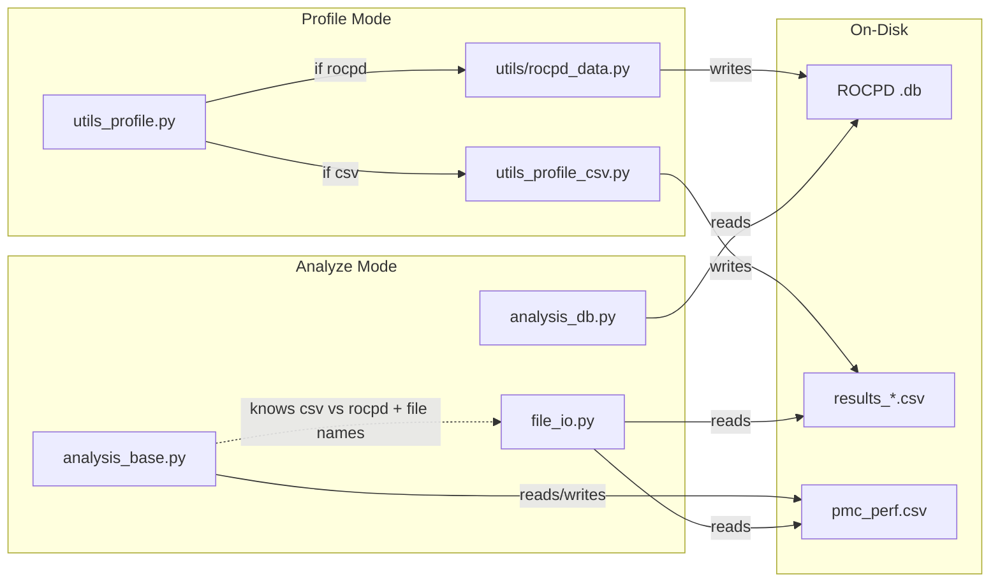
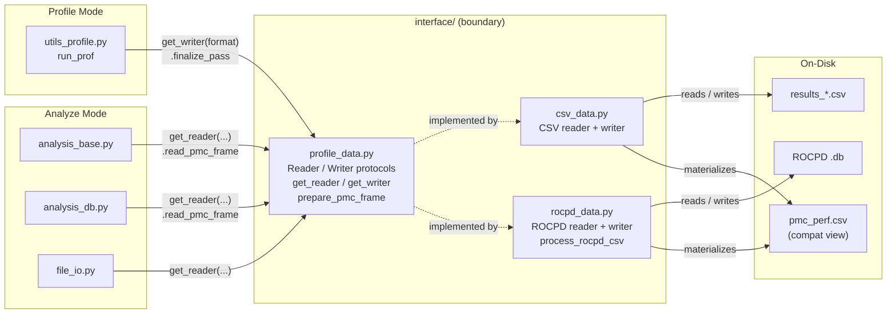
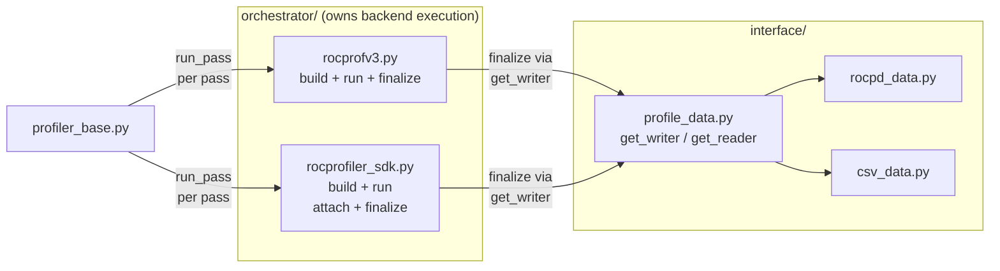
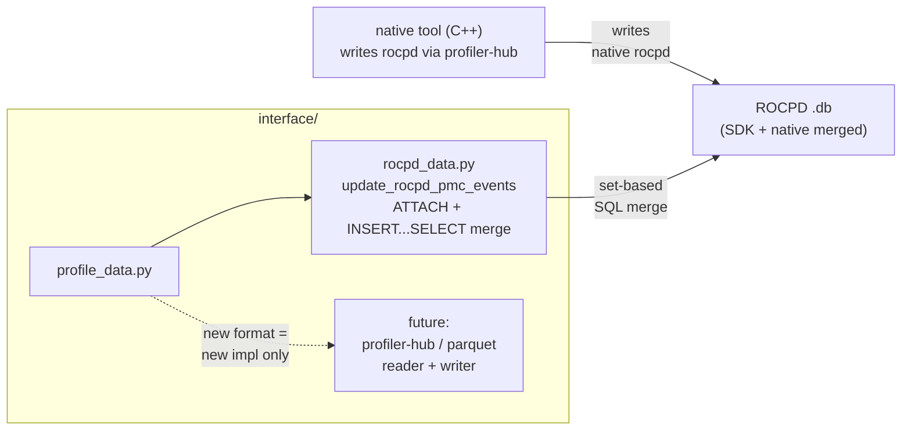

# Profile Data Interface Architecture

Status: proposal

Here we describe a clean Interface for profile data storage and access in
rocprofiler-compute. The goal is to keep storage-format knowledge in one place so
csv, rocpd, parquet, or any future source can be implemented without
forcing profiling, analysis, CLI, TUI, WebUI, and utility code to change with it
(which is a lot of unnecessary overhead to develop and not clean abstraction).

## Problem

Profile data storage is becoming more varied:

- ROCPD `.db` is expected to become the default profile output.
- Profiler Hub (formerly SNA) is expected to become another source of profile
  data.
- Parquet is a possible future option for large workloads.
- Ensure pmc_perf.csv continued use for existing user and developer workflows.

Today the writing, reading, joining and related methods are all thinly spread across the codebase. There's hardcoded on-disk file names in the same paths and they also contain, CSV joins, ROCPD extraction, and analysis expectations
at the same time, so every new storage format touches many unrelated
modules, which raises the cost and risk of each change.

## Goal

Put pmc profile data storage behind one boundary (interface/) with a clear reader and writer
contract.

- Profile mode finalizes data through a writer
- Analyze mode reads data through a reader
- No other module knows whether the source is csv, rocpd, or a future format,
  and no other module knows where or how it is stored on disk

Adding a new storage format should mean adding one new implementation behind the
boundary and extending one selection point, not editing profiling, analysis, and
utility code.

## Conceptual Today - Current Develop Branch

The current shape:
- Mixes profile source data, compatibility files, and on disk file name and paths knowledge across profile and analyze code
- Certain callers know (via hardcoded if else statements) whether a workload is csv or rocpd assemble file paths directly with no abstraction

## Target

### The Boundary

The boundary lives in `src/interface/` and exposes a small contract:

- `ProfileDataWriter.finalize_pass(context)` records a completed profiling pass
  in the selected storage format.
- `ProfileDataReader.has_profile_data(workload_dir)` reports whether readable
  profile data exists.
- `ProfileDataReader.read_pmc_frame(workload_dir)` returns the PMC DataFrame used
  by analysis.
- `ProfileDataReader.materialize_pmc_perf(workload_dir, output_path)` produces
  `pmc_perf.csv` only when a compatibility file is needed.

Callers obtain an implementation through two plain selection functions rather
than constructing implementations directly:

- `get_reader(profiling_config, options)` returns the correct reader.
- `get_writer(format)` returns the correct writer.

This is the only place that maps a configured format to an implementation. Both
functions live in `interface/profile_data.py` next to the contracts they return.

### Modules

| File | Responsibility |
| --- | --- |
| `interface/profile_data.py` | Reader/writer protocols, options dataclasses, `get_reader` / `get_writer` selection, and shared post-load formatting (`prepare_pmc_frame`). |
| `interface/csv_data.py` | CSV reader and writer implementation. |
| `interface/rocpd_data.py` | ROCPD reader and writer implementation, including the rocpd row normalization (`process_rocpd_csv`). |

- Our target here introduces the boundary and routes profile and analyze callers through it directly. 
- Profile mode finalizes through get_writer
- Analyze mode reads through get_reader  
- No caller branches on storage format or constructs file paths for profile data.

The reader reads its storage implementation, normalizes source-specific rows
into the PMC DataFrame, and returns that DataFrame to analyze callers. Analyze
callers never point into the selection functions or into a specific format.

## Follow-up: Backend Orchestration

Backend-specific execution behavior, like command construction, environment setup, attach/detach handling, subprocess execution, and pass finalization is a separate concern from profile data storage. A useful orchestrator owns that backend behavior and calls the writer to finalize each pass.

For example:
`src/orchestrator/{rocprofv3,rocprofiler_sdk}.py` which will have two classes,
one for profiling and one for analysis

This will be a later PR as combining it in one PR is a large and bloated diff
so it should be introduced seperately

## Follow-up: Profiler Hub And Future Formats

Once the boundary is stable, new formats and mechanisms land as implementation
changes behind it rather than as edits spread across the codebase!

- The in-flight Profiler Hub work is a good test of this design: 
https://github.com/ROCm/rocm-systems/pull/7284/changes. 
  - There the native C++ tool writes its own rocpd database directly, and the Python layer merges it into the SDK rocpd with a single set-based SQL statement (ATTACH + INSERT...SELECT) instead of parsing a CSV row by row. 
  - That is a writer side rocpd only change that would fit inside interface/rocpd_data.py (update_rocpd_pmc_events) behind the existing writer, so profiling and analyze callers do not change.
  - A future additional source (e.g. parquet) becomes a new reader/writer implementation plus one branch in get_reader / get_writer, simply a new `parquet_data.py` similar to how `rocpd_data.py` or `csv_data.py` in the target architecture

## Data Ownership

Not every file in the workload directory is profile data, keeping the boundary
intact means classifying each file by owner.

| Class | Examples | Owner | Rule |
| --- | --- | --- | --- |
| Raw profile source data | ROCPD `.db`, `results_*.csv`, future parquet | Profile data implementation | Only the boundary knows the layout and conversion rules. |
| Compatibility view | `pmc_perf.csv` | `ProfileDataReader` | Callers may request materialization but must not assemble it themselves. |
| Derived analysis artifacts | `pmc_kernel_top.csv`, `pmc_dispatch_info.csv`, roofline HTML, text output, analysis export `.db` | Analyze layer | Outputs derived from analysis, not storage backends. |

`pmc_kernel_top.csv` and `pmc_dispatch_info.csv` are analysis artifacts, not
profile storage. They are out of scope for the profile data boundary and are
documented here only so they are not mistaken for storage.

## Known Gaps

My proposal is fair about what remains after the boundary lands:

- Workload availability checks should use has_profile_data() instead of probing pmc_perf.csv or results_*.csv.
- YAML-driven table loading still assumes some tables come from named CSV files.
- ROCPD analysis currently goes through a CSV-shaped intermediate; reading the retained ROCPD source directly is a later improvement. This will be fixed when followed up with the default rocpd PR, which is a simpler implementation than it previously would be due to the abstraction.
- Derived analyze artifacts do not yet have a dedicated writer.

These are all analyze side concerns. They do not block the profile data boundary, and they confirm there are two boundaries to think about over time: profile source data and analyze-derived artifacts.

## Success Criteria

The design is working when

- Profile mode does not decide the profile storage layout.
- Analyze mode can ask for a PMC DataFrame without knowing whether the source is
  CSV, ROCPD, Profiler Hub, or parquet.
- `pmc_perf.csv` compatibility is produced through the reader boundary.
- Storage-format conditionals are isolated to `get_reader` / `get_writer` and the
  implementations.
- Adding a new profile source primarily means adding a new implementation and
  extending selection in one place.
