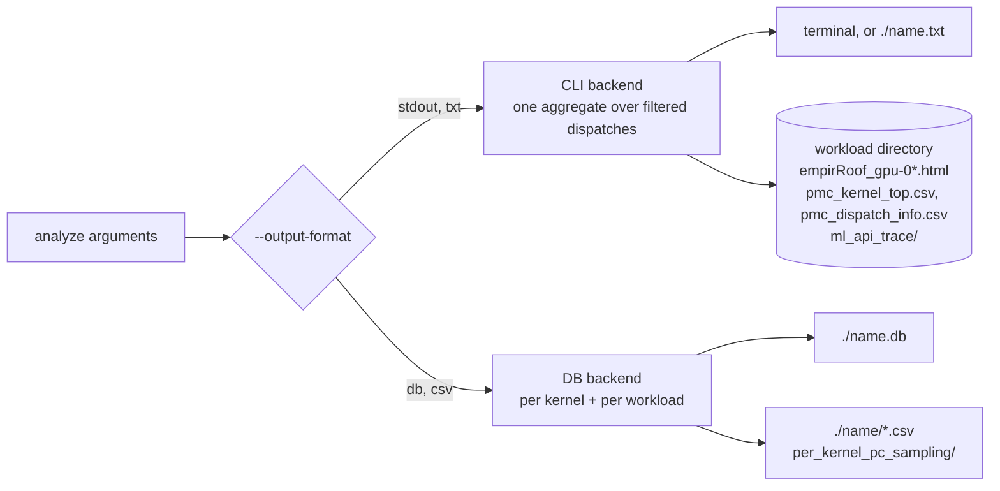
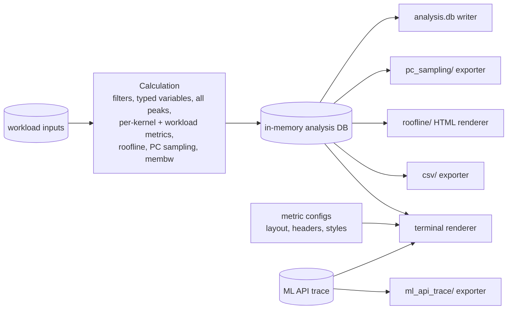
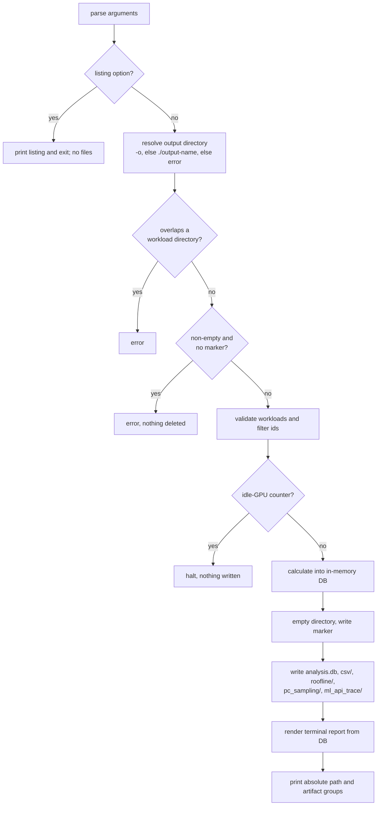

# Analyze: One Calculation, One Output Directory

## System Context

`rocprof-compute analyze` reads a profiled workload, evaluates the metric expressions defined
in the per-architecture metric configs, and presents the results. Its inputs are:

- counter results and system info;
- the roofline benchmark (`roofline.csv`);
- optional PC-sampling data and ML API traces.

`--output-format` picks one of two backends. They evaluate the same expressions with separate
code and produce different artifacts.



| Artifact | stdout | txt | csv | db |
|---|---|---|---|---|
| Terminal report | yes | logs and roofline plot leak to terminal | no | no |
| Report file | — | `./<name>.txt` | — | — |
| Analysis DB | — | — | — | `./<name>.db` |
| View CSVs, PC-sampling export | — | — | `./<name>/` | — |
| Roofline HTML | workload dir, single `-p` only | workload dir, single `-p` only | — | — |
| Top-stats scratch CSVs | workload dir | workload dir | — | — |

`<name>` defaults to `rocprof_compute_<uuid>` in the current directory. `--output-name` replaces
it but must be a bare name, so it cannot place output elsewhere.

Surrounding components:

- **Metric configs** define metrics, expressions, and the report layout. The
  analysis-config-redesign HLD replaces their source but keeps evaluation results identical and
  makes display a separate layer.
- **Analysis DB** is SQLite (schema 2.3.1), built in memory and copied to disk. ROCm Optiq
  (external) reads it. Nothing in the tool reads it back today.
- **Profile mode** already has `-d/--output-directory`, `-n/--name` (ignored when a directory is
  given), and `--overwrite` guarding non-empty directories.

## Problem statement

### The two backends disagree

The same workload and filters give different numbers depending on `--output-format`:

| ID | Divergence | Effect today |
|---|---|---|
| D1 | The DB path reads the Percent of Peak flag after the config loader turned it into a string | DB and CSV never contain Percent of Peak (0 of 543 gfx942 metrics flagged) |
| D2 | The DB builds peak variables from a subset of `roofline.csv` columns and skips validation | gfx950 MFMA F6F4 and gfx1250 WMMA F6F4 and WMMA FP64 peak metrics are NULL in the DB |
| D3 | The DB evaluates untyped system info | With `--specs-correction`, string values make DB arithmetic fail to NULL |
| D4 | CLI uses "N/A" and silently drops roofline points whose AI is missing; the DB stores NULL. Only the CLI halts on an idle-GPU counter | Kernels vanish from the roofline without notice; DBs written from idle-GPU counters |
| D5 | The CLI computes one filtered aggregate; the DB computes per kernel and per workload | Different granularity |
| D6 | The DB does not validate `--gpu-id`/`-d` ids; the top-stats tables differ | A typo silently produces an empty DB |
| D7 | Membw guidance, top-stats percentages, and some tables exist only in the CLI | The report shows data the DB lacks |
| D8 | The DB stores no ceilings, and its per-kernel roofline table has no view, uses GFLOP/s, and fixes one column per memory level. CLI ceilings use the device-0 row while peaks use the first row. Both drop gfx1250 L2 and L0 points. The limiter exists only in the HTML, which only single-`-p` CLI runs write | Optiq must derive ceilings itself; a `--device N` profile has peaks but no roofline; the CSV has no roofline |
| D9 | Rounding, units, and normalization are not recorded | A DB cannot say which normalization produced its values |
| D10 | CLI PC sampling ignores `--gpu-id`/`-d` and uses only the first `-k` | Counters and samples are filtered differently |
| D12 | Variance warnings differ in granularity | — |

Users read results in two places, the terminal and Optiq. When those disagree, users cannot
trust either one.

### One run cannot produce everything

Getting the report, an Optiq DB, and the roofline HTML takes at least two runs. Each run pays
for evaluation again, and each uses a different code path. `db` and `csv` exclude each other,
and neither writes the roofline HTML.

### Output is scattered and the profile gets modified

- Report files land in the current directory without distinct names for different analysis workloads.
- stdout and txt runs write the HTML and two scratch CSVs into the workload directory.
  Operator listings delete and recreate `ml_api_trace/` there.
- As a result, read-only or shared profiles break, and two analyses of one profile overwrite
  each other's HTML.

## Requirements

### Functional — CLI and output directory

| ID | Requirement |
|---|---|
| FR-1 | Every analyze run other than a listing run writes all artifacts into one output directory: terminal report, analysis DB, and CSV export. It also writes, when the data exists, the PC-sampling export, roofline HTML, and ML API trace export. |
| FR-2 | `--output-format` stays for one release as a deprecated no-op: `(DEPRECATED)` in help, a warning when used, value ignored. It is removed in the following release. |
| FR-3 | New analyze option `-o/--output-directory <dir>`, taking a plain path with no placeholder expansion. |
| FR-4 | `--output-name <name>` stays supported and must match `[A-Za-z0-9_-]+`. Given alone, it selects `./<name>/`. |
| FR-5 | At least one of `-o` and `--output-name` is required. When both are given, `-o` wins and a warning says `--output-name` was ignored. |
| FR-6 | `--list-stats`, `--list-available-metrics`, `--list-torch-operators` and `--list-triton-operators` only print. They need no output option and write no files. |
| FR-7 | Analyze writes nothing under any `-p` workload directory. An output directory that equals, is inside, or contains a workload directory is an error. |
| FR-8 | An absent output directory is created and an empty one is used. A non-empty directory with the analyze marker is emptied, then written. A non-empty directory without the marker is an error, and nothing is deleted. |
| FR-9 | The directory uses the fixed layout in Design. |
| FR-10 | The last line printed gives the absolute output directory and the artifact groups written. Comparison runs also print which HTML index belongs to which workload. |

### Functional — calculation

| ID | Requirement |
|---|---|
| FR-11 | One evaluation pass fills an in-memory analysis DB. Every artifact is rendered from it; the only exception is the operator tree (FR-29). |
| FR-12 | Percent of Peak is calculated once, from the unrounded value and peak, and stored. (D1) |
| FR-13 | Every `roofline.csv` column is a peak variable and is stored with the workload. `roofline.csv` is validated on every run. Peaks and ceilings both come from the row whose `device` equals the device recorded in the workload's profiling config. A file that fails validation or has no such row gives NULL peaks and no roofline, with a warning. (D2, D8) |
| FR-14 | System variables are typed before evaluation: numeric cast; missing or zero values become 0 with a warning; `num_xcd` defaults to 1. This applies to `--specs-correction` values too. (D3) |
| FR-15 | A value that cannot be calculated is stored as NULL. (D4) |
| FR-16 | If any dispatch reports zero GPU activity (`GRBM_GUI_ACTIVE == 0`), the run halts before any file is written. (D4) |
| FR-17 | Every metric is evaluated for each kernel that survives the filters, and once for the workload, on every run. (D5) |
| FR-18 | Unknown `--gpu-id`, `-d` or `-k` ids exit with today's messages before any file is written. (D6) |
| FR-19 | Kernel and dispatch rows cover only what survives all filters. (D6) |
| FR-20 | The workload's total duration after the `--gpu-id` and `-d` filters is stored. Top-stats Pct is a kernel's total duration divided by that total. |
| FR-21 | The memory-bandwidth guidance result is stored in the DB. |
| FR-22 | Every evaluated metric is stored, whatever the display rules. (D7) |
| FR-23 | Ceilings are stored per workload: one bandwidth ceiling per memory level and one compute ceiling per data type and pipe (VALU or matrix), for every positive benchmark mean in the row FR-13 selects. Roofline points are stored per kernel and memory level: the arithmetic intensity and performance the roofline plot-points table evaluates, mapped to memory levels in one place, gfx1250 GL2 and GL0 included. (D8) |
| FR-24 | Values are stored unrounded, in base units (ns, bytes/s, FLOP/s, FLOP/byte). The options that change values are stored in DB metadata: normalization unit, `-k`, `-d`, `--gpu-id`, `-b`, and specs correction. (D9) |
| FR-25 | Every filter applies to PC samples exactly as it does to counters. The DB keeps every sample row for the surviving kernels. (D10) |
| FR-26 | Noise reporting is one clamp summary per workload. (D12) |

### Functional — rendering and export

| ID | Requirement |
|---|---|
| FR-27 | The terminal report combines DB rows with the layout from the run's metric configs. `--decimal`, `--time-unit`, bandwidth scaling, table hiding, and the comparison and baseline display rules apply here and nowhere else. NULL prints as `N/A`. |
| FR-28 | The top-stats table lists only the filtered kernels and has no `*` selection marker. |
| FR-29 | Operator options do not change the calculation. The report adds the operator tree and, clearly labelled, the per-kernel rows of matching kernels. Workload tables are not narrowed by operator. The trace is exported to `ml_api_trace/`. |
| FR-30 | Baseline and comparison differences are calculated at render time from per-workload rows. |
| FR-31 | The roofline terminal section, plot and HTML are rendered from ceiling and point rows. Points with NULL arithmetic intensity or performance are left out, with a note naming the kernel. Limiter and percent of roofline are derived from point and ceiling rows against the tallest ceiling among the `-R` data types. `-R` and `--mem-level` change only what is drawn. Every workload gets an HTML file; the terminal roofline section appears only for a single workload. |
| FR-32 | The PC-sampling report shows the top `--pc-sampling-rows` rows per selected kernel, ordered by `--pc-sampling-sorting-type` and formatted as today. |
| FR-33 | The CSV export writes one file per DB view, in base units, with NULL as an empty cell. |

### Non-functional

| ID | Requirement |
|---|---|
| NFR-1 | Validation and calculation finish in memory before the output directory is touched. If writing fails after cleaning, the directory keeps its marker and holds partial artifacts, and the error names it. The next run into that directory cleans it. |
| NFR-2 | Terminal report values match today's stdout report except where FR-12, FR-13, FR-14, FR-15, FR-23, FR-26, FR-28 or FR-29 change them. |

### Non-goals

- A text copy of the report. Users who want one redirect stdout.
- Storing the report layout or the operator selection in the DB.

## Design

### The analysis DB is the only calculation result

One evaluation pass writes an in-memory analysis DB. Every output is a reader of that DB: the
terminal renderer, CSV exporter, PC-sampling exporter, roofline HTML renderer, and DB file
writer. Because they all read the same rows, no two artifacts can disagree. Renderers derive
only display quantities from those rows: comparison differences, the PC-sampling top N, and the
roofline limiter and percent of roofline.



### Report layout comes from the metric configs

The DB stores values and metric identity (id, name, unit, description, table). The renderer
takes headers, column order and styles from the configs already loaded for the run. This keeps
the DB schema independent of the config format.

### Roofline in the DB

- **One benchmark row.** Peaks and ceilings come from the `roofline.csv` row whose `device`
  matches the device recorded in the workload's profiling config. That is the row the benchmark
  wrote for the profiled GPU, so report peaks and plotted ceilings cannot come from different
  devices.
- **Ceilings.** One row per workload ceiling: bandwidth per memory level, and compute per data
  type and pipe. Every positive benchmark mean is stored, MALL included. Which roofs to draw stays
  a rendering rule, and the HTML axis frame is computed from these rows.
- **Points.** `compute_kernel_roofline_point` has one row per kernel and memory level, holding
  that level's arithmetic intensity and the kernel's performance. Each row is one plotted point.
  Memory levels are values, not columns, so each architecture's level set needs no schema
  change. The values are what the roofline plot-points table evaluates, so the formulas live
  only in the metric configs.
- **Metric rows.** The roofline rate and plot-points tables are also stored as ordinary metric
  rows per kernel and per workload, like every other table (FR-22). `--view table` renders the
  workload values from them.
- **Limiter and percent of roofline.** They depend on the compute ceiling chosen by `-R`. The
  renderer derives them from point and ceiling rows, so the DB holds no value that depends on a
  display option.

### Reconciling the calculations

| ID | Ruling | Visible change |
|---|---|---|
| D1 | Calculate once, unrounded, store; renderers only round | Bytes/s rows may change in the last shown decimal |
| D2 | Every `roofline.csv` column becomes a peak variable; the file is validated | gfx950 and gfx1250 F6F4 and gfx1250 WMMA FP64 peaks filled in |
| D3 | Typed variables | `--specs-correction` no longer blanks DB metrics |
| D4 | NULL stored, `N/A` shown, NULL points left off the roofline with a note; idle-GPU guard halts before writing | Kernels left off the roofline are named in a note |
| D5 | Per kernel for all filtered kernels, plus workload, every run | Higher cost on workloads with many kernels |
| D6 | Unknown ids error; only filtered kernels stored | Top-stats table loses unselected rows and `*` |
| D7 | DB stores everything; hiding rules apply only when rendering; membw result and workload total stored | DB gains membw and Pct inputs |
| D8 | Peaks and ceilings from the recorded device's row; ceilings and per-level points stored, with views; limiter derived at render time | Roofline HTML in every run with roofline data, one per workload; roofline in the CSV; gfx1250 L2 and L0 points; `--device N` profiles get a roofline |
| D9 | Base units, unrounded; value-changing options recorded | Metadata says how values were produced |
| D10 | All filters apply to samples; DB keeps all rows; report shows top N per kernel | `--gpu-id`/`-d` now narrow PC sampling |
| D12 | One clamp summary per workload | Per-metric variance warnings disappear |

The comparison profiling config still comes from the first `-p`, as in both backends today. Only
the benchmark device (FR-13) is read from each workload's own profiling config.

### Run order: everything in memory before the directory is touched



Every failure that depends on the input happens before the cleaning step. This covers invalid
ids, the idle-GPU guard, and evaluation errors. A failure while writing leaves partial
artifacts in a directory that still carries the marker.

### Output location: explicit, profile-style

| `-o` | `--output-name` | Output directory |
|---|---|---|
| `<dir>` | — | `<dir>` |
| — | `X` | `./X` |
| `<dir>` | `X` | `<dir>`, with a warning that `--output-name` is ignored |
| — | — | error: one of `-o/--output-directory` or `--output-name` is required |
| listing option | any | none; the listing is printed |

- The short alias is `-o` because analyze already uses `-d` for `--dispatch`.
- Paths are taken literally; the shell expands variables.

### Cleaning is marker-gated

Each run writes a marker file at the directory root, and only an empty or marker-bearing
directory is emptied. A mistyped `-o .`, `-o ~` or `-o /scratch/team` fails without deleting
anything, while reruns into the same directory work with no extra flag.

### Workload directories are read-only

The top-stats scratch tables stay in memory, and the HTML and ML API trace move to the output
directory.

### Directory layout

```text
<output-dir>/
├── <marker file>
├── analysis.db
├── csv/<view>.csv                     one file per DB view
├── roofline/empirRoof_gpu-0.html      single -p
│   └── empirRoof_gpu-0_<n>.html       comparison run, n = 1-based -p position
├── pc_sampling/<workload>/<sub>/...   per-kernel ISA CSVs and source snapshot, when sampled
└── ml_api_trace/consolidated.csv      when operator options are used
```

No text copy of the report is written; redirecting stdout gives one.

Migration for existing scripts:

| Today | After |
|---|---|
| `--output-format db --output-name X` → `./X.db` | `--output-name X` → `./X/analysis.db` |
| `--output-format csv --output-name X` → `./X/kernel.csv` | `./X/csv/kernel.csv` |
| `--output-format txt` → `./<name>.txt` | none; redirect stdout |
| `<workload>/empirRoof_gpu-0_<k>.html` | `<dir>/roofline/empirRoof_gpu-0.html` |
| `<workload>/pmc_kernel_top.csv`, `pmc_dispatch_info.csv` | not written |
| `<workload>/ml_api_trace/` | `<dir>/ml_api_trace/` |
| `rocprof-compute analyze -p wl` | error; add `-o <dir>` or `--output-name <name>` |

### Analysis DB changes (schema 3.0.0)

| Change | Requirement |
|---|---|
| Roofline ceiling table and view | FR-23 |
| `compute_kernel_roofline_point` (one row per kernel and memory level) and view, replacing `compute_kernel_roofline_data` | FR-23 |
| Memory-bandwidth guidance table and view | FR-21 |
| Workload: filtered total duration; benchmark data holds every `roofline.csv` column | FR-20, FR-13 |
| Metadata: the options that change values | FR-24 |
| Percent of Peak rows in the metric value tables | FR-12 |

Replacing the roofline table is the only change to an existing table, and it is why the major
version changes. The five existing views keep their shape. Optiq needs a matching update to read
roofline from 3.0.0 DBs.

### Operator filters stay a report view

Torch and Triton operator patterns do not change the calculation or the DB. The report adds the
operator tree and the per-kernel rows of matching kernels, which are already in the DB. Workload
tables still cover every selected kernel.

### Deprecating `--output-format`

The option stays for one release as a no-op that warns that every artifact is always written.
This follows the profile `--path` → `--output-directory` precedent.

## Implementation phases

1. **Calculation parity in the DB pipeline** (FR-12–FR-26). The DB pipeline adopts typed
   variables and the idle-GPU guard. It reads peaks and ceilings from the recorded device's row
   and writes the ceiling and roofline point tables. It also fixes D1–D12, stores membw and the
   recorded options, and bumps the schema to 3.0.0.
   *User value:* `--output-format db` and `csv` output becomes correct and complete.
2. **Render everything from the DB** (FR-11, FR-27–FR-32). The terminal report, roofline plot
   and HTML are rendered from DB rows. Comparison differences, the PC-sampling top-N, and the
   roofline limiter and percent of roofline are derived at render time. The separate CLI
   calculation is deleted, while `--output-format` still selects which files are written.
   *User value:* the terminal and the DB can no longer disagree.
3. **One run, one directory** (FR-1–FR-10, FR-33, NFR-1, NFR-2). This phase adds `-o`, the
   requirement for `-o` or `--output-name`, the grouped layout, marker-gated cleaning,
   read-only workloads, the `--output-format` deprecation, and the end-of-run summary. Docs,
   skills and the CHANGELOG (with the migration table) are updated in the same phase.
   *User value:* one run produces every artifact in one known place.

## Validation, security and debuggability

### Validation

| # | Check | Pass criteria | Type | Covers |
|---|---|---|---|---|
| 1 | Golden terminal report on reference workloads (gfx942, gfx950, gfx1250) | Differences from today's stdout are limited to the listed exceptions and reviewed one by one | integration | NFR-2 |
| 2 | Report vs DB consistency | Every printed value equals the DB value after its display transform | integration | FR-11, FR-27 |
| 3 | Percent of Peak | Present in the DB and CSV for every metric flagged in the configs | unit | FR-12 |
| 4 | Peak coverage | gfx950 and gfx1250 F6F4 and gfx1250 WMMA FP64 peaks equal their `roofline.csv` values | unit | FR-13 |
| 5 | Peak row | A `--device N` workload gets peaks and ceilings from its own row; a file with no matching row gives NULL peaks, no roofline, and a warning | unit | FR-13 |
| 6 | Specs correction | Same values as without correction when the specs match | unit | FR-14 |
| 7 | Idle-GPU guard and invalid ids | Exit with today's messages, roof-only profiles included; output directory not created or not modified | integration | FR-16, FR-18 |
| 8 | Output resolution matrix | Each row of the location table behaves as specified, including listing options | unit + CLI | FR-3–FR-6 |
| 9 | Read-only workload | Analysis of a read-only workload succeeds | integration | FR-7 |
| 10 | Cleaning | Marked directory is emptied; unmarked non-empty directory errors with contents intact; workload overlap errors | unit + integration | FR-8 |
| 11 | Layout | Expected files for single, comparison, PC-sampling and operator runs | integration | FR-1, FR-9, FR-31, FR-33 |
| 12 | Schema | `schema_version` is 3.0.0; 2.3.1 queries on the five existing views succeed; schema diagrams regenerated | unit | FR-23 |
| 13 | `--output-format` deprecation | Value ignored, warning printed, `(DEPRECATED)` in help | CLI | FR-2 |
| 14 | Write failure | Fault injected after cleaning leaves the marker; the next run succeeds | unit | NFR-1 |
| 15 | End-of-run summary | Last line is the absolute path; comparison runs list the index-to-workload mapping | integration | FR-10 |
| 16 | Calculation rulings | NULL stored for unavailable values; per-kernel rows for every filtered kernel; only filtered kernels and dispatches stored; workload total and Pct; membw rows; ceiling rows for every positive benchmark mean; one point row per kernel and memory level matching the plot-points metric rows, gfx1250 L2 and L0 included; recorded options; PC samples narrowed by every filter; one clamp summary | unit | FR-15, FR-17, FR-19–FR-26 |
| 17 | Rendering rules | Top-stats without `*`; operator tree plus labelled per-kernel rows with workload tables unchanged; comparison differences derived from rows; PC-sampling top-N per kernel; limiter and percent of roofline equal today's for the same `-R` | integration | FR-28–FR-32 |

### Security

- Cleaning deletes files, so three checks guard it: the marker, the workload-overlap check,
  and the bare-name rule for `--output-name`.
- Cleaning removes symbolic links themselves and never follows them out of the directory.

### Debuggability

- The DB metadata records the tool version and the options that changed values.
- The end-of-run line gives the absolute directory.

### Retained risks

| Risk | Mitigation |
|---|---|
| Evaluating every kernel on every run slows analysis of workloads with many unique kernels | Measure in phase 1 and report the numbers |
| Scripts relying on `./X.db`, `./X/kernel.csv`, `./X.txt` or bare `analyze -p` break | Migration table in the CHANGELOG and docs |
| Last-decimal changes on Bytes/s Percent of Peak rows | Listed in NFR-2 and the CHANGELOG |
| Optiq builds that read 2.x cannot read roofline from 3.0.0 DBs | The major version lets Optiq detect the change; the Optiq update ships with this change; the CHANGELOG notes it |
