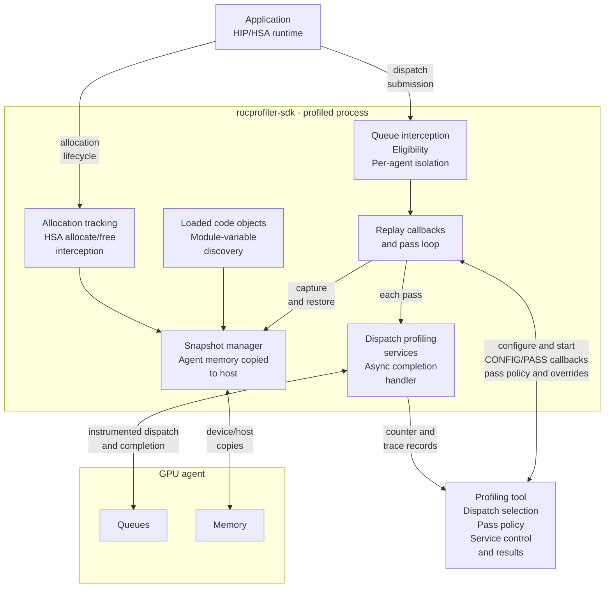
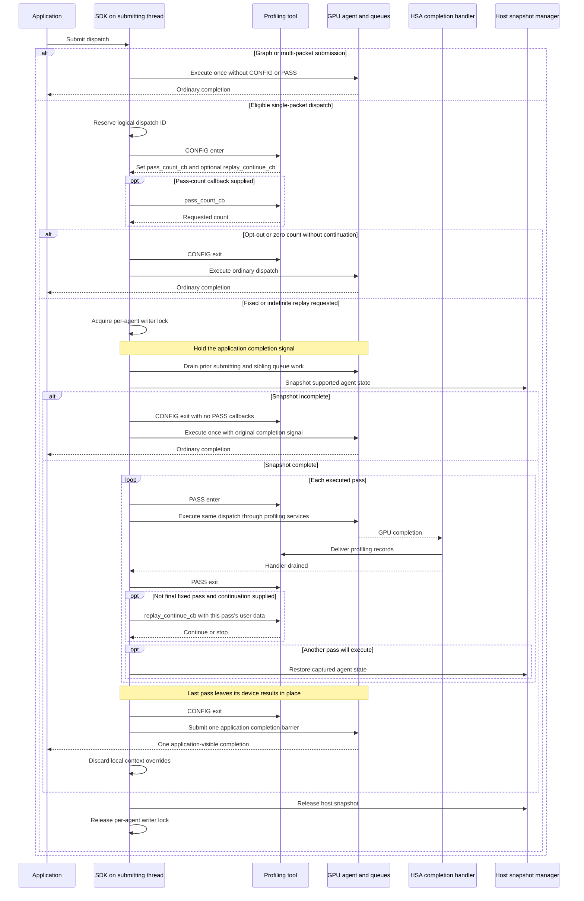
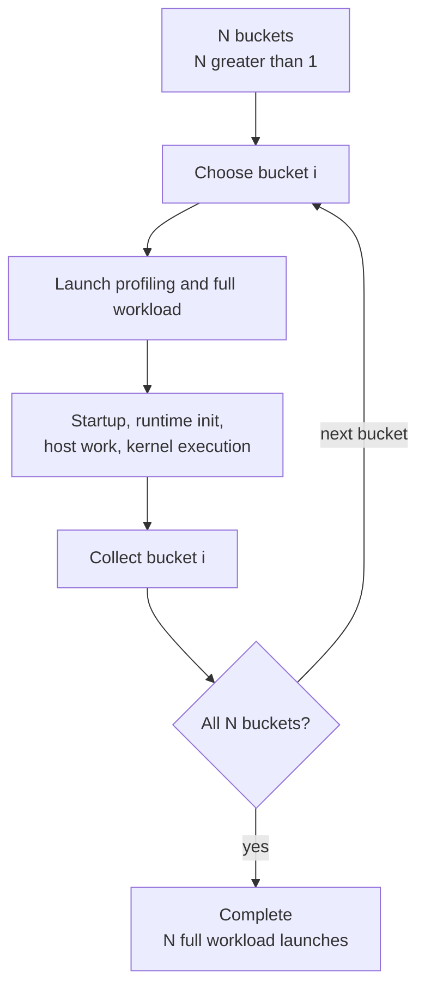
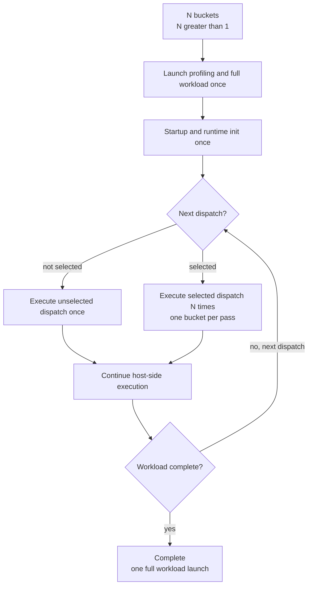
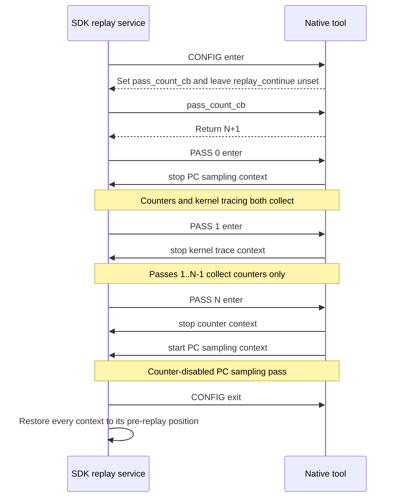
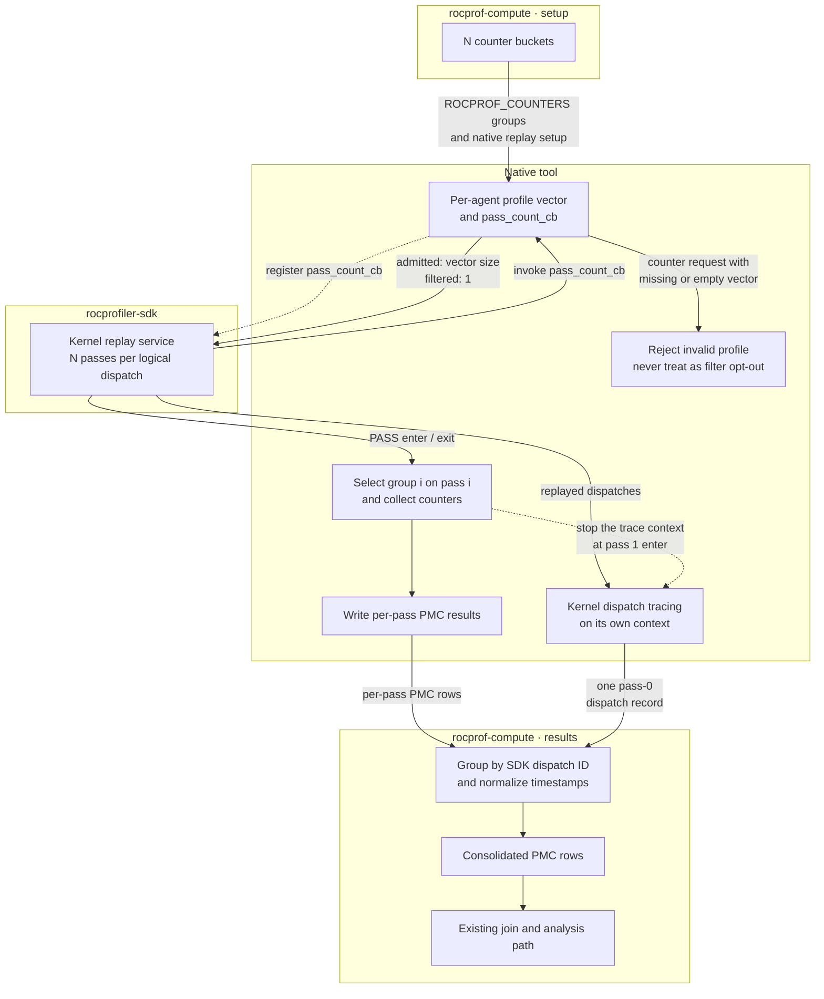
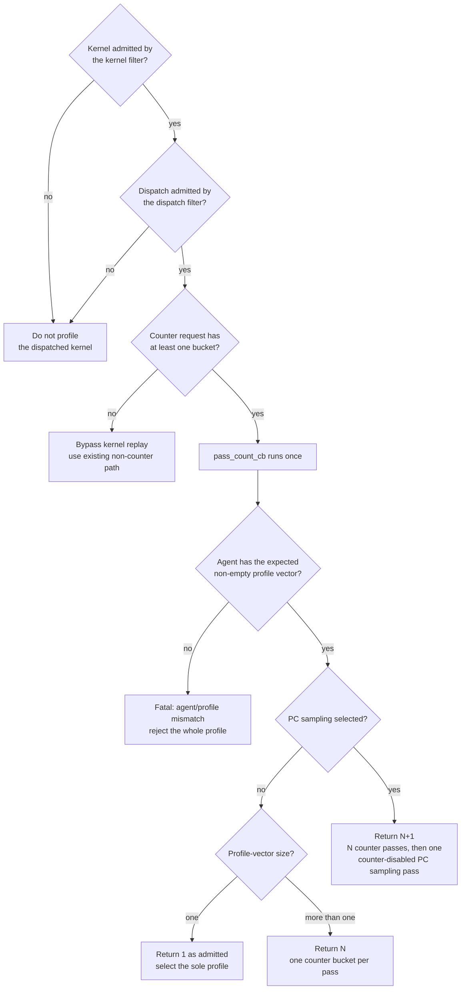

# Kernel replay in rocprof-compute

## System Context

### Terms

| Term | Meaning |
| --- | --- |
| **Bucket** | A group of hardware counters small enough to fit one hardware pass. |
| **Logical dispatch** | One kernel launch as the application issued it, however many times a replay strategy executes it. |
| **Native tool** | A `rocprof-compute` library. |
| **Context** | A rocprofiler-SDK container holding one or more profiling services, started and stopped as a unit. |

### Counter collection today

| Strategy | Execution model | Pros | Cons |
| --- | --- | --- | --- |
| **Application replay** | Launch and run the complete workload once per bucket. | Every counter collected for equivalent dispatch — nothing is estimated. | Repeats process startup, runtime initialization and host work. |
| **Iteration multiplexing** | Launch once and let the native tool rotate buckets across comparable dispatches. Analysis imputes each dispatch's missing counters. | Avoids repeated launches for workloads with enough dispatches. | Never collects every bucket from one logical dispatch. Undersampled kernels cannot produce a complete metric set. |

- Every configuration consumes the same buckets. Application replay works across all of them;
  iteration multiplexing hard-errors without the native tool.
- Application replay is therefore the only strategy today that satisfies a multi-bucket request
  without borrowing counters from neighbouring dispatches.

### Co-active profiling services

Counter collection never runs alone. Every counter collection invocation must produce kernel-dispatch records.

| Service | Context owner today | Per dispatch? | Consequence under kernel replay |
| --- | --- | --- | --- |
| Counter collection | Native tool, shared with code-object tracing | Yes | one bucket per pass. |
| Code-object tracing | Native tool, shared with counter collection | No | Unaffected. |
| Kernel dispatch tracing | `rocprofiler-sdk-tool` | Yes | *N* records for one logical dispatch. |
| Marker / ROCTx tracing | `rocprofiler-sdk-tool` | Host-side, spans all passes | Region duration absorbs replay overhead. |
| PC sampling | `rocprofiler-sdk-tool`, separate workload invocation | Agent-wide | A separate pass. |

### Prerequisites

Kernel replay controls services by starting and stopping contexts around individual passes. That
control is only available over contexts the native tool owns, and only over services sharing a
context when they need to be managed as a unit.

| Prerequisite | Why kernel replay needs it |
| --- | --- |
| The native tool owns kernel dispatch tracing and emits its dispatch records | A tool cannot locally stop a context it does not own. |
| The native tool owns PC sampling | Same as above. |
| Counter collection moves to its own context | To allow fine-grained service start and stop. |

### SDK replay mechanism

The SDK owns dispatch repetition, memory restoration, and queue isolation. The tool chooses which
dispatches to replay, how many passes to request, and which profiling services collect on each pass.

The component diagram shows these responsibilities inside the profiled process. Replay uses the
ordinary dispatch profiling path for every pass; it is independent of counter collection.

#### Registration and activation

The tool configures `ROCPROFILER_CALLBACK_TRACING_KERNEL_REPLAY` through
`rocprofiler_configure_callback_tracing_service` during tool initialization.

| Condition | SDK behavior |
| --- | --- |
| Subscription includes `CONFIG`, or all operations | Starting that context activates the replay gate. A `PASS`-only subscription cannot initiate replay. |
| Another context already configured replay | Configuration returns `ROCPROFILER_STATUS_ERROR_SERVICE_ALREADY_CONFIGURED`, even if the first context is stopped. Ownership is process-wide. |
| Replay service configured | Enables allocation tracking, including while its context is stopped, so later replay can capture live allocations. |
| No active replay context | Dispatches follow the ordinary path without replay locks or snapshots. |

#### Callback contract

Both `CONFIG` and `PASS` deliver `PHASE_ENTER` and `PHASE_EXIT`. Here, `pass_count_cb` names the
tool callback stored in `replay_pass_count`; `replay_continue_cb` names the callback stored in
`replay_continue`, of type `rocprofiler_kernel_replay_continue_cb_t`.

| Callback or phase | Owner | Contract |
| --- | --- | --- |
| `CONFIG` enter | SDK calls tool | Once per eligible dispatch. The tool sets the pass-count callback, optional continuation default, and sequence user data. |
| `pass_count_cb` | Tool supplies; SDK calls | Called once if supplied, with dispatch information and sequence user data. Returns the requested pass count. |
| `PASS` enter | SDK calls tool | Before each executed pass. Reports dispatch information, zero-based `current_pass`, and `total_passes`; supplies local context toggles. |
| `PASS` exit | SDK calls tool | After GPU execution and the pass's profiling completion handler drain. The tool may replace the continuation callback for this pass. |
| `replay_continue_cb` | Tool supplies; SDK calls | After `PASS` exit, if another pass is allowed. Receives dispatch information, current pass, total passes, and this pass's user data. Zero stops; nonzero continues. |
| `CONFIG` exit | SDK calls tool | Closes the sequence after its last executed pass, or before ordinary execution on opt-out or snapshot decline. It does not report the completed-pass count or a snapshot status. |

| Pass-count configuration | Continuation callback | SDK behavior |
| --- | --- | --- |
| Callback absent | Ignored | Execute once without snapshot or `PASS` callbacks. |
| Returns `1` | Ignored | Execute once without snapshot or `PASS` callbacks. |
| Returns *N* > 1 | Absent | Execute exactly *N* passes if replay succeeds. |
| Returns *N* > 1 | Present | Execute up to *N* passes; continuation can stop early but cannot extend the limit. |
| Returns `0` | Present | Indefinite replay until continuation returns zero; `total_passes` is `0`. |
| Returns `0` | Absent | Warn and execute once without replay. |

The fixed-count limit is checked before continuation. For *N* passes, `replay_continue_cb` is
consulted only after passes 0 through *N*−2; `PASS` exit still runs after every pass.
An indefinite loop consults continuation after every pass and has no overall SDK pass or time limit.
If the tool never stops it, application never exits.

| Payload field | `CONFIG` | `PASS` |
| --- | --- | --- |
| `dispatch_info` | SDK-populated dispatch, agent, queue, kernel, and launch information | Same logical dispatch information |
| `current_pass`, `total_passes` | Zero; not a completion summary | Read-only pass index and configured count, or `0` total for indefinite replay |
| `replay_pass_count` | Tool sets at enter | Null; the count cannot change during replay |
| `replay_continue` | Tool sets the sequence default at enter | Null at enter; at exit, holds the current default and accepts an override for this pass only |
| `replay_start_context`, `replay_stop_context` | Not available | SDK-populated at enter only |

An override made at `PASS` exit applies to the following continuation decision. The next pass
starts with the `CONFIG` default again. The API exposes no snapshot/restore callbacks or structured
snapshot-failure field.

#### Callback state and dispatch identity

| State | Lifetime and meaning |
| --- | --- |
| Sequence user data | The value set through `user_data` at `CONFIG` enter reaches the pass-count callback, every pass, and `CONFIG` exit. |
| Per-pass user data | Each pass receives its own copy. Writes reach that pass's exit and continuation callback, but not the next pass or `CONFIG` exit. |
| Shared sequence state | Store behind `user_data.ptr` when updates must survive across passes. The tool owns its lifetime through `CONFIG` exit. |
| Dispatch ID | Reserved before `CONFIG` and reused for every pass, including ordinary execution when replay is declined. The logical dispatch advances the ID sequence once. |
| Thread, internal and ancestor correlation IDs | Preserved across the replay callbacks and executions of the logical dispatch. |
| Pass timestamps | Each execution has its own start/end timestamps. A common dispatch ID does not imply a common duration. |

Per-pass storage therefore needs both logical dispatch identity and pass index. Other profiling
services do not automatically receive replay metadata; the tool must associate their records with
the pass selected at `PASS` enter.

#### Per-pass context control

The SDK supplies `replay_start_context` and `replay_stop_context` on the `PASS` record. The tool
calls them to set local overrides for its contexts. These overrides do not call the global
context start/stop APIs.

| Rule or condition | Effect |
| --- | --- |
| Called during `PASS` enter for a context active at loop entry | Records the override for this loop; it remains sticky until changed. |
| Local enable | Undoes a prior local disable; cannot promote a globally inactive context. |
| Called outside `PASS` enter | Returns `ROCPROFILER_STATUS_ERROR_CONTEXT_ERROR`. |
| Context was not active when the loop began | Returns `ROCPROFILER_STATUS_ERROR_CONTEXT_NOT_STARTED`. |
| Loop ends | Discards the thread-local override map. Global context state is never changed. |

#### Replay execution and isolation

The sequence below includes SDK opt-out and fallback behavior. Compute's stricter treatment of
incomplete replay is defined under [Failure behavior](#failure-behavior).

Replay runs synchronously on the submitting thread; there is no replay worker. Waiting for the
profiling handler before `PASS` exit prevents the next pass from reusing signals or buffers still
in use.

| Isolation boundary | SDK behavior |
| --- | --- |
| Replayed dispatch | Holds the per-agent writer lock across draining, capture, execution, restoration, and completion submission. |
| Ordinary dispatch while replay is active | Holds the same agent's reader lock across submission. Ordinary submissions can coexist, but cannot enter an active replay window. |
| Already-submitted work | A submitting-queue barrier and agent-wide handler drain complete prior kernels before capture. Submission locks alone do not wait for GPU completion. |
| Different agents | Use separate locks and agent-scoped snapshots; replay can proceed concurrently for independent device state. |
| Queue or handler drain stalls | Bounded waits warn and then abort, rather than snapshotting or restoring while work is still active. |

#### Memory capture and lifetime

HSA allocation/free interception maintains the live allocation inventory and its owning agents.
For example, this inventory can contain an input or output array created with `hipMalloc` that
remains allocated while a dispatch is replayed.
At capture time, the SDK also enumerates loaded executables for module-scope variables, which do
not come from the allocation inventory. Examples include a `__device__` global counter or a
`__constant__` lookup table compiled into a loaded code object. A kernel can access these examples
through a pointer or symbol without the underlying storage appearing directly in its launch
arguments.

| Stage | SDK behavior |
| --- | --- |
| Capture | Copies the replaying agent's supported live allocations and discovered module variables to host buffers once. It does not restrict capture to the selected kernel's arguments. |
| Restore | Copies captured bytes back only before another pass. Tracked allocation copies check liveness under the inventory lock, excluding concurrent frees during each copy. |
| Allocation retired after inventory capture | Skips a region that is no longer live or is smaller than the captured size. Allocation/free operations are not globally frozen by replay. |
| Capture failure | Host-memory exhaustion, a failed device-to-host copy, or incomplete module enumeration declines replay. The SDK closes `CONFIG` and executes once without `PASS` callbacks. |
| Restore failure | A failed host-to-device copy aborts the process; partially restored state cannot safely drive another pass. |
| Loop termination | Keeps the last executed pass's device results and releases the host snapshot. Early termination follows the same rule. |

#### Replay coverage and limitations

| State or feature | Coverage or limitation |
| --- | --- |
| Tracked coarse-grained device allocations, including ordinary `hipMalloc` | Captured for the owning agent and restored between passes. |
| Module-scope `__device__` / `__constant__` state | Captures variables discoverable through loaded executable symbols. Variables above the implementation's 1 GiB sanity cap are warned about and omitted; that omission does not decline replay. |
| Unified, managed, `hipMallocAsync`, and other virtual-memory-mapped allocations | Not captured. Writes can accumulate across passes. |
| Host, fine-grained, and kernel-argument memory | Not captured. Input equivalence is not guaranteed for kernels that modify it. |
| Executable-flag allocations | Excluded to avoid restoring live runtime argument pools and profiler buffers. Direct-HSA application data using the same flag is also omitted without declining replay. |
| Cache state | Not restored. Cache-sensitive counter values may vary between passes. |
| HIP graphs or multi-packet/multi-dispatch submissions | Warn once per unsupported case and execute once without `CONFIG` or `PASS`. Only eligible single-packet, single-dispatch submissions reach configuration. |
| Asynchronous SDMA or HSA copies | Bypass the replay gate and are not fenced by the replay window. |
| Other processes, ranks, and cross-agent shared state | Not coordinated by the process-local per-agent locks. Collectives and external writes can make replay unsafe. |
| Host-memory capacity | Requires the captured bytes plus metadata, including module variables. Concurrent replay on different agents can retain multiple snapshots. |

## Problem statement

When a counter request produces *N* buckets and *N* is greater than one:

| Per counter-collection run | Application replay | Kernel replay |
| --- | --- | --- |
| Workload launches | *N* | 1 |
| Process startup, runtime initialization | *N*× | 1× |
| Host-side work | *N*× | 1× |
| Executions of a replay-eligible dispatch | *N* (one per launch) | *N* (one per pass) |
| Executions of every other dispatch | *N* | 1 |
| Added cost | — | Snapshot, restore |

Only the selected kernel needs profiling *N* times. For workloads with a large startup cost,
application replay requires a lot of time.

- **Iteration multiplexing does not close this gap.** It avoids the repeated launches, but collects
  counters from different dispatches and fills each dispatch's gaps during analysis. It cannot
  collect every counter from repeated executions of *one* logical dispatch in a single workload run.
- **This is not free.** Kernel replay drops the repeated full-workload launches but adds memory snapshot
  and restoration. It will not be faster for every workload.

The flows below compare counter collection when *N* is greater than one. It does not include other
services outside counter collection.

### Application replay

### Kernel replay

## Requirements

### Functional requirements

#### Mode selection

| ID | Requirement |
| --- | --- |
| **FR-1** | `rocprof-compute profile` exposes `--replay-mode {application,kernel}`, defaults to `application`. `--iteration-multiplexing` remains independent. |
| **FR-2** | For *N* buckets, kernel mode uses one workload invocation for counter collection and collects one bucket in each of *N* passes, for every replay-eligible dispatch. No user-supplied pass count. A zero-bucket request bypasses kernel replay and retains the existing path. |
| **FR-3** | Kernel replay requires the native tool. The non-native counter-collection backend and `--no-native-tool` are unsupported. A declined native tool, or a ROCm version that does not support one, is a hard error naming the unmet condition, before any workload runs. |

#### Passes and buckets

| ID | Requirement |
| --- | --- |
| **FR-4** | Bucket membership matches application replay. `_ACCUM` pairing, TCC grouping, and same-bucket priority are unchanged, and every bucket still fits one hardware pass. |
| **FR-5** | Pass count equals the bucket count, or the bucket count plus one when `--pc-sampling` is selected. The native tool requests a fixed count with no continuation callback. |
| **FR-6** | The PC sampling pass runs with counter collection disabled, and alters neither bucket membership nor the ordering of the counter passes preceding it. It is realized by locally stopping the counter context and locally starting the PC sampling context at that pass. |

#### Output and identity

| ID | Requirement |
| --- | --- |
| **FR-7** | One kernel-replay invocation produces one consolidated counter result using the existing naming and discovery convention. The contract the analysis path consumes is unchanged. |
| **FR-8** | All passes of one logical dispatch retain the SDK-provided dispatch ID and form one `Dispatch_ID` group holding the complete counter set. |
| **FR-9** | Start and end timestamps follow the same cross-pass normalization semantics used for application-replay results. |
| **FR-10** | Exactly one kernel dispatch record reaches the result per logical dispatch, from pass 0. |
| **FR-11** | Marker region durations are corrected by subtracting the kernel replay overhead. |

#### Composition and filtering

| ID | Requirement |
| --- | --- |
| **FR-12** | Kernel replay with `--iteration-multiplexing` or `--attach-pid` is a hard error. `--roof-only`, `--set`, and `--block` interoperate unchanged. |
| **FR-13** | A dispatch whose kernel is excluded is not replayed. |
| **FR-14** | `--dispatch` retains its per-kernel dispatch filtering. A replay-ineligible kernel dispatch is not replayed. |
| **FR-15** | Kernel replay stays available for multi-rank workloads and emits a kernel-replay-specific diagnostic describing the risk. |

#### Failure

| ID | Requirement |
| --- | --- |
| **FR-16** | An SDK below the supported version floor is a hard error stating the required version. |
| **FR-17** | If the SDK declines a device-memory snapshot, abandon the profile without retry and recommend application replay in the diagnostic. Detect incomplete replay through requested and completed passes, independently of SDK warning text or subprocess status. |
| **FR-18** | If the upstream replay mechanism aborts, report the failed run without attempting recovery. |
| **FR-19** | If counters were requested but an agent has no usable counter profiles, do not silently degrade the dispatch to one pass. |
| **FR-20** | A second `KERNEL_REPLAY` service configuration is a hard error naming `ROCPROFILER_STATUS_ERROR_SERVICE_ALREADY_CONFIGURED`. |

### Non-functional requirements

| ID | Requirement |
| --- | --- |
| **NFR-1** | For a deterministic workload using supported memory without external mutation, deterministic kernel-replay counter values match application replay for the same logical dispatch. Cache-sensitive counters remain subject to the SDK coverage limitations. |
| **NFR-2** | Fail closed whenever a complete counter set cannot be delivered. Never collect partial counter data silently. |
| **NFR-3** | Workflows that do not select kernel replay keep their current collection behavior, and kernel-replay output preserves the existing analysis input contract. |

## Design

### Context inventory and lifecycle

This section presumes the [prerequisites](#prerequisites) are satisfied. Given them, the native tool
owns five contexts. Splitting them is what makes per-pass control expressible: each one is
positioned differently across the pass loop.

| Context | Carries | Created | Globally started | Local toggle inside the loop | Globally stopped |
| --- | --- | --- | --- | --- | --- |
| Code object | Code-object tracing | Tool initialization | HSA runtime load | None | Tool finalization |
| Counter | Dispatch counter collection | Tool initialization | HSA runtime load | Stopped at pass *N* enter, the PC sampling pass only | Tool finalization |
| Kernel trace | Kernel dispatch tracing | Tool initialization | HSA runtime load | Stopped at pass 1 enter, so only pass 0 is traced | Tool finalization |
| PC sampling | PC sampling | Tool initialization | HSA runtime load | Stopped at pass 0 enter, started at pass *N* enter | Tool finalization |
| Replay | The `KERNEL_REPLAY` `CONFIG` and `PASS` service | Tool initialization | HSA runtime load | Not applicable | Tool finalization |

Contexts are:
- **Created at tool initialization**.
- **Globally started when the HSA runtime loads**.
- **Globally stopped at tool finalization**, before output generation, so every buffered record is
  complete when the artifacts are written.
- **Local toggles are issued**, at the named boundary. The
  SDK restores each context's pre-replay position when the loop ends.

Without PC sampling the loop is the same minus the pass-0 and pass-*N* toggles: only the kernel
trace context is stopped, at pass 1.

### Counter groups and the native-tool boundary

- **The counter-grouping logic stays the same for both modes.**
  `_ACCUM` pairing, TCC grouping, and same-bucket priority policies produce the same *N* buckets for
  both modes.
- **All *N* groups go to a single tool invocation.** The native tool derives the pass
  count from the per-agent counter profiles, adding one when PC sampling is selected.
- **Consolidated results keep the existing naming convention.**
- **Results have unified structure across modes.**
- **No separate pass-count environment variable.**

### The pass-count decision

Kernel and dispatch filters establish whether the dispatch is profiled before counter-bucket
availability is considered. An admitted zero-bucket request bypasses kernel replay and
follows the existing path. For an admitted kernel, `pass_count_cb` determines the
pass count exactly once before any replay pass.

The native tool leaves `replay_continue` unset and requests a fixed count (FR-5). Early exit
could omit a required bucket or the sampling pass; indefinite replay provides no benefit when
the complete pass schedule is known before execution.

| Pass count returned | When | What the execution selects |
| --- | --- | --- |
| `1` — filtered | A confirmed filter miss — the kernel or dispatch is excluded. | Not profiled. |
| `1` — admitted | The dispatch is admitted and its agent's profile vector contains exactly one bucket, no PC sampling. | The native tool selects the sole profile through ordinary dispatch counting; no `PASS` callback occurs. |
| *N*, where *N* > 1 | Admitted, no PC sampling. *N* is the size of the profile vector for this dispatch's agent. | Pass *i* selects entry *i* of that vector. |
| *N*+1 | Admitted, PC sampling selected. *N* is the non-zero size of the profile vector. | Passes 0 through *N*−1 map one-to-one onto the vector. Pass *N* selects no counter profile and runs counter-disabled. |

### Output and dispatch ID

A single dispatch produces one consolidated counter result. The SDK already supplies the shared
dispatch ID; compute preserves it instead of inferring identity from timestamps or dispatch order.
Per-pass counter records remain distinct until completeness is checked.

| Step | What happens |
| --- | --- |
| 1. Associate passes | The native tool records pass identity at `PASS` enter and carries it to counter-record delivery. Other service callbacks cannot assume replay metadata is present. |
| 2. Consolidate | Within each process's results, group by the SDK dispatch ID and require every expected counter bucket exactly once. Do not renumber replay passes as separate dispatches. |
| 3. Normalize timestamps | Give the group one canonical start/end pair using pass 0's logical duration. |
| 4. Hand off | The existing contracts see a single counter set per dispatch (FR-7 through FR-10). |

The pass association must survive delivery on the HSA completion thread; submission-thread local
state alone is insufficient. An admitted one-bucket dispatch uses ordinary counting state because
its `CONFIG` exit precedes execution and no `PASS` callbacks occur.

### Co-active service composition

| Service or output | Under kernel replay | Mechanism |
| --- | --- | --- |
| Kernel dispatch tracing | One dispatch record per logical dispatch, from pass 0 | The native tool owns the trace context and stops it at pass 1 enter. It stays stopped for the rest of the loop. |
| Top Stats and dispatch information | One logical counter dispatch and its pass-0 duration | These outputs consume the consolidated dispatch data. |
| Code-object tracing | Unchanged | Load-time only. Replay never multiplies it. |
| Marker / ROCTx | Emitted once, spans all passes; durations corrected | Replay overhead is subtracted from any region enclosing a replayed dispatch. |
| PC sampling | One extra pass, appended after the counter passes | Runs counter-disabled on its own context. |
| Roofline | Unchanged | |

#### Kernel dispatch records

Native-tool ownership of kernel dispatch tracing is a [prerequisite](#prerequisites). It has one consequence beyond the pass loop: the native tool produces the
dispatch records too with exactly one dispatch record per logical dispatch.

#### Marker region durations

A marker region is emitted once by the host but encloses every pass, so its duration subsumes the
replay overhead. That overhead is subtracted rather than tolerated.

- The native tool measures the interval from pass 0's exit to the final pass's exit, covering
  intervening restores and additional executions.
- Post-processing subtracts that overhead from any marker region enclosing the dispatch, so reported
  region durations approximate an unreplayed run.
- **Residual limitation.** Initial draining and snapshot capture precede pass 0 and have no separate
  replay callbacks. Their overhead, and any other unattributable overhead, is not subtracted.

### Mode and option compatibility

`--replay-mode` accepts `application` and `kernel`. Application replay stays the default, CLI help
flags kernel replay as experimental.

| Option or condition | With kernel replay |
| --- | --- |
| `--iteration-multiplexing` | Rejected |
| `--attach-pid` | Rejected. Live attach cannot open a replay window over an already-running process. |
| `--no-native-tool`, the non-native counter-collection backend | Rejected |
| `--pc-sampling` | Accepted, *N*+1 passes |
| `--roof-only`, `--set`, `--block` | Accepted, unchanged |
| Multi-rank | Accepted, with a kernel-replay-specific diagnostic |

### Failure behavior

Every failure below rejects partial replay data. Compute does not retry with application replay or
accept the SDK's ordinary single execution as a successful multi-bucket profile.

| Condition | Required behavior |
| --- | --- |
| Native tool not selected while kernel replay is selected | Hard error from the argument combination alone, before discovery. |
| Native tool unavailable: unsupported ROCm version or unresolvable library | Hard error after discovery, naming which of the two failed. |
| SDK below the supported version floor | Hard error stating the required version. |
| Iteration multiplexing or live attach selected with kernel replay | Hard error before profiling starts. |
| Missing or unexpectedly empty per-agent profile vector when counters were requested | Hard error describing the profile mismatch. |
| SDK declines the device-memory snapshot | Abandon the entire profile without retry, reject incomplete output, and recommend application replay. |
| Requested replay completes fewer passes than expected | Reject the profile with dispatch identity and requested/completed counts. |
| Upstream restore failure, drain timeout, or process abort | Report the failed run without recovery. |

The native tool keeps completion state behind the sequence's `user_data.ptr`. It records the count
returned by `pass_count_cb`, advances the completed count at each `PASS` exit, and checks it at
`CONFIG` exit (FR-17, NFR-2).

| Requested path | Observation at `CONFIG` exit | Compute action |
| --- | --- | --- |
| Filter opt-out or admitted one-bucket dispatch | No `PASS` callbacks, as specified | Accept the callback sequence. For an admitted dispatch, verify the ordinary counter result after execution. |
| Fixed replay of more than one pass | No completed passes | Detect declined replay and fail the profile. In the current SDK, snapshot decline reaches `CONFIG` exit before the single-execution fallback. |
| Fixed replay | Some, but fewer than the requested passes | Fail the profile; compute did not authorize early termination. |
| Fixed replay | All requested passes completed | Continue to counter-bucket completeness checks before publishing results. |

The native tool reports an incomplete-replay error at that boundary; a successful workload exit
cannot override it. This rejects partial data without depending on SDK warning spelling. Detailed
capture-failure reasons remain SDK diagnostics because the callback payload has no status field.
Unsupported submissions that never reach `CONFIG` are covered by result completeness checks for
any dispatch admitted for profiling, not by this callback count.

## Implementation phases

| Phase | Delivers | Observable after this phase |
| --- | --- | --- |
| **1. Mode selection and validation** | The experimental `--replay-mode {application,kernel}` surface and rejections with their error diagnostics. Replay execution stays disabled. | Mode selection and correct rejection. Existing application-replay output does not change. |
| **2. Native-tool kernel replay** | Coalesced counter groups; fixed pass-count policy with continuation unset; kernel and dispatch filtering; ordinary one-bucket counting; and callback-based completion checks with profile-mismatch diagnostics (FR-2 through FR-6, FR-13, FR-14, FR-17 through FR-20). | Every required bucket is collected in one run or the profile fails. Zero-bucket requests retain the existing bypass. Application replay keeps working throughout. |
| **3. Consolidated output and dispatch ID** | Per-pass context positioning, counter completeness checks, grouping by SDK dispatch identity, timestamp normalization, and marker duration correction (FR-7 through FR-11, NFR-2). | Analysis consumes one consolidated counter result with the existing naming convention; Top Stats, dispatch information and marker regions report non-multiplied values. |

## Validation, security and debuggability

### Validation

| # | Check | Pass criterion |
| --- | --- | --- |
| 1 | **Counter accuracy** | For a deterministic workload requesting more than one bucket; for each logical dispatch, every kernel-replay counter value matches its corresponding application-replay counter value. Evaluate cache-sensitive counters separately, as a documented limitation. |
| 2 | **Completeness and identity** | Integration and output checks verify the same SDK dispatch ID across replay callbacks and counter passes, every expected bucket exactly once, and one consolidated `Dispatch_ID` (FR-8, NFR-2). An admitted one-bucket dispatch completes ordinary counting without `PASS` callbacks. |
| 3 | **Filtering** | Kernels excluded by the kernel or dispatch filter are not profiled and no errors are thrown. The same `--dispatch` range selects the same dispatches in both replay modes. |
| 4 | **Application-replay comparison** | Profile the same deterministic workload and multi-bucket counter request in both modes. Compare corresponding buckets for each logical dispatch; bucket membership, counter values, and final analysis results agree, and existing application replay is unchanged. |
| 5 | **Kernel tracing** | Exactly one kernel dispatch record per logical dispatch, from pass 0. |
| 6 | **PC sampling** | Each admitted dispatch replays *N*+1 times. Every bucket appears exactly once across passes 0 through *N*−1, and pass *N* produces PC sampling output and no counter rows. |
| 7 | **Compatibility** | Every accepted option behaves as expected — PC sampling, roofline selection, a kernel-replay-specific multi-rank diagnostic that names the collective kernel risk, and default-off — and every rejected combination is rejected: iteration multiplexing, live attach-detach. |
| 8 | **Configuration rejection** | Each unmet condition on its own — no native tool, unsupported ROCm version, unresolvable library, fails before profiling starts, with a diagnostic naming that specific condition. |
| 9 | **Failure paths** | Fault-injection and integration checks reject an unsupported SDK, missing profiles, snapshot decline, short replay, and restore/drain aborts (FR-16 through FR-19). Snapshot decline fails even if the SDK fallback exits successfully or warning text changes. Zero-bucket bypass and deliberate opt-out are not failures. |
| 10 | **Marker correction** | A marker region enclosing a replayed dispatch reports a duration close to the duration without kernel replay. |
| 11 | **Replay callback contract** | SDK unit/sample coverage verifies fixed counts, early exit, terminating indefinite replay, zero without continuation, per-pass overrides, user-data copies, and local-toggle errors. Compute integration verifies fixed counts with continuation unset and completion state surviving through `CONFIG` exit (FR-5, FR-17). |
| 12 | **Memory and queue isolation** | SDK snapshot and replay integration coverage checks supported allocations and module variables, unchanged inputs between passes, retained final outputs, sibling-queue draining, and independent agents. Unsupported memory and external mutation remain outside the equivalence guarantee (NFR-1). |

### Security

- Kernel replay adds no network interface and no new privilege boundary.
- Its one security-sensitive operation is the SDK-managed host snapshot of application device memory.
  That snapshot holds application data and should stay inside the profiled process's trust
  boundary, and `rocprof-compute` must never persist its contents in result artifacts or print them
  in diagnostics.

### Debuggability

A diagnostic must name the specific unmet condition. It must identify:

- Selected replay mode and backend
- Multi-rank detection under kernel replay
- SDK capability and agent
- Counter-to-pass mapping
- Logical dispatch ID and requested/completed replay counts
- Which failure occurred: option conflict, unavailable native collection, missing profile, snapshot
  decline, or upstream abort
- That partial results are unusable
- A snapshot decline, with a recommendation to use application replay

## Open questions

| # | Question | Why it matters |
| --- | --- | --- |
| 1 | Should kernel replay exclude collective kernels? | This will make multi-rank profiling with kernel replay possible, but the metrics won't reflect the statistics for all kernel invocations. |
| 2 | Are cache-related metrics trustworthy at all under kernel replay? | Nothing restores cache state between passes, so cache-related counters do not represent the true cache behavior. |
