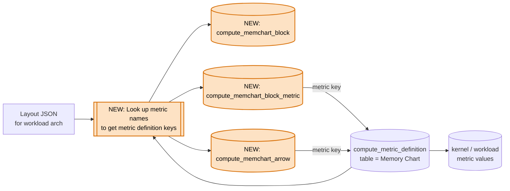

# HLD: Memory chart structure in the analysis database

## System Context

### Memory chart

`rocprof-compute analyze` draws a memory chart (panel 3) in the terminal. It is a diagram
of the GPU memory hierarchy:

- **Blocks** such as Compute Units, L1/L2 caches, Data Fabric and HBM. Each block shows
  its own metrics.
- **Arrows** between blocks. Each arrow shows a request or bandwidth metric for the
  connection between the two blocks.

Each architecture family (gfx90x, gfx94x, gfx950, gfx115x, gfx1250) has a layout JSON file
that describes its chart:

| Element | Fields |
|---|---|
| Block | id, title, grid column and order, position (in the grid, above or below it), optional child blocks |
| Block metric | metric name, label, category (read, write, atomic, hit, util, stall, bw, info) |
| Arrow | source and destination block, direction, metric name, label, category, group label |

Metrics are referred to by their display name, e.g. "Wavefront Occupancy". The names come
from the Memory Chart panel config (panel 300) of the same rocprof-compute version.

### Analysis database

`rocprof-compute analyze --output-format db` writes the analysis to a SQLite file. Optiq, a
separate visualization tool, reads this file. In the current schema (2.3.0):

- A db holds one or more workloads, each with its GPU architecture.
- Each workload has its own metric definitions (`compute_metric_definition`): an integer
  key, name, unit and table. Kernel and workload values point to that key. A definition is
  only added when the metric has at least one value.
- The memory chart's metrics (definitions and values) are already in the db, but most have
  no unit. The gfx9 panel 300 configs have no unit column, and gfx115x and gfx1250 leave
  the Compute Units metrics without one. The terminal chart gets its units from the layout
  files and from hardcoded rules instead.
- `--output-format csv` exports the SQL views over these tables.
- `compute_metadata` records a schema version (major.minor.patch), but nothing says when to
  bump which part. Breaking changes have shipped as minor bumps: 1.3.0 renamed two tables,
  and 2.2.0 removed a column. A later change renamed two view columns with no bump at all.
  So a reader can't use the version to tell whether it can still read a db.

**Missing:** the chart itself. Nothing says which blocks exist, how they connect, or which
metric belongs to which block or arrow.

## Problem statement

Today Optiq hardcodes the chart. If we gave Optiq the layout JSON files instead, it would
still have to match each layout entry to a db value by metric name or ID. Both can change
between rocprof-compute versions:

- The layout from version A maps ID 1 (or the name "A") to metric A.
- A db from version B stores metric B under ID 1, or renames "A".
- Optiq shows metric B's value under metric A's label, with no error.

Impact:

- Users can see wrong numbers without knowing it. Every layout or panel change adds to the
  risk.
- Optiq has to follow rocprof-compute's layout and metric changes in every release.

Storing the chart in the db turns the db schema into Optiq's contract. That contract is only
stable if the schema version tells Optiq when a db has changed in a way it can't read.

## Requirements

### Functional

- **FR1:** For each workload, the db stores the chart for that workload's architecture:
  blocks, which blocks sit inside others, and arrows.
- **FR2:** Every block metric and arrow points to the workload's metric definition by key.
  Optiq never matches names.
- **FR3:** The db stores what is in the chart, not how to draw it. Number formats, unit
  conversions and sizes are up to Optiq.
- **FR4:** Values and units are not stored twice. Optiq reads them from the existing
  tables.
- **FR5:** The schema version follows written rules, so Optiq can tell from the version
  alone whether it can read a db.

### Non-functional

- **Links match the values:** the same rocprof-compute run writes both the links and the
  values.
- **Existing tables don't change:** only new tables are added, so current readers of the db
  keep working. Schema version 2.3.0 → 2.4.0.
- **Small:** under 100 rows per workload. The largest layout, gfx1250, has 15 blocks, 34
  block metrics and 37 arrows.

## Design

The db writer already adds each workload's metric definitions. Right after that, it:

1. loads the layout for the workload's architecture,
2. looks up each metric name in that workload's Memory Chart metric definitions, and adds
   the definition if it is missing (the metric had no value),
3. writes the result to three new tables.

So every block metric and arrow always has a metric key.

Every panel 300 metric, on every architecture, also gets a unit in its panel config, so
`compute_metric_definition.unit` is always filled for the chart. The units reuse strings
that other panels already use, e.g. `Percent`, `Bytes/s` and `(Requests + $normUnit)`.

Orange nodes marked NEW are added by this design. The other nodes already exist.

### New tables

| Table | One row per | Columns |
|---|---|---|
| `compute_memchart_block` | block | key, workload, block id (e.g. `l2`), title, column, order, position (`grid` / `above` / `below`), parent block (empty if none) |
| `compute_memchart_block_metric` | metric in a block | key, block, metric definition key, label, category, order |
| `compute_memchart_arrow` | arrow | key, workload, source block, destination block, direction (`forward` / `backward` / `both`), metric definition key, label, category, group label, order |

Block ids are unique within a workload. To draw the chart, Optiq reads a workload's blocks
and arrows. It then follows each metric key to the value and to the metric definition (for
the unit).

### Schema version rules

These rules apply to the whole analysis db schema, not just the new tables:

| Bump | When | Examples |
|---|---|---|
| Major | A reader of the previous version can break: a table or column is removed or renamed, a column's meaning changes, or a fixed value set gains a value | 1.3.0's table renames and 2.2.0's removed column should have been major bumps |
| Minor | Only additions a reader can ignore: new tables, columns or views | This design: 2.3.0 → 2.4.0 |
| Patch | No change to tables, columns or value sets | A fix to how a value is computed |

**Fixed value sets** are the documented values of `position` (`grid` / `above` / `below`),
`direction` (`forward` / `backward` / `both`) and `category` (`read` / `write` / `atomic` /
`hit` / `util` / `stall` / `bw` / `info`). Optiq draws differently for each value, so a new
value is a major change. The layout validator checks layouts against the same sets.

**Optiq's side:** read `compute_metadata.schema_version`. Accept any minor or patch version of
a major version it knows, and refuse or warn on a major version it doesn't know.

**What is not part of the contract:** the chart's content. Blocks, arrows and metrics can be
added, removed or renamed in any release, because Optiq draws whatever rows the db holds.
For the same reason, Optiq must not depend on block ids, labels or metric names.

### Decisions

| # | Chosen | Rejected | Why |
|---|---|---|---|
| 1 | Separate tables, one row per block, block metric and arrow | The whole layout JSON in one text column, like system info | Metric links become foreign keys: SQLite checks them, and plain SQL can join them. JSON columns in this schema only hold data that nothing links to. |
| 2 | Store the metric definition key, looked up when the db is written | Store the metric name and let Optiq match it | Optiq matching names is the problem we are fixing. Matching inside rocprof-compute is safe: the layout, panel config and definitions all come from the same version, and today every layout name matches exactly one Memory Chart metric. |
| 3 | One chart per workload, for its own architecture | All layouts once per db | A layout for an architecture with no workload has no metric rows to point to. Cost: workloads on the same architecture repeat the rows (under 100 each). |
| 4 | Only what is in the chart | Formatted values, sizes, a "panel kind" field | Optiq does its own formatting and drawing. Raw values and units are already stored. The panel style follows from the block's column and its metric categories. |
| 5 | No view, not in the CSV export | Add a view | A list of blocks and arrows isn't useful as a flat CSV. Optiq reads the tables directly. |
| 6 | Add a missing metric definition, with no values | Store the row with an empty metric key, or skip the row | The chart always has the same blocks and arrows as the layout, and Optiq never handles an empty key. A metric with no value simply shows no value. |
| 7 | Skip the chart when `-b` leaves out any of its metrics | Write the chart anyway, loading its metrics separately | The db only holds what the user asked to analyze. |
| 8 | Written version rules, with tests that catch unplanned schema changes | Keep bumping versions by habit | Past minor bumps broke readers. Optiq needs a version it can trust to know when to stop reading. |
| 9 | Add a unit to every panel 300 metric in its config | Store units in the layouts and the new tables | Units stay in one place (FR4), and the CLI metric tables gain them too. A unit test fails if a panel 300 metric has no unit. |

### Out of scope

- **Memory bandwidth stall notes.** How to put them in the db is still open in
  `hld-membw-guided-analysis-in-memchart.md`, to decide with the Optiq team.
- **Changes to the terminal chart.**

## Implementation phases

1. **Schema and writer:** add the three tables, fill them for each workload, give every
   panel 300 metric a unit, set the schema version to 2.4.0, and regenerate the schema
   diagrams. Optiq can start reading the chart
   from the db.
2. **Documentation:** describe the new tables in the analyze db docs, with an example query
   that builds one workload's chart with its values.
3. **Version rules:** write the rules in the analyze db docs and CONTRIBUTING.md, and add the
   guard tests below. Optiq can then rely on the version.

## Validation, security and debuggability

- **Unit tests,** for every architecture:
  - the tables have the same blocks, nesting and arrows as the layout;
  - every metric key points to a Memory Chart definition of the same workload.
- **Integration test:** profile a workload in rocpd format, run `analyze --output-format db`,
  and check with SQL that the values match the terminal memory chart.
- **Unit test for a metric with no value:** its definition is still added, and its block
  metric or arrow points to it.
- **Layout names not in the panel config:** existing unit tests already fail if a layout
  names a metric that panel 300 doesn't have, so this can't ship.
- **Guard for the version rules:**
  - a checked-in snapshot of every table, column, key, view and value set, which also
    gives Optiq the contract in a file it can read;
  - a unit test fails while the snapshot doesn't match the code;
  - the tool that rewrites the snapshot works out whether the change needs a major or
    minor bump, and refuses if the version bump is smaller;
  - a unit test checks that every layout uses only the documented values.
- **Units:** a unit test fails if any panel 300 metric, on any architecture, has no unit.
- **Security:** no new inputs. The layouts ship with the tool.

## Open questions

1. **Scope of the version rules:** they cover the whole analysis db, not just the memory
   chart. Does the team agree to apply them to every future schema change?
