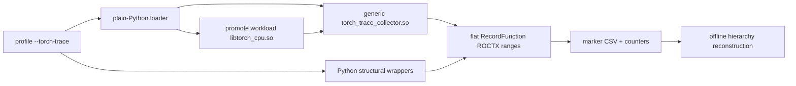

# Torch Trace Collector

## System context

`--torch-trace` attributes GPU kernel counters to PyTorch operations.

Two producers emit ROCTX ranges in the workload process:

- Python wrappers identify structural calls such as
  `nn.Module.<Class>.forward`, distributed collectives, and tensor methods.
- A C++ RecordFunction callback observes ATen and autograd operations on every
  thread, including autograd worker threads that Python dispatch cannot see.

Each producer emits one flat range per operation. The marker contains the
operation name, source context when available, sequence number, current and
forward thread identifiers, Python launcher thread identifier, RecordFunction
scope, captured arguments, and backend. The offline PyTorch hierarchy analysis
reconstructs the hierarchy from the recorded range intervals and correlation
fields. The collector does not keep a runtime call tree or a forward-snapshot
store. That consumer is implemented by stacked PR #11830 and is not part of
this producer/build worktree.

**In scope:** PyTorch eager and autograd operations, structural Python ranges,
argument metadata, and the marker fields needed by offline analysis.

**Out of scope:** non-Python workloads and arbitrary self-built PyTorch
binaries. Native collection is enabled only for exact artifacts that have
passed the validation matrix and been allowlisted; other builds use the Python
fallback.

---

## Requirements

The producer must:

- observe RecordFunction operations on all execution threads;
- preserve the argument names, tensor shapes, dtypes, TensorList rendering,
  limits, escaping, and marker format introduced by the original collector;
- emit flat per-operation intervals for offline hierarchy reconstruction;
- expose a plain C interface loaded through `ctypes`, with no Python ABI
  dependency;
- build without an installed PyTorch and without generated PyTorch headers;
- fail closed to `TorchDispatchMode` when the collector or runtime is not an
  exact validated match; and
- never throw an exception through PyTorch's callback boundary.

---

## Design

### Decision 1: RecordFunction plus Python wrappers

| Option | Benefit | Limitation |
| --- | --- | --- |
| `TorchDispatchMode` only | Pure Python | Misses autograd worker operations and omits native schema names, non-tensor values, and TensorList contents |
| RecordFunction only | Covers all threads and sequence metadata | Does not name structural Python calls |
| **RecordFunction plus wrappers** | **Covers both surfaces** | Two producers must share one wire format |

When the native collector installs, ATen operations use RecordFunction and the
Python dispatcher mode stays off. If native installation fails, the loader
warns and enables `TorchDispatchMode`; structural wrappers remain enabled in
both cases.

### Decision 2: Flat producer, offline hierarchy

The collector emits the current operation only. It does not copy a Python call
stack or join forward and backward stacks in the workload process. Python
backward/grad wrappers publish only their launcher OS thread ID through
`ThreadLocalDebugInfo`, which PyTorch propagates to autograd workers. The
`seqNr`, `tid`, `ftid`, `ltid`, and `scope` fields preserve the information
needed by offline analysis to correlate events and reconstruct nesting. This
avoids maintaining runtime tree or snapshot state, bounds the captured argument
payload, and aligns the producer with the offline analysis design.

`tid` and `ftid` are PyTorch logical thread IDs. `ltid` is the launcher's native
operating-system thread ID, so consumers must treat it as a separate ID
namespace rather than comparing it directly with `tid` or `ftid`.

### Decision 3: One generic, temporary ABI shim

The build produces one `torch_trace_collector.so`. A small handwritten adapter
contains only the PyTorch declarations and measured layout facts needed by the
callback and argument capture. It uses exported ATen/c10 functions plus
PyTorch's stable AOTI C functions for tensor metadata.

This avoids an installed PyTorch at build time, generated header closures,
per-version collector sources, and Python-version-specific filenames. It is a
temporary compatibility shim, not a claim that private ATen/c10 layouts are a
stable ABI.

### Decision 4: Exact runtime gates

The Python loader first checks an exact wheel identity: version/build tag,
Torch git revision, debug-build flag, and libstdc++ ABI mode. It then reopens
the workload's real `libtorch_cpu.so` with
`RTLD_GLOBAL | RTLD_LAZY | RTLD_NODELETE` and loads the collector locally with
`RTLD_NOW | RTLD_NODELETE`.

Before callback registration, the native collector independently checks the
providers of `aoti_torch_abi_version` and `ThreadLocalDebugInfo::get` using the
GNU build IDs of both `libtorch_cpu.so` and `libc10.so`, together with the AOTI
ABI version. Unknown, mismatched, or malformed identities fail closed. A
separate C ABI revision handshake prevents a mismatched Python loader and
collector interface.

Runtime promotion intentionally exposes Torch symbols process-wide. Keeping
both handles nodelete is required because PyTorch retains callback pointers for
the lifetime of the process.

---

## Validation and maintenance

- The collector must build without Torch headers or Torch libraries.
- ELF checks enforce the generic filename, four exported C functions, the 31
  expected unresolved Torch/c10 imports, no Torch/Python `DT_NEEDED`, and no
  RPATH/RUNPATH.
- Torch-free Python and C++ golden tests enforce the shared escaping, field
  order, truncation, required-size, and null-termination rules.
- An isolated runtime check uses a test-only ROCTX interceptor to prove that an
  allowlisted wheel takes the native path and emits balanced forward and
  backward markers with the required argument and correlation fields.
- Every allowlisted build must pass the full schema-name sweep, argument and
  marker goldens, concurrency tests, and sanitizer tests.
- Matching ROCm/PyTorch wheels must pass GPU-resident tensor, autograd,
  end-to-end CSV, and overhead tests on MI300X before release.
- Adding a supported build requires updating both the wheel identity gate and
  native build-ID evidence as applicable. Standalone CPU libtorch archives used
  for native validation do not belong in the wheel-only Python allowlist.

---

## Known temporary limitations

- RecordFunction, IValue, OperatorHandle, and callback layouts are private
  PyTorch implementation details. Exact build allowlisting reduces accidental
  mismatch risk but cannot make those accesses formally supported.
- Launcher-thread propagation crosses the private c10 C++ ABI through
  `DebugInfoKind`, `DebugInfoBase`, and `std::shared_ptr`.
- TensorList output is capped at eight values, but the exported
  `IValue::visit()` implementation still traverses the complete list.
- Argument names are parsed from the diagnostic `OperatorEntry::dumpState()`
  text because exported schema accessors do not expose the required traversal
  without more private layouts.
- Runtime symbol promotion is process-wide and cannot be undone.
- Launcher thread IDs are process-local. Stacked PR #11830 currently uses the
  full marker string as its cross-pass key; that consumer must exclude `ltid`
  from cross-pass identity while retaining it for within-pass
  worker-to-launcher attachment.

The long-term replacement is a PyTorch/SDK-provided stable helper exposing
RecordFunction inputs, IValue kinds, borrowed tensor conversion, bounded
TensorList access, schema argument names, and launcher correlation. The plain C
boundary and behavior goldens remain valid when that helper replaces the
handwritten internals.
