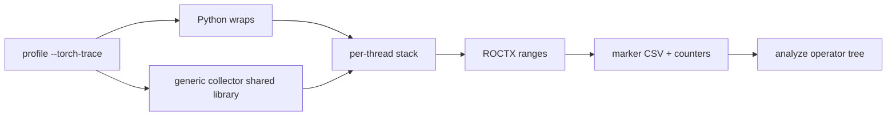

# Torch Trace Collector

## System Context

`--torch-trace` attributes GPU kernel counters to PyTorch operators.

- Profile mode does not name the operator that launched the GPU work.
- `--torch-trace` emits ROCTX ranges around operators. Analyze joins those
  ranges to kernel counters (`--list-torch-operators`, `--torch-operator`).
- This HLD is the C++ `RecordFunction` collector that `--torch-trace` loads
  into the workload.

Surrounding pieces:

- Python wraps replace a Python API so each call pushes a named frame onto
  the per-thread stack and pops it on return. The frame includes a source
  location. Wraps run only on the Python thread. The wrap set does not
  change when the collector loads. With the collector, wrap frames share
  the collector stack; without it they go to the Python ROCTX path.
- `TorchDispatchMode` can emit ATen ranges on the Python thread only.
  Autograd workers run backward in C++ and never enter that context.
- RecordFunction runs on every thread that executes an op and sees the
  sequence numbers used to join backward ops to their forward calls.

Each thread holds a stack of frames (operator name and source context). On
each push the collector formats the full stack into one ROCTX range. The
profiler records those ranges for analyze.

**In scope:** operator ranges for PyTorch eager and autograd on every thread;
structural Python frames in the same hierarchy; Inductor kernels launched
through the static launcher; analyze join on the existing marker CSV.

**Out of scope:** non-Python workloads and arbitrary self-built PyTorch
binaries. The native collector is enabled only for exact PyTorch builds that
have passed compatibility validation; other builds use the Python fallback.

**Assumptions:**

- Autograd copies PyTorch per-thread debug info onto the worker task.
- Sequence number is the join key between a forward op and its backward op.

---

## Problem statement

- Counters are kernel-scoped. Users profiling PyTorch workloads cannot tell
  which operator produced a kernel.
- Python instrumentation is thread-local. `TorchDispatchMode` and structural
  wraps (`nn.Module`, `Tensor.backward`) run only on the Python thread.
  Autograd workers never see them, so backward kernels are unmarked or lack
  the forward operator chain.

---

## Requirements

What the system shall do:

- Nested ROCTX ranges around ATen operators on every thread that runs them,
  including autograd workers.
- A backward operator range includes the matching forward operator chain when
  PyTorch provides a sequence number.
- Python structural frames (`nn.Module`, `Tensor.backward`) appear in the
  same range as nested ATen ops.
- Marker strings remain compatible with existing analyze: split `Function`
  on `:#`; optional `|backend` moved to a `Backend` column.
- A workload whose exact PyTorch and native-library identities are not
  validated uses `TorchDispatchMode` after a warning.

Non-functional:

- RecordFunction callbacks must not throw into PyTorch.
- The collector is a prebuilt shared library. Profile does not compile it.
- Every build produces the collector without requiring a PyTorch installation.

---

## Design

Two producers share one per-thread stack. Each ROCTX range is the full stack.

### Decision 1: Where to hook ATen

| Option | Pros | Cons |
| --- | --- | --- |
| `TorchDispatchMode` only | Pure Python | Misses autograd workers |
| `RecordFunction` only | Every thread, sequence numbers | Does not name `nn.Module.forward` |
| **RecordFunction and wraps (chosen)** | **Workers, sequence numbers, module names** | Two producers to keep consistent |

- RecordFunction is a C++ hook. The collector is a shared library loaded into the
  workload interpreter.
- Python wraps push frames for entry points ATen does not name.
- When the collector is loaded, ATen ops use the callback only
  (`TorchDispatchMode` is off).
- If the shared library fails to install, profile falls back to
  `TorchDispatchMode` and warns.
- An unvalidated PyTorch build also warns and uses `TorchDispatchMode`.
- This collector needs two wraps: module forward
  (`nn.Module.{Class}.forward`) and `Tensor.backward`.
- The rest of the wrap surface is leftover from the Python tracer
  (see the LLD).

### Decision 2: How backward joins forward

**Snapshot store keyed by `(seqNr, thread id)` : Join while the forward stack still exists using a Process-wide map

- A snapshot is the entire stack at a forward op with a sequence number.
- The forward thread pushes it under `(seqNr, thread id)` in a
  process-wide snapshot store.
- The backward thread reads (pops) the matching entry using the sequence
  number and the forward thread id PyTorch provides, and pushes frames it
  does not already have.
- Autograd does not copy this stack through debug info.
- Name matching is not used: several ops can share a name; seqNr is the
  ATen correlation id.

### Decision 3: How the C++ callback is shipped

| Option | Pros | Cons |
| --- | --- | --- |
| Compile at profile time | Matches any Torch | Slow first run; extra toolchain in the user env |
| Link into the native tool `.so` | One artifact | Wrong load path: the callback must live in the Python process |
| Build against each supported PyTorch | Uses upstream headers directly | PyTorch must exist before rocprofiler-compute and produces version-specific artifacts |
| **Prebuilt generic `torch_trace_collector.so` (chosen)** | **One artifact, built and packaged without PyTorch** | Requires strict runtime compatibility gates for the private C++ ABI |

- The collector is always built as C++17 using local declarations for the
  minimal RecordFunction and thread-local-debug-info surface it needs. It does
  not consume PyTorch or Python headers and does not link their libraries.
- The artifact has no Torch-version or Python-SOABI suffix. Python loads its
  plain-C interface through `ctypes`.
- The loader checks the exact Torch version/build tag, Git revision, debug
  flag, and libstdc++ ABI mode. Before callback registration, the collector
  also verifies the paired GNU build IDs of the loaded `libtorch_cpu.so` and
  `libc10.so`.
- Unknown or mismatched identities fail closed to `TorchDispatchMode`. Adding
  support for another build requires validating it and extending both gates;
  it does not require another collector artifact.

---

## Implementation
Details: `lld-torch-trace-collector.md`.

---

## Validation, security and debuggability

- Profile/analyze tests for `--torch-trace` output and operator listing.
- Build, install, and package tests run without PyTorch installed and verify
  that the generic collector is present.
- Loader and native tests cover exact-identity acceptance, mismatched-library
  rejection, and warning-based fallback without registering a callback.

---

## Open questions

| Item | Notes |
| --- | --- |
| Inductor static launcher | Those kernels launch without Triton's Python entry point now, so they appear as torch ranges. Direct Triton launches are `--triton-trace`. |
| Offline correlation | Encode `seqNr` and PyTorch thread ids in the ROCTX string, larger payload to `roctxRangePushA`. Analyze splices the worker leaf to the matching forward nest (main thread, same `seqNr`). No snapshot store. We may still need overlay to append `Tensor.backward` wrap range (also a main-thread write; no `seqNr`).|
| Further Torch versions | Each exact build needs validation and entries in the Python identity and paired native-library build-ID gates. The generic artifact is unchanged. |
| DispatchMode fallback | Missing, unvalidated, mismatched, or failed native collectors warn and use the reduced Python path. |
