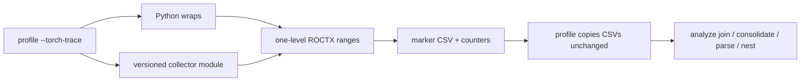

# Torch Trace Collector

## System Context

`--torch-trace` attributes GPU kernel counters to PyTorch operators.

- Profile mode does not name the operator that launched the GPU work.
- `--torch-trace` emits one-level ROCTX ranges around operators. Profile copies
  the marker CSVs unchanged. Analyze joins those ranges to kernel counters
  (`--list-torch-operators`, `--torch-operator`).
- This HLD is the C++ `RecordFunction` collector that `--torch-trace` loads
  into the workload, plus the analyze path that reconstructs the call tree.

Surrounding pieces:

- Python wraps replace a Python API so each call pushes one named ROCTX range
  and pops it on return. The range includes a source location. Wraps run only
  on the Python thread.
- `TorchDispatchMode` can emit ATen ranges on the Python thread only.
  Autograd workers run backward in C++ and never enter that context.
- RecordFunction runs on every thread that executes an op. Each callback
  pushes one range. Location is `n/a`; `seqNr`, PyTorch `tid`, and `ftid`
  are on the wire.

**In scope:** one-level operator ranges for PyTorch eager and autograd on every
thread; structural Python frames as their own ranges; Inductor kernels launched
through the static launcher; analyze full-outer-join / consolidate / parse /
nest on the copied marker CSVs.

**Out of scope:** non-Python workloads; PyTorch versions other than 2.13 and
2.14.

**Assumptions:**

- Open parent ranges on the same OS thread nest in time. Analyze reconstructs
  that nest; the Function string is not a stacked path.
- `seqNr` is stored on RecordFunction ranges. Analyze does not stitch or nest
  on `seqNr`.

---

## Problem statement

- Counters are kernel-scoped. Users profiling PyTorch workloads cannot tell
  which operator produced a kernel.
- Python instrumentation is thread-local. `TorchDispatchMode` and structural
  wraps (`nn.Module`, `Tensor.backward`) run only on the Python thread.
  Autograd workers never see them, so backward kernels would be unmarked
  without a C++ hook.
- A stacked Function string (`marker1/.../markerN`) cannot represent
  independently opened ranges. Profile emits one level per range; analyze
  must rebuild the tree.

---

## Requirements

What the system shall do:

- One-level ROCTX ranges around ATen operators on every thread that runs them,
  including autograd workers.
- Python structural frames (`nn.Module`, `Tensor.backward`, and the rest of the
  wrap surface) as their own ranges with a user `file:line` when a user frame
  exists.
- Marker strings of the form
  `{encoded_name}:{location}|seqNr=|tid=|ftid=|scope=|args=[|backend]`.
  `encode_marker_name` percent-encodes only `/` and `%` in the name token.
- Profile copies marker CSVs unchanged. Analyze parses Function after
  consolidating passes.
- `Backend` is the trailing `|torch` / `|triton` on Function, or `user` when
  that suffix is absent (user-defined ROCTX ranges).
- A workload PyTorch version with no matching collector module fails with a
  list of supported versions.

Non-functional:

- RecordFunction callbacks must not throw into PyTorch.
- The collector is a prebuilt module. Profile does not compile it.

---

## Design

Two producers each push one-level ROCTX ranges. Analyze reconstructs the tree.

### Decision 1: Where to hook ATen

| Option | Pros | Cons |
| --- | --- | --- |
| `TorchDispatchMode` only | Pure Python | Misses autograd workers |
| `RecordFunction` only | Every thread, sequence numbers | Does not name `nn.Module.forward` |
| **RecordFunction and wraps (chosen)** | **Workers, sequence numbers, module names** | Two producers to keep consistent |

- RecordFunction is a C++ hook. The collector is a module loaded into the
  workload interpreter.
- Python wraps push ranges for entry points ATen does not name.
- When the collector is loaded, ATen ops use the callback only
  (`TorchDispatchMode` is off).
- If the module fails to install, profile falls back to
  `TorchDispatchMode` and warns.
- An unsupported PyTorch version is an error, not a fallback.

### Decision 2: How the call tree is built

**One-level ranges; analyze nests by `Thread_Id` timestamps (chosen).** Not a
process-wide snapshot store, and not a seqNr splice of a worker leaf onto the
forward nest.

| Option | Pros | Cons |
| --- | --- | --- |
| Snapshot / overlay at profile time | Worker range already has the forward chain | Extra process-wide map; stacked Function names |
| SeqNr splice in analyze | No snapshot store | Stitch key would depend on `seqNr`; worker and forward are different `Thread_Id`s |
| **One-level ranges + timestamp nest (chosen)** | **Wire matches open ROCTX ranges; nest is per OS thread** | Worker roots have no Python `file:line` |

- Profile copies marker CSVs unchanged.
- `--list-*-operators` / `--*-operator` full-outer-join each pass on
  `Correlation_ID` (plus `GUID` when both files have that column), consolidate
  matching operator calls, parse Function, then nest marker intervals per
  `Thread_Id`.
- The across-pass stitch key is Function with `|seqNr=`, `|tid=`, and `|ftid=`
  stripped, plus `function_ordinal`. `Correlation_ID` is the per-pass join key
  only.
- Those flags fail after join with `UnaccountedKernelError` when a kernel's
  `Correlation_ID` is not in the marker CSV. Plain analyze without those flags
  does not join and does not raise that error.
- Two markers on the same `Thread_Id` whose intervals overlap (neither nested
  nor adjacent) fail nest with `OverlappingMarkerRangeError`.
- Adjacent ranges (`A.end == B.start`) are siblings.

### Decision 3: How the C++ callback is shipped

| Option | Pros | Cons |
| --- | --- | --- |
| Compile at profile time | Matches any Torch | Slow first run; extra toolchain in the user env |
| Link into the native tool `.so` | One artifact | Wrong load path: the callback must live in the Python process |
| **Prebuilt `torch_trace_collector-<version>.so` (chosen)** | **No compile at profile time** | One artifact per supported Torch |

- Build finds Torch at `$ROCM_PATH/../torch`.
- The loader selects the artifact whose version matches the workload
  Torch version.

---

## Implementation
Details: `lld-torch-trace-collector.md`.

---

## Validation, security and debuggability

- Profile tests for `--torch-trace` marker and counter CSVs.
- Analyze tests for parse, join, consolidate, nest, and operator list/filter.

---

## Open questions

| Item | Notes |
| --- | --- |
| Inductor static launcher | Those kernels launch without Triton's Python entry point now, so they appear as torch ranges. Direct Triton launches are `--triton-trace`. |
| Further Torch versions | Each new version needs a built artifact and a CMake version gate. |
| DispatchMode fallback | Unsupported version is fatal; install failures fall back. Whether fallback should remain is not settled. |
