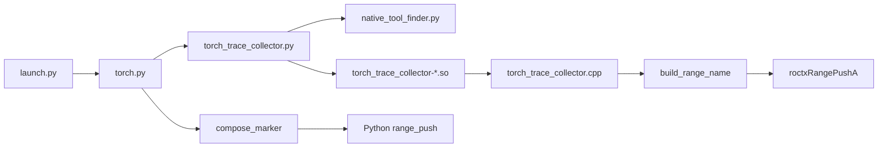
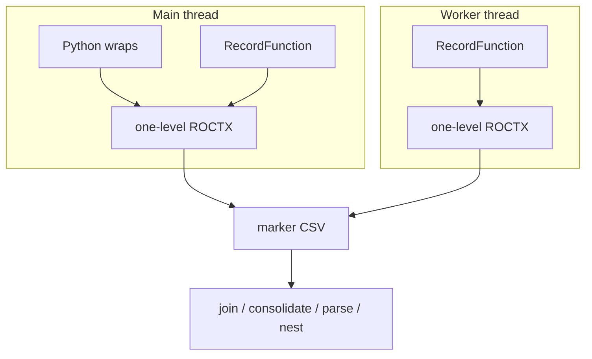

# LLD: torch_trace_collector

## Motivation

Implementation of the RecordFunction collector in `hld-torch-trace-collector.md`.

---

## Code flow

The wrap set lives in `torch.py` and does not change when the collector loads.
Each wrap and each RecordFunction callback emits one range.

---

## Threading

How workers see Python scopes:

- Worker RecordFunction sees ATen and autograd names
  (`evaluate_function`, `AddmmBackward0`). It does not see Python wraps.
- The worker never runs those wraps. There is no snapshot store and no overlay
  of the forward nest onto the worker.
- `Tensor.backward` is a wrap on the Python thread. The matching backward op
  on an autograd worker is a separate one-level range on that worker's
  `Thread_Id`, with location `n/a`.
- Analyze nests independently per `Thread_Id`. A torch/triton worker root with
  empty file/line and no ancestor that has a source location fails nest with
  `MissingSourceLocationError`.

- RecordFunction callbacks are process-wide (`addGlobalCallback`).
- Python wraps are thread-local push/pop of ROCTX ranges.

---

## RecordFunction start and end

`torch_trace_collector.cpp`:

1. Read the RecordFunction name (`<anonymous>` if empty).
2. `build_range_name` with location `n/a`, `seqNr` from `RecordFunction.seqNr()`
   (`n/a` when negative), `tid` from `currentThreadId()`, `ftid` from
   `forwardThreadId()`, the RecordFunction scope name, captured args, and
   backend `torch`.
3. `roctxRangePushA` of that string. `end_cb` pops if the push succeeded.

Callbacks must not throw into PyTorch.

---

## Wire format

`wire_format.h` / `compose_marker`:

- Each ROCTX range name is one level:
  `{encoded_name}:{location}|seqNr=|tid=|ftid=|scope=|args=[|backend]`.
- `encode_marker_name` percent-encodes only `/` (`%2F`) and `%` (`%25`) in the
  name token. Location is not encoded.
- RecordFunction ranges append `|torch`. Python wraps append `|torch` or
  `|triton`. User-defined ROCTX ranges have no suffix.
- Profile copies marker CSVs unchanged. Analyze parses Function after
  consolidating passes.
- `Backend` is the trailing `|torch` / `|triton` on Function, or `user` when
  that suffix is absent.
- The across-pass stitch key is Function with `|seqNr=`, `|tid=`, and `|ftid=`
  stripped, plus `function_ordinal`. `Correlation_ID` is the per-pass join key
  only.

---

## Analyze path

`--list-*-operators` / `--*-operator`:

1. Pair each `ml_api_trace_*_marker_api_trace.csv` with its sibling
   `_counter_collection.csv`.
2. Full-outer-join unique dispatches to markers on `Correlation_ID` (plus
   `GUID` when both files have that column).
3. Fail with `UnaccountedKernelError` when a kernel's `Correlation_ID` is not
   in the marker CSV. Plain analyze without those flags does not join and does
   not raise that error.
4. Consolidate matching operator calls across passes on the stitch key plus
   `function_ordinal`.
5. Parse Function into name, file/line, `T_Tid`, `F_Tid`, `Backend`.
6. Nest marker intervals per `Thread_Id`. Two markers on the same
   `Thread_Id` whose intervals overlap (neither nested nor adjacent) fail
   nest with `OverlappingMarkerRangeError`.

---

## Build and load

- `src/lib/torch_trace_collector/CMakeLists.txt` skips the build when PyTorch is
  missing or unsupported. CMake looks for the PyTorch install in the `torch`
  directory beside `$ROCM_PATH` (sibling of the ROCm prefix).
- The version comes from `TORCH_VERSION_MAJOR` and `TORCH_VERSION_MINOR` in the
  PyTorch headers, not `find_package(Torch)`, and must be 2.13 or 2.14.
- CMake names the artifact `torch_trace_collector-<major>.<minor>.so`. Install
  destination is `${CMAKE_INSTALL_LIBDIR}/rocprofiler-compute` (`lib` or
  `lib64`).
- `torch_trace_collector.py` keys on the workload PyTorch major and minor
  version, from `Version(torch.__version__).release[:2]`.

Search is rooted at the executing Python package (checkout: `src/`; install:
`<prefix>/libexec/rocprofiler-compute/`). Order, via `find_prebuilt_artifacts`
in `native_tool_finder.py`:

1. `<package_root>/../../lib*/rocprofiler-compute/torch_trace_collector-*.so`
2. `<package_root>/../build/lib`
3. `<package_root>/lib/_build/lib`

First unique resolved path per version wins. Install is scanned first, so a
packaged `.so` beats a source build **in the same process**. Run the in-tree
`rocprof-compute` (package root `src/`) to use a source build; the install glob
then does not see `/opt/rocm`.

---

## Tests

- `tests/integration/test_profile_torch_trace.py`: verifies end-to-end
  `--torch-trace` marker and counter CSVs on a sample workload.
- `tests/unit/utils/test_utils_analysis.py`: verifies Function parse and
  `Thread_Id` interval nest.
- `tests/integration/test_analyze_roctx_call_trees.py`: verifies operator
  list/filter on copied marker/counter pairs.
