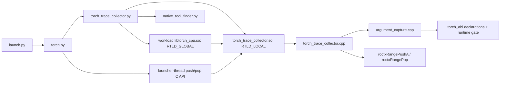

# LLD: `torch_trace_collector`

## Purpose

This document describes the native RecordFunction producer selected in
`hld-torch-trace-collector.md`. The producer emits flat ROCTX events. A separate
offline-analysis component reconstructs the hierarchy; the producer does not.

---

## Code flow



Python structural wrappers continue to emit their own ranges. When the native
collector installs, `TorchDispatchMode` is not enabled, avoiding duplicate ATen
events. A failure at any loader or native compatibility check selects the
existing Python fallback.

---

## Plain C boundary and lifetime

`torch_trace_collector.h` exports exactly four functions:

```c
uint32_t torch_trace_collector_abi_revision(void);
int torch_trace_collector_install(void);
int torch_trace_collector_push_launcher_tid(uint64_t launcher_tid);
int torch_trace_collector_pop_launcher_tid(void);
```

The revision function identifies this loader-facing C contract. `install()` is
thread-safe and idempotent, checks native runtime compatibility, then registers
one process-global callback. The push/pop pair publishes a nested launcher OS
thread ID through PyTorch thread-local debug information around backward and
grad entry points. Zero means success. The loader retains the collector and
promoted Torch handles with `RTLD_NODELETE` because PyTorch keeps callback
pointers until process exit; there is intentionally no uninstall API.

Exception-capable start/capture/install paths catch failures before they cross
the PyTorch or C boundary; the end callback and revision query are inherently
non-throwing. A failed install returns nonzero and causes `TorchDispatchMode`
fallback.

---

## Build and dynamic loading

`src/lib/torch_trace_collector/CMakeLists.txt` requires C++17 and
`rocprofiler-sdk-roctx`, but no PyTorch installation, headers, or libraries. It
builds one module named `torch_trace_collector.so`, without a Torch-version or
Python-SOABI suffix. An ELF version script exports only the four C functions.
The module has exactly 31 intentional unresolved Torch/c10 imports, no Torch,
c10, or Python `DT_NEEDED` entry, and no build or install RPATH.

The Python loader:

1. Reads the workload's full Torch version/build tag, git revision,
   `torch.version.debug`, and `_GLIBCXX_USE_CXX11_ABI` value.
2. Rejects identities not in the exact validated-wheel allowlist.
3. Finds the generic collector with `find_prebuilt_artifacts`.
4. Reopens the workload's own `libtorch_cpu.so` with
   `RTLD_GLOBAL | RTLD_LAZY | RTLD_NODELETE` so the collector's unresolved
   Torch imports can resolve.
5. Loads the collector with `RTLD_LOCAL | RTLD_NOW | RTLD_NODELETE`.
6. Verifies `torch_trace_collector_abi_revision()` and binds all four C entry
   points before calling `install()`.

The Python allowlist is intentionally wheel-only. The native allowlist also
contains standalone CPU libtorch archives used by direct C++ validation
harnesses, so the lists are not expected to have the same number of entries.

---

## Native runtime gate

`torch_abi/runtime.cpp` resolves `aoti_torch_abi_version` and
`ThreadLocalDebugInfo::get` from the global namespace and locates the mapped
objects that provide them with `dl_iterate_phdr`. It reads both providers'
mapped GNU build-ID notes and accepts only a `(libtorch_cpu build ID, libc10
build ID, AOTI ABI version)` tuple listed in `torch_abi.h`.

The build ID is the authoritative identity for the private layouts used by the
native code. Missing symbols, malformed or unmapped notes, unknown build IDs,
and AOTI-version mismatches all fail before callback registration. This is an
accidental-compatibility guard, not a security signature.

---

## ABI adapter

The `torch_abi/` directory declares the smallest C++ surface needed to call
exported functions and records measured sizes, alignments, offsets, enum tags,
and callback layout. `argument_capture.cpp` keeps these PyTorch-specific types
and ownership rules behind a private typed C++ helper:

```cpp
std::size_t capture_args(const at::RecordFunction& record_function,
                         char* output,
                         std::size_t capacity) noexcept;
```

The `RecordFunction` reference is borrowed for the synchronous callback. The
function returns the required size including the null terminator and always
null-terminates a nonempty destination buffer. Only the revision, install, and
launcher-thread push/pop functions cross the module's public plain-C boundary.

Operations are implemented as follows:

| Operation | Mechanism |
| --- | --- |
| Record name, operator name, thread ID, callback registration | Exported ATen/c10 C++ symbols |
| Scope, sequence, forward-thread ID, input array | Measured RecordFunction offsets |
| IValue tensor tag and TensorList dispatch | Measured tag plus exported IValue functions |
| Tensor defined state, rank, sizes, dtype | Stable exported AOTI C functions |
| Argument names | Cached parse of exported `OperatorEntry::dumpState()` text |
| Other IValue kinds | Measured tag-to-name table |
| Publish/read launcher thread ID | Exported `ThreadLocalDebugInfo::{get,_push,_pop}` plus measured `DebugInfoKind` and `DebugInfoBase` layouts |

The process-lifetime schema cache is split across 64 shared-mutex shards. A
small direct-mapped thread-local front cache avoids key allocation and locking
for recently used schemas; backing entries are never erased, so cached pointers
remain stable. First-use parsing stores at most the 32 names the marker can
consume. Process-lifetime storage avoids destruction while PyTorch can still
invoke the callback.

---

## Argument behavior

Argument output preserves the original collector contract:

- at most 32 top-level inputs;
- schema argument names when available, otherwise positional values;
- tensors rendered as `<dtype>[<dim>x<dim>...]`, including scalars, zero-sized
  dimensions, non-contiguous tensors, and undefined tensors (`None`);
- TensorLists rendered in brackets with at most eight displayed elements;
- non-tensor IValues rendered by their existing tag names;
- `n/a` for records with no inputs;
- a 512-byte raw argument limit with the existing `...` or `...)` suffix; and
- percent encoding of `%`, `|`, `;`, carriage return, and newline.

The bounded render buffer lives on the stack, and encoding writes directly into
the caller's buffer without constructing an intermediate encoded string.
PyTorch's owning `operator_name()` return can still allocate for long names, and
the callback allocates its required observer context for each successful range.

The output bound applies to rendered TensorList values, but `IValue::visit()`
still traverses every list element. No exported bounded iterator was found.

Schema lookup failures and other capture failures each emit at most one warning
and degrade to positional or fallback values without throwing into PyTorch.

---

## RecordFunction callback and wire format

The start callback reads one record, captures its arguments, and pushes one
ROCTX range. The end callback pops only when the corresponding push succeeded.
No call stack or forward snapshot is stored in the collector.

The complete marker is formatted into an inline buffer with `to_chars` for
numeric fields. A pre-sized heap fallback is used only when an unusually long
escaped operation name exceeds the inline capacity.

PyTorch carries an owned `ObserverContext` from the start callback to the end
callback. The collector returns a context only after a successful push; its
non-null presence is PyTorch's supported event-pairing token and prevents
failed pushes from producing unmatched pops.

Python backward and grad wrappers publish their native OS thread ID for the
duration of the call. PyTorch carries that small value into autograd workers
through `ThreadLocalDebugInfo`; the collector does not propagate a Python call
stack. Nested publications restore the prior value, and a failed push is not
popped.

The marker is:

```text
<encoded-name>:<context>|seqNr=<seq>|tid=<thread>|ftid=<forward-thread>|ltid=<launcher-thread>|scope=<scope>|args=<encoded-args>|torch
```

RecordFunction context is `n/a`. `%` and `/` in names are encoded as `%25` and
`%2F`. `tid` and `ftid` are PyTorch logical thread IDs, while `ltid` is a native
operating-system thread ID; they belong to different ID namespaces and must not
be compared directly. `ltid` is `n/a` outside a publishing wrapper. Offline
analysis in stacked PR #11830 is responsible for using timestamps and the
correlation fields to build the operator hierarchy; that consumer is not part
of this producer/build worktree.

---

## Tests

- `tests/unit/utils/inject_roctx/_backends/test_torch.py` verifies native versus
  fallback orchestration, future-subclass instrumentation, and balanced
  launcher publication around the three backward/grad entry points.
- `tests/unit/utils/inject_roctx/_backends/test_torch_trace_collector.py`
  verifies identity gating, load order, ABI revision handling, failures, and
  idempotence without importing PyTorch.
- `tests/unit/utils/inject_roctx/test_marker_format.py` freezes Python argument
  escaping, truncation, and complete marker formatting.
- The `test_torch_trace_collector_elf` CTest entry runs
  `tests/torch_trace_collector_elf_check.py` to verify the built module's name,
  exports, unresolved Torch/ROCTX imports, `DT_NEEDED`, and RPATH/RUNPATH.
- The Torch-free `test_torch_trace_wire_format` executable freezes the C++ name
  escaping, field order, required-size, and null-termination contracts.
- `tests/torch_trace_collector_runtime_check.py` runs in an isolated process
  when an allowlisted Torch wheel is present. A test-only ROCTX interceptor
  verifies native installation, `aten::add` and `aten::cat` arguments,
  TensorList and truncation output, exact forward/backward correlation, and
  launcher-ID propagation, nested push/pop restoration, underflow rejection,
  and balanced behavior after a failed range push. Dedicated per-wheel CI must set
  `ROCPROFCOMPUTE_REQUIRE_NATIVE_TORCH_TEST=1` so a missing or unallowlisted
  wheel fails instead of skipping; generic no-Torch builds may skip.
- `tests/integration/test_profile_torch_trace.py` exercises end-to-end profiling
  in the PyTorch-enabled GPU environment.
- The per-build validation matrix must additionally compare all schema names,
  argument/dtype/TensorList/truncation cases, and complete markers against the
  header-built reference, then run concurrency and sanitizer checks.

Adding a native-supported build requires this complete matrix. Adding a Python
wheel identity additionally requires the production loader and matching MI300X
end-to-end checks.

Because an OS thread ID can change between replay processes, multi-pass
analysis must exclude `ltid` from its cross-pass stitch key. Stacked PR #11830
currently does not perform that normalization. `ltid` remains part of each
pass's marker data for worker-to-launcher attachment within that pass.
