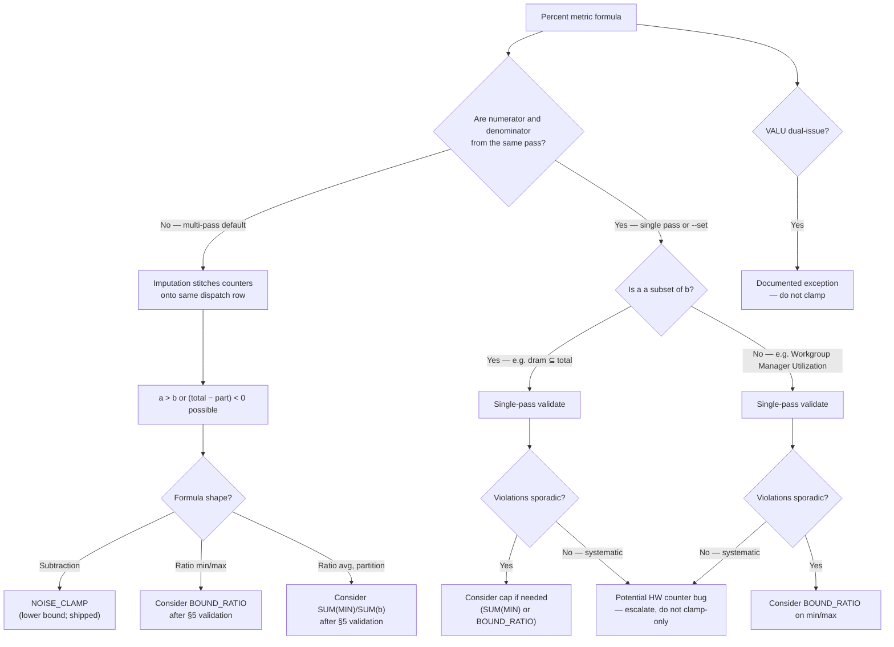

# Metric Counter Correction Methods — Design Guidance

**Status:** Draft design guidance  
**Context:** Percent and ratio metrics that violate expected bounds (e.g. > 100%, negative splits) due to multi-pass profiling variance, counter pairing semantics, or potential hardware counter issues — observed across CDNA/RDNA architectures during full-panel analyze runs.  
**Audience:** Primary — internal designers choosing correction methods for metric YAML; secondary — source material for future public-facing explanations.  
**Related code:** `src/utils/metrics/noise_clamper.py`, `src/utils/metrics/aggregation.py`, `src/rocprof_compute_soc/analysis_configs/profiling_counter_grouping_policy.yaml`

### Implementation status

§3.2 shows **target patterns** — some are shipped today, others are planned in a follow-up implementation PR. Use this table when reading examples or reviewing PRs against this doc.

| Component | Status | Where / notes |
|---|---|---|
| **`NOISE_CLAMP`** (`to_noise_clamp`) | **Shipped** | `noise_clamper.py`; Remote Read/Write and cache-split metrics (gfx940–950) |
| **Single-pass grouping** (allocator, `--set`, `--block`) | **Shipped** | `soc_base.py`, `profiling_counter_grouping_policy.yaml`; gfx115x has tier-0 entries, many arches (e.g. gfx942) empty |
| **Multi-pass imputation** | **Shipped** | `utils_analysis.py` — stitches counters across passes |
| **`ValuDualIssueDetector`** (VALU > 100% exception) | **Shipped** | `utils/metrics/common.py` — warnings, no clamp |
| **`BOUND_RATIO`** (`to_bound_ratio`) | **Proposed** | Helper + YAML registration — follow-up PR |
| **`SUM(MIN(a,b))/SUM(b)`** on partition avg (e.g. HBM Read Traffic) | **Proposed** | `1700_l2_cache.yaml` — follow-up PR |
| **`BOUND_RATIO` on min/max** (e.g. Workgroup Manager Utilization, CPC Stall) | **Proposed** | Panel YAML updates — follow-up PR |
| **Clamp diagnostics** (`BOUND_RATIO`, `SUM(MIN)`) | **Not started** | Open question §6 — only `NOISE_CLAMP` warns today |

---

## 0. How to use this document (internal designers)

This guidance is **hybrid**: a small set of **normative** rules for PR review, plus **advisory** patterns where thresholds and rollout scope are still evolving.

| Label | Meaning |
|---|---|
| **MUST** | Required for new or changed metric formulas; PR reviewers should block violations |
| **SHOULD** | Strong default; deviate only with rationale documented in PR or follow-up issue |
| **MAY** | Optional; designer judgment based on §5 validation |

### Normative rules (MUST)

1. **Prefer single-pass collection** for counters that appear in the same ratio or subtraction formula when perfmon budget allows (`--block`, `--set`, grouping policy).
2. **Subtraction formulas** where the result must be ≥ 0 (e.g. remote traffic, cache splits) **MUST** use `NOISE_CLAMP` — not raw `a − b` alone in Percent metrics.
3. **Validate-first (all ratio caps):** Before applying `BOUND_RATIO`, `SUM(MIN(a,b))/SUM(b)`, or similar caps on **any** Percent ratio — partition or non-partition — run §5 single-pass validation. Capping is a **decision after validation**, not a default.
4. **Partition metrics** (`a` is a subset of `b`, e.g. HBM Read Traffic): after §5 validation, if raw single-pass data already satisfies bounds, caps may be unnecessary. If violations are sporadic, `SUM(MIN(a,b))/SUM(b)` (avg) and/or `BOUND_RATIO` (min/max) may be appropriate. If systematic under single-pass, escalate — do not cap-only.
5. **Non-partition pairs** (e.g. Workgroup Manager Utilization) **MUST NOT** use `SUM(MIN(a,b))/SUM(b)`. After §5 validation, consider `BOUND_RATIO` on min/max only if violations are sporadic noise — capping is a display choice, not a physical invariant.
6. **VALU Utilization** and other **documented dual-issue exceptions MUST NOT** use `BOUND_RATIO` or similar capping; use existing detectors and user-facing warnings instead.
7. **Systematic violations under single-pass** on stable workloads **MUST NOT** be addressed by clamping alone — run §5.2 cross-checks and apply qualitative criteria in §5.4 before merging formula changes.

### Advisory guidance (SHOULD / MAY)

- Apply `BOUND_RATIO` or `SUM(MIN(a,b))/SUM(b)` **after** single-pass validation (§5) confirms clamping is appropriate — partition and non-partition metrics use the same validate-first gate.
- Add grouping-policy entries for high-priority ratio partners on specific arches.
- Adopt numeric thresholds in §5.4 **later** if the team agrees — **intentionally qualitative for now**; designers apply judgment with §5.2 cross-checks.
- Add diagnostics when `BOUND_RATIO` or `SUM(MIN)` adjust values (open question §6).
- Derive public-facing explanations from §7 when product/docs are updated.

---

## 1. Target Problems, Root Causes, and Correction Methods

### 1.1 Target problems

| Symptom | Typical metric types | User impact |
|---|---|---|
| **Percent avg > 100%** | HBM Read/Write Traffic, CPF Utilization | Aggregate fraction looks physically impossible |
| **Percent min/max > 100%** (often extreme) | Workgroup Manager Utilization, CPC Stall Rate, Data-Return Busy | Max column dominated by one bad dispatch (e.g. 739%) |
| **Negative derived values** | Remote Read/Write Traffic, cache split metrics | Subset subtraction goes negative |
| **Complementary parts do not sum to 100%** | HBM + Remote traffic | After independent corrections, totals may drift |

These symptoms appear across architectures more or less.

### 1.2 Root causes

| Root cause | Mechanism | When it dominates |
|---|---|---|
| **Multi-pass profiling** | Hardware perfmon slot limits require multiple replay passes; analyze **imputes** counters from different passes onto the same dispatch row (`utils_analysis.py`) | Default full analyze (`--block` all panels) |
| **Asynchronous counter sampling** | Counters in different IP blocks are not sample-aligned even within one pass | Short dispatches, low event counts |
| **Non-partition counter pairs** | Numerator and denominator measure different semantics (not strict subset) | Workgroup Manager Utilization: `GRBM_SPI_BUSY / GRBM_GUI_ACTIVE` |
| **Aggregate ratio inflation** | `SUM(a)/SUM(b)` exceeds 100% when some rows have `a > b`, even if most rows are valid | HBM avg on noisy workloads |
| **Potential hardware counter bugs** | Counter definition mismatch, overflow/wrap, incorrect event pairing, driver/firmware sampling defects, or IP-block timing that violates expected subset relationships | Persistent violations under **single-pass** collection on stable workloads; reproducible across runs, drivers, or partition modes |
| **Intentional hardware behavior** | gfx942 VALU dual-issue can exceed 100% utilization | VALU Utilization (documented exception) |

**Key insight:** A single PMC table row does **not** guarantee that all counters on that row were measured simultaneously unless they were collected in **one profiling pass**.

**Noise vs hardware bug:** Multi-pass variance and async sampling usually produce **sporadic, small** violations (often ≤ a few percent on avg; occasional large max on short dispatches). A **potential hardware counter bug** should be suspected when violations remain **large, frequent, or systematic** after controlling for collection conditions (single-pass, co-located counters, stable synthetic workload, sufficient dispatch count). Correction methods are designed for the former; they must not become the only signal for the latter.

### 1.3 Correction methods (overview)

| Method | Layer | What it fixes | Primary lever |
|---|---|---|---|
| **Single-pass counter grouping** | Profile (collection) | Prevents cross-pass stitching for related counters | `profiling_counter_grouping_policy.yaml`, `--set`, greedy coalescing in `soc_base.py` |
| **`NOISE_CLAMP`** | Analyze (formula) | Negative values from subtracting counters (`a − b < 0`) | Lower bound → 0, with diagnostics |
| **`BOUND_RATIO`** | Analyze (formula) | Per-row ratio > 100% before min/max aggregation | Upper bound → 100% (silent today) |
| **`SUM(MIN(a,b))/SUM(b)`** | Analyze (formula) | Aggregate avg inflation from `SUM(a)/SUM(b)` | Cap numerator per row before summing (avg columns only) |

Methods compose: **grouping** addresses the cause; **clamp/cap helpers** are downstream guards when multi-pass or noise remains unavoidable. None of the analyze-time helpers **prove** a violation is noise — see §2.5 (masking risk) and §5 (validation cross-checks).

---

## 2. Method Definitions, Pros, and Cons

### 2.1 Single-pass counter grouping

**Definition:** Place counters that appear together in ratio or subtraction formulas into the same PMC perfmon bucket so they are collected during the same kernel replay pass.

**Implementation today:**

- Greedy coalescing allocator in `soc_base.py` packs counters into `pmc_perf` files.
- `profiling_counter_grouping_policy.yaml` assigns **tier-0 priority** to metric IDs that should coalesce first (`same_bucket_priority_metric_ids`).
- User-facing shortcuts: `--set <name>` (predefined single-pass subsets), reduced `--block` selections.

| Pros | Cons |
|---|---|
| Fixes the problem at the source — row-level counters are co-temporal | Cannot fit all panel counters in one pass on most workloads |
| No analyze-time distortion | Requires ongoing policy maintenance per arch and metric |
| Best accuracy for partition counters (`dram ⊆ total`) | Does not help non-partition pairs (e.g. Workgroup Manager Utilization) |
| Reduces need for silent clamping | Many arches (e.g. gfx942) have empty `same_bucket_priority_metric_ids` today |

**Masking risk (HW bugs):** **Lowest among analyze-time methods.** Single-pass grouping does not alter counter values; violations visible in raw PMC data remain visible in analyze output. This is the preferred way to **validate** whether remaining anomalies are collection artifacts or potential hardware/driver issues.

---

### 2.2 `NOISE_CLAMP` (`to_noise_clamp`)

**Definition:** For a **difference** and its **reference**, clamp negative differences to zero and emit a warning when relative error ≥ 1%.

```python
# src/utils/metrics/noise_clamper.py
result = difference if difference >= 0 else 0.0
```

| Pros | Cons |
|---|---|
| Correct for physically impossible negatives (subset subtraction) | Does **not** fix ratios > 100% |
| Warns when variance is significant (≥ 1% relative) | Only handles **lower** bound, not upper |
| Already deployed for L2 cache split metrics across gfx940–950 | Complementary metrics corrected independently may not sum to exactly 100% |
| Aligns with CHANGELOG guidance on multi-pass variance | Assumes negative = noise; systematic bias could be masked |

**Masking risk (HW bugs):** **Moderate.** A warning fires at ≥ 1% relative error, which helps surface frequent subtraction failures. However, clamping still **replaces** the raw value in the metric output, so a **persistent** negative (bug or mis-defined counter pair) can look like a clean 0% with only a summary warning at end of analyze. Cross-check raw PMC rows under single-pass before trusting corrected Remote/split metrics alone.

**When to use:** Formulas that **subtract** counters where the result must be ≥ 0 (remote traffic, cache residency splits).

---

### 2.3 `BOUND_RATIO` (`to_bound_ratio`)

**Definition:** Compute per-row `(numerator / denominator) × scale`, capping the result at `cap` (default 100). Used before `MIN()` / `MAX()` aggregation on min/max columns.

```python
# src/utils/metrics/aggregation.py
return (num / safe_den * scale).clip(upper=cap)
```

| Pros | Cons |
|---|---|
| Fixes min/max column explosions (739% → 100%) | **Silent** today — no diagnostic when capping fires |
| Preserves per-dispatch min/max semantics | Assumes numerator should not exceed denominator — wrong for non-partition pairs if applied blindly to avg |
| Minimal impact when ratios are already ≤ 100% | Does not fix aggregate `SUM/SUM` avg inflation by itself |
| Composable with existing YAML expression engine | Can hide systematic counter bugs if over-applied |

**Masking risk (HW bugs):** **High when silent; moderate if diagnostics added.** A systematic `a > b` bug (e.g. subset counter always over-counts) produces capped 100% min/max with **no trace** in current implementation. Large one-off spikes (739% Workgroup Manager Utilization max) are clearly noise; **repeated** capping on the same counter pair under single-pass is a red flag — escalate to hardware/driver review, not more clamping.

**When to use:** Min/max columns for Percent metrics where `numerator / denominator` should represent a utilization or traffic **share**.

**Validate before cap:** Applies to **partition and non-partition** metrics equally. Run §5 single-pass cross-checks first. Apply `BOUND_RATIO` only when violations shrink to sporadic noise (short dispatches, multi-pass residual). If violations remain systematic under single-pass, **do not cap** — investigate counter semantics or potential hardware issues instead.

**Non-partition pairs** (e.g. Workgroup Manager Utilization): capping is a display choice, not a physical invariant — validation is required before any cap decision.

---

### 2.4 Aggregate numerator capping — `SUM(MIN(a,b))/SUM(b)`

**Definition:** For **avg** columns using volume-weighted fractions, cap each row's numerator at the denominator before summing:

```yaml
avg: 100 * SUM(MIN(a, b)) / SUM(b)
```

Mathematical guarantee: `MIN(aᵢ, bᵢ) ≤ bᵢ` for all rows → aggregate ratio ≤ 100%.

| Pros | Cons |
|---|---|
| Preserves volume weighting of `SUM(a)/SUM(b)` | Only valid when `a` is a **subset** of `b` |
| Fixes avg inflation (e.g. 103.23% → 100%) without changing min/max logic | Discards excess `a − b` on inflated rows (slight under-count) |
| Mathematically bounded | Not interchangeable with min/max column formulas |
| Same weighting semantics as uncapped aggregate | Silent — no warning when capping occurs |

**Masking risk (HW bugs):** **High when silent.** Discards `a − b` excess on every inflated row before summing, so a **biased** subset counter that consistently over-reports can still yield a plausible avg ≤ 100%. The under-count is invisible unless raw `a` and `b` are inspected. Always cross-check uncapped `SUM(a)/SUM(b)` under single-pass when validating new counter definitions.

**Validate before cap:** Same gate as §2.3 — run §5 single-pass cross-checks first for **all** partition metrics. Apply `SUM(MIN(a,b))/SUM(b)` only when single-pass data shows sporadic avg inflation (not systematic `a > b`). If single-pass raw data is already ≤ 100%, no cap is needed.

**When to use (if validation supports it):** Avg columns for **partition** Percent metrics (HBM traffic, busy/(busy+idle) when structurally safe).

---

### 2.5 Masking risk summary

How much each method can hide a **potential hardware counter bug** (persistent wrong counts, not one-off multi-pass noise):

| Method | Masking risk | What remains visible | Escalation signal |
|---|---|---|---|
| **Single-pass grouping** | Low | Raw ratios in analyze; same formula, cleaner inputs | Violations still > 100% or negative after single-pass |
| **`NOISE_CLAMP`** | Moderate | Summary warning count; raw PMC if inspected manually | Warnings on most dispatches; large rel. error under single-pass |
| **`BOUND_RATIO`** | High (today) | Nothing in metric output unless raw PMC reviewed | Same metric capped on many dispatches under single-pass |
| **`SUM(MIN(a,b))/SUM(b)`** | High (today) | Uncapped aggregate only if formula run separately | Avg always 100% while raw `SUM(a)/SUM(b)` still > 100% under single-pass |

**Principle:** Analyze-time corrections improve **user-facing plausibility** for known collection noise. They are **not** a substitute for validating counter correctness under stable collection conditions (§5).

---

## 3. Examples

### 3.1 Abstract examples

Assume three dispatches. All formulas use Percent scale (× 100).

#### Problem A — aggregate avg inflation (`SUM(a)/SUM(b)`)

| Dispatch | `a` | `b` |
|---:|---:|---:|
| 1 | 110 | 100 |
| 2 | 100 | 100 |
| 3 | 100 | 100 |

| Method | Formula | Result |
|---|---|---:|
| Raw | `SUM(a)/SUM(b) × 100` | `(110+100+100)/300 × 100` = **103.33%** |
| Aggregate cap | `SUM(MIN(a,b))/SUM(b) × 100` | `(100+100+100)/300 × 100` = **100.00%** |

#### Problem B — min/max column explosion

| Dispatch | `a` | `b` | `a/b` |
|---:|---:|---:|---:|
| 1 | 50 | 100 | 50% |
| 2 | 120 | 100 | 120% |

| Method | Formula | Result |
|---|---|---:|
| Raw max | `MAX(a/b) × 100` | **120%** |
| `BOUND_RATIO` max | `MAX(BOUND_RATIO(a,b))` | `MAX(50%, 100%)` = **100%** |
| Wrong tool: aggregate cap | `SUM(MIN(a,b))/SUM(b) × 100` | `(50+100)/200 × 100` = **75%** ← not a max |

#### Problem C — negative subtraction (remote traffic)

| Dispatch | `total` | `part` | `total − part` |
|---:|---:|---:|---:|
| 1 | 100 | 110 | **−10** |

| Method | Formula | Result |
|---|---|---:|
| Raw | `(total − part) / total × 100` | **−10%** |
| `NOISE_CLAMP` | `NOISE_CLAMP(total − part, total) / total × 100` | **0%** (+ warning if ≥ 1% rel. error) |

#### Problem D — single-pass ideal (partition counters)

If `a` and `b` are co-collected in one pass and `a ⊆ b` by construction:

| Dispatch | `a` | `b` | `a/b` |
|---:|---:|---:|---:|
| 1 | 95 | 100 | 95% |
| 2 | 88 | 100 | 88% |

All methods agree; clamping is a no-op. Residual violations (> 100%) should be rare and small. **If violations are large or frequent here, treat as potential HW counter bug** — not a clamping candidate.

#### Problem E — distinguishing noise from potential HW bug

Same partition counters, **single-pass** collection, stable workload:

| Dispatch | `a` | `b` | `a/b` |
|---:|---:|---:|---:|
| 1 | 115 | 100 | 115% |
| 2 | 112 | 100 | 112% |
| 3 | 118 | 100 | 118% |

| Interpretation | Action |
|---|---|
| Multi-pass noise (typical) | Sporadic rows, small excess (≈1–5%), disappears or shrinks with single-pass |
| Potential HW counter bug | **Systematic** excess on most/all dispatches under single-pass; reproducible across runs |
| After `BOUND_RATIO` / `SUM(MIN)` | User sees ≤ 100%; **bug signal is hidden** unless raw PMC or uncapped formula is checked |

---

### 3.2 rocprof-compute metric examples

Examples below include **shipped** and **proposed** patterns — see **Implementation status** at the top of this doc.

#### Single-pass grouping *(shipped infrastructure; arch policy varies)*

**Goal:** Collect `TCC_EA0_RDREQ_DRAM_sum` and `TCC_EA0_RDREQ_sum` in the same pass.

| Approach | Example |
|---|---|
| Policy (gfx115x pattern) | Add metric id to `same_bucket_priority_metric_ids` in `profiling_counter_grouping_policy.yaml` |
| User shortcut | `rocprof-compute profile --set <l2_subset> ...` when the set includes both counters |
| Today on gfx942 | Policy map is `{}` — no arch-specific coalescing priorities for HBM traffic metrics |

**Real metric:** *HBM Read Traffic* (panel 1700, gfx942 `1700_l2_cache.yaml`)

---

#### `NOISE_CLAMP` *(shipped)*

**Real metric:** *Remote Read Traffic* (gfx942)

```yaml
avg: 100 * SUM(NOISE_CLAMP(TCC_EA0_RDREQ_sum - TCC_EA0_RDREQ_DRAM_sum, TCC_EA0_RDREQ_sum)) / SUM(TCC_EA0_RDREQ_sum)
```

When `TCC_EA0_RDREQ_DRAM_sum > TCC_EA0_RDREQ_sum` on a dispatch (multi-pass variance), remote goes negative → clamped to 0 with optional warning.

**Also used in:** Uncached/cached L2 splits, TCP hit-rate residuals (`1600_vector_l1_data_cache.yaml`), gfx950 memory bandwidth formulas.

---

#### `BOUND_RATIO` *(proposed — apply only after single-pass validation)*

**Real metric:** *Workgroup Manager Utilization* min/max (gfx942 `0600_workgroup_manager_spi.yaml`)

**Validation-first workflow:** Profile with minimal blocks so `GRBM_SPI_BUSY` and `GRBM_GUI_ACTIVE` are co-collected (§5.3). Inspect per-dispatch ratios in raw PMC. Apply cap in YAML only if violations are sporadic (e.g. one short-dispatch max spike), not systematic across dispatches.

```yaml
min: 100 * MIN(BOUND_RATIO($GRBM_SPI_BUSY_PER_XCD, $GRBM_GUI_ACTIVE_PER_XCD))
max: 100 * MAX(BOUND_RATIO($GRBM_SPI_BUSY_PER_XCD, $GRBM_GUI_ACTIVE_PER_XCD))
```

Reproduction example (mat_exp workload, multi-pass analyze): raw max **739.60%** → capped **100%** if cap is applied. **Decision to cap pending single-pass validation.**

**Also proposed for (after validation):** CPC Stall Rate, CPC Packet Decoding, Data-Return Busy, HBM Read/Write min/max.

---

#### `SUM(MIN(a,b))/SUM(b)` *(proposed — apply only after single-pass validation)*

**Real metric:** *HBM Read Traffic* avg (gfx942)

**Validation-first workflow:** Profile block 17.1 (or `--set`) so `TCC_EA0_RDREQ_DRAM_sum` and `TCC_EA0_RDREQ_sum` are co-collected (§5.3). Compare uncapped `SUM(a)/SUM(b)` vs per-dispatch ratios in raw PMC. Apply `SUM(MIN)/SUM(b)` in YAML only if single-pass avg still exceeds 100% due to sporadic row inflation — not if violations are systematic.

```yaml
avg: 100 * SUM(MIN(TCC_EA0_RDREQ_DRAM_sum, TCC_EA0_RDREQ_sum)) / SUM(TCC_EA0_RDREQ_sum)
```

Reproduction example (occupancy workload, multi-pass analyze): raw avg **103.23%** → capped **100.00%** if cap is applied. **Decision to cap pending single-pass validation.**

**Note:** Min/max for the same metric use `BOUND_RATIO` (also after validation) — different column semantics (see §3.1 Problem B).

---

#### Intentional exception — no clamp *(shipped)*

**Real metric:** *VALU Utilization* (gfx942)

Dual-issue on gfx942 can legitimately report > 100% (up to ~200%). Handled by `ValuDualIssueDetector` with user-facing warnings — **do not** apply `BOUND_RATIO`.

---

## 4. Practical Mental Model



**Decision shortcut:**

1. **MUST — Prefer** single-pass grouping for counters in the same formula.
2. **MUST — Subtract** counters in Percent splits → `NOISE_CLAMP`.
3. **MUST — Validate first** (§5) before any ratio cap — **partition and non-partition** use the same gate.
4. **SHOULD — After validation:** sporadic noise → consider `BOUND_RATIO` (min/max) or `SUM(MIN(a,b))/SUM(b)` (partition avg only); systematic violations → escalate, do not cap-only.
5. **MUST NOT —** `SUM(MIN(a,b))/SUM(b)` on non-partition pairs; `BOUND_RATIO` on VALU / documented exceptions.
6. **MUST — Document** intentional > 100% behavior (VALU) instead of clamping.

---

## 5. Validation and Cross-Checking Guidance

Use this workflow when authoring a new corrected metric, reviewing a clamping PR, or investigating whether anomalies indicate **collection noise** vs **potential hardware counter bugs**.

### 5.1 Stable collection conditions

Reduce confounding factors before comparing raw vs corrected values:

| Control | Purpose |
|---|---|
| **Single-pass collection** | Profile only the blocks/counters needed for the metric (`--block`, `--set`, or minimal panel subset) so ratio partners are co-temporal |
| **Counter grouping policy** | Ensure formula counters land in the same PMC bucket (`profiling_counter_grouping_policy.yaml` + coalescing in `soc_base.py`) |
| **Stable synthetic workload** | Prefer repeatable kernels (e.g. occupancy, rocflop, mat_exp) with sufficient dispatch count — avoid tiny or one-off dispatches that dominate min/max |
| **Fixed system config** | Same GPU, driver/ROCm version, partition mode (CPX/SPX), and clock state across A/B runs |
| **Multiple runs** | Confirm violations are sporadic (noise) vs reproducible (investigate further) |

### 5.2 Cross-checks to run

| Check | How | Pass criterion | Fail → investigate |
|---|---|---|---|
| **Raw vs corrected** | Compare uncapped formula output to clamped output on same workload | Small delta on avg; max capped only on outlier dispatches | Large or systematic delta on avg under single-pass |
| **Single-pass vs multi-pass** | Re-profile same workload with minimal blocks vs full panel | Violations shrink or disappear with single-pass | Same violation magnitude single-pass → not imputation alone |
| **Complementary metrics** | HBM + Remote (+ other splits) from same counter family | Splits approximately sum to 100% (exact sum not required after independent clamp) | Systematic drift; one side always clamped |
| **Partition invariant** | For `a ⊆ b`, inspect per-dispatch `a/b` in raw PMC CSV | ≤ 100% on nearly all rows, small excess on few rows | Majority of rows > 100% under single-pass |
| **Warning counts** | Review `NOISE_CLAMP` summary at end of analyze | Few warnings, low max rel. error | Warnings on most dispatches or high max rel. error |
| **Cross-arch / cross-mode** | Same workload on another arch or partition mode if available | Qualitatively similar (some variance expected) | Isolated to one arch/mode → arch-specific counter or driver issue |

### 5.3 Recommended validation profile recipe

Example for validating *HBM Read Traffic* counter pair on gfx942:

```bash
# 1. Profile L2 block only (single-pass friendly subset)
rocprof-compute profile --block 17.1 ... -n occupancy --output-directory workloads/validate_hbm/

# 2. Analyze with variance warnings enabled (default kernel-level summary)
rocprof-compute analyze --block 17.1 --path workloads/validate_hbm/

# 3. Inspect raw PMC: per-dispatch TCC_EA0_RDREQ_DRAM_sum vs TCC_EA0_RDREQ_sum
# 4. Compare uncapped SUM(a)/SUM(b) vs SUM(MIN(a,b))/SUM(b) on same data
```

Repeat with `--set` when a predefined set already co-packages the needed counters.

### 5.4 When to clamp vs when to escalate

**Threshold policy:** Criteria below are **qualitative by design** (option A). Internal designers apply professional judgment supported by §5.2 cross-checks — not fixed numeric gates or CI enforcement at this stage. Tighten to numeric thresholds only if the team agrees after collecting single-pass validation data.

| Observation under single-pass + stable workload | Likely cause | Action |
|---|---|---|
| Sporadic ratio > 100% (**partition or non-partition**) under single-pass | Multi-pass residual, short dispatch, or async sampling | Consider cap (`SUM(MIN)` for partition avg; `BOUND_RATIO` for min/max) if §5 confirms noise |
| **Partition** metric systematic > 100% under single-pass | Potential HW counter bug or wrong event pairing | **Do not** cap-only; escalate — subset invariant should hold co-temporally |
| **Non-partition** metric (e.g. Workgroup Manager Utilization) > 100% | May be semantics or denominator collapse | Same validate-first gate; cap min/max only if sporadic after single-pass |
| Single dispatch max spike (e.g. >> 200%) with tiny denominator | Denominator collapse / short dispatch | `BOUND_RATIO` on max; note in docs |
| Most dispatches > 100% by similar margin | Potential HW counter bug or wrong event pairing | **Do not** rely on clamp alone; file driver/hardware investigation |
| Persistent negative subtraction | Bug or mis-defined subset | Fix formula or counter definition; `NOISE_CLAMP` is display-only |
| Documented exception (VALU dual-issue) | Intentional hardware behavior | Warn user; exclude from ≤ 100% acceptance criteria |

---

## 6. Open Questions

1. **CDNA grouping policy:** Should `profiling_counter_grouping_policy.yaml` gain entries (e.g. gfx942) coalescing HBM, GRBM, and CPC counter pairs? What is the perfmon budget trade-off?

2. **Silent vs diagnostic capping:** Should `BOUND_RATIO` and `SUM(MIN)/SUM(b)` adopt `NOISE_CLAMP`-style warnings when values are adjusted (threshold, counter, summary at end of analyze)? This is critical for not masking potential HW counter bugs.

3. **Scope of `BOUND_RATIO` rollout:** Which Percent metrics across gfx940/942/950 (and other arches) should be updated, and in what priority order?

4. **Avg column consistency:** Should avg columns using `SUM(n)/SUM(d)` for non-partition pairs (e.g. Workgroup Manager Utilization) ever be capped, or only min/max after single-pass validation shows sporadic noise?

5. **Complementary metric consistency:** After independent clamping on HBM (`MIN`/`BOUND_RATIO`) and Remote (`NOISE_CLAMP`), should we enforce or document that splits may not sum to exactly 100%?

6. **Single-pass validation:** Can we add analyze-time metadata (pass-id per counter group) to detect when ratio partners were not co-collected and warn before clamping?

7. **Source of truth:** Panel YAML headers say `Generated from utils/unified_config.yaml` / `split_config.py`, but those paths are **not present in this repository tree** (likely legacy or internal-only). Today, metric formulas live in `src/rocprof_compute_soc/analysis_configs/gfx*/*.yaml` and are validated via `tools/config_management/` (see `CONTRIBUTING.md`). Should correction patterns be documented/enforced there instead?

8. **Acceptance criteria for Percent metrics:** Should product/docs explicitly list exceptions (VALU dual-issue) rather than requiring all Percent ≤ 100%?

9. **Imputation alternatives:** Is forward/backward fill imputation the best merge strategy, or should ratio metrics skip rows where partners came from different passes?

10. **Testing strategy:** What reference workloads and thresholds should gate regression tests for clamping (before/after bounds, warning counts)?

11. **HW counter bug triage:** What process links repeated single-pass violations to driver/firmware/hardware teams vs rocprof-compute formula fixes?

12. **Automated validation:** Should CI include single-pass golden workloads that assert raw (uncapped) partition invariants before corrected metrics ship?

---

## 7. Public-facing notes (draft)

*Secondary audience — port to FAQ, conceptual docs, or analyze warnings when ready. Not user documentation yet.*

- **Why can some Percent metrics exceed 100%?** Multi-pass profiling merges counters from different replay passes; occasional misalignment can inflate ratios. Corrections cap physically implausible values for display.
- **Why is VALU Utilization sometimes > 100%?** On some GPUs (e.g. gfx942), dual-issue execution can exceed 100% — this is expected, not a bug.
- **What do “counter variance corrected” warnings mean?** A subtraction-based metric had a negative intermediate value (usually multi-pass noise) and was clamped to zero.
- **Do HBM + Remote always sum to 100%?** Not exactly after independent corrections; each split is sanitized separately.

---

## References

- **Motivating example:** AIPROFCOMP-78 (Percent metrics > 100% on MI300X CPX — one reproduction case among several arches)
- `CHANGELOG.md` — Known issues: negative values and multi-pass variance (v3.3.x)
- `src/utils/utils_analysis.py` — Multi-pass data imputation
- `src/rocprof_compute_soc/analysis_configs/profiling_counter_grouping_policy.yaml` — Coalescing priorities
- `src/utils/metrics/noise_clamper.py` — `NOISE_CLAMP` implementation
- `src/utils/metrics/aggregation.py` — `BOUND_RATIO` (**proposed** in follow-up PR)
