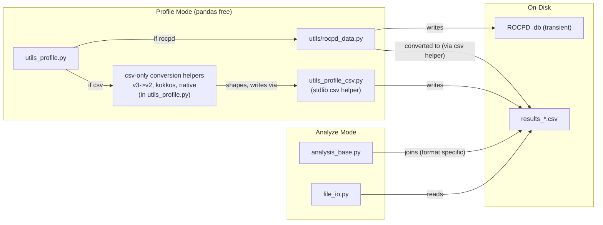
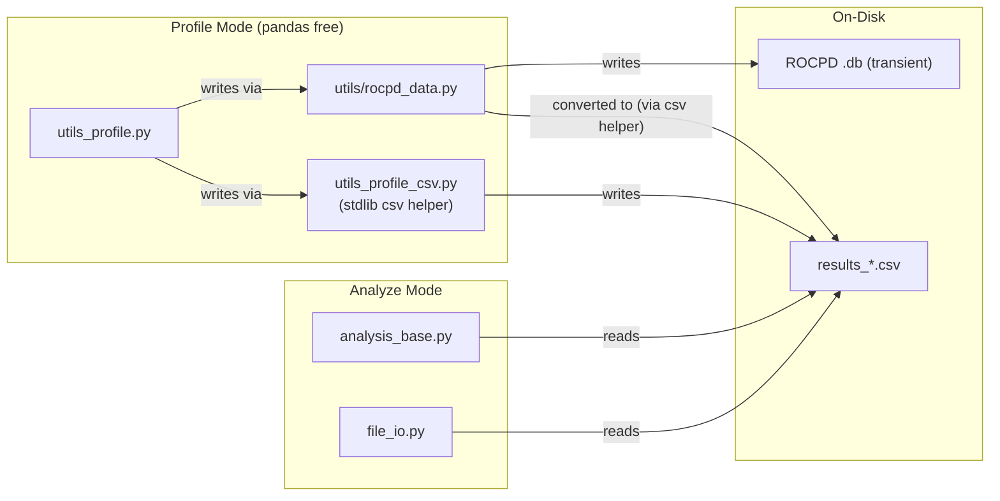
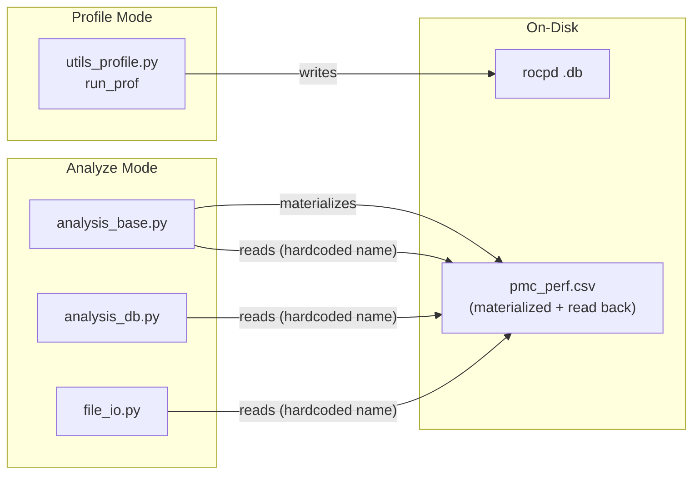
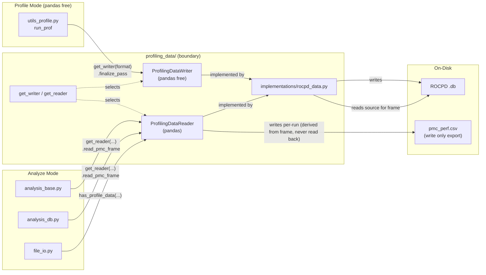
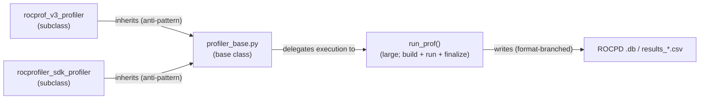
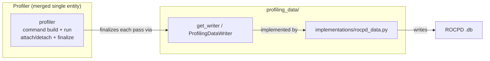
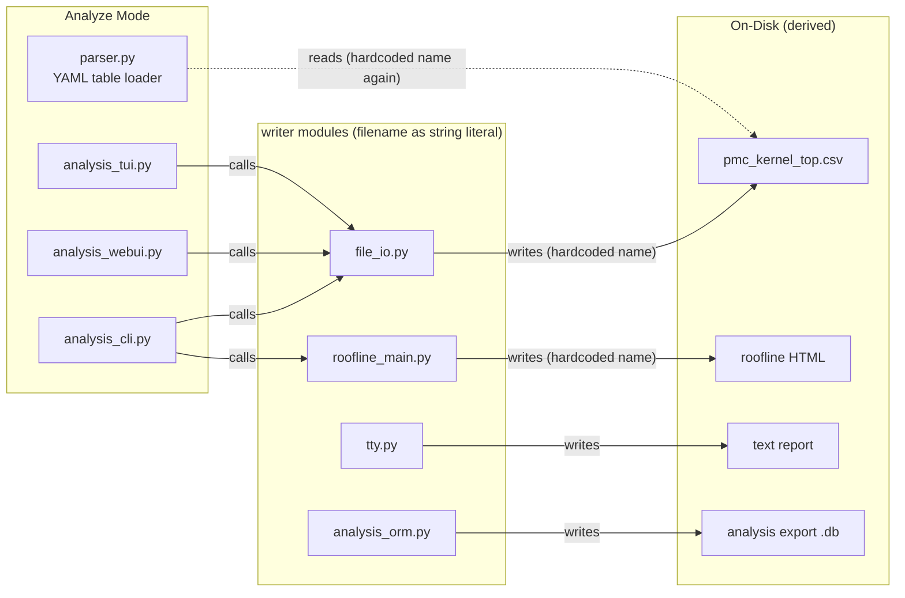
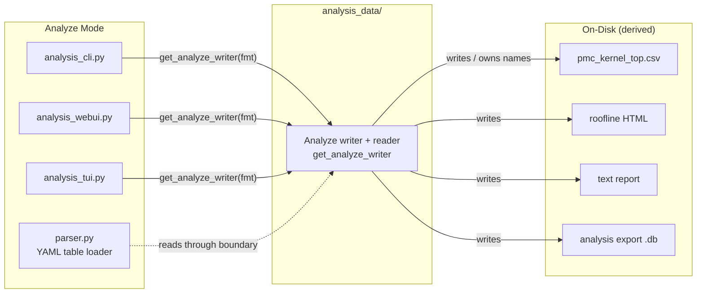

# Profile Interface Architecture

Status: proposal

This document describes the architecture for profile data storage and access in
rocprofiler-compute, and records the decisions made in the design review so the
reasoning behind them is not lost. The goal is to keep storage-format knowledge
in one place behind a clear boundary, so ROCPD, profiler-hub, parquet, or any
future source can be added as a single implementation instead of forcing
profiling, analysis, CLI, TUI, WebUI, and utility code to change with it.

> File names and code locations
> change quickly and should not be treated as final, also "Before" diagrams describe the state of
> the develop branch at the time of writing and will become historical once the
> phases are merged to develop.

## Problem

Profile data storage is becoming more varied:

- ROCPD `.db` is becoming the default and canonical profile output.
- The native tool is expected to write counters data directly into a SQLite/ROCPD database via
  profiler-hub.
- Parquet is a possible future option for large workloads.

Today the writing, reading, joining, and pivoting of profile data are thinly
spread across many modules. On-disk file names are hardcoded in multiple places,
and the same modules mix csv joins, rocpd extraction, and analysis expectations.
Every new storage format therefore touches many unrelated modules, which raises
the cost and risk of each change.

There is also a concrete performance motivation where on large (AI) workloads,
profile and analyze time were dominated by redundant reads, writes, and pivots
of intermediate CSVs over millions of rows. We can remove those intermediates by
going straight to an in-memory frame.

## Goal

Put PMC profile data storage behind one boundary with a clear reader and writer
contract:

- Profile mode finalizes data through a **writer**.
- Analyze mode reads data through a **reader** that returns the in-memory frame.
- No other module knows whether the source is ROCPD, profiler-hub, or a future
  format, and no other module knows where or how it is stored on disk.

Adding a new storage format should mean adding one implementation behind the
boundary and extending one selection point — not editing profiling, analysis,
and utility code.

## User visible architectural Decisions (AD)

The purpose of this section is to outline architectural decisions which potentially impact user experience in order to simplify receiving feedback on them.
For this purpose this also outlines ADs motivation and possible mitigation strategies.

### AD-1: The CSV profile output format support is removed, rocpd becomes the default profile source. 

This covers both halves of the CSV backend: the profile-side path that chose and wrote csv, and the analyze-side path that read CSVs.

Primary motivation is that keeping both csv and rocpd forces two parallel storage implementations with different dependencies. 
This doubles enabling effort for new analysis types or forces addition of "not supported in CSV" warnings to be sprinkled across every new feature. 
Additionally, profile data is an intermediate artifact, which is consumed by analysis phase of rocprof-compute. 
Therefore, impact to the end-user is expected to be low.

Users who want to collect profiling data to csv will need to install older version.
Also ROCm SDK rocpd tool allows conversion to CSV as one of the supported formats.
If there is future strong request to return CSV support, we may implement it under a newly defined interface.

*Note: The `results_*.csv` intermediate that the rocpd path still emits is removed later with the reader boundary (AD-3), not here.*

### AD-2: Remove the rocprofv3 backend so rocprofiler-sdk is the lone backend

Remove `rocprofv3` backend and simplify `rocprofiler-sdk` backend by removing unnecessary inheritance in code.
Both of these backends collect data via rocprofiler-sdk-tool shared library loaded into the target process.
`rocprofv3` backend is a legacy mode, which adds a redundant rocprofv3 script invocation layer and this adds complexity to the system.
This mode is set via environment variable and is expected to be generally not used by customers.

### AD-3: Analyze scripts don't generate intermediate `pmc_perf.csv` by default anymore

Eliminate `pmc_perf.csv` generation step, so analysis converts profile output directly to pandas dataframe in memory.

Currently, EVERY analyze run materializes `pmc_perf.csv` and then reads it back.
Therefore all profile formats go through a CSV regardless of how they were stored.
This has performance cost and defeats the point of supporting varied storage and adds large csv pivot cost on big workloads. 
Also this introduces unnecessary dependency as any output format reader is forced to also produce a CSV just so downstream analyze code can read it.

Essentially, `pmc_perf.csv` is an intermediate not a public contract, so analyze should not depend on it.

The merged frame depends on the user's **analysis filters**, so a one time materialize and reuse does not work. 
The reader builds the frame from source **per analysis run** with filters applied in memory and the `pmc_perf.csv` export is derived from that frame.

However, `pmc_perf.csv` generation could be useful for debugging purposes and some users may use it in their flow.
Therefore, we will add a new debug option `--gen-pmc` which implements one-way export of this file.
However, analysis scripts will not read its back.

### BOUNDARIES in these ADs to mention:
#### Unit tests do not touch disk

Disk I/O lives behind a thin, transparent adapter (like 
header/row write primitives) that is intentionally left untested. Tests that write to disk leave stray artifacts when they crash, can exhaust CI storage, and depend on system resources.
Unit tests mock the writer/reader and assert on what is passed rather than writing or
reading real files. The boundary makes disk free testing natural as in the same writer interface that production uses is swapped for an in memory fake in tests

#### No pandas in profiling

Already discussed at length and merged to current develop pipeline, this boundary has to be respected in this design as well as in profiling code must not depend on pandas or other analysis only
dependencies. The boundary exposes a **writer** used by
profiling (pandas-free) and a **reader** used by analysis (pandas is fine here), packaged
together but with different dependency characteristics.

## Phasing and Acceptance

Phase order: A (remove CSV) -> B (`profiling_data` boundary) -> C (backend
execution) -> D (`analysis_data` boundary), plus follow-ups (e.g. A-2, removing
the now-dead `--join-type` option). Once Phase A lands, B, C, and D have no hard
ordering dependency on each other.

## Phase A: Remove the CSV Profile Backend

Phase A deletes the csv format choice and the csv-format analyze branch, but
keeps the rocpd read path (`results_*.csv` -> `pmc_perf.csv`). Moving analyze off
`results_*.csv` / `pmc_perf.csv` to read `.db` directly is Phase B.

### Before

### Target

Removed in this phase:

- the `if csv` branch in `utils_profile.py` and related csv-only conversion helpers 
- the `--format-rocprof-output` flag and its uses (default and only output becomes rocpd)
  - while this phase results in a single format output being rocpd, we still keep the variable _PROFILE_OUTPUT_FORMAT to align with the Phase B boundary to leave the door open for future formats.
- related csv-only test functions
- analyze no longer supports csv-shaped workload directories. 

Intentionally **kept** in this phase:

- Rocpd path still converts each `.db` into `results_*.csv`,
  and analyze still reads `results_*.csv` through the rocpd concat path. Removing
  it requires analyze to read the frame directly from `.db`, which is the reader
  contract introduced in Phase B (AD-3).
- `utils_profile_csv.py`. It is still a necessary csv helper file used by the
  rocpd path, `sysinfo.csv`, and marker-trace augmentation. It is removed as csv intermediates are eliminated in later phases.

Note: Two workloads in rocprof-compute /vcopy/MI350 currently store csv intermediates, and were generated before rocpd support was added. These workloads must be regenerated to match the other workloads, all of which have rocpd intermediates.

### Phase A-2: Remove the now-dead `--join-type` option

`--join-type {kernel,grid}` only ever fed the csv-format wide merge in
`join_prof`. With that merge removed in Phase A, nothing
in `src/` reads it, and `grid` vs `kernel` now produce identical output
Removing it is a small follow-up to Phase A rather than part of the csv-output
removal itself because it also deletes user-facing surface, the dedicated
`join_type_grid` / `join_type_kernel` golden workloads, their related tests,
and the `--join-type` references in the docs.

## Phase B: The Profiling Data Boundary

The boundary owns where PMC profile source data lives and how it is read/written, and exposes two contracts:

- `ProfilingDataWriter.finalize_pass(context)` which records a completed profiling
  pass at the end of profile mode (pandas free)
- `ProfilingDataReader.read_pmc_frame(workload_dir, filters)` which returns the pmc
  df built from source for its respective analysis run
- `ProfilingDataReader.has_profile_data(workload_dir)` which reports whether readable
  profile data exists so callers stop string matching for specific and hardcoded file names.

Callers obtain an implementation through selection functions rather than
constructing implementations directly:

- `get_reader(profiling_config, options)` returns the correct reader.
- `get_writer(format)` returns the correct writer.

This is the only place that maps a configured format to an implementation.

### Before

### Target

The reader reads its storage implementation, normalizes source specific rows into
the PMC DataFrame, applies the analysis filters in memory, and returns the frame.
Analyze callers never branch on storage format, construct file paths, or read
`pmc_perf.csv`.

> The diagrams show only the PMC counter data path which is all this boundary
> moves. A workload directory contains many other files (`roofline.csv`, traces,
> `sysinfo.csv`, `profiling_config.yaml`, perfmon configs, and derived analyze
> outputs) which are deliberately left unchanged here as they are either untouched by this abstraction or addressed in future phases.

## Phase C: Backend Execution

Backend execution which controls command construction, environment setup, attach/detach,
subprocess execution, and pass finalization is separate from profile data
storage. This phase removes rocprofv3 (AD-2) and merges the backend into a
single profiler entity.

Today `profiler_base` is a base class with `rocprof_v3_profiler` and
`rocprofiler_sdk_profiler` as subclasses, and the bulk of execution lives in a
very large `run_prof` function. With v3 gone there is a single backend, so the
two are merged into one cohesive profiler entity that finalizes each pass through
the writer from Phase B.

### Before

### Target

## Phase D: Analyze-Data Boundary

The boundary above covers profile source data. Analyze mode also produces its
own derived files such as `pmc_kernel_top.csv`, `pmc_dispatch_info.csv`, roofline HTML,
etc, and each is currently written with a
hardcoded name in the code that produces it, with the same names being hardcoded
again on the read-back side. This deserves its own boundary so analyze-output
location and format knowledge does not spread the way profile-data knowledge did.

`analysis_data/` is symmetric with `profiling_data/`: `profiling_data/` owns
where profile *source* data lives; `analysis_data/` owns where analyze-*derived*
outputs go. It is a writer/reader for derived outputs not a storage format
implementation.

### Before

### Target

## Future Scope

1. PC-sampling analyze reads JSON produced by profile mode. That is another
   format that should eventually sit behind a similar boundary (likely a JSON
   implementation); noted for future scope.

## Success Criteria

- Profile mode cannot produce, and analyze mode cannot read, the legacy csv
  output format; rocpd is the only profile source (Phase A)
- Profile mode does not decide or know the storage layout, and does not depend on
  pandas
- Analyze mode can ask for a pmc DataFrame without knowing what the source is and without reading `pmc_perf.csv`.
- `pmc_perf.csv` is written as a one-way export derived per run, and analyze no
  longer reads it back. This saves a lot of csv processing especially on large workloads.
- Workload availability checks go through `has_profile_data()` rather than probing
  for specific files
- Storage-format conditionals are isolated to `get_reader` / `get_writer` and the
  implementations
- Adding a new profile source primarily means adding one implementation and
  extending selection in one place (high locality of change)
- The boundary can be exercised in unit tests without touching disk
