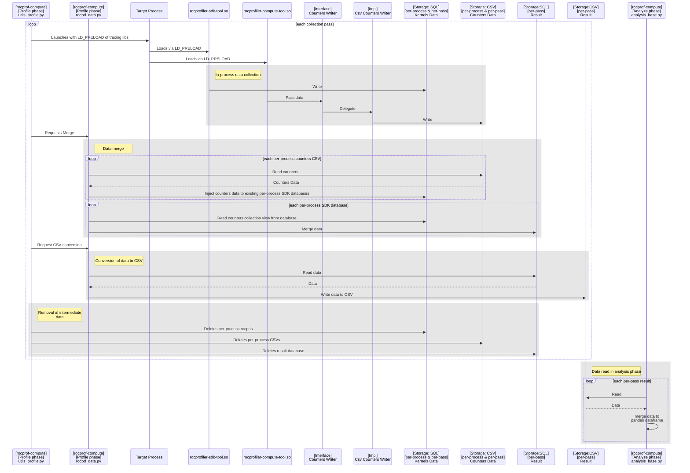
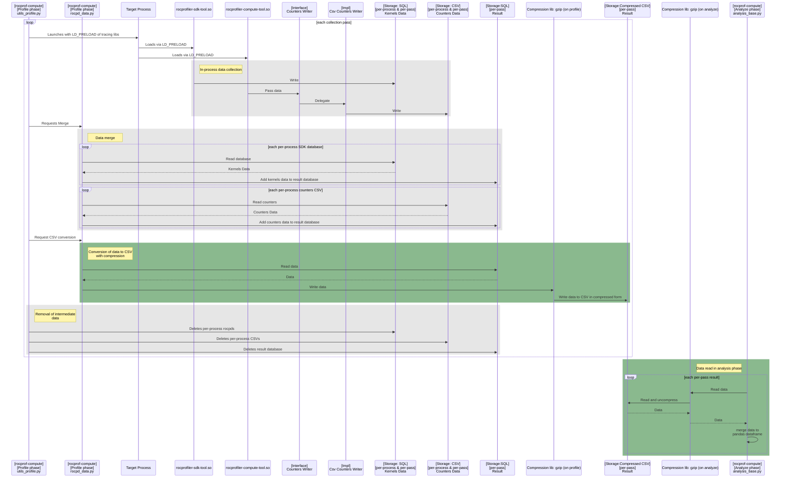
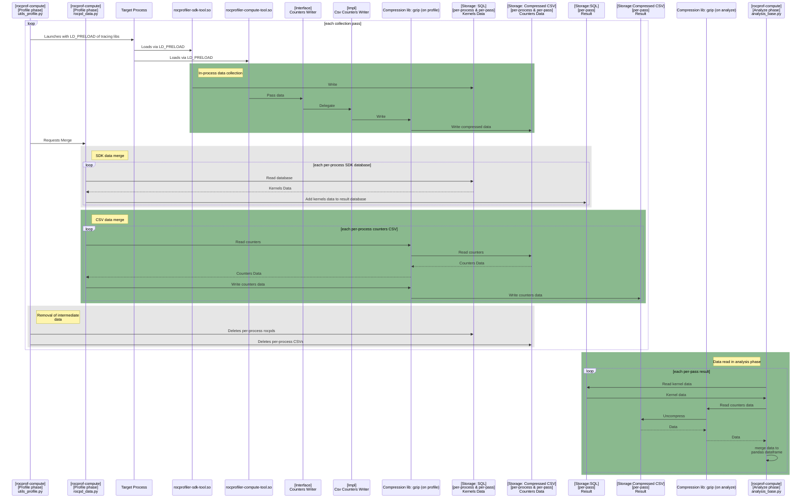

## Context
### Current collection architecture
- Collection mode: rocpd

## Design
### Addition of compression at CSV read/write

### Removal of CSV conversion at the end
- Results from SDK and native collector are processed independently on all phases: profiling and analysis. This is so that we can implement different architectural decisions for them, ex. Profiler Hub integration.
- Do we actually need to have CSV data merge?
    - It adds certain complexity and unknown performance hit.
    - Profiling scripts have to know how to read back the data in order to merge it.

